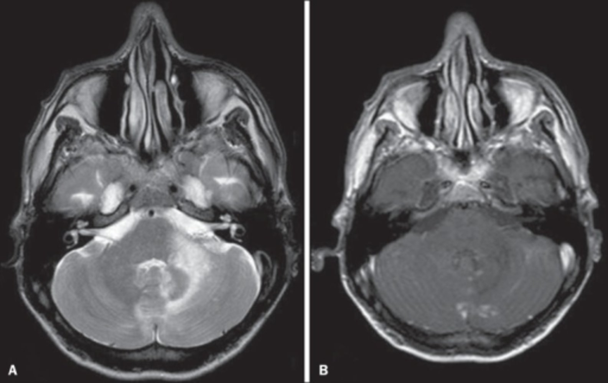
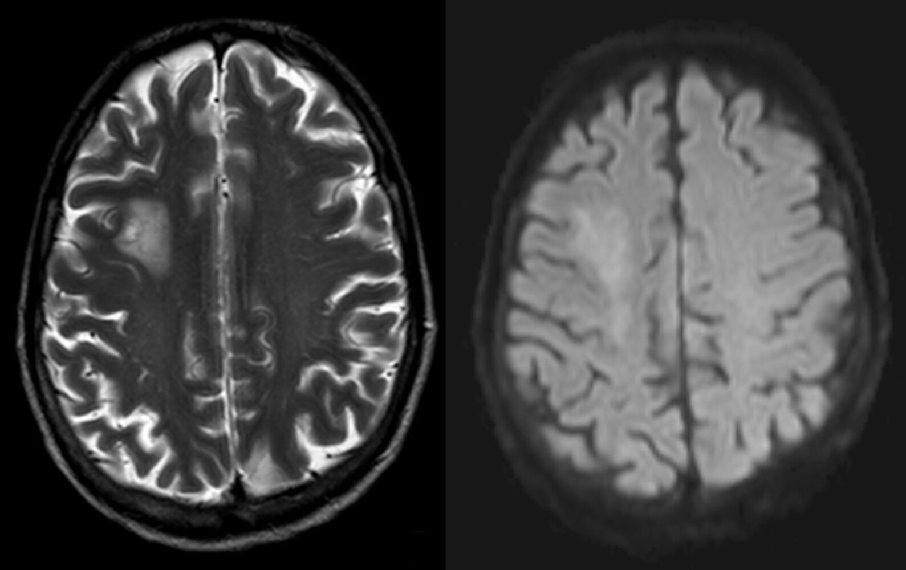
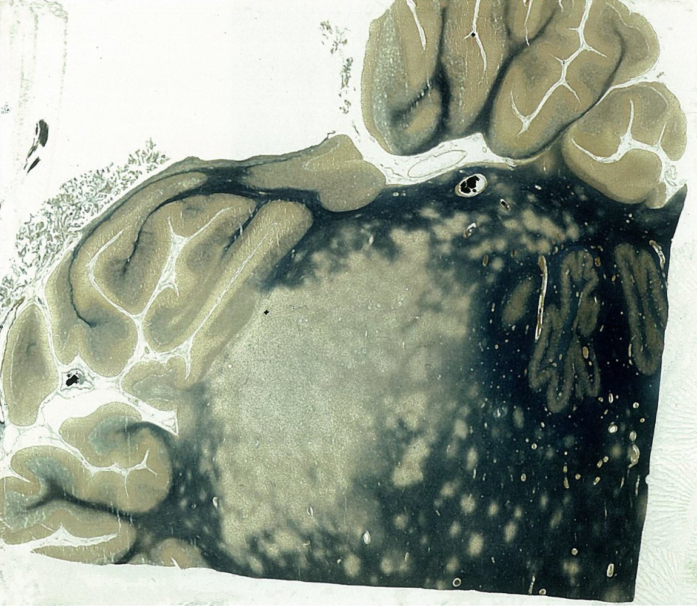
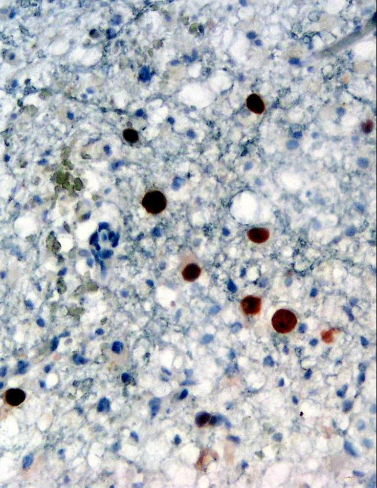

# Progressive multifocal leukoencephalopathy

*Categories: Clinical knowledge > Internal medicine > Infectious diseases > Infections of the central nervous system > Progressive multifocal leukoencephalopathy*

[Original Article Link](https://coursology-qbank.com/amboss/article/CH0qsh)

---

## Summary

Progressive multifocal leukoencephalopathy (PML) is a <u>demyelinating</u> disease of the <u>CNS</u> caused by the reactivation of the <u>JC virus</u>. It occurs mainly in patients with severe <u>immunosuppression</u> (e.g., <u>AIDS</u>) and clinical manifestations include <u>focal neurological deficits</u>, <u>seizures</u>, and <u>vision</u> changes. The diagnosis is usually made based on typical imaging findings, but <u>brain biopsy</u> is the <u>gold standard</u> for diagnosis. Treatment is primarily supportive, and in patients with <u>HIV</u>, <u>ART</u> should be started immediately.

See also “<u>HIV-associated conditions</u>.”

---

## Definitions

A <u>demyelinating</u> disease of the <u>central nervous system</u> caused by the <u>JC virus</u>

---

## Epidemiology

* Mainly in patients with severe <u>immunosuppression</u> (e.g., patients with <u>lymphoma</u>/<u>leukemia</u>, patients that received <u>organ transplantation</u>)

* In patients with <u>HIV</u> [[2]](https://coursology-qbank.com/amboss/article/05XeiA)

* Affects ∼ 5% of <u>AIDS</u> patients (typically at <u>CD4 count</u> < 200/mm³)

* Can also occur after initiation of <u>ART</u> secondary to <u>immune reconstitution inflammatory syndrome</u> (IRIS)

* Can also occur in patients with <u>HIV</u> well-controlled on <u>ART</u>

Epidemiological data refers to the US, unless otherwise specified.

---

## Etiology

* Reactivation of <u>JC virus</u> in the setting of <u>immunosuppression</u> due to: [[2]](https://coursology-qbank.com/amboss/article/05XeiA)

* <u>HIV infection</u> (<u>AIDS-defining</u> <u>opportunistic infection</u>)

* Hematological and solid cancers

* Inflammatory diseases

* Treatment with <u>immunosuppressants</u> or immunomodulators: e.g., <u>natalizumab</u>, <u>rituximab</u>

---

## Pathophysiology

Reactivation of a past subclinical infection with <u>JC virus</u> is triggered (e.g., by <u>immunosuppression</u>) → <u>oligodendrocyte</u> infection → viral <u>DNA</u> mutation;   → aggressive replication within <u>brain</u> tissue → <u>demyelination</u>, destruction of infected <u>oligodendrocytes</u> [[3]](https://coursology-qbank.com/amboss/article/5tXiV-)

---

## Clinical features

Symptoms due to PML are insidious in onset and can progress over several weeks. [[2]](https://coursology-qbank.com/amboss/article/05XeiA)

* <u>Focal neurologic deficits</u>: e.g., <u>hemiplegia</u>, <u>aphasia</u>, <u>ataxia</u>

* <u>Seizures</u>

* Impaired attention

* <u>Vision</u> alterations, most commonly <u>hemianopsia</u>

* Isolated <u>encephalopathy</u>, <u>dementia</u>, <u>altered mental state</u>, and behavioral changes are uncommon but may occur alongside <u>focal neurological deficits</u>.

---

## Diagnosis

### Approach

* A presumptive diagnosis of PML can be made based on the clinical presentation (e.g., progressive onset of <u>focal neurological deficits</u>) and <u>neuroimaging</u> findings.

* <u>Confirmatory testing</u> with <u>CSF analysis</u> (or rarely, <u>brain biopsy</u>) can be considered as needed; for example

* Inconclusive <u>neuroimaging</u> findings and/or atypical clinical features

* Before initiating <u>ART</u> in patients with PML as the initial manifestation of <u>HIV infection</u>

* For prognostication

### <u>Neuroimaging</u> findings [[2]](https://coursology-qbank.com/amboss/article/05XeiA)[[4]](https://coursology-qbank.com/amboss/article/7tX4U-)

* <u>MRI</u> <u>brain</u> without and with <u>gadolinium</u> contrast (preferred) 

* Multifocal, bilateral, asymmetric <u>white matter</u> lesions (<u>hypointense</u> on T1, <u>hyperintense</u> on T2) without <u>mass effect</u>

* Frontal, parietal and occipital lobes are mostly commonly involved.

* Lesions may exhibit faint <u>contrast enhancement</u>

* CT <u>brain</u> with contrast [[5]](https://coursology-qbank.com/amboss/article/QEXuv-)

* Focal, asymmetric <u>hypodense</u> <u>white matter</u> lesions without <u>mass effect</u>

* <u>Contrast enhancement</u> in the periventricular and subcortical <u>white matter</u> seen in rare cases

Progressive multifocal leukoencephalopathy

Progressive multifocal leukoencephalopathy

### <u>Laboratory studies</u> [[4]](https://coursology-qbank.com/amboss/article/7tX4U-)

* <u>Screen for HIV</u> if <u>HIV</u> status is unknown.

* <u>CD4 count</u>:  for patients with <u>HIV</u>: typically < 200/mm³  [[4]](https://coursology-qbank.com/amboss/article/7tX4U-)

* <u>CSF analysis</u>

* Cell count < 20/mm³, elevated protein, occasionally low <u>glucose</u>

* <u>CSF</u> <u>PCR</u>;  for detection of <u>JC virus</u> <u>DNA</u>

### <u>Brain biopsy</u> and <u>histology</u> [[4]](https://coursology-qbank.com/amboss/article/7tX4U-)

<u>Brain biopsy</u> and <u>histology</u> is the <u>gold standard test</u> for PML but is not routinely performed as it is associated with a significant risk of complications.

* Indications: Consider when there is incongruence between clinical findings, imaging, and/or <u>CSF</u>.

* Findings: The classic triad consists of

* <u>Demyelination</u> of <u>axons</u>

* Enlarged <u>oligodendrocyte</u> <u>nuclei</u> with intranuclear <u>inclusions</u>

* Bizarre <u>astrocytes</u>

Demyelination in progressive multifocal leukoencephalopathy (PML)

JC virus in progressive multifocal leukoencephalopathy (PML)

---

## Treatment

* Treatment is mainly supportive (e.g., treatment of <u>seizures</u>).

* Patients with <u>HIV</u>

* Start <u>ART</u> immediately.

* For those already taking <u>ART</u>, optimize regimes to improve immune status.

* Monitor for IRIS, which may cause a paradoxical worsening of PML.

References: [[2]](https://coursology-qbank.com/amboss/article/05XeiA)

---

## Prognosis

PML typically progresses rapidly and is associated with high mortality.

* Patients without <u>HIV</u>: Median survival is 3 months. [[6]](https://coursology-qbank.com/amboss/article/HtXKU-)

* Patients with <u>HIV</u>: One-year survival is ≥ 50% (with <u>antiretroviral therapy</u>). [[6]](https://coursology-qbank.com/amboss/article/HtXKU-)

---