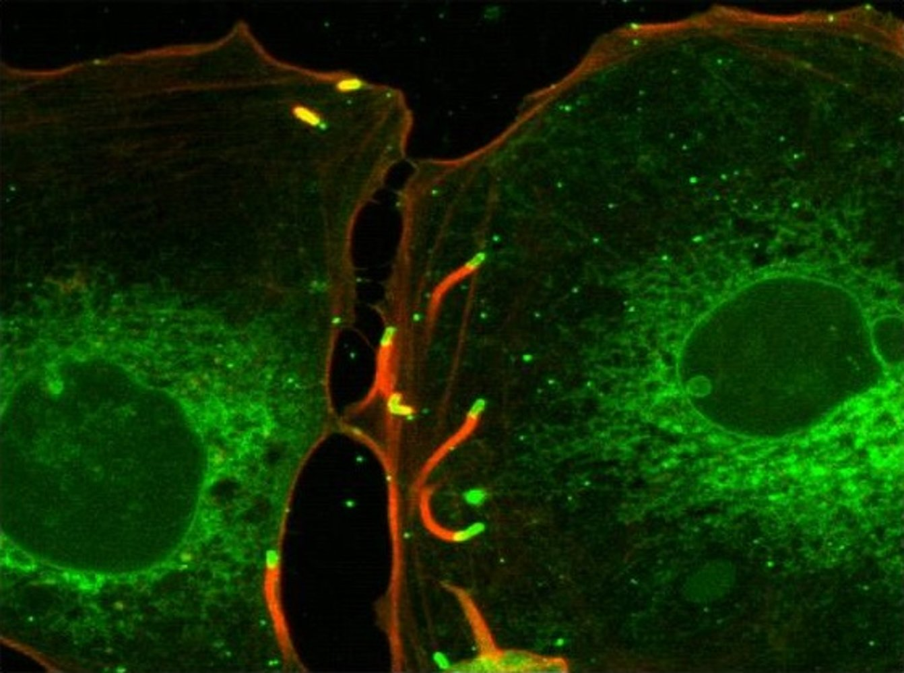

# Listeriosis

*Categories: Clinical knowledge > Internal medicine > Infectious diseases > Infections of the gastrointestinal tract > Listeriosis*

[Original Article Link](https://coursology-qbank.com/amboss/article/Nf0-m2)

---

## Summary

Listeriosis is an infectious disease caused by the gram-positive bacterium <u>Listeria monocytogenes</u>. The bacteria are usually transmitted to humans through ingestion of contaminated food (especially raw milk products). In immunocompetent individuals, the disease is mostly asymptomatic, although mild <u>flu-like</u> symptoms or <u>febrile</u> <u>gastroenteritis</u> may occur. Invasive disease due to bacteria spreading beyond the <u>gastrointestinal tract</u> results in most symptoms and generally develops in high-risk groups, e.g., older adults, pregnant individuals, and those who are <u>immunocompromised</u>. The clinical manifestation is usually mild in pregnant patients, but consequences for the fetus can be very severe (see <u>congenital listeriosis</u>). In <u>immunocompromised</u> and older adults, invasive disease can lead to <u>sepsis</u> and <u>meningitis</u>. Suspected listeriosis can be differentiated from other causes of infection through <u>blood cultures</u>. <u>Antibiotic therapy</u> is indicated for high-risk groups; <u>ampicillin</u> or <u>penicillin G</u> are the drugs of choice.

---

## Etiology

* <u>Pathogen</u>: <u>Listeria monocytogenes</u>; a gram-positive, <u>catalase-positive</u>, rod-shaped, facultative intracellular, motile bacterium

* Route of transmission

* Acquired listeriosis: ingestion of contaminated food (<u>listeria</u> can grow in temperatures as low as -1.5°C (29°F)) [[1]](https://coursology-qbank.com/amboss/article/yg0dB2)

* Raw milk products

* Raw and smoked meat/fish

* Industrially processed vegetables such as ready-made salads

* <u>Congenital listeriosis</u> [[2]](https://coursology-qbank.com/amboss/article/tzbXuw)

* Transplacental transmission during <u>pregnancy</u>

* <u>Perinatal transmission</u> (via infected vaginal secretions)

* Incubation time: 1–90 days (usually within a month) [[3]](https://coursology-qbank.com/amboss/article/Bg0zx2)

* <u>Risk factors</u>

* <u>Immunodeficiency</u>

* Age > 60

* <u>Pregnancy</u>

* <u>Neonates</u>

---

## Pathophysiology

* <u>Listeria</u> relies on several pathogenic mechanisms for infection and evasion of the host <u>immune system</u>: [[4]](https://coursology-qbank.com/amboss/article/Fzbguw)

* Invasion: The bacteria enter host cells via binding of the <u>virulence factor</u> InlA to <u>E-cadherin</u> in cells of the intestinal <u>epithelium</u>, the <u>blood-brain</u> barrier, and the <u>placenta</u>.

* <u>Proliferation</u>

* Once inside the <u>phagosome</u>, the <u>virulence factor</u> listeriolysin O forms pores to enable the <u>pathogen</u>'s <u>escape</u> from the <u>phagosome</u> and its entry into the <u>cytoplasm</u>.

* <u>Listeriolysin O</u> also inactivates <u>T cell</u> <u>receptors</u> and impairs <u>T cell</u> activation by <u>antigen presenting cells</u>.

* Cell-to-cell mobility: Actin rocket tails formed by polymerization enable <u>Listeria</u> to move intracellularly and from cell to cell across <u>cell membranes</u>, thus avoiding the <u>antibodies</u>.

* Clearance of infection primarily relies on <u>macrophage</u> activation by <u>T cells</u>. [[5]](https://coursology-qbank.com/amboss/article/8zbOuw)

* <u>T cells</u> that are exposed to <u>Listeria</u> <u>antigens</u> secrete <u>interferon-γ</u> and <u>TNF-α</u> → activation of <u>macrophages</u> → increase in production of <u>reactive oxygen species</u>

* <u>CD8+ T cells</u> release <u>perforin</u> and <u>granzymes</u> and lyse of host cells infected with <u>Listeria</u>

* Phagocytic mechanisms eventually outperform the evasive mechanisms of the bacteria, especially when acting in synergy with <u>antibiotic</u> drugs.

Cell-to-cell spread of Listeria monocytogenes

---

## Clinical features

Most infections are asymptomatic or mild, especially in immunocompetent individuals. [[6]](https://coursology-qbank.com/amboss/article/Ag0RB2)

* Healthy adults: <u>self-limiting</u> <u>gastroenteritis</u> (<u>watery diarrhea</u>)

* Pregnant women

* <u>Flu-like</u> illness

* <u>Chorioamnionitis</u>

* <u>Spontaneous abortion</u>

* <u>Sepsis</u>

* <u>Infants</u>

* <u>Neonatal meningitis</u>

* <u>Sepsis</u>

* <u>Granulomatosis infantiseptica</u>

* For more information, see “<u>Congenital listeriosis</u>” in the articles on <u>congenital TORCH infections</u>.

* <u>Immunocompromised</u> and older individuals

* <u>Fever</u>, <u>headache</u>, muscle aches, fatigue

* <u>Nausea</u>, <u>vomiting</u>, <u>watery diarrhea</u>

* <u>Sepsis</u>

* Listeria meningitis

* Neck stiffness

* Mental status change, impaired consciousness (even <u>coma</u>)

* <u>Tremor</u>, <u>ataxia</u>

* <u>Seizures</u>

---

## Diagnosis

Testing is generally not needed in immunocompetent individuals, as the infection is <u>self-limiting</u> and symptoms will have resolved by the time listeriosis is diagnosed.

* <u>Blood cultures</u> 

* Indications: suspected listeriosis, particularly among high-risk groups (e.g., pregnant women)

* Characteristic tumbling motility when grown in broth

* Ideal growth at refrigerated temperatures (<u>cold enrichment</u>)

* Typically grow on blood agar with a narrow band of <u>beta hemolysis</u> surrounding the colonies

* <u>Lumbar puncture</u>: indicated for suspected <u>Listeria</u> <u>meningitis</u>

* <u>CSF analysis</u> [[7]](https://coursology-qbank.com/amboss/article/uzbpuw)

* <u>Pleocytosis</u>

* <u>CSF</u> protein levels moderately elevated

* <u>Decreased CSF glucose</u>

* Microscopy (low <u>sensitivity</u>)

* <u>CSF</u> culture

---

## Treatment

* In immunocompetent patients with <u>gastroenteritis</u>, no treatment is usually necessary.

* Indications for <u>antibiotic</u> treatment: <u>CNS</u> infection, <u>endocarditis</u>, <u>bacteremia</u>, <u>neonatal infection</u>, or <u>immunocompromise</u>

* First-line treatment: <u>ampicillin</u> or <u>penicillin G</u>, usually in combination with <u>gentamicin</u> for synergistic effect

* Second-line treatment: <u>cotrimoxazole</u>, <u>macrolide</u>

---

## Prevention

* High-risk individuals should avoid food products made from unpasteurized milk and soft cheeses (e.g., brie, feta, and camembert).

* Cook meat thoroughly prior to consumption.

* Listeriosis is a <u>notifiable disease</u> in the United States.

---