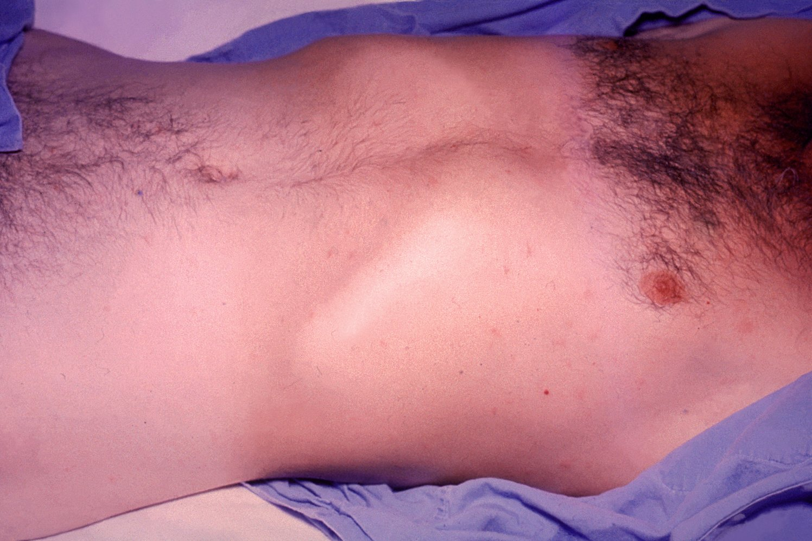
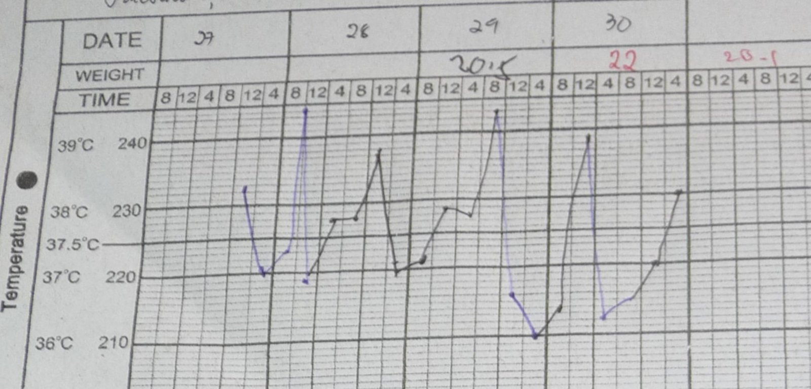

# Typhoid and paratyphoid fever

*Categories: Clinical knowledge > Internal medicine > Infectious diseases > Infections of the gastrointestinal tract > Typhoid and paratyphoid fever*

[Original Article Link](https://coursology-qbank.com/amboss/article/Qf0uN2)

---

## Summary

<u>Typhoid</u> and <u>paratyphoid fever</u> (sometimes referred to together as <u>enteric fever</u>) are infectious diseases caused by the bacteria <u>Salmonella Typhi</u> and <u>Salmonella Paratyphi</u>. Transmission occurs via the <u>fecal-oral route</u>. The <u>incubation period</u> is highly variable but typically ranges from 6 to 30 days. <u>Typhoid</u> and <u>paratyphoid fever</u> classically have three clinical stages. In the first week of symptoms, body temperature rises gradually, and relative <u>bradycardia</u>, <u>diarrhea</u>, and/or <u>constipation</u> may occur. The second week of illness is characterized by persistent <u>fever</u>, <u>rose-colored spots</u> on the abdomen, nonspecific abdominal <u>pain</u>, and profuse <u>diarrhea</u>. During the third week, complications such as <u>hepatosplenomegaly</u>, intestinal bleeding, and/or perforation with secondary <u>bacteremia</u> and <u>peritonitis</u> may occur. Symptoms begin to subside after the third week. <u>Pathogen</u> detection in blood or <u>stool cultures</u> confirms the diagnosis. The choice of <u>empiric antibiotic therapy</u> depends on the risk of <u>pathogen</u> resistance. The most commonly used agents include <u>ceftriaxone</u> and <u>azithromycin</u>. Some individuals become <u>chronic Salmonella carriers</u> after symptoms have resolved.

---

## Epidemiology

* There are an estimated 11–21 million cases per year worldwide.

* Most prevalent in resource-limited regions with poor sanitation in East and Southeast Asia, Africa, and Central and South America

* In the United States, approx. 400 culture-confirmed cases of <u>typhoid fever</u> and 100 cases of <u>paratyphoid fever</u> are reported annually, mostly in individuals who have traveled to <u>endemic</u> regions.

Epidemiological data refers to the US, unless otherwise specified.

---

## Etiology

* <u>Pathogen</u> 

* <u>Salmonella enterica serotype Typhi</u>: <u>typhoid fever</u>

* Gram-negative rod

* <u>Facultative anaerobe</u> with <u>peritrichous flagella</u>

* Produces <u>hydrogen sulfide</u> (<u>H2S</u>) on <u>TSI agar</u>

* <u>Oxidase-negative</u>

* Cannot ferment <u>lactose</u>

* <u>Salmonella enterica serotype Paratyphi</u>: <u>paratyphoid fever</u>

* Salmonella enterica serotype Paratyphi A

* Salmonella enterica serotype Paratyphi B

* Salmonella enterica serotype Paratyphi C

* Salmonella enterica serotype Choleraesuis

* Reservoir

* <u>Salmonella enterica serotype Typhi</u>: humans

* Other <u>Salmonella</u> species: humans and animals

* Transmission: fecal-oral

* Direct: person-to-person contact; asymptomatic carriers frequently involved (e.g., the <u>pathogen</u> may be transferred from contaminated stool via handshake to the next person)

* Indirect: contaminated food and water (e.g., if drinking water and sewage systems are not properly separated or a carrier prepares food)

> [!NOTE]
> Humans are the main reservoir for <u>Salmonella Typhi</u>.

> [!NOTE]
> <u>Salmonella</u> has <u>flagella</u>.

---

## Pathophysiology

### Lifecycle

1. * Oral uptake of <u>pathogen</u>: A relatively large number of organisms (∼ 105) is needed to cause infection (high infective dose), unlike, e.g., in <u>Shigella infection</u>, where as few as ∼ 10 organisms suffice to infect the host.
2. * Migration into the <u>Peyer patches</u> of the <u>distal</u> <u>ileum</u>; : If the <u>pathogen</u> manages to reach the <u>distal</u> <u>ileum</u>, it migrates via <u>M cells</u> through the <u>epithelium</u> and into the <u>Peyer patches</u>.
3. * Infection of <u>macrophages</u>  → nonspecific symptoms
4. * Spread from <u>macrophages</u> to the bloodstream → septicemia → systemic disease
5. * Migration back to intestine → excretion in feces

### <u>Virulence factors</u>

<u>The cell</u> wall of the <u>typhoid</u> pathogens contains <u>endotoxins</u>; , which are responsible for the neurological symptoms associated with <u>typhoid</u> and <u>paratyphoid fever</u> (see the “<u>Bacteria overview</u>” article for more information).

---

## Clinical features

### General

* <u>Incubation period</u>: 6–30 days (most commonly 7–14 days) [[1]](https://coursology-qbank.com/amboss/article/FyWgSL0)

* If left untreated, three different disease stages, each lasting a week, classically occur.

* After 3 weeks of disease: slow regression of symptoms; patients may become <u>chronic Salmonella carriers</u> (see “Complications”).

> [!NOTE]
> <u>Typhoid fever</u> is a systemic disease and it is not limited to the gastrointestinal system.

> [!TIP]
> <u>Typhoid fever</u> must always be considered in cases of persistent <u>fever of unknown origin</u> and a history of travel to an <u>endemic</u> region.

### Progression of illness

#### Week 1

* Body temperature rises gradually.  [[1]](https://coursology-qbank.com/amboss/article/FyWgSL0)

* Relative <u>bradycardia</u> (not seen in children)  [[3]](https://coursology-qbank.com/amboss/article/Bedza60)[[4]](https://coursology-qbank.com/amboss/article/cOdarJ0)

* <u>Constipation</u> or <u>diarrhea</u>

* <u>Headache</u>

#### Week 2

* Persistent <u>fever</u>  > 38.0°C (> 100.4°F), but no chills; mostly unresponsive to <u>antipyretics</u>

* Rose-colored spots; : a small, speckled, rose-colored <u>exanthem</u> that appears on the lower chest and abdomen (most commonly around the <u>navel</u>) in approx. 30% of affected individuals

* Typhoid tongue: greyish/yellowish-coated <u>tongue</u> with red edges

* Nonspecific abdominal <u>pain</u> and <u>headache</u>

* Yellow-green <u>diarrhea</u>; , comparable to pea soup (caused by <u>purulent</u>, bloody <u>necrosis</u> of the <u>Peyer patches</u>), or <u>obstipation</u> and <u>bowel obstruction</u> (as a result of swollen <u>Peyer patches</u> in the <u>ileum</u>)

* Neurological symptoms (<u>delirium</u>, <u>coma</u>)

Rose-colored spots on typhoid patient

Temperature curve in typhoid fever

#### Week 3

* Clinical features of week 2

* Additional possible complications include:

* Gastrointestinal <u>ulceration</u> with bleeding and perforation

* <u>Hepatosplenomegaly</u>

* In rare cases: <u>sepsis</u>, <u>meningitis</u>, <u>myocarditis</u>, and <u>renal failure</u>

---

## Diagnosis

Suspect <u>typhoid</u> or <u>paratyphoid fever</u> in patients with <u>fever</u> and gastrointestinal concerns (e.g., <u>diarrhea</u>) who have traveled to <u>endemic</u> areas. In adults and children, diagnosis is confirmed with the detection of <u>Salmonella Typhi</u> or <u>Salmonella Paratyphi</u> in cultures. [[3]](https://coursology-qbank.com/amboss/article/Bedza60)[[5]](https://coursology-qbank.com/amboss/article/GyWBgL0)[[6]](https://coursology-qbank.com/amboss/article/xMYEIp)

### Routine <u>laboratory studies</u> [[5]](https://coursology-qbank.com/amboss/article/GyWBgL0)

Not typically indicated, but if performed may show some of the following findings.

* <u>CBC with differential</u>  [[5]](https://coursology-qbank.com/amboss/article/GyWBgL0)[[6]](https://coursology-qbank.com/amboss/article/xMYEIp)

* <u>Anemia</u>

* <u>Leukopenia</u> or <u>leukocytosis</u>  [[5]](https://coursology-qbank.com/amboss/article/GyWBgL0)[[7]](https://coursology-qbank.com/amboss/article/_-W5-L0)

* <u>Eosinopenia</u> [[8]](https://coursology-qbank.com/amboss/article/9eXNax)

* Relative <u>lymphocytosis</u> [[9]](https://coursology-qbank.com/amboss/article/CeXqax)

* <u>Thrombocytopenia</u>

* <u>Inflammatory markers</u>: ↑ <u>CRP</u>

* <u>Liver chemistries</u>: ↑ <u>AST</u> and/or <u>ALT</u>

* <u>BMP</u>: may show abnormalities in patients with severe <u>diarrhea</u>

* ↑ <u>BUN</u>, ↑ <u>creatinine</u>  [[10]](https://coursology-qbank.com/amboss/article/_yW53L0)

* <u>Electrolyte</u> disturbances

* See “<u>Laboratory findings in dehydration and hypovolemia</u>.”

### Confirmatory studies [[1]](https://coursology-qbank.com/amboss/article/FyWgSL0)[[10]](https://coursology-qbank.com/amboss/article/_yW53L0)[[11]](https://coursology-qbank.com/amboss/article/zyWr3L0)

* Microbiology

* <u>Blood cultures</u>: indicated for all patients

* Most important diagnostic tool to identify current infection  [[1]](https://coursology-qbank.com/amboss/article/FyWgSL0)[[11]](https://coursology-qbank.com/amboss/article/zyWr3L0)

* May be positive starting in week 1 of the disease [[12]](https://coursology-qbank.com/amboss/article/F-Wg_L0)

* <u>Stool cultures</u>: to increase chance of <u>pathogen</u> detection or to identify <u>chronic Salmonella carriage</u> 

* Recommended for all pediatric patients and for individuals who traveled with an infected patient. [[3]](https://coursology-qbank.com/amboss/article/Bedza60)

* Lower <u>sensitivity</u> than <u>blood cultures</u>  [[10]](https://coursology-qbank.com/amboss/article/_yW53L0)[[3]](https://coursology-qbank.com/amboss/article/Bedza60)

* May be positive starting in week 2 [[1]](https://coursology-qbank.com/amboss/article/FyWgSL0)

* <u>Urine cultures</u>: low <u>sensitivity</u>

* <u>Bone marrow</u> cultures: most sensitive modality, but rarely performed  [[3]](https://coursology-qbank.com/amboss/article/Bedza60)[[5]](https://coursology-qbank.com/amboss/article/GyWBgL0)[[11]](https://coursology-qbank.com/amboss/article/zyWr3L0)

* <u>Bile</u> or <u>duodenal</u> fluid cultures may be used. [[3]](https://coursology-qbank.com/amboss/article/Bedza60)[[6]](https://coursology-qbank.com/amboss/article/xMYEIp)

* <u>Serology</u> (e.g., <u>Widal test</u>, rapid <u>antibody</u> diagnostics): not recommended because of low <u>sensitivity</u> and <u>specificity</u> and the inability to distinguish current infection from previous infection or <u>vaccination</u>  [[3]](https://coursology-qbank.com/amboss/article/Bedza60)

> [!TIP]
> <u>Typhoid</u> and <u>paratyphoid fever</u> are nationally <u>notifiable diseases</u> in the US. Notify the state or local health department if a case is confirmed. [[1]](https://coursology-qbank.com/amboss/article/FyWgSL0)

---

## Treatment

### General principles [[1]](https://coursology-qbank.com/amboss/article/FyWgSL0)[[3]](https://coursology-qbank.com/amboss/article/Bedza60)

* Consult infectious diseases (ID) for guidance.

* <u>Antibiotic</u> treatment should be based on <u>antibiotic susceptibility testing</u>, as resistance is widespread.

* In patients with severe infection (e.g., <u>delirium</u>, <u>coma</u>, <u>shock</u>): [[12]](https://coursology-qbank.com/amboss/article/F-Wg_L0)

* Provide <u>supportive care</u>, e.g., <u>fluid resuscitation</u>.

* Manage complications, e.g., <u>management of GI perforation</u> or <u>management of GI bleeding</u>.

* Consider administration of <u>corticosteroids</u>, e.g., <u>dexamethasone</u> (<u>off-label</u>). DOSAGE [[3]](https://coursology-qbank.com/amboss/article/Bedza60)[[13]](https://coursology-qbank.com/amboss/article/LMbw68)

* Monitor for response to therapy (e.g., <u>fever</u> resolution in 3–5 days, infection relapse) and complications (e.g., <u>chronic Salmonella carriage</u>).

### <u>Antibiotic therapy</u> [[1]](https://coursology-qbank.com/amboss/article/FyWgSL0)[[6]](https://coursology-qbank.com/amboss/article/xMYEIp)[[14]](https://coursology-qbank.com/amboss/article/SYdyoo0)

Start <u>empiric antibiotic treatment</u> based on disease severity and the risk of extremely drug-resistant (XDR) pathogens; tailor further treatment based on <u>antimicrobial susceptibility testing</u>. [[10]](https://coursology-qbank.com/amboss/article/_yW53L0)

* Uncomplicated infection: <u>azithromycin</u> (<u>off-label</u>) DOSAGE [[3]](https://coursology-qbank.com/amboss/article/Bedza60)[[13]](https://coursology-qbank.com/amboss/article/LMbw68)

* Complicated infection ;  [[1]](https://coursology-qbank.com/amboss/article/FyWgSL0)[[3]](https://coursology-qbank.com/amboss/article/Bedza60)[[14]](https://coursology-qbank.com/amboss/article/SYdyoo0)

* Low-risk for XDR pathogens: <u>third-generation cephalosporins</u>, e.g., <u>ceftriaxone</u> (<u>off-label</u>) DOSAGE

* High risk for XDR infection (no travel  or recent travel to Iraq or Pakistan): <u>carbapenems</u>

#### <u>Targeted antibiotic therapy</u>

The following <u>antibiotics</u> should only be given after confirming susceptibility as resistance is common.   [[1]](https://coursology-qbank.com/amboss/article/FyWgSL0)

* Adults: <u>fluoroquinolones</u>, e.g., <u>ciprofloxacin</u> DOSAGE

* Children: <u>amoxicillin</u>, <u>trimethoprim/sulfamethoxazole</u>, or <u>ciprofloxacin</u> (<u>off-label</u>) [[3]](https://coursology-qbank.com/amboss/article/Bedza60)

> [!WARNING]
> Due to high resistance in the US, <u>fluoroquinolones</u> should not be used until susceptibility data is available.

> [!NOTE]
> <u>Antibiotics</u> prolong the duration of fecal excretion of bacteria.

> [!TIP]
> Relapse is common and may necessitate retreatment. [[3]](https://coursology-qbank.com/amboss/article/Bedza60)

---

## Complications

### Acute complications [[12]](https://coursology-qbank.com/amboss/article/F-Wg_L0)

* Gastrointestinal and hepatobiliary

* <u>Bowel perforation</u>

* <u>GI hemorrhage</u>

* <u>Cholecystitis</u>

* <u>Hepatitis</u>

* Cardiac: <u>myocarditis</u>

* Respiratory

* <u>Pneumonia</u>

* <u>Bronchitis</u>

* Neurologic

* <u>Altered mental status</u> (e.g., <u>encephalopathy</u>, <u>delirium</u>)

* <u>Meningitis</u>

### Chronic Salmonella carriage [[14]](https://coursology-qbank.com/amboss/article/SYdyoo0)

* Definition: positive <u>stool cultures</u> 12 months after resolution of symptoms

* <u>Incidence</u>: 2–5% of patients become chronic carriers (<u>Salmonella Typhi</u> colonizes the <u>gallbladder</u>). [[15]](https://coursology-qbank.com/amboss/article/9xbNAD)

* Clinical features: typically asymptomatic

* Treatment: : <u>fluoroquinolones</u> (e.g., <u>ciprofloxacin</u>) administered for at least 1 month if susceptible

* Complication: increased risk for <u>gallbladder cancer</u>

We list the most important complications. The selection is not exhaustive.

---

## Prevention

### Typhoid fever vaccination [[1]](https://coursology-qbank.com/amboss/article/FyWgSL0)[[16]](https://coursology-qbank.com/amboss/article/CQdqyp0)

* Indications [[6]](https://coursology-qbank.com/amboss/article/xMYEIp)

* Travelers to high-risk areas (e.g., South and Southeast Asia, South and Central America, Africa)

* Close contact with a documented chronic carrier

* Laboratory personnel exposed to <u>typhoid</u>

* <u>Vaccine</u> types: A parenteral, <u>inactivated vaccine</u> and an oral, <u>live vaccine</u> are available for <u>active immunization</u>, and both provide similar levels of protection. [[16]](https://coursology-qbank.com/amboss/article/CQdqyp0)[[17]](https://coursology-qbank.com/amboss/article/Mu1M7i0)

* <u>Inactivated vaccine</u> containing Vi <u>polysaccharide</u> (part of <u>Salmonella Typhi</u> capsule): administered intramuscularly

* <u>Live-attenuated vaccine</u> containing live-attenuated <u>Salmonella Typhi</u>: administered orally

* Indications and schedule: See “<u>Vaccines before travel</u>” for details.

> [!WARNING]
> Overcoming an infection with <u>Salmonella Typhi</u> or <u>Salmonella Paratyphi</u> does not confer lifelong <u>immunity</u>, and <u>vaccination</u> is not 100% protective. [[1]](https://coursology-qbank.com/amboss/article/FyWgSL0)

### Other prevention strategies [[1]](https://coursology-qbank.com/amboss/article/FyWgSL0)

<u>Vaccination</u> is not 100% effective. Measures must therefore be implemented to avoid exposure.

* <u>Food and water safety</u> while traveling

* <u>Hand hygiene</u> [[11]](https://coursology-qbank.com/amboss/article/zyWr3L0)

* Wash hands with soap and water before preparing food, before eating, and after using the bathroom.

* Use hand sanitizer with ≥ 60% <u>alcohol</u> if soap and/or water are not available.

---