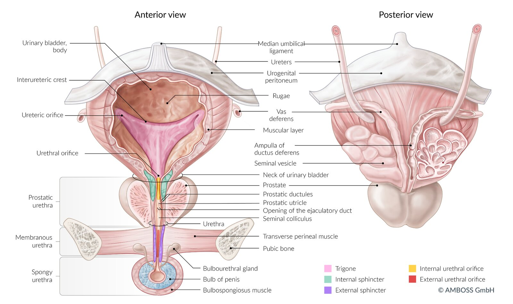
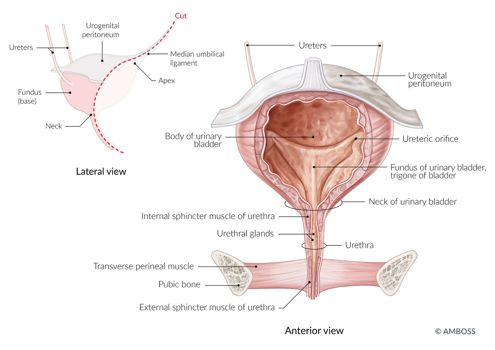
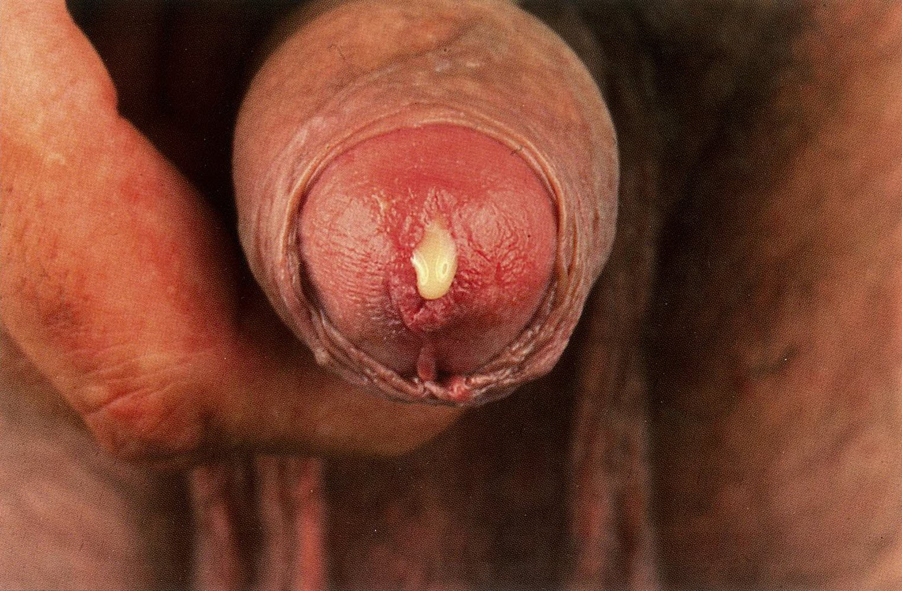

# Urethritis

*Categories: Clinical knowledge > Internal medicine > Infectious diseases > Infections of the genitourinary tract > Urethritis*

[Original Article Link](https://coursology-qbank.com/amboss/article/ui0ptf)

---

## Summary

Urethritis is an inflammation of the urethral <u>mucosa</u>. In men, this is most commonly caused by sexually transmitted pathogens, notably <u>Chlamydia trachomatis</u>, <u>Neisseria gonorrhoeae</u>, and <u>Mycoplasma genitalium</u>. Patients are often asymptomatic but may present with urethral discharge, <u>dysuria</u>, and/or itching of the urinary meatus. Diagnostics include initial microscopy of urethral secretions to confirm urethritis and distinguish between gonococcal and nongonoccal etiologies, followed by <u>nucleic acid amplification testing</u> (<u>NAAT</u>) of <u>first-void urine</u> for <u>gonorrhea</u> and <u>chlamydia</u>. If same-day <u>NAAT</u> is available, treatment is tailored to the specific <u>pathogen</u>. If only same-day microscopy is available, empiric treatment is provided with <u>ceftriaxone</u> and <u>doxycycline</u> for gonococcal urethritis and either <u>doxycycline</u> or <u>azithromycin</u> for <u>nongonococcal urethritis</u>. Evaluation and treatment of all recent sexual partners is necessary to prevent recurrent infections.

This article outlines the management of urethritis in men. In women, urethritis has a broader differential diagnosis that includes <u>urinary tract infection</u>, <u>sexually transmitted infections</u>, and <u>genitourinary syndrome of menopause</u>; diagnostics and treatment should be tailored to the likely etiology.

---

## Etiology

Urethritis is usually a symptom of <u>sexually transmitted infection</u> (<u>STI</u>); <u>coinfections</u> are common.

### Common etiologies [[1]](https://coursology-qbank.com/amboss/article/2NcT010)[[2]](https://coursology-qbank.com/amboss/article/dXdoCo0)

* Gonococcal urethritis: <u>N. gonorrhoeae</u>

* Nongonococcal urethritis [[1]](https://coursology-qbank.com/amboss/article/2NcT010)

* <u>C. trachomatis</u>: most common <u>cause of urethritis</u>  [[3]](https://coursology-qbank.com/amboss/article/UXdbxo0)

* Causes of nonchlamydial nongonococcal urethritis include:

* <u>Mycoplasma genitalium</u>

* <u>Trichomonas vaginalis</u>

* <u>Gram-positive cocci</u>

* <u>Ureaplasma</u> spp.

* <u>Herpes simplex virus</u> types 1 and 2

* <u>Adenovirus</u>

* Noninfectious etiologies [[4]](https://coursology-qbank.com/amboss/article/KXdU_o0)

* Repeated urethral manipulation (e.g., during catheterization)

* Chemical irritation (e.g., from soap or <u>spermicides</u>)

* Inflammatory conditions (e.g., lichen <u>sclerosis</u>)

### <u>Risk factors</u> for infectious urethritis

* Unprotected sexual intercourse

* Multiple sexual partners

* History of other <u>STIs</u> [[5]](https://coursology-qbank.com/amboss/article/7ia4G4)

Urinary bladder (male)

Urinary bladder (female)

---

## Clinical features

* <u>Dysuria</u>

* Burning or itching of the urethral meatus

* Urethral discharge: <u>purulent</u>, cloudy, blood-tinged, or clear

* <u>Initial hematuria</u>

* General symptoms (e.g., <u>fever</u>, chills, or <u>myalgia</u>) are uncommon in urethritis and should raise suspicion for complications (see “Complications” below).

> [!TIP]
> Urethritis, especially <u>nongonococcal urethritis</u>, may be asymptomatic.

Purulent urethral discharge

---

## Diagnosis

### Approach [[1]](https://coursology-qbank.com/amboss/article/2NcT010)[[6]](https://coursology-qbank.com/amboss/article/-ZdDVo0)

* Perform a <u>clinical evaluation for STIs</u>.

* Confirm urethritis, ideally with point-of-care microscopy.

* Obtain <u>NAAT</u> for <u>gonorrhea</u> and <u>chlamydia</u> and <u>screen for other STIs</u>.

* Consider further tests depending on clinical symptoms and local <u>prevalence</u> of <u>STIs</u>.

### Confirmation of urethritis [[1]](https://coursology-qbank.com/amboss/article/2NcT010)

* Preferred: point-of-care urethral smear microscopy with <u>Gram stain</u>, <u>methylene blue</u> (MB) stain, or <u>gentian violet</u> (GV) stain  

* Urethritis is confirmed if there are ≥ 2 <u>WBCs</u> per oil immersion field.  [[1]](https://coursology-qbank.com/amboss/article/2NcT010)

* If either of the following are present, make a presumptive diagnosis of gonococcal urethritis:

* Gram-negative intracellular <u>diplococci</u> on <u>Gram stain</u>

* Intracellular purple <u>diplococci</u> on MB or GV stain

* If urethritis is confirmed but <u>diplococci</u> are not detected, make a presumptive diagnosis of <u>nongonococcal urethritis</u>.

* Alternative methods

* <u>First-void urine</u> with either:

* Positive <u>leukocyte esterase test</u>

* ≥ 10 <u>WBCs</u>/hpf on examination of <u>urine sediment</u>

* Clinical confirmation of mucoid, mucopurulent, or <u>purulent</u> urethral discharge

> [!TIP]
> Symptoms of urethritis with no organism on <u>Gram stain</u> of a urethral specimen suggest <u>nongonococcal urethritis</u> (e.g., infection with <u>C. trachomatis</u> or <u>M. genitalium</u>).

### Additional studies [[1]](https://coursology-qbank.com/amboss/article/2NcT010)

* All patients

* <u>NAAT</u> of <u>first-void urine</u> for <u>gonorrhea</u> and <u>chlamydia</u>  [[1]](https://coursology-qbank.com/amboss/article/2NcT010)

* <u>Screening for other STIs</u>, including <u>HIV</u> and <u>syphilis</u>

* Specific indications: Consider selected additional studies.

|  Selected additional studies in urethritis [[1]](https://coursology-qbank.com/amboss/article/2NcT010)  |  |
| --- | --- |
| Test | Indication |
| <u>NAAT</u> for <u>T. vaginalis</u> |   * Men in high <u>prevalence</u> areas  * Men with positive partners  * Treatment failure    |
| Culture for <u>N. meningitidis</u> |  * Gram-negative intracellular <u>diplococci</u> and negative <u>NAAT</u> for <u>gonorrhea</u>   |
| <u>Diagnostics for HSV</u> |  * Clinical features of <u>genital herpes</u>   |
| Culture with <u>antibiotic sensitivity testing</u> |  * Suspected <u>antibiotic</u>-resistant <u>gonorrhea</u>   |

> [!TIP]
> All patients with any symptoms of urethritis should receive <u>NAAT</u> for <u>gonorrhea</u> and <u>chlamydia</u>. [[1]](https://coursology-qbank.com/amboss/article/2NcT010)

---

## Differential diagnoses

Because <u>coinfection</u> with other genitourinary tract infections is possible, the presence of one infection does not rule out urethritis.

* <u>Acute cystitis</u>

* <u>Epididymitis</u>

* <u>Prostatitis</u>

* <u>Chronic pelvic pain syndrome</u>

The differential diagnoses listed here are not exhaustive.

---

## Treatment

### Approach [[1]](https://coursology-qbank.com/amboss/article/2NcT010)[[6]](https://coursology-qbank.com/amboss/article/-ZdDVo0)

* Start <u>antimicrobial therapy</u> immediately.

* Same-day results available: Treat the underlying <u>cause of urethritis</u>, e.g., <u>antibiotics for gonorrhea</u>, <u>antibiotics for genitourinary chlamydia</u>.

* Same-day results not available:

* Provide <u>empiric treatment for urethritis</u>.

* Narrow <u>antibiotics</u> if culture results become available.

* Patients with urethritis secondary to an <u>STI</u>

* Advise patients on <u>preventing onward transmission of a bacterial STI</u>.

* Provide <u>management of sexual partners</u>.

* Offer patients counseling on <u>STI prevention</u>, including <u>HIV PrEP</u> if appropriate.

* Report <u>notifiable diseases</u> (e.g., <u>chlamydia</u> and <u>gonorrhea</u>).

* Ensure appropriate <u>follow-up for urethritis</u>; patients with persistent symptoms may require further testing.

### Empiric treatment for urethritis [[1]](https://coursology-qbank.com/amboss/article/2NcT010)

* Treat patients for gonococcal urethritis if:

* A <u>presumptive diagnosis of gonococcal urethritis</u> is made

* Urethritis was confirmed by a method other than microscopy

* They are symptomatic with multiple <u>risk factors for STIs</u> and there are concerns about poor follow-up

* Treat all other patients for <u>nongonococcal urethritis</u>.

#### Empiric treatment for gonococcal urethritis

* <u>Ceftriaxone</u> IM once DOSAGE [[1]](https://coursology-qbank.com/amboss/article/2NcT010)

* PLUS oral <u>doxycycline</u> DOSAGE [[1]](https://coursology-qbank.com/amboss/article/2NcT010)

#### Empiric treatment for <u>nongonococcal urethritis</u>

* Recommended: <u>doxycycline</u> DOSAGE [[1]](https://coursology-qbank.com/amboss/article/2NcT010)

* Alternative: <u>azithromycin</u> DOSAGE [[1]](https://coursology-qbank.com/amboss/article/2NcT010)

* Suspected <u>trichomoniasis</u>  : <u>metronidazole</u> DOSAGE or <u>tinidazole</u> DOSAGE [[1]](https://coursology-qbank.com/amboss/article/2NcT010)

### Follow-up for urethritis [[1]](https://coursology-qbank.com/amboss/article/2NcT010)[[6]](https://coursology-qbank.com/amboss/article/-ZdDVo0)

For all patients diagnosed with <u>chlamydia</u> or <u>gonorrhea</u>, repeat <u>NAAT</u> 3 months after completion of treatment.  [[1]](https://coursology-qbank.com/amboss/article/2NcT010)

#### Persistent or refractory symptoms

* Assess for reexposure and nonadherence to treatment.

* If either is identified, consider repeating the initial treatment regimen.

* Otherwise, repeat <u>diagnostics for urethritis</u>.

* If urethritis is confirmed on repeat testing, obtain <u>diagnostics for M. genitalium infection</u> and/or <u>trichomoniasis</u> and treat if positive.  [[1]](https://coursology-qbank.com/amboss/article/2NcT010)

* If workup is negative, consider:

* Culture with <u>antibiotic sensitivity testing</u>

* Referral to urology and/or infectious diseases

* <u>Differential diagnoses of urethritis</u>

* Noninfectious <u>etiologies of urethritis</u>

> [!TIP]
> Most cases of persistent gonococcal urethritis are due to repeat infection rather than treatment failure. [[6]](https://coursology-qbank.com/amboss/article/-ZdDVo0)

---

## Complications

* Other genitourinary tract infections, e.g., <u>cystitis</u>, <u>epididymitis</u>, <u>prostatitis</u>, <u>cervicitis</u>, <u>pelvic inflammatory disease</u>

* <u>Urethral stricture</u> or stenosis

* <u>Infertility</u>

* <u>Disseminated gonococcal infection</u>

* <u>Reactive arthritis</u>

We list the most important complications. The selection is not exhaustive.

---

## Prevention

See “<u>Prevention of STIs</u>” and “<u>Screening for STIs</u>.”

---