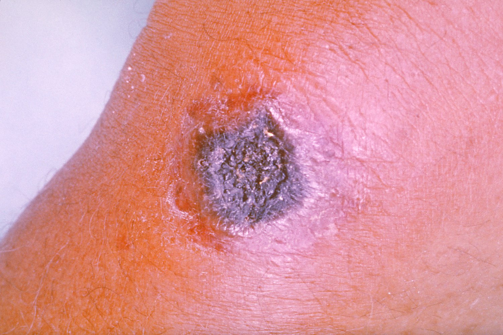
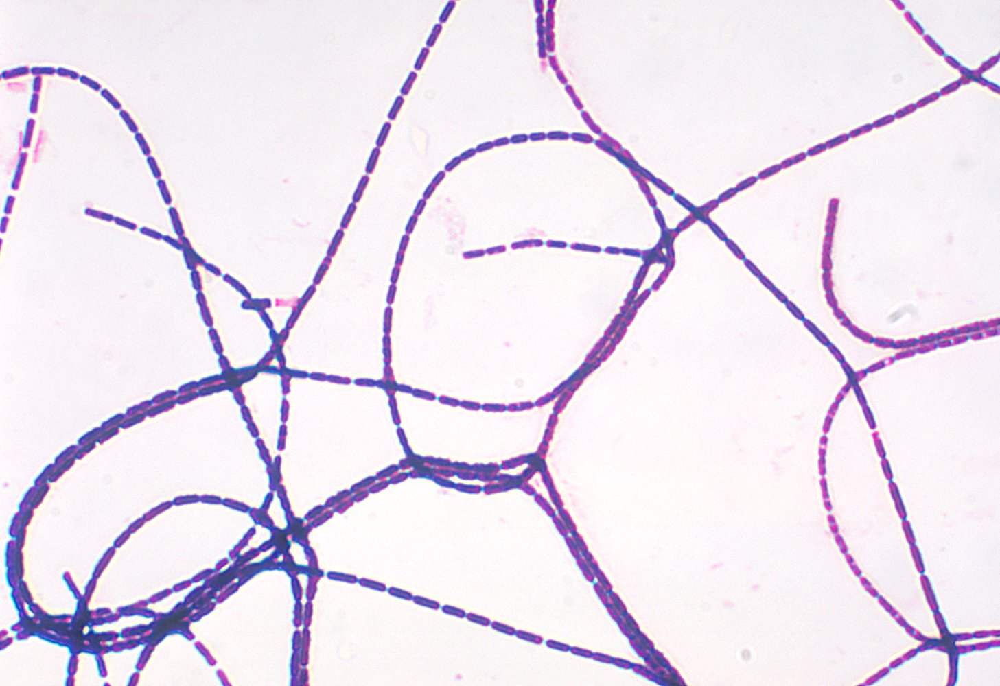
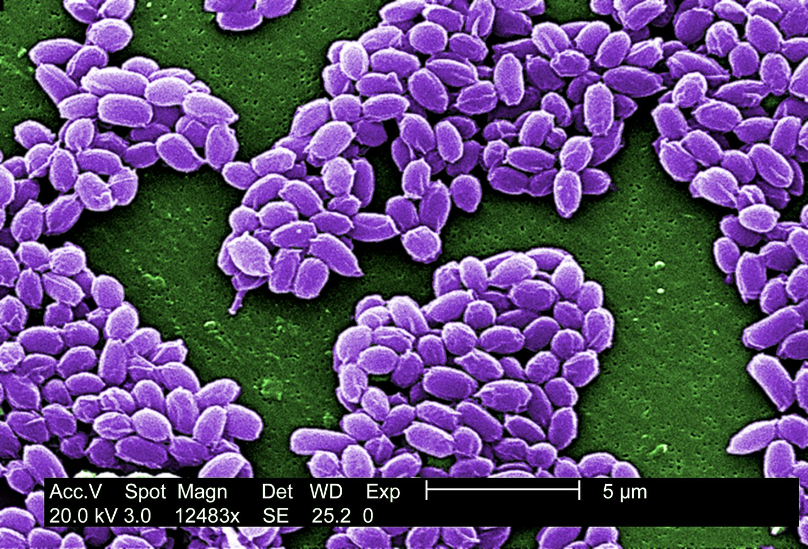

# Anthrax

*Categories: Clinical knowledge > Internal medicine > Infectious diseases > Infections of the pharynx and respiratory tract > Anthrax*

[Original Article Link](https://coursology-qbank.com/amboss/article/Of0Im2)

---

## Summary

Anthrax is a rare infectious disease caused by <u>Bacillus anthracis</u>, a gram-positive <u>spore-forming</u> bacterium that is found in soil. Human infection usually results from contact with infected livestock or infected animal products (e.g., wool or meat). <u>B. anthracis</u> spores have also been weaponized for biological warfare/terrorism. Depending on the route of entry, three distinct clinical syndromes can occur: <u>inhalation anthrax</u>, <u>cutaneous anthrax</u>, and <u>gastrointestinal anthrax</u>. <u>Cutaneous anthrax</u> (the most common form) presents initially as a <u>papular</u> lesion, which later becomes <u>vesicular</u>, and eventually forms a <u>necrotic</u> <u>eschar</u>. <u>Inhalation anthrax</u> results in hemorrhagic <u>mediastinitis</u> and presents with <u>fever</u>, acute, nonproductive <u>cough</u>, retrosternal <u>chest pain</u>, and/or <u>pleural effusion</u>. <u>Gastrointestinal anthrax</u>, which is very rare, causes gastrointestinal <u>ulceration</u>, which results in <u>hematemesis</u> and/or bloody <u>diarrhea</u>. The <u>diagnosis of anthrax</u> is confirmed by the microscopic evidence of <u>B. anthracis</u>. Mortality is high but swift treatment with <u>antibiotics</u> (e.g., <u>fluoroquinolones</u>, <u>linezolid</u>, <u>meropenem</u>) can increase survival. Prognosis of <u>cutaneous anthrax</u> is usually better than that of inhalation and <u>gastrointestinal anthrax</u>.

---

## Etiology

* <u>Pathogen</u>: Bacillus anthracis

* Gram-positive, <u>spore-forming</u>, nonmotile rod

* Edge of colony shows irregular comma-shaped outgrowths on blood agar (also referred to as Medusa head).

* Spores of <u>B. anthracis</u> can remain viable for decades.

* Anthrax is a <u>zoonotic infection</u> that primarily infects cows, goats, and sheep.

* Transmission

* Human infection occurs following exposure to <u>B. anthracis</u> or its spores (e.g., inhalation), usually as a result of contact with infected animals or infected animal products (e.g., wool, hide, meat).

* Bioterrorism or biological warfare: exposure to weaponized <u>B. anthracis</u> or its spores. An attack using aerosolized anthrax could infect a large number of individuals and cause many casualties, especially if an <u>antibiotic</u>-resistant strain was used.

* Person-to-person transmission is rare, but cases of person-to-person transmission of <u>cutaneous anthrax</u> have been reported.

> [!TIP]
> Anthrax infection is an <u>occupational hazard</u> for people who handle livestock and process potentially infected animal materials such as wool or meat.

---

## Pathophysiology

### <u>Virulence factors</u>

* Antiphagocytic capsule

* <u>B. anthracis</u> is the only bacterium that is capable of forming a <u>polypeptide</u> capsule

* Contains poly-D-glutamate

* Anthrax toxin: responsible for the local and systemic manifestations of anthrax; made up of A and B subunits

* The A subunit has 2 components:

* EF (edema factor); : binds to <u>calcium</u> and <u>calmodulin</u> and gains <u>adenylate cyclase</u> activity → ↑ <u>cAMP</u> → cell <u>edema</u>

* LF (lethal factor): a metalloprotease that destroys MAPKK (mitogen-activated protein <u>kinase</u> <u>kinase</u>;  ) → <u>cell death</u>

* The B subunit (PA; anthrax toxin protective antigen);  binds to <u>endothelial</u> <u>receptors</u> and facilitates entry of the A subunit into the host cell.

### Infection

1. * Local germination of <u>B. anthracis</u> spores and multiplication of bacteria
2. * Spreading to local/regional <u>lymph nodes</u>
3. * <u>Bacteremia</u> → systemic spread

---

## Clinical features

Depending on the route/mechanism of infection, one or more of three anthrax subtypes may occur.

|  Overview of anthrax subtypes [[2]](https://coursology-qbank.com/amboss/article/A4VRNu0)[[3]](https://coursology-qbank.com/amboss/article/ZnVZ7E0)  |  |  |  |  |  |  |
| --- | --- | --- | --- | --- | --- | --- |
| Feature |  |  |  | Cutaneous anthrax |  Inhalation anthrax (<u>Woolsorter's disease</u>) | Gastrointestinal anthrax |
| Relative frequency |  |  |  |  * ∼ 95%   |  * ∼ 5%   |  * < 1%   |
| Route of entry |  |  |  |  * <u>Skin</u> contact   |  * Inhalation   |  * Ingestion   |
| <u>Incubation period</u> |  |  |  |  * Usually 1–7 days  [[3]](https://coursology-qbank.com/amboss/article/ZnVZ7E0)[[4]](https://coursology-qbank.com/amboss/article/-MVDrE0)   |  * Typically 1–7 days  [[3]](https://coursology-qbank.com/amboss/article/ZnVZ7E0)   |  * 1–7 days [[3]](https://coursology-qbank.com/amboss/article/ZnVZ7E0)   |
| Clinical features |  |  |  |   * Symptoms of cutaneous anthrax begin with a <u>skin</u> lesion: painless, pruritic <u>papule</u> → <u>vesicle</u> → <u>ulcer</u> with surrounding <u>edema</u> → painless, <u>necrotic</u>, black <u>eschar</u> → healing by granulation → <u>hyperpigmented</u> <u>skin</u> and/or <u>scar</u>  * Usually does not progress to <u>bacteremia</u> and <u>death</u>    |  * Symptoms of inhalational anthrax follow a two-stage course:  * <u>Prodromal</u> phase (1–6 days): nonspecific, <u>flu-like</u> symptoms (e.g., <u>fever</u>, <u>cough</u>, <u>malaise</u>)  * Fulminant phase  * Substernal <u>chest pain</u>  * High-grade <u>fever</u>  * Progressive <u>dyspnea</u>  * <u>Hypoxia</u>  * <u>Shock</u>  * <u>Mediastinal widening</u> due to hemorrhagic <u>mediastinitis</u>   |  * Symptoms of gastroinestinal anthrax include:   * <u>Nausea</u>, <u>vomiting</u>  * Abdominal <u>pain</u>  * Severe, bloody <u>diarrhea</u>  * <u>Hematemesis</u>  * Hemorrhagic <u>lymphadenitis</u>  * <u>Ascites</u>   |
|   * Local/regional <u>lymphadenopathy</u>  * In case of <u>bacteremia</u>: <u>meningitis</u>, <u>septic shock</u>    |  |  |  |  |  |  |

> [!TIP]
> Systemic spread is common in inhalational and <u>gastrointestinal anthrax</u>. It is less common in <u>cutaneous anthrax</u> (5–10% of cases).

Cutaneous anthrax

---

## Diagnosis

|  Diagnostics of anthrax [[3]](https://coursology-qbank.com/amboss/article/ZnVZ7E0)[[4]](https://coursology-qbank.com/amboss/article/-MVDrE0)[[5]](https://coursology-qbank.com/amboss/article/anVQ7E0)  |  |  |  |  |  |
| --- | --- | --- | --- | --- | --- |
|  |  |  | <u>Cutaneous anthrax</u> | <u>Inhalation anthrax</u> | <u>Gastrointestinal anthrax</u> |
| Samples to collect |  |  |   * Swab of fluid from the <u>vesicle</u> and/or <u>eschar</u>  * Full-thickness <u>punch biopsy</u>  * Blood  * <u>CSF</u>    |   * <u>Pleural fluid</u>  * Swab of respiratory secretions  * Blood  * <u>CSF</u>    |   * Oral and rectal swabs  * Ascitic fluid  * Blood  * <u>CSF</u>    |
| <u>Pathogen</u> detection |  |  |  <u>Diagnosis of anthrax</u> infection can be made if either the <u>confirmatory test</u> or at least two of the supportive microbiologic tests indicate an infection.   * <u>Confirmatory test</u>: microscopic examination and culture, <u>PCR</u>  * Supportive tests  * <u>Immunohistochemistry</u>  * <u>ELISA</u>  in acute-phase serum  and convalescent-phase serum     |  |  |
| Additional findings |  |  |   * <u>Leukocytosis</u>  * ↑ <u>AST</u>, <u>ALT</u>  * In <u>inhalational anthrax</u>: <u>x-ray</u> and/or CT chest reveals <u>mediastinal widening</u>, perihilar <u>interstitial pneumonia</u>, and/or <u>hemorrhagic pleural effusion</u>    |  |  |

> [!TIP]
> Perform a <u>lumbar puncture</u> in all patients with clinical features of systemic involvement to rule out <u>meningitis</u>.

Bacillus anthracis (Gram stain)

Bacillus anthracis spores

Resources: [[1]](https://coursology-qbank.com/amboss/article/O9aIn5)[[6]](https://coursology-qbank.com/amboss/article/dRYoNK)

---

## Treatment

The following recommendations pertain to patients over 18 years of age; for details on treatment of pregnant or lactating individuals or children, see <u>CDC</u> guidelines.

### Antibacterial treatment for anthrax [[2]](https://coursology-qbank.com/amboss/article/A4VRNu0)

#### <u>Cutaneous anthrax</u> without <u>signs of meningitis</u>

* Oral <u>antibiotic</u> monotherapy  [[2]](https://coursology-qbank.com/amboss/article/A4VRNu0)

* <u>Doxycycline</u> (<u>off-label</u>) DOSAGE [[2]](https://coursology-qbank.com/amboss/article/A4VRNu0)

* OR <u>ciprofloxacin</u> DOSAGE [[2]](https://coursology-qbank.com/amboss/article/A4VRNu0)

* OR <u>minocycline</u> DOSAGE [[2]](https://coursology-qbank.com/amboss/article/A4VRNu0)

* OR <u>levofloxacin</u> (<u>off-label</u>) DOSAGE [[2]](https://coursology-qbank.com/amboss/article/A4VRNu0)

* If <u>antibiotics</u> unavailable or not appropriate (e.g., <u>allergy</u>): 

* Raxibacumab (<u>off-label</u>) DOSAGE  [[2]](https://coursology-qbank.com/amboss/article/A4VRNu0)

* OR obiltoxaximab (<u>off-label</u>) DOSAGE  [[2]](https://coursology-qbank.com/amboss/article/A4VRNu0)

* OR anthrax <u>immunoglobulin</u>

#### All other forms of anthrax [[2]](https://coursology-qbank.com/amboss/article/A4VRNu0)

* Combination of IV <u>antibiotic</u> therapy, e.g.:  

* <u>Meropenem</u> (<u>off-label</u>) DOSAGE [[2]](https://coursology-qbank.com/amboss/article/A4VRNu0)

* AND <u>ciprofloxacin</u> (<u>off-label</u>) DOSAGE [[2]](https://coursology-qbank.com/amboss/article/A4VRNu0)

* AND <u>minocycline</u> (<u>off-label</u>) DOSAGE [[2]](https://coursology-qbank.com/amboss/article/A4VRNu0)

* AND <u>antitoxin</u> therapy 

* Raxibacumab (<u>off-label</u>) DOSAGE [[2]](https://coursology-qbank.com/amboss/article/A4VRNu0)

* OR obiltoxaximab (<u>off-label</u>) DOSAGE [[2]](https://coursology-qbank.com/amboss/article/A4VRNu0)

* OR anthrax <u>immunoglobulin</u>

### Supportive treatment

* General

* <u>Fluid resuscitation</u> in case of <u>shock</u>

* <u>Systemic glucocorticoids</u> are indicated in the following situations:

* <u>Meningitis</u>

* <u>Shock</u> that does not respond to <u>fluid resuscitation</u> and <u>vasopressors</u>

* Severe <u>edema</u> of the head and neck

* Specific

* <u>Cutaneous anthrax</u>: none

* <u>Inhalation anthrax</u>: <u>chest tube insertion</u> or <u>thoracocentesis</u> for large <u>pleural effusions</u>

* <u>Gastrointestinal anthrax</u>: ascitic tap for <u>ascites</u>

---