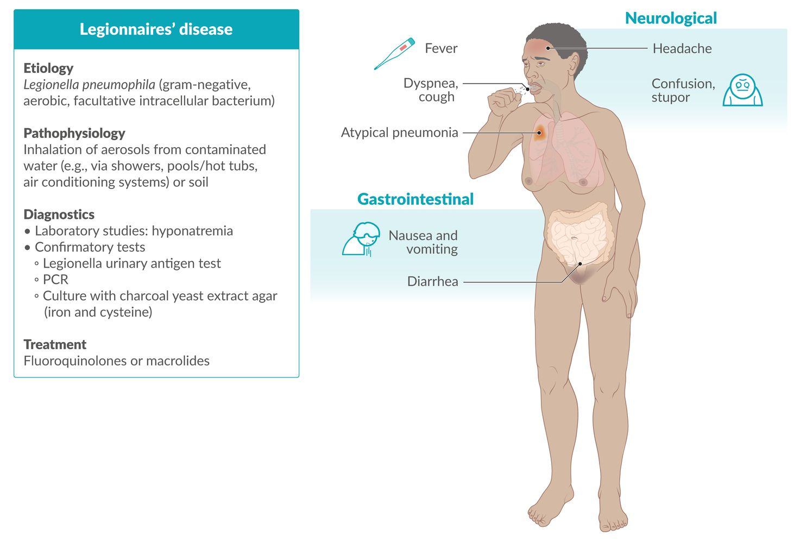
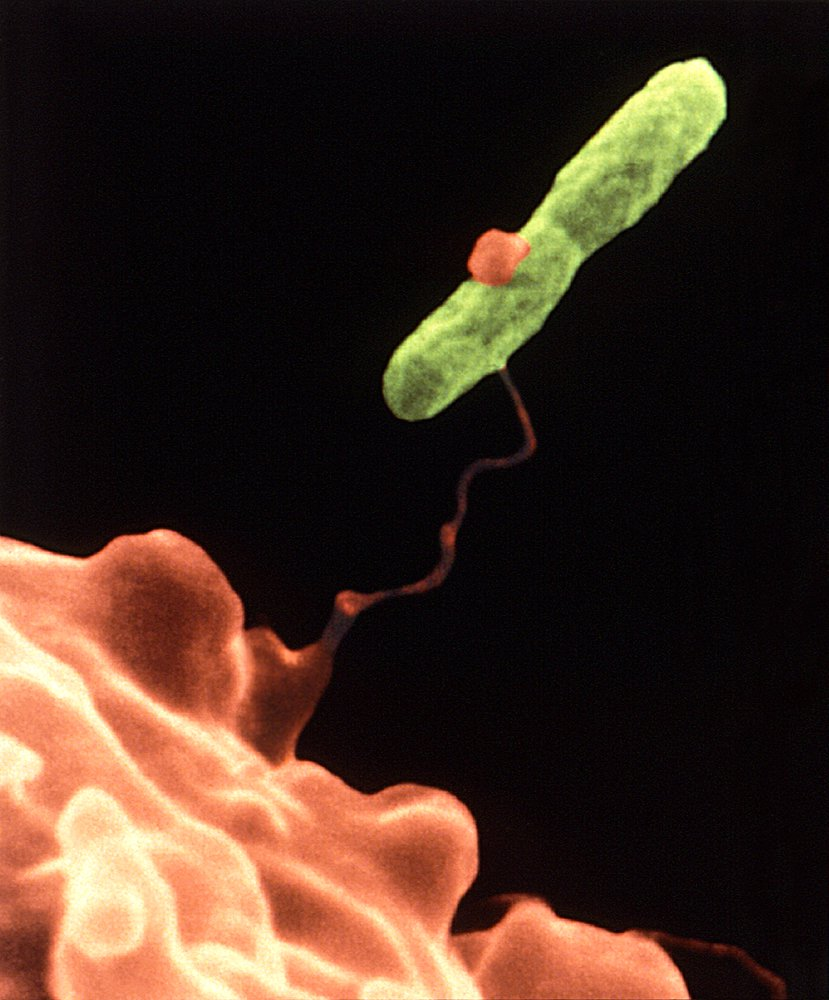
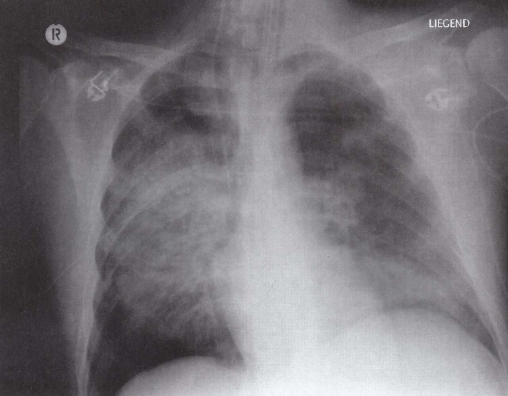
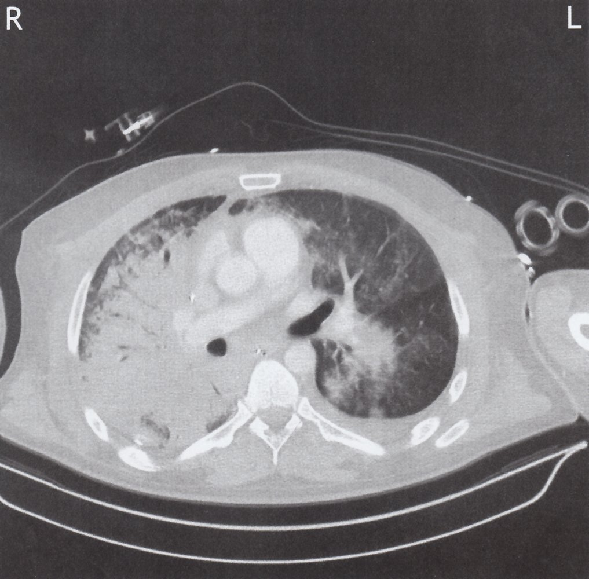
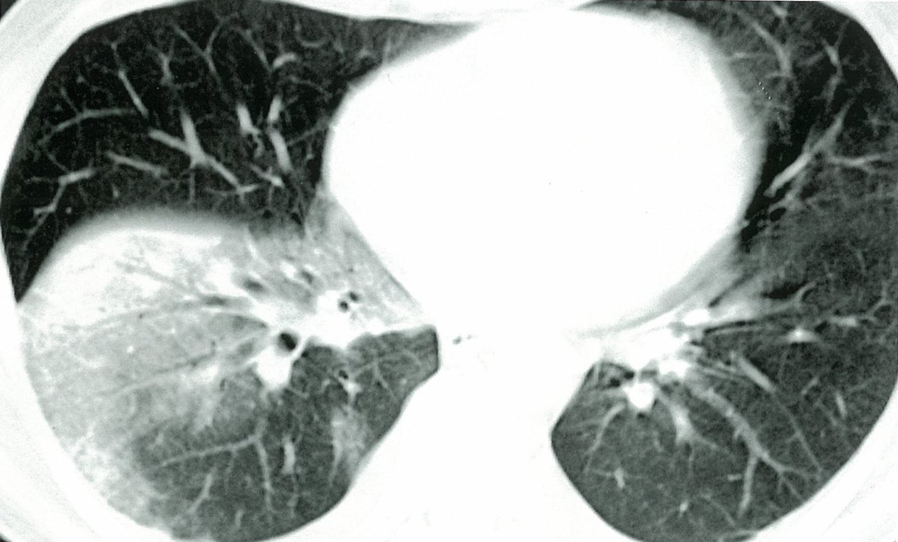

# Legionnaires' disease

*Categories: Clinical knowledge > Internal medicine > Infectious diseases > Infections of the pharynx and respiratory tract > Legionnaires' disease*

[Original Article Link](https://coursology-qbank.com/amboss/article/Vf0GO2)

---

## Summary

Legionnaires' disease is a type of <u>legionellosis</u> that manifests with <u>atypical pneumonia</u> (<u>shortness of breath</u>, <u>cough</u>), typically in combination with gastrointestinal (e.g., <u>diarrhea</u>) and neurological (e.g., confusion) symptoms. The condition is typically caused by <u>Legionella pneumophila</u>, a <u>gram-negative rod</u> that thrives in warm aqueous environments such as drinking-water systems, hot tubs, and air-<u>conditioning</u> units. Transmission occurs via inhalation of contaminated aerosolized water droplets; disease <u>outbreaks</u> are common. Laboratory abnormalities are common, especially <u>hyponatremia</u>. Diagnosis can be confirmed using a urine <u>antigen</u> test, <u>PCR</u>, or microbiological studies. <u>Fluoroquinolones</u> or <u>macrolides</u> are the treatment of choice. <u>Legionellosis</u> is a <u>notifiable disease</u> in the US, and steps should be taken to eliminate contaminated sources and prevent <u>outbreaks</u>.

<u>Pontiac fever</u> is a more mild, <u>flu-like</u> type of <u>legionellosis</u> that is <u>self-limiting</u>.

Legionnaires' disease fact sheet

---

## Epidemiology

* Manifests almost exclusively in adults [[1]](https://coursology-qbank.com/amboss/article/GF1Bji0)

* <u>Outbreaks</u> are typical.  [[2]](https://coursology-qbank.com/amboss/article/-s1DxR0)

* Locations at increased risk of a <u>legionella</u> <u>outbreak</u> include: [[1]](https://coursology-qbank.com/amboss/article/GF1Bji0)

* <u>Nursing homes</u>

* Hospitals

* Confined travel accommodations (e.g., cruise ships, hotels, resorts) [[2]](https://coursology-qbank.com/amboss/article/-s1DxR0)

Epidemiological data refers to the US, unless otherwise specified.

---

## Etiology

* Pathogens [[2]](https://coursology-qbank.com/amboss/article/-s1DxR0)

* Legionella pneumophila

* A gram-negative, aerobic, <u>facultative intracellular bacterium</u>

* Causes ∼ 90% of <u>legionellosis</u> [[3]](https://coursology-qbank.com/amboss/article/kIYm1q)

* Other <u>Legionella</u> spp. (e.g., L. micdadei, L. longbeachae)

* Transmission [[3]](https://coursology-qbank.com/amboss/article/kIYm1q)

* Inhalation of contaminated aerosols 

* Cold and hot water systems

* Whirlpools/hot tubs, swimming pools, showers

* Air <u>conditioning</u> systems with contaminated condensed water

* Person-to-person transmission is uncommon.

* High-risk groups [[1]](https://coursology-qbank.com/amboss/article/GF1Bji0)

* Individuals ≥ 50 years of age

* Individuals with certain chronic diseases (e.g., <u>COPD</u>, <u>diabetes mellitus</u>, <u>CKD</u>)

* <u>Immunocompromised individuals</u>

* Smokers (current or former)

Amoeba catching Legionella pneumophila

---

## Clinical features

* <u>Incubation period</u>: 2–10 days

* <u>Fever</u>, chills, <u>headache</u>

* Severe <u>atypical pneumonia</u>: dry <u>cough</u> which can become productive, <u>shortness of breath</u>, bilateral <u>crackles</u>

* Relative <u>bradycardia</u>

* <u>Diarrhea</u>

* Neurological features, especially confusion, <u>agitation</u>, and <u>stupor</u>

> [!TIP]
> Legionnaires' disease should always be considered in patients with signs of <u>atypical pneumonia</u> and <u>diarrhea</u> in combination with possible exposure (e.g., cruise ship travel, use of a whirlpool).

Legionnaires' disease fact sheet

---

## Subtypes and variants

### Pontiac fever [[3]](https://coursology-qbank.com/amboss/article/kIYm1q)

* Mild course of <u>legionellosis</u> without <u>pneumonia</u>

* Characterized by <u>flu-like symptoms</u> (e.g., <u>fever</u>, <u>headache</u>, <u>myalgia</u>)

* <u>Incubation period</u>: 1–2 days [[3]](https://coursology-qbank.com/amboss/article/kIYm1q)

* <u>Self-limiting</u> disease; specific treatment is not needed.

### Extrapulmonary <u>legionellosis</u> [[3]](https://coursology-qbank.com/amboss/article/kIYm1q)

Extrapulmonary <u>legionellosis</u> has various possible manifestations, e.g.:

* <u>Skin and soft tissue infection</u>

* <u>Septic arthritis</u>

* <u>Endocarditis</u>

> [!TIP]
> Extrapulmonary <u>legionellosis</u> is rare and most commonly affects <u>immunosuppressed</u> patients.

---

## Diagnosis

### Approach [[2]](https://coursology-qbank.com/amboss/article/-s1DxR0)[[4]](https://coursology-qbank.com/amboss/article/y8Yd6I)

* Obtain routine studies and confirm a <u>diagnosis of pneumonia</u>.

* Consider Legionnaires' disease in patients with:

* Epidemiological and/or individual <u>risk factors</u> (see “Epidemiology” and “Etiology”)

* Severe <u>community-acquired pneumonia</u> (<u>CAP</u>), e.g., according to <u>IDSA/ATS criteria for severe CAP</u>

* Confirm diagnosis using a <u>legionella</u> urine <u>antigen</u> test, <u>PCR</u>, and/or culture.

> [!TIP]
> Routine <u>pneumonia diagnostics</u> may show nonspecific but supportive findings.

### Routine studies

#### <u>Laboratory studies</u> [[2]](https://coursology-qbank.com/amboss/article/-s1DxR0)[[5]](https://coursology-qbank.com/amboss/article/eG1xyR0)

* <u>CBC</u>

* <u>Leukocytosis</u>

* <u>Thrombocytopenia</u>

* Serum studies

* <u>Hyponatremia</u>

* <u>Hypophosphatemia</u>

* ↑ <u>Creatinine</u>

* ↑ <u>Transaminases</u>  [[5]](https://coursology-qbank.com/amboss/article/eG1xyR0)

* ↑ <u>CRP</u>

* ↑ <u>Ferritin</u>

* ↑ <u>Procalcitonin</u>

* Urine studies

* <u>Microscopic hematuria</u>

* <u>Proteinuria</u>

> [!TIP]
> <u>Hyponatremia</u> may be caused by <u>SIADH</u> or by dilution and is more commonly associated with Legionnaires' disease than with other causes of <u>pneumonia</u>. [[2]](https://coursology-qbank.com/amboss/article/-s1DxR0)[[5]](https://coursology-qbank.com/amboss/article/eG1xyR0)

#### Imaging [[5]](https://coursology-qbank.com/amboss/article/eG1xyR0)[[6]](https://coursology-qbank.com/amboss/article/IeXYZx)

* <u>Chest x-ray</u>

* Nonspecific findings

* Findings often include either:  [[2]](https://coursology-qbank.com/amboss/article/-s1DxR0)

* <u>Lobar pneumonia</u> (with or without <u>pleural effusion</u>) and lobar <u>pulmonary consolidations</u>

* Diffuse reticular opacities

* Chest CT; findings may include:

* Unilateral or bilateral <u>pulmonary consolidations</u>

* <u>Ground-glass opacities</u>

* <u>Pleural effusion</u>

Legionella pneumonia

ARDS following legionella pneumonia

Lobar consolidation

### Confirmatory studies [[2]](https://coursology-qbank.com/amboss/article/-s1DxR0)[[7]](https://coursology-qbank.com/amboss/article/UG1bAR0)

* Legionella urinary antigen test [[2]](https://coursology-qbank.com/amboss/article/-s1DxR0)

* Most important diagnostic tool

* High <u>specificity</u>, high <u>sensitivity</u>, fast (results available within 15 minutes) [[2]](https://coursology-qbank.com/amboss/article/-s1DxR0)

* Can only detect <u>Legionella pneumophila</u> serogroup 1 <u>antigens</u>  [[2]](https://coursology-qbank.com/amboss/article/-s1DxR0)

* <u>PCR</u>

* High <u>specificity</u>, high <u>sensitivity</u>, fast (results typically available within hours)

* Preferred specimens: <u>sputum</u>, <u>bronchoalveolar lavage</u> (<u>BAL</u>) fluid

* Microbiological studies

* <u>Legionella</u> culture (<u>gold standard</u>) [[7]](https://coursology-qbank.com/amboss/article/UG1bAR0)

* Requires <u>buffered charcoal yeast extract agar</u> with <u>iron</u> and <u>cysteine</u> [[5]](https://coursology-qbank.com/amboss/article/eG1xyR0)

* Slow (results typically after 3–5 days) [[7]](https://coursology-qbank.com/amboss/article/UG1bAR0)

* High <u>specificity</u>, moderate to low <u>sensitivity</u> depending on specimen

* Preferred specimens: <u>sputum</u>, <u>BAL</u> fluid

* Sample stains

* <u>Gram stain</u> of respiratory secretions typically shows many <u>neutrophils</u> but no organisms. [[3]](https://coursology-qbank.com/amboss/article/kIYm1q)

* Visualization of <u>Legionella</u> requires <u>silver stain</u>. [[5]](https://coursology-qbank.com/amboss/article/eG1xyR0)

* <u>Serology</u>

* Not routinely used

* A four-fold rise in <u>antibody</u> <u>titer</u> confirms <u>legionellosis</u>.

---

## Treatment

### General principles [[2]](https://coursology-qbank.com/amboss/article/-s1DxR0)

* <u>Legionellosis</u> is a <u>notifiable disease</u>.  [[8]](https://coursology-qbank.com/amboss/article/zE1ryi0)

* Early <u>antibiotic therapy</u> is the mainstay of treatment.

* Affected individuals do not need to isolate because person-to-person transmission is uncommon.

* Offer <u>supportive therapy for pneumonia</u> as needed.

* See “<u>Management of pneumonia</u>” for further details, including criteria for <u>ICU</u> admission.

> [!WARNING]
> Legionnaires' disease has a <u>mortality rate</u> of ∼10% in patients without high-<u>risk factors</u>. [[1]](https://coursology-qbank.com/amboss/article/GF1Bji0)[[2]](https://coursology-qbank.com/amboss/article/-s1DxR0)

### <u>Antibiotic therapy</u> [[2]](https://coursology-qbank.com/amboss/article/-s1DxR0)[[4]](https://coursology-qbank.com/amboss/article/y8Yd6I)

* <u>Empiric antibiotics</u> for <u>pneumonia</u>

* Initiate as soon as possible.

* Choose initial agents based on the clinical setting.

* See “<u>Empiric antibiotics for hospital-acquired pneumonia</u>.”

* See “<u>Empiric antibiotics for community-acquired pneumonia</u>.”

* Empiric regimens for patients hospitalized with <u>CAP</u> typically include coverage for <u>Legionella</u> (e.g., <u>macrolides</u>, <u>fluoroquinolones</u>, or <u>doxycycline</u>).

* <u>Targeted antibiotics</u>

* Once Legionnaires' disease is confirmed, initiate treatment with or switch to one of the following agents: 

* <u>Fluoroquinolones</u> (preferred): e.g., <u>levofloxacin</u> DOSAGE  [[2]](https://coursology-qbank.com/amboss/article/-s1DxR0)

* <u>Macrolides</u>: e.g., PO <u>azithromycin</u> DOSAGE, or IV <u>azithromycin</u>DOSAGE

* Alternative agents include <u>tigecycline</u> and <u>doxycycline</u> [[2]](https://coursology-qbank.com/amboss/article/-s1DxR0)[[5]](https://coursology-qbank.com/amboss/article/eG1xyR0)

* Initial parenteral treatment is recommended for hospitalized patients.

> [!TIP]
> Empiric treatment of <u>atypical pneumonia</u> and <u>antibiotic</u> regimens for inpatient treatment of <u>CAP</u> need to cover <u>Legionella</u> species.

---