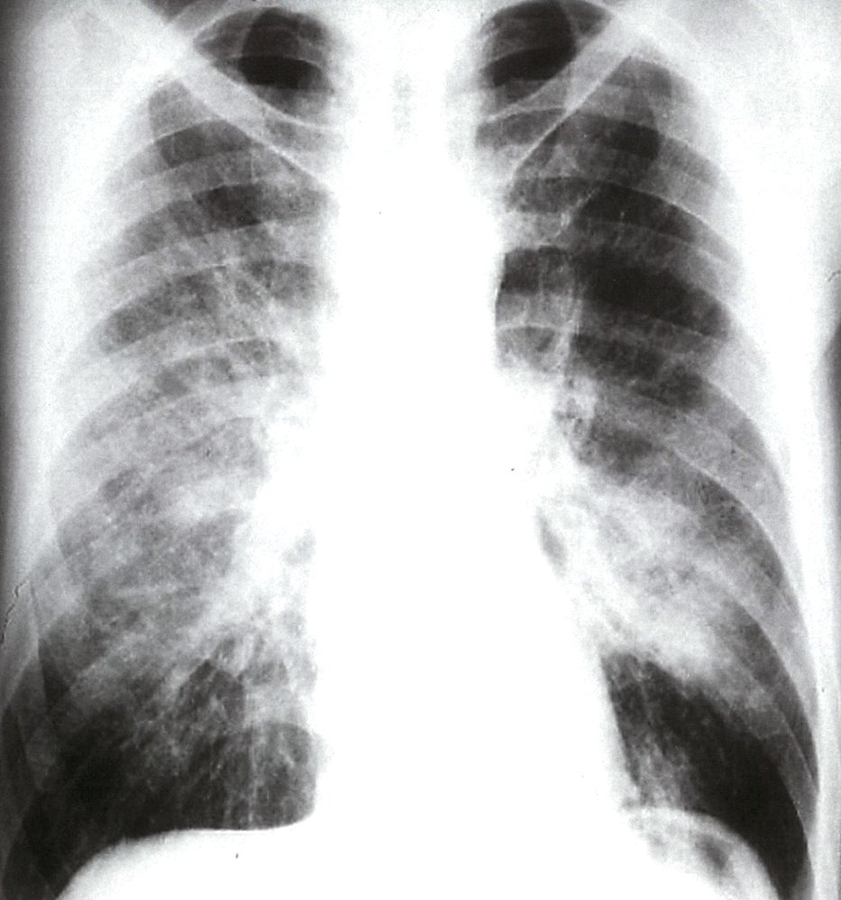
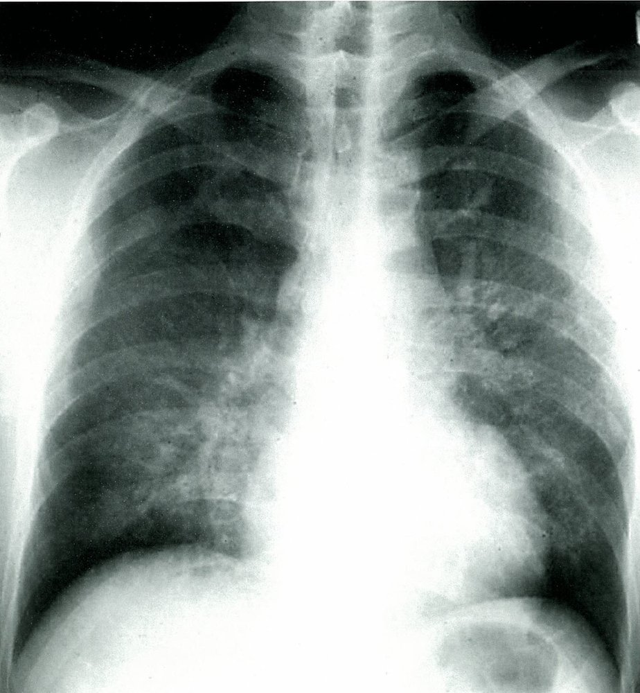
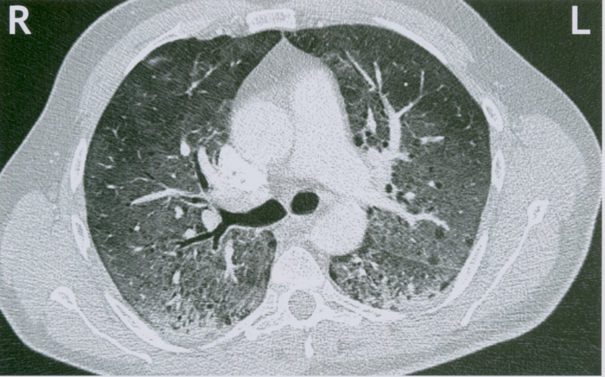
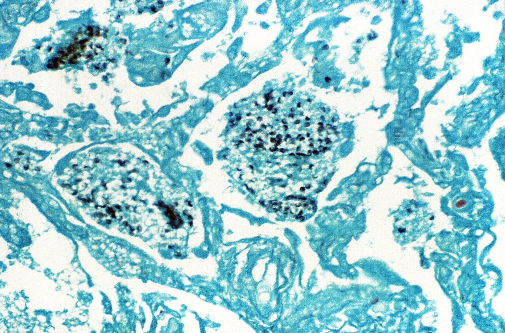
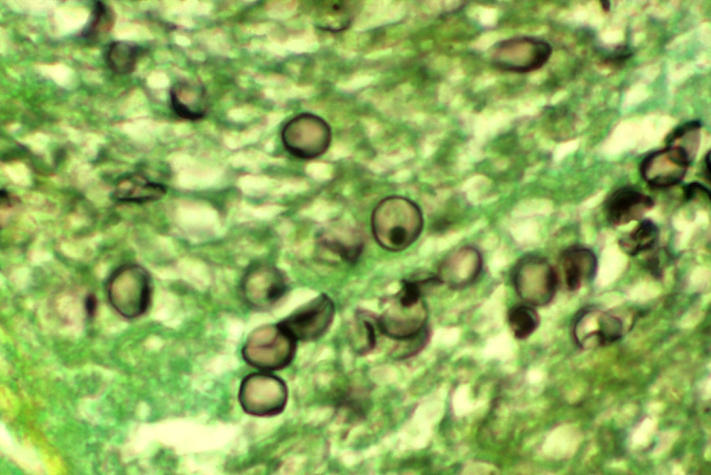

# Pneumocystis pneumonia

*Categories: Clinical knowledge > Internal medicine > Infectious diseases > Infections of the pharynx and respiratory tract > Pneumocystis pneumonia*

[Original Article Link](https://coursology-qbank.com/amboss/article/If0Yn2)

---

## Summary

<u>Pneumocystis jirovecii</u> <u>pneumonia</u> (<u>PCP</u>), previously known as <u>Pneumocystis carinii</u> <u>pneumonia</u>, is an opportunistic fungal <u>lung</u> infection occurring almost exclusively in <u>immunocompromised individuals</u>. It is an <u>HIV-associated condition</u> but may be caused by other <u>immunodeficiencies</u>, including <u>primary immunodeficiency disorders</u>, <u>immunodeficiency</u> resulting from <u>malignancy</u>, following a solid organ or <u>stem cell</u> transplant, or secondary to the long-term use of <u>immunosuppressants</u> such as high-dose <u>steroids</u>. <u>PCP</u> should be suspected in <u>immunocompromised</u> patients with a history of progressive <u>dyspnea</u>, dry <u>cough</u>, or <u>hypoxia</u>. Other findings that further support the diagnosis include an increase in <u>β-D-Glucan</u> and <u>LDH</u> levels, and diffuse bilateral infiltrates on chest imaging. <u>PCP</u> is confirmed if <u>P. jirovecii</u> is detected on an <u>induced sputum</u> sample, <u>bronchoalveolar lavage</u>, or <u>lung tissue</u> <u>biopsy</u>. Management of <u>PCP</u> includes high-dose <u>trimethoprim/sulfamethoxazole</u> (<u>TMP/SMX</u>), treatment of the underlying <u>immunodeficiency</u> disorder, and, in some cases, adjunctive <u>glucocorticoids</u>. Prophylaxis regimens for <u>PCP</u> should be considered for patients with significant <u>immunosuppression</u> and commonly include the use of long-term, low-dose <u>TMP/SMX</u>.

---

## Definitions

* <u>Interstitial pneumonia</u> caused by the <u>yeast</u>-like fungal organism <u>Pneumocystis jirovecii</u> [[1]](https://coursology-qbank.com/amboss/article/rVafDj)

---

## Etiology

* <u>Pathogen</u>: P. jirovecii (former <u>P. carinii</u>): ubiquitous, <u>yeast</u>-like fungus previously classified as a <u>protozoan</u>

* Route of transmission: airborne [[2]](https://coursology-qbank.com/amboss/article/21YTTL)

* <u>Risk factors</u>

* <u>HIV</u> infection ;  [[3]](https://coursology-qbank.com/amboss/article/sVatDj)

* <u>CD4 count</u>: usually < 200/μL

* Poor compliance with <u>PCP prophylaxis</u> or <u>cART</u>

* History of <u>PCP</u> infection

* <u>Primary immunodeficiency disorders</u> [[4]](https://coursology-qbank.com/amboss/article/FYbgIH)

* <u>Severe combined immunodeficiency</u> disorder

* <u>Hyper IgM syndrome</u>

* <u>Immunosuppressive treatment</u> (e.g., chronic <u>glucocorticoid</u> therapy)

* <u>Malignancy</u> (e.g., <u>leukemia</u>, <u>non-Hodgkin lymphoma</u>)

* <u>Malnutrition</u>

---

## Clinical features

### Symptoms of <u>PCP</u> [[5]](https://coursology-qbank.com/amboss/article/Ejc8Xc0)[[6]](https://coursology-qbank.com/amboss/article/HjcKbc0)

* May be asymptomatic initially

* Symptoms can have a gradual onset (days to weeks) and include:

* Low-grade <u>fever</u> and <u>malaise</u>

* <u>Dyspnea</u>, <u>tachypnea</u>, and nonproductive <u>cough</u>

* Fatigue, weight loss, chills

* May progress to fulminant <u>respiratory failure</u>

> [!TIP]
> The clinical course of <u>PCP</u> is usually more acute and severe in <u>HIV</u>-negative patients compared to <u>HIV</u>-positive patients. <u>HIV</u>-positive patients often initially have an indolent course with mild exertional symptoms and no <u>fever</u> or <u>cough</u>. [[5]](https://coursology-qbank.com/amboss/article/Ejc8Xc0)[[6]](https://coursology-qbank.com/amboss/article/HjcKbc0)[[7]](https://coursology-qbank.com/amboss/article/kIYm1q)

### <u>Clinical examination</u> [[5]](https://coursology-qbank.com/amboss/article/Ejc8Xc0)[[6]](https://coursology-qbank.com/amboss/article/HjcKbc0)

* Chest <u>auscultation</u>

* Bilateral <u>crackles</u> and <u>rhonchi</u>

* Unremarkable <u>auscultatory</u> findings are possible in the early stages of disease.

* <u>Pulse oximetry</u>: ↓ <u>oxygen saturation</u> (e.g., < 90% at rest and worsens with exertion)

> [!TIP]
> <u>PCP</u> is often misdiagnosed as <u>atypical pneumonia</u> or <u>bronchitis</u> because of the persistent <u>cough</u> and similar <u>auscultatory</u> findings.

---

## Diagnosis

Consider <u>PCP</u> in patients with respiratory symptoms or unexplained <u>hypoxia</u> and a history of <u>HIV</u> or other causes of impaired <u>humoral immunity</u> (e.g., <u>organ transplantation</u>, <u>immunosuppressive</u> medications, <u>malignancy</u>). See also “<u>Diagnosis of pneumonia</u>.”

### Approach [[6]](https://coursology-qbank.com/amboss/article/HjcKbc0)[[8]](https://coursology-qbank.com/amboss/article/52aiRP)

* Order an initial <u>pneumonia</u> workup, including:

* Routine <u>laboratory studies</u>: <u>CBC</u>, <u>BMP</u>, <u>LFTs</u>

* Imaging studies: <u>chest x-ray</u>; if findings are inconclusive, consider CT chest.

* <u>ABG</u>: used to determine the severity of disease and to guide therapy

* Confirm the presence of <u>PCP</u>.

* Consider initial testing for nonspecific <u>PCP</u> markers to further support the diagnosis, i.e., β‑D‑Glucan, <u>LDH</u>.

* Obtain a sample (e.g., <u>induced sputum</u>) to test for <u>P. jirovecii</u>.

* Identify the underlying cause of <u>immunosuppression</u> (if unknown).  [[8]](https://coursology-qbank.com/amboss/article/52aiRP)

* Perform <u>HIV testing</u> and order a <u>CD4 count</u> if <u>HIV</u> positive.

* Review the patient's medications for <u>immunosuppressants</u> (e.g., <u>corticosteroids</u>, <u>cyclophosphamide</u>, <u>TNF-α inhibitors</u>).

* Consider specialist consultation (e.g., <u>allergy</u> and <u>immunology</u>) if no other cause of <u>immunosuppression</u> can be determined.

> [!TIP]
> Clinical presentation, <u>laboratory studies</u>, and imaging studies are not <u>pathognomonic</u> for <u>PCP</u>. Maintain a broad differential diagnosis and seek a definitive diagnosis of <u>PCP</u> when possible.

> [!TIP]
> Because <u>P. jirovecii</u> cannot be routinely cultured, it requires confirmation via histopathological, cytopathological, or molecular identification of <u>P. jirovecii</u> from respiratory secretions or <u>lung tissue</u>.

### Initial studies

#### <u>Laboratory studies</u> [[6]](https://coursology-qbank.com/amboss/article/HjcKbc0)

* Nonspecific markers for <u>PCP</u> 

* ↑ <u>β-D-Glucan</u>  [[9]](https://coursology-qbank.com/amboss/article/uVapwj)

* ↑ <u>LDH</u>  [[10]](https://coursology-qbank.com/amboss/article/ojc0Yc0)

* <u>Arterial blood gas</u>: ↓ <u>PaO2</u> and ↑ <u>A-a gradient</u>

* ↓ <u>CD4 count</u> (in <u>HIV</u>-positive patients): typically < 200/mm³

#### Imaging studies [[6]](https://coursology-qbank.com/amboss/article/HjcKbc0)

* <u>X-ray chest</u>

* Order initially for all patients.

* Findings

* Diffuse, bilateral, symmetrical, <u>interstitial</u> infiltrates extending from the perihilar region (butterfly pattern)

* May be normal in the early stages of <u>PCP</u>

* CT chest without contrast (<u>HRCT</u> may increase diagnostic <u>accuracy</u>)

* Indicated if <u>PCP</u> is still suspected in a patient with a normal <u>chest x-ray</u>

* Findings

* Ground-glass attenuation: symmetrical, diffuse, <u>interstitial</u> infiltrates

* <u>Pneumatoceles</u>: cystic air-filled spaces within the <u>lung tissue</u>

* A normal CT effectively rules out the diagnosis.

> [!TIP]
> Patients with <u>PCP</u> rarely present with <u>lung</u> cavitations or <u>pleural effusions</u> on <u>chest x-ray</u>. If these findings are present, consider alternative diagnoses or additional pathology. [[6]](https://coursology-qbank.com/amboss/article/HjcKbc0)

Perihilar opacities in Pneumocystis jirovecii pneumonia (PCP)

Pneumocystis jirovecii pneumonia (PJP)

Ground glass opacification in Pneumocystis jirovecii pneumonia

### Diagnostic confirmation [[6]](https://coursology-qbank.com/amboss/article/HjcKbc0)

* <u>Histopathology</u> (preferred <u>confirmatory test</u>): identification of <u>P. jirovecii</u>

* Specimen

* First-line: <u>induced sputum</u>

* Second-line: <u>bronchoalveolar lavage</u> or <u>lung tissue</u> <u>biopsy</u>

* Method: Staining enables visualization of disc-shaped <u>P. jirovecii</u> cysts with central spores. 

* Giemsa, Wright, and Diff-Quik stain the cystic and trophic forms but not the cyst wall.

* Methenamine silver, cresyl violet, and toluidine blue stain the cyst wall.

* <u>Immunofluorescence</u>

* Molecular testing: alternative to <u>histopathology</u> or <u>cytopathology</u> for <u>PCP</u> diagnosis

* Specimen: <u>sputum</u>, blood, or <u>nasopharyngeal</u> aspirates

* Types

* <u>Polymerase chain reaction</u> (<u>PCR</u>)

* <u>Quantitative PCR</u>

> [!TIP]
> Spontaneously expectorated <u>sputum</u> should not be used for diagnostic studies because it has poor <u>sensitivity</u> for <u>PCP</u>. Use <u>induced sputum</u> instead. [[6]](https://coursology-qbank.com/amboss/article/HjcKbc0)

Pneumocystis jirovecii pneumonia

Cysts of Pneumocystis jirovecii

---

## Treatment

### <u>PCP</u> treatment [[5]](https://coursology-qbank.com/amboss/article/Ejc8Xc0)[[6]](https://coursology-qbank.com/amboss/article/HjcKbc0)[[7]](https://coursology-qbank.com/amboss/article/kIYm1q)[[11]](https://coursology-qbank.com/amboss/article/f1YkTL)

* General considerations

* If clinical suspicion is high, treatment can be initiated before a definitive diagnosis is established.

* Treatment recommendations vary depending on the patient's <u>HIV</u> status and <u>PCP</u> disease severity.

* Disease severity

* Mild to moderate <u>PCP</u>: <u>PaO2</u> ≥ 70 mm Hg and <u>A-a gradient</u> < 35 mm Hg on room air

* Moderate to severe <u>PCP</u>: <u>PaO2</u> ; < 70 mm Hg or <u>A-a gradient</u> ; ≥ 35 mm Hg on room air

* <u>Antibiotic therapy</u>

* High-dose <u>TMP/SMX</u> is the treatment of choice.

* A 21-day <u>antibiotic</u> course is recommended for most patients, regardless of the <u>antibiotic</u> regimen.  [[7]](https://coursology-qbank.com/amboss/article/kIYm1q)

* For patients with treatment failure :

* Consider changing to an alternative <u>antibiotic</u> regimen under the guidance of an infectious disease specialist.

* Exclude concomitant infections.

|  <u>Antibiotic therapy</u> for <u>PCP</u> [[6]](https://coursology-qbank.com/amboss/article/HjcKbc0)  |  |  |
| --- | --- | --- |
|  | Preferred | Alternative |
| Mild to moderate <u>PCP</u> |  * Oral <u>TMP/SMX</u>  DOSAGE   |   * Oral <u>dapsone</u> DOSAGE PLUS oral <u>trimethoprim</u> DOSAGE  * OR oral <u>primaquine</u> DOSAGE  PLUS <u>clindamycin</u> DOSAGE  * OR oral <u>atovaquone</u> DOSAGE    |
| Moderate to severe <u>PCP</u> |  * IV <u>TMP/SMX</u> DOSAGE   |   * IV <u>pentamidine</u> DOSAGE  * OR oral <u>primaquine</u> DOSAGE PLUS oral <u>clindamycin</u> DOSAGE    |

* Adjunctive therapy

* <u>HIV</u>-positive patients

* Moderate to severe <u>PCP</u>: Start <u>glucocorticoids</u> (e.g., <u>prednisone</u>;  DOSAGE ) as soon as possible and within 72 hours of starting <u>antibiotics</u>.  [[6]](https://coursology-qbank.com/amboss/article/HjcKbc0)

* Initiate <u>cART</u> in consultation with an infectious diseases specialist within 2 weeks of <u>PCP</u> diagnosis. [[6]](https://coursology-qbank.com/amboss/article/HjcKbc0)

* <u>HIV</u>-negative patients: decision on a case-by-case basis in consultation with a specialist  [[12]](https://coursology-qbank.com/amboss/article/oPc0fc0)

* <u>Supportive care</u> (see also “Supportive therapy” in “<u>Pneumonia</u>”)

* Start <u>oxygen therapy</u> for <u>hypoxemia</u>.

* Consider <u>indications for invasive mechanical ventilation</u>.

* Start <u>immediate hemodynamic support</u> for patients with <u>hypotension</u> and/or <u>shock</u>.

> [!TIP]
> <u>TMP/SMX</u> can still be an effective treatment for patients who develop <u>PCP</u> despite <u>TMP/SMX</u> prophylaxis.

> [!TIP]
> The benefit of adjunctive <u>glucocorticoid</u> therapy for <u>PCP</u> in <u>HIV</u>-negative patients is unclear. [[12]](https://coursology-qbank.com/amboss/article/oPc0fc0)

### PCP prophylaxis [[5]](https://coursology-qbank.com/amboss/article/Ejc8Xc0)[[6]](https://coursology-qbank.com/amboss/article/HjcKbc0)[[13]](https://coursology-qbank.com/amboss/article/BYczra0)[[14]](https://coursology-qbank.com/amboss/article/NVc-uY0)

* Goal: to reduce the <u>probability</u> of <u>opportunistic infections</u> from <u>PCP</u> in at-risk populations (specialist consultation is advised)

* Primary prophylaxis; indicated for patients with no history of <u>PCP</u> with either:

* <u>HIV infection</u> with a <u>CD4</u> cell count < 200/mm³

* <u>Immunosuppression</u> from other causes, e.g:

* High-dose <u>glucocorticoid</u> treatment (e.g., ≥ 20–30 mg/day of <u>prednisone</u>) lasting for ≥ 4 weeks

* Cytotoxic and/or <u>biologic therapies</u>

* <u>Primary immunodeficiencies</u> or hematological malignancies (e.g., <u>acute lymphocytic leukemia</u>)

* Following solid organ , or <u>stem cell</u> transplant

* Secondary prophylaxis: indicated for patients with a history of <u>PCP</u> with <u>immunosuppression</u> in order to prevent recurrence

* Prophylactic regimens: See also “<u>Prevention of opportunistic infections in HIV</u>” for dosages. [[6]](https://coursology-qbank.com/amboss/article/HjcKbc0)

* Low‑dose <u>TMP/SMX</u>

* Alternative (e.g., if allergic to <u>TMP/SMX</u>)  [[15]](https://coursology-qbank.com/amboss/article/ysXdxz)[[16]](https://coursology-qbank.com/amboss/article/AsXRxz); 

* <u>Dapsone</u>

* OR <u>atovaquone</u>

---