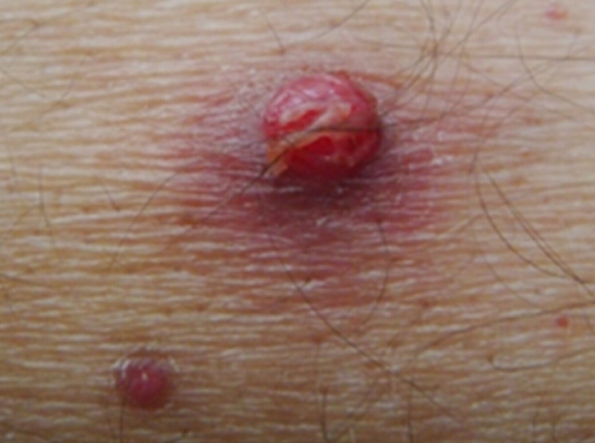

# Bacillary angiomatosis

*Categories: Clinical knowledge > Internal medicine > Infectious diseases > Opportunistic infections > Bacillary angiomatosis*

[Original Article Link](https://coursology-qbank.com/amboss/article/yH0dGh)

---

## Summary

Bacillary <u>angiomatosis</u> is a <u>skin</u> condition in <u>immunocompromised</u> patients (especially patients with <u>AIDS</u> and/or <u>CD4 count</u> < 100/mm³) characterized by vascular <u>proliferation</u> that results in lesions on the <u>skin</u> and potentially other organs (e.g., <u>GI tract</u>, respiratory tract). It is caused primarily by <u>Bartonella henselae</u>, which is most commonly transmitted via cat scratches. <u>Skin</u> manifestations include red <u>papules</u> and <u>nodules</u> that bleed easily. Diagnosis is confirmed on <u>biopsy</u>. <u>Antibiotics</u> are used to treat bacillary <u>angiomatosis</u>, and patients with <u>HIV</u> should be started on <u>ART</u>.

---

## Etiology

* Primarily <u>Bartonella henselae</u>, which is most commonly transmitted via cat scratches [[2]](https://coursology-qbank.com/amboss/article/05XeiA)

* Less commonly <u>Bartonella quintana</u>, which is mainly transmitted by <u>body lice</u>

---

## Clinical features

* Seen primarily in <u>immunocompromised</u> patients (especially patients with <u>AIDS</u> and/or <u>CD4 count</u> < 100/mm³)

* Solitary or multiple, red, flesh-colored or colorless <u>papules</u> and <u>nodules</u> that bleed easily

* <u>Fever</u>, chills, <u>malaise</u>, <u>anorexia</u>

Bacillary angiomatosis

---

## Diagnosis

* <u>Biopsy</u> of lesion (first-line test) [[2]](https://coursology-qbank.com/amboss/article/05XeiA)

* Benign <u>capillary</u> vascular <u>proliferation</u>

* Neutrophilic infiltrate

* The Warthin-Starry stain is used to visualize <u>bacilli</u>.

* The following studies may provide supportive evidence but are not widely available/used: [[2]](https://coursology-qbank.com/amboss/article/05XeiA)

* <u>Serology</u> (may be negative in up to 25% of patients with <u>HIV</u>)

* Blood or tissue culture for isolation <u>Bartonella</u> (may be negative even in affected patients)

* <u>PCR</u> of tissue samples

> [!WARNING]
> <u>Serology</u> may be unreliable in <u>advanced HIV infection</u>, as some patients never develop <u>antibodies</u>!

> [!TIP]
> Neutrophilic inflammation is seen in bacillary <u>angiomatosis</u>. <u>Lymphocytic</u> inflammation is seen in <u>Kaposi sarcoma</u>.

---

## Differential diagnoses

* <u>Kaposi sarcoma</u>

* <u>Cherry angioma</u>

* <u>Hemangioma</u>

* <u>Dermatofibroma</u>

* <u>Pyogenic granuloma</u>

The differential diagnoses listed here are not exhaustive.

---

## Treatment

* Initiate <u>ART</u> (if not already started) in patients with <u>HIV</u>.

* <u>Antibiotic therapy</u> [[2]](https://coursology-qbank.com/amboss/article/05XeiA)

* Preferred agents: <u>erythromycin</u>  DOSAGE OR <u>doxycycline</u> DOSAGE

* Duration of therapy: at least 3 months

* In seropositive patients, serial <u>IgG antibody</u> <u>titers</u> (every 6–8 weeks) can be used to monitor response to therapy.

* Management of recurrences 

* Switch to <u>antibiotics</u> from a different drug class for at least 3 months.

* Consider <u>rifamycins</u> for severe disease.

---

## Prevention

* <u>Bartonella henselae</u> [[2]](https://coursology-qbank.com/amboss/article/05XeiA)

* Limit cat ownership to cats > 1 year old and in good condition; provide regular <u>flea</u> treatment.

* Reduce the risk of cat scratches: Avoid petting stray cats and playing roughly with cats.

* Clean any scratches promptly with soap and clean water.

* <u>Bartonella quintana</u> [[2]](https://coursology-qbank.com/amboss/article/05XeiA)

* Advise patients to avoid sharing clothes or bedding; wash clothes and bedding in hot water (> 50°C (> 122°F)).

* Provide treatment to patients affected by <u>body lice</u>.

---