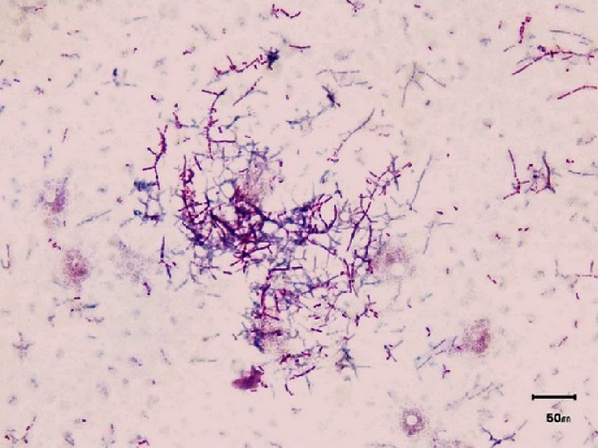

# Nocardiosis

*Categories: Clinical knowledge > Internal medicine > Infectious diseases > Opportunistic infections > Nocardiosis*

[Original Article Link](https://coursology-qbank.com/amboss/article/Zo0Z0S)

---

## Summary

Nocardiosis is a rare infection caused by <u>Nocardia</u>, a genus of aerobic, gram-positive bacteria. It manifests as either pulmonary, cutaneous, or disseminated disease. <u>Pulmonary nocardiosis</u> presents as a <u>virulent</u> form of <u>pneumonia</u>, which occurs more commonly in <u>immunosuppressed</u> individuals. As in any other type of <u>pneumonia</u>, productive <u>cough</u>, <u>pleuritic chest pain</u>, and <u>fever</u> are the dominant symptoms, making it difficult to differentiate from other <u>lung</u> infections. <u>Cutaneous nocardiosis</u> manifests with either <u>cellulitis</u> or <u>purulent</u> <u>erythematous</u> <u>nodules</u>. It may be accompanied by inflamed <u>lymph nodes</u>. The disseminated form predominantly occurs in <u>immunocompromised</u> patients and is typically associated with pulmonary or <u>CNS</u> involvement. A suspected diagnosis is confirmed via culture from infected material (e.g., <u>sputum</u> or <u>skin</u> samples). The mainstay of treatment is long-term <u>antibiotic therapy</u> with <u>TMP/SMX</u>. Without treatment, <u>pulmonary nocardiosis</u> and <u>disseminated nocardiosis</u> are usually fatal in <u>immunocompromised</u> patients.

---

## Etiology

* <u>Pathogen</u>: <u>Nocardia</u>;  species (ubiquitous in soil worldwide) [[4]](https://coursology-qbank.com/amboss/article/4Sa3-P)

* N. otitidiscaviarum

* <u>N. brasiliensis</u>

* <u>Nocardia asteroides</u> complex

* Transmission: inhalation (most common), ingestion, and <u>inoculation</u> through a <u>skin</u> wound or injury

* <u>Risk factors</u>

* <u>Immunocompromise</u>;  (e.g., due to <u>HIV infection</u>, organ transplant, <u>glucocorticoid</u> therapy, recent <u>chemotherapy</u>, <u>diabetes mellitus</u>)

* Advanced age

---

## Clinical features

### Pulmonary nocardiosis [[5]](https://coursology-qbank.com/amboss/article/lSav-P)

* Course: acute, subacute, or chronic

* Risk group: <u>immunocompromised individuals</u>

* Clinical features

* Constitutional: <u>fever</u>, weight loss, <u>anorexia</u>, night sweats

* Respiratory (recurrent <u>pneumonia</u>): productive <u>cough</u>, <u>dyspnea</u>, <u>pleuritic chest pain</u>

* <u>Pulmonary nocardiosis</u> symptoms such as <u>fever</u>, chills, and weight loss are often mistaken for <u>tuberculosis</u>

### Cutaneous nocardiosis

* Primary infection

* <u>Superficial</u> cutaneous: <u>cellulitis</u>;  (<u>pain</u>, swelling, <u>erythema</u>, and warmth), <u>nodules</u>, <u>abscesses</u>, <u>ulceration</u>

* Lymphocutaneous: <u>superficial</u> cutaneous infection, regional <u>lymphadenopathy</u>, and <u>lymphangitis</u>

* Subcutaneous <u>mycetoma</u>: chronic <u>pyogenic</u> lesion of the extremities (usually affecting the feet, back, and hands) → painless indurated <u>nodule</u> → <u>draining sinus</u> tract

* Cutaneous involvement

* Originates from a disseminated focus or after trauma

* Indiscernible from primary lesions, although features of underlying systemic disease (<u>pneumonia</u>, <u>seizures</u>, focal deficits) are present

### Disseminated nocardiosis

* Definition: two or more sites of involvement

* Clinical features: generally involves both the <u>lungs</u> and the <u>brain</u> 

* Pulmonary findings are prominent.

* <u>Metastatic</u> <u>abscesses</u> may be found almost anywhere but are predominantly located on the lower extremities.

* <u>CNS</u> features: <u>headache</u>, <u>lethargy</u>, confusion, <u>seizures</u>, sudden onset of neurological deficits

> [!TIP]
> The combination of <u>pneumonia</u> and <u>abscess</u> in the lower extremities is particularly suggestive of nocardiosis.

---

## Diagnosis

* Culture: <u>confirmatory test</u> 

* Specimens: <u>sputum</u>, <u>skin biopsy</u> samples, <u>CSF</u> fluid, and/or <u>pus</u> from the cutaneous lesions

* Gram-positive aerobic <u>bacilli</u>, weakly <u>acid-fast</u>;  , branching filamentous rods

* Imaging 

* Chest <u>x-ray</u> or CT 

* Pulmonary <u>nodules</u> (with or without cavitation)

* Infiltrates (reticulonodular pattern or diffuse)

* <u>Abscess</u>, <u>empyema</u>

* Head CT or <u>MRI</u>: <u>brain abscesses</u>  [[5]](https://coursology-qbank.com/amboss/article/lSav-P)

Nocardia in blood culture

---

## Treatment

* <u>Antibiotic therapy</u>: <u>trimethoprim-sulfamethoxazole</u> (drug of choice)

* Long-term therapy of at least 6 months is recommended.

* Alternatives: <u>carbapenems</u> (<u>imipenem</u> or <u>meropenem</u>), <u>third-generation cephalosporins</u> (<u>cefotaxime</u> or <u>ceftriaxone</u>), and <u>amikacin</u> are indicated:

* As part of combination therapy

* In patients with an <u>allergy</u> or intolerance to <u>sulfonamides</u>

* First-line treatment failure

* Interventional management

* Surgical drainage of <u>abscesses</u> and <u>debridement</u> of <u>necrotic</u> tissue

* <u>Brain abscesses</u> typically require stereotactic <u>aspiration</u> or surgical excision (See “<u>Treatment of brain abscess</u>”). [[6]](https://coursology-qbank.com/amboss/article/ned7zK0)

* Complications of pulmonary infection (e.g., <u>empyema</u>, <u>mediastinal</u> fluid collections, <u>pericardial effusion</u>) may require surgical intervention. [[7]](https://coursology-qbank.com/amboss/article/5SaiZ4)

---