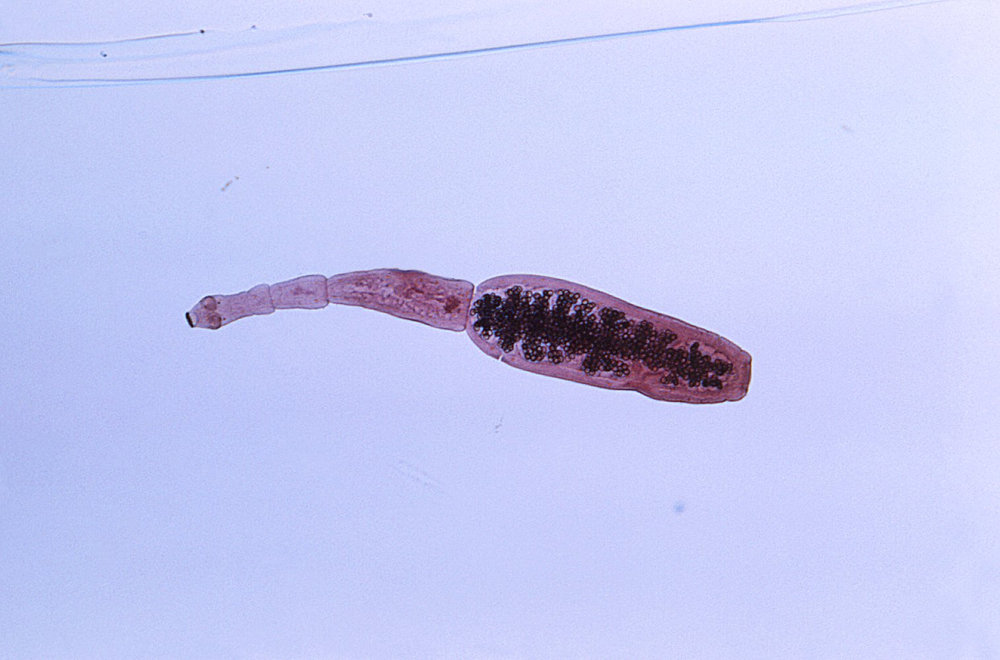
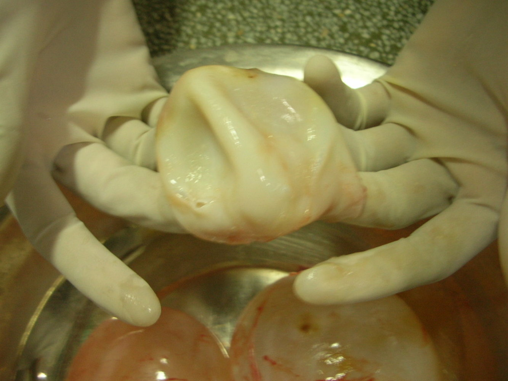
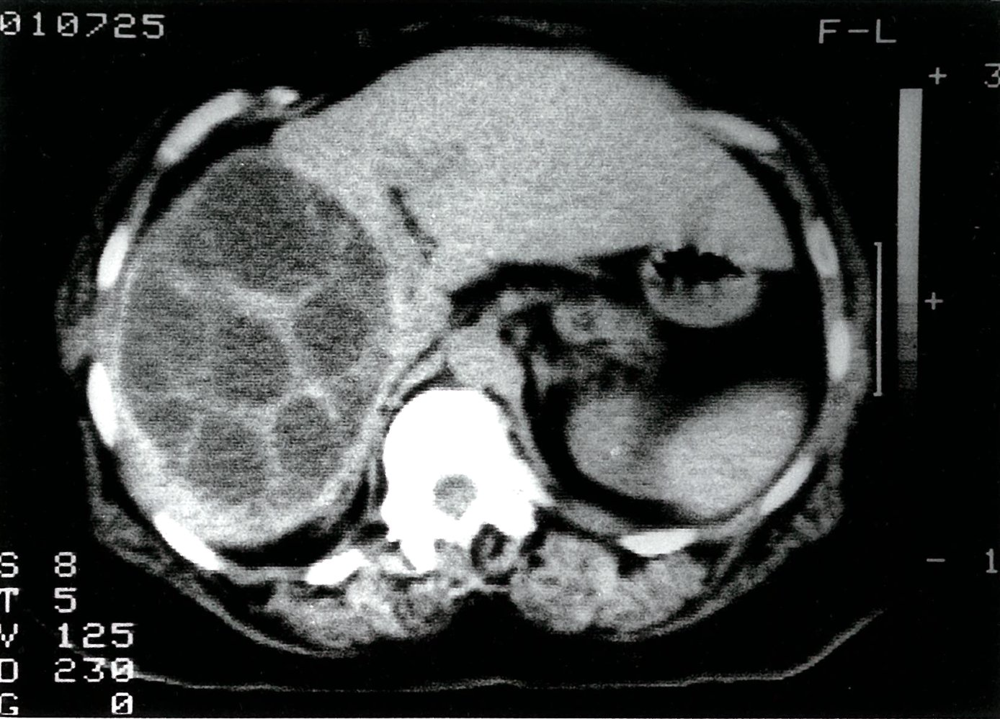
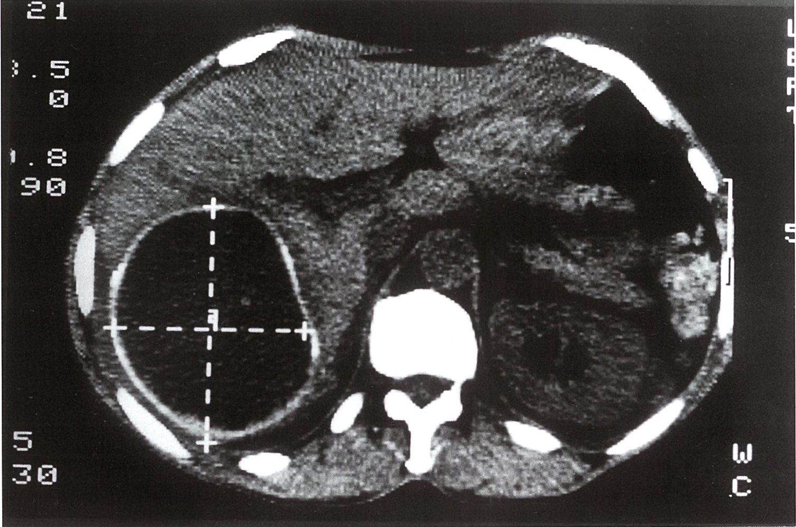
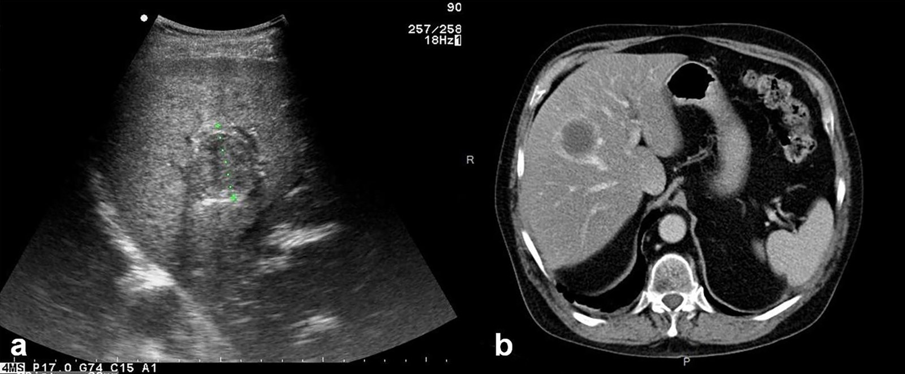
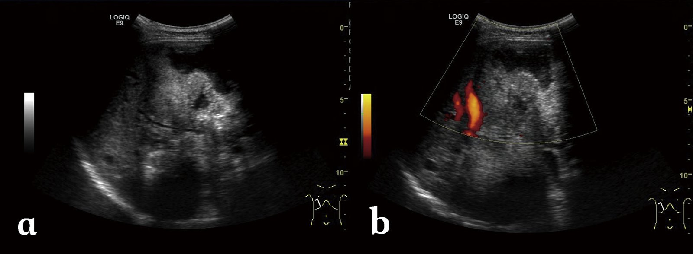

# Echinococcosis

*Categories: Clinical knowledge > Internal medicine > Infectious diseases > Parasitic infections > Echinococcosis*

[Original Article Link](https://coursology-qbank.com/amboss/article/9f0No2)

---

## Summary

Human echinococcosis, also known as hydatidosis or hydatid disease, is a parasitic disease caused by small <u>tapeworms</u> of the genus <u>Echinococcus</u>. The two most common forms of hydatidosis are <u>cystic echinococcosis</u> (CE), caused by E. granulosus, and <u>alveolar echinococcosis</u> (AE), caused by E. multilocularis. Infection occurs by ingesting <u>Echinococcus</u> eggs, most commonly via hand-to-mouth transmission or through food, water, or soil contaminated with feces. Following a long <u>incubation period</u>, infection with E. granulosus typically results in the formation of a single <u>liver cyst</u> (hydatid cyst), which may be asymptomatic or cause upper abdominal <u>pain</u> and other GI complaints. In contrast, infection with E. multilocularis resembles a hepatic <u>malignancy</u> that invades and destroys the surrounding tissue, which can lead to complications such as <u>portal hypertension</u>, <u>cholangitis</u>, <u>jaundice</u>, and even <u>cirrhosis</u>. Other extrahepatic manifestations may also occur as a result of <u>metastasis</u> to distant sites. Because of its malignant nature, AE is more difficult to treat and has a much higher <u>mortality rate</u> than CE. Treatment for both diseases consists of <u>antihelminthic agents</u> (e.g., <u>albendazole</u> or <u>mebendazole</u>), often in combination with surgical intervention.

---

## Etiology

* Pathogens: <u>Echinococcus</u> <u>tapeworms</u> [[1]](https://coursology-qbank.com/amboss/article/Pk0WLT)[[2]](https://coursology-qbank.com/amboss/article/4k03LT)

* Echinococcus granulosus causes CE

* Echinococcus multilocularis causes AE

* Transmission

* Hand-to-mouth

* From the fur of <u>definitive hosts</u> (e.g., petting a dog or cat)

* Contaminated dirt (e.g., dog feces) [[1]](https://coursology-qbank.com/amboss/article/Pk0WLT)

* Fecal-contaminated food or water (e.g., wild berries, mushrooms) [[1]](https://coursology-qbank.com/amboss/article/Pk0WLT)

Adult Echinococcus granulosus

---

## Pathophysiology

* Hosts [[1]](https://coursology-qbank.com/amboss/article/Pk0WLT)

* <u>Definitive hosts</u>: foxes, dogs, and cats

* Intermediate hosts: hoofed animals;  (e.g., sheep, goats, camels, horses, cattle, and pigs)

* Humans are <u>accidental hosts</u> (e.g., sheep farmers)

* Life cycle: : The <u>definitive host</u> consumes hydatid cysts from an intermediate host → adult <u>tapeworms</u> develop and inhabit the small intestine → <u>tapeworms</u> produce eggs that are shed through stool, contaminating the ground → eggs are ingested by intermediate hosts → eggs hatch within the intestine and penetrate the intestinal wall → travel through the bloodstream and lymphatic system → <u>liver</u> or other organs → hydatid cysts [[1]](https://coursology-qbank.com/amboss/article/Pk0WLT)

---

## Clinical features

| Features | Cystic echinococcosis | Alveolar echinococcosis |
| --- | --- | --- |
| Incubation time |  * Up to 50 years   |  * 5–10 years   |
| Onset |  * Usually asymptomatic   |  * Typically nonspecific symptoms   |
| Hepatic |   * Single <u>hepatic cyst</u> (hydatid cyst)   * Symptoms depend on the location and size of the cyst  * Cyst rupture may cause <u>anaphylactic</u> reaction  * <u>Hepatomegaly</u> → <u>RUQ</u> <u>pain</u>  * <u>Malaise</u>, <u>nausea</u>, <u>vomiting</u>    |   * <u>Hepatic cyst</u>  * <u>Hepatomegaly</u> → <u>RUQ</u> <u>pain</u>  * <u>Malaise</u>, weight loss, <u>nausea</u>, <u>vomiting</u>  * Cyst that invades and destroys the <u>liver</u> and surrounding tissue  * <u>Portal hypertension</u>,  * Budd-Chiari syndrome  * <u>Liver cirrhosis</u>  * May resemble <u>hepatocellular carcinoma</u>    |
| Extrahepatic |   * <u>Lung</u> involvement in 25% of cases → <u>chest pain</u>, <u>cough</u>, <u>dyspnea</u>, <u>hemoptysis</u>  * Involvement of other organs is rare    |   * Primary involvement of other organs is very rare (< 1% of cases)  * Spread to other organs (especially <u>lungs</u>, <u>brain</u>, <u>spleen</u>) in ∼ 13% of cases    |

> [!TIP]
> Cyst rupture may lead to a severe <u>allergic reaction</u> and even <u>death</u>.

> [!TIP]
> <u>Echinococcus granulosus</u> (cystic <u>echinococcus</u>): singular hydatid cyst; <u>Echinococcus multilocularis</u> (<u>alveolar echinococcosis</u>): infiltrative growth.

Cystic echinococcosis

---

## Diagnosis

Suspected echinococcosis is generally confirmed via <u>ELISA</u> and <u>ultrasonography</u>.

* Laboratory tests:  (nonspecific; low diagnostic value): mild <u>eosinophilia</u>, <u>leukopenia</u> or <u>thrombocytopenia</u>, <u>liver function</u> abnormalities

* <u>Serology</u>: positive <u>ELISA</u> (<u>false negatives</u> are common)

* Imaging

* <u>Ultrasonography</u>

* <u>Cystic echinococcosis</u>: unilocular, <u>anechoic</u>, smooth, well-defined <u>hepatic cyst</u> with or without daughter cysts

* Possibly daughter cysts and <u>hyperdense</u> internal septa

* <u>Eggshell calcifications</u> within the wall of a hydatid cyst may be visible

* <u>Alveolar echinococcosis</u>: lesions with irregular, poorly defined margins, central <u>necrosis</u>, and irregular calcifications within the cyst and cyst wall

* <u>CT scan</u>: indicated for further evaluation of cysts

* <u>Alveolar echinococcosis</u> usually not well-defined, but shows infiltration of the <u>liver</u> and surrounding tissue

* Best test for evaluating extrahepatic cysts

Echinococcosis

Hepatic cyst in hydatid disease

Hepatic echinococcosis with lung involvement

Hepatic echinococcosis

---

## Treatment

### <u>Cystic echinococcosis</u>

* Observation: inactive cyst with heterogeneous <u>hypoechoic</u>/<u>hyperechoic</u> contents, or solid, calcified wall

* Medical therapy: may be considered as the sole treatment for cysts < 5 cm

* Drug of choice: <u>albendazole</u>

* Alternative drugs: <u>mebendazole</u>, <u>praziquantel</u>

* <u>Ultrasonography</u>/CT-guided percutaneous drainage

* Commonly conducted using the PAIR (puncture, <u>aspiration</u>, injection , reaspiration) procedure

* Should only be done in combination with medical therapy (<u>albendazole</u>)

* Indications: > 5 cm and/or septations

* <u>Surgery</u>

* Goal: resect the whole cyst to prevent spillage of its content

* Indications: > 10 cm, complicated cysts

* Follow-up: Because relapse is common, patients should be closely monitored via imaging for up to five years.

> [!WARNING]
> Any invasive procedure (drainage or <u>surgery</u>) of hydatid cysts should be performed with the utmost care to prevent spillage of cyst contents, which could cause life-threatening <u>anaphylactic shock</u> and/or secondary seeding of infection!

### <u>Alveolar echinococcosis</u>

* Curative resection followed by at least 2 years of treatment with <u>albendazole</u> to prevent a potential relapse

* <u>Palliative care</u> if <u>surgery</u> is not possible or unsuccessful: see “Medical therapy” above

* Follow-up for at least 10 years

---