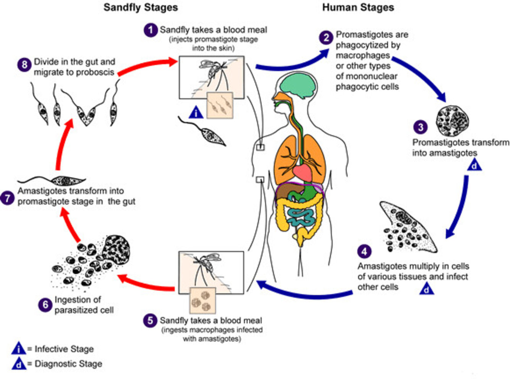
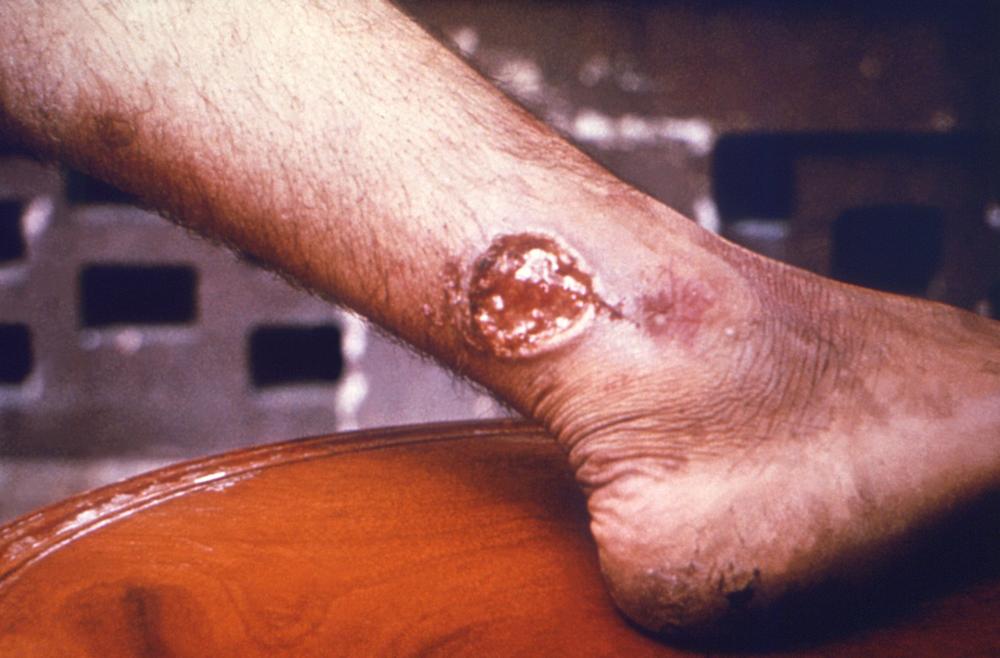
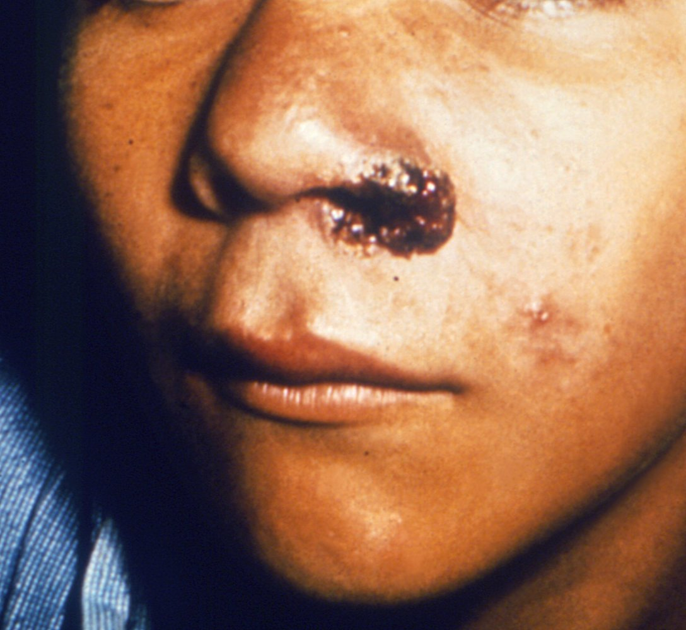
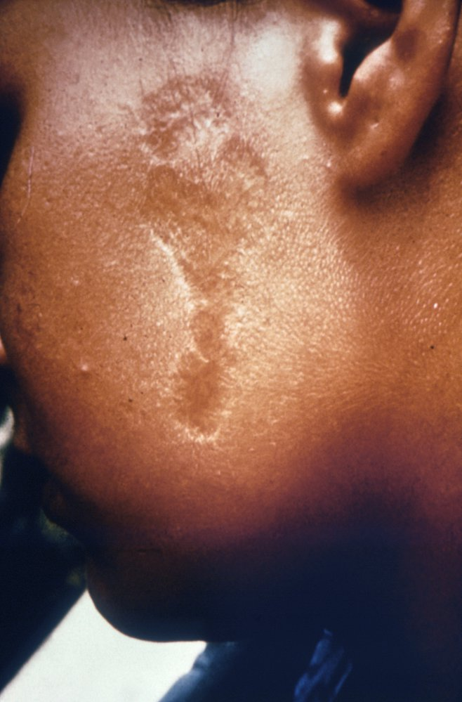
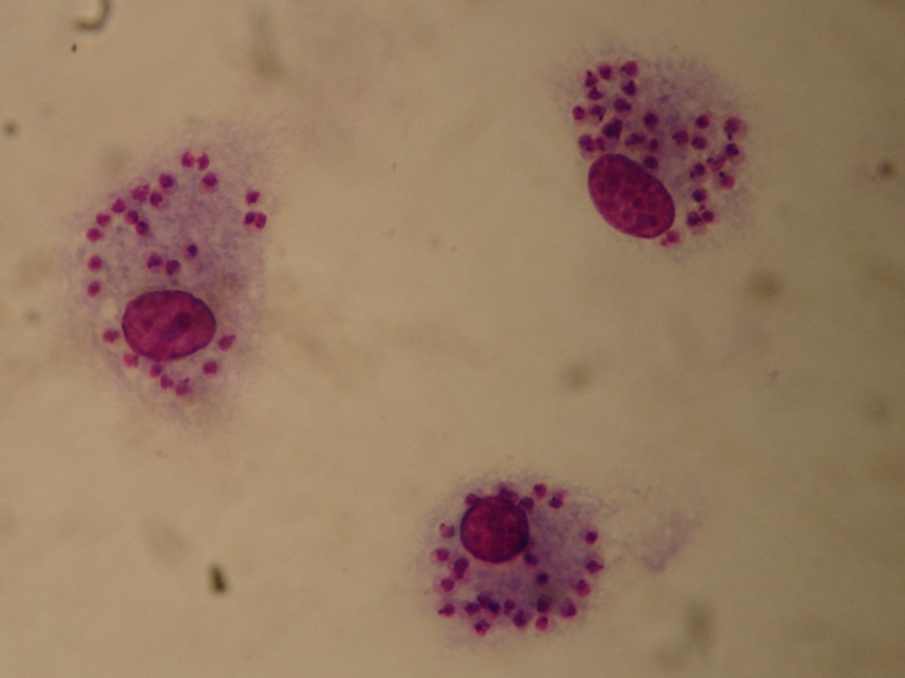
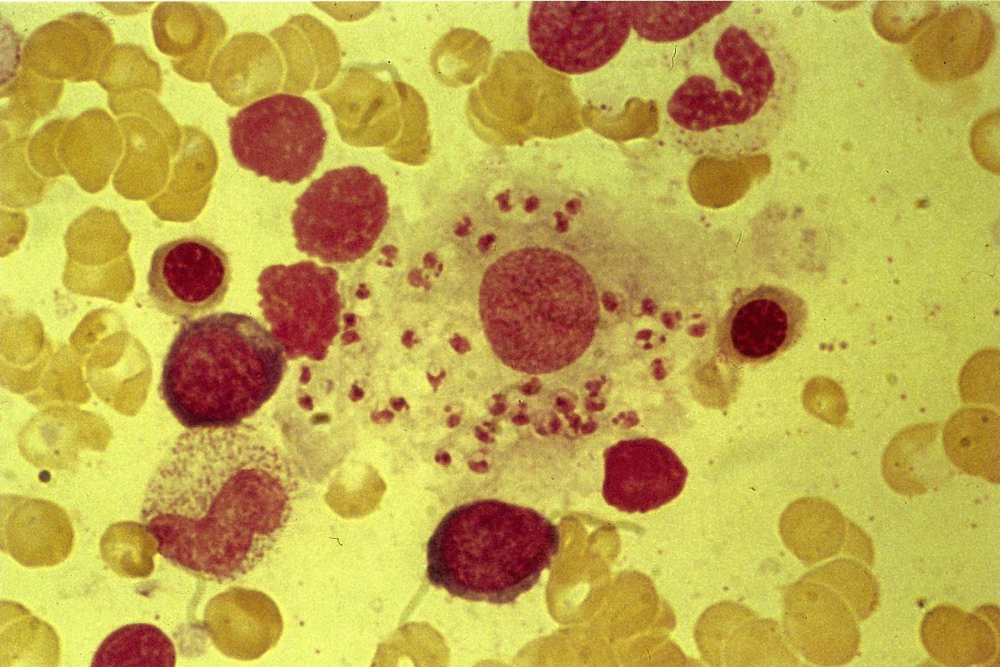

# Leishmaniasis

*Categories: Clinical knowledge > Internal medicine > Infectious diseases > Parasitic infections > Leishmaniasis*

[Original Article Link](https://coursology-qbank.com/amboss/article/qf0CM2)

---

## Summary

Leishmaniasis is a parasitic disease caused by <u>protozoans</u> of the <u>Leishmania</u> genus, which are transmitted by infected <u>phlebotomine sandflies</u>. Depending on the <u>parasite</u> subtype and the strength of the host's <u>immune system</u>, the infection may be asymptomatic or manifest in a cutaneous, <u>mucosal</u>, or <u>visceral</u> form. <u>Cutaneous leishmaniasis</u> is characterized by <u>skin ulcers</u>. The most severe clinical form of <u>visceral leishmaniasis</u> is <u>kala-azar</u> (Hindi for “black <u>fever</u>”), characterized by <u>fever</u>, weight loss, <u>hepatosplenomegaly</u>, and <u>immunosuppression</u>. Leishmaniasis is diagnosed by microscopic visualization of <u>macrophages</u> containing <u>amastigotes</u> from <u>skin</u> or other tissue specimens. Simple cases of <u>cutaneous leishmaniasis</u> in immunocompetent patients may be observed for clinical resolution. Local treatment (<u>cryotherapy</u>, topical <u>paromomycin</u>) suffices for most other cases of <u>cutaneous leishmaniasis</u>. <u>Visceral leishmaniasis</u> requires systemic treatment, e.g., with liposomal <u>amphotericin B</u>.

---

## Epidemiology

* Distribution: <u>endemic</u> in the Mediterranean region, Africa, India, southwest and central Asia, South and Central America [[1]](https://coursology-qbank.com/amboss/article/kCWmHn0)[[2]](https://coursology-qbank.com/amboss/article/YxWnEn0)

* <u>Global</u> <u>incidence</u>

* <u>Visceral</u>: 50,000– 90,000 infections/year  [[3]](https://coursology-qbank.com/amboss/article/pebL-s)

* Cutaneous: 600,000–1,000,000 infections/year [[1]](https://coursology-qbank.com/amboss/article/kCWmHn0)

Epidemiological data refers to the US, unless otherwise specified.

---

## Etiology

* <u>Pathogen</u>: <u>Leishmania</u> species (<u>protozoan</u>) [[4]](https://coursology-qbank.com/amboss/article/RCWl7n0)[[5]](https://coursology-qbank.com/amboss/article/QCWu7n0)

* <u>Cutaneous leishmaniasis</u>

* Americas (i.e., New World): L. mexicana, subgenus Viannia (e.g., L. braziliensis, L. guyanensis, L. panamensis), which can also cause <u>mucosal leishmaniasis</u>

* Asia/Africa (i.e., Old World): L. major, L. tropica. L. aethiopica, L. infantum, <u>L. donovani</u>

* <u>Visceral leishmaniasis</u>: <u>L. donovani</u>, L. infantum

* Transmission

* <u>Vector</u>: phlebotomine sand fly

* Reservoir: mammals (especially dogs, humans, and rodents)

Psoriatic arthritis of the right hand

Life cycle of Leishmania spp.

---

## Cutaneous leishmaniasis

### Clinical features [[1]](https://coursology-qbank.com/amboss/article/kCWmHn0)[[4]](https://coursology-qbank.com/amboss/article/RCWl7n0)

Approx. 10% of infections are asymptomatic. [[1]](https://coursology-qbank.com/amboss/article/kCWmHn0)

* Localized <u>cutaneous leishmaniasis</u>

* <u>Incubation period</u>: weeks to months  [[5]](https://coursology-qbank.com/amboss/article/QCWu7n0)

* Manifestations

* Painless solitary or multiple reddish <u>macules</u> and/or <u>papules</u> around the sandfly bite that increase in size and develop central <u>ulceration</u>

* Regional <u>lymphadenopathy</u>

* Nodular <u>lymphangitis</u>

* Spontaneous healing over months to years

* <u>Atrophic</u> scars

* Mucosal leishmaniasis

* Onset: months to years after untreated or improperly treated <u>cutaneous leishmaniasis</u>  [[1]](https://coursology-qbank.com/amboss/article/kCWmHn0)

* Manifestations  [[5]](https://coursology-qbank.com/amboss/article/QCWu7n0)

* Sores and/or destructive <u>mucosal</u> lesions

* <u>Nasopharynx</u> (common): <u>mucosal</u> bleeding, nasal blockage and/or congestion, <u>coryza</u>, <u>hyposmia</u>, tissue or scab expulsion

* Oral, pharyngeal, or laryngeal: <u>dysphagia</u>, <u>odynophagia</u>, brassy <u>cough</u>, <u>hoarseness</u>, bleeding, <u>pain</u>

* Other manifestations: Diffuse or disseminated may be seen in <u>immunocompromised individuals</u>. [[6]](https://coursology-qbank.com/amboss/article/4CW3Hn0)

* Diffuse <u>cutaneous leishmaniasis</u>: multiple diffuse, non-ulcerating, painless <u>papules</u> and <u>nodules</u>

* Disseminated <u>cutaneous leishmaniasis</u>: ≥ 10 mixed-type lesions on ≥ 2 parts of the body

* <u>Leishmania</u> recidivans: new lesions developing around an old <u>scar</u> from <u>cutaneous leishmaniasis</u> from L. tropica

> [!TIP]
> <u>Mucosal leishmaniasis</u> can develop in individuals infected with species in the Viannia subgenus (e.g., L. [V.] braziliensis, L. [V.] panamensis, L. [V.] guyanensis). [[5]](https://coursology-qbank.com/amboss/article/QCWu7n0)

Cutaneous leishmaniasis

Cutaneous leishmaniasis

Mucosal leishmaniasis

Scar from cutaneous leishmaniasis

### Diagnostics [[1]](https://coursology-qbank.com/amboss/article/kCWmHn0)[[4]](https://coursology-qbank.com/amboss/article/RCWl7n0)

Consider <u>cutaneous leishmaniasis</u> in individuals with nonhealing <u>skin</u> lesions who have been in <u>endemic</u> regions.

* Clinical evaluation

* Detailed travel and exposure history

* Detailed <u>examination of the skin</u> and mucus membranes

* Referral for <u>laryngoscopy</u> if <u>mucosal</u> involvement is suspected

* Direct detection

* Indication: all patients with suspected cutaneous or <u>mucosal leishmaniasis</u>

* Specimen: tissue sample (e.g., via <u>biopsy</u>, <u>aspirate</u>, scraping, or brushing) of a cleaned, active lesion

* Methods: Obtain all of the following studies to maximize diagnostic yield. 

* Microscopy: <u>macrophages</u> that contain <u>amastigotes</u> on <u>histopathology</u> of tissue section   [[6]](https://coursology-qbank.com/amboss/article/4CW3Hn0)

* Tissue culture: Novy-MacNeal-Nicolle medium [[7]](https://coursology-qbank.com/amboss/article/ICWYtn0)

* Molecular testing: <u>PCR</u>

Leishmania major

### Treatment

The objective of treatment is to manage clinical symptoms.

#### General Principles [[4]](https://coursology-qbank.com/amboss/article/RCWl7n0)

* Consult an infectious disease or tropical medicine specialist for guidance.

* Treatment depends on the extent of the disease.

* <u>Expectant management</u> in immunocompetent patients with simple disease, e.g.:

* ≤ 4 small (< 1 cm) healing lesions in nonexposed <u>skin</u> regions

* No presence of or risk for <u>mucosal</u> disease (e.g., infection acquired in the Americas)

* Local or systemic therapy in all other cases

* <u>Wound care</u> for ulcerated lesions (see also “<u>follow-up for open wounds</u>”)

* Admit patients with laryngeal or pharyngeal disease.

* Monitor for 6–12 months for adequate healing and/or treatment response.

> [!TIP]
> Patients may experience a paradoxical increase in the <u>local inflammatory response</u> during the first 2–3 weeks of treatment.

#### Local therapy [[4]](https://coursology-qbank.com/amboss/article/RCWl7n0)

* Indications: <u>skin</u> lesions that don't spontaneously heal in simple disease

* Options

* <u>Cryotherapy</u> or <u>thermotherapy</u>

* Topical <u>paromomycin</u>

#### Systemic therapy [[4]](https://coursology-qbank.com/amboss/article/RCWl7n0)

* Indications

* Complex disease, e.g., patients with:

* Large or numerous lesions

* <u>Immunocompromise</u>

* Presence or risk of <u>mucosal</u> disease

* Lesions on exposed <u>skin</u> or genitalia

* Less common syndromes (i.e., leishmaniasis recividans, diffuse or disseminated leishmaniasis)

* Options: Similar to <u>visceral leishmaniasis</u>; choice of therapy should be individualized.

* Oral: <u>miltefosine</u>, <u>azoles</u> (e.g., <u>ketoconazole</u>, <u>fluconazole</u>)

* Parenteral: pentavalent antimonial (e.g., <u>sodium stibogluconate</u> ), <u>amphotericin B</u>, <u>pentamidine</u>

### Prognosis

Treatment reduces the recurrence rate of <u>cutaneous leishmaniasis</u>, accelerates the healing of lesions, and reduces the risk of dissemination and <u>incidence</u> of <u>mucosal leishmaniasis</u>.

> [!TIP]
> Without treatment, localized <u>cutaneous leishmaniasis</u> resolves over months to years, resulting in <u>atrophic</u> scars or <u>keloids</u>. Reactivation may occur years after initial symptoms resolve.

---

## Visceral leishmaniasis

### Clinical features [[5]](https://coursology-qbank.com/amboss/article/QCWu7n0)

* <u>Incubation period</u>: 2 weeks to 8 months  [[6]](https://coursology-qbank.com/amboss/article/4CW3Hn0)

* Many patients are asymptomatic.

* Kala-azar (Hindi for “black <u>fever</u>,” in reference to the darkening of the <u>skin</u> it can cause) 

* Usually insidious progression

* <u>Flu-like</u> symptoms, spiking <u>fevers</u>

* Weight loss

* <u>Lymphadenopathy</u>

* <u>Hepatosplenomegaly</u>

* <u>Ascites</u> and <u>edema</u>

* Possible darkened or gray <u>skin</u> (especially on the palms and soles)

### Diagnostics [[4]](https://coursology-qbank.com/amboss/article/RCWl7n0)[[5]](https://coursology-qbank.com/amboss/article/QCWu7n0)

#### Routine <u>laboratory studies</u>

* <u>CBC</u>: <u>pancytopenia</u> [[8]](https://coursology-qbank.com/amboss/article/-CWDun0)

* <u>Hemolytic</u> <u>anemia</u>

* <u>Neutropenia</u>, <u>eosinopenia</u>

* <u>Thrombocytopenia</u>

* <u>Liver chemistries</u>

* ↑ <u>Transaminases</u>

* ↓ <u>Albumin</u>

* ↑ Total protein

* <u>Inflammatory markers</u>: ↑ <u>ESR</u> [[8]](https://coursology-qbank.com/amboss/article/-CWDun0)

* <u>SPEP</u>: <u>hypergammaglobulinemia</u>

* <u>HIV test</u>  [[6]](https://coursology-qbank.com/amboss/article/4CW3Hn0)

* Additional testing in <u>immunocompromised individuals</u> 

* <u>Blood cultures</u>

* Serum <u>PCR</u> for <u>Leishmania</u>

#### Diagnostic confirmation

Definitive diagnosis of <u>visceral leishmaniasis</u> requires tissue <u>aspiration</u> or <u>biopsy</u>.

* Tissue <u>aspirate</u> or <u>biopsy</u>

* Indication: all patients with suspected <u>visceral leishmaniasis</u>

* Specimen: <u>bone marrow</u> (preferred), <u>liver</u>, <u>lymph node</u>

* Methods: Obtain all of the following studies to maximize diagnostic yield. 

* Microscopy: <u>macrophages</u> with <u>amastigotes</u> on <u>histopathology</u> of tissue section

* Culture

* Molecular testing: <u>PCR</u>

* <u>Serologic testing</u>: supports the diagnosis if positive (may be <u>falsely negative</u> in <u>immunocompromised</u> patients)

Leishmaniasis

### Treatment [[4]](https://coursology-qbank.com/amboss/article/RCWl7n0)[[5]](https://coursology-qbank.com/amboss/article/QCWu7n0)

#### General principles [[4]](https://coursology-qbank.com/amboss/article/RCWl7n0)

* Consult an infectious disease or tropical medicine specialist for guidance.

* All patients with clinical and laboratory findings of <u>visceral leishmaniasis</u> should receive systemic therapy.

* Monitor all patients clinically for up to one year.

#### Systemic therapy [[5]](https://coursology-qbank.com/amboss/article/QCWu7n0)

* Preferred: : Liposomal <u>Amphotericin B</u> DOSAGE on days 1–5, 14, and 21 for immunocompetent patients  [[5]](https://coursology-qbank.com/amboss/article/QCWu7n0)

* Alternatives 

* <u>Miltefosine</u>

* Pentavalent antimonial (e.g., <u>sodium stibogluconate</u>)

* <u>Pentamidine</u>

* <u>Paromomycin</u>  [[5]](https://coursology-qbank.com/amboss/article/QCWu7n0)

> [!TIP]
> <u>Kala-azar</u> is highly fatal without treatment.

> [!TIP]
> Patients with <u>immunosuppression</u> are treated with a higher dose for a longer duration.

### Complications [[2]](https://coursology-qbank.com/amboss/article/YxWnEn0)[[6]](https://coursology-qbank.com/amboss/article/4CW3Hn0)

* <u>Post-kala-azar dermal leishmaniasis</u>

* A late complication of treated <u>visceral leishmaniasis</u> characterized by the formation of <u>dermal</u> lesions containing <u>amastigotes</u>

* Clinical features

* <u>Dermal</u> <u>hypopigmented</u> <u>nodules</u>, <u>papules</u>, and/or <u>macules</u>

* Lesions start on the face and then spread to the torso and extremities

* Treatment (i.e., <u>conservative management</u> or prolonged systemic therapy) is determined by the location of infection acquisition. [[6]](https://coursology-qbank.com/amboss/article/4CW3Hn0)

* <u>Hemophagocytic lymphohistiocytosis</u>: Severe <u>pancytopenia</u> with inflammation may develop. [[8]](https://coursology-qbank.com/amboss/article/-CWDun0)

* Secondary bacterial infections: e.g., <u>pneumonia</u>, <u>acute otitis media</u>, <u>sepsis</u>, <u>skin and soft tissue infections</u>

---