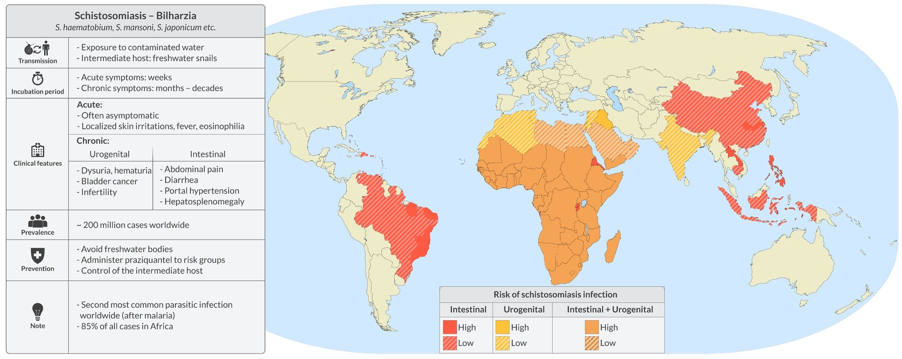
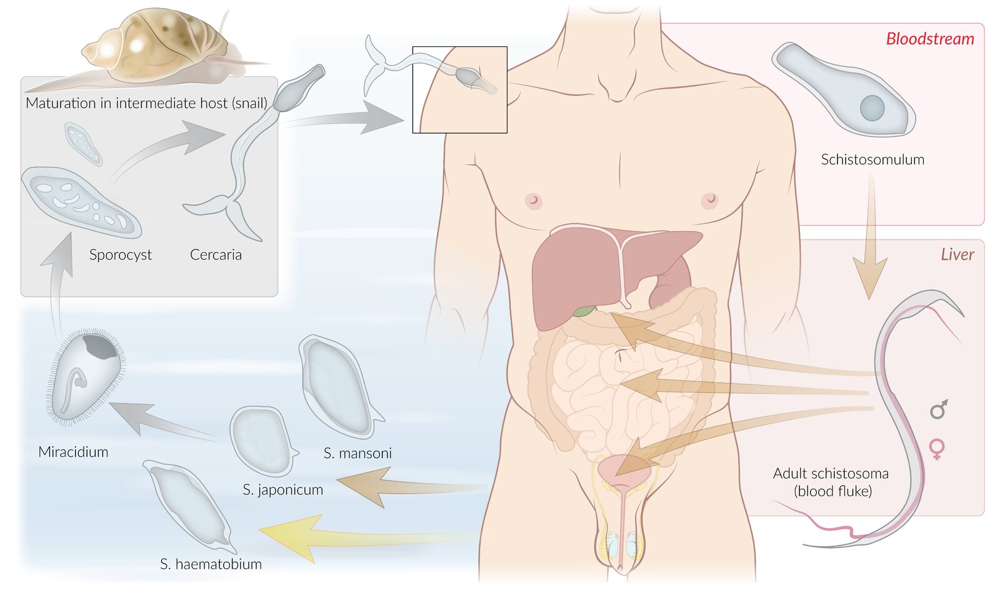
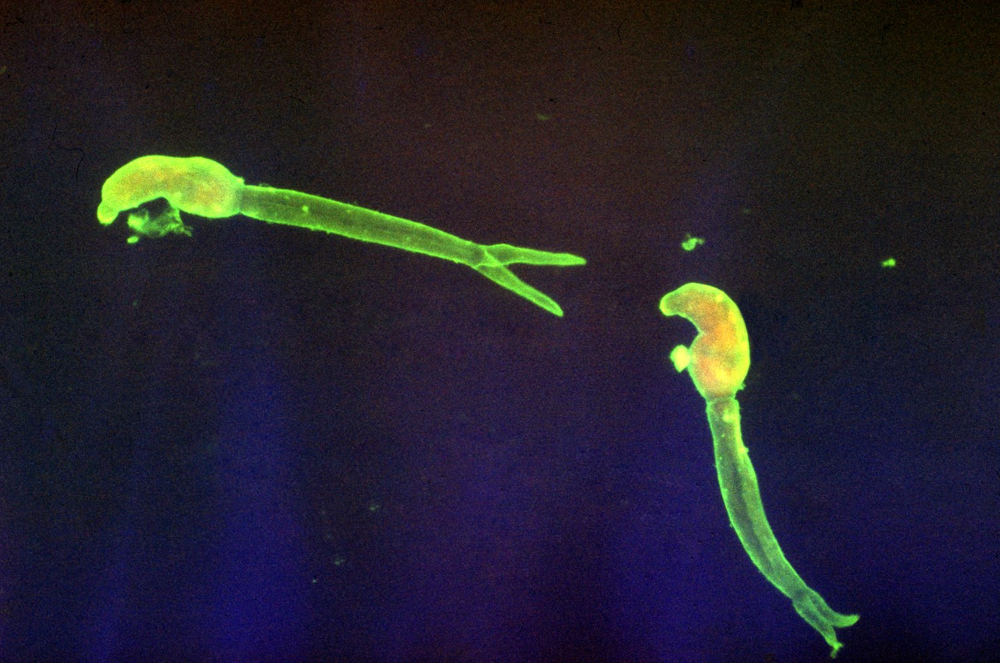
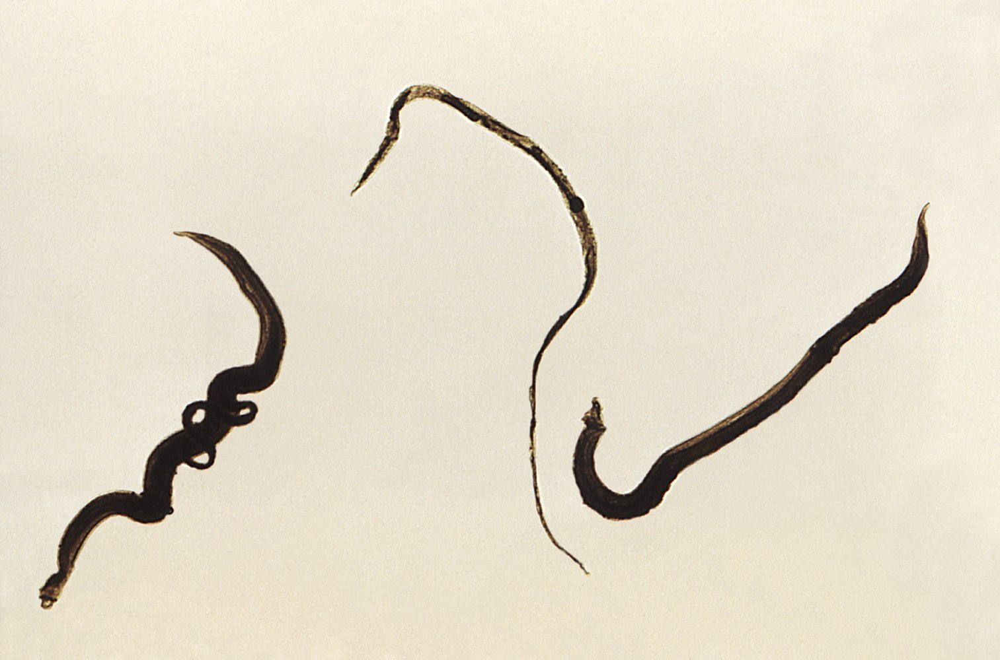
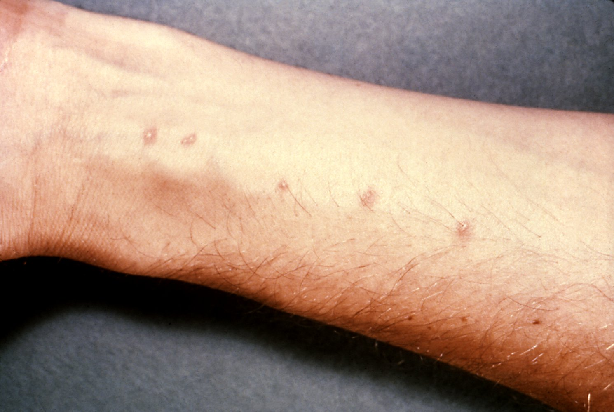
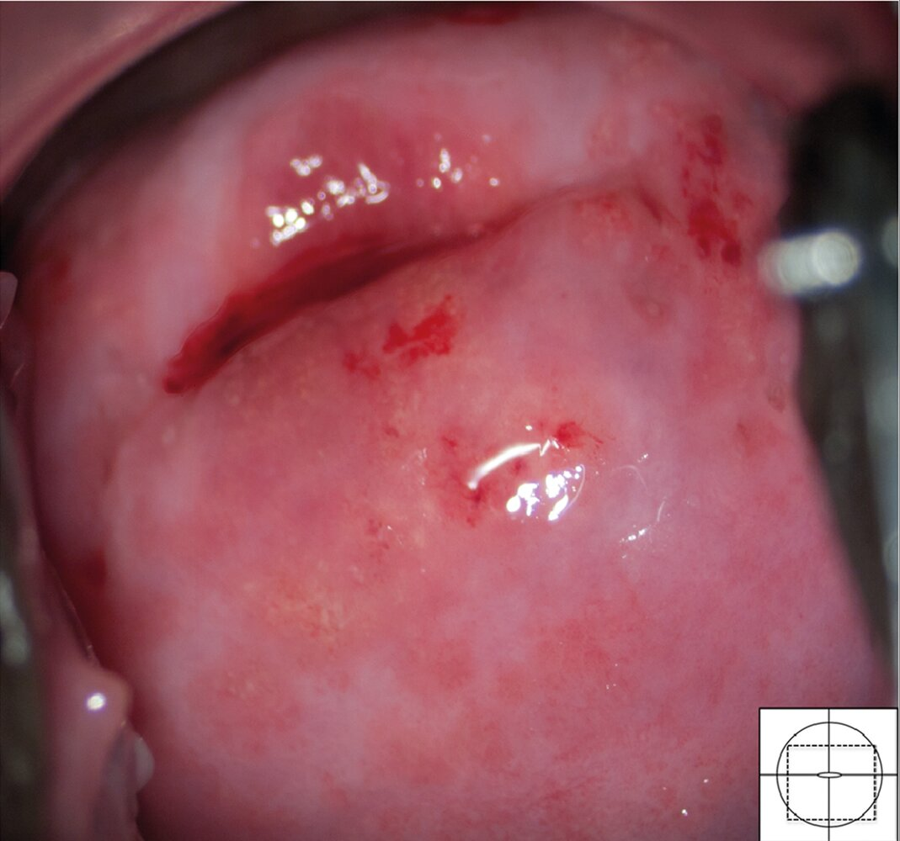
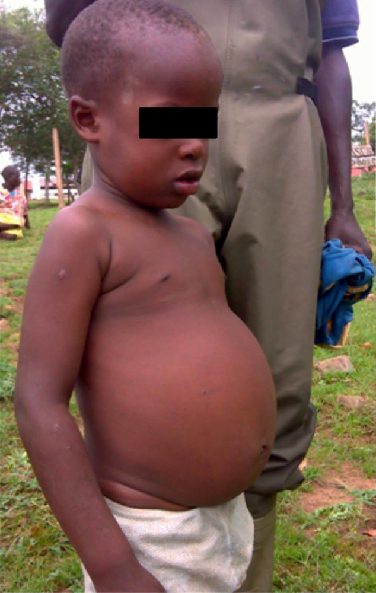
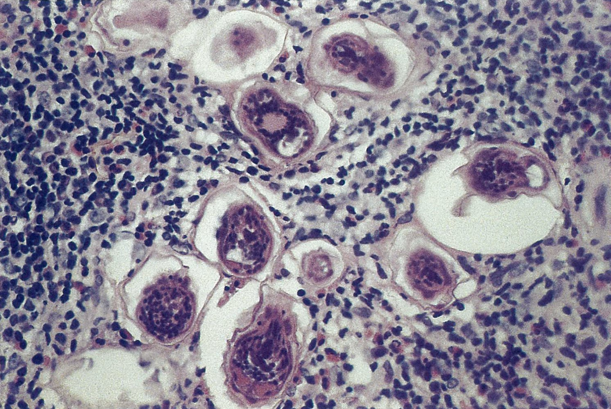
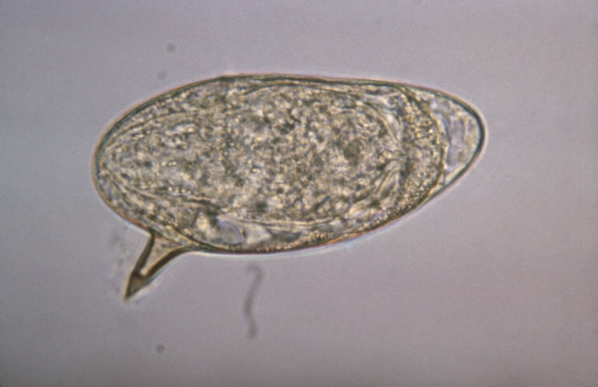
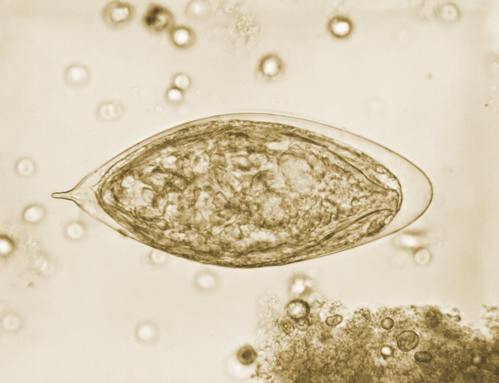

# Schistosomiasis

*Categories: Clinical knowledge > Internal medicine > Infectious diseases > Parasitic infections > Schistosomiasis*

[Original Article Link](https://coursology-qbank.com/amboss/article/xf0Eo2)

---

## Summary

Schistosomiasis is a parasitic disease caused by schistosomes, a type of <u>trematode</u>. Infection occurs when <u>skin</u> comes into contact with <u>parasite</u>-infested water. Clinical manifestations vary depending on the stage of the infection and the type of schistosome. The initial <u>skin</u> penetration may cause a pruritic <u>maculopapular rash</u> known as <u>swimmer's itch</u>. During <u>parasite</u> migration through the bloodstream, <u>acute schistosomiasis syndrome</u> (also known as <u>Katayama fever</u>) may manifest with <u>fever</u>, <u>cough</u>, and <u>angioedema</u>. Chronic infection by schistosomes causes a granulomatous inflammatory response to schistosome eggs with symptoms varying based on disease severity and location. <u>Genitourinary schistosomiasis</u> may manifest with <u>hematuria</u> and <u>dysuria</u>. Long-standing infection increases the risk of <u>bladder cancer</u>. <u>Intestinal schistosomiasis</u> may manifest with <u>diarrhea</u> and abdominal <u>pain</u>, whereas <u>hepatosplenic schistosomiasis</u> can lead to <u>hepatosplenomegaly</u> and/or <u>portal hypertension</u>. Diagnosis is confirmed by identifying eggs on microscopic examination of stool or urine. <u>Acute schistosomiasis syndrome</u> is treated symptomatically with <u>glucocorticoids</u>. The mainstay of treatment for <u>parasite</u> eradication is <u>praziquantel</u>.

---

## Epidemiology

* Frequency: over 200 million people infected annually worldwide [[1]](https://coursology-qbank.com/amboss/article/yzbdvw)

* Occurrence: mainly rural areas with freshwater sources and poor sanitation

Geographic distribution of schistosomiasis (risk of transmission)

Travel Medicine: Diseases with Regional Patterns

Epidemiological data refers to the US, unless otherwise specified.

---

## Etiology

* <u>Pathogen</u>: schistosomes (parasitic trematodes of the genus Schistosoma)

* Schistosoma mansoni: Africa, South America, and the Caribbean

* Schistosoma haematobium: Africa and the Middle East

* Schistosoma japonicum: China and Southeast Asia

* Lifecycle  

* Infected humans (<u>definitive host</u>) excrete schistosome eggs in urine or feces.

* Eggs hatch in water and release miracidia.

* Miracidia infect specific freshwater snails (intermediate hosts) where they develop into cercaria, which are released back into the water.

* When humans come in contact with contaminated water (e.g., while swimming), <u>cercaria</u> can penetrate the <u>skin</u> and enter the circulation.

* Maturation into adult schistosomes and migration to the <u>veins</u> of the target organs

* Females lay eggs, leading to <u>capillary</u> closure and <u>chronic inflammation</u> in the affected organs.

* Penetration of eggs in lumen of the intestine or <u>bladder</u> (depending on the species).

Life cycle of schistosomes

Microscopy of two cercariae of Schistosoma mansoni

Adult blood flukes (Schistosoma mansoni)

---

## Clinical features

Clinical features depend on the stage, schistosome type, and infected organs.

1. * Local reaction (swimmer's itch or <u>cercarial dermatitis</u>): pruritic <u>maculopapular rash</u> at the point of entry of <u>cercaria</u> into human <u>skin</u>
2. * Acute schistosomiasis syndrome (<u>Katayama fever</u>)

* <u>Serum sickness-like</u> disease: <u>immune complex</u> formation of <u>antigens</u> released from eggs and/or adult worms with host <u>antibodies</u>

* <u>Incubation period</u>: 3–8 weeks [[2]](https://coursology-qbank.com/amboss/article/BzbzEw)

* Clinical features: <u>fever</u>, fatigue, <u>cough</u>, <u>myalgia</u>, <u>angioedema</u>

* Usually self-resolves after 2–10 weeks. [[3]](https://coursology-qbank.com/amboss/article/AzbRvw)
3. * Chronic schistosomiasis: Deposition of eggs leads to <u>chronic inflammation</u> and <u>granuloma</u> formation.

| Overview of clinical features in schistosomiasis |  |  |
| --- | --- | --- |
| Subtype | <u>Pathogen</u> | Clinical features |
| Genitourinary schistosomiasis |  * <u>S. haematobium</u>   |   * <u>Hematuria</u>, <u>dysuria</u>  * Complications (especially with chronic infection)  * Squamous cell <u>carcinoma of the bladder</u>  (may cause <u>painless hematuria</u>)  * <u>Infertility</u> (particularly in women )  * <u>Bladder neck</u> obstruction and <u>hydronephrosis</u>    |
| Hepatosplenic schistosomiasis |   * <u>S. mansoni</u>  * <u>S. japonicum</u>  * <u>S. haematobium</u> (less common)    |   * Children and <u>adolescents</u>: <u>hepatosplenomegaly</u>  * Adults with chronic infection: <u>periportal fibrosis</u> and <u>portal hypertension</u>  * Complications: <u>pulmonary schistosomiasis</u>, <u>neuroschistosomiasis</u>    |
|  Intestinal schistosomiasis   |   * <u>Diarrhea</u>  * Abdominal <u>pain</u>  * Intestinal bleeding, bowel strictures  * Complications (chronic infection): <u>iron deficiency anemia</u>    |  |
| Pulmonary schistosomiasis |   * <u>S. mansoni</u>  * <u>S. japonicum</u>  * <u>S. haematobium</u>    |  * <u>Pulmonary hypertension and cor pulmonale</u>   |
| Neuroschistosomiasis |   * <u>Headache</u>  * <u>Transverse myelitis</u>  * Sensory and motor deficits  * <u>Epilepsy</u>    |  |

Cercarial dermatitis

Strawberry cervix and sandy patches

Advanced intestinal schistosomiasis

---

## Diagnosis

Suspect schistosomiasis in all individuals who have been exposed to freshwater in <u>endemic</u> areas, even if they are asymptomatic. Consider consulting infectious diseases for advice. [[4]](https://coursology-qbank.com/amboss/article/A1XRjC)

* Confirmatory studies [[5]](https://coursology-qbank.com/amboss/article/8TdOs60)[[6]](https://coursology-qbank.com/amboss/article/_id58p0)

* Microscopic examination of stool or urine for eggs

* <u>Schistosoma</u> subtype determined by egg morphology 

* <u>S. mansoni</u>: Eggs have a prominent <u>lateral</u> <u>spine</u>.

* <u>S. haematobium</u>: Eggs have a prominent terminal <u>spine</u>.

* <u>S. japonicum</u>: Eggs have a miniscule <u>lateral</u> <u>spine</u>.

* Additional studies [[4]](https://coursology-qbank.com/amboss/article/A1XRjC)[[7]](https://coursology-qbank.com/amboss/article/Ef18LT0)

* <u>CBC</u> may show <u>eosinophilia</u>.

* <u>Serology</u>

* Chronic infections may require additional studies based on clinician suspicion, e.g., <u>urinalysis</u>, <u>biopsy</u>, <u>CT scan</u>.

Schistosome eggs

Schistosoma mansoni egg

Schistosoma haematobium egg

---

## Treatment

There is no consensus on certain treatment details (e.g., dosages, timing); consider consulting infectious diseases for help with management. [[4]](https://coursology-qbank.com/amboss/article/A1XRjC)[[6]](https://coursology-qbank.com/amboss/article/_id58p0)

* <u>Swimmer's itch</u>

* Self-resolves in 4–7 days [[4]](https://coursology-qbank.com/amboss/article/A1XRjC)

* Symptomatic management of <u>pruritus</u> (e.g., <u>antihistamines</u>, <u>topical steroids</u>)

* <u>Acute schistosomiasis syndrome</u> [[4]](https://coursology-qbank.com/amboss/article/A1XRjC)[[6]](https://coursology-qbank.com/amboss/article/_id58p0)

* Administer <u>glucocorticoids</u> to reduce inflammation, e.g., <u>prednisone</u> (<u>off-label</u>). DOSAGE [[4]](https://coursology-qbank.com/amboss/article/A1XRjC)

* Administer <u>praziquantel</u> once inflammation improves.  [[4]](https://coursology-qbank.com/amboss/article/A1XRjC)

* <u>S. mansoni</u>, <u>S. haematobium</u>, <u>Schistosoma</u> intercalatum: <u>praziquantel</u> (<u>off-label</u>) DOSAGE [[7]](https://coursology-qbank.com/amboss/article/Ef18LT0)

* <u>S. japonicum</u>, <u>Schistosoma</u> mekongi: <u>praziquantel</u> DOSAGE [[7]](https://coursology-qbank.com/amboss/article/Ef18LT0)

* Repeat therapy 2–6 weeks after symptom onset.

* <u>Chronic schistosomiasis</u>: : Administer <u>praziquantel</u> (see dosing in “<u>Acute schistosomiasis syndrome</u>”).

* Posttreatment monitoring: Test urine and stool 6–8 weeks after completing therapy and again 18–32 weeks later to confirm clearance.

---