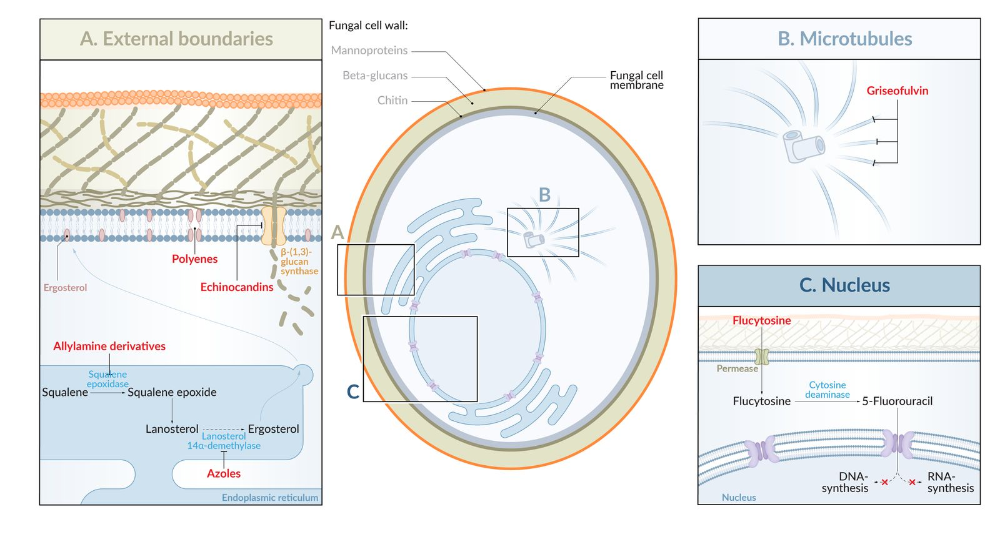

# Antifungals

*Categories: Clinical knowledge > Internal medicine > Infectious diseases > Relevant pharmacology > Antifungals*

[Original Article Link](https://coursology-qbank.com/amboss/article/6m0jgg)

---

## Summary

Antifungals are a class of medications that destroy or inhibit the growth of fungal organisms and are, accordingly, used to treat <u>fungal infections</u> (mycoses) such as <u>candidiasis</u>, <u>cryptococcal</u> disease, <u>aspergillosis</u>, and <u>dermatophytosis</u>. They are divided into three major groups according to chemical structure and spectrum of <u>efficacy</u>: <u>polyenes</u> (used for the <u>treatment of systemic fungal infections</u>), <u>azoles</u> (broad-spectrum antifungals), and <u>allylamines</u> (used for the treatment of <u>onychomycosis</u>). Topical agents (e.g., <u>clotrimazole</u>) generally have a more limited scope of action. Common adverse effects include <u>hepatotoxicity</u>, <u>skin</u> reactions, <u>headaches</u>, and gastrointestinal upset.

See also “<u>Overview of fungal infections</u>,” “<u>Management of superficial fungal infections</u>,” and “<u>Management of systemic fungal infections</u>.”

---

## Overview

|  Overview of antifungals and their mechanisms of action [[1]](https://coursology-qbank.com/amboss/article/1B02-R)[[2]](https://coursology-qbank.com/amboss/article/VB0G-R)[[3]](https://coursology-qbank.com/amboss/article/eB0x-R)[[4]](https://coursology-qbank.com/amboss/article/4B03ai)[[5]](https://coursology-qbank.com/amboss/article/kB0mai)[[6]](https://coursology-qbank.com/amboss/article/ybYdwn)[[7]](https://coursology-qbank.com/amboss/article/AbYRwn)  |  |  |  |  |  |  |
| --- | --- | --- | --- | --- | --- | --- |
| Class |  | Examples | Mechanism of action | Clinical use | Adverse effects |  |
| <u>Polyenes</u> |  |  * <u>Amphotericin B</u>   |  * Bind to <u>ergosterol</u> in the fungal cell membrane → formation of pores in the fungal membrane → disruption of <u>electrolyte</u> balance → cell lysis → <u>cell death</u>   |  * Severe systemic mycoses  * <u>Invasive candidiasis</u>  * <u>Cryptococcal</u> disease  * <u>Aspergillosis</u>  * <u>Blastomycosis</u>  * <u>Coccidioides</u>  * <u>Histoplasmosis</u>  * <u>Mucormycosis</u>   |   * <u>Arrhythmias</u>  * <u>Nephrotoxicity</u>  * <u>Fever</u>, chills  * IV phlebitis (“amphoterrible”)  * <u>Hypokalemia</u>, <u>hypomagnesemia</u>    |  |
|  * <u>Nystatin</u>   |   * <u>Diaper rash</u>  * <u>Oropharyngeal candidiasis</u>    |   * Gastrointestinal symptoms  * <u>Contact dermatitis</u>  * <u>Stevens-Johnson</u> syndrome    |  |  |  |  |
| <u>Azoles</u> | <u>Triazoles</u> |  * <u>Fluconazole</u>   |   * Inhibit fungal <u>cytochrome P450</u> → ↓ fungal synthesis of <u>ergosterol</u> from lanosterol → ↓ levels of <u>ergosterol</u> → membrane instability → <u>cell death</u>  * <u>Ketoconazole</u>: inhibition of <u>17α-hydroxylase</u>/<u>17,20-lyase</u>    |   * <u>Cryptococcal meningitis</u> (in <u>AIDS</u> patients)  * <u>Candidiasis</u>  * <u>Coccidioidomycosis</u>  * <u>Histoplasmosis</u>/<u>blastomycosis</u>  * <u>Blastomycosis</u>    |   * <u>Hepatotoxicity</u>  * <u>Cytochrome P450 inhibition</u>  * Important contraindications: <u>Cardiac arrhythmias</u> (e.g., <u>prolonged QT</u>)  * Local burning sensation, <u>pruritus</u> if used topically  * <u>Ketoconazole</u>: <u>gynecomastia</u>    |  |
|  * <u>Voriconazole</u>   |  * Drug of choice for <u>invasive aspergillosis</u>   |  |  |  |  |  |
|  * <u>Itraconazole</u>   |   * <u>Histoplasmosis</u>  * <u>Blastomycosis</u>  * <u>Coccidioidomycosis</u>  * <u>Sporotrichosis</u>  * <u>Allergic bronchopulmonary aspergillosis</u>    |  |  |  |  |  |
|  * <u>Isavuconazole</u>   |   * <u>Invasive aspergillosis</u>  * Invasive <u>mucormycosis</u>    |  |  |  |  |  |
| <u>Imidazoles</u> |  * <u>Ketoconazole</u>   |   * <u>Pityriasis versicolor</u>  * <u>Prostate cancer</u>  * <u>Psoriasis</u>  * <u>Hypercortisolism</u> (e.g., <u>Cushing syndrome</u>)    |  |  |  |  |
|   * <u>Clotrimazole</u>  * <u>Miconazole</u>    |   * <u>Vaginal candidiasis</u>  * <u>Oropharyngeal candidiasis</u>    |  |  |  |  |  |
| <u>Allylamines</u> |  |  * <u>Terbinafine</u>   |  * Inhibit fungal <u>squalene epoxidase</u> → ↓ synthesis of <u>ergosterol</u> → accumulation of squalene → ↑ membrane permeability → <u>cell death</u>   |   * <u>Dermatophytosis</u> (especially <u>onychomycosis</u>)  * <u>Tinea infections</u>    |   * <u>Headache</u>  * <u>Hepatotoxicity</u>  * <u>Dysgeusia</u>  * Gastrointestinal upset    |  |
| <u>Echinocandins</u> |  |   * <u>Caspofungin</u>  * <u>Anidulafungin</u>  * <u>Micafungin</u>    |  * Inhibit the synthesis of <u>β-glucan</u> → disruption of <u>fungal cell wall</u> synthesis → ↓ resistance against osmotic forces → <u>cell death</u>   |   * <u>Invasive aspergillosis</u>  * <u>Invasive candidiasis</u>    |   * Flushing  * <u>Hepatotoxicity</u>  * Gastrointestinal upset    |  |
| Pyridone derivatives |  |  * <u>Ciclopirox</u>   |  * Not fully understood   |   * <u>Pityriasis versicolor</u>  * <u>Dermatophytosis</u>  * <u>Seborrheic dermatitis</u> of the scalp    |  * <u>Ventricular tachycardia</u>   |  |
| <u>Benzofurans</u> |  |  * <u>Griseofulvin</u>   |  * Bind to <u>keratin</u> → interference with <u>microtubule</u> function → disruption of fungal <u>mitosis</u> → inhibition of fungal growth   |  * <u>Dermatophyte infections</u> (e.g., <u>tinea pedis</u>)   |   * <u>Hepatotoxicity</u>  * <u>Carcinogenic</u>  * <u>Teratogenic</u>  * <u>Cytochrome P450</u> induction  * Confusion, <u>headaches</u>  * <u>Disulfiram-like reaction</u>    |  |
| <u>Antimetabolites</u> |  |  * <u>Flucytosine</u>   |  * Converted to 5-<u>fluorouracil</u> by fungal <u>cytosine deaminase</u> → inhibition of <u>DNA</u> and <u>RNA</u> synthesis → inhibition of fungal growth   |   * Monotherapy: select cases of non-life-threatening infections such as genitourinary <u>candida</u> infections that are not covered by alternative drugs  * Combination with <u>amphotericin B</u> (e.g., especially <u>cryptococcal meningitis</u>)    |   * <u>Bone marrow suppression</u>  * Hepatic injury  * <u>Renal failure</u>    |  |

Mechanism of action: antifungals

---

## Polyenes

* Overview

* Used mainly for the <u>treatment of systemic fungal infections</u>

* Considered a subgroup of <u>macrolide</u> <u>antibiotics</u> [[8]](https://coursology-qbank.com/amboss/article/ZAbZRw)

* Mechanism of action: bind to <u>ergosterol</u> in the fungal <u>cell membrane</u> → formation of pores in the fungal membrane → disruption of <u>electrolyte</u> balance → cell lysis → <u>cell death</u>

> [!NOTE]
> <u>Amphotericin B</u> Burrows nice (<u>nystatin</u>) holes in the <u>fungal cell membrane</u>.

---

## Amphotericin B

* Routes of administration

* Intravenous

* Intrathecal

* <u>Bladder irrigation</u>

* Clinical use [[9]](https://coursology-qbank.com/amboss/article/YAbnRw)

* Severe systemic mycoses, such as:

* <u>Cryptococcal</u> disease (in combination with <u>flucytosine</u> for <u>cryptococcal meningitis</u>)

* <u>Sporotrichosis</u>

* <u>Aspergillosis</u>

* <u>Blastomycosis</u>

* <u>Candidiasis</u>

* <u>Coccidioides</u> (administered intrathecally for coccidioidal <u>meningitis</u>)

* <u>Histoplasmosis</u>

* <u>Mucormycosis</u>

* Fungal <u>cystitis</u>

* Fungal <u>meningitis</u>

* Adverse effects [[9]](https://coursology-qbank.com/amboss/article/YAbnRw)

* <u>Nephrotoxicity</u>: Lipid-based formulations of the drug and IV hydration reduce <u>nephrotoxicity</u>.

* IV phlebitis

* Impaired renal tubule permeability → <u>hypokalemia</u> and <u>hypomagnesemia</u> (restoring <u>K+</u> and <u>Mg2+</u> while administering the drug can counter this effect)

* <u>Fever</u>, chills;  (<u>amphotericin B</u> is sometimes referred to as “shake and bake”)

* <u>Bone marrow suppression</u>, <u>anemia</u>

* <u>Arrhythmias</u>

* <u>Hypotension</u>

* Contraindications [[9]](https://coursology-qbank.com/amboss/article/YAbnRw)

* <u>Electrolyte</u> disturbances (e.g., <u>hypokalemia</u>, <u>hypomagnesemia</u>)

* Renal dysfunction

* <u>Pregnancy</u>

> [!NOTE]
> Amphotericin B has amphoterrible side effects, including <u>nephrotoxicity</u>, <u>arrhythmias</u>, and IV phlebitis.

---

## Nystatin

* Routes of administration (too toxic for intravenous use)

* Topical: <u>diaper rash</u>

* Oral (swish and swallow): <u>oropharyngeal candidiasis</u>

* Adverse effects

* Gastrointestinal symptoms (e.g., <u>diarrhea</u>, <u>nausea</u>, <u>pain</u>)

* <u>Contact dermatitis</u>

* <u>Stevens-Johnson syndrome</u>

* Contraindications: <u>pregnancy</u>

> [!TIP]
> <u>Nystatin</u> is too toxic for intravenous use. For <u>oropharyngeal candidiasis</u>, the medication should be swished around in the mouth, gargled, and then swallowed (swish and swallow).

---

## Azoles

* Definition: a group of antifungal agents with a broad spectrum of activity that can be divided into <u>triazoles</u> and <u>imidazoles</u>

* Routes of administration

* <u>Imidazoles</u>: topical, oral

* <u>Triazoles</u>: oral, IV

* Mechanism of action

* Inhibition of 14-alpha demethylase, a fungal <u>cytochrome P450</u> → ↓ fungal synthesis of <u>ergosterol</u> from lanosterol → ↓ levels of <u>ergosterol</u> → membrane instability → <u>cellular death</u>. [[10]](https://coursology-qbank.com/amboss/article/TB06Zi)

* <u>Ketoconazole</u>: inhibition of <u>17α-hydroxylase</u>/<u>17,20-lyase</u>

| Overview of <u>azoles</u> |  |  |  |  |
| --- | --- | --- | --- | --- |
|  | Active substance | Clinical use | Adverse effects |  |
| Topical use | Systemic use |  |  |  |
| Imidazole derivatives |  * Clotrimazole   |   * Primarily topical <u>fungal infections</u>  * <u>Vaginal candidiasis</u>  * <u>Tinea infections</u>  * <u>Oropharyngeal candidiasis</u>    |   * Local burning sensation  * <u>Pruritus</u>    |   * <u>Hepatotoxicity</u>:  inhibits <u>cytochrome P450</u> → ↑ concentration of many drugs metabolized by <u>CYP450</u> (e.g., <u>warfarin</u>, <u>simvastatin</u>, <u>cyclosporine</u>, <u>theophylline</u>)  * <u>Gynecomastia</u>  due to inhibition of <u>testosterone</u> synthesis (especially seen with <u>ketoconazole</u>)  * Gastrointestinal upset  * <u>QT prolongation</u> → <u>torsade de pointes</u>  * <u>Hypokalemia</u>  * <u>Ketoconazole</u>: <u>adrenal cortex</u> insufficiency  * <u>Voriconazole</u>: dose-dependent, reversible visual disorders (e.g., <u>photosensitivity</u>)    |
|  * Miconazole   |  |  |  |  |
|  * Ketoconazole   |   * <u>Pityriasis versicolor</u>  * <u>Prostate cancer</u>  * <u>Psoriasis</u>  * <u>Hypercortisolism</u> (e.g., <u>Cushing syndrome</u>)    |  |  |  |
| Triazole derivatives |  * Fluconazole   |   * Drug of choice <u>maintenance therapy</u> of <u>cryptococcal meningitis</u> in patients with <u>AIDS</u>  [[11]](https://coursology-qbank.com/amboss/article/xjbEcF)  * <u>Candidiasis</u> (all forms)  * <u>Coccidioidomycosis</u>  * <u>Histoplasmosis</u>  * <u>Blastomycosis</u>    |  |  |
|  * Voriconazole   |   * Drug of choice for <u>invasive aspergillosis</u>  * Some forms of <u>Candida</u>    |  |  |  |
|  * Itraconazole   |   * <u>Histoplasmosis</u>  * <u>Blastomycosis</u>  * <u>Coccidioidomycosis</u>  * <u>Sporotrichosis</u>  * <u>Allergic bronchopulmonary aspergillosis</u>, <u>aspergilloma</u>  * Particularly effective in <u>dermatophytosis</u> (e.g., <u>onychomycosis</u>)  * Oropharyngeal/<u>esophageal candidiasis</u>    |  |  |  |
|  * Posaconazole   |   * <u>Oropharyngeal candidiasis</u>  * Prophylactic treatment of <u>invasive aspergillosis</u> and <u>Candida</u> infections in <u>immunocompromised</u> patients    |  |  |  |
|  * Isavuconazole   |   * <u>Invasive aspergillosis</u>  * Invasive <u>mucormycosis</u>    |  |  |  |

* Contraindications

* <u>Cardiac arrhythmias</u>

* Severe cardiac insufficiency

* Special considerations

* Inhibition of <u>cytochrome P450</u> can influence serum concentrations of other medications

* Cautious use in patients with renal and/or hepatic dysfunction

* <u>PPIs</u> must be discontinued (<u>azoles</u> require a low <u>pH</u> to be absorbed)

> [!NOTE]
> Voriconazole is the drug of choice for inVasive <u>aspergillosis</u>.

> [!NOTE]
> The FLU easily penetrates the <u>blood-brain barrier</u>: FLuconazole has good <u>CNS</u> penetration.

---

## Allylamine derivatives (terbinafine)

* Route of administration: oral

* Mechanism of action: inhibition fungal <u>squalene epoxidase</u> → ↓ synthesis of <u>ergosterol</u> → accumulation of squalene → ↑ membrane permeability → <u>cell death</u>

* Clinical use

* <u>Dermatophytosis</u> (most commonly <u>onychomycosis</u>)

* <u>Tinea infections</u> (e.g., <u>tinea pedis</u>)

* Adverse effects

* <u>Hepatotoxicity</u>

* <u>Dysgeusia</u>

* Gastrointestinal upset

* <u>Headache</u>

* Exacerbation of autoimmune diseases (e.g., <u>systemic lupus erythematosus</u>)

* Contraindications

* Impaired <u>liver function</u>

* <u>Systemic lupus erythematosus</u>

* <u>Breastfeeding</u>

---

## Echinocandins

* Drugs

* Caspofungin

* Anidulafungin

* Micafungin

* Route of administration: IV

* Mechanism of action: inhibition of <u>β-glucan</u> synthesis → disruption of <u>fungal cell wall</u> synthesis → ↓ resistance against osmotic forces → <u>cell death</u>

* Clinical use

* <u>Invasive aspergillosis</u>

* <u>Invasive candidiasis</u> (particularly <u>biofilm</u>-embedded <u>Candida</u> )

* Adverse effects

* Flushing (due to release of <u>histamine</u>)

* <u>Hepatotoxicity</u>

* Gastrointestinal upset

* <u>Hypotension</u>

* Phlebitis/<u>pain</u> at the injection site

* <u>Fever</u>, shivering

---

## Pyridone derivatives (ciclopirox)

* Route of administration: topical

* Mechanism of action

* Not fully understood

* Likely disruption of <u>DNA</u>, <u>RNA</u>, and <u>protein synthesis</u>

* Clinical use

* <u>Pityriasis versicolor</u>

* <u>Dermatophytosis</u> (e.g., <u>onychomycosis</u>)

* <u>Seborrheic dermatitis</u> of the scalp

* Adverse effects

* Facial <u>edema</u>

* <u>Ventricular tachycardia</u>

* <u>Skin</u> irritations

* <u>Pruritus</u>

---

## Benzofurans (griseofulvin)

* Route of administration: oral

* Mechanism of action: griseofulvin binds to <u>keratin</u> precursor cells → accumulation in <u>keratin</u>-rich tissues (e.g., <u>nails</u>, <u>hair</u>) → entry into the fungal cell → interference with <u>microtubule</u> function → disruption of fungal <u>mitosis</u>

* Clinical use: <u>dermatophyte infections</u> (e.g., <u>tinea pedis</u>)

* Adverse effects

* <u>Hepatotoxicity</u>

* Carcinogenicity

* <u>Teratogenicity</u>

* Enzyme induction → ↓ concentration of many drugs metabolized by <u>cytochrome P450</u> (e.g., <u>warfarin</u>)

* Confusion, <u>headaches</u>

* Disulfiram-like reaction

* A reaction similar to the <u>disulfiram-ethanol reaction</u> triggered by the concomitant intake of <u>alcohol</u> and another drug (e.g., <u>griseofulvin</u>, <u>procarbazine</u>, some <u>cephalosporins</u>)

* Clinical signs of a <u>disulfiram-like reaction</u> include flushing, <u>tachycardia</u>, and <u>hypotension</u>.

* <u>Urticaria</u> and severe <u>skin</u> reactions (e.g., <u>Stevens-Johnson syndrome</u>)

* Contraindications

* <u>Porphyria</u>

* Hepatic failure

* <u>Pregnancy</u> and <u>breastfeeding</u>

---

## Antimetabolites (flucytosine)

* Route of administration: oral

* Mechanism of action: converted to 5-<u>fluorouracil</u> by fungal cytosine deaminase, thereby inhibiting <u>DNA</u> and <u>RNA</u> synthesis

* Clinical use

* Combination with <u>amphotericin B</u>: <u>systemic fungal infections</u> (especially <u>cryptococcal meningitis</u>)

* Monotherapy: non-life-threatening infections, such as genitourinary <u>candida</u> infections, that do not respond to other drugs

* Adverse effects

* <u>Bone marrow suppression</u> with <u>pancytopenia</u>
Hepatic injury

* <u>Renal failure</u>

* Gastrointestinal upset

* Contraindications

* Renal impairment

* <u>Pregnancy</u> and <u>breastfeeding</u>

---

## Treatment of common fungal infections

See also “<u>Treatment of superficial fungal infections</u>” and “<u>Treatment of systemic fungal infections</u>.”

| Treatment of common <u>fungal infections</u> |  |  |  |
| --- | --- | --- | --- |
|  |  |  | Treatment |
| <u>Candidiasis</u> | Mucocutaneous | Oropharyngeal |   * Oral <u>clotrimazole</u> (troches)  * Topical <u>nystatin</u> (swish and swallow)  * Oral <u>fluconazole</u>    |
| Esophageal |  * Systemic <u>fluconazole</u> (oral or IV)   |  |  |
| Vaginal |  * Topical <u>clotrimazole</u>/<u>miconazole</u>   |  |  |
| Cutaneous |  * Topical <u>nystatin</u> (powder)   |  |  |
| Invasive |  |   * Preferred: systemic <u>caspofungin</u>  * Alternative: <u>fluconazole</u> or <u>amphotericin B</u>    |  |
| <u>Invasive aspergillosis</u> |  |  |   * <u>Voriconazole</u> (first-line)  * <u>Caspofungin</u>  * IV <u>amphotericin B</u>    |
| <u>Cryptococcosis</u> |  |  |   * First 2 weeks: IV <u>amphotericin B</u> in combination with <u>flucytosine</u>  * After 2 weeks (<u>maintenance therapy</u>): oral <u>fluconazole</u>    |
|  <u>Blastomycosis</u> <u>Histoplasmosis</u> <u>Coccidioidomycosis</u> <u>Sporotrichosis</u>  |  |  |   * Oral <u>itraconazole</u>/<u>fluconazole</u>  * Severe cases: IV <u>amphotericin B</u>    |
| <u>Pityriasis versicolor</u> |  |  |   * Topical <u>ciclopirox</u>  * Topical <u>ketoconazole</u>  * Topical <u>miconazole</u>  * <u>Selenium</u> sulfide    |
| <u>Dermatophytosis</u> |  |  |   * Topical <u>ciclopirox</u>  * Topical <u>azoles</u>  * Oral <u>itraconazole</u>  * Oral <u>griseofulvin</u>  * <u>Terbinafine</u>: <u>onychomycosis</u>    |

---