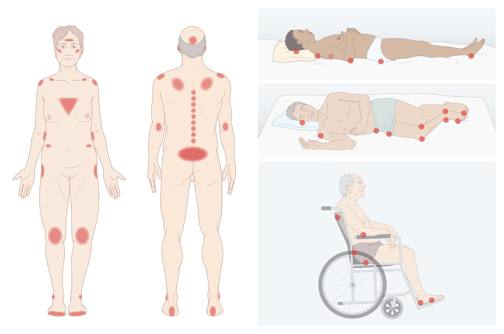
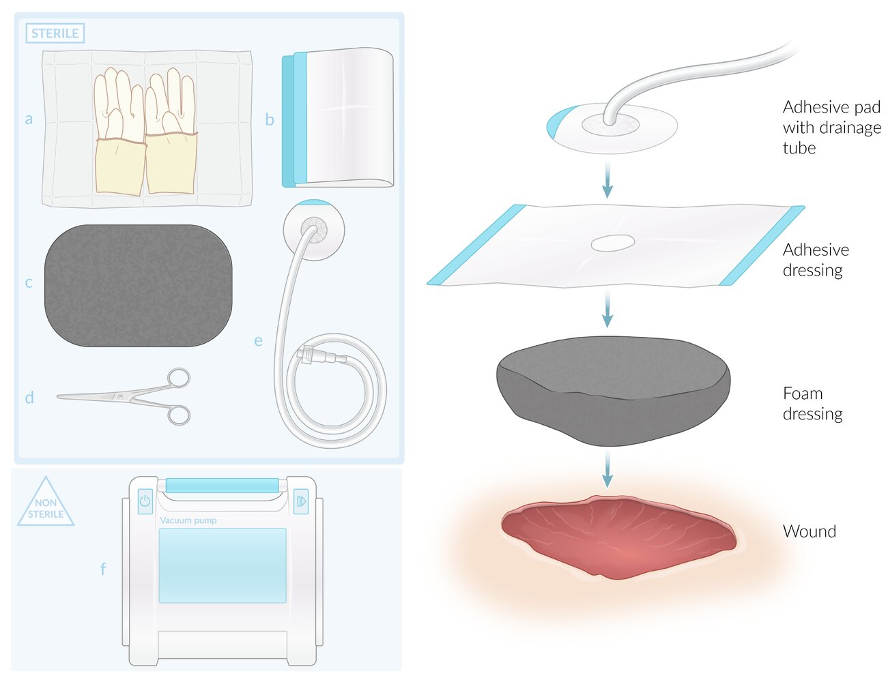
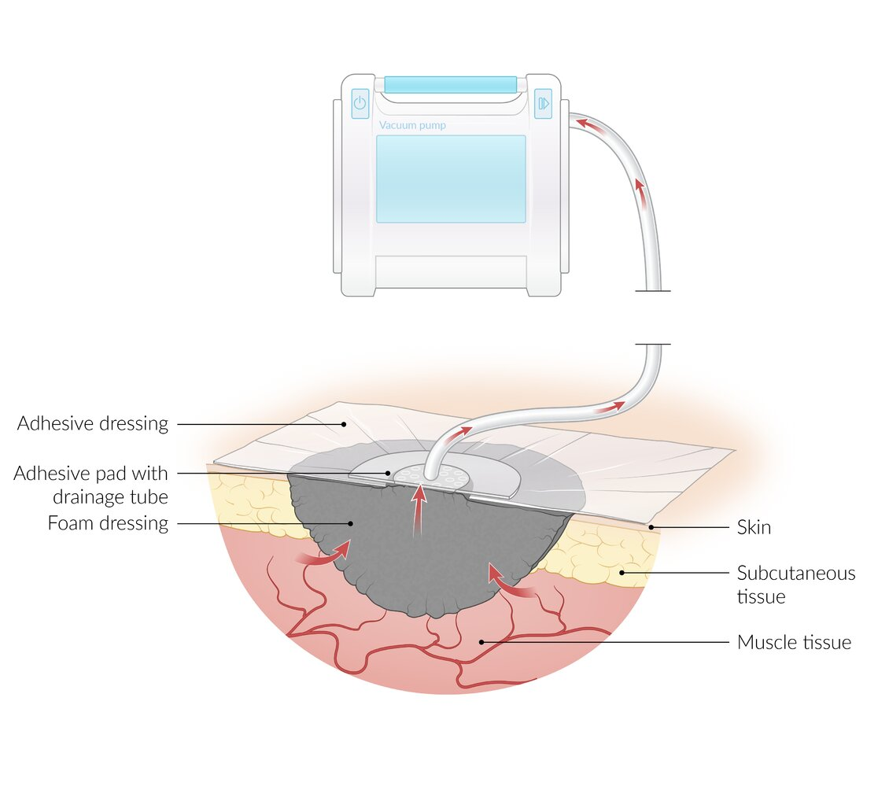

# Decubitus ulcers

*Categories: Clinical knowledge > Internal medicine > Infectious diseases > Wound, soft tissue, bone, and joint infections > Decubitus ulcers*

[Original Article Link](https://coursology-qbank.com/amboss/article/Mq0M_S)

---

## Summary

Decubitus <u>ulcers</u> or pressure <u>ulcers</u> are preventable injuries frequently encountered in older, <u>malnourished</u>, and immobilized individuals, especially those with multiple comorbidities. These injuries typically develop over bony prominences when local pressure-induced <u>hypoperfusion</u> and <u>necrosis</u> can lead to the loss of several or all <u>skin</u> layers. Diagnosis is primarily clinical but <u>laboratory studies</u> and imaging are required to evaluate for complications or <u>risk factors</u> that may delay healing (e.g., uncontrolled blood sugars, <u>hypoalbuminemia</u>). Treatment includes adequate <u>analgesia</u>, pressure relief (e.g., regular position changes, <u>alternating pressure mattresses</u>), frequent wound dressings, and <u>nutritional support</u>. Infectious complications (e.g., <u>osteomyelitis</u>, <u>sepsis</u>) should be treated with appropriate <u>antibiotic therapy</u>. Large, deep <u>ulcers</u> may require <u>surgical debridement</u>, especially if there is an inadequate response to <u>conservative management</u>. Preventive measures should be taken for all at-risk individuals and include pressure relief, rigorous <u>skin</u> care, and treatment of comorbidities and other <u>risk factors</u> such as <u>malnutrition</u> and systemic infection.

---

## Definitions

A decubitus <u>ulcer</u> or pressure injury is a focal area of unrelieved pressure resulting in <u>ischemia</u>, <u>cell death</u>, and <u>necrotic</u> injury of the <u>epidermis</u> and <u>soft tissue</u>.

---

## Etiology

The development of decubitus <u>ulcers</u> is multifactorial. Decubitus <u>ulcers</u> are <u>prone</u> to secondary infection, which is often polymicrobial.

### Predisposing factors [[2]](https://coursology-qbank.com/amboss/article/VfXGOx)[[3]](https://coursology-qbank.com/amboss/article/eSXxAx)

* Old age

* <u>Cachexia</u> or <u>malnourishment</u>

* <u>Multimorbidity</u>

* <u>Diabetes mellitus</u>

* Prolonged reduction in any of the following:

* Mobility (e.g., secondary to illness, <u>frailty</u>, or <u>paralysis</u>)

* Perception of <u>pain</u> (e.g., due to <u>polyneuropathy</u>, cognitive impairment, or anesthesia)

* <u>Skin</u> <u>perfusion</u> (e.g., in <u>peripheral artery disease</u>, <u>heart failure</u>, <u>vasoconstriction</u>, or <u>shock</u>)

* <u>Skin</u> breakdown (<u>maceration</u>) due to urinary or <u>fecal incontinence</u>

* Certain medications (e.g., <u>immunosuppressants</u>, <u>steroids</u>, or <u>vasopressors</u>) [[2]](https://coursology-qbank.com/amboss/article/VfXGOx)[[4]](https://coursology-qbank.com/amboss/article/SSXy_x)

* Prolonged pressure from medical devices such as feeding tubes, <u>oxygen delivery</u> devices, or <u>tracheostomy</u> tubes [[2]](https://coursology-qbank.com/amboss/article/VfXGOx)[[4]](https://coursology-qbank.com/amboss/article/SSXy_x)

> [!TIP]
> Pressure <u>ulcers</u> can develop within hours in an immobilized individual. Critically ill patients are at especially high risk and must be monitored carefully. [[3]](https://coursology-qbank.com/amboss/article/eSXxAx)

### Microbiology [[5]](https://coursology-qbank.com/amboss/article/mSXVZB)

The most commonly isolated bacteria include:

* <u>Staphylococcus aureus</u>

* <u>Proteus mirabilis</u>

* <u>Pseudomonas aeruginosa</u>

* <u>Enterococcus faecalis</u>

---

## Pathophysiology

Mechanical <u>stress</u> → local <u>hypoperfusion</u> → <u>ischemic necrosis</u> [[3]](https://coursology-qbank.com/amboss/article/eSXxAx)

---

## Clinical features

* Typical location: over bony prominences, such as the <u>sacrum</u>, <u>ischium</u>, heel, greater trochanter, <u>lateral malleolus</u>, <u>elbows</u>

* Initial presentation

* Focal area of nonblanchable <u>erythema</u> with/without <u>edema</u>

* Evidence of decreased <u>skin</u> <u>perfusion</u> (increased <u>capillary refill time</u>)

* Painful, unless there is sensory loss (e.g., due to <u>spinal cord injury</u>) [[6]](https://coursology-qbank.com/amboss/article/RqXly_)

* Advanced <u>ulcers</u>: loss of several or all <u>skin</u> layers and/or <u>subcutaneous tissue</u>

* <u>Eschar</u> and/or <u>slough</u> may cover the wound bed.

* Exposure of underlying tissue, including muscle and bone

* <u>Signs of wound infection</u> (e.g., <u>purulent</u> drainage or unpleasant odor) may be present.

* See also “Etiology” for predisposing factors and “<u>Staging of decubitus ulcers</u>” for further information.

Typical locations of pressure ulcers (decubitus ulcers)

Reference [[4]](https://coursology-qbank.com/amboss/article/SSXy_x)

---

## Complications

* <u>Soft tissue infection</u> (e.g., <u>cellulitis</u>, <u>abscess</u>)

* <u>Osteomyelitis</u>

* <u>Bacteremia</u>, <u>sepsis</u>

* <u>Marjolin ulcer</u> [[8]](https://coursology-qbank.com/amboss/article/zJXr9_)

Reference [[9]](https://coursology-qbank.com/amboss/article/_JX59_)

We list the most important complications. The selection is not exhaustive.

---

## Treatment

### Approach

* Ensure adequate <u>analgesia</u> (see “<u>Pain management</u>” for details on drugs and dosages).

* Consult a <u>wound care</u> specialist, general <u>surgery</u>, and/or plastic <u>surgery</u>.

* Urgently consult <u>surgery</u> for advanced and/or infected <u>ulcers</u>, especially if they are suspected to be the source of <u>sepsis</u>.

* Initiate treatment depending on the stage of the <u>ulcer</u> and whether an infection is present.

* <u>Superficial</u>, clean wound: <u>supportive care</u> alone may be appropriate

* Extensive and/or infected wound, wet <u>eschar</u>: <u>debridement</u>, <u>antibiotic therapy</u>, and/or surgical management in addition to <u>supportive care</u>

* Optimize management of comorbidities that may affect healing (e.g., uncontrolled <u>diabetes mellitus</u>).

* Ensure proper follow-up. [[10]](https://coursology-qbank.com/amboss/article/3fXSNx)

* The wound should be cleaned and freshly dressed regularly.

* Repeated debridements might be necessary.

### <u>Supportive care</u> [[2]](https://coursology-qbank.com/amboss/article/VfXGOx)[[10]](https://coursology-qbank.com/amboss/article/3fXSNx)[[11]](https://coursology-qbank.com/amboss/article/UfXblx)

The following are also important preventive measures for patients at risk of developing a decubitus <u>ulcer</u>.

#### Redistribute pressure

Pressure relief over the affected or vulnerable area is one of the most important aspects of management.

* Immobile patients and patients with several or refractory <u>ulcers</u>: [[3]](https://coursology-qbank.com/amboss/article/eSXxAx)

* Frequent position changes (every 2 hours)

* Pad all pressure points.

* <u>Alternating pressure mattress</u>

* Mobile patients

* Optimize bedding with a foam mattress or overlay.

* Assist with movement for patients with limited mobility.

* All at-risk patients: pad pressure points on devices such as <u>CPAP</u> masks and <u>physical restraints</u>.

#### Rigorous <u>skin</u> care

* Keep the <u>skin</u> clean and moisturized in order to prevent <u>skin</u> <u>erosion</u> and <u>laceration</u>.

* Advise caregivers to regularly inspect other at-risk areas to identify early stages of decubitus <u>ulcers</u>.

* Catheterization, <u>bowel programs</u>, and/or highly absorbent <u>incontinence products</u> (e.g., diapers, pads) may be helpful for patients with incontinence.

#### Nutrition

* Ensure adequate hydration and nutrition in all patients, preferably in consultation with a nutritionist.

* Protein supplementation is recommended.  [[12]](https://coursology-qbank.com/amboss/article/2fXTlx)

* Consider increasing daily calorie requirement and supplementing <u>micronutrients</u> to facilitate healing.

> [!TIP]
> Pressure relief and regular <u>skin</u> care are the most important steps for the prevention and <u>treatment of decubitus ulcers</u>.

### <u>Wound management</u> [[2]](https://coursology-qbank.com/amboss/article/VfXGOx)[[10]](https://coursology-qbank.com/amboss/article/3fXSNx)[[12]](https://coursology-qbank.com/amboss/article/2fXTlx)

* Cleaning

* Perform frequently to reduce the bacterial load.

* <u>Normal saline</u>  is a suitable cleaning agent.

* Limit the use of <u>antiseptic</u> fluids, because they inhibit the formation of <u>granulation tissue</u>. [[10]](https://coursology-qbank.com/amboss/article/3fXSNx)

* Dressings (e.g., hydrocolloids, <u>foam dressings</u> ): Perform frequently to absorb excess <u>exudate</u> while keeping the wound moist

* <u>Debridement</u>

* Used to remove devitalized tissue or <u>biofilms</u> to prevent or treat infection and enable healing

* Modalities: sharp (surgical), mechanical, biological, enzymatic, and autolytic

* In patients with suspected infection, obtain a swab or tissue for culture following <u>debridement</u>.

* Adjunctive treatment options: electrical stimulation, <u>negative pressure wound therapy</u>, and administration of <u>platelet-derived growth factor</u> [[12]](https://coursology-qbank.com/amboss/article/2fXTlx)

Negative pressure (vacuum-assisted) wound therapy: materials and application

Negative pressure (vacuum-assisted) wound therapy: principles

### Systemic <u>antibiotic</u> treatment [[2]](https://coursology-qbank.com/amboss/article/VfXGOx)

* Indication: evidence of localized or systemic infection (e.g., <u>cellulitis</u>, underlying <u>osteomyelitis</u>, <u>sepsis</u>)

* Options

* The choice of <u>antibiotic</u> should be directed by local microbiological guidance or, if a wound swab was obtained, by the culture results.

* See “<u>Empiric antibiotic therapy for skin and soft tissue infections</u>”, “<u>Treatment of osteomyelitis</u>”, or "<u>Antibiotics for sepsis</u>” as needed.

### Surgical management [[2]](https://coursology-qbank.com/amboss/article/VfXGOx)[[10]](https://coursology-qbank.com/amboss/article/3fXSNx)

* Indications and options

* <u>Surgical debridement</u>, <u>ulcer</u>/<u>eschar</u> excision 

* Extensive <u>ulcers</u> with undermining of adjacent tissue, cavity formation, or large <u>necrotic</u> areas

* Management of associated infection (e.g., extensive <u>cellulitis</u>, <u>abscess</u>, or <u>osteomyelitis</u>)

* Stage 3 or 4 wounds refractory to <u>conservative management</u>

* Secondary closure (e.g., <u>tissue flap</u> reconstruction): clean, healing <u>ulcers</u>.

* Important consideration: <u>Conservative management</u> may be more appropriate for patients who are not good candidates for <u>surgery</u> (e.g., multiple comorbidities, limited life-expectancy).

---