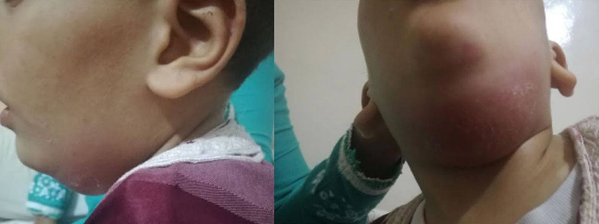

# Ludwig angina

*Categories: Clinical knowledge > Internal medicine > Infectious diseases > Wound, soft tissue, bone, and joint infections > Ludwig angina*

[Original Article Link](https://coursology-qbank.com/amboss/article/5w0ijR)

---

## Summary

Ludwig <u>angina</u> is a rare, life-threatening, and rapidly spreading <u>soft tissue infection</u> of the floor of the mouth that can lead to <u>airway</u> compromise. It is most commonly caused by polymicrobial <u>odontogenic infections</u> and occurs more frequently in individuals with poor dentition and/or <u>immunosuppression</u>. The classic presentation includes a woody or indurated floor of the mouth, submandibular swelling, and <u>tongue</u> elevation. Ludwig <u>angina</u> is a <u>medical emergency</u> because of the high risk of rapid <u>airway</u> compromise. Treatment priorities include <u>securing the airway</u>, administering <u>broad-spectrum antibiotics</u>, and surgical consult for source control. The preferred method for <u>airway</u> intervention is <u>awake fiberoptic intubation</u> while preparing for a <u>surgical airway</u>. Patients require admission to an <u>intensive care unit</u> for close <u>airway</u> monitoring.

---

## Etiology

* <u>Periapical abscess</u> (most common in adults)

* <u>Upper respiratory tract infection</u> (most common in children)

* Typically polymicrobial, including oral flora

* Common pathogens

* <u>Viridans streptococci</u>

* <u>Staphylococcus aureus</u>, e.g., <u>MRSA</u>

* <u>Staphylococcus epidermidis</u>

* Gram-negative aerobes (e.g., <u>Escherichia coli</u>, <u>Klebsiella pneumoniae</u>)

* Oral <u>anaerobes</u> (e.g., <u>Fusobacteriaceae</u>, <u>Actinomyces</u>, <u>Peptostreptococcus</u>, <u>Bacteroides</u>)

* <u>Risk factors</u>

* <u>Immunosuppression</u>

* <u>Diabetes mellitus</u>

* <u>Malnutrition</u>

* Injection drug use

* Chronic <u>heavy alcohol use</u>

* Oral piercings (e.g., recent <u>tongue</u> piercing)

* Poor dentition

* Oral or <u>dental trauma</u>

> [!TIP]
> Patients with <u>immunocompromise</u> are at increased risk of infection with <u>MRSA</u> and/or gram-negative aerobes.

---

## Clinical features

* <u>Fever</u>, chills, <u>weakness</u>, <u>malaise</u>

* <u>Signs of airway compromise</u>

* <u>Signs of respiratory distress</u>

* Symmetrical tenderness and woody induration of the submandibular area

* <u>Erythematous</u>, tender, and elevated floor of the mouth

* <u>Tongue</u> swelling may prevent the mouth from closing.

* Neck <u>erythema</u> and <u>edema</u>

* Sublingual, submental, and <u>cervical lymphadenopathy</u> (less common)

* <u>Trismus</u>, <u>meningismus</u>

Ludwig angina

---

## Treatment

### General principles [[1]](https://coursology-qbank.com/amboss/article/6_dj6s0)

* <u>ABCDE approach</u>

* <u>Supplemental oxygen</u> for <u>hypoxia</u>

* Emergency ENT and anesthesia consults

* Serial <u>airway</u> assessments and <u>definitive airway</u> management as needed

* <u>Hemodynamic monitoring</u>

* <u>Empiric antibiotic therapy for deep neck infections</u>

* Surgical source control

* Patients should be admitted to an <u>intensive care unit</u>.

> [!WARNING]
> Complete <u>airway obstruction</u> can occur rapidly in Ludwig <u>angina</u>.

### <u>Airway management</u> [[1]](https://coursology-qbank.com/amboss/article/6_dj6s0)

* Indications

* <u>Signs of airway compromise</u>

* <u>Signs of respiratory distress</u>

* <u>Definitive airway</u>

* Pre-oxygenate.

* Preferred technique: <u>awake fiberoptic intubation</u> while preparing for a <u>surgical airway</u>

* <u>Surgical airway</u>

* <u>Cricothyrotomy</u> may be challenging due to distorted neck anatomy.

* Awake tracheotomy may be necessary in patients with severe <u>edema</u>.

### Empiric <u>broad-spectrum antibiotics</u> [[1]](https://coursology-qbank.com/amboss/article/6_dj6s0)

* Suggested regimens for immunocompetent patients

* <u>Ampicillin/sulbactam</u>

* <u>Ceftriaxone</u> PLUS <u>metronidazole</u>

* <u>Clindamycin</u> PLUS <u>levofloxacin</u>

* Suggested regimens for <u>immunocompromised</u> patients

* <u>Cefepime</u> PLUS <u>metronidazole</u>

* <u>Imipenem</u>

* <u>Meropenem</u>

* <u>Piperacillin/tazobactam</u>

* Add one of the following if <u>MRSA</u> is suspected:

* <u>Vancomycin</u>

* <u>Linezolid</u>

* See “<u>Empiric antibiotic therapy for deep neck infections</u>” for dosages.

> [!WARNING]
> <u>Clindamycin</u> monotherapy is not recommended because of high resistance rates. [[1]](https://coursology-qbank.com/amboss/article/6_dj6s0)

### Adjunctive therapy [[1]](https://coursology-qbank.com/amboss/article/6_dj6s0)

* <u>Glucocorticoids</u> such as <u>dexamethasone</u> (<u>off-label</u>) DOSAGE may be considered.  [[1]](https://coursology-qbank.com/amboss/article/6_dj6s0)

* <u>Nebulized epinephrine</u> may be used to reduce <u>airway obstruction</u>, although there is limited evidence to support this.

### Surgical management [[1]](https://coursology-qbank.com/amboss/article/6_dj6s0)

* Early <u>debridement</u> of <u>necrotic</u> tissue and drainage of fluid collections may improve <u>airway</u> status and reduce rates of <u>airway</u> compromise, although there is limited evidence to support this.

* Indications

* No or insufficient improvement with <u>antibiotics</u>

* <u>Fluctuance</u> on examination

* <u>Abscesses</u> on imaging

---