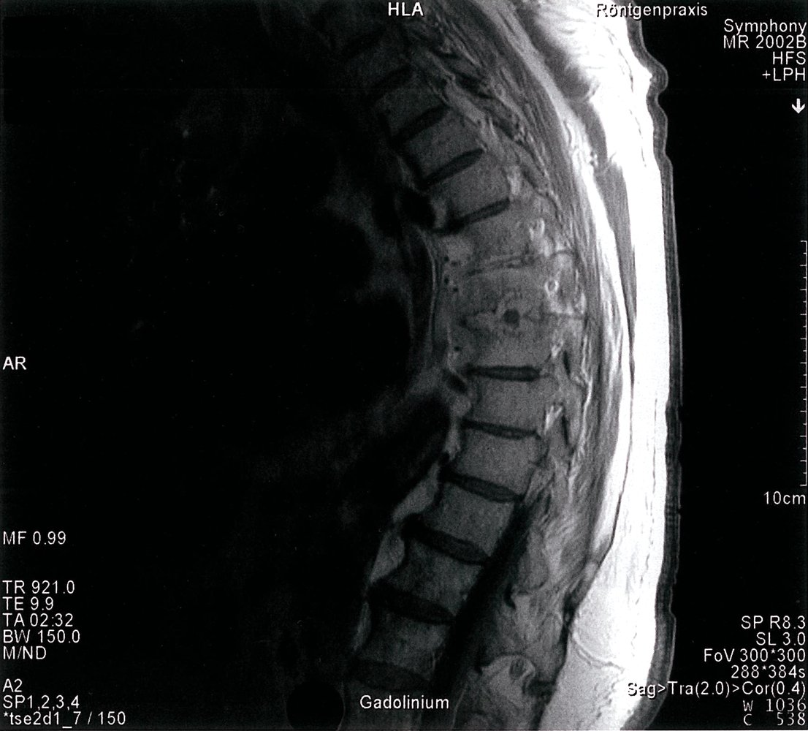
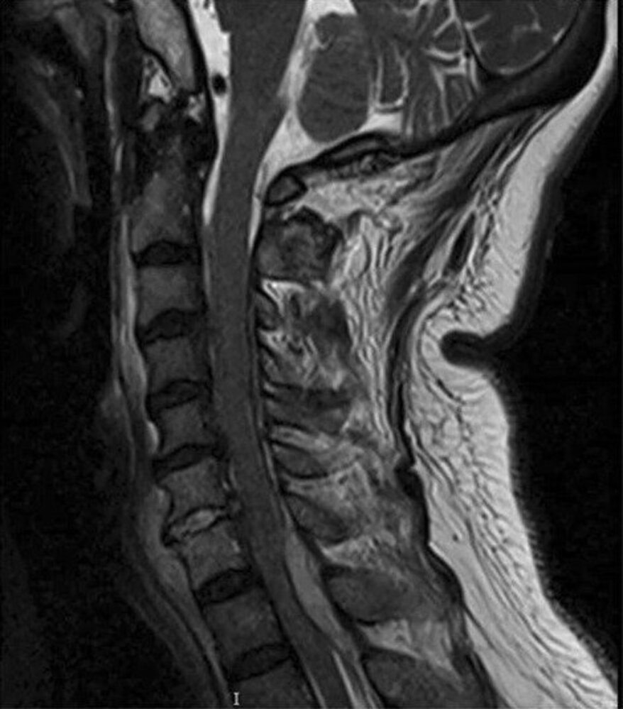
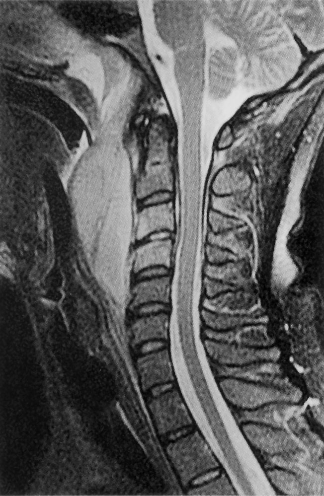
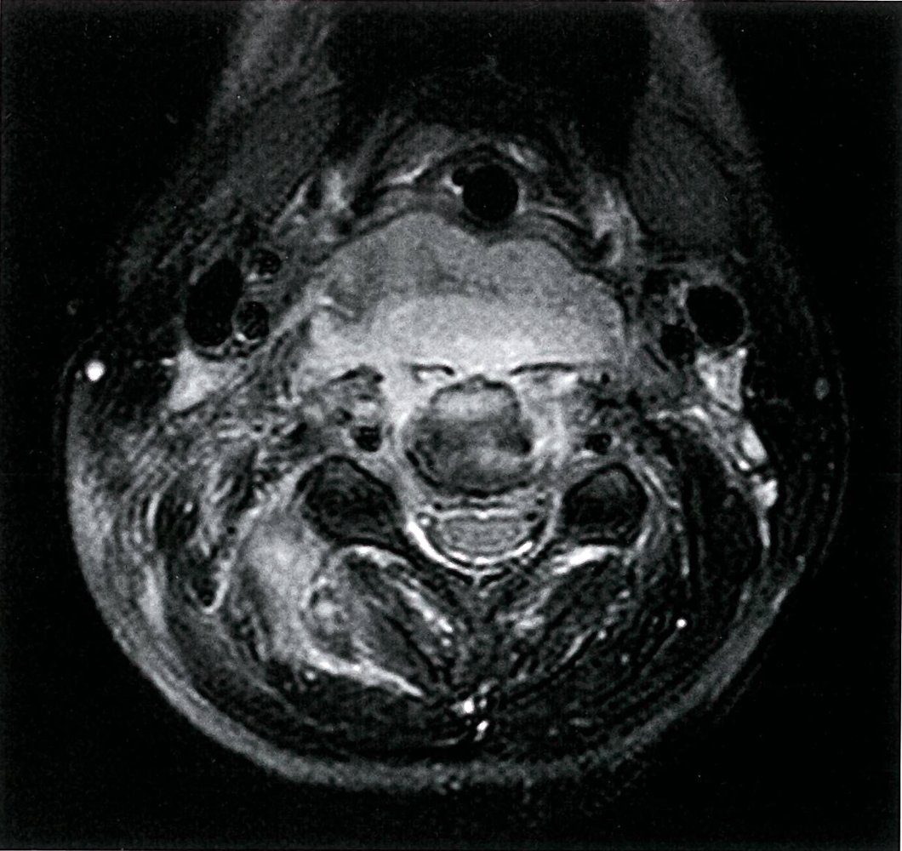
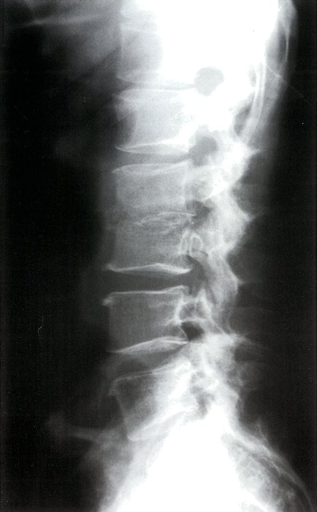

# Spinal infections

*Categories: Clinical knowledge > Internal medicine > Infectious diseases > Wound, soft tissue, bone, and joint infections > Spinal infections*

[Original Article Link](https://coursology-qbank.com/amboss/article/9q0N0h)

---

## Summary

Spinal infections, an umbrella term covering <u>osteomyelitis</u>, <u>diskitis</u>, and <u>spinal epidural abscess</u>, are a rare but serious <u>cause of back pain</u>. They are caused by bacteria (most commonly <u>Staphylococcus aureus</u>) introduced during <u>surgery</u> or via hematogenous or contiguous spread from other infections, which leads to inflammation and <u>abscess</u> formation. <u>Risk factors</u> include <u>immunosuppression</u>, <u>bacteremia</u>, and recent <u>surgery</u>. Patients typically present with nonspecific symptoms such as <u>back pain</u> and <u>fever</u>; however, the presentation depends on the location and extent of the infection and may include signs of cord compression. Diagnosis is often delayed due to the nonspecific nature of symptoms, as well as the overlap between symptoms of spinal infection and those of the underlying source of infection, e.g., <u>skin and soft tissue infection</u> or <u>urinary tract infection</u>. Diagnosis is based on <u>blood cultures</u>, <u>inflammatory markers</u>, and advanced imaging of the <u>spine</u>; the first-line imaging modality is <u>MRI</u> with and without contrast. If initial studies are negative, a CT-guided <u>biopsy</u> may be appropriate. Patients with <u>hemodynamic instability</u> or signs of neurologic compromise should be started on <u>antibiotics</u> immediately and urgently referred to a neurosurgeon. For stable patients, <u>antibiotic therapy</u> is typically deferred until the causative organism is known. Additional surgical management should be considered for patients with complications such as <u>abscesses</u> or spinal deformity, or who have ongoing severe <u>pain</u> or fail to respond to <u>antibiotic therapy</u>.

---

## Definitions

* Vertebral osteomyelitis (<u>spondylitis</u>): an infection of the <u>vertebral body</u>. Subtypes include:

* Granulomatous <u>vertebral osteomyelitis</u>: most commonly caused by <u>tuberculosis</u> (<u>Pott disease</u>). <u>Risk factors</u> include immigration from countries with high <u>TB</u> <u>prevalence</u> and <u>coinfection</u> with <u>HIV</u>. [[2]](https://coursology-qbank.com/amboss/article/hCYc7r)

* Pyogenic vertebral osteomyelitis: most common form; typically occurs secondary to infection with <u>Staphylococcus aureus</u>

* Diskitis: an infection of the intervertebral disk space

* Spondylodiskitis: an infection of both the <u>vertebral body</u> and intervertebral disk space

* Spinal epidural abscess: a suppurative infection in the <u>epidural space</u>

---

## Etiology

### Routes of infection

* Spinal infection may arise from: [[4]](https://coursology-qbank.com/amboss/article/LCYwsr)[[5]](https://coursology-qbank.com/amboss/article/zfcrKb0)

* Hematogenous spread from a distant focus (e.g., <u>skin and soft tissue infection</u>, <u>urinary tract infection</u>)

* Direct <u>inoculation</u> (e.g., during spinal <u>surgery</u> or due to trauma)

* Contiguous spread from adjacent infections (e.g., aorta, <u>esophagus</u>)

* Frequently, a primary source of infection cannot be identified. [[5]](https://coursology-qbank.com/amboss/article/zfcrKb0)

### Pathogens [[2]](https://coursology-qbank.com/amboss/article/hCYc7r)[[4]](https://coursology-qbank.com/amboss/article/LCYwsr)[[6]](https://coursology-qbank.com/amboss/article/3CYS7r)

* Common

* <u>Staphylococcus aureus</u> (most common; , accounting for > 40% of cases) [[2]](https://coursology-qbank.com/amboss/article/hCYc7r)

* <u>Escherichia coli</u> (second most common)

* <u>Pseudomonas aeruginosa</u>

* <u>Proteus mirabilis</u>

* <u>Enterobacteriaceae</u>

* <u>Beta-hemolytic</u> <u>streptococci</u>

* In special patient groups

* After spinal <u>surgery</u>, usually: [[4]](https://coursology-qbank.com/amboss/article/LCYwsr)

* <u>Coagulase-negative staphylococci</u>, e.g., <u>Staphylococcus epidermidis</u>

* <u>Propionibacterium acnes</u>

* In areas of high endemicity or in patients emigrating or traveling from those areas, also consider:

* <u>Mycobacterium tuberculosis</u>: resulting in <u>tuberculous spondylitis</u>

* <u>Brucella</u> spp.

* In patients with <u>immunosuppression</u>, long-term indwelling venous catheters, or IV drug use, also consider fungal species.

Tuberculosis fact sheet and incidence map

### <u>Risk factors</u> [[2]](https://coursology-qbank.com/amboss/article/hCYc7r)[[6]](https://coursology-qbank.com/amboss/article/3CYS7r)[[7]](https://coursology-qbank.com/amboss/article/j9Y_Mr)

* Age > 50 years [[5]](https://coursology-qbank.com/amboss/article/zfcrKb0)

* <u>Sickle cell disease</u> [[8]](https://coursology-qbank.com/amboss/article/Cgcqxb0)

* <u>Immunocompromise</u>: e.g., <u>steroid</u> use, <u>HIV infection</u>

* <u>Intravenous drug use</u>

* Recent <u>bacteremia</u>

* <u>Infective endocarditis</u>

* Recent spinal <u>surgery</u> and instrumentation

* <u>Intravascular</u> devices

* <u>Malnutrition</u>

* Chronic medical conditions:

* <u>Diabetes mellitus</u>

* <u>Renal failure</u>

* <u>Heart</u> disease

* <u>Liver cirrhosis</u>

* <u>Malignancy</u>

---

## Clinical features

All types of spinal infections have similar clinical features. In cases of hematogenous spread, features of the primary infection (e.g., <u>urinary tract infection</u>, <u>skin and soft tissue infection</u>) may dominate the clinical presentation. [[2]](https://coursology-qbank.com/amboss/article/hCYc7r)[[6]](https://coursology-qbank.com/amboss/article/3CYS7r)

* Back or <u>neck pain</u> [[4]](https://coursology-qbank.com/amboss/article/LCYwsr)[[5]](https://coursology-qbank.com/amboss/article/zfcrKb0)[[6]](https://coursology-qbank.com/amboss/article/3CYS7r)

* Onset is typically insidious, worsening over several weeks to months.

* Occurs in a localized area

* Worse during physical activity and at night

* May radiate to the abdomen, hip, leg, <u>scrotum</u>, groin, and/or <u>perineum</u>

* Severe, sharp <u>back pain</u> may indicate an epidural <u>abscess</u>.

* Examination findings

* <u>Pain</u> is exacerbated by palpation or percussion of the area.

* Palpation of paravertebral muscles can cause tenderness and spasm.

* Spinal mobility is reduced.

* Neurological signs and symptoms may be present: See “Complications.”

* <u>Fever</u>: present in up to 45% of patients.  [[6]](https://coursology-qbank.com/amboss/article/3CYS7r)

> [!TIP]
> The diagnosis of spinal infection is often delayed because <u>back pain</u> is a common and nonspecific symptom, while spinal infections are rare.

---

## Diagnosis

### Approach [[6]](https://coursology-qbank.com/amboss/article/3CYS7r)[[9]](https://coursology-qbank.com/amboss/article/HYbKqH)

* Obtain the following tests in all patients with suspected spinal infections:

* <u>ESR</u> and <u>CRP</u>

* Two sets of bacterial <u>blood cultures</u>

* <u>MRI</u> <u>spine</u>

* If all initial tests are negative but clinical suspicion remains high, consider:

* Nuclear medicine scan

* CT-guided <u>aspiration</u> <u>biopsy</u>

* Suspected hematogenous or contiguous spread: Identify and treat the underlying cause.

> [!TIP]
> <u>Back pain</u> and <u>fever</u> can also occur in underlying causes such as <u>pneumonia</u> and <u>pyelonephritis</u>; screen patients with spinal infections carefully to avoid missing a concurrent infection.

### <u>Laboratory studies</u> [[6]](https://coursology-qbank.com/amboss/article/3CYS7r)

* ↑ <u>CRP</u>, ↑ <u>ESR</u>  [[6]](https://coursology-qbank.com/amboss/article/3CYS7r)

* <u>CBC</u>: typically elevated  [[6]](https://coursology-qbank.com/amboss/article/3CYS7r)

* <u>Blood cultures</u>: two sets, aerobic and anaerobic, from two separate peripheral <u>venipuncture</u> sites

* Additional testing when less common pathogens are suspected, e.g.:

* <u>Brucella</u>: <u>Blood cultures</u> and <u>serology</u>

* <u>Fungal infections</u>: fungal cultures, <u>serology</u>, and <u>antigen</u> detection assays

* <u>Tuberculosis</u>: <u>PPD</u>, <u>interferon γ release assay</u>, or <u>mycobacterial</u> culture for <u>Mycobacterium tuberculosis</u>

* If initial testing shows no signs of infection, consider checking <u>serum protein electrophoresis</u> to evaluate for <u>multiple myeloma</u>.

### Imaging studies [[6]](https://coursology-qbank.com/amboss/article/3CYS7r)[[10]](https://coursology-qbank.com/amboss/article/8ScOYX0)

Imaging findings may show <u>osteomyelitis</u>, <u>diskitis</u>, <u>abscess</u> formation, or a combination of the three.

#### <u>MRI</u> <u>spine</u>  [[5]](https://coursology-qbank.com/amboss/article/zfcrKb0)[[6]](https://coursology-qbank.com/amboss/article/3CYS7r)[[11]](https://coursology-qbank.com/amboss/article/9AbNNw)[[12]](https://coursology-qbank.com/amboss/article/XTc96b0)

* Indication: : first-line imaging modality for suspected spinal infection (highest <u>sensitivity</u>)  [[6]](https://coursology-qbank.com/amboss/article/3CYS7r)

* Modality: <u>MRI</u> <u>spine</u> with and without IV <u>gadolinium</u> contrast

* Findings 

* <u>Pyogenic vertebral osteomyelitis</u>

* Loss of <u>vertebral</u> endplate definition with change in signal intensity of disks and <u>vertebral bodies</u> (<u>hypointense</u> on T1 , <u>hyperintense</u> on T2)

* <u>Contrast enhancement</u> of disks and <u>vertebral bodies</u>

* Adjacent soft-tissue inflammation

* Granulomatous <u>vertebral osteomyelitis</u>: See “Diagnostics” in “<u>Pott disease</u>.”

* <u>Spinal epidural abscess</u>  [[2]](https://coursology-qbank.com/amboss/article/hCYc7r)[[13]](https://coursology-qbank.com/amboss/article/cTcapb0)

* Early infection (<u>phlegmon</u>): homogeneous <u>enhancement</u> in <u>epidural space</u>

* Established <u>abscess</u>: <u>rim enhancement</u> surrounding a nonenhancing center

Spondylodiskitis (diskitis-osteomyelitis)

Spinal epidural abscess, osteomyelitis, and discitis

Retropharyngeal abscess with spondylodiscitis and osteomyelitis

Spondylodiscitis with prevertebral and paravertebral abscess formation

#### Additional imaging studies

* CT <u>spine</u> with IV contrast [[2]](https://coursology-qbank.com/amboss/article/hCYc7r)[[14]](https://coursology-qbank.com/amboss/article/eTcxpb0)

* Indications

* Evaluation of calcifications or <u>sequestra</u>

* Percutaneous needle <u>biopsy</u>

* Findings [[9]](https://coursology-qbank.com/amboss/article/HYbKqH)

* Adjacent bone <u>edema</u>

* Disk space narrowing

* <u>Vertebral</u> endplate <u>erosion</u>

* <u>Sequestra</u> formation

* Calcifications

* <u>Spinal epidural abscess</u>: <u>rim enhancement</u> after contrast administration

* Nuclear medicine scans: adjunct to <u>MRI</u> if initial <u>MRI</u> results are negative or equivocal

* Modalities: A combination of scans may be used.  [[6]](https://coursology-qbank.com/amboss/article/3CYS7r)

* 3-phase <u>technetium-99m</u> <u>bone scan</u>

* Gallium scan

* <u>PET scan</u>

* Findings: increased activity in the infected area

* <u>X-ray</u> 

* Indications: not used to diagnose spinal infections but a potential initial study in a patient presenting with <u>back pain</u>

* Findings [[15]](https://coursology-qbank.com/amboss/article/xScEbX0)[[16]](https://coursology-qbank.com/amboss/article/BSczbX0)

* Typically normal for the first 3–6 weeks of infection [[6]](https://coursology-qbank.com/amboss/article/3CYS7r)

* After 3–6 weeks:

* Narrowing of disk space

* <u>Erosion</u> of <u>vertebral</u> endplates

* Periosteal thickening

* Lytic lesions

* New bone apposition

* May show some paraspinal <u>soft tissue</u> changes

> [!TIP]
> If imaging is inconclusive but suspicion for spinal infection persists, repeat after 1–3 weeks. [[6]](https://coursology-qbank.com/amboss/article/3CYS7r)

Spondylodiscitis (discitis-osteomyelitis)

### CT-guided <u>aspiration</u> <u>biopsy</u> [[6]](https://coursology-qbank.com/amboss/article/3CYS7r)

* <u>Confirmatory test</u>

* A <u>biopsy</u> of the affected area is performed and material is sent for microbiologic and pathologic examination.

* Indications to repeat the <u>biopsy</u> include:

* Inadequate tissue drawn

* Specimen growing a likely <u>skin</u> contaminant

* Suspected organism is hard to culture (e.g., fungi, <u>mycobacteria</u>, or <u>Brucella</u> spp.).

* Indications

* Patients with spinal infection in whom <u>blood cultures</u> or <u>serology</u> have not identified a causative organism

* Consider for patients with suspected <u>vertebral osteomyelitis</u> and concurrent <u>bloodstream infection</u>

> [!TIP]
> In patients with a nondiagnostic workup and negative CT-guided <u>aspiration</u> <u>biopsy</u> in whom the clinical suspicion of spinal infection remains high, a repeat <u>biopsy</u> (CT-guided or surgical) should be obtained. [[6]](https://coursology-qbank.com/amboss/article/3CYS7r)

---

## Treatment

The following recommendations pertain to the treatment of suspected <u>pyogenic vertebral osteomyelitis</u> and <u>spinal epidural abscess</u>. Involve specialists (infectious disease, neurosurgery) early. For treatment of tubercular <u>vertebral osteomyelitis</u>, see “<u>Pott disease</u>.”

### Approach [[6]](https://coursology-qbank.com/amboss/article/3CYS7r)

* Initial management: Assess the need for <u>empiric antibiotic therapy</u> and invasive treatment.

* Initiate <u>empiric antibiotic therapy</u> and obtain cultures and an urgent neurosurgical consult if any of the following criteria are met:

* Suspected <u>spinal epidural abscess</u>

* New or progressive neurologic symptoms

* <u>Hemodynamic instability</u> or impending <u>sepsis</u>

* If none of the criteria are fulfilled, <u>antibiotic therapy</u> can be delayed until the causative organism is identified.

* Ongoing management

* Initiate <u>pain management</u>

* If mobility is limited, start <u>preventative measures against decubitus ulcers</u>.

* Identify and treat underlying causes.

* Regularly reassess for new neurologic signs and symptoms.

* Tailor <u>antibiotic therapy</u> based on culture and susceptibility results.

### <u>Antimicrobial therapy</u> [[6]](https://coursology-qbank.com/amboss/article/3CYS7r)

#### Empiric antimicrobial therapy for spinal infections

* Indications

* New or progressive neurologic symptoms

* <u>Hemodynamic instability</u>

* <u>Sepsis</u>

* Coverage: : must include <u>Staphylococcus</u> spp., including <u>MRSA</u>, <u>Streptococcus</u> spp., and <u>gram-negative bacilli</u>

* Recommended regimens 

* First line: <u>vancomycin</u> DOSAGE PLUS

* A <u>third-generation cephalosporin</u> (e.g., <u>ceftriaxone</u> DOSAGE)

* OR PLUS a <u>fourth-generation cephalosporin</u> (e.g., <u>cefepime</u> DOSAGE)

* Alternative in case of <u>allergy</u>: <u>daptomycin</u> DOSAGE PLUS a <u>fluoroquinolone</u> (e.g., <u>ciprofloxacin</u> DOSAGE)

> [!TIP]
> Diagnostics aimed at identifying the causative <u>pathogen</u> (e.g., <u>blood cultures</u> or <u>biopsy</u>) should be performed at the same time that <u>empiric antibiotics</u> are started.

#### Tailored <u>antimicrobial therapy</u>

* Initiate IV antimicrobial treatment based on culture and susceptibility results.

* Consider switching to oral <u>antibiotics</u> if symptoms improve and <u>inflammatory markers</u> trend downward.

|  Culture-specific <u>antibiotic therapy</u> for <u>vertebral osteomyelitis</u> [[6]](https://coursology-qbank.com/amboss/article/3CYS7r)  |  |  |  |
| --- | --- | --- | --- |
| <u>Pathogen</u> |  | Preferred |  Alternative   |
| <u>Staphylococcus</u> species | <u>Methicillin</u>-susceptible <u>Staphylococcus aureus</u> |   * <u>Nafcillin</u> DOSAGE or <u>oxacillin</u> DOSAGE  * OR <u>cefazolin</u> DOSAGE  * OR <u>ceftriaxone</u> DOSAGE    |   * <u>Vancomycin</u> DOSAGE  * OR <u>daptomycin</u> DOSAGE  * OR <u>linezolid</u> DOSAGE  * OR <u>levofloxacin</u> DOSAGE PLUS <u>rifampin</u> DOSAGE  * OR <u>clindamycin</u> DOSAGE    |
| <u>Methicillin</u>-resistant <u>Staphylococcus aureus</u> |  * <u>Vancomycin</u> DOSAGE   |   * <u>Daptomycin</u> DOSAGE  * OR <u>linezolid</u> DOSAGE  * OR <u>levofloxacin</u> DOSAGE PLUS <u>rifampin</u> DOSAGE    |  |
| <u>Enterococcus</u> species | <u>Penicillin</u>-susceptible |   * <u>Penicillin G</u> DOSAGE  * OR <u>ampicillin</u> DOSAGE    |   * <u>Vancomycin</u> DOSAGE  * OR <u>daptomycin</u> DOSAGE  * OR <u>linezolid</u> DOSAGE    |
| <u>Penicillin</u>-resistant |  * <u>Vancomycin</u> DOSAGE   |   * <u>Daptomycin</u> DOSAGE  * OR <u>linezolid</u> DOSAGE    |  |
|  * Patients should also receive an <u>aminoglycoside</u>, e.g., <u>gentamicin</u> (see “<u>Targeted antimicrobial therapy for infective endocarditis</u>" for further information, including dosages)   |  |  |  |
| With associated <u>endocarditis</u> |  |  |  |
| <u>Pseudomonas aeruginosa</u> |  |   * <u>Cefepime</u> DOSAGE  * OR <u>meropenem</u> DOSAGE  * OR <u>doripenem</u> DOSAGE    |   * <u>Ciprofloxacin</u> DOSAGE  * OR <u>ceftazidime</u> DOSAGE  * OR <u>aztreonam</u> DOSAGE    |
| <u>Enterobacteriaceae</u> |  |   * <u>Cefepime</u> DOSAGE  * OR <u>ertapenem</u> DOSAGE    |  * <u>Ciprofloxacin</u> DOSAGE   |
| <u>Beta-hemolytic</u> <u>streptococci</u> |  |   * <u>Penicillin G</u> DOSAGE  * OR <u>ceftriaxone</u> DOSAGE    |  * <u>Vancomycin</u> DOSAGE   |
| <u>Propionibacterium acnes</u> |  |   * <u>Penicillin G</u> DOSAGE  * OR <u>ceftriaxone</u> DOSAGE    |   * <u>Clindamycin</u> DOSAGE  * OR <u>vancomycin</u> DOSAGE    |
| <u>Salmonella</u> species |  |  * <u>Ciprofloxacin</u> DOSAGE   |  * <u>Ceftriaxone</u> DOSAGE   |
| <u>Mycobacterium tuberculosis</u> |  |  * See “<u>Tuberculosis treatment</u>.”   |  |

> [!TIP]
> Spinal infections are usually treated with 6 weeks of <u>antibiotics</u>, but the duration may vary based on the causative organism and patient response to treatment. Consult an infectious disease specialist prior to stopping treatment.

### Invasive treatment

#### CT-guided drainage and <u>irrigation</u> [[17]](https://coursology-qbank.com/amboss/article/UhcbWX0)

* Indication: epidural and paraspinal <u>abscesses</u>

* Contraindications: <u>anterior</u> <u>abscess</u>, <u>spinal instability</u>, associated <u>osteomyelitis</u> or spondylodiskitis

#### <u>Surgery</u>

* Indications [[2]](https://coursology-qbank.com/amboss/article/hCYc7r)[[4]](https://coursology-qbank.com/amboss/article/LCYwsr)[[6]](https://coursology-qbank.com/amboss/article/3CYS7r)

* Epidural <u>abscesses</u> and paraspinal <u>abscesses</u>, particularly those large in size (e.g., ≥ 2.5 cm)  [[2]](https://coursology-qbank.com/amboss/article/hCYc7r)[[4]](https://coursology-qbank.com/amboss/article/LCYwsr)[[18]](https://coursology-qbank.com/amboss/article/HgcK9b0)

* <u>Spinal instability</u> or deformity

* New or progressive neurologic impairment

* Intractable <u>pain</u>

* Need for <u>open biopsy</u>  [[4]](https://coursology-qbank.com/amboss/article/LCYwsr)

* Infections associated with spinal implants

* Persistent or recurrent <u>bloodstream infection</u>

* Objectives [[2]](https://coursology-qbank.com/amboss/article/hCYc7r)[[6]](https://coursology-qbank.com/amboss/article/3CYS7r)

* <u>Debridement</u> of infected tissues, with removal of prosthetic material if necessary

* Obtaining material for microbiologic/histologic evaluation

* Decompression of neural structures

* Spinal fixation

* <u>Abscess</u> drainage

---

## Complications

* Neurologic [[4]](https://coursology-qbank.com/amboss/article/LCYwsr)

* Motor <u>weakness</u> or <u>paralysis</u>  [[4]](https://coursology-qbank.com/amboss/article/LCYwsr)

* Sensory loss

* <u>Meningitis</u> [[6]](https://coursology-qbank.com/amboss/article/3CYS7r)

* Infectious

* <u>Sepsis</u>

* <u>Abscess</u> in the surrounding <u>soft tissues</u>

* Prevertebral abscess: may manifest with <u>neck pain</u>, difficulty <u>swallowing</u>, difficulty breathing, and potential <u>respiratory failure</u> (secondary to the <u>abscess</u> compressing the <u>trachea</u> and obstructing the <u>airway</u>)

* Paravertebral <u>abscess</u>: Symptoms frequently overlap with those underlying spinal infection.

* <u>Psoas abscess</u>

* Infectious <u>aortitis</u> [[19]](https://coursology-qbank.com/amboss/article/-sXDxz)

Retropharyngeal abscess with spondylodiscitis and osteomyelitis

> [!WARNING]
> Severe complications can occur if the diagnosis or <u>treatment of spinal infections</u> is delayed.

We list the most important complications. The selection is not exhaustive.

---