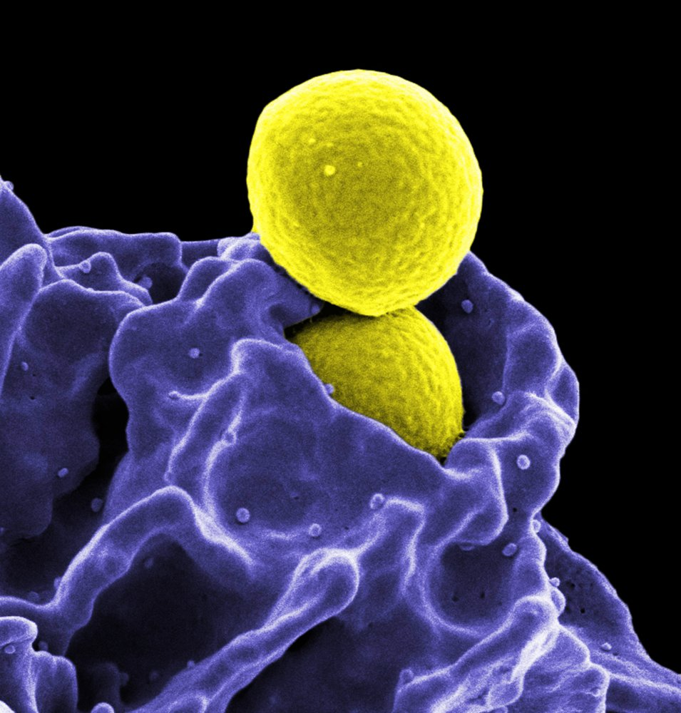
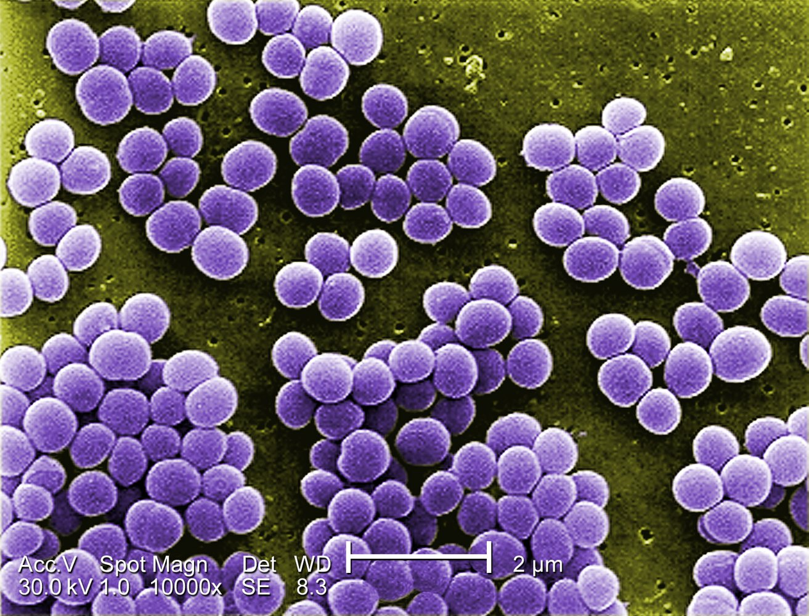
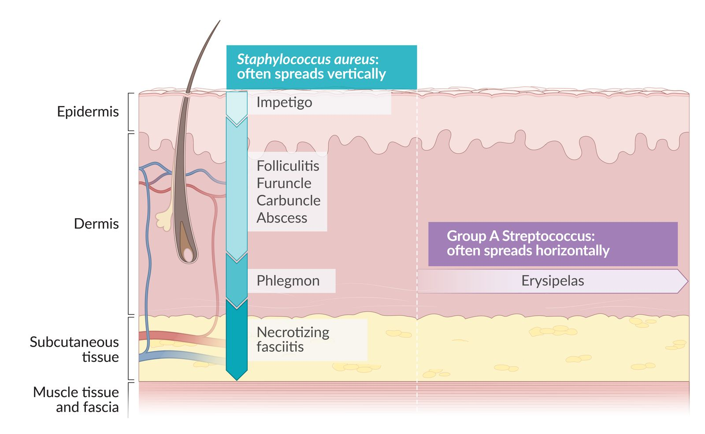

# Staphylococcal diseases

*Categories: Clinical knowledge > Internal medicine > Infectious diseases > Wound, soft tissue, bone, and joint infections > Staphylococcal diseases*

[Original Article Link](https://coursology-qbank.com/amboss/article/Vl0GDT)

---

## Summary

<u>Staphylococci</u> are gram-positive, spherical-shaped bacteria that form <u>clusters</u> and are commonly found on the <u>skin</u> and <u>mucous membranes</u>. Clinically, the most important species include <u>Staphylococcus aureus</u> and <u>Staphylococcus epidermidis</u>, which are categorized according to their <u>coagulase</u> activity. <u>S. aureus</u> is <u>coagulase positive</u> and expresses several <u>virulence factors</u> which support evasion of the host <u>immune response</u>. <u>S. epidermidis</u> is <u>coagulase</u> negative and is usually less <u>virulent</u>, although it can evade the host <u>immune system</u> by forming and subsequently hiding in a <u>biofilm</u>. <u>S. aureus</u> is commonly responsible for many localized infections (e.g., <u>folliculitis</u>, cervical <u>lymphadenopathy</u>) and also severe organ infections in the setting of <u>bacteremia</u> (e.g., <u>endocarditis</u>, <u>osteomyelitis</u>). As a toxin producer, <u>S. aureus</u> can cause <u>food poisoning</u> (see <u>Staphylococcal food poisoning</u>) and, in severe cases, life-threatening diseases such as <u>staphylococcal scalded skin syndrome</u> (<u>SSSS</u>) or <u>toxic shock syndrome</u> (<u>TSS</u>). <u>Methicillin</u>-resistant S. aureus (<u>MRSA</u>), in particular, poses a major threat to both <u>immunocompromised</u> and multimorbid patients and is a considerable challenge to hospital hygiene. <u>S. epidermidis</u> is mostly responsible for <u>foreign body infections</u> caused by, for example, contaminated peripheral lines or prosthetic <u>joints</u>. The treatment of choice is anti-staphylococcal <u>penicillins</u> (e.g., <u>oxacillin</u>, <u>flucloxacillin</u>) or first and second-generation <u>cephalosporins</u>.

---

## Definitions

<u>Staphylococci</u> are immotile, gram-positive bacteria that have a round shape and are found in <u>clusters</u>.

---

## Classification

* <u>Coagulase-positive</u>; : Staphylococcus aureus

* <u>Coagulase-negative</u>; : Staphylococcus epidermidis

Phagocytosis of methicillin-resistant Staphylococcus aureus (MRSA)

Staphylococcus aureus (S. aureus)

---

## Resistance and virulence of staphylococci

### <u>Staphylococcus aureus</u>

For more information, see <u>methicillin-resistant Staphylococcus aureus</u> and “<u>Gram-positive cocci</u>” section in the <u>bacteria overview</u>.

* Enzymes

* <u>Catalase</u>

* <u>Coagulase</u>

* Hemolysins

* <u>Hyaluronidase</u>

* <u>Lipase</u>

* <u>Penicillinase</u>

* Toxins

* <u>Superantigens</u>: can activate large numbers of <u>T cells</u>, resulting in the massive release of <u>cytokines</u> [[2]](https://coursology-qbank.com/amboss/article/WkbP5F)

* <u>Toxic shock syndrome toxin 1</u> (<u>TSST-1</u>)

* <u>Enterotoxin B</u> (heat stable)

* <u>Exfoliative toxin</u> (causes epidermolysis in <u>SSSS</u>)

* <u>Leukocidin</u> (causes <u>necrosis</u> of the <u>skin</u> and <u>mucous membranes</u>)

* <u>Proteins</u>

* Clumping factor A: binds to <u>fibrinogen</u> → <u>platelet activation</u>, aggregation, and blood clumping

* Protein A: inhibits <u>phagocytosis</u> and <u>complement</u> fixation by binding to the <u>Fc region</u> of <u>IgG</u>

* Modified <u>penicillin-binding</u> protein (<u>PBP</u>) in <u>MRSA</u>

* Microbial surface components recognizing adhesive matrix molecules (MSCRAMMs): facilitate the adherence of <u>S. aureus</u> to the <u>extracellular matrix</u> of host tissue [[3]](https://coursology-qbank.com/amboss/article/e7Xxkz)

* Capsular <u>polysaccharides</u>: promote <u>colonization</u> and persistence in host tissues

### <u>Staphylococcus epidermidis</u>

* <u>S. epidermidis</u> produces a <u>biofilm</u> that consists of <u>proteins</u> and extracellular <u>polysaccharides</u>.

* Protects <u>S. epidermidis</u> from <u>host defense mechanisms</u> and <u>antibiotics</u>

* Facilitates <u>colonization</u> of surfaces of prosthetic material and IV catheters → device-associated infections

---

## Treatment

### <u>Staphylococcus aureus</u>

* Anti-staphylococcal <u>penicillins</u>: <u>oxacillin</u>, <u>flucloxacillin</u>

* First and <u>second generation cephalosporins</u>

* In case of <u>penicillin</u> <u>allergy</u>: <u>clindamycin</u>

* <u>MRSA</u>: drugs of last resort such as <u>vancomycin</u> and <u>linezolid</u>

### <u>Coagulase-negative</u> <u>staphylococcus</u> (particularly <u>S. epidermidis</u>)

* <u>Methicillin</u>-sensitive: <u>oxacillin</u>, <u>nafcillin</u>, or <u>cefazolin</u>

* <u>Methicillin</u>-resistant: <u>vancomycin</u> or <u>daptomycin</u>

* Second-line treatment (if susceptible): <u>levofloxacin</u> and <u>rifampicin</u>

---

## Subtypes and variants

### <u>Skin</u>

* <u>Impetigo</u>

* <u>Folliculitis</u>, <u>boils</u> and <u>carbuncle</u>

* <u>Abscess</u>

* <u>Empyema</u>

* Wound infections

* Pyomyositis

* A bacterial infection affecting <u>skeletal muscle</u> that is most commonly caused by <u>Staphylococcus aureus</u> and <u>Streptococcus pyogenes</u>

* Symptoms typically include <u>fever</u>, <u>pain</u>, and swelling of the affected area (usually the lower extremities)

* <u>Postpartum mastitis</u>

Patterns of spread in bacterial skin infections: Staphylococcus vs. Streptococcus

### <u>Ear</u>, nose, and throat

* <u>Otitis media</u>

* <u>Sinusitis</u>

* <u>Parotitis</u>

* <u>Mastoiditis</u>

### <u>Lymphatic system</u>

* <u>Lymphadenopathy</u>

### Systemic infections

* <u>Endocarditis</u>

* <u>Osteomyelitis</u>

* <u>Pneumonia</u>

* <u>Meningitis</u>

* <u>Sepsis</u>

> [!TIP]
> <u>Staphylococci</u> are the most common causative <u>pathogen</u> of <u>infective endocarditis</u>!

### Foreign body infections

* Infections associated with catheters and shunts

* > 50%: <u>staphylococcus</u>, particularly <u>S. epidermidis</u>

* 25%: gram-negative bacteria (e.g., <u>Pseudomonas aeruginosa</u>)

* <u>Prosthetic joint infection</u>

* Treatment: treatment with <u>antibiotics</u> and foreign body removal

### Toxin-mediated diseases

* <u>Staphylococcal food poisoning</u> (<u>heat stable enterotoxins</u>)

* <u>Staphylococcal scalded skin syndrome</u> (<u>SSSS</u>)

* <u>Toxic shock syndrome</u> (<u>TSS</u>)

---