# Collection of dermatological disorders

*Categories: Clinical knowledge > Internal medicine > Infectious diseases > Zoonoses and vector-borne diseases > Collection of dermatological disorders*

[Original Article Link](https://coursology-qbank.com/amboss/article/eM0xng)

---

## Summary

This article covers various dermatological disorders, including <u>cutaneous mastocytosis</u>, <u>miliaria</u>, <u>dyshidrotic eczema</u>, <u>livedo reticularis</u>, and <u>albinism</u>.

---

## Miliaria

* Definition: transient, <u>papular</u> <u>exanthem</u> following exposure to heat

* Etiology: blockage of the eccrine sweat ducts in hot and/or humid environments

* Localization: : mainly on the trunk, neck, and <u>intertriginous areas</u>

* Treatment

* General measures to reduce sweating: wearing light, breathable fabrics, keeping the patient in a cool environment, removing occlusive bandages, etc.

* <u>Topical steroids</u>;  (<u>hydrocortisone</u>, <u>triamcinolone</u>), topical <u>antibiotics</u> for <u>pustular</u> eruptions (<u>clindamycin</u>, <u>erythromycin</u>)

| Types of <u>miliaria</u> |  |  |  |
| --- | --- | --- | --- |
|  | Miliaria crystallina | Miliaria rubra | Miliaria profunda |
| <u>Epidemiology</u> |  * Very common in <u>neonates</u>  [[1]](https://coursology-qbank.com/amboss/article/JnXs8A)   |  * Most common type   |  * Usually seen in adult men in tropical climates, who have had repeated episodes of <u>miliaria rubra</u>   |
| Level of sweat duct blockage |  * <u>Superficial</u> blockage at the <u>stratum corneum</u> layer   |  * Blockage within the <u>epidermis</u> or <u>dermis</u>   |  * Deep blockage at the <u>dermoepidermal junction</u>   |
| Clinical features |  * Clear 1–2 mm <u>vesicles</u> with no <u>erythema</u>   |   * <u>Erythematous</u> 2–4 mm <u>papules</u>, may become inflamed and <u>pus</u>-filled (<u>miliaria</u> pustulosa)  * Itching or stinging <u>pain</u>, exacerbated by sweating    |   * Firm, <u>erythematous</u> <u>papule</u> of 1–4 mm  * Reduced sweating from the blocked duct    |

---

## Dyshidrotic eczema

* Definition: a condition characterized by a recurrent, acute <u>blistering</u> <u>eczema</u> of the palms and/or soles

* Etiology

* Unknown (believed to be multifactorial)

* <u>Risk factors</u> include:

* <u>Atopic dermatitis</u>

* <u>Irritant contact dermatitis</u>

* <u>Allergic contact dermatitis</u> (e.g., <u>nickel</u>, cobalt, balsam of Peru, perfumes)

* <u>Dermatophyte infections</u>

* Clinical features

* Acute, recurrent episodes of pruritic <u>vesicular</u>/<u>bullous</u> eruptions on the palms, <u>lateral</u> aspects of the fingers, and/or soles  

* Warm weather exacerbates symptoms.

* The lesions are usually multiple and deep-seated.

* Severe cases include <u>dystrophic</u> <u>nail</u> changes (e.g., color changes, ridge formation)

* Diagnostics

* Usually a <u>clinical diagnosis</u>.

* <u>Skin biopsy</u>

* To rule out differential diagnoses (e.g., <u>psoriasis</u>) or in case of poor response to treatment.

* Findings include <u>intraepidermal</u> <u>spongiotic</u> <u>vesicles</u>/<u>bullae</u> without involvement of the <u>eccrine sweat glands</u>.

* Treatment

* Avoid triggers (e.g., <u>allergens</u> and irritants such as metals, perfumes, or <u>cigarette smoking</u>)

* Appropriate <u>skin</u> care (i.e., wash hands with lukewarm water and soap-free cleanser, apply <u>emollients</u> after drying hands adequately)

* <u>Topical corticosteroids</u> for mild cases that do not respond to general measures

* Oral <u>corticosteroids</u> for severe cases

* Consider adding <u>PUVA</u> or UVA treatment for patients with refractory disease.

* Complications

* Chronic hand dermatitis: <u>lichenification</u>, <u>scaling</u>, fissured patches and <u>plaques</u>

* Secondary infection (e.g., <u>Staphylococcus aureus</u>)

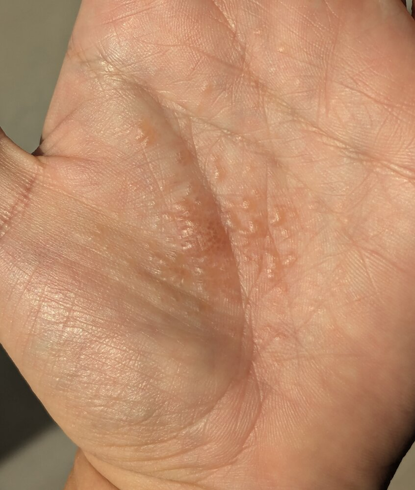

Dyshidrotic eczema

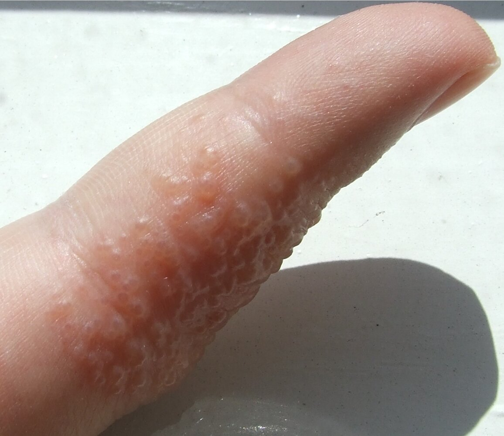

Dyshidrotic eczema

---

## Livedo reticularis

|  Types of <u>livedo reticularis</u> [[6]](https://coursology-qbank.com/amboss/article/sTYtHo) |  |  |
| --- | --- | --- |
|  |  Physiological <u>livedo</u> (<u>idiopathic</u> <u>livedo</u>) |  Pathological <u>livedo</u> (<u>livedo</u> racemosa) |
| Definition |  * A vascular syndrome that can be caused by either benign autonomic dysregulation of cutaneous <u>perfusion</u> or pathological obstruction of <u>blood vessels</u>   |  |
| <u>Epidemiology</u>/etiology |  * <u>Incidence</u> highest in young women   |   * Patients with vascular diseases (e.g., <u>cholesterol embolism</u>, <u>atherosclerosis</u>, <u>vasculitis</u>)  * Patients with <u>antiphospholipid syndrome</u>    |
| Pathophysiology |  * Autonomic dysregulation (functional disturbance) causing slowed cutaneous <u>perfusion</u> in response to external factors (i.e., cold)   |  * Localized obstructions slow the blood flow (organic disturbance)   |
| Clinical features |   * Symmetrical <u>livedo reticularis</u> (regular, small, round) of the extremities and sometimes the trunk  * Triggered by cold, regresses after application of warmth    |   * Irregular <u>livedo reticularis</u> of the extremities and sometimes trunk  * Persists after warming the <u>skin</u>    |
| Treatment |  * Warmth, sauna, alternating cold and warm baths   |  * Treat the underlying disease   |
| Prognosis |  * Improves with age   |  * Depends on the underlying disease (usually more difficult to treat)   |

> [!TIP]
> <u>Livedo reticularis</u> that does not regress after application of warmth is indicative of an underlying vascular disease and requires treatment.

---

## Albinism

* Definition: : congenital disorders of <u>melanin synthesis</u> resulting in <u>hypopigmentation</u>

* Partial albinism: a genetic condition characterized by the partial absence of <u>melanin</u> pigment from <u>melanosomes</u> in the body due to defects in the biosynthesis of <u>melanin</u>

* Total albinism: a genetic condition characterized by the total absence of <u>melanin</u> pigment from <u>melanosomes</u> in the body due to defects in the biosynthesis of <u>melanin</u>

* <u>Epidemiology</u>

* Affects all races and both sexes

* Most types of <u>albinism</u> are congenital and noticed early in life (e.g., <u>newborns</u>).

* Classification

* Ocular albinism (OA): Only the visual system (e.g., <u>iris</u>, <u>retina</u>) is affected, but not the <u>skin</u> or <u>hair</u>.

* Oculocutaneous albinism (<u>OCA</u>) 

* Absence of <u>melanin</u> in the <u>skin</u>, <u>hair</u>, and <u>iris</u>

* May be associated with <u>Chédiak-Higashi syndrome</u>

* Pathophysiology: dysfunctional <u>tyrosinase</u> activity or impaired transport of <u>tyrosine</u> and/or <u>melanin</u> → decreased or absent <u>melanin</u> production (<u>melanocyte</u> levels are normal)

* Clinical features

* Eyes

* Translucent, <u>hypopigmented</u> blue, gray, or green <u>irises</u>

* <u>Photophobia</u>, decreased <u>visual acuity</u>

* <u>Strabismus</u>, <u>nystagmus</u>, <u>amblyopia</u>

* Abnormalities of the <u>optic nerve</u> (e.g., <u>hypoplasia</u>, abnormal crossing of optic fibers at the <u>optic chiasm</u>)

* <u>Skin</u> and <u>hair</u>: milky white color, <u>photosensitivity</u>, <u>sunburns</u>

* Associated with increased risk of <u>skin</u> cancer

* Treatment: only supportive treatment, no curative treatment available

* Treatment of <u>strabismus</u>: <u>eye</u>-patching , <u>eye</u> <u>surgery</u>

* Avoidance of direct exposure to <u>UV light</u> and regular screening for <u>skin</u> cancer

* Wearing (prescription) sunglasses

* <u>Nitisinone</u> : used for the treatment of hereditary <u>tyrosinemia type 1</u>

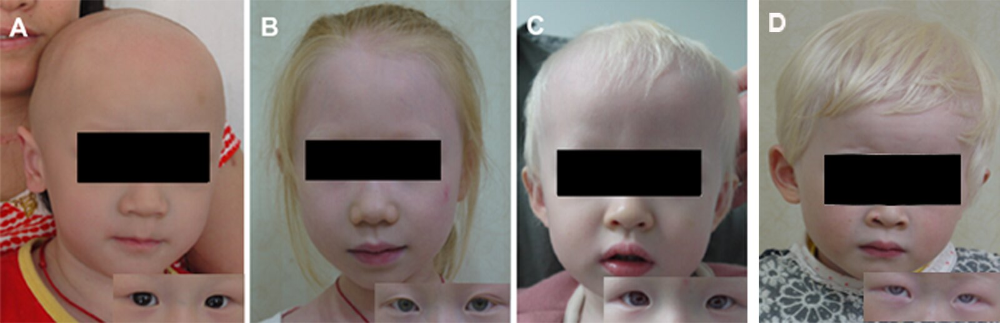

Oculocutaneous albinism

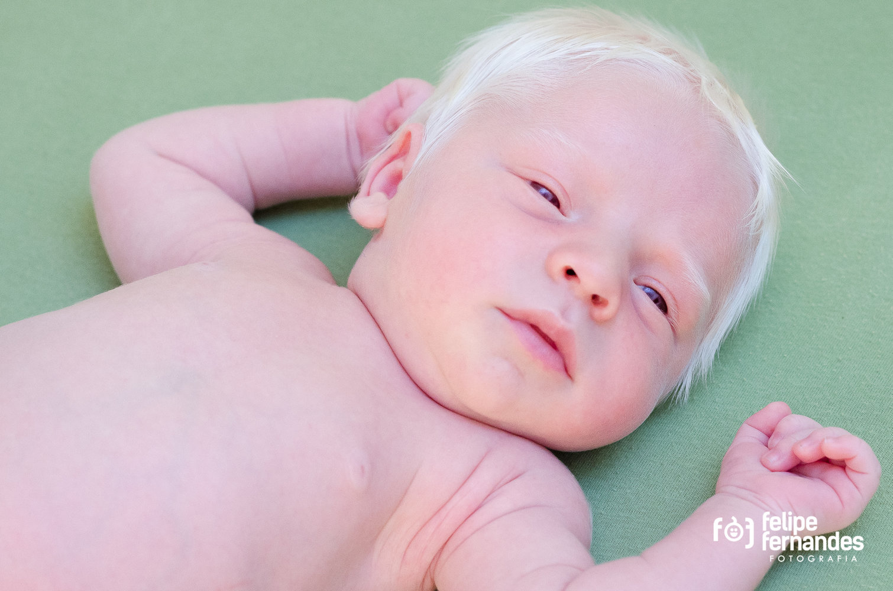

Newborn with albinism

---

## Waardenburg syndrome

* Definition: a congenital pigmentation disorder due to abnormal migration of <u>melanocytes</u> during <u>embryogenesis</u>

* Etiology: an <u>autosomal dominant</u> inherited disorder

* Clinical features  

* Patchy depigmentation of the <u>hair</u> and <u>skin</u> (e.g., <u>poliosis</u>)

* Pale blue eyes or <u>heterochromia iridum</u>

* Broad nasal root

* <u>Congenital hearing loss</u>

* <u>Cleft lip and cleft palate</u>

* <u>Neural tube defects</u>

* Associated with <u>Hirschsprung disease</u>

* Treatment: only supportive treatment, no curative treatment available

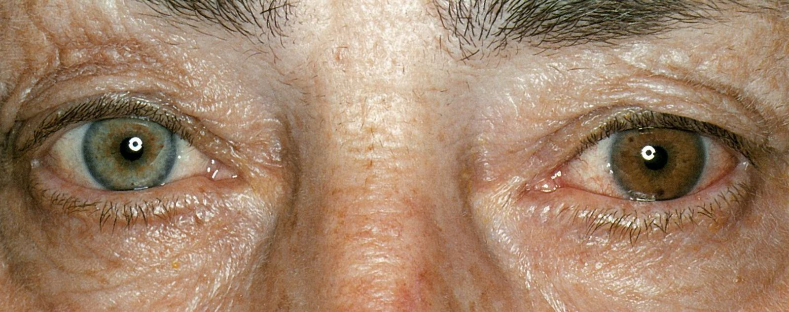

Heterochromia iridum

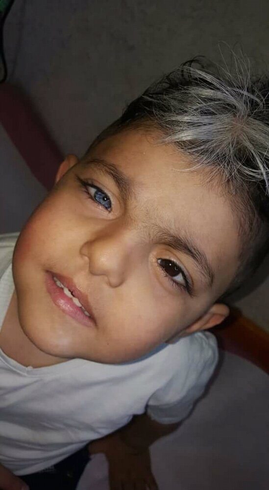

Waardenburg syndrome

---

## Angiosarcoma

* Definition: a rare, very aggressive vascular <u>malignancy</u>, arising from <u>endothelial</u> cells of blood or lymphatic vessels [[7]](https://coursology-qbank.com/amboss/article/Ldbwqs)

* <u>Epidemiology</u>: peak <u>incidence</u> age > 70 years [[7]](https://coursology-qbank.com/amboss/article/Ldbwqs)

* Etiology [[7]](https://coursology-qbank.com/amboss/article/Ldbwqs)

* Radiation (e.g., <u>radiation therapy</u>)

* Chronic <u>lymphedema</u>: especially in postmastectomy <u>lymph node</u> resection

* Chemicals: <u>Vinyl chloride</u> and <u>arsenic</u> are implicated in <u>hepatic angiosarcoma</u>.

* Clinical features [[8]](https://coursology-qbank.com/amboss/article/odb0Is)[[9]](https://coursology-qbank.com/amboss/article/KdbUIs)

* Location

* More common in sun-exposed areas

* Usually occur on the head, neck, and <u>breast</u>

* May involve the internal organs (e.g., <u>hepatic angiosarcoma</u>)

* Lesion

* Blue/purple-colored with a <u>bruise</u>-like appearance

* Later stage: hemorrhage or <u>ulceration</u>

* High variability in appearance

* Treatment [[9]](https://coursology-qbank.com/amboss/article/KdbUIs)

* Complete resection with wide margins

* Resection may be complicated by the aggressive course of the disease and delayed diagnosis.

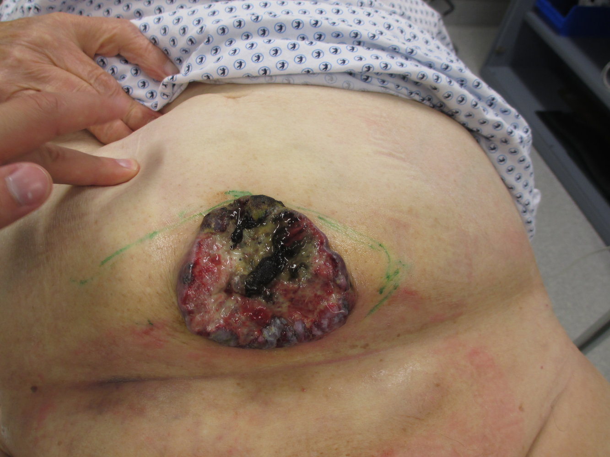

Epithelioid angiosarcoma in the abdominal region

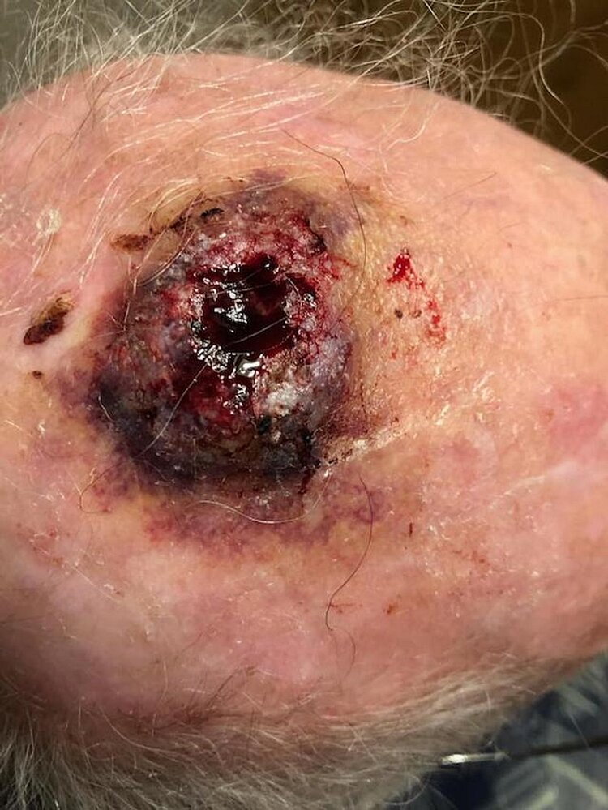

Cutaneous angiosarcoma

---

## Tattoo-associated skin reactions

* Definition: <u>skin</u> reactions associated with the needle trauma caused by tattooing or the inks involved

* Types

* Infection transmitted by needle or acquired after tattooing through damaged <u>skin</u> (e.g., <u>impetigo</u>, <u>erysipelas</u>)

* <u>Eczematous</u> <u>hypersensitivity reactions</u> to tattoo ink (e.g., <u>allergic contact dermatitis</u>, <u>photoallergic dermatitis</u>)

* New <u>skin</u> disease (e.g., <u>psoriasis</u>, <u>eczema</u>, <u>vitiligo</u>)

* <u>MRI burn</u> due to tattoo ink containing metals (e.g., <u>mercury</u>, <u>iron</u>)

* <u>Skin</u> cancer due to <u>carcinogenic</u> substances in tattooing ink

* Clinical features, diagnosis, and treatment: according to diagnosis and symptoms (e.g., <u>antibiotic</u> treatment of <u>erysipelas</u>)

---

## Hyperhidrosis

* Definition: a condition of localized or generalized <u>excessive sweating</u>

* <u>Epidemiology</u>: estimated to affect ∼ 5% in the US [[10]](https://coursology-qbank.com/amboss/article/5KciSW0)

* Etiology

* Primary focal <u>hyperhidrosis</u>

* Secondary <u>hyperhidrosis</u> (e.g., due to <u>hyperthyroidism</u>, <u>malignancy</u>, <u>obesity</u>, or adverse effects of medication)

* Clinical features: <u>excessive sweating</u> that interferes with <u>activities of daily living</u>, frequent <u>skin infections</u> (e.g., <u>tinea pedis</u>)

* Primary focal <u>hyperhidrosis</u>

* Usually localized (e.g., underarms, forehead)

* Both sides of the body are affected.

* No sweating during <u>sleep</u>; sweating begins immediately after waking up.

* Secondary <u>hyperhidrosis</u>: generalized, may occur during <u>sleep</u>

* Diagnostics: <u>clinical diagnosis</u>

* Treatment

* Antiperspirants (over-the-counter or prescription)

* <u>Iontophoresis</u>

* <u>Anticholinergics</u>

* <u>Botulinum toxin</u> injections

* <u>Surgery</u> (surgical removal of <u>sweat glands</u> or sympathectomy)

---

## Cutaneous granulomas

<u>Cutaneous granulomas</u> are a group of conditions characterized by a chronic inflammatory <u>skin</u> response to a variety of stimuli, including metabolites, foreign bodies, and infection.  They are classified as infectious or noninfectious. Diagnosis is primarily clinical For more information on the etiology, pathophysiology, and pathology of these conditions, see “<u>Granulomatous inflammation</u>.” [[15]](https://coursology-qbank.com/amboss/article/hpac6l)

### Noninfectious <u>cutaneous granulomas</u>

Noninfectious <u>cutaneous granulomas</u> are often manifestations of systemic diseases, including <u>diabetes</u>, <u>rheumatoid arthritis</u>, and <u>sarcoidosis</u>.

#### Granuloma annulare

* Definition: a benign, palpable, ring-shaped <u>nodule</u> of unclear etiology that most commonly manifests on the extremities (especially the <u>dorsal</u> hands and feet)

* <u>Epidemiology</u> [[16]](https://coursology-qbank.com/amboss/article/Ue1byf0)

* <u>♀</u> > <u>♂</u> (3:1)

* Peak <u>incidence</u>: 55–60 years of age

* Classification [[17]](https://coursology-qbank.com/amboss/article/J21siT0)

* Localized

* Generalized (sparing the head, neck, palms, and soles)

* Clinical features

* Varies from <u>skin</u>-colored to violaceous

* Lesions may appear <u>hypopigmented</u> or <u>hyperpigmented</u> in darker <u>skin</u> tones.

* <u>Pruritus</u> (associated with generalized <u>granuloma annulare</u>)

* Differential diagnosis: See “<u>Overview of annular skin lesions</u>” for details.

* Treatment

* Localized disease typically resolves without treatment; treatment is recommended according to patient preferences for cosmetic reasons, in persistent <u>pruritus</u>, or if prognosis is uncertain.

* Generalized <u>granuloma annulare</u> is more likely than localized lesions to require systemic therapy.

* First-line: <u>topical corticosteroids</u> (e.g., <u>clobetasol propionate</u>)

* Alternatives: intralesional <u>corticosteroid</u> injection (e.g., <u>triamcinolone</u> acetonide), <u>calcineurin inhibitors</u> (e.g., <u>tacrolimus</u> ointment), systemic <u>steroid</u>-sparing therapy (e.g., <u>hydroxychloroquine</u>, <u>isotretinoin</u>)

* Prognosis [[18]](https://coursology-qbank.com/amboss/article/2e1Tyf0)

* Localized: <u>self-limiting</u>

* Generalized: chronic or relapsing

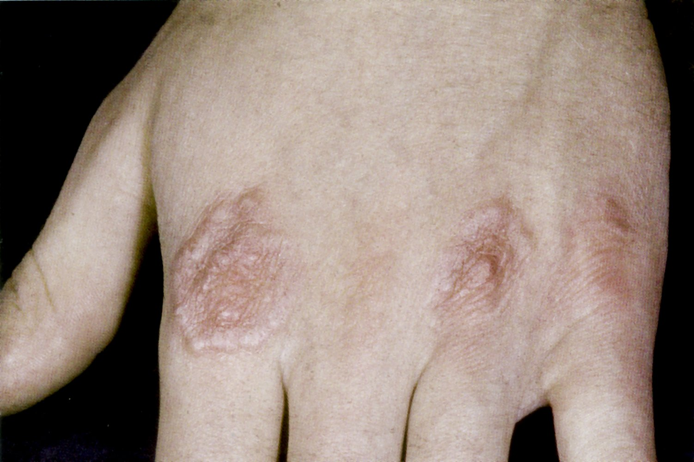

Granuloma annulare

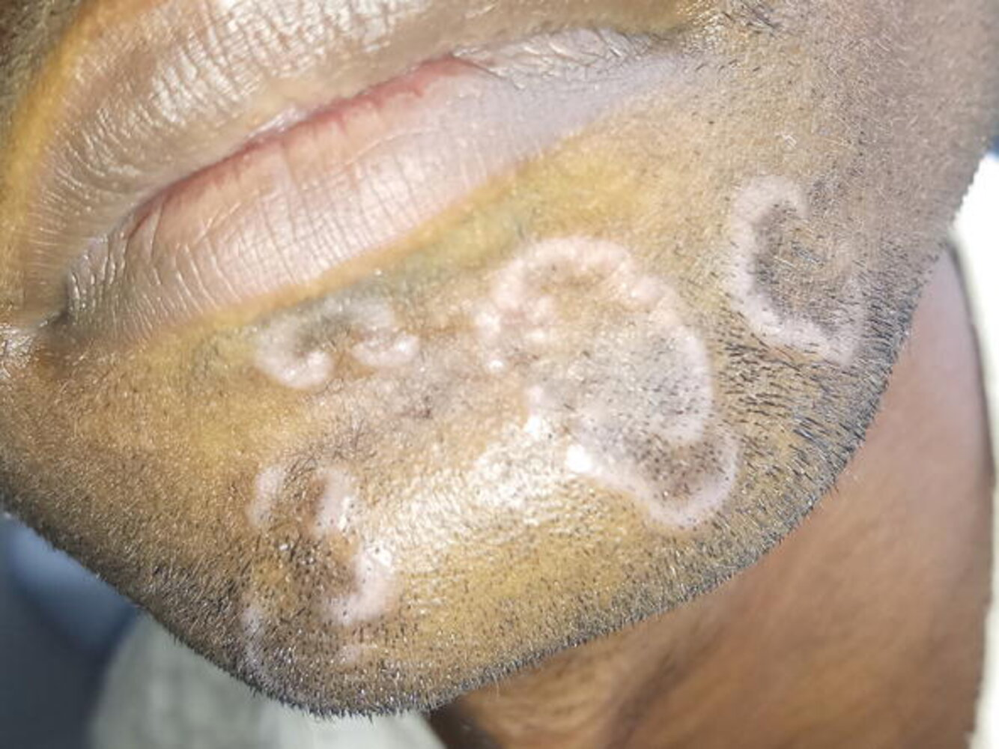

Localized granuloma annulare

#### Necrobiosis lipoidica [[19]](https://coursology-qbank.com/amboss/article/w7bhLE)

* Definition: a rare, <u>chronic granulomatous disease</u> of the <u>skin</u> associated with <u>diabetes mellitus</u>

* <u>Epidemiology</u> [[20]](https://coursology-qbank.com/amboss/article/E218jT0)

* Approx. 60% of patients with <u>necrobiosis lipoidica</u> have <u>diabetes mellitus</u>.

* <u>♀</u> > <u>♂</u>

* Clinical features 

* Usually asymptomatic

* Common sites: pretibial region

* Initially, a reddish-brown <u>papule</u> that progresses to a yellow-brown <u>papule</u> or <u>plaque</u> with visible <u>telangiectasias</u>

* <u>Ulceration</u> of the lesion may also occur following minor trauma

* <u>Histopathology</u>: necrobiotic palisading <u>granuloma</u>

* Lymphohistiocytic infiltration with <u>plasma cells</u>, <u>foam cells</u>, and <u>giant cells</u>

* Wall thickening and occlusion of <u>small blood vessels</u>

* Destruction of <u>collagen fibers</u> in the entire corium

* Treatment: <u>Corticosteroids</u> may be effective (e.g., intralesional <u>corticosteroid</u> injections)

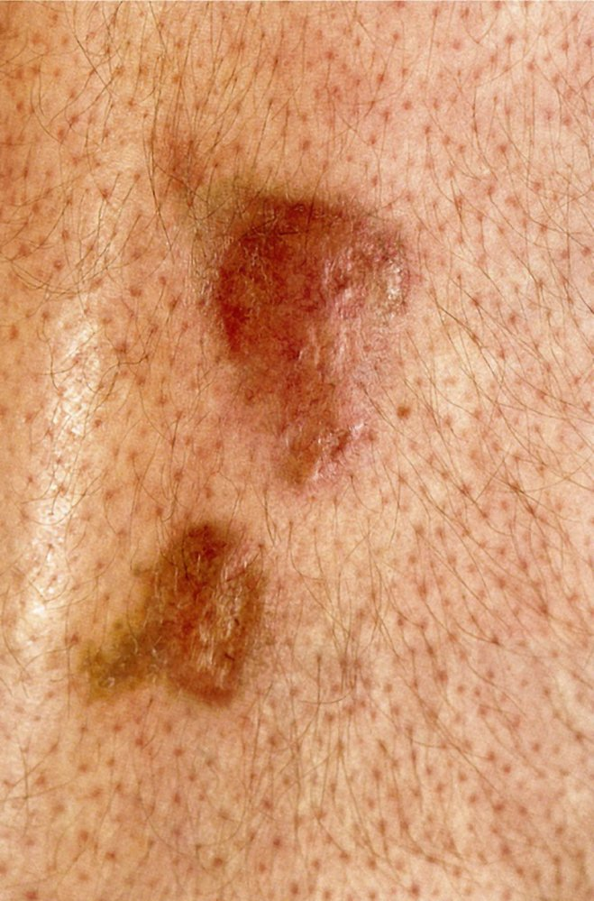

Necrobiosis lipoidica

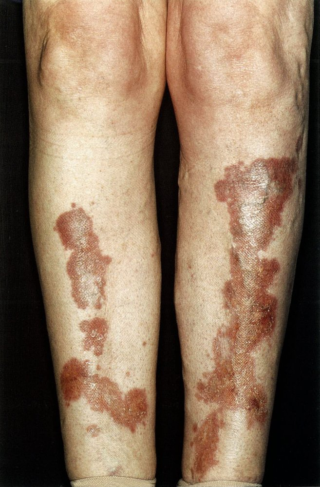

Necrobiosis lipoidica

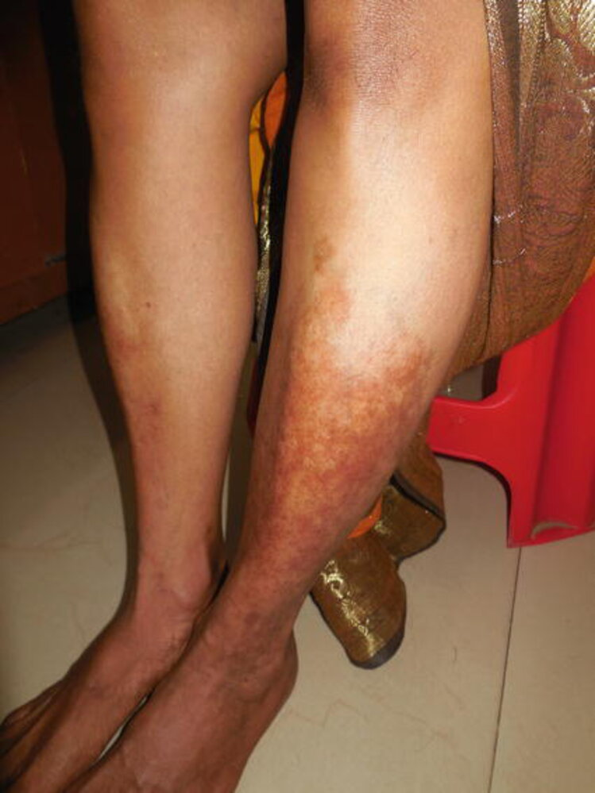

Necrobiosis lipoidica

#### <u>Rheumatoid nodules</u>

* Definition: inflammatory cutaneous or subcutaneous lesions found primarily at pressure points (e.g., extensor side of the forearm, bony prominences)

* <u>Epidemiology</u> [[20]](https://coursology-qbank.com/amboss/article/E218jT0)

* Most common extraarticular manifestation of <u>rheumatoid arthritis</u> (<u>RA</u>)

* Associated with seropositive <u>rheumatoid arthritis</u> and more severe <u>joint</u> involvement than in individuals with no <u>nodules</u> [[21]](https://coursology-qbank.com/amboss/article/L5awkO)

* Clinical features: nontender, firm, subcutaneous <u>nodules</u>

* <u>Histopathology</u>: central <u>necrosis</u> with surrounding palisading <u>histiocytes</u> and granulomatous tissue [[20]](https://coursology-qbank.com/amboss/article/E218jT0)

* Treatment: intralesional <u>corticosteroid</u> injection or excision only required if the <u>nodule</u> causes <u>pain</u> or impairs movement

* For more information, see “<u>Rheumatoid arthritis</u>.”

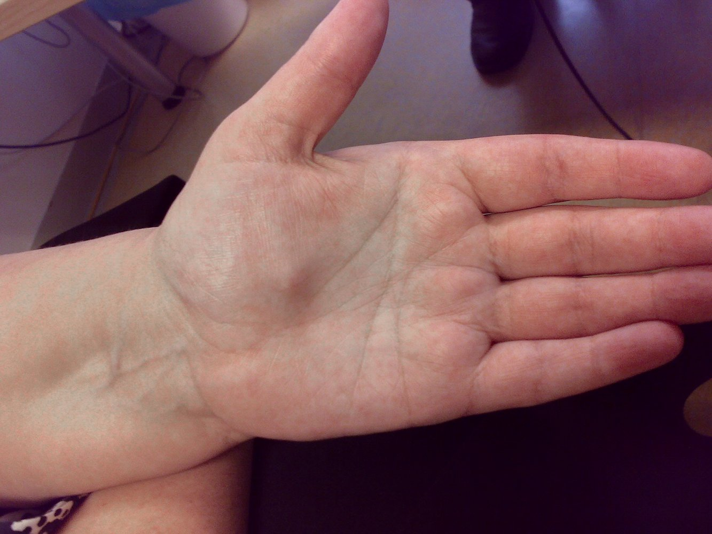

Rheumatoid cutaneous nodules

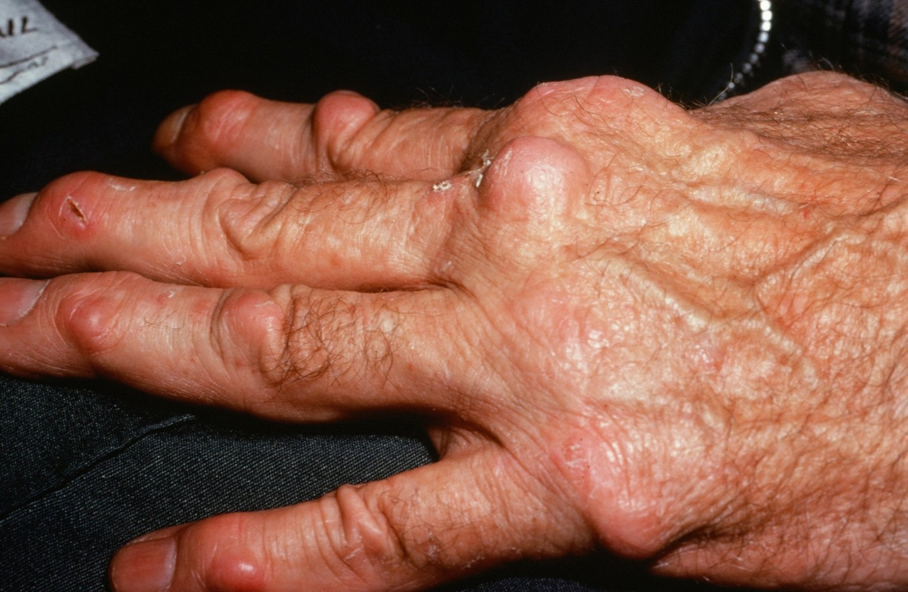

Rheumatoid nodules

#### Lupus pernio

* Definition: a <u>pathognomonic</u> manifestation of <u>cutaneous sarcoidosis</u> appearing as violaceous <u>plaques</u> on areas commonly exposed to cold (e.g., nose, cheeks, <u>ears</u>)

* Associations [[15]](https://coursology-qbank.com/amboss/article/hpac6l)

* <u>Sarcoidosis</u> of the <u>lungs</u> (approx. 75%)

* <u>Sarcoidosis</u> of the <u>upper respiratory tract</u> (approx. 50%)

* Clinical features

* Extensive, indurated <u>plaques</u> that tend to <u>scar</u>

* Distribution similar to the <u>butterfly rash</u> seen in <u>systemic lupus erythematosus</u>

* Treatment [[22]](https://coursology-qbank.com/amboss/article/aU1QbT0)

* First-line: intralesional <u>corticosteroid</u> injection (e.g., <u>triamcinolone</u> acetonide)

* Second-line: systemic glucocorticosteroids (e.g., <u>prednisolone</u>), <u>steroid</u>-sparing therapy (e.g., <u>antimalarials</u>, <u>methotrexate</u>, <u>tetracycline</u>)

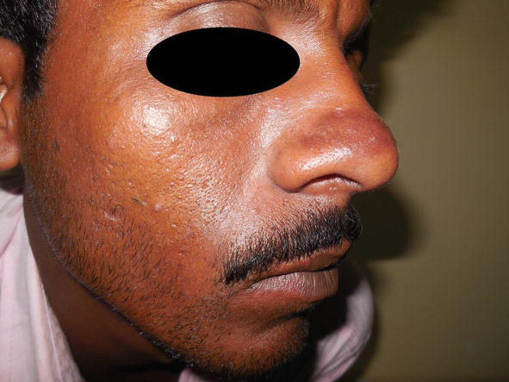

Lupus pernio

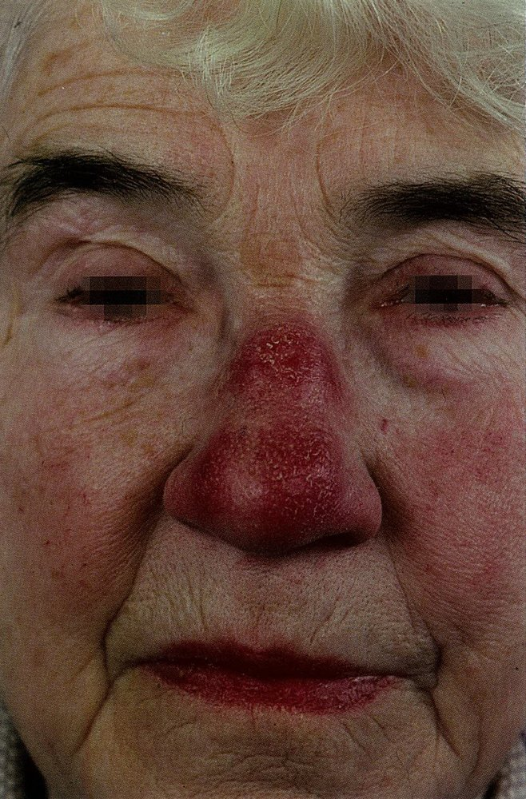

Lupus pernio

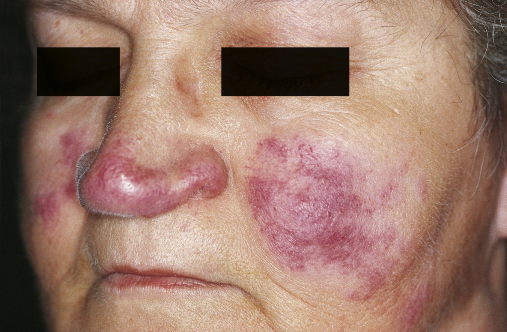

Lupus pernio

#### Foreign body granulomas

* Definition: <u>noncaseating granulomatous inflammation</u> of the cutaneous or subcutaneous tissues in response to the introduction of foreign materials

* Classification [[23]](https://coursology-qbank.com/amboss/article/Nd1-Jf0)

* <u>Endogenous</u>: due to <u>endogenous</u> material (e.g., <u>hair</u> fragments, <u>cholesterol</u> crystals, calcifications) identified by the <u>immune system</u> as foreign

* <u>Exogenous</u>: due to introduction of <u>exogenous</u> material (e.g., cosmetic fillers, sutures, fish spines)

* Stages

* Stage 1: formation of <u>papule</u>, <u>nodule</u>, or <u>erythematous</u> <u>plaque</u>

* Stage 2: <u>fibrosis</u> and <u>granuloma</u> formation

* Diagnostics: <u>ultrasound</u>, <u>biopsy</u> [[24]](https://coursology-qbank.com/amboss/article/v21AjT0)

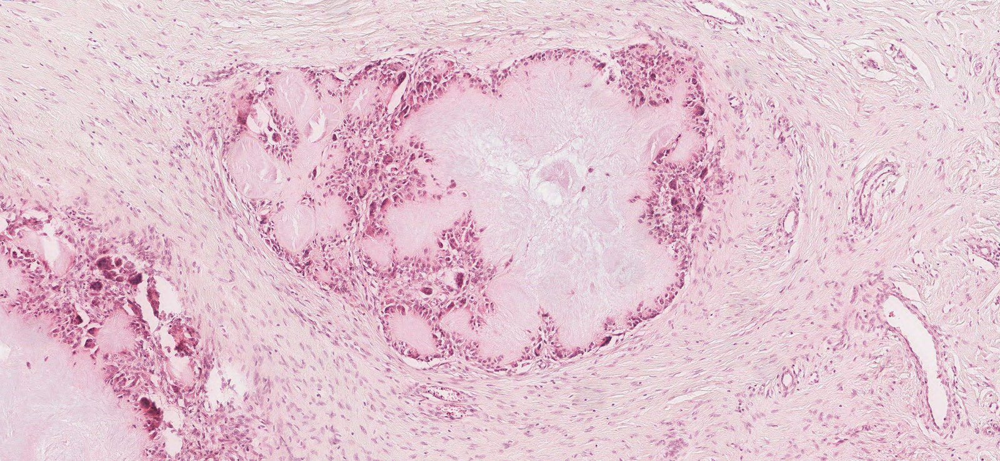

Gout tophus with foreign body granulomas

### Infectious <u>cutaneous granulomas</u>

* Definition: any <u>granuloma</u> caused by a <u>pathogen</u>

* Examples

* <u>Cutaneous tuberculosis</u>: <u>granulomatous inflammation</u> with <u>caseous necrosis</u> caused by <u>Mycobacterium tuberculosis</u>

* <u>Tuberculoid leprosy</u>: <u>hyperesthetic</u>, hairless, <u>skin</u> lesions caused by <u>Mycobacterium leprae</u>

* <u>Cutaneous leishmaniasis</u>: the most common form of <u>leishmaniasis</u>, characterized by reddish <u>macules</u> and <u>papules</u> that may progress to <u>ulcers</u>

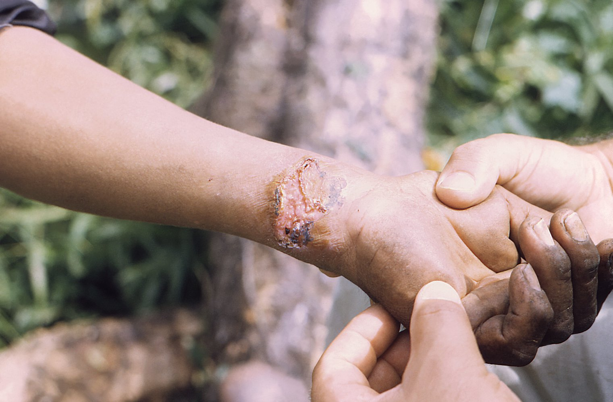

Cutaneous leishmaniasis

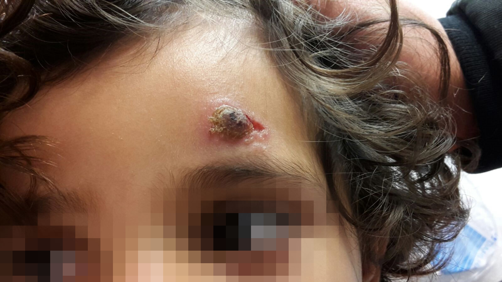

Cutaneous leishmaniasis

---