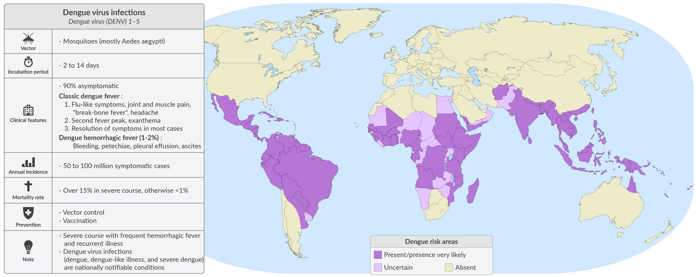
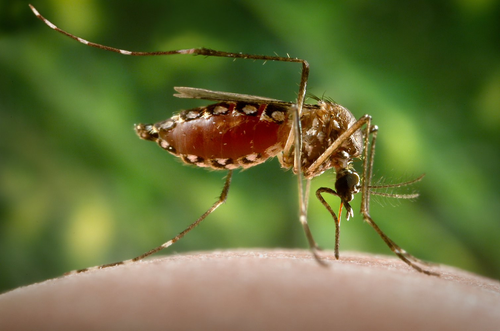

# Dengue

*Categories: Clinical knowledge > Internal medicine > Infectious diseases > Zoonoses and vector-borne diseases > Dengue*

[Original Article Link](https://coursology-qbank.com/amboss/article/350SPg)

---

## Summary

Dengue is a viral disease transmitted by mosquitoes (especially <u>Aedes aegypti</u>), most commonly in tropical regions. Most individuals with dengue are asymptomatic or have mild symptoms of <u>fever</u>, <u>headache</u>, and <u>rash</u>. Severe illness is rare; manifestations include <u>pleural effusions</u>, <u>ascites</u>, and hemorrhage. The typical course consists of the <u>febrile</u> phase, the critical phase, and the recovery phase; most affected individuals improve during the critical phase, but some develop <u>severe dengue</u>. Patients are risk-<u>stratified</u>, with hospitalization indicated for patients who have or are at risk of <u>severe dengue</u>. Treatment is supportive. <u>Insect bite prevention</u> methods are indicated to prevent further spread of disease and are recommended for all individuals who live in and/or travel to <u>endemic</u> areas.

---

## Epidemiology

* Distribution

* Tropical regions worldwide, particularly Asia (e.g., Thailand) and the Americas

* In the US, dengue is:

* <u>Endemic</u> in some territories (e.g., Puerto Rico, American Samoa, the US Virgin Islands) [[1]](https://coursology-qbank.com/amboss/article/odW0I40)

* Occasionally locally transmitted in Florida, California, Texas, Hawaii, and Arizona [[2]](https://coursology-qbank.com/amboss/article/avdQA70)

* <u>Incidence</u>

* Most common viral disease affecting tourists in tropical regions

* ∼ 400 million infections per year worldwide

* <u>Severe dengue</u> occurs in ∼ 2% of cases. [[3]](https://coursology-qbank.com/amboss/article/xxdEAH0)

Geographic distribution of dengue virus infections

Travel Medicine: Diseases with Regional Patterns

References:[[4]](https://coursology-qbank.com/amboss/article/x2aEPP)

Epidemiological data refers to the US, unless otherwise specified.

---

## Etiology

* Pathogenic

* <u>Dengue virus</u> (<u>Serotype</u>: <u>DENV</u> 1–4)

* <u>RNA virus</u> of the genus <u>Flavivirus</u>

* Transmission route  ;  [[5]](https://coursology-qbank.com/amboss/article/gzYFH7)
* <u>Vector</u>-borne; : mosquitoes most commonly from the species <u>Aedes aegypti</u>

* <u>Incubation period</u>: 4–10 days [[6]](https://coursology-qbank.com/amboss/article/QtduW70)[[7]](https://coursology-qbank.com/amboss/article/sGdt070)

> [!TIP]
> A fifth dengue subtype (<u>DENV</u> 5), similar to varieties that normally infect wildlife, was recorded in Malaysia in 2013. Further research is needed to confirm this finding. [[8]](https://coursology-qbank.com/amboss/article/VBdG-H0)

Mosquito (Aedes aegypti)

References: [[9]](https://coursology-qbank.com/amboss/article/By0zhi)

---

## Clinical features

Most infected individuals are asymptomatic or have mild symptoms. [[7]](https://coursology-qbank.com/amboss/article/sGdt070)

### Febrile phase of dengue [[6]](https://coursology-qbank.com/amboss/article/QtduW70)[[10]](https://coursology-qbank.com/amboss/article/ktdmd70)

* Typically lasts 2–7 days

* <u>Fever</u>  (may be a <u>biphasic fever</u>)

* Severe <u>headache</u>

* Retro-orbital <u>pain</u>

* <u>Rash</u>  [[11]](https://coursology-qbank.com/amboss/article/KDdU2H0)

* Initial flushing over the face, neck, and chest within 48 hours

* Second generalized <u>morbilliform</u> <u>rash</u> may appear on days 3–5.

* Severe <u>arthralgia</u> and <u>myalgia</u> (hence the colloquial term  “breakbone <u>fever</u>”)

* <u>Anorexia</u> and <u>nausea</u> [[10]](https://coursology-qbank.com/amboss/article/ktdmd70)

* Positive <u>tourniquet test</u>

* <u>Dengue with warning signs</u> may develop in the late <u>febrile</u> phase and suggests progression to <u>severe dengue</u>.

> [!TIP]
> Consider dengue if symptoms develop within 2 weeks of returning from a dengue-<u>endemic</u> region. [[2]](https://coursology-qbank.com/amboss/article/avdQA70)

### Critical phase of dengue [[6]](https://coursology-qbank.com/amboss/article/QtduW70)[[7]](https://coursology-qbank.com/amboss/article/sGdt070)[[10]](https://coursology-qbank.com/amboss/article/ktdmd70)

* Occurs after <u>defervescence</u>

* Typically lasts 24–48 hours

* Increased <u>hematocrit</u> and <u>capillary</u> permeability can lead to plasma leakage, manifesting as: [[7]](https://coursology-qbank.com/amboss/article/sGdt070)

* <u>Pleural effusion</u>

* <u>Ascites</u>

* <u>Signs of shock</u>

* Most improve during this phase; some develop <u>severe dengue</u>.

> [!WARNING]
> <u>Severe dengue</u> can occur in the absence of warning signs. [[7]](https://coursology-qbank.com/amboss/article/sGdt070)

### Recovery phase of dengue [[6]](https://coursology-qbank.com/amboss/article/QtduW70)[[10]](https://coursology-qbank.com/amboss/article/ktdmd70)

* Typically lasts 48–72 hours

* General clinical improvement

* Resorption of extravasated fluids leads to hemodynamic stability and diuresis.

---

## Classification

### Probable dengue [[7]](https://coursology-qbank.com/amboss/article/sGdt070)

<u>Fever</u> with ≥ 2 of the following features, in an individual who lives in or has traveled to an <u>endemic</u> area:

* <u>Nausea</u> or <u>vomiting</u>

* <u>Rash</u>

* Aches

* Positive <u>tourniquet test</u>

* <u>Leukopenia</u>

* <u>Warning signs for dengue</u>

### Dengue with warning signs [[7]](https://coursology-qbank.com/amboss/article/sGdt070)

* <u>Probable dengue</u> or laboratory confirmed dengue with:

* Abdominal <u>pain</u>

* Persistent <u>vomiting</u>

* Hemorrhagic manifestations: <u>petechiae</u>, <u>epistaxis</u>, gingival bleeding

* Extravascular fluid accumulation (e.g., <u>pleural effusion</u> and/or <u>ascites</u>)

* <u>Lethargy</u> and/or restlessness

* <u>Liver</u> enlargement > 2 cm below the <u>costal margin</u>

* Laboratory results indicating ↑ <u>hematocrit</u>;  measured on ≥ 2 consecutive blood tests with ↓ <u>platelets</u> [[7]](https://coursology-qbank.com/amboss/article/sGdt070)[[12]](https://coursology-qbank.com/amboss/article/DGd1Y70)

* Features typically manifest in the late <u>febrile phase of dengue</u> and suggest progression to <u>severe dengue</u>. [[6]](https://coursology-qbank.com/amboss/article/QtduW70)[[7]](https://coursology-qbank.com/amboss/article/sGdt070)[[12]](https://coursology-qbank.com/amboss/article/DGd1Y70)

### Severe dengue (formerly <u>dengue hemorrhagic fever</u>) [[6]](https://coursology-qbank.com/amboss/article/QtduW70)[[7]](https://coursology-qbank.com/amboss/article/sGdt070)

* Greatly increased vascular permeability

* Severe <u>pleural effusion</u> causing <u>respiratory distress</u>

* Pronounced <u>ascites</u> causing abdominal <u>pain</u>

* Severely ↑ or ↓ <u>Hct</u>

* Severe hemorrhagic symptoms due to <u>thrombocytopenia</u>

* <u>Melena</u>

* <u>Hematemesis</u>

* <u>Purpura</u>

* <u>Ecchymoses</u>

* Significant organ involvement

* Changes in mental status (e.g., confusion)

* <u>Liver</u> failure with <u>AST</u> or <u>ALT</u> ≥ 1000 IU/L [[13]](https://coursology-qbank.com/amboss/article/4td3d70)

* <u>Cardiomyopathy</u>

* Dengue shock syndrome: <u>hypovolemic shock</u> in the presence of other symptoms of <u>severe dengue</u>

> [!TIP]
> Second infection with a different dengue <u>serotype</u> (especially <u>serotype</u> 2) is a <u>risk factor</u> for <u>severe dengue</u>, as it may cause an <u>antibody</u>-dependent reaction. [[6]](https://coursology-qbank.com/amboss/article/QtduW70)[[7]](https://coursology-qbank.com/amboss/article/sGdt070)

### Expanded dengue syndrome [[14]](https://coursology-qbank.com/amboss/article/IBdYXs0)

* Uncommon atypical presentation

* Isolated severe organ involvement (e.g., <u>liver</u>, <u>kidney</u>, <u>heart</u>, eyes, or <u>brain</u>)

* Can occur in the absence of plasma leakage

* May result from prolonged <u>shock</u>

---

## Diagnosis

Diagnostics occur alongside initial <u>management of dengue</u>. [[15]](https://coursology-qbank.com/amboss/article/Xvd9A70)

### Approach [[15]](https://coursology-qbank.com/amboss/article/Xvd9A70)[[16]](https://coursology-qbank.com/amboss/article/Bedza60)[[17]](https://coursology-qbank.com/amboss/article/itdJW70)

* Choose diagnostic tests according to number of days since symptom onset.

* ≤ 7 days: <u>IgM antibodies</u> plus <u>NAAT</u> or <u>NS1 antigen test</u>

* > 7 days: <u>IgM</u> <u>ELISA</u>  [[17]](https://coursology-qbank.com/amboss/article/itdJW70)

* Order diagnostics for <u>Zika infection</u> if the patient was in an area where both dengue and <u>Zika</u> are present.  [[15]](https://coursology-qbank.com/amboss/article/Xvd9A70)

* Obtain additional studies to assess for hematological and organ dysfunction.

* Further studies may be necessary depending on symptoms, e.g.:

* <u>Diagnostics for shock</u>

* <u>Chest x-ray</u> for suspected <u>pleural effusion</u>

* Abdominal <u>ultrasound</u> for <u>ascites</u>

* <u>Type and screen</u> in <u>dengue shock syndrome</u>

> [!WARNING]
> Interpret results with caution in patients with previous exposure to dengue or other <u>flaviviruses</u> (including through <u>vaccination</u>) because of the risk of <u>false positives</u>. [[17]](https://coursology-qbank.com/amboss/article/itdJW70)

> [!TIP]
> Dengue is a nationally <u>notifiable disease</u> in the US; report all suspected cases to the health department. [[2]](https://coursology-qbank.com/amboss/article/avdQA70)

### Confirmatory studies

#### ≤ 7 days after symptom onset [[15]](https://coursology-qbank.com/amboss/article/Xvd9A70)[[16]](https://coursology-qbank.com/amboss/article/Bedza60)[[17]](https://coursology-qbank.com/amboss/article/itdJW70)

* <u>IgM antibodies</u> ;  [[15]](https://coursology-qbank.com/amboss/article/Xvd9A70)[[16]](https://coursology-qbank.com/amboss/article/Bedza60)[[17]](https://coursology-qbank.com/amboss/article/itdJW70)

* Positive from approximately day 3 of illness; may remain positive for months [[15]](https://coursology-qbank.com/amboss/article/Xvd9A70)

* Typically combined with <u>NAAT</u> or an <u>NS1 antigen test</u>

* <u>False positives</u> may occur if patients have been previously exposed (via infection or <u>vaccination</u>) to:

* Other <u>serotypes</u> of dengue

* Other <u>flaviviruses</u> (e.g., <u>Zika</u>, <u>tickborne encephalitis</u>)

* If a <u>false positive</u> is suspected in a patient with previous <u>flavivirus</u> exposure, order a <u>plaque reduction neutralization test</u>. [[15]](https://coursology-qbank.com/amboss/article/Xvd9A70)

* <u>NAAT</u> [[17]](https://coursology-qbank.com/amboss/article/itdJW70)

* Perform if the patient presents within 7 days of infection.  [[17]](https://coursology-qbank.com/amboss/article/itdJW70)

* High <u>sensitivity</u> and <u>specificity</u>

* Can be used to determine <u>serotype</u>

* NS1 antigen test [[17]](https://coursology-qbank.com/amboss/article/itdJW70)

* <u>ELISA</u> detection of the <u>dengue NS1</u> <u>antigen</u> [[18]](https://coursology-qbank.com/amboss/article/rmXfSA)

* Levels wane ∼7 days after symptom onset.

* Cannot be used to determine <u>serotype</u>

#### > 7 days after symptom onset [[15]](https://coursology-qbank.com/amboss/article/Xvd9A70)[[17]](https://coursology-qbank.com/amboss/article/itdJW70)

* Preferred test: <u>ELISA</u> to detect <u>IgM antibodies</u>

* <u>NAAT</u> can be used to confirm but cannot rule out dengue infections.  [[17]](https://coursology-qbank.com/amboss/article/itdJW70)

#### Alternative tests

* If standard confirmatory studies are not available, use paired <u>IgM</u> and <u>IgG</u> <u>serology</u>, taken during the acute and convalescent phases.

* A 4-fold increase in <u>IgG</u> suggests infection.

* Previous exposure to dengue or other flavaviruses (including through <u>vaccination</u>) may cause <u>false-positive</u> results; interpret results with caution.

### Additional studies

The following laboratory findings support a diagnosis of dengue infection:

* <u>CBC</u> [[12]](https://coursology-qbank.com/amboss/article/DGd1Y70)

* <u>Leukopenia</u>

* Progressive increase in <u>hematocrit</u>

* <u>Thrombocytopenia</u>

* Complete metabolic panel: <u>renal failure</u> and/or <u>electrolyte</u> and <u>glucose</u> disturbances.  [[10]](https://coursology-qbank.com/amboss/article/ktdmd70)

* <u>Liver chemistries</u>: may be elevated, <u>AST</u> or <u>ALT</u> ≥ 1,000 IU/L is indicative of <u>severe dengue</u> [[7]](https://coursology-qbank.com/amboss/article/sGdt070)

* <u>PT</u> and/or <u>INR</u>: abnormal parameters

* <u>Blood gas</u>: <u>acid-base disorders</u>

---

## Management

For further information on management in pregnant individuals and children, see “Special patient groups.”

### Approach [[10]](https://coursology-qbank.com/amboss/article/ktdmd70)[[13]](https://coursology-qbank.com/amboss/article/4td3d70)

* Consult infectious diseases early.

* Start supportive therapy.

* Immediate stabilization for patients with <u>severe dengue</u> or <u>dengue with warning signs</u>

* <u>IV fluid resuscitation</u>

* <u>Blood transfusion</u> for <u>management of hemorrhagic shock</u>

* <u>Acetaminophen</u> for <u>pain</u> and <u>fever</u> (for dosages, see “<u>Oral analgesics</u>”)

* Oral hydration with <u>oral rehydration solution</u> (up to 3 L/day) for patients able to drink

* Assess for <u>admission criteria for patients with dengue</u>, and initiate inpatient or outpatient <u>management of dengue</u> accordingly.

* Prevent further spread of disease using <u>insect bite prevention</u> methods.

> [!WARNING]
> Avoid <u>NSAIDs</u>, including <u>aspirin</u>, as they may worsen hemorrhage and <u>gastritis</u>. [[10]](https://coursology-qbank.com/amboss/article/ktdmd70)[[16]](https://coursology-qbank.com/amboss/article/Bedza60)

> [!WARNING]
> <u>Steroids</u>, <u>immunoglobulins</u>, and antivirals are not indicated in the <u>treatment of dengue</u>. [[12]](https://coursology-qbank.com/amboss/article/DGd1Y70)[[16]](https://coursology-qbank.com/amboss/article/Bedza60)

### Immediate stabilization for patients with dengue

* Aims to prevent deterioration in patients with <u>severe dengue</u> or <u>dengue with warning signs</u>

* A higher <u>level of care</u> is frequently required; consult intensive care early.

* Monitor fluid intake and urinary output, and repeat <u>CBC</u> at regular intervals.  [[13]](https://coursology-qbank.com/amboss/article/4td3d70)

#### <u>IV fluid therapy</u> [[13]](https://coursology-qbank.com/amboss/article/4td3d70)

* Initial resuscitation with IV <u>crystalloids</u>.

* <u>Dengue shock syndrome</u>: 20 mL/kg over 15–30 minutes

* <u>Severe dengue</u> or <u>dengue with warning signs</u>: 10 mL/kg over 1 hour

* Reassess 

* Re-examine and repeat <u>CBC</u>.

* Any of the following findings: Repeat the initial fluid bolus up to 2 more times.

* Urine output has increased by < 1 mL/kg/hr

* Clinical status has not improved

* <u>Hematocrit</u> has increased

* Escalate: if no improvement

* Consider boluses of IV <u>colloids</u>.

* Refer to intensive care for <u>vasopressors</u>.

* See “<u>Management of shock</u>” for further details.

* Maintenance: for patients who have improved with <u>IV fluid resuscitation</u>

* <u>Dengue shock syndrome</u>

* Reduce the intensity of <u>fluid resuscitation</u> of <u>isotonic saline</u> to 10 mL/kg over 1–2 hours.

* Continuous improvement: Provide a stepwise decrease in <u>fluid resuscitation</u> therapy.

* <u>Severe dengue</u> or <u>dengue with warning signs</u>: Provide a stepwise decrease in <u>fluid resuscitation</u> therapy.

> [!WARNING]
> Consider a reduced <u>fluid resuscitation</u> regimen for patients at higher risk of <u>fluid overload</u> (e.g., <u>heart failure</u>, older adults, pregnant individuals). [[13]](https://coursology-qbank.com/amboss/article/4td3d70)

#### Management of hemorrhage [[13]](https://coursology-qbank.com/amboss/article/4td3d70)

* Asses for signs of concealed hemorrhage (e.g., rapid decrease in <u>hematocrit</u>).

* Administer <u>packed red blood cells</u> or whole blood.

* Packed red cells: 5–10 mL/kg

* Whole blood: 10–20 mL/kg

* Avoid administering <u>platelets</u> or <u>fresh frozen plasma</u> unless there is life-threatening bleeding.  [[12]](https://coursology-qbank.com/amboss/article/DGd1Y70)

### Admission criteria for patients with dengue [[12]](https://coursology-qbank.com/amboss/article/DGd1Y70)[[13]](https://coursology-qbank.com/amboss/article/4td3d70)

* <u>Dengue with warning signs</u>

* <u>Severe dengue</u>

* <u>Dyspnea</u>

* Unable to tolerate oral fluids

* <u>Acute renal failure</u>

* <u>Coagulopathy</u>

* <u>Pregnancy</u>

* Comorbid conditions (e.g., <u>peptic ulcer disease</u>, <u>CKD</u>, taking <u>anticoagulant</u> medications) [[13]](https://coursology-qbank.com/amboss/article/4td3d70)

* <u>BMI</u> ≥ 30 kg/m2 [[13]](https://coursology-qbank.com/amboss/article/4td3d70)

* <u>Barriers to follow-up</u>

* <u>Infant</u> or age > 65 years  [[7]](https://coursology-qbank.com/amboss/article/sGdt070)[[13]](https://coursology-qbank.com/amboss/article/4td3d70)

---

## Differential diagnoses

* <u>Chikungunya fever</u> and other <u>viral hemorrhagic fevers</u>

* <u>Malaria</u>

* <u>Zika virus infection</u>

* <u>Oropouche virus disease</u>

> [!TIP]
> Severe hemorrhagic manifestations with <u>shock</u> and <u>death</u> as well as decreased <u>neutrophil</u> and <u>platelet counts</u> are more indicative of dengue <u>fever</u> than <u>chikungunya fever</u>.

The differential diagnoses listed here are not exhaustive.

---

## Prevention

* Ensure <u>insect bite prevention</u> (e.g., mosquito repellent, bed nets). [[16]](https://coursology-qbank.com/amboss/article/Bedza60)

* Dengue vaccination (with live-attenuated tetravalent <u>vaccines</u>) is recommended as part of <u>routine vaccination</u> for children living in dengue-<u>endemic</u> areas.  [[19]](https://coursology-qbank.com/amboss/article/WBdP-H0)[[20]](https://coursology-qbank.com/amboss/article/cDdaWH0)[[21]](https://coursology-qbank.com/amboss/article/6tdje70)

---