# General parasitology

*Categories: Clinical knowledge > Internal medicine > Infectious diseases > Zoonoses and vector-borne diseases > General parasitology*

[Original Article Link](https://coursology-qbank.com/amboss/article/Qn0uGg)

---

## Summary

<u>Parasites</u> are <u>symbiotic</u> organisms that live on or in a larger organism (host) in order to feed, develop, and/or multiply, causing harm to the host in the process. <u>Parasitism</u> is distinguished from <u>commensalism</u>, in which the symbiont benefits from the relationship without harming or benefiting the host in return, and <u>mutualism</u>, in which the symbiont and the host equally benefit from the relationship. A <u>definitive host</u> is a host in whom a <u>parasite</u> reaches its adult form and/or undergoes a sexual phase of development; an <u>intermediate host</u> is a host in whom a <u>parasite</u> passes one or more phases of its asexual development. Intermediate hosts often function as <u>vectors</u> that carry the <u>parasite</u> from one host to the next, but <u>parasites</u> themselves can also function as <u>vectors</u> for <u>viruses</u>, bacteria, and other <u>parasites</u>. <u>Parasites</u> can be classified by size as microparasites (unicellular) or macroparasites (multicellular); by the class of organism as <u>protozoans</u>, <u>helminths</u>, and <u>arthropods</u>; by dependency on a host for survival as obligate (require a <u>definitive host</u> and may go through one or more intermediate hosts to complete their life cycle) or facultative (do not rely on a host to complete their life cycle but may adopt parasitic activity); and by their relation to the host as <u>endoparasites</u>, which “infect” the host and live inside their body (mostly <u>protozoa</u> and <u>helminths</u>), and <u>ectoparasites</u>, which “infest” the host and attach to, burrow into, or temporarily feed off a host's <u>integumentary system</u> (mostly <u>arthropod</u> macroparasites). <u>Arthropod</u> <u>infestations</u> are clinically significant in their own right, but play a far greater role in the transmission of other pathogens (e.g., <u>Plasmodium</u> by mosquitoes and <u>Borrelia</u> by ticks).

---

## Basics of parasitology

### Symbiosis

* Definition: a long-term interaction between dissimilar species living together in biological association

* Depending on the degree of dependence and the advantages or disadvantages derived from the relationship, <u>symbiosis</u> can be classified as:

* Parasitism

* A relationship between a symbiont (<u>parasite</u>) and its host, in which the <u>parasite</u> benefits from the relationship and the host is harmed, possibly even causing <u>death</u>

* Examples: <u>tapeworms</u>, head <u>lice</u>, <u>Plasmodium</u> spp.

* Commensalism

* A relationship between a symbiont (<u>commensal</u>) and its host, in which the <u>commensal</u> benefits from the relationship and the host derives neither benefit nor harm

* Some organisms can be <u>commensal</u> under certain conditions (e.g., as intestinal or <u>skin</u> <u>microbiota</u> in a healthy individual) but become pathogenic if these conditions change (e.g., host <u>immune deficiency</u>, <u>colonization</u> of other sites, changes in temperature or <u>humidity</u>).

* Example: E. Coli, which is part of the physiological intestinal flora, but can cause infections when it colonizes, for example, the <u>urinary tract</u>

* Mutualism

* A relationship between a symbiont and its host that benefits both parties

* Like <u>commensals</u>, <u>mutualism</u> can become pathogenic under certain conditions.

* Example: <u>symbiosis</u> between humans and intestinal <u>Enterobacter</u> agglomerans, in which the bacteria benefit from the <u>nutrient</u> supply and the human benefits from the menaquinones (<u>vitamin K</u>) that the bacteria produce

### Classification of <u>parasites</u> [[1]](https://coursology-qbank.com/amboss/article/bJXHs_)[[2]](https://coursology-qbank.com/amboss/article/uqXpZz)

<u>Parasites</u> can be categorized by location, dependence on host for survival, size, and type of organism.

* Location

* Ectoparasites: live and/or feed on the <u>integumentary system</u> of the host (e.g., ticks, mosquitoes)

* Endoparasites: live inside the host (e.g., <u>helminths</u>)

* Class of organism

* <u>Protozoan</u>

* <u>Helminth</u>

* <u>Arthropod</u>

* Host dependence

* Obligate parasites: cannot complete their life cycle without a host (e.g., <u>Plasmodium</u>, <u>Toxoplasma</u>)

* Facultative parasites: do not require a host to complete their life cycle and adopt parasitic behavior only if necessary or opportunity presents itself (e.g., <u>Naegleria fowleri</u>)

* Size

* Macroparasite: multicellular organisms

* Microparasite: unicellular organisms

### Life cycle [[1]](https://coursology-qbank.com/amboss/article/bJXHs_)

The life-cycle of <u>obligate parasites</u> can be divided into a parasitic stage, during which the organism lives in or feeds on the host, and a free-living stage, during which it lives outside the host and is not dependent on the host. Transmission generally occurs during the free-living stage.

* Microparasites (<u>protozoa</u>):
* The life cycles of microparasites vary greatly from species to species, but for most clinically relevant <u>protozoans</u> a simple division into two stages applies:

* <u>Trophozoite</u>

* Cyst

* <u>Helminths</u>

* <u>Ovum</u>

* Larva

* Adult

* <u>Arthropods</u>

* <u>Ovum</u>

* Larva

* <u>Nymph</u>/<u>pupa</u>

* Adult

* Some <u>arthropods</u> adopt parasitic behavior only during specific phases of development (e.g., adult female mosquitoes, who require a blood meal to produce eggs, or ticks, who require a blood meal to transition from one stage of development to the next)

#### Diagnostic and <u>infective stage</u> [[3]](https://coursology-qbank.com/amboss/article/EqX8Zz)

* For clinical purposes, the life cycle of <u>endoparasites</u> can be divided into two stages:

* Infective stage: the stage during which the <u>parasite</u> assumes a form in which it can invade its host.

* Diagnostic stage: the stage during which the <u>parasite</u> can be detected using the naked <u>eye</u> or <u>laboratory methods</u>. The <u>diagnostic stage</u> typically coincides with the stage during which the <u>parasite</u> leaves the host (via stool, urine, or <u>sputum</u>) to proliferate.

* <u>Protozoans</u> are typically infective while encysted and noninfective while in <u>trophozoite</u> form, while <u>helminths</u> are typically infective in the oval or larval form and noninfective as adults. However, the <u>diagnostic stage</u> varies greatly between the species of both classes.

### Hosts and <u>vectors</u>

#### Host

A host is an organism that harbors a smaller parasitic, <u>commensal</u>, or mutualistic organism. The life cycle of any <u>obligate parasite</u> involves at least one host. The <u>parasite</u> uses a host for nutrition, protection, and/or conditions for reproduction.

* Reservoir host

* A host (e.g., dogs and cats for <u>Leishmania</u>) that can carry the <u>pathogen</u> indefinitely without any ill effects (i.e., asymptomatic/<u>latent infection</u>)

* Provides an ecological niche for the <u>pathogen</u> when active transmission to a definite or <u>intermediate host</u> is not possible

* Transport host: a host that mechanically transfers a <u>parasite</u> to another host (e.g., rodents that transport certain <u>helminths</u> to cats and dogs)

* Dead-end host: a host that can be affected by a <u>parasite</u> but cannot act as a <u>vector</u> (e.g., humans for the <u>West Nile virus</u>)

* Intermediate host: a host in which the <u>parasite</u> undergoes one or several asexual phases of its development (e.g., humans for <u>Plasmodium</u>)

* Definitive host: a host in which a <u>parasite</u> undergoes development into its adult form and, in some cases, undergoes the sexual phase of its development (e.g., humans for <u>Wuchereria bancrofti</u>)

#### Vector

<u>Vectors</u> are organisms that can carry a <u>pathogen</u> and transmit it to another organism. They can be intermediate or <u>transport hosts</u>.

### Pathological effects of <u>parasites</u>

* Direct

* Mechanical destruction of tissue

* Production of substances (e.g., debris, feces) that can cause <u>allergic reactions</u>/diseases

* Metabolic/nutritional interference (e.g., <u>tapeworms</u> such as <u>Diphyllobothrium latum</u> can cause <u>vitamin B12</u> deficiencies by interfering with the <u>vitamin B12</u>-intrinsic factor complex)

* Indirect: <u>immune response</u> to the <u>parasite</u>

---

## Overview of clinically significant parasites

|  Overview [[4]](https://coursology-qbank.com/amboss/article/OqXIA_) |  |  |  |
| --- | --- | --- | --- |
| Characteristics | <u>Endoparasites</u> |  | <u>Ectoparasites</u> |
| Microparasites (<u>protozoa</u>) | Macroparasites |  |  |
| <u>Helminths</u> | <u>Arthropods</u> |  |  |
| Pathogens/<u>vectors</u> |   * Mastigophora (flagellates, e.g., <u>Leishmania</u>, Giardia)  * Sarcodina (amoeba, e.g., Entamoeba)  * Ciliophora (ciliates, e.g., Balantidium)  * <u>Sporozoa</u> (e.g., <u>Plasmodium</u>, <u>Cryptosporidium</u>)    |   * Platyhelminths (e.g., <u>trematodes</u>, <u>cestodes</u>)  * <u>Nematodes</u>  * Acanthocephala    |   * Arachnids (i.e., ticks, <u>mites</u>)  * Insects (e.g., <u>fleas</u>, <u>lice</u>, mosquitoes, <u>tsetse</u> flies)    |
| Life cycle |   * <u>Trophozoite</u> (active, noninfective, cannot survive outside host)  * Cysts (dormant, infective, proliferative, can survive outside host)    |   * <u>Ovum</u> (typically infective)  * Larvae (typically infective)  * Adult (typically noninfective)    |   * <u>Ovum</u>  * Larva  * <u>Nymph</u>/<u>pupa</u>  * Adult    |
| Blood changes |  * <u>Monocytosis</u> or <u>lymphocytosis</u>   |  * <u>Eosinophilia</u>   |  |

---

## Overview of protozoa

### Definition

Protozoa are microscopic, single-celled nucleated organisms with complex life cycles, involving multiple stages and forms of development. <u>Protozoa</u> can cause a variety of gastrointestinal, <u>visceral</u>, hematological, neurological, genitourinary, and ocular diseases.

### Classification

Clinically significant <u>protozoa</u> can be classified into four groups, depending on their means of movement.

* Mastigophora (flagellates)

* Means of motion: <u>flagella</u>

* Examples: Giardia, <u>Trichomonas</u>, <u>Leishmania</u>, Trypanosoma

* Sarcodina (amoeba)

* Means of motion: <u>pseudopodia</u> formed by cell protoplasm

* Examples: Entamoeba, <u>Acanthamoeba</u>, <u>Naegleria</u>

* Ciliophora (ciliates)

* Means of motion: <u>cilia</u>

* Example: Balantidium

* <u>Sporozoa</u>

* Means of motion: gliding motility

* Possess an apical complex that allows them to enter the host cells

* Examples: <u>Plasmodium</u>, <u>Toxoplasma</u>, <u>Babesia</u>

---

## Intestinal protozoa

### Overview [[1]](https://coursology-qbank.com/amboss/article/bJXHs_)[[5]](https://coursology-qbank.com/amboss/article/nUX7dx)

* Population at risk

* Travelers to the <u>endemic</u> regions

* Individuals with close contact to persons with a recent history of living in <u>endemic</u> regions (e.g., migrant workers, recently immigrated individuals)

* Individuals in crowded conditions

* Individuals at potential risk of fecal-oral <u>zoonotic</u> transmission (e.g., via contaminated soil, sandboxes, or close contact with animals)

* Individuals living in crowded conditions (e.g., residential institutions, barracks, correctional facilities, orphanages)

* Transmission

* Fecal-oral (waterborne, foodborne, hand-to-mouth)

* <u>Intestinal protozoa</u> may also be transmitted sexually to the insertive partner during anal intercourse.

* Diagnostics

* Stool analysis

* Immunoassay to detect <u>parasite</u> <u>antigens</u>

| Overview of clinically significant <u>intestinal protozoa</u> |  |  |  |  |
| --- | --- | --- | --- | --- |
| Feature | <u>Entamoeba histolytica</u> | <u>Giardia lamblia</u> | <u>Cryptosporidium parvum</u> |  Cystoisospora belli  |
| Distribution |   * Subtropical and tropical regions  * Common in resource-limited countries with poor sanitation (e.g., Central and South America, Africa, South Asia)    |   * Subtropical and tropical regions  * North-American mountain regions    |  * Worldwide   |   * Worldwide  * Most common in subtropical and tropical regions    |
| Hosts |  * Humans and other mammals   |  |  |  * Humans   |
| Morphology |   * <u>Trophozoite</u>   * Irregular shape  * Motile, has <u>pseudopodia</u>  * One wagon wheel-like <u>nucleus</u>  * <u>Cytoplasm</u> contains ingested <u>erythrocytes</u>  * Cyst   * Round  * Contains 1–4 <u>nuclei</u>    |   * <u>Trophozoite</u>   * Pear-shaped, symmetrical  * Motile  * Two ovoid <u>nuclei</u>  * Four pairs of <u>flagella</u>  * Cyst   * Ovoid  * Two <u>nuclei</u> in the immature cyst, four <u>nuclei</u> in the mature cyst    |   * Has several asexual (<u>merozoite</u>, <u>trophozoite</u>, schizont) and sexual (microgametocyte, macrogametocyte) forms  * <u>Oocysts</u>   * <u>Acid-fast</u>  * Round  * Contains 4 sporozoites    |   * Mature <u>oocysts</u>  * Spindle-shaped with tapered ends  * Contains 2 sporocysts  * Each sporocyst contains 4 sporozoites  * Immature <u>oocysts</u>  * Long and oval-shaped  * Contains an undivided, spherical mass of protoplasm    |
| Disease |  * <u>Intestinal amebiasis</u> (<u>dysentery</u>)  * <u>Incubation period</u>: 1–4 weeks  * Complication: <u>amebic liver abscess</u>   |  * <u>Giardiasis</u> (<u>incubation period</u>: 10–36 days)   |  * <u>Cryptosporidiosis</u> (<u>incubation period</u> 5–7 days)   |  * <u>Cystoisosporiasis</u> (<u>incubation period</u> 7–14 days)   |
| Features of <u>diarrhea</u> |   * Loose stools with bright-red blood, <u>pus</u>, and mucus  * <u>Pain</u> during defecation, <u>tenesmus</u>    |  * Fatty, foul-smelling stools   |   * Severe <u>diarrhea</u> with <u>hypovolemia</u> in <u>immunocompromised individuals</u>  * Mild <u>diarrhea</u> in individuals with normal immune function    |   * Acute onset, watery, nonbloody <u>diarrhea</u>  * Severe <u>diarrhea</u> with <u>hypovolemia</u> in <u>immunocompromised individuals</u>  * Mild <u>diarrhea</u> in individuals with normal immune function    |
| Features in special populations |  * <u>Immunocompromised individuals</u> are at a higher risk of developing amebic <u>abscesses</u>   |  * Individuals with <u>IgA</u> deficiency and <u>hypogammaglobulinemia</u> are at higher risk of infection   |  * <u>AIDS-defining</u> condition   |  * <u>Immunocompromised individuals</u> (due to, e.g., <u>AIDS</u>, <u>HIV</u>, <u>lymphoblastic leukemia</u>, <u>non-Hodgkin lymphoma</u>) are at a higher risk of infection   |
| Treatment |  * <u>Metronidazole</u>   |   * <u>Tinidazole</u>  * <u>Metronidazole</u> (<u>off-label</u>)  * <u>Nitazoxanide</u>    |  * <u>Nitazoxanide</u>   |  * <u>TMP-SMX</u>   |

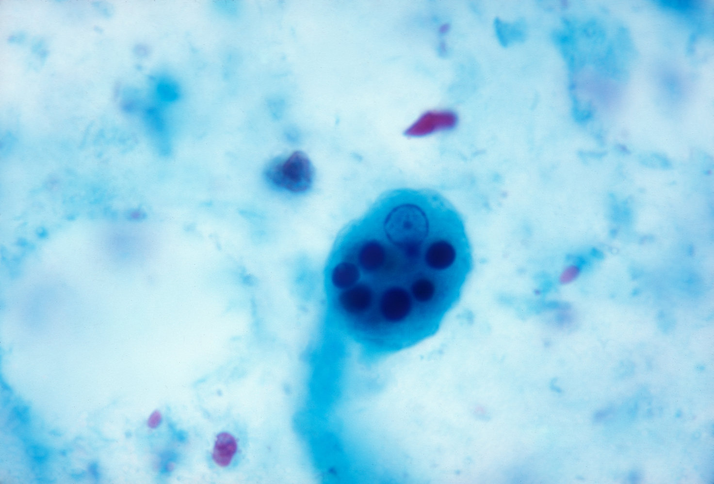

Entamoeba histolytica trophozoite

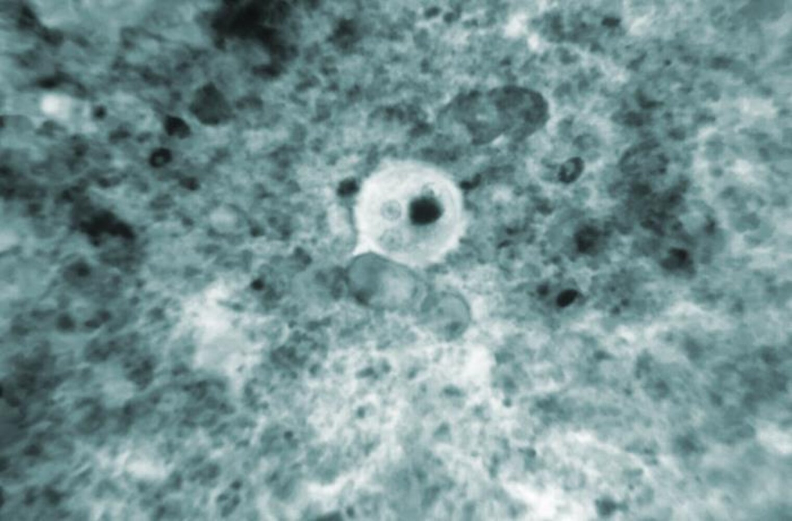

Entamoeba histolytica cyst

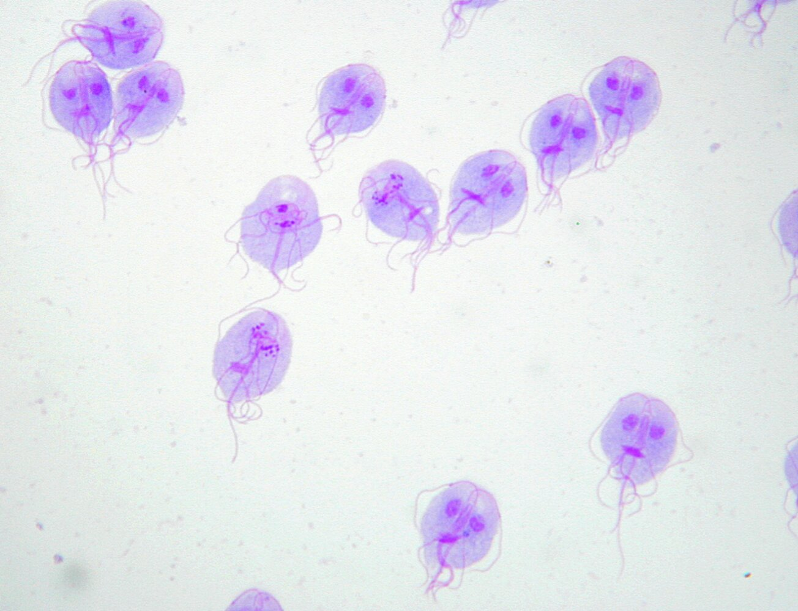

Giardia lamblia

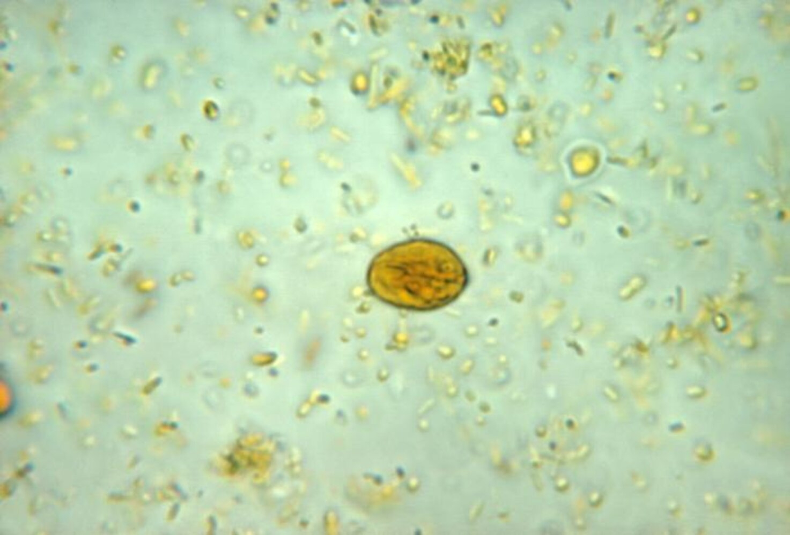

Giardia lamblia cyst

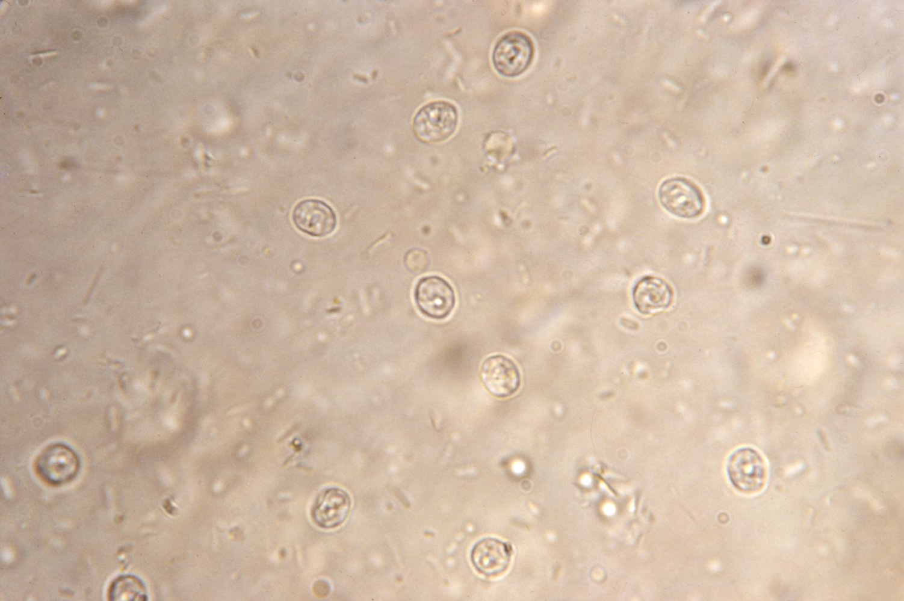

Cryptosporidium parvum oocysts

---

## Tissue and blood protozoa

All tissue and blood <u>protozoa</u> require a <u>vector</u> for transmission.

### <u>Sporozoa</u>

| Overview of clinically significant <u>Sporozoa</u> |  |  |  |  |  |  |  |
| --- | --- | --- | --- | --- | --- | --- | --- |
| Characteristics |  | <u>Plasmodium</u> spp. |  |  |  |  <u>Babesia</u> spp. [[6]](https://coursology-qbank.com/amboss/article/5uXi7-)  |  |
| <u>P. vivax</u> | <u>P. ovale</u> | <u>P. malariae</u> |  <u>P. falciparum</u>  |  |  |  |  |
| Distribution |  |  * Tropics and subtropics  * West and Central Africa (e.g., Guinea, Ghana, Nigeria)  * South and Southeast Asia (e.g., India, Indonesia)  * Latin America (e.g., Brazil, Colombia)   |  |  |  |  * Northeast, Northwest, and upper Midwest of the US   |  |
| Factors affecting risk of infection and disease |  |  * Travel to <u>endemic</u> areas   |  |  |  |  |  |
|  * Individuals with <u>hemoglobinopathies</u> (e.g., <u>thalassemia</u>) and sickle-cell disease have partial resistance against <u>malaria</u>.   |  |  |  |  * Individuals with <u>asplenia</u> are at a higher risk of severe disease.   |  |  |  |
|  <u>Vector</u> (<u>definitive host</u>) |  |  * Female Anopheles mosquito   |  |  |  |  * Ticks from the Ixodidae family (especially <u>Ixodes scapularis</u>)   |  |
| Intermediate hosts |  |  * Humans and other mammals   |  |  |  |  |  |
|  Morphology [[1]](https://coursology-qbank.com/amboss/article/bJXHs_)  | <u>Trophozoite</u> |  * See “<u>Developmental stages of Plasmodium in RBCs</u>” for details about the morphology of each individual stage.   |  |  |  |  * Resembles a diamond ring   |  |
|   * Immature: a ring with a single <u>chromatin</u> dot (occupies ∼ ⅓ of an <u>RBC</u>)  * Mature: ameboid ring    |   * Immature: resembles immature <u>P. vivax</u>, but larger  * Mature: ameboid ring    |   * Immature: resembles immature <u>P. vivax</u>, but smaller (occupies ∼ 1/6 of an <u>RBC</u>)  * Mature: band-like structure that crosses the <u>RBC</u>    |   * Immature: a ring with one or two <u>chromatin</u> dots (headphone sign)  * Mature: heavy ring, visible only in severe infection    |  |  |  |  |
|  Schizont/<u>merozoite</u>  |   * Immature: contains multiple <u>chromatin</u> bodies  * Mature: consists of 6–24 <u>merozoites</u>, which are round dark bodies that occupy most of <u>the cell</u>    |  |  |   * More <u>merozoites</u> than in other species  * Visible only in severe infection    |  * <u>Merozoite</u>: 4 <u>trophozoites</u> joined by their <u>chromatin</u> bodies, which resembles the shape of a <u>Maltese cross</u>   |  |  |
| <u>Gametocytes</u> |   * Macrogamete: round, filling almost the entire <u>erythrocyte</u>  * Microgamete: round, dark, <u>nucleus</u>  * Similar to <u>P. vivax</u>, but smaller    |  * Crescent-shaped   |  * N/A   |  |  * Indistinguishable from other sexual stages via <u>light microscopy</u>   |  |  |
|  Persistence in <u>liver</u>  |  |  * Yes   |  |  * No   |  |  |  |
| Disease |  |  * <u>Tertian malaria</u>   |  |  * <u>Quartan malaria</u>   |  * <u>Falciparum malaria</u>   |  * <u>Babesiosis</u>   |  |
| Clinical features |  |  * Usually cause <u>uncomplicated malaria</u>  * <u>Hemolytic anemia</u>  * <u>Headache</u>  * Species-specific <u>fever</u> patterns   |  |  |   * Uncomplicated: same as for <u>malaria</u> caused by other species  * Severe: results from occlusion of <u>blood vessels</u> by <u>parasites</u>  * <u>Heart failure</u>  * <u>Acute kidney injury</u>  * Confusion, <u>hallucinations</u>, <u>seizures</u>  * <u>Metabolic acidosis</u>, <u>hypoglycemia</u>    |   * <u>Hemolytic anemia</u>  * <u>Headache</u>, <u>myalgias</u>, <u>fever</u>    |  |
| <u>Fever</u> spikes |  |  * Every 48 hours   |  |  * Every 72 hours   |  * Irregular   |   * Irregular  * <u>Fever</u> may persist without spikes    |  |
| Diagnostics |  |  * Detection of <u>Plasmodium</u> in thick and thin <u>peripheral blood smears</u> (see “Diagnostics” section in “<u>Malaria</u>”)   |  |  |  |  * Detection of <u>merozoites</u> in thin <u>blood smear</u>   |  |
| Treatment |  |  * For more information about the treatment of different forms of <u>malaria</u>, including drug-resistant forms, see “Treatment” in “<u>Malaria</u>.”   |  |  |  |  * <u>Atovaquone</u> PLUS <u>azithromycin</u>   |  |
|  * <u>Chloroquine</u> OR <u>hydroxychloroquine</u> PLUS <u>primaquine</u> OR <u>tafenoquine</u>   |  |  * <u>Chloroquine</u> OR <u>hydroxychloroquine</u>   |   * Uncomplicated: <u>Chloroquine</u> OR <u>hydroxychloroquine</u>  * Severe: IM or IV <u>artesunate</u> followed by oral <u>artemether-lumefantrine</u> OR <u>atovaquone-proguanil</u> OR <u>quinidine</u> PLUS <u>doxycycline</u> OR <u>clindamycin</u>    |  |  |  |  |

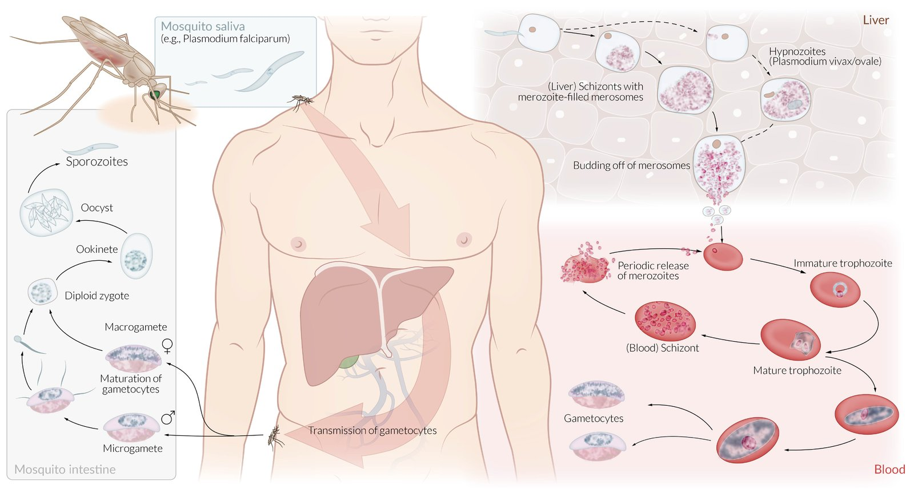

Lifecycle of Plasmodium falciparum (Malaria)

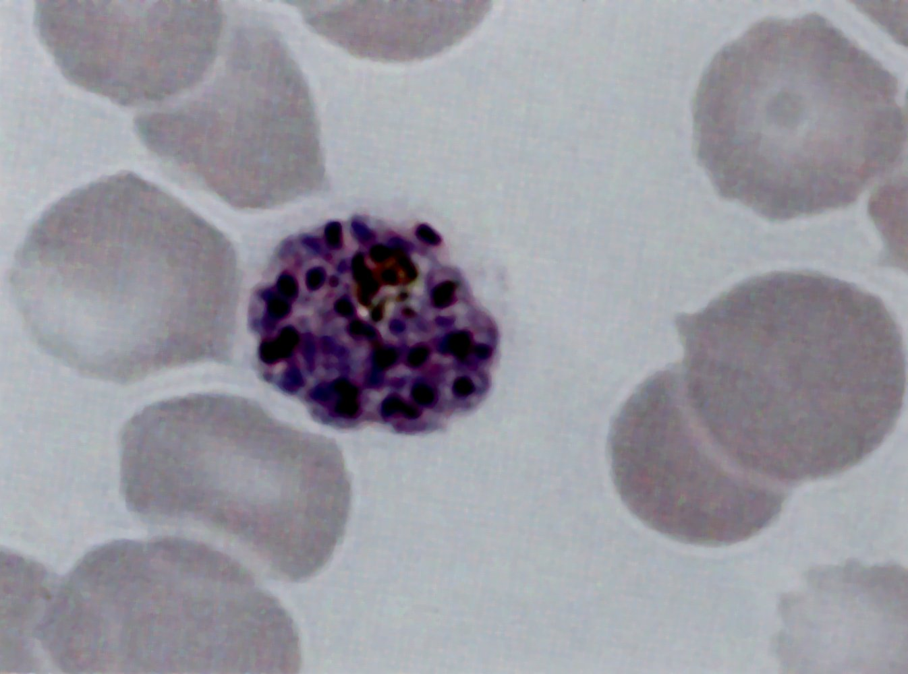

Tertian malaria: mature schizont in Plasmodium vivax infection

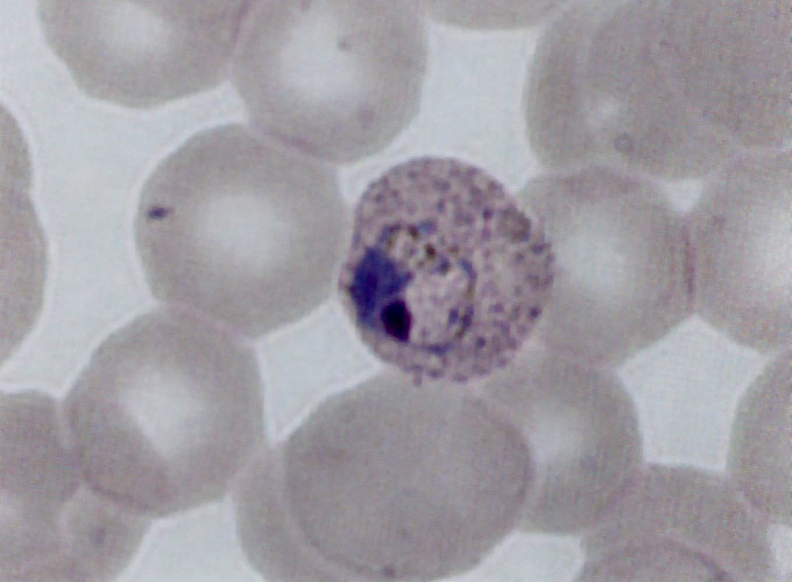

Tertian malaria: immature trophozoite in Plasmodium vivax infection

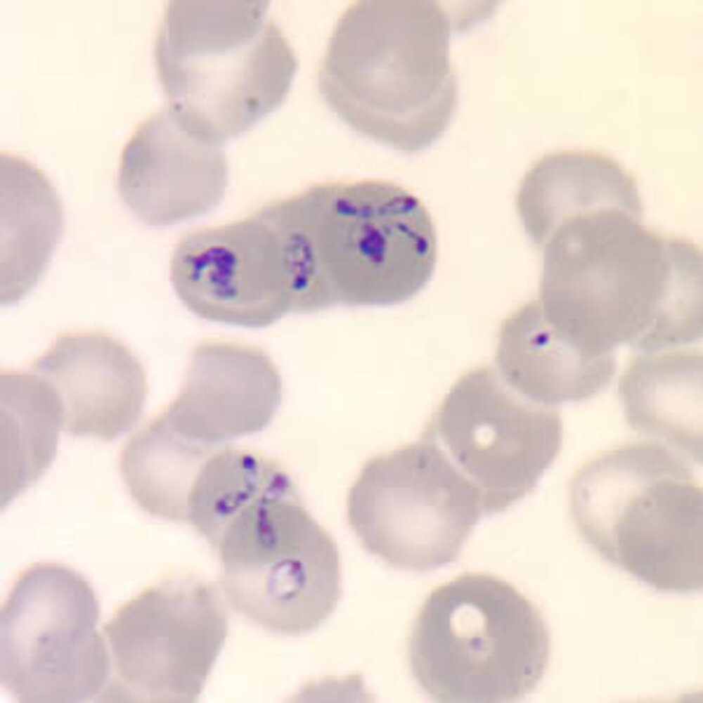

Babesiosis

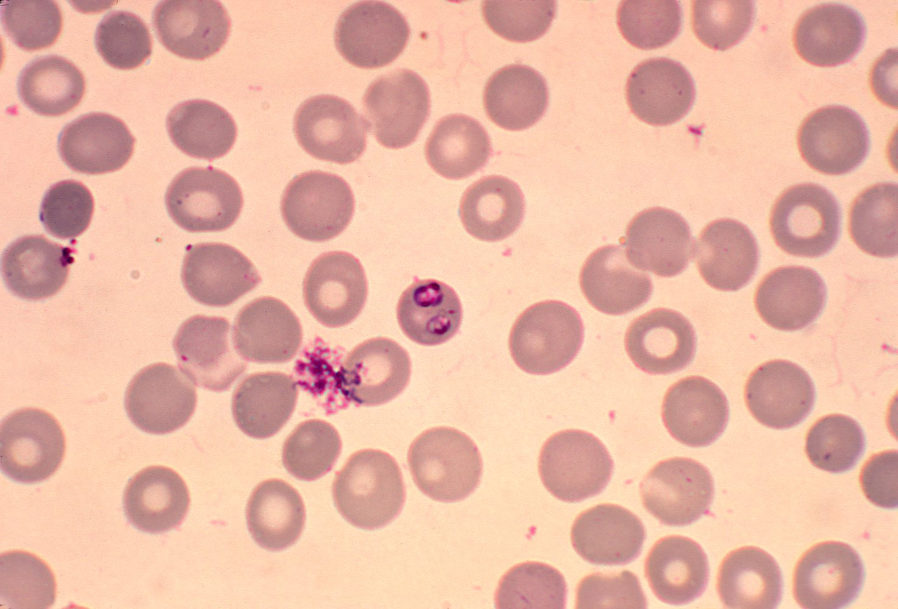

Babesia microti (blood smear)

#### Hemoflagellates [[1]](https://coursology-qbank.com/amboss/article/bJXHs_)[[5]](https://coursology-qbank.com/amboss/article/nUX7dx)[[7]](https://coursology-qbank.com/amboss/article/eCXxIZ0)

All hemoflagellates have similar morphological stages.

* Trypomastigote

* Elongated S- or C-shape

* Undulating membrane runs along one side of the body

* <u>Flagellum</u> at the <u>anterior</u> end

* Amastigote: round or oval with a peripherally located <u>nucleus</u>

* Epimastigote: resembles <u>trypomastigotes</u>, but smaller and with undulating membrane only along half of one side of the body

* Promastigote: resembles <u>epimastigote</u> without the undulating membrane

| Overview of clinically significant Hemoflagellates |  |  |  |  |
| --- | --- | --- | --- | --- |
| Characteristics | <u>Trypanosoma brucei</u> | <u>Trypanosoma cruzi</u> | Leishmania |  |
| Species and subspecies |   * <u>Trypanosoma brucei gambiense</u>  * <u>Trypanosoma brucei rhodesiense</u>    |  * N/A   |   * <u>L. donovani</u>  * L. infantum  * L. chagasi    |   * L. mexicana  * L. braziliensis  * L. guyanensis  * L. panamensis    |
| Distribution |   * <u>Trypanosoma brucei gambiense</u>: Central and West Africa  * <u>Trypanosoma brucei rhodesiense</u>: Eastern and southeastern Africa    |  * Central and South America   |   * Africa  * India  * Southwest and Central Asia  * Central America    |  * Central and South America   |
| <u>Vector</u> (<u>definitive host</u>) |  * <u>Tsetse fly</u>  * <u>Glossina</u> palpalis for <u>Trypanosoma brucei gambiense</u>  * <u>Glossina</u> morsitans for <u>Trypanosoma brucei rhodesiense</u>   |  * <u>Kissing bug</u>   |  * Phlebotomine sandflies   |  |
| Intermediate hosts |  * Humans, cattle, antelope   |  * Humans and other mammals   |  |  |
| <u>Infective stage</u> |  * <u>Trypomastigotes</u>   |  |  * <u>Promastigotes</u>   |  |
| Disease |  * <u>African trypanosomiasis</u> (<u>sleeping sickness</u>)   |  * <u>American trypanosomiasis</u> (<u>Chagas disease</u>)   |  * <u>Visceral leishmaniasis</u> (<u>kala-azar</u>)   |   * <u>Cutaneous leishmaniasis</u>  * <u>Mucosal leishmaniasis</u>    |
| Clinical features |   * Hemolymphatic stage  * <u>Trypanosomal chancre</u>  * <u>Intermittent fever</u>  * Painless <u>lymphadenopathy</u>  * Annular <u>maculopapular rash</u>  * <u>Headache</u>, <u>arthralgia</u>, <u>myalgia</u>  * Neurologic phase  * <u>Sleep</u> <u>inversion</u>  * Behavioral changes (<u>psychosis</u>, <u>apathy</u>)  * <u>Ataxia</u>  * Decreased consciousness progressing to <u>coma</u>    |   * Acute phase:  * <u>Generalized lymphadenopathy</u>  * <u>Fever</u>, <u>malaise</u>  * <u>Hepatosplenomegaly</u>  * <u>Chagoma</u> (<u>edema</u> at the bite site, usually on the face)  * <u>Romana sign</u> (painless unilateral <u>edema</u> of the periocular area and eyelids)  * Intermediate phase: asymptomatic  * Chronic phase:  * Biventricular <u>dilated cardiomyopathy</u>  * Megaesophagus and <u>achalasia</u>  * <u>Megacolon</u>    |   * Spiking <u>fever</u>  * <u>Hepatosplenomegaly</u>  * <u>Lymphadenopathy</u>  * <u>Pancytopenia</u>  * Possibly <u>skin</u> darkening    |  * <u>Macules</u>/<u>papules</u> with central <u>ulceration</u> of <u>skin</u> and/or <u>mucosal</u> membranes   |
| Diagnostics |   * Hemolymphatic stage: detection of <u>trypomastigotes</u> in thin and thick <u>peripheral blood smears</u> or <u>lymph node</u> aspirates (<u>Giemsa stain</u>)  * Neurologic phase: detection of <u>trypomastigotes</u> in <u>CSF</u>    |   * Acute phase: detection of <u>trypomastigotes</u> in thin and thick <u>peripheral blood smears</u> (<u>Giemsa stain</u>)  * Chronic phase: <u>serological tests</u> for <u>IgG</u> detection    |  * Detection of <u>amastigotes</u> inside <u>macrophages</u> in the <u>lymph node</u>, <u>spleen</u>, or <u>bone marrow</u> samples   |  * Detection of <u>amastigotes</u> inside <u>macrophages</u> in the <u>skin biopsy</u>   |
| Treatment |   * Hemolymphatic stage: <u>pentamidine</u>, <u>fexinidazole</u>, <u>suramin</u>  * Neurologic phase: a combination of <u>eflornithine</u> and <u>nifurtimox</u> or <u>melarsoprol</u>  * For more details, see section “Treatment” in the “<u>African trypanosomiasis</u>.”    |   * First line: <u>benznidazole</u>  * Second line: <u>nifurtimox</u>    |   * <u>Amphotericin B</u>  * <u>Sodium stibogluconate</u>    |   * Uncomplicated disease: topical treatment (e.g., topical <u>paromomycin</u>)  * Complicated disease: same as <u>visceral leishmaniasis</u>    |

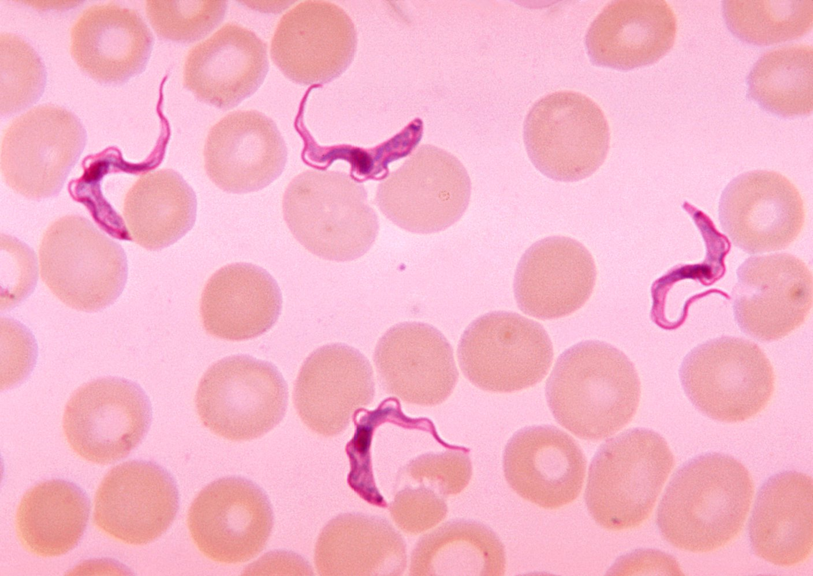

Trypanosoma brucei

---

## Protozoa that cause ocular and neurological disease

| Overview of <u>protozoa</u> affecting <u>CNS</u> and eyes |  |  |  |
| --- | --- | --- | --- |
| Feature |  Naegleria fowleri  [[8]](https://coursology-qbank.com/amboss/article/guXFq-)  |  Acanthamoeba spp. [[9]](https://coursology-qbank.com/amboss/article/fuXkq-)[[10]](https://coursology-qbank.com/amboss/article/TuX6q-)  | <u>Toxoplasma gondii</u> |
| Distribution |  * Found in bodies of warm freshwater (e.g., lakes, rivers, hot springs)   |   * Worldwide  * Predominantly found in bodies of standing water (e.g., sea water, swimming pools)    |  * Worldwide; preferably areas with hot, humid climate   |
| Affected population |   * Typically children and young adults  * History of swimming in hot springs    |   * Contact <u>lens</u> wearers: <u>keratitis</u>  * <u>Immunocompromised individuals</u>: <u>granulomatous amebic encephalitis</u>    |   * <u>Immunocompromised individuals</u> are at higher risk of <u>cerebral toxoplasmosis</u>  and <u>ocular toxoplasmosis</u>.  * Unborn children: <u>congenital toxoplasmosis</u>    |
| Transmission |   * Oral  * Airborne  * Water-borne    |  |   * Fecal-oral  * Vertical    |
| Hosts |  * Free-living (<u>facultative parasites</u>)   |  |   * <u>Final host</u>: felines  * Intermediate hosts: humans, birds, cattle    |
| Morphology |   * <u>Trophozoite</u>: ameboid, with a single <u>nucleus</u> and numerous <u>mitochondria</u>  * Flagellate: transient form, has two or more <u>flagella</u>  * Cyst: spherical, has a double-layer wall with pores    |   * <u>Trophozoite</u>: ameboid, with spindle-like <u>pseudopods</u> (acanthopods)  * Cyst: round, with a double <u>cell wall</u>    |   * <u>Tachyzoite</u>: crescent shape with a tapered <u>anterior</u> end and a large <u>nucleus</u> set centrally  * Bradyzoite: same as <u>tachyzoite</u> but smaller  * <u>Oocyst</u>: round, contains two sporocysts, each with four sporozoites    |
| Pathophysiology |  * Attachment to nasal <u>mucosa</u> → migration across the <u>cribriform</u> plate via <u>olfactory nerve</u> to the <u>brain</u> → <u>proliferation</u> in the <u>brain</u> tissue → destruction of <u>brain</u> tissue   |  * Inhalation or entry via <u>skin</u>/<u>mucosal</u> lesions → hematological dissemination → <u>CNS</u> invasion   |   * Ingestion of <u>oocysts</u> → release of sporozoites in the gastrointestinal tract → invasion of intestinal <u>epithelium</u> → transformation into <u>trophozoites</u> → tissue invasion  * Can colonize the <u>placenta</u>, cross the <u>placental barrier</u>, and infect the fetus    |
| Disease |  * <u>Primary amoebic meningoencephalitis</u>  * Sudden-onset meningeal syndrome (<u>headache</u>, <u>fever</u>, neck stiffness, etc.)  * Altered <u>sense of smell</u>  * <u>Signs of increased intracranial pressure</u> (e.g., <u>papilledema</u>, <u>Cushing triad</u>)  * Decreased consciousness rapidly progressing to <u>coma</u>  * Fatal in most cases   |  * <u>Keratitis</u>  * <u>Eye pain</u>  * <u>Photophobia</u>  * Decreased <u>vision</u>  * Corneal ring infiltrate   |  * <u>Cerebral toxoplasmosis</u>   * <u>Focal neurological symptoms</u>  * <u>Seizures</u>  * <u>Altered mental status</u>   |
|  * <u>Ocular toxoplasmosis</u>  * <u>Scotomas</u>  * <u>Fundoscopy</u>: yellow-white retinal lesions in acute stage, sharply-demarked areas of retinal depigmentation in chronic stage   |  |  |  |
|  * Granulomatous amebic encephalitis: a prolonged <u>incubation period</u> (weeks to months), but rapid progression after manifestation  * Focal symptoms (e.g., <u>facial nerve palsy</u>, visual disturbances, <u>paresis</u>, <u>ataxia</u>)  * Meningeal syndrome (<u>headache</u>, neck stiffness)  * <u>Altered mental state</u>   |  * <u>Congenital toxoplasmosis</u>  * <u>Chorioretinitis</u>  * Intracranial calcifications  * <u>Hydrocephalus</u>   |  |  |
|  * <u>Mononucleosis</u>-like condition in immunocompetent individuals   |  |  |  |
| Diagnostics |  * Detection of motile <u>trophozoites</u> in <u>CSF</u>   |   * <u>Keratitis</u>: detection of <u>trophozoites</u> in <u>eye</u> scrapings  * <u>Granulomatous amebic encephalitis</u>  * <u>Brain biopsy</u> shows <u>trophozoites</u>  * Detection of cysts and <u>trophozoites</u> in <u>CSF</u>    |   * <u>Cerebral toxoplasmosis</u>: <u>neuroimaging</u>, <u>serology</u>, <u>brain biopsy</u> showing <u>tachyzoites</u>  * <u>Ocular toxoplasmosis</u>: <u>serology</u>  * <u>Congenital toxoplasmosis</u>  * Antenatally: <u>PCR</u> for <u>T. gondii</u> in <u>amniotic fluid</u>  * Postnatally: <u>PCR</u> for <u>T. gondii</u> in <u>CSF</u> and serum, <u>serology</u>, <u>neuroimaging</u>    |
| Treatment |   * <u>Amphotericin B</u>  * <u>Miltefosine</u>    |   * <u>Keratitis</u>: topical <u>miconazole</u> and propamidine isethionate  * <u>Granulomatous amebic encephalitis</u>: <u>ketoconazole</u>, sulfamethazine    |   * <u>Pyrimethamine</u>, <u>sulfadiazine</u>, and <u>folinic acid</u>  * <u>Spiramycin</u> for pregnant women before the 18th week of <u>pregnancy</u>    |

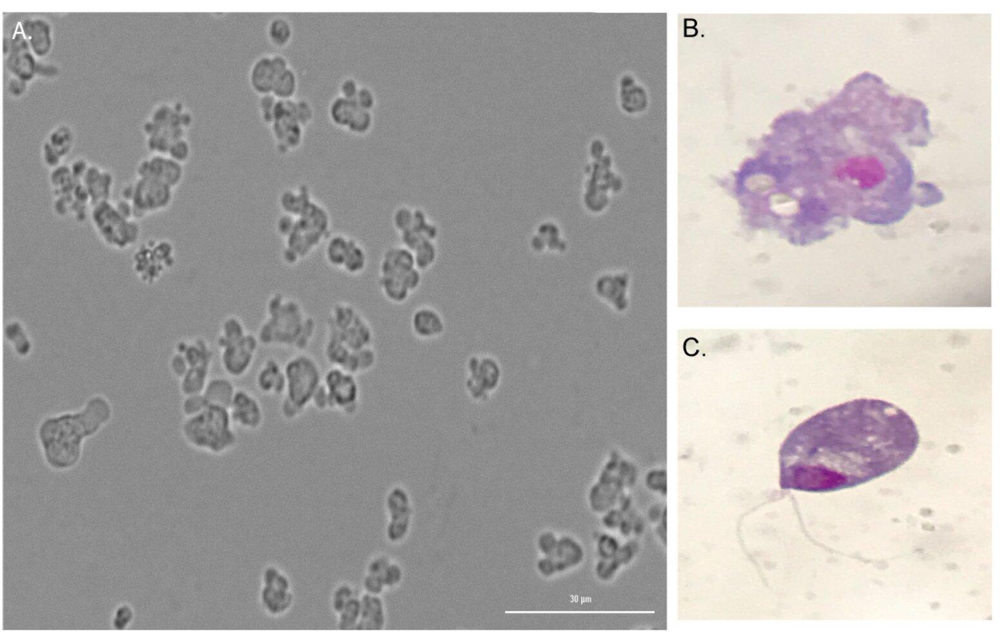

Naegleria fowleri

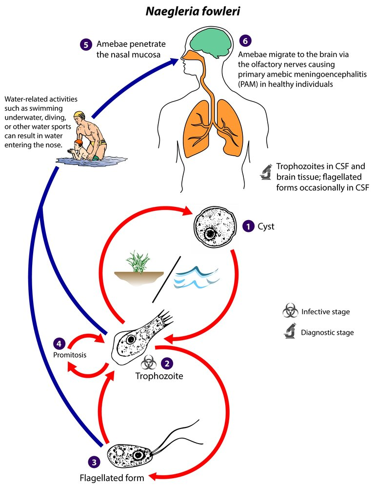

Life cycle of Naegleria fowleri

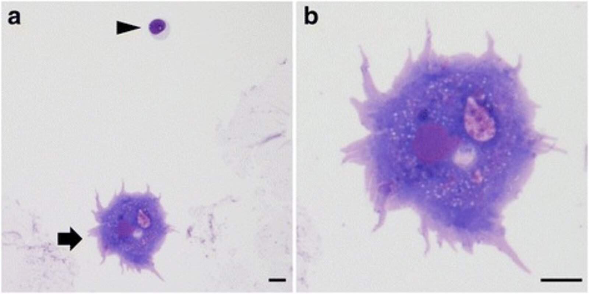

Acanthamoeba trophozoite

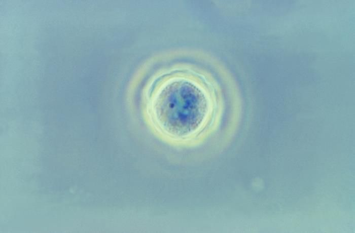

Acanthamoeba cyst

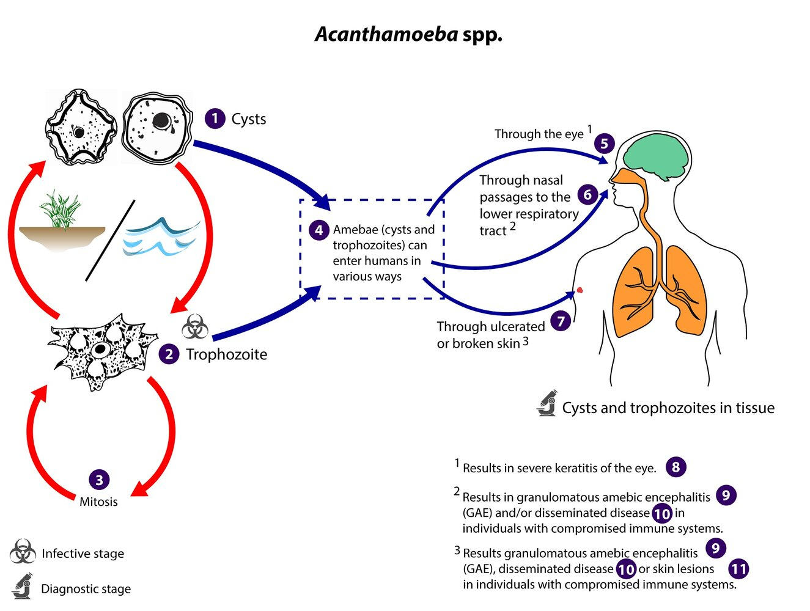

Life cycle of Acanthamoeba species

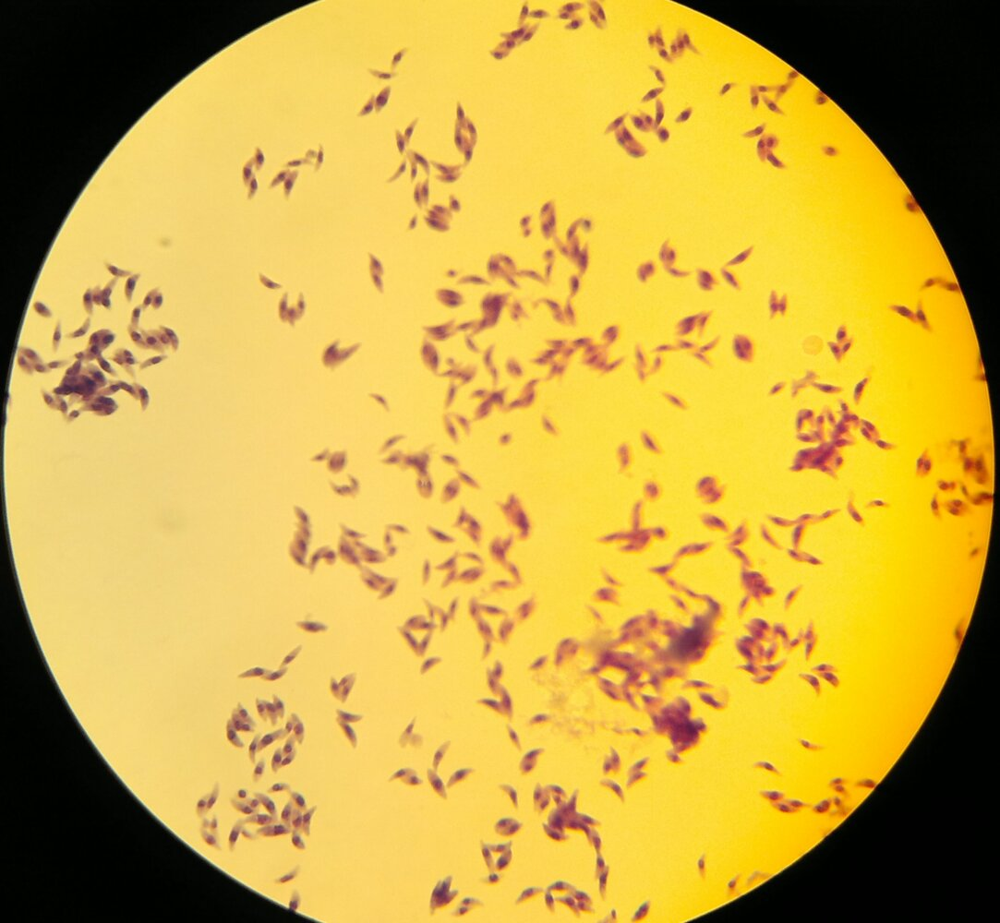

Toxoplasma gondii tachyzoites

Naegleria fowleri

---

## Urogenital protozoa

### <u>Trichomonas vaginalis</u>

* Taxonomy: flagellate

* Life cycle: only has <u>trophozoite</u> stage (cannot live outside a host); <u>trophozoite</u> morphology is characterized by the following features:  

* Ovoid shape

* Undulating membrane extending half of the body length

* One <u>nucleus</u>

* Three to five <u>flagella</u> anteriorly and one posteriorly

* Other properties: motile, anaerobic

* Transmission: sexual

* Disease: <u>trichomoniasis</u>

* Diagnosis: detection of motile <u>trophozoites</u> of <u>T. vaginalis</u> on <u>wet mount preparation</u>

* Treatment: oral <u>metronidazole</u> or <u>tinidazole</u>

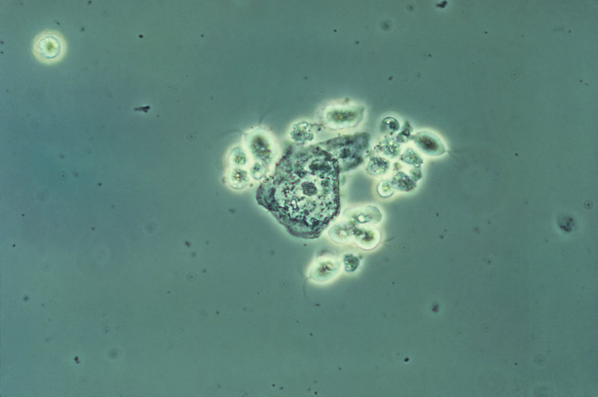

Trichomonas vaginalis

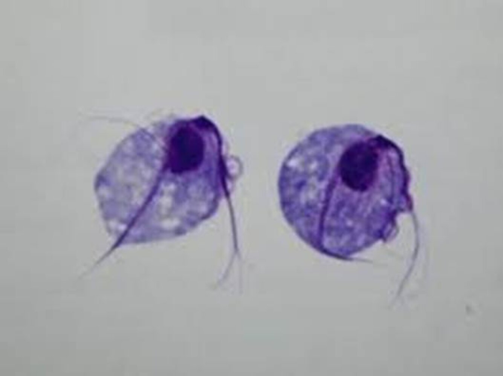

Trichomonas vaginalis

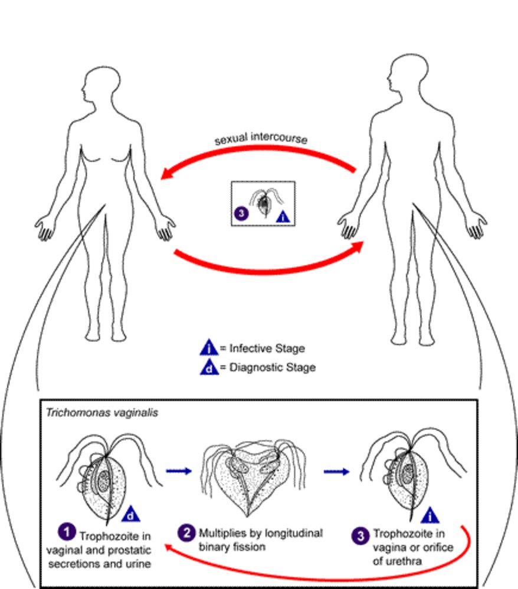

Life cycle of Trichomonas vaginalis

---

## Antiprotozoal agents

| Overview of antiprotozoal agents |  |  |  |  |  |
| --- | --- | --- | --- | --- | --- |
|  | Indications |  |  Mechanism of action [[11]](https://coursology-qbank.com/amboss/article/AMbRr8)[[12]](https://coursology-qbank.com/amboss/article/zMbrr8)  | <u>CNS</u> penetration | Adverse effects |
| <u>Pentamidine</u> |  * <u>African trypanosomiasis</u>   |   * <u>Pneumocystis jirovecii</u> <u>pneumonia</u>  * Antimony-resistant <u>leishmaniasis</u>    |   * Not fully understood  * Most likely inhibits <u>mitochondrial</u> <u>topoisomerases</u> in <u>trypanosomes</u>    |  * No   |   * <u>Nephrotoxicity</u>  * <u>Neutropenia</u>  * <u>Hepatotoxicity</u>  * <u>Pancreatitis</u>  * <u>Electrolyte</u> imbalances (<u>hyperkalemia</u>, <u>hypomagnesemia</u>, <u>hypocalcemia</u>, <u>hypoglycemia</u>/<u>hyperglycemia</u>)  * <u>Ventricular tachycardia</u>, <u>hypotension</u>  * <u>Sterile abscess</u>    |
| <u>Suramin</u> |  * <u>Onchocerciasis</u>   |   * Not fully understood  * Most likely inhibits enzymes involved in <u>DNA replication</u> and <u>protein synthesis</u>    |   * Hypersensitivity  * <u>Nephrotoxicity</u>  * <u>Peripheral neuropathy</u>  * <u>Hypogonadism</u> among male patients    |  |  |
| Nifurtimox |  * <u>American trypanosomiasis</u> (second-line)   |  * Not fully understood; suggested to induce oxidative <u>stress</u> reactions   |  * Yes   |   * <u>Seizures</u>  * Cognitive impairment    |  |
| Melarsoprol |  * Second stage of East <u>African trypanosomiasis</u>   |   * A prodrug that contains <u>arsenic</u>  * Taken up by aminopurine transporters (e.g., <u>P2</u>) of <u>T. brucei</u> → metabolism into melarsen oxide → lysis of <u>T. brucei</u> through an unknown mechanism    |   * Posttreatment reactive <u>encephalopathy</u> (PTRE)  * <u>Jarisch-Herxheimer reaction</u>  * <u>Nephrotoxicity</u>  * <u>Peripheral neuropathy</u>  * <u>Thrombophlebitis</u>    |  |  |
| <u>Eflornithine</u> |  * <u>West African trypanosomiasis</u>   |  |  * Inhibits <u>ornithine</u> carboxylase, which is required for <u>cell differentiation</u> and <u>proliferation</u>   |   * <u>Bone marrow</u> toxicity  * <u>Seizures</u>  * <u>Hearing loss</u>  * <u>Alopecia</u>, <u>rash</u>  * <u>Diarrhea</u>    |  |
| Miltefosine |   * <u>Leishmaniasis</u>  * <u>Primary amebic meningoencephalitis</u>  * <u>Schistosomiasis</u>    |  |   * Not fully understood  * Probably involves disruption of <u>membrane phospholipid</u> and sterol synthesis [[13]](https://coursology-qbank.com/amboss/article/yyXd300)    |   * Elevated serum <u>transaminases</u>  * <u>Thrombocytopenia</u>  * Increased serum <u>creatinine</u>  * <u>Vertigo</u>  * <u>Headache</u>    |  |
| <u>Metronidazole</u> |   * <u>Entamoeba histolytica</u>  * <u>Giardia lamblia</u>  * <u>Trichomonas vaginalis</u>    |  |  * Creates <u>free radicals</u> within the bacterial cell → <u>DNA</u>-strand breaks (<u>bactericidal</u> and <u>antiprotozoal</u> effect)   |   * <u>Headache</u>  * <u>Disulfiram-like reaction</u>  * Metallic <u>taste</u>    |  |
|  Paromomycin  |   * <u>Amebiasis</u>  * <u>Giardiasis</u>  * <u>Leishmaniasis</u>    |  |  * Inhibits <u>30S ribosomal subunit</u> (<u>aminoglycoside</u> derivative) [[14]](https://coursology-qbank.com/amboss/article/ByXzh00)   |  * No   |   * Abdominal <u>pain</u>, <u>nausea</u>  * Pruritic <u>rash</u>  * <u>Ototoxicity</u>    |
|  Diloxanide  |  * <u>Amebiasis</u>   |  |   * Not fully understood  * Act intraluminally on <u>trophozoites</u>    |   * Flatulence  * Pruritic <u>rash</u>    |  |
| Iodoquinol |   * <u>Nausea</u>, <u>vomiting</u>, abdominal cramps  * <u>Optic nerve</u> <u>atrophy</u>    |  |  |  |  |
| Sodium stibogluconate |  * <u>Leishmaniasis</u>   |  |  * Inhibits <u>synthesis of ATP</u> and <u>GTP</u> in the <u>parasite</u> cell [[15]](https://coursology-qbank.com/amboss/article/xyXEh00)   |  * No data   |   * <u>Myalgia</u>, <u>arthralgia</u>  * Cardiotoxicity [[16]](https://coursology-qbank.com/amboss/article/dW1o4f0)  * <u>Anorexia</u>, <u>nausea</u>, <u>vomiting</u>  * Elevated serum <u>transaminases</u>    |

---

## Cestodes (tapeworms)

* <u>Cestodes</u> (<u>tapeworms</u>) are long, flat, ribbon-like worms composed of numerous segments and a single scolex at the head with which they anchor themselves to the intestine.

* Since they do not have a digestive tract, all <u>nutrients</u> are absorbed through the tegument.

* <u>Cestodes</u> are hermaphroditic (they contain both male and female organs).

* See "<u>Overview of cestode infections</u>."

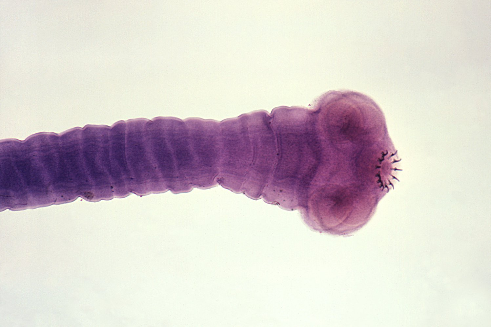

Head of a pork tapeworm (Taenia solium)

---

## Antihelmintic agents

| Overview of antihelmintic agents |  |  |  |
| --- | --- | --- | --- |
| Drug | Indications | Mechanism of action | Adverse effects |
|  Bendazoles (e.g., albendazole, mebendazole) [[17]](https://coursology-qbank.com/amboss/article/htYcWI)[[18]](https://coursology-qbank.com/amboss/article/3tYSWI)  |   * <u>Ascariasis</u>  * <u>Enterobiasis</u>  * <u>Trichuriasis</u>  * <u>Strongyloidiasis</u>  * <u>Hookworm infection</u>  * <u>Cysticercosis</u>  * <u>Trichinellosis</u>  * <u>Toxocariasis</u>    |  * Bind to <u>tubulin</u> and inhibits <u>microtubule</u> polymerization resulting in:  * Decreased <u>glucose</u> uptake and <u>glycogen synthesis</u>  * Degeneration of <u>mitochondria</u> and <u>endoplasmic reticulum</u>  * <u>Lysosomal</u> release   |   * <u>Headache</u>  * GI upset (especially during the first days of treatment)  * Increased <u>liver</u> enzymes  * <u>Rash</u>, <u>urticaria</u>  * <u>Hair</u> loss  * <u>Agranulocytosis</u>    |
|  Pyrantel pamoate [[19]](https://coursology-qbank.com/amboss/article/StYy1I)  |   * <u>Ascariasis</u> (in pregnant women)  * <u>Enterobiasis</u>  * <u>Hookworm infection</u>    |  * <u>Neuromuscular blocking agents</u> that inhibit:  * Release of <u>acetylcholine</u>  * <u>Acetylcholinesterase</u>   |   * <u>Headache</u>  * <u>Fever</u>  * <u>Dizziness</u>  * <u>Nausea</u>, <u>vomiting</u>  * <u>Diarrhea</u>  * Abdominal <u>pain</u>  * Increased <u>liver</u> enzymes    |
|  Praziquantel [[20]](https://coursology-qbank.com/amboss/article/gtYF1I)  |   * <u>Taeniasis</u>  * <u>Diphyllobothriasis</u>  * <u>Schistosomiasis</u>  * <u>Neurocysticercosis</u>  * <u>Clonorchiasis</u>  * <u>Paragonimiasis</u>    |   * Causes vacuolization of the schistosome integument and increases <u>cell membrane</u> permeability to <u>calcium</u>, resulting in <u>paralysis</u>, dislodgement, and <u>death</u>  * A single dose is sufficient for most <u>helminths</u>.    |   * <u>Nausea</u>, <u>vomiting</u>  * Abdominal <u>pain</u>  * Increased <u>liver</u> enzymes  * <u>Rash</u>, <u>pruritus</u>  * <u>Joint</u>/muscle <u>pain</u>  * <u>Headache</u>  * <u>Seizure</u>    |
|  Ivermectin [[21]](https://coursology-qbank.com/amboss/article/TtY61I)  |   * <u>Onchocerciasis</u>  * <u>Strongyloidiasis</u>  * <u>Hookworm infection</u>    |  * Paralyses <u>parasite</u> by:  * Enhancing <u>γ-aminobutyric acid</u> (<u>GABA</u>)-mediated neurotransmission  * Binding to muscle <u>glutamate</u>-gated <u>chloride ion</u> channels → cell <u>hyperpolarization</u>   |   * <u>Fever</u>  * <u>Dizziness</u>  * <u>Tachycardia</u>  * <u>Hypotension</u>  * <u>Nausea</u>, <u>vomiting</u>  * Abdominal <u>pain</u>  * <u>Rash</u>, <u>pruritus</u>  * <u>Lymphangitis</u>  * <u>Joint</u>/muscle <u>pain</u>    |
|  Diethylcarbamazine [[22]](https://coursology-qbank.com/amboss/article/ftYk1I)  |   * <u>Loiasis</u>  * <u>Lymphatic filariasis</u>    |   * Immobilizes <u>microfilariae</u>  * Sensitizes the <u>microfilariae</u> to <u>phagocytosis</u> through  * <u>Immobilization</u>  * Alteration of surface structure and displacement from the attachment site    |   * <u>Headache</u>  * <u>Malaise</u>, <u>weakness</u>  * <u>Anorexia</u>, <u>vomiting</u>  * <u>Rash</u>, facial swelling  * Muscle and <u>joint</u> <u>pain</u>  * <u>Vision loss</u>  * <u>Eosinophilia</u>  * <u>Leukocytosis</u>    |

> [!NOTE]
> Most important <u>antihelminthics</u> (Pyrantel pamoate, Praziquantel, Ivermectin, Mebendazole, and Diethylcarbamazine:Pesky Parasites Inevitably Meet their Doom.

---

## Arthropods

### General characteristics

* Overview

* Arthropods are a group of <u>ectoparasites</u> that comprises arachnids and insects.

* Feed on the blood, <u>skin</u> cells and oils, and/or organic debris of their hosts

* Infestation is a disease in its own right, but the role of <u>ectoparasites</u> as <u>vectors</u> for other diseases is generally more clinically significant.

* Morphological features

* Common features include a chitin exoskeleton and segmented bodies with paired appendages (e.g., legs, wings, antennae)

* Life cycle involves several stages and may involve molting and metamorphosis.
* Most <u>arthropods</u> undergo a transformation from larva to an adult organism through several life stages characterized by distinct morphology.

* No metamorphosis: egg → adult

* Simple metamorphosis: egg → <u>nymph</u> → adult

* Complete metamorphosis: egg → larva → <u>pupa</u>/<u>nymph</u> → adult

---

## Arachnids

### Ticks [[1]](https://coursology-qbank.com/amboss/article/bJXHs_)

Ticks play a clinically significant role as <u>vectors</u> for pathogenic bacteria. The only clinically significant direct effect of <u>tick bites</u> is <u>tick paralysis</u>, a rare response to <u>neurotoxins</u> in the tick's saliva characterized by tingling and numbness throughout the body. See “<u>Lyme disease</u>” for a full discussion of <u>tick-borne diseases</u>.

| Overview of clinically significant tick species |  |  |  |  |
| --- | --- | --- | --- | --- |
| Species |  | Distribution | Associated <u>pathogen</u> | <u>Vector-borne diseases</u> |
| Ixodes spp. | I. scapularis |   * Eastern US  * Southeastern Canada    |   * <u>Borrelia</u> spp.  * <u>Babesia</u> spp.  * <u>Anaplasma spp.</u>    |   * <u>Lyme disease</u>  * <u>Babesiosis</u>  * <u>Anaplasmosis</u>    |
| I. pacificus |   * Pacific coast of the US  * Western coast of North America    |  |  |  |
|  | I. ricinus |  * Europe, northern Africa, and Russia   |  |  |
|  | I. persculatus |  * Central and Eastern Asia   |  |  |
| Dermacentor spp. |  |  * Cosmopolitan distribution   |   * <u>Rickettsia rickettsii</u>  * <u>Francisella tularensis</u>    |   * <u>Rocky Mountain spotted fever</u> (<u>RMSF</u>)  * <u>Tularemia</u>    |
| <u>Ornithodoros</u> spp. |  |   * Western US  * Spain, Portugal  * Parts of Ukraine and Turkey    |  * <u>Borrelia</u> hermsii   |  * <u>Tick-borne relapsing fever</u>   |
| <u>Amblyomma americanum</u> |  |  * Southeastern and Eastern US   |   * <u>Ehrlichia spp.</u>  * <u>Francisella tularensis</u>    |   * <u>Ehrlichiosis</u>  * <u>Tularemia</u>    |

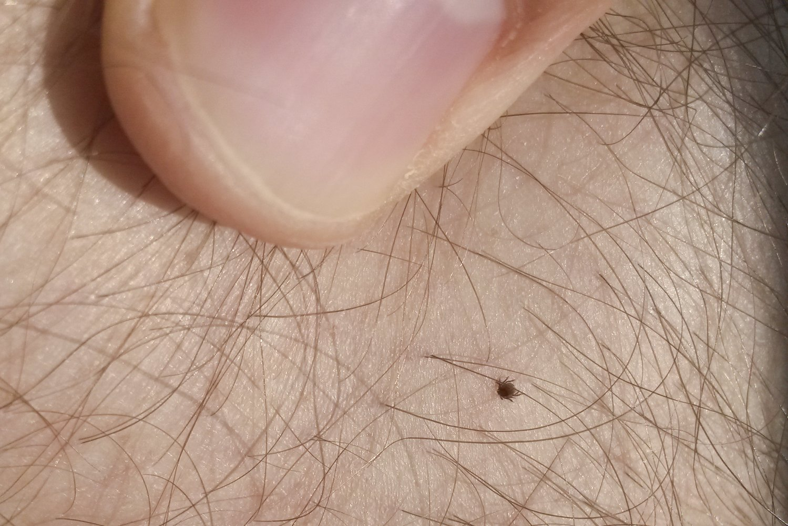

Tick bite

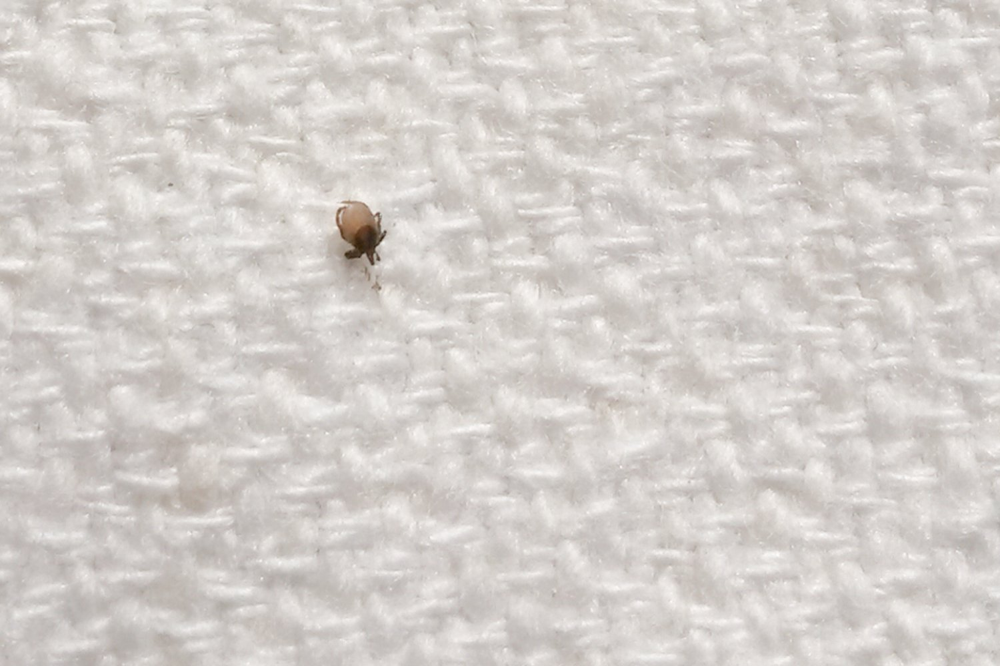

Tick

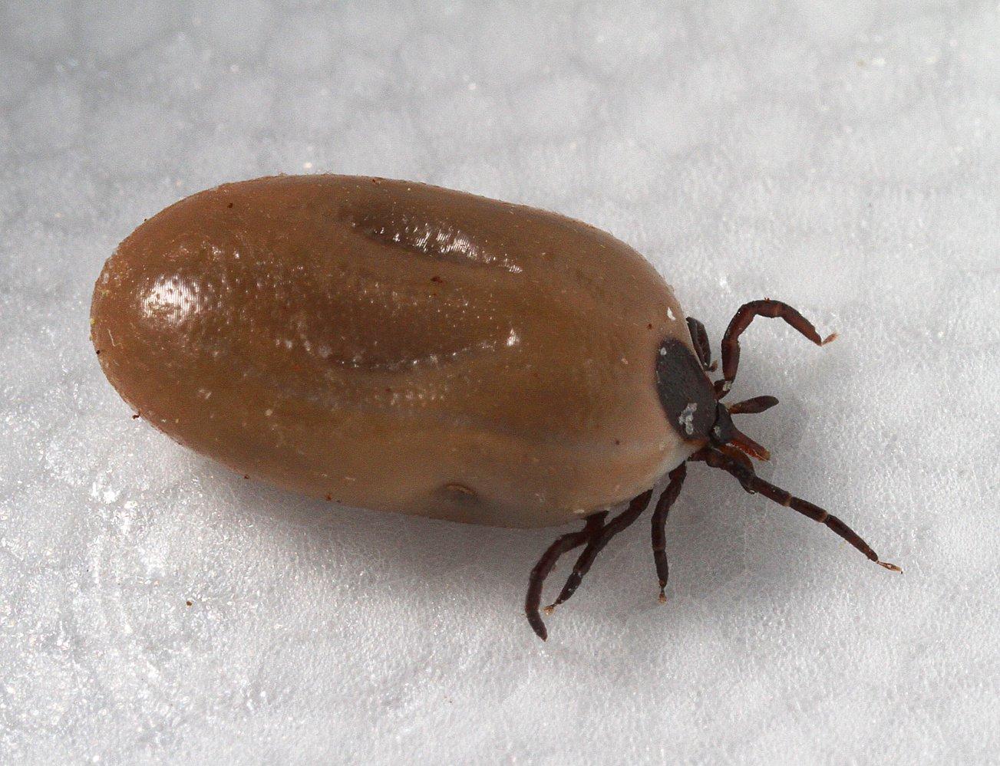

Tick after a blood meal

### Mites [[1]](https://coursology-qbank.com/amboss/article/bJXHs_)

| Overview of clinically significant <u>mite</u> species |  |  |  |
| --- | --- | --- | --- |
| Species |  | Associated condition | Pathophysiology |
| Parasitic |  <u>Sarcoptes scabiei</u>   |  * <u>Scabies</u>   |   * Females burrow into the <u>skin</u> to lay eggs.  * Larvae emerge after hatching and live on the <u>skin</u>, molting into a <u>nymph</u> stage before maturing into adult <u>mites</u>.    |
| Nonparasitic |  Dermatophagoides farinae (<u>house dust mite</u>) |  * <u>Allergic diseases</u>   |  * Feces and debris can cause <u>allergic reactions</u>.   |
|  Demodex spp. [[23]](https://coursology-qbank.com/amboss/article/NCX-HZ0) |  * <u>Demodicosis</u>   |   * Lives in <u>sebaceous glands</u> and <u>hair follicles</u> (mainly of the face and head; typically affects eyelashes)  * <u>Mite</u> feeds on the <u>epithelium</u> → <u>epithelial</u> thickening and local inflammation → plugging of the follicle, disrupted <u>sebum</u> production → <u>folliculitis</u>, <u>rosacea</u>-like lesions    |  |
|  Leptotrombidium spp.  |  * <u>Scrub typhus</u>   |  * Infection of <u>endothelial</u> cells → <u>T cell</u> and <u>macrophage</u> perivascular infiltration → inflammatory response   |  |

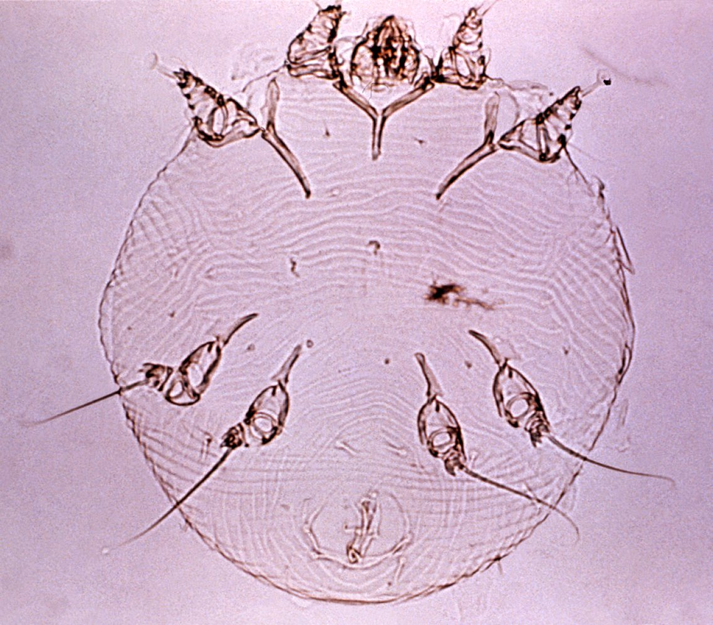

Scabies mite (Sarcoptes scabiei var. hominis)

---

## Insects

### Lice [[1]](https://coursology-qbank.com/amboss/article/bJXHs_)

For more information on the various species of <u>lice</u>, see “<u>Lice infestation</u>.”

* Examples

* <u>Pediculus humanus capitis</u>

* <u>Pediculus humanus corporis</u>

* <u>Pthirus pubis</u>

* Life cycle

* <u>Adult lice</u> lay eggs (nits) at the base of the <u>hair shaft</u>.

* Hatched larvae undergo three <u>nymph</u> stages (N1–N3) before reaching adulthood after 3 to 4 weeks.

* <u>Lice</u> can be transmitted through direct contact with the host and their personal belongings (e.g., combs, clothes, bedsheets).

* Associated conditions

* <u>Infestation</u> causes <u>pediculosis</u>.

* <u>Pediculus humanus corporis</u> also serves as a <u>vector</u> for the following pathogens:

* <u>Bartonella quintana</u>: causes <u>trench fever</u>

* <u>Rickettsia prowazekii</u>: causes <u>epidemic typhus</u>

* <u>Borrelia recurrentis</u>: causes <u>louse-borne relapsing fever</u>

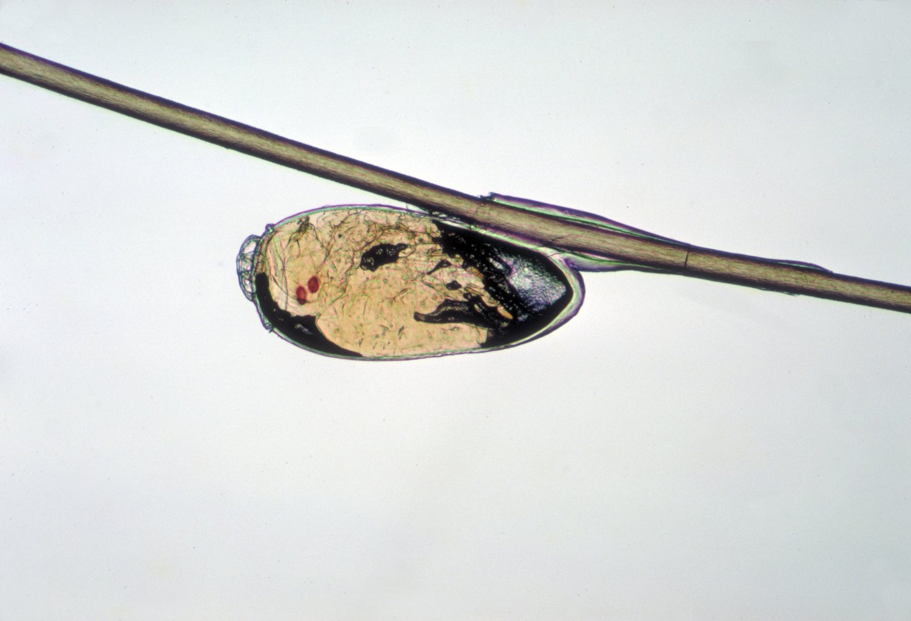

Head louse nit

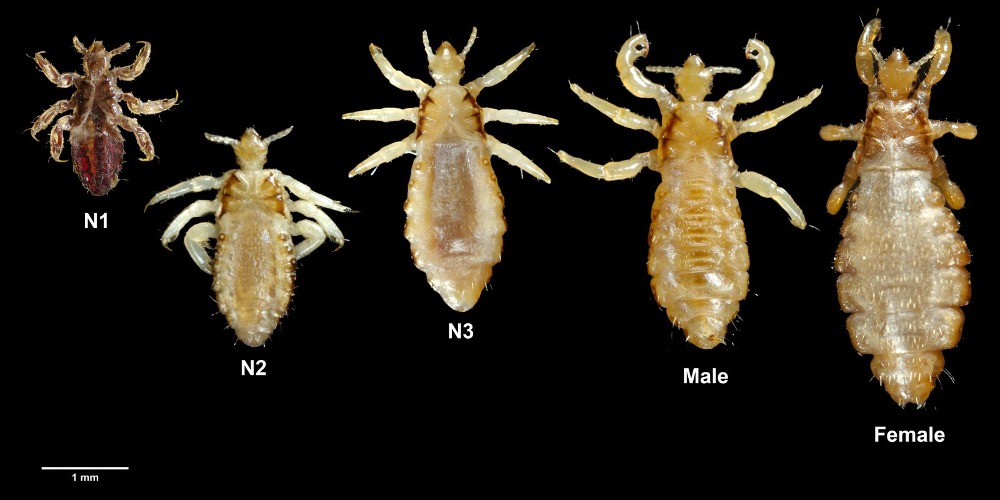

Developmental stages of the body louse

### Fleas [[1]](https://coursology-qbank.com/amboss/article/bJXHs_)

* Examples 

* Xenopsylla cheopis

* Tunga penetrans (jigger <u>flea</u>)

* Life cycle

* Usually involves 4 stages of development: egg → larva → <u>pupa</u> → adult

* After adult <u>fleas</u> have found a host and have taken a blood meal, they mate and lay eggs

* Hatching of eggs takes 1–10 day

* Larvae feed on blood and <u>flea</u> feces (“<u>flea</u> dirt”) and will spin a cocoon within 5–20 days to enter the <u>pupa</u> stage

* After several days/weeks, adult <u>fleas</u> are ready to emerge from the cocoon following the detection of a host (e.g., via movement or body heat)

* Associated conditions

* A <u>flea</u> bite can cause <u>pruritus</u> and dermatitis and may be followed by secondary bacterial infections

* Can serve as <u>vectors</u> for the following pathogens:

* <u>Rickettsia</u> typhi, <u>Rickettsia</u> felis

* <u>Yersinia pestis</u>

* <u>Hymenolepis nana</u>

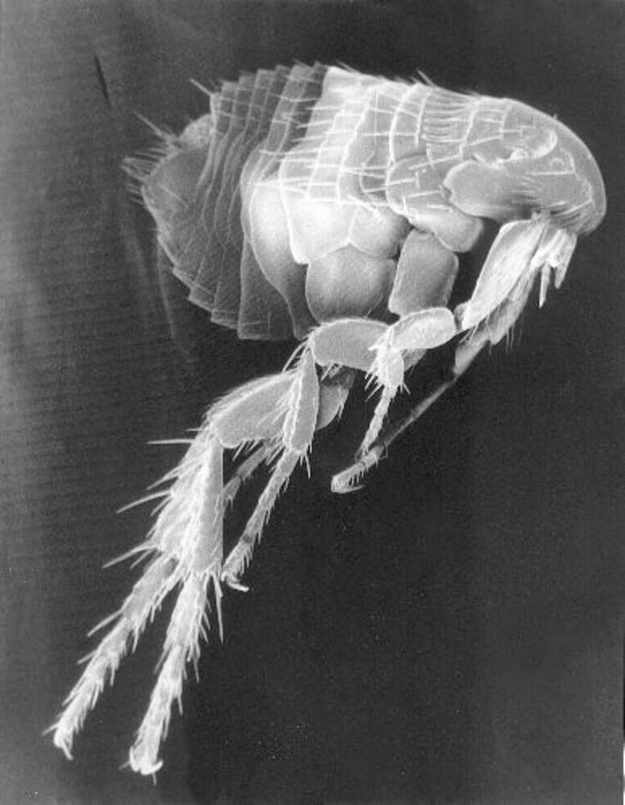

Flea (Vector of Yersinia pestis)

### Flies [[1]](https://coursology-qbank.com/amboss/article/bJXHs_)

Parasitic flies are clinically relevant mainly as <u>vectors</u> for pathogens, which they transmit during a blood meal.

* Main types of parasitic flies

* <u>Tsetse</u> flies (e.g., <u>Glossina</u> spp.)

* Sandflies (e.g., Phlebotomus spp.)

* Black flies (e.g., Simulium spp.)

* Deer flies (e.g., Chrysops spp.)

* Botflies (e.g., Dermatobia hominis)

* Associated conditions

* Flies serve as <u>vectors</u> for a range of pathogens (see the table below).

* Myiasis: <u>infestation</u> of human tissue by fly larvae

* Female fly lays eggs onto a hematophagous insect, which acts as <u>intermediate host</u>, or onto the host directly (e.g., into uncovered wounds). → The larvae hatch and penetrate the <u>skin</u>, digging tunnels into the host's <u>subcutaneous tissue</u>. → Once mature, the larvae drop from host to pupate.

* D. hominis is the only species of fly that routinely parasitizes humans, causing <u>myiasis</u>.

* However, other species of the family Oestridae (botflies) as well as the families Calliphoridae (blowflies) and Sarcophagidae (fleshflies) may infest humans if the opportunity presents itself (e.g., uncovered wounds).

* Obligatory <u>myiasis</u> is most common in species found in Central and South America and sub-Saharan Africa, where humans are most commonly affected.

* Treatment involves the removal of larvae and <u>surgical debridement</u> of the wound.

* Complications: Bacterial infection, potentially leading to <u>sepsis</u>, is common.

| Overview of clinically significant fly species |  |  |  |
| --- | --- | --- | --- |
| Type | Distribution | Associated <u>pathogen</u> | Disease |
| <u>Tsetse fly</u> |  * Africa   |  * <u>Trypanosoma brucei</u>   |  * African tripanosomiasis   |
| Sandfly |   * Asia  * South America  * Central America  * Africa  * Mediterranean    |  * <u>Leishmania</u> spp.   |   * <u>Visceral leishmaniasis</u>  * <u>Cutaneous leishmaniasis</u>  * <u>Mucosal leishmaniasis</u>    |
| Black fly |   * Africa  * Central and South America    |  * <u>Onchocerca volvulus</u>   |  * <u>Onchocerciasis</u>   |
| Deer fly |  * Africa   |  * <u>Loa loa</u>   |  * <u>Loiasis</u>   |
| Bot fly |  * Dermatobia hominis: southern Mexico to Uruguay   |  * N/A   |  * <u>Myiasis</u>   |

### Heteroptera

* Examples

* Triatoma spp. (<u>kissing bug</u>): found predominantly in Central and South America

* <u>Cimex lectularius</u> (<u>bed bug</u>)

* Populates facilities with a high guest turnaround (e.g., hostels, correctional facilities)

* Feeds on human blood

* Life cycle: simple metamorphosis

* Associated conditions

* <u>Bed bug</u> bites can cause a pruritic <u>maculopapular rash</u>.

* Triatoma serve as <u>vectors</u> for <u>Trypanosoma cruzi</u>, which causes <u>Chagas disease</u>

---

## Ectoparasiticides

| Overview of ectoparasiticides |  |  |  |  |
| --- | --- | --- | --- | --- |
| Drug | Indications | Mechanism of action | Application | Adverse effects |
| Permethrin |   * <u>Pediculosis capitis</u>  * <u>Pediculosis pubis</u>  * <u>Scabies</u>    |  * Blocks the deactivation of Na+ channels → uncontrollable <u>depolarization</u> of neuronal membranes → <u>seizures</u> and ultimately <u>paralysis</u> and <u>death</u> of the <u>parasite</u>   |  * Topical application (in severe/recalcitrant cases: PLUS <u>ivermectin</u> PO)   |   * <u>Pruritus</u>  * <u>Erythema</u>    |
|  Malathion  |  * Irreversible <u>acetylcholinesterase inhibitor</u>   |  |  |  |
| Dimeticone |  * <u>Pediculosis capitis</u>   |  * Penetrates the respiratory system via the spiracles and suffocates the <u>louse</u>.   |  * Topical   |  |

---