# Malaria

*Categories: Clinical knowledge > Internal medicine > Infectious diseases > Zoonoses and vector-borne diseases > Malaria*

[Original Article Link](https://coursology-qbank.com/amboss/article/Kf0UM2)

---

## Summary

Malaria is a potentially life‑threatening tropical infectious disease caused by <u>Plasmodium</u> <u>parasites</u>, which are transmitted through the bite of an infected female Anopheles mosquito. The disease is <u>endemic</u> in tropical and subtropical areas of Africa, Asia, and the Americas. Malaria has an <u>incubation period</u> of 7–30 days and may manifest with nonspecific symptoms like <u>fever</u>, <u>nausea</u>, and <u>vomiting</u>. Diagnosis can therefore be challenging. The <u>gold standard</u> for diagnosing malaria is identification of <u>parasites</u> in <u>RBCs</u> on a <u>blood smear</u>, although rapid diagnostic tests to identify <u>Plasmodium</u> <u>antigens</u> are used with increasing frequency. Malaria is classified as either severe or uncomplicated. <u>Severe malaria</u> is characterized by severe organ dysfunction; affected individuals should be admitted to the <u>ICU</u> and receive IV <u>antimalarials</u> immediately. <u>Uncomplicated malaria</u> can be treated with oral <u>antimalarials</u>. Preventative measures for malaria in travelers to <u>endemic</u> areas include <u>chemoprophylaxis</u> with <u>antimalarial medications</u> and efforts to prevent the bite of the Anopheles mosquito (e.g., mosquito nets, repellents, protective clothing). Malaria is a <u>reportable disease</u> and should be suspected in all patients with <u>fever</u> and a history of travel to an <u>endemic</u> region.

---

## Epidemiology

* Distribution [[1]](https://coursology-qbank.com/amboss/article/jVa_8j)

* Most cases of malaria occur in tropical Africa (West and Central Africa).

* Transmission also occurs in other tropical and subtropical regions such as South and Southeast Asia, and Central and South America

Travel Medicine: Diseases with Regional Patterns

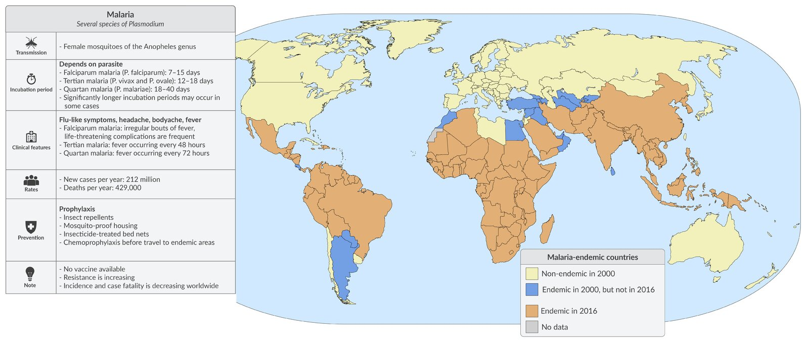

Epidemiology of malaria

Epidemiological data refers to the US, unless otherwise specified.

---

## Etiology

* <u>Pathogen</u>: <u>Plasmodia</u>

* <u>Eukaryotic</u> <u>parasites</u> (belonging to the Sporozoa group)

* Species that affect humans [[2]](https://coursology-qbank.com/amboss/article/9H1NsR0)[[3]](https://coursology-qbank.com/amboss/article/wH1hsR0)[[4]](https://coursology-qbank.com/amboss/article/DH11sR0)[[5]](https://coursology-qbank.com/amboss/article/xH1EsR0)

* Plasmodium falciparum; : most <u>virulent</u> and causes the most severe disease, i.e., falciparum malaria; dominant in Africa

* Plasmodium vivax: the most common of the less <u>virulent</u> species and causes milder disease; dominant in <u>endemic</u> areas outside Subsaharan Africa (e.g., Southeast Asia)

* Plasmodium ovale;  and Plasmodium malariae: less common and cause milder disease  [[4]](https://coursology-qbank.com/amboss/article/DH11sR0)

* Plasmodium knowlesi: found in Southeast Asia and can cause <u>severe malaria</u>; possibly <u>zoonotic</u>  and often misidentified as other species due to morphological similarities. [[6]](https://coursology-qbank.com/amboss/article/CH1qsR0)

* <u>Vector</u>: the female Anopheles mosquito

* Host: humans

* Partial resistance against malaria [[7]](https://coursology-qbank.com/amboss/article/4Va3uj)

* Carriers of sickle‑cell mutation

* Individuals with either certain <u>Duffy antigens</u> or no <u>Duffy antigens</u> are resistant to <u>P. vivax</u> and P. knowlesi  [[8]](https://coursology-qbank.com/amboss/article/2nbTs8)

* Other <u>hemoglobinopathies</u> (e.g., <u>thalassemia</u>, <u>HbC</u>)

* Infection with malaria subsequently leads to the development of specific <u>Plasmodium</u> <u>antibodies</u> that result in partial <u>immunity</u> for a limited amount of time (less than a year)

|  Classic disease and fever patterns of different plasmodium species  [[9]](https://coursology-qbank.com/amboss/article/kIYm1q)[[10]](https://coursology-qbank.com/amboss/article/GobBWu). |  |  |
| --- | --- | --- |
|  Different species of <u>plasmodium</u> [[11]](https://coursology-qbank.com/amboss/article/kVamuj)[[12]](https://coursology-qbank.com/amboss/article/Y1Yn2L)  | Disease | <u>Fever</u> spikes |
|  <u>P. vivax</u> <u>P. ovale</u>  |  * <u>Tertian malaria</u> (usually less severe)   |  * Every 48 hours   |
| <u>P. malariae</u> |  * <u>Quartan malaria</u> (usually less severe)   |  * Every 72 hours   |
| <u>P. falciparum</u> |  * <u>Falciparum malaria</u> (most severe form; also known as <u>malignant tertian malaria</u>)   |  * Irregular   |
| P. knowlesi |  * Quotidian malaria   |  * Every 24 hours   |

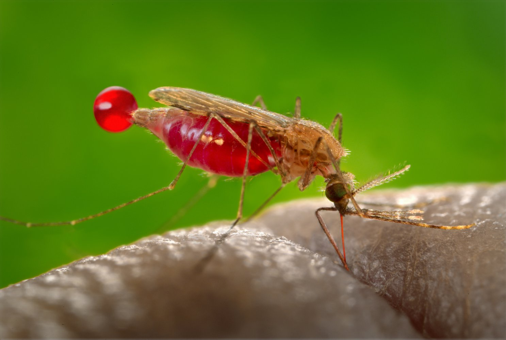

Anopheles mosquito sucking blood

---

## Pathophysiology

### Life cycle of Plasmodium (simplified) [[13]](https://coursology-qbank.com/amboss/article/OVaIuj)

Lifecycle of Plasmodium falciparum (Malaria)

#### Asexual development in humans

1. * Transmission of <u>Plasmodium</u> sporozoites  via Anopheles mosquito bite → sporozoites travel through the bloodstream to the <u>liver</u> of the host
2. * <u>Liver</u>: sporozoites enter <u>hepatocytes</u> → sporozoites multiply asexually → schizonts  are formed containing thousands of merozoites  → release of <u>merozoites</u> into the bloodstream
3. * <u>Circulatory system</u> (two possible outcomes)

* <u>Merozoites</u> enter <u>erythrocytes</u> → maturation to trophozoites  → red cell schizonts are formed containing thousands of <u>merozoites</u> → release of <u>merozoites</u> into the bloodstream (which causes <u>fever</u> and other manifestations of malaria) → penetration of <u>erythrocytes</u> recurs

* <u>Merozoites</u> enter <u>erythrocytes</u> → differentiation into <u>gametocytes</u> (male or female)

#### <u>Sexual development</u> in female Anopheles mosquito

* A mosquito bites an infected human and ingests <u>gametocytes</u> → <u>gametocytes</u> mature within the mosquito intestines → sporozoites are formed and these migrate to the salivary glands → transmission of sporozoites to humans via mosquito bite

* See also “<u>Developmental stages of Plasmodium in RBCs</u>.”

---

## Clinical features

### <u>Incubation period</u>

* 7–30 days [[14]](https://coursology-qbank.com/amboss/article/X1Y92L)

> [!TIP]
> The <u>incubation period</u> of malaria is a minimum of seven days; if <u>fever</u> occurs before the seventh day following exposure in an <u>endemic</u> region, it is most likely not due to malaria.

### Course

* Infection → asymptomatic parasitemia → uncomplicated illness → <u>severe malaria</u> → <u>death</u> 

* Asymptomatic parasitemia: Especially in <u>endemic</u> regions, cases of asymptomatic <u>plasmodia</u> carriers are reported. [[15]](https://coursology-qbank.com/amboss/article/bmbHV8)

* Infections with <u>P. vivax</u>, <u>P. ovale</u>, and <u>P. malariae</u> typically have milder symptoms; , involve fewer organs (<u>CNS</u> or gastrointestinal symptoms are rare), and have a markedly lower risk of causing <u>severe malaria</u>. [[16]](https://coursology-qbank.com/amboss/article/fnbks8)

* Following the successful treatment of <u>tertian malaria</u>, dormant <u>P. ovale</u> or <u>P. vivax</u> forms (hypnozoites) may remain in the <u>liver</u> and can cause relapse after months or even years. [[16]](https://coursology-qbank.com/amboss/article/fnbks8)

### General symptoms [[1]](https://coursology-qbank.com/amboss/article/jVa_8j)[[14]](https://coursology-qbank.com/amboss/article/X1Y92L)

* Flu‑like symptoms, <u>headache</u>

* <u>Diaphoresis</u>

* High <u>fever</u>: <u>Fever</u> spikes occurring at regular intervals are no longer commonly observed. ;  [[9]](https://coursology-qbank.com/amboss/article/kIYm1q)[[10]](https://coursology-qbank.com/amboss/article/GobBWu)

* Tertian malaria: periodic <u>fever</u> spikes every 48 hrs

* Quartan malaria: periodic <u>fever</u> spikes every 72 hrs

* <u>Malignant tertian malaria</u> (associated with <u>falciparum malaria</u>): irregular <u>fever</u> spikes without a noticeable rhythm

### Organ-specific symptoms [[1]](https://coursology-qbank.com/amboss/article/jVa_8j)[[14]](https://coursology-qbank.com/amboss/article/X1Y92L)

* Blood

* <u>Thrombocytopenia</u>: increased bleeding risk

* <u>Hemolytic anemia</u>: <u>weakness</u>, paleness, <u>dizziness</u>

* Gastrointestinal

* <u>Nausea</u>, <u>vomiting</u>

* <u>Diarrhea</u>, abdominal <u>pain</u>

* <u>Liver</u>: : <u>hepatosplenomegaly</u>, discrete <u>jaundice</u>

* Renal: flank <u>pain</u>, <u>oliguria</u>, <u>hemoglobinuria</u>

* Cardiac: <u>heart failure</u>

* <u>CNS</u>: <u>hallucinations</u>, confusion, impaired consciousness, <u>seizures</u>, <u>coma</u>

> [!WARNING]
> Impaired consciousness, <u>shock</u>, and abnormal bleeding are signs of <u>severe malaria</u> that requires immediate IV treatment. [[17]](https://coursology-qbank.com/amboss/article/Vf1GOT0)

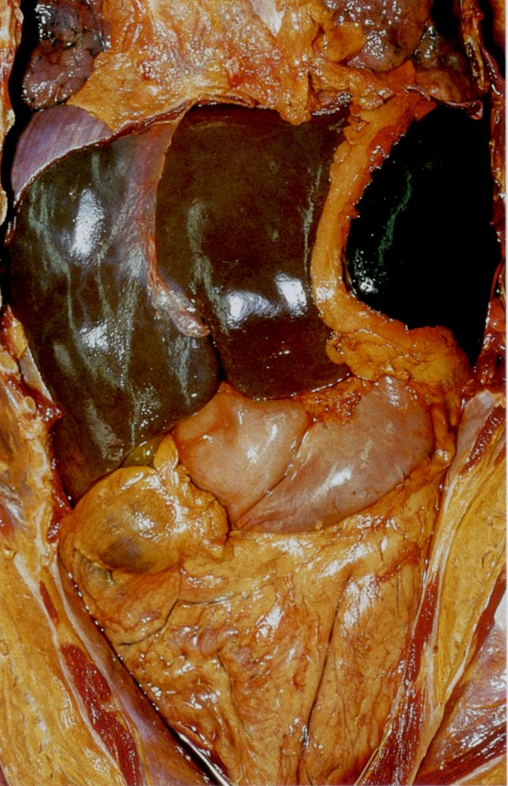

Abdomen of a patient with malaria

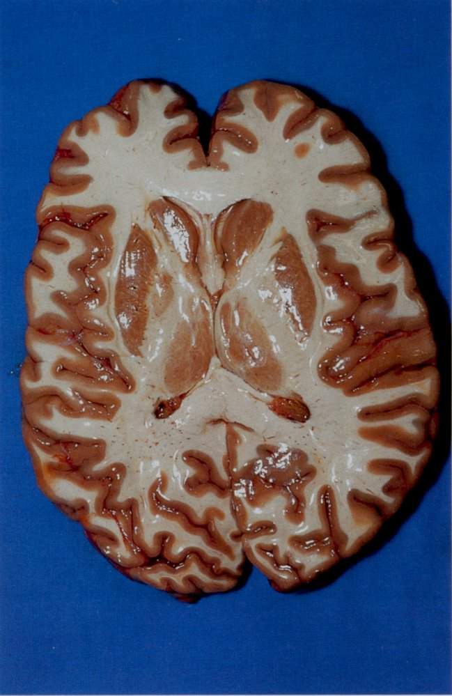

Horizontal section of cerebrum

---

## Diagnosis

### Approach

* Focused clinical evaluation [[18]](https://coursology-qbank.com/amboss/article/Li1wHg0)[[19]](https://coursology-qbank.com/amboss/article/_2154T0)[[20]](https://coursology-qbank.com/amboss/article/Yf1nkT0)[[21]](https://coursology-qbank.com/amboss/article/Tf16lT0)

* Time of travel to regions where malaria is <u>endemic</u> and previous <u>chemoprophylaxis</u>

* Evaluate for signs of <u>severe malaria</u>.

* Routine <u>laboratory studies</u>: <u>CBC</u>, <u>CMP</u>, <u>LFTs</u>, and <u>coagulation panel</u> to evaluate for organ dysfunction [[17]](https://coursology-qbank.com/amboss/article/Vf1GOT0)

* Parasitological testing: confirms the presence and determines the species of <u>Plasmodia</u>

* Microscopic examination of thick and thin <u>blood smears</u> (<u>gold standard</u>) [[19]](https://coursology-qbank.com/amboss/article/_2154T0)

* <u>Antigen</u> detection test (more rapid but less sensitive) [[19]](https://coursology-qbank.com/amboss/article/_2154T0)

> [!TIP]
> Malaria can present in many different ways and is therefore often misdiagnosed. In patients with <u>fever</u> who have recently traveled to <u>endemic</u> regions, malaria must always be considered. [[22]](https://coursology-qbank.com/amboss/article/PL1WBh0)

### Routine <u>laboratory studies</u> [[21]](https://coursology-qbank.com/amboss/article/Tf16lT0)

Used to assess the severity of malaria and identify concurrent diseases, see also “<u>Criteria for severe malaria</u>.”

* <u>CBC</u>: Changes in multiple parameters may occur. [[23]](https://coursology-qbank.com/amboss/article/Qf1uNT0)

* <u>Hemolytic anemia</u>: ↓ <u>Hb</u>, ↓ <u>haptoglobin</u>, ↑ <u>LDH</u>, ↑ <u>indirect bilirubin</u>, ↑ <u>reticulocytes</u>

* <u>Thrombocytopenia</u>

* <u>Leukocytosis</u> or <u>leukopenia</u> are uncommon except in severe disease.

* <u>CMP</u>: <u>Hypoglycemia</u> and <u>AKI</u> can occur in <u>severe malaria</u>. [[17]](https://coursology-qbank.com/amboss/article/Vf1GOT0)

* <u>Urinalysis</u>: <u>Hemoglobinuria</u> may occur with <u>intravascular hemolysis</u>.  [[16]](https://coursology-qbank.com/amboss/article/fnbks8)[[17]](https://coursology-qbank.com/amboss/article/Vf1GOT0)

* Other (as clinically indicated): <u>ABG</u> , <u>type and screen</u> , blood and <u>urine cultures</u>  <u>CSF analysis</u>  [[19]](https://coursology-qbank.com/amboss/article/_2154T0)[[24]](https://coursology-qbank.com/amboss/article/7f14nT0)

### Parasitological testing for malaria [[16]](https://coursology-qbank.com/amboss/article/fnbks8)[[19]](https://coursology-qbank.com/amboss/article/_2154T0)[[25]](https://coursology-qbank.com/amboss/article/if1JNT0)

> [!WARNING]
> <u>False-negative</u> test results can occur with RDTs and <u>blood smears</u>, especially when <u>malaria parasitemia</u> is low. Repeat parasitological testing when clinical suspicion is high. [[21]](https://coursology-qbank.com/amboss/article/Tf16lT0)[[25]](https://coursology-qbank.com/amboss/article/if1JNT0)[[26]](https://coursology-qbank.com/amboss/article/ls1vER0)

#### Rapid diagnostic tests (RDTs)

* Detects specific malaria <u>antigens</u> (e.g., HRP2, pLDH, <u>aldolase</u>)  [[19]](https://coursology-qbank.com/amboss/article/_2154T0)[[25]](https://coursology-qbank.com/amboss/article/if1JNT0)

* Allows for quick diagnosis if high‑quality microscopy is unavailable or delayed. [[25]](https://coursology-qbank.com/amboss/article/if1JNT0)

* Confirm all RDT results via microscopy when available.  [[22]](https://coursology-qbank.com/amboss/article/PL1WBh0)[[25]](https://coursology-qbank.com/amboss/article/if1JNT0)

> [!TIP]
> RDTs can detect <u>P. falciparum</u> but typically cannot distinguish between other species of <u>Plasmodium</u>. [[22]](https://coursology-qbank.com/amboss/article/PL1WBh0)

#### <u>Blood smear</u>

<u>Gold standard test</u>: allows for visualization of <u>parasites</u> within <u>RBCs</u> via microscopy to confirm malaria diagnosis  [[22]](https://coursology-qbank.com/amboss/article/PL1WBh0)

* Thick <u>blood smear</u>: high <u>sensitivity</u>; best initial test  [[10]](https://coursology-qbank.com/amboss/article/GobBWu)[[19]](https://coursology-qbank.com/amboss/article/_2154T0)

* Thin <u>blood smear</u>: lower <u>sensitivity</u>, high <u>specificity</u>; <u>confirmatory test</u> [[27]](https://coursology-qbank.com/amboss/article/vj1AXS0)

* Allows identification of <u>Plasmodium</u> species [[19]](https://coursology-qbank.com/amboss/article/_2154T0)

* Enables calculation of malaria parasitemia: the percentage of <u>RBCs</u> containing a <u>Plasmodium</u> organism; used to classify severity and monitor response to therapy. [[16]](https://coursology-qbank.com/amboss/article/fnbks8)[[17]](https://coursology-qbank.com/amboss/article/Vf1GOT0)

* Findings include:

* Schuffner granules (fine, brick-red dots) within <u>RBCs</u> infected with <u>P. vivax</u> and <u>P. ovale</u>   [[10]](https://coursology-qbank.com/amboss/article/GobBWu)

* Crescent-shaped <u>gametocytes</u> in individuals infected with <u>P. falciparum</u>

* Evaluation of a negative <u>blood smear</u> [[16]](https://coursology-qbank.com/amboss/article/fnbks8)

* Patients may become symptomatic before <u>parasites</u> can be seen on the <u>blood smear</u>.

* If an initial test result is negative, <u>blood smears</u> should be repeated every 12–24 hours for a total of 3 tests.

* If all three sets are negative, malaria can be excluded as the diagnosis.

> [!WARNING]
> A single negative <u>blood smear</u> does not rule out malaria. Repeat three sets of <u>blood smears</u> (one set every 12–24 hours) before ruling out the diagnosis. [[16]](https://coursology-qbank.com/amboss/article/fnbks8)[[22]](https://coursology-qbank.com/amboss/article/PL1WBh0)

|  Developmental stages of Plasmodium in RBCs [[13]](https://coursology-qbank.com/amboss/article/OVaIuj)  |  |  |
| --- | --- | --- |
|  | All <u>Plasmodium</u> spp. | <u>Plasmodium falciparum</u> |
| Immature <u>trophozoite</u> |  * Thick, dark purple ring‑shaped <u>inclusions</u> (similar to <u>signet ring cell carcinoma</u>)   |  * Fine rings   |
| Mature <u>trophozoite</u> |  * Ameboid rings   |  * Finer rings in comparison to immature <u>trophozoites</u>   |
| Immature schizont |   * Irregular round, ameboid  * Almost filling the entire <u>erythrocytes</u>    |  * Hardly detectable in the blood   |
| Mature schizont |   * Conglomerate of 6–24 <u>merozoites</u> (round with central darkening)  * Develop from an immature schizont    |  |
|  Gametocytes  |   * Macrogamete   * Mature female (sexual) form  * Visible as a round structure filling almost the entire <u>erythrocyte</u>  * Microgamete   * Mature male (sexual) form  * Visible as a round structure within the <u>erythrocyte</u>  * Smaller and has a brighter <u>nucleus</u> than macrogametes    |  |

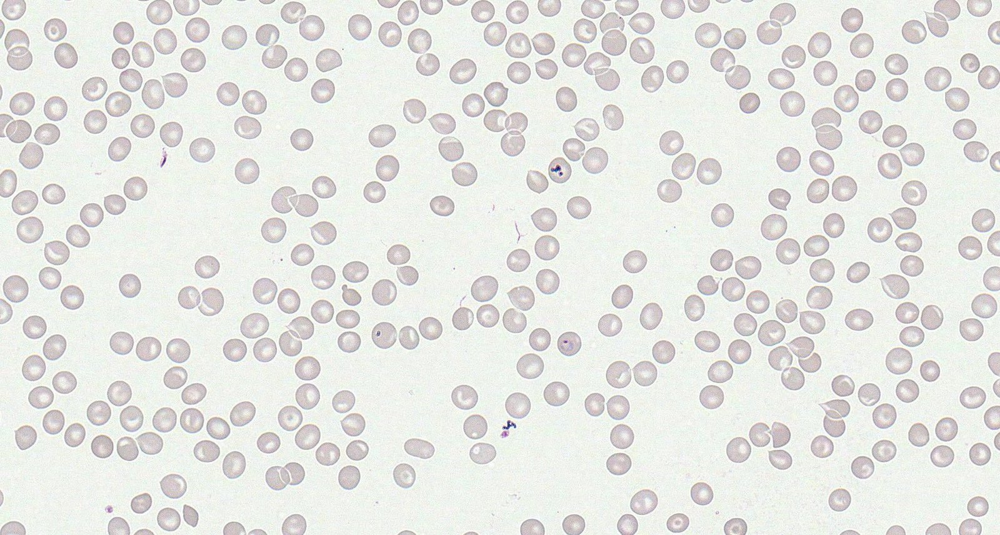

Malaria (peripheral blood smear)

Tertian malaria: immature trophozoite in Plasmodium vivax infection

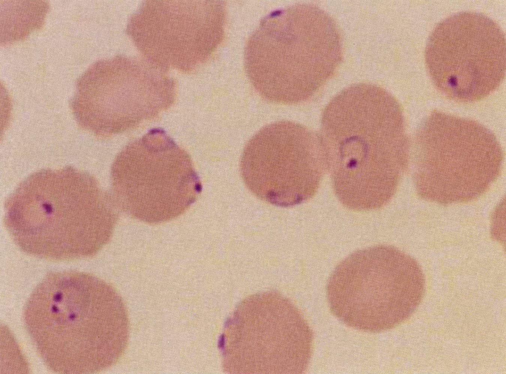

Falciparum malaria: immature trophozoite in Plasmodium falciparum infection

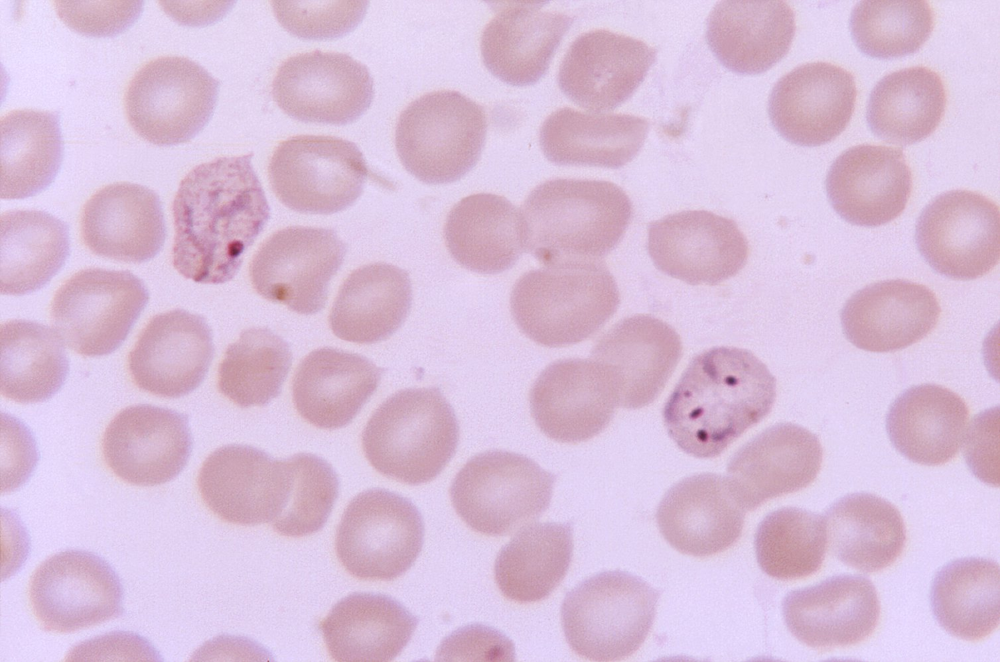

Immature and mature trophozoite (Plasmodium vivax)

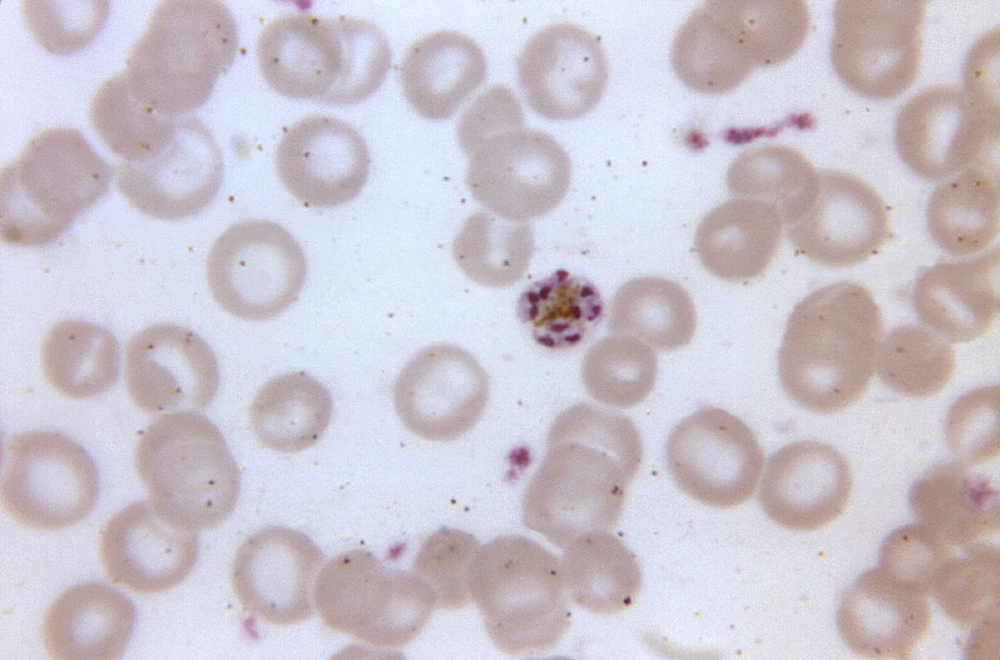

Mature schizont (Plasmodium malariae)

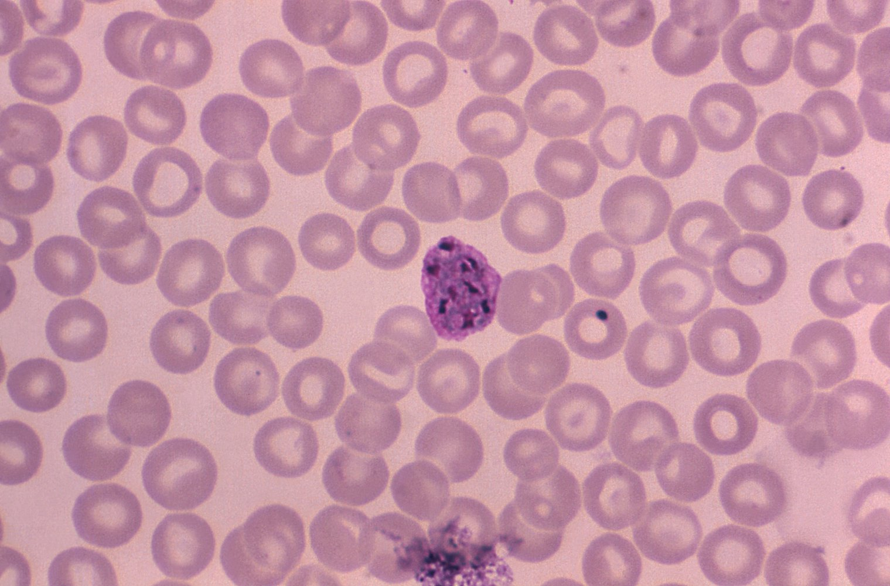

Red cell schizont (P. vivax)

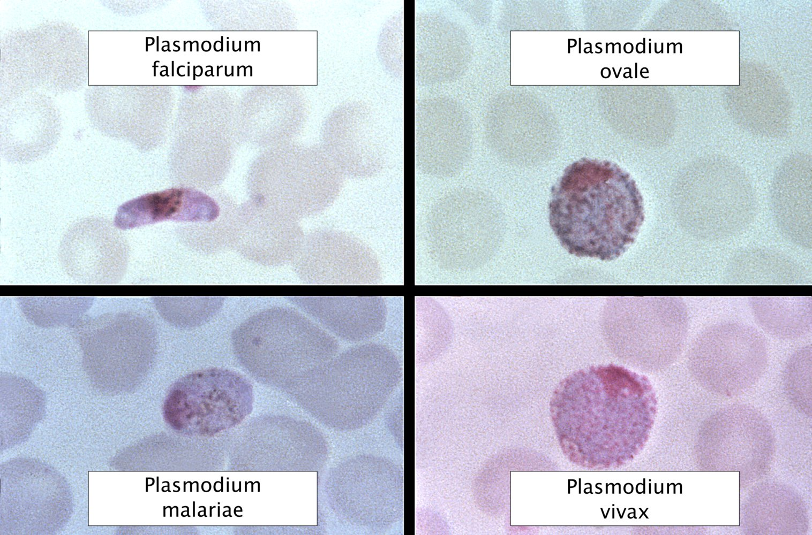

Macrogametocytes of different types of Plasmodium

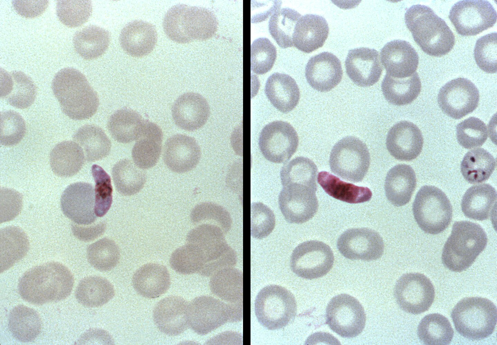

Microgametocyte and macrogametocyte of Plasmodium falciparum

#### Other studies

* <u>PCR</u> [[25]](https://coursology-qbank.com/amboss/article/if1JNT0)[[28]](https://coursology-qbank.com/amboss/article/Ns1-ER0)

* Identifies species of <u>Plasmodium</u>; useful for suspected P. knowlesi infection

* High <u>sensitivity</u> but expensive and usually only available at reference laboratories

* <u>Serological testing</u>

* Positive serological results indicate prior exposure to <u>Plasmodium</u>. [[16]](https://coursology-qbank.com/amboss/article/fnbks8)

* Not recommended in acute malaria due to length of time for <u>antibodies</u> to reach detectable levels [[25]](https://coursology-qbank.com/amboss/article/if1JNT0)

---

## Classification

### <u>Uncomplicated malaria</u>

* Definition: symptomatic, diagnostically proven malaria without features of <u>severe malaria</u> [[21]](https://coursology-qbank.com/amboss/article/Tf16lT0)[[22]](https://coursology-qbank.com/amboss/article/PL1WBh0)

* Etiology: can be caused by all <u>Plasmodium</u> species

* Treatment: See “<u>Treatment of uncomplicated malaria</u>.”

### Severe malaria (<u>complicated malaria</u>) [[14]](https://coursology-qbank.com/amboss/article/X1Y92L)[[17]](https://coursology-qbank.com/amboss/article/Vf1GOT0)[[19]](https://coursology-qbank.com/amboss/article/_2154T0)

* Description: potentially fatal manifestation or complication of malaria

* Etiology: most commonly a result of <u>falciparum malaria</u>

* Pathophysiology: Infected <u>erythrocytes</u> occlude <u>capillaries</u>, which can lead to severe organ dysfunction.

* Criteria for severe malaria: ≥ 1 of the following in a patient with proven malaria  [[16]](https://coursology-qbank.com/amboss/article/fnbks8)[[29]](https://coursology-qbank.com/amboss/article/dzdo7s0)

* Clinical findings

* General: <u>prostration</u>

* <u>CNS</u>: <u>seizures</u> (> 2 <u>convulsions</u> in 24 hours), impaired consciousness  [[29]](https://coursology-qbank.com/amboss/article/dzdo7s0)

* Cardiovascular: <u>shock</u> (e.g., <u>hypotension</u>, <u>capillary refill time</u> ≥ 3 seconds)

* Pulmonary: <u>respiratory distress</u>, <u>pulmonary edema</u>

* Gastrointestinal: <u>jaundice</u>

* Hematologic: significant bleeding

* Laboratory findings

* <u>Severe anemia</u>: < 7 g/dL in adults, ≤ 5 g/dL in children [[29]](https://coursology-qbank.com/amboss/article/dzdo7s0)

* <u>Hypoglycemia</u>: < 40 mg/dL

* <u>Acidosis</u>: <u>base deficit</u> > 8 mEq/L, <u>bicarbonate</u> < 15 mEq/L, or <u>lactate</u> ≥ 5 mEq/L

* <u>Acute kidney injury</u>: <u>creatinine</u> > 3 mg/dL or <u>urea</u> > 56 mg/dL

* <u>Hyperbilirubinemia</u>: <u>bilirubin</u> > 3 mg/dL

* High <u>malaria parasitemia</u>  [[16]](https://coursology-qbank.com/amboss/article/fnbks8)[[29]](https://coursology-qbank.com/amboss/article/dzdo7s0)

* Treatment: See “<u>Treatment of severe malaria</u>.”

---

## Treatment

See “Special patient groups” for management of <u>malaria in children</u> and pregnant individuals.

### Approach [[16]](https://coursology-qbank.com/amboss/article/fnbks8)[[19]](https://coursology-qbank.com/amboss/article/_2154T0)[[21]](https://coursology-qbank.com/amboss/article/Tf16lT0)[[22]](https://coursology-qbank.com/amboss/article/PL1WBh0)

* Consult infectious disease service early.

* Check for <u>criteria for severe malaria</u>.

* <u>Treat severe malaria</u> immediately with IV <u>artesunate</u>, following <u>ABCDE approach</u>.

* <u>Treat uncomplicated malaria</u> based on species, resistance patterns, and degree of <u>chemoprophylaxis</u>.

* Determine disposition

* <u>Severe malaria</u>: <u>ICU</u> admission and <u>supportive care</u>

* <u>Uncomplicated malaria</u>: Consider admission for observation and serial monitoring of <u>parasite</u> count.

* Report all confirmed malaria to <u>public health</u> authorities.

### Treatment of severe malaria [[16]](https://coursology-qbank.com/amboss/article/fnbks8)[[19]](https://coursology-qbank.com/amboss/article/_2154T0)[[21]](https://coursology-qbank.com/amboss/article/Tf16lT0)

* Pharmacotherapy

* Start IV <u>artesunate</u> DOSAGE immediately.  [[10]](https://coursology-qbank.com/amboss/article/GobBWu)[[16]](https://coursology-qbank.com/amboss/article/fnbks8)[[21]](https://coursology-qbank.com/amboss/article/Tf16lT0)

* Repeat <u>malaria parasite density</u> after 3rd dose of <u>artesunate</u>.

* > 1%: Continue IV <u>artesunate</u>

* ≤ 1%: Switch to oral <u>antimalarials</u> under specialist guidance 

* <u>Artemether-lumefantrine</u> (preferred)

* OR <u>atovaquone-proguanil</u>

* OR <u>quinidine</u> (in the US; <u>quinine</u> elsewhere)

* <u>Supportive care</u> and monitoring

* Manage <u>fever</u> with <u>acetaminophen</u>, tepid sponging, and/or cooling blankets.

* <u>Treat acute seizures</u>, e.g., with IV or rectal <u>diazepam</u>

* Avoid aggressive <u>fluid replacement</u> and rapid fluid boluses.

* Rule out superadded bacterial infection: Perform <u>fever workup</u>, e.g., <u>blood cultures</u>.  [[21]](https://coursology-qbank.com/amboss/article/Tf16lT0)

* Prevent <u>hypoglycemia</u>: Check blood <u>glucose</u> every 4 hours.  [[21]](https://coursology-qbank.com/amboss/article/Tf16lT0)

* Monitor <u>Hb</u> every 6–12 hours and renal function daily.  [[9]](https://coursology-qbank.com/amboss/article/kIYm1q)

* Measure <u>malaria parasitemia</u> on days 7 and 28 to monitor response to therapy. [[25]](https://coursology-qbank.com/amboss/article/if1JNT0)

* Disposition: Admit to <u>ICU</u>.

> [!TIP]
> The <u>CDC</u> recommends contacting their Malaria Hotline for all patients with <u>severe malaria</u>. [[16]](https://coursology-qbank.com/amboss/article/fnbks8)

> [!WARNING]
> <u>Severe malaria</u> is a <u>medical emergency</u>; without appropriate treatment, mortality is nearly 100%. [[21]](https://coursology-qbank.com/amboss/article/Tf16lT0)

### Treatment of uncomplicated malaria [[16]](https://coursology-qbank.com/amboss/article/fnbks8)[[19]](https://coursology-qbank.com/amboss/article/_2154T0)[[21]](https://coursology-qbank.com/amboss/article/Tf16lT0)

* Agent selection based on: [[16]](https://coursology-qbank.com/amboss/article/fnbks8)

* Infecting <u>Plasmodium</u> species

* Prior use of <u>chemoprophylaxis</u>

* Likelihood of <u>chloroquine</u>-resistance

* See “<u>Overview of treatment of uncomplicated malaria</u>.”

* Additional considerations in <u>P. vivax</u> and <u>P. ovale</u> [[16]](https://coursology-qbank.com/amboss/article/fnbks8)

* Check <u>G6PD</u> activity levels.

* Give <u>primaquine</u> or <u>tafenoquine</u> to eradicate <u>hypnozoites</u> dormant in <u>hepatocytes</u>.

* Disposition: Consider admission for observation and serial monitoring of <u>parasite</u> concentration. [[16]](https://coursology-qbank.com/amboss/article/fnbks8)[[19]](https://coursology-qbank.com/amboss/article/_2154T0)

* <u>P. falciparum</u> or P. knowlesi infections: Patients are typically hospitalized.

* <u>P. vivax</u>, P.ovale, <u>P. malariae</u> infections: Patients who tolerate PO medicine may receive outpatient treatment. [[22]](https://coursology-qbank.com/amboss/article/PL1WBh0)

|  Overview of treatment of uncomplicated malaria in adults [[30]](https://coursology-qbank.com/amboss/article/5H1iIR0)  |  |  |
| --- | --- | --- |
| <u>Plasmodium</u> species | Acquired area | Treatment |
|  <u>P. vivax</u>, <u>P. ovale</u> (<u>tertian malaria</u>)  |  No <u>chloroquine</u> resistance   |   * <u>Chloroquine</u> DOSAGE  OR <u>hydroxychloroquine</u> DOSAGE  * PLUS antirelapse treatment: <u>primaquine</u> OR <u>tafenoquine</u>    |
| With <u>chloroquine</u> resistance |   * <u>Artemether-lumefantrine</u> DOSAGE  * OR <u>atovaquone-proguanil</u> DOSAGE  * OR <u>quinine</u> DOSAGE PLUS <u>doxycycline</u> DOSAGE  * OR <u>quinine</u> DOSAGE PLUS <u>tetracycline</u> DOSAGE  * OR <u>quinine</u> DOSAGE PLUS <u>clindamycin</u> DOSAGE  * OR <u>mefloquine</u> DOSAGE (if no other options are available)  * PLUS antirelapse treatment: <u>primaquine</u> OR <u>tafenoquine</u>    |  |
| Uncomplicated <u>falciparum malaria</u> |  No <u>chloroquine</u> resistance  |  * <u>Chloroquine</u> DOSAGE OR <u>hydroxychloroquine</u> DOSAGE   |
| With <u>chloroquine</u> resistance |   * <u>Artemether-lumefantrine</u> DOSAGE  * OR <u>atovaquone‑proguanil</u> DOSAGE  * OR <u>mefloquine</u> DOSAGE  [[16]](https://coursology-qbank.com/amboss/article/fnbks8)  * OR <u>quinine</u> DOSAGE PLUS <u>doxycycline</u>DOSAGE  * OR <u>quinine</u> DOSAGE PLUS <u>tetracycline</u>DOSAGE  * OR <u>quinine</u> DOSAGE PLUS <u>clindamycin</u>DOSAGE    |  |
|  <u>P. malariae</u>, P. knowlesi (<u>quartan malaria</u>)  [[16]](https://coursology-qbank.com/amboss/article/fnbks8)  |  |   * <u>Chloroquine</u> or <u>hydroxychloroquine</u>  * OR <u>artemether-lumefantrine</u> DOSAGE  * OR <u>atovaquone-proguanil</u> DOSAGE  * OR <u>quinine</u> DOSAGE PLUS <u>doxycycline</u> DOSAGE  * OR <u>quinine</u> DOSAGE PLUS <u>tetracycline</u> DOSAGE  * OR <u>quinine</u> DOSAGE PLUS <u>clindamycin</u> DOSAGE  * OR <u>mefloquine</u> DOSAGE    |

> [!WARNING]
> Do not use medications that the patient has already used for <u>chemoprophylaxis</u>. [[16]](https://coursology-qbank.com/amboss/article/fnbks8)

> [!TIP]
> <u>Plasmodium falciparum</u> and, more recently, <u>Plasmodium vivax</u> are becoming increasingly resistant to <u>chloroquine</u>.

---

## Antimalarial medications

### Overview of antimalarial drugs

| Indications and pharmacology of <u>antimalarial medication</u> |  |  |  |  |
| --- | --- | --- | --- | --- |
| Agents | Indications |  | Mechanism of action |  Most common adverse effects [[31]](https://coursology-qbank.com/amboss/article/d1YofL)[[32]](https://coursology-qbank.com/amboss/article/V1YGfL)[[33]](https://coursology-qbank.com/amboss/article/e1YxfL)[[34]](https://coursology-qbank.com/amboss/article/jT1_qT0)  |
| <u>Chloroquine</u> |  * Treatment and prophylaxis of malaria due to <u>P. malariae</u>, <u>P. ovale</u>, or <u>P. vivax</u>   |  * <u>Porphyria cutanea tarda</u>   |   * Drug accumulation in the <u>parasite</u>'s food <u>vacuole</u> → inhibition of <u>heme</u> polymerization → lysis of membranes  * Interference with <u>antigen</u> processing → antirheumatic effects    |   * Gastrointestinal discomfort  * <u>Nausea</u> with cramps (most common)  * Irreversible bilateral <u>retinopathy</u> (<u>bull's eye maculopathy</u>)  * <u>Pruritus</u>: most commonly seen in dark-skinned individuals  [[35]](https://coursology-qbank.com/amboss/article/elbxDF)  * <u>CNS</u>: <u>agitation</u>, <u>anxiety</u>, confusion    |
| <u>Hydroxychloroquine</u> |   * <u>Rheumatoid arthritis</u>  * <u>SLE</u>, <u>DLE</u>    |  |  |  |
| <u>Doxycycline</u>/ <u>tetracycline</u> |   * <u>Chloroquine</u> resistant <u>P. vivax</u> infection  * <u>Chloroquine</u> resistant <u>P. ovale</u> infection  * P. malariea infection  * P. knowlesi infection    |  * <u>Chloroquine</u>-resistant uncomplicated <u>falciparum malaria</u>   |  * Bind to bacterial <u>ribosomal</u> <u>30S subunit</u> → inhibition of <u>protein synthesis</u>   |   * <u>Photosensitivity</u>  * <u>Nephrotoxicity</u> and <u>hepatotoxicity</u>  * Damage to <u>mucous membranes</u> (should be taken with a lot of water)    |
| Mefloquine |  * Thought to inhibit <u>protein synthesis</u> of <u>Plasmodium falciparum</u> by targeting the 80S <u>ribosome</u> [[36]](https://coursology-qbank.com/amboss/article/sWct5Y0)   |   * Gastrointestinal discomfort  * <u>Rash</u>  * <u>CNS</u>: <u>dizziness</u>, confusion, nightmares, <u>hallucinations</u>, <u>seizures</u>    |  |  |
| <u>Quinine</u> |  * <u>Falciparum malaria</u>   |  * Similar to <u>chloroquine</u> [[37]](https://coursology-qbank.com/amboss/article/GWcB5Y0)[[38]](https://coursology-qbank.com/amboss/article/FWcgMY0)   |   * Cinchonism: a group of adverse effects including <u>nausea</u>, <u>dizziness</u>, <u>headache</u>, <u>tinnitus</u>, and visual changes.  * Gastrointestinal discomfort  * <u>Fever</u>, flushing  * <u>CNS</u>: <u>headache</u>, mental status altered  * <u>Hypoglycemia</u> [[19]](https://coursology-qbank.com/amboss/article/_2154T0)    |  |
| Artemether-lumefantrine |   * Gastrointestinal discomfort  * <u>Prolonged QT interval</u>    |  |  |  |
| Atovaquone-proguanil |   * <u>Chloroquine</u>-resistant uncomplicated <u>falciparum malaria</u>  * <u>Severe falciparum malaria</u>    |  * Inhibition of <u>mitochondrial</u> <u>electron transport chain</u> → ↓ <u>ATP</u> and <u>nucleic acid</u> synthesis [[39]](https://coursology-qbank.com/amboss/article/tWcXMY0)   |   * Gastrointestinal discomfort  * Rarely: <u>liver</u> failure, <u>anemia</u>    |  |
| <u>Quinidine</u> |  * <u>Severe falciparum malaria</u>   |  |   * Moderate blockade of Na+ channels  * Weak blockade of the <u>K+</u> channel    |   * Gastrointestinal discomfort  * <u>Rash</u>  * <u>Palpitations</u>, <u>angina pectoris</u>  * <u>CNS</u>: <u>dizziness</u>, fatigue, <u>headache</u>    |
| Artesunate |  * Prodrug: The active substance, DHA, generates <u>free radicals</u> that inhibit the synthesis of <u>proteins</u> and <u>nucleic acid</u>. [[40]](https://coursology-qbank.com/amboss/article/8WcOMY0)   |  * Post-artemisinin delayed <u>hemolytic anemia</u>   |  |  |
| Primaquine |   * <u>P. vivax</u> infection  * <u>P. ovale</u> infection    |  |  * Thought to involve the inhibition of the parasitic <u>electron transport chain</u> [[41]](https://coursology-qbank.com/amboss/article/uWcpMY0)   |  * <u>Hemolytic crisis</u> in individuals with <u>G6PD deficiency</u> (must be ruled out before initiating treatment) [[34]](https://coursology-qbank.com/amboss/article/jT1_qT0)   |

> [!WARNING]
> <u>Mefloquine</u> should not be prescribed for <u>malaria prophylaxis</u> in patients with a history of <u>seizures</u>, active or recent <u>depression</u>, <u>generalized anxiety disorder</u>, <u>psychosis</u>, <u>schizophrenia</u>, or other major psychiatric disorders, due to the risk of severe neuropsychiatric side effects.

Targets of antimalarial drugs

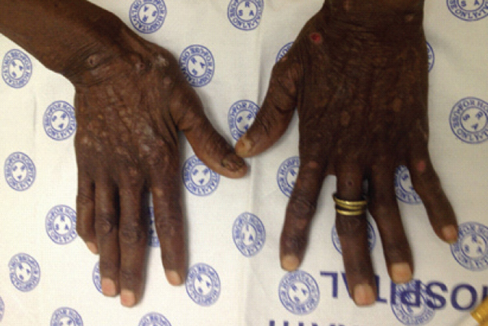

Porphyria cutanea tarda

---

## Prevention

### Mosquito bite prevention [[42]](https://coursology-qbank.com/amboss/article/oVa0vj)

* Avoid exposure

* Exercise particular caution during peak biting periods  [[43]](https://coursology-qbank.com/amboss/article/LVawEj)

* Mosquito nets

* Protective clothing (covering most of the <u>skin</u>, light colors)

* Mosquito repellent, such as DEET (N,N-diethyl-meta-toluamide)

* Mosquito control

* Reduce breeding sites (e.g., eliminate pools of water, optimize plant watering)

* Insecticide spraying

### Malaria prophylaxis [[44]](https://coursology-qbank.com/amboss/article/SzdyHs0)

* Should be initiated before traveling to regions with a high risk of malaria (e.g., tropical Africa, Asia, and Central and South America)

* Drug of choice is based on the region of travel and <u>Plasmodium</u> species.

* All malaria-<u>endemic</u> regions (including those with <u>chloroquine</u>-resistant <u>P. falciparum</u> )

* <u>Atovaquone-proguanil</u> DOSAGE [[44]](https://coursology-qbank.com/amboss/article/SzdyHs0)

* <u>Doxycycline</u> DOSAGE [[44]](https://coursology-qbank.com/amboss/article/SzdyHs0)

* <u>Mefloquine</u> DOSAGE [[44]](https://coursology-qbank.com/amboss/article/SzdyHs0)

* <u>Tafenoquine</u> DOSAGE

* Additional options for regions without <u>chloroquine</u> resistance 

* <u>Chloroquine</u> DOSAGE [[44]](https://coursology-qbank.com/amboss/article/SzdyHs0)

* <u>Hydroxychloroquine</u> DOSAGE [[44]](https://coursology-qbank.com/amboss/article/SzdyHs0)

* <u>Primaquine</u> (<u>off-label</u>) DOSAGE: if traveling to <u>P. vivax</u>-dominant regions (> 90% <u>P. vivax</u>) for < 6 months [[44]](https://coursology-qbank.com/amboss/article/SzdyHs0)

* Agents that are safe during <u>pregnancy</u>: <u>chloroquine</u>, <u>mefloquine</u> (see also “<u>Malaria in pregnancy</u>”)

* Take throughout travel and for 1–4 weeks afterward.  [[44]](https://coursology-qbank.com/amboss/article/SzdyHs0)

* See “Tips & Links” for information from the <u>CDC</u> Yellow Book about malaria travel advisories and prophylaxis agents.

> [!TIP]
> Prophylactic medication cannot prevent infection but instead suppresses the course of the disease and its symptoms by killing the <u>parasite</u> within the host before it can cause severe disease. There is no prophylactic medication that provides protection against all species of the <u>Plasmodium</u> genus.

> [!TIP]
> Malaria <u>vaccines</u> are available, but they are currently only recommended for children living in <u>endemic</u> areas, not for travelers. [[29]](https://coursology-qbank.com/amboss/article/dzdo7s0)

### Standby emergency treatment [[45]](https://coursology-qbank.com/amboss/article/pVaLvj)

* Indication

* Traveling to <u>endemic</u> regions with a medium to high risk of malaria

* Depending on the risk, either prophylactic or <u>standby emergency treatment</u> may be recommended (when in doubt: prophylactic medication).

* Drugs

* <u>Atovaquone-proguanil</u>

* <u>Artemether-lumefantrine</u>

* <u>Chloroquine</u> with limitations: there are now many <u>chloroquine</u>-resistant <u>Plasmodium</u> strains with membrane pumps that lower intracellular <u>chloroquine</u> concentrations

### <u>Public health surveillance</u>

* Malaria is a <u>reportable disease</u> in the US and is subject to <u>active surveillance</u> globally.

* Transmission and treatment resistance data informs travel advisories and <u>chemoprophylaxis</u> recommendations.

---