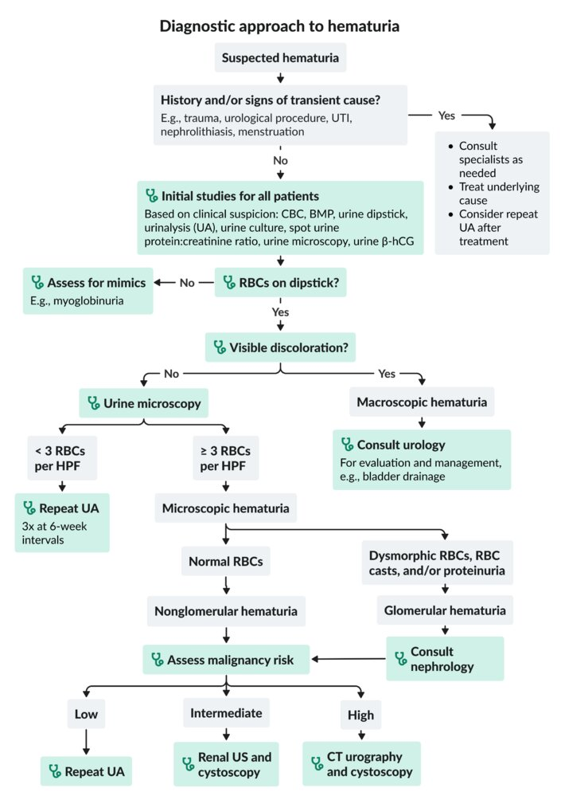

# Hematuria

*Categories: Clinical knowledge > Internal medicine > Nephrology > Basics of nephrology > Hematuria*

[Original Article Link](https://coursology-qbank.com/amboss/article/Wq0PxS)

---

## Summary

Hematuria is the presence of ≥ 3 <u>red blood cells</u> (<u>RBCs</u>) per <u>high-power field</u> (<u>HPF</u>) in the urine. It is often classified by visibility and origin. In <u>microscopic hematuria</u>, urine appears normal to the naked <u>eye</u>, and <u>RBCs</u> are only detectable under microscopy. <u>Macroscopic hematuria</u> (<u>gross hematuria</u>) is visible discoloration of urine that results from frank blood. <u>Glomerular hematuria</u> originates from <u>glomerular</u> damage. Causes include <u>glomerulonephritis</u> (GN), e.g., <u>IgA nephropathy</u> or <u>thin basement membrane disease</u>. It is characterized by <u>dysmorphic red blood cells</u> observed on urine microscopy. <u>Nonglomerular hematuria</u> results from <u>urothelial</u> damage (e.g., <u>nephrolithiasis</u>, <u>malignancy</u>, <u>cystitis</u>, trauma), or <u>tubulointerstitial disease</u> (e.g., <u>renal papillary necrosis</u>, <u>interstitial</u> nephritis) and is characterized by normal <u>RBC morphology</u> on urine microscopy. The underlying cause is determined through further evaluation, e.g., <u>urinalysis</u> (UA) and imaging, and guides the appropriate management. <u>Mimics of hematuria</u> include <u>myoglobinuria</u>, <u>porphyria</u>, and the consumption of certain medications (e.g., <u>rifampin</u>) and foods (e.g., beetroots).

---

## Classification

Hematuria is the presence of ≥ 3 <u>RBCs</u> per <u>HPF</u> in the urine and may be further categorized according to: [[1]](https://coursology-qbank.com/amboss/article/sedtZ60)

* Visibility

* Macroscopic hematuria;  (<u>gross hematuria</u>): frank blood in urine resulting in visible bright red or red-brown discoloration of the urine

* Microscopic hematuria: <u>RBCs</u> are present in the <u>urine sediment</u>, but no urine discoloration is visible to the naked <u>eye</u>. [[2]](https://coursology-qbank.com/amboss/article/hpXc6_)

* Timing during <u>urination</u>

* Initial hematuria: frank blood in the urine that occurs at the beginning of <u>micturition</u> and clears by the end of <u>micturition</u>

* Terminal hematuria: passage of blood or clots in urine during the last part of <u>micturition</u> (when the <u>bladder neck</u> contracts)

* Total hematuria: passage of blood or clots throughout <u>micturition</u>

* Associated features

* Painless hematuria: passage of blood or clots in urine in the absence of renal or urinary symptoms

* Isolated hematuria

* The presence of <u>RBCs</u> in the urine with no other abnormalities (e.g., changes in urine protein, serum <u>creatinine</u>, or blood pressure)

* Can be transient (e.g., <u>exercise-induced hematuria</u>, infection) or persistent

* Location of damage

* <u>Glomerular hematuria</u>

* <u>Nonglomerular hematuria</u>

---

## Etiology

> [!TIP]
> <u>Macroscopic hematuria</u> in adults is most commonly caused by <u>nephrolithiasis</u>, <u>UTI</u>/<u>pyelonephritis</u>, <u>BPH</u>, or <u>malignancy</u>. [[3]](https://coursology-qbank.com/amboss/article/MUdMd60)

### Infectious [[1]](https://coursology-qbank.com/amboss/article/sedtZ60)[[4]](https://coursology-qbank.com/amboss/article/6edj-K0)[[5]](https://coursology-qbank.com/amboss/article/pedL-K0)

* <u>Urinary tract infection</u>

* <u>Urethritis</u>

* <u>Prostatitis</u>

* <u>Pyelonephritis</u>

* <u>Tuberculosis</u>

* <u>Schistosomiasis</u>

### <u>Glomerular</u> (<u>glomerulonephritis</u>) [[1]](https://coursology-qbank.com/amboss/article/sedtZ60)[[4]](https://coursology-qbank.com/amboss/article/6edj-K0)[[5]](https://coursology-qbank.com/amboss/article/pedL-K0)

* <u>Anti-GBM disease</u>

* <u>Immune complex-mediated GN</u>

* <u>IgA nephropathy</u>

* <u>IgA vasculitis</u>

* <u>Postinfectious GN</u>

* <u>Endocarditis</u>

* <u>Cryoglobulinemic vasculitis</u>

* <u>Systemic lupus erythematosus</u>

* <u>ANCA-associated GN</u>

* <u>Eosinophilic granulomatosis with polyangiitis</u>

* <u>Microscopic polyangiitis</u>

* <u>Granulomatosis with polyangiitis</u>

* <u>Inherited glomerular disorders</u>

* <u>Alport syndrome</u>

* <u>Thin basement membrane disease</u>

### Tubulointerstitial [[1]](https://coursology-qbank.com/amboss/article/sedtZ60)[[4]](https://coursology-qbank.com/amboss/article/6edj-K0)[[5]](https://coursology-qbank.com/amboss/article/pedL-K0)

* <u>Acute interstitial nephritis</u>

* <u>Chronic interstitial nephritis</u>

* <u>Renal papillary necrosis</u> from, e.g.:

* <u>Sickle cell disease</u>

* Acute <u>pyelonephritis</u>

* <u>Diabetes mellitus</u>

* <u>Analgesics</u>

* <u>Crystalline nephropathy</u>

### <u>Urothelial</u> [[1]](https://coursology-qbank.com/amboss/article/sedtZ60)[[4]](https://coursology-qbank.com/amboss/article/6edj-K0)[[5]](https://coursology-qbank.com/amboss/article/pedL-K0)

* <u>Renal cell carcinoma</u>

* <u>Nephroblastoma</u> (children)

* <u>Nephrolithiasis</u>

* <u>Urethral strictures</u>

* <u>Urinary tract cancer</u>

* <u>Prostate cancer</u>

* <u>Benign prostatic hypertrophy</u>

* <u>Urinary tract</u> polyps

### <u>Genitourinary trauma</u>

* <u>Renal injuries</u> (e.g., <u>blunt abdominopelvic trauma</u> or <u>penetrating thoracoabdominal trauma</u>)

* <u>Ureteral injuries</u> (e.g., <u>MVC</u> deceleration injuries, <u>posterior</u> torso trauma, <u>pelvic fracture</u>)

* <u>Urethral injuries</u> (e.g., direct <u>penile trauma</u>, <u>straddle injury</u>)

* <u>Bladder injuries</u> (e.g., <u>bladder rupture</u>, <u>penetrating pelvic trauma</u> or <u>blunt abdominopelvic trauma</u>)

* <u>Urinary tract</u> instrumentation

* Recent <u>bladder catheterization</u>

* Recent urologic <u>surgery</u> (e.g., <u>TURP</u>, <u>TURBT</u>, <u>percutaneous nephrostomy</u>)

* Invasive <u>diagnostic investigations and procedures in urology</u>

### Structural [[1]](https://coursology-qbank.com/amboss/article/sedtZ60)[[4]](https://coursology-qbank.com/amboss/article/6edj-K0)[[5]](https://coursology-qbank.com/amboss/article/pedL-K0)

* <u>Polycystic kidney disease</u>

* <u>Medullary sponge kidney</u>

* Vascular, e.g.:

* <u>AVM</u>

* <u>Renal artery</u> <u>aneurysm</u>

* <u>Renal vein thrombosis</u>

* <u>Renal infarction</u>

* <u>Left renal vein compression</u>

### Hematologic [[1]](https://coursology-qbank.com/amboss/article/sedtZ60)[[4]](https://coursology-qbank.com/amboss/article/6edj-K0)[[5]](https://coursology-qbank.com/amboss/article/pedL-K0)

* <u>Coagulopathy</u>, e.g.:

* <u>Hemophilia</u>

* <u>Platelet dysfunction</u>

* <u>Thrombotic microangiopathy</u> (e.g., <u>thrombotic thrombocytopenic purpura</u>)

### Inflammatory [[1]](https://coursology-qbank.com/amboss/article/sedtZ60)[[4]](https://coursology-qbank.com/amboss/article/6edj-K0)[[5]](https://coursology-qbank.com/amboss/article/pedL-K0)

* <u>Radiation-induced hemorrhagic cystitis</u>

* <u>Interstitial cystitis</u>

* Renal <u>transplant rejection</u>

### Medication-induced [[1]](https://coursology-qbank.com/amboss/article/sedtZ60)[[4]](https://coursology-qbank.com/amboss/article/6edj-K0)[[5]](https://coursology-qbank.com/amboss/article/pedL-K0)

* <u>Analgesics</u>

* <u>Aminoglycosides</u>

* <u>Calcineurin inhibitors</u>

* <u>Cyclophosphamide</u>, <u>ifosfamide</u> (medication-induced <u>hemorrhagic cystitis</u>)

---

## Clinical evaluation

### History [[12]](https://coursology-qbank.com/amboss/article/OUdIW60)

* Urinary symptoms

* Timing of blood in urine

* <u>Initial hematuria</u>: suggests urethral damage (e.g., <u>urethritis</u>, <u>urethral stricture</u>, urethral <u>laceration</u>)

* <u>Terminal hematuria</u>: suggests damage to the <u>bladder neck</u>, <u>prostate</u>, or trigonal area (e.g., <u>benign prostatic hyperplasia</u>, <u>prostatitis</u>, <u>bladder</u> polyps)

* <u>Total hematuria</u>: suggests damage to the <u>bladder</u>, <u>ureters</u> or <u>kidneys</u> (e.g., <u>urolithiasis</u>, <u>UTI</u>, <u>polycystic kidney disease</u>)

* Blood clots in urine: characteristic of nonglomerular bleeding [[3]](https://coursology-qbank.com/amboss/article/MUdMd60)

* <u>Lower urinary tract symptoms</u>, e.g.:

* <u>Dysuria</u> (<u>pain</u>, burning, urge to void): suggests infection

* Difficulty voiding (<u>urine retention</u>, straining, intermittent stream, dribbling): suggests obstruction

* Flank <u>pain</u>: characteristic of <u>ureteral obstruction</u> (e.g., <u>urolithiasis</u>, blood clot)

* Suprapubic <u>pain</u>: often occurs in infections, <u>urinary retention</u>, <u>bladder</u> mass

* Nonurinary symptoms

* <u>Fever</u>

* <u>Constitutional symptoms</u>

* <u>Skin</u> changes (e.g., <u>edema</u>, rashes, <u>petechiae</u>, <u>purpura</u>): suggests a systemic process (e.g., <u>vasculitis</u>)

* Menstrual symptoms

* Recent or current <u>upper respiratory tract infection</u>

* <u>Past medical history</u>

* <u>Chronic kidney disease</u>, <u>polycystic kidney disease</u>

* <u>Sickle cell disease</u>

* <u>Abnormal uterine bleeding</u>, <u>endometriosis</u>

* Recent <u>surgery</u> or instrumentation on or near the <u>urinary tract</u>

* <u>Chemotherapy</u> (e.g., <u>cyclophosphamide</u>, <u>ifosfamide</u>)

* <u>Pelvic</u> radiation

* Autoimmune diseases (e.g., <u>vasculitides</u>)

* Medication: e.g., <u>nephrotoxic agents</u>, <u>anticoagulants</u>

* <u>Family history</u>: <u>kidney</u> disease

* <u>Social history</u>

* <u>Sexual history</u>

* Smoking history (including <u>pack-years</u>)

* Recent strenuous exercise

* <u>Occupational exposures</u>

* Travel history: especially areas <u>endemic</u> for <u>schistosomiasis</u> or <u>tuberculosis</u>

> [!TIP]
> <u>Painless hematuria</u> is a typical finding in <u>malignancy</u>.

### Focused <u>physical examination</u> [[3]](https://coursology-qbank.com/amboss/article/MUdMd60)[[12]](https://coursology-qbank.com/amboss/article/OUdIW60)

* Abdomen and back examination to assess for <u>CVA tenderness</u>, renal mass, suprapubic tenderness, palpable <u>bladder</u>

* <u>Pelvic examination</u> to assess for other sources of blood (e.g., menstrual bleeding)

* <u>DRE</u> to assess for <u>prostatitis</u>, <u>prostate</u> mass

* Dermatological examination to assess for <u>rash</u>, <u>petechiae</u>, <u>purpura</u>

* Extremity examination to assess for <u>arthritis</u>, <u>synovitis</u>, <u>peripheral edema</u>

* See also “<u>Clinical features of genitourinary trauma</u>.”

---

## Diagnosis

### Approach to hematuria  [[13]](https://coursology-qbank.com/amboss/article/ZLXZwA)[[14]](https://coursology-qbank.com/amboss/article/h5ccP10)[[15]](https://coursology-qbank.com/amboss/article/wsdhCr0)

* Identify and manage transient causes (e.g., <u>UTI</u>, <u>nephrolithiasis</u>); reassess for hematuria following treatment.

* Evaluate persistent hematuria based on suspected mechanism (e.g., <u>glomerular vs. nonglomerular hematuria</u>), regardless of whether the patient is receiving antiplatelet or <u>anticoagulant</u> therapy. [[16]](https://coursology-qbank.com/amboss/article/cjdazp0)

* Obtain <u>trauma diagnostics</u> if there are <u>general indications for imaging in genitourinary trauma</u>.

> [!TIP]
> Repeat the UA before pursuing further diagnostic evaluation if a benign etiology is suspected. Vigorous exercise, instrumentation to the <u>urinary tract</u>, sexual intercourse, <u>menstruation</u>, and <u>fever</u> are common causes of transient hematuria. [[4]](https://coursology-qbank.com/amboss/article/6edj-K0)

Diagnostic approach to hematuria

### Initial studies [[12]](https://coursology-qbank.com/amboss/article/OUdIW60)[[15]](https://coursology-qbank.com/amboss/article/wsdhCr0)[[16]](https://coursology-qbank.com/amboss/article/cjdazp0)

* <u>BMP</u>: to evaluate renal function

* <u>Urine dipstick</u>: to detect <u>heme</u> in urine (high <u>sensitivity</u>, low <u>specificity</u>)

* Urine microscopy: to confirm ≥ 3 <u>RBCs</u> per <u>HPF</u> and assess for <u>WBCs</u>, bacteria, nitrites, <u>RBC morphology</u>, and protein

* <u>Glomerular hematuria</u>; : <u>nephritic sediment</u> (e.g., <u>RBC casts</u>, <u>proteinuria</u>, <u>dysmorphic RBCs</u>)

* <u>Nonglomerular hematuria</u>: normal <u>RBC morphology</u>, otherwise <u>bland urine sediment</u>

* No <u>RBCs</u>: <u>mimics of hematuria</u> (e.g., <u>hemoglobinuria</u>, <u>myoglobinuria</u>)

* Crystals: suggestive of <u>nephrolithiasis</u>

* <u>WBCs</u>, bacteria, nitrites, <u>leukocyte esterase</u> [[1]](https://coursology-qbank.com/amboss/article/sedtZ60)

* Consider infection as the cause in patients with (e.g., <u>lower urinary tract symptoms</u>).

* <u>Sterile pyuria</u>: Causes include <u>TB</u>, <u>analgesic nephropathy</u>, and other <u>tubulointerstitial diseases</u>.

* <u>Urine culture</u>: to assess for <u>complicated UTI</u> (see “<u>Urinary tract infections</u>”)

* Urine microscopy with < 3 <u>RBCs</u> per <u>HPF</u>: Repeat UA three times at 6-week intervals.  [[13]](https://coursology-qbank.com/amboss/article/ZLXZwA)

#### Glomerular and nonglomerular hematuria [[1]](https://coursology-qbank.com/amboss/article/sedtZ60)[[12]](https://coursology-qbank.com/amboss/article/OUdIW60)

|  Typical findings of <u>glomerular vs. nonglomerular hematuria</u> [[1]](https://coursology-qbank.com/amboss/article/sedtZ60)  |  |  |
| --- | --- | --- |
|  | Glomerular hematuria | Nonglomerular hematuria |
| Color |  Often normal (i.e., <u>microscopic hematuria</u>) |  Red or pink urine (<u>gross hematuria</u>) |
| <u>RBC morphology</u> | <u>Dysmorphic RBCs</u> (e.g., <u>acanthocytes</u>) | Isomorphic <u>RBCs</u> (i.e., normal) |
| <u>RBC casts</u> | Sometimes present | Absent |
| Clots | Absent | Sometimes present |
| <u>Proteinuria</u> | Present (mostly <u>albuminuria</u>) | Absent |

> [!TIP]
> <u>Dysmorphic RBCs</u>, <u>RBC casts</u>, and/or significant <u>proteinuria</u> on urine microscopy suggest a glomerulopathy. [[12]](https://coursology-qbank.com/amboss/article/OUdIW60)

### Additional studies [[15]](https://coursology-qbank.com/amboss/article/wsdhCr0)[[16]](https://coursology-qbank.com/amboss/article/cjdazp0)

#### <u>Nonglomerular hematuria</u>

* <u>Gross hematuria</u>: Consult urology regarding <u>CT urography</u> followed by <u>cystoscopy</u> (with <u>biopsy</u> if needed) for diagnostic confirmation of <u>urinary tract cancer</u>. [[15]](https://coursology-qbank.com/amboss/article/wsdhCr0)[[16]](https://coursology-qbank.com/amboss/article/cjdazp0)

* <u>Microhematuria</u>: Order additional studies (e.g., imaging) for <u>urinary tract cancer</u> using <u>risk-based assessment of microhematuria</u>.

#### <u>Glomerular hematuria</u>

* Evaluate for <u>causes of GN</u> (e.g., <u>anti-GBM disease</u>, <u>ANCA-associated GN</u>) in consultation with nephrology.

* <u>Renal biopsy</u> is usually required for diagnostic confirmation.

* See “<u>Management of nephritic syndrome</u>” for diagnostic studies in patients with <u>nephritic sediment</u>.

* Perform a <u>risk-based assessment of microhematuria</u>. [[15]](https://coursology-qbank.com/amboss/article/wsdhCr0)

> [!WARNING]
> Diagnosis of <u>glomerular disease</u> does not rule out <u>urinary tract malignancy</u>. [[15]](https://coursology-qbank.com/amboss/article/wsdhCr0)

|  Risk-based assessment of microhematuria [[15]](https://coursology-qbank.com/amboss/article/wsdhCr0)  |  |  |  |
| --- | --- | --- | --- |
|  |  Low or negligible risk  (all of the features) |  Intermediate risk (any of the features) |  High risk (any of the features) |
| Age |   * Women: < 60 years  * Men: < 40 years    |   * Women: ≥ 60 years  * Men: 40–59 years    |   * Women: not considered high risk based solely on age  * Men: ≥ 60 years    |
| Smoking history |  * <u>Never smoker</u> or < 10 <u>pack years</u>   |  * 10–30 <u>pack years</u>   |  * > 30 <u>pack years</u>   |
| <u>RBCs</u> per <u>HPF</u> on a single UA |  * 3–10   |  * 11–25   |  * > 25   |
| Additional features |  * None   |  * ≥ 1 <u>risk factors for urinary tract cancer</u>   |   * History of <u>gross hematuria</u>  * ≥ 1 <u>risk factors for urinary tract cancer</u> and any high-risk feature for <u>urinary tract cancer</u>    |
| Evaluation |   * Repeat UA within 6 months.  * Persistent <u>microhematuria</u> on repeat UA is reclassified as intermediate risk or high risk.    |  * <u>Renal ultrasound</u> and <u>cystoscopy</u>   |  * <u>Cystoscopy</u> and upper <u>urinary tract</u> imaging  * Preferred: multiphasic <u>CT urography</u>  * Alternatives: <u>MR urography</u>, <u>retrograde pyelogram</u> with <u>renal ultrasound</u> or axial imaging without contrast   |

> [!TIP]
> Older age, male sex, and smoking are the main <u>risk factors for urinary tract cancer</u>. [[15]](https://coursology-qbank.com/amboss/article/wsdhCr0)

---