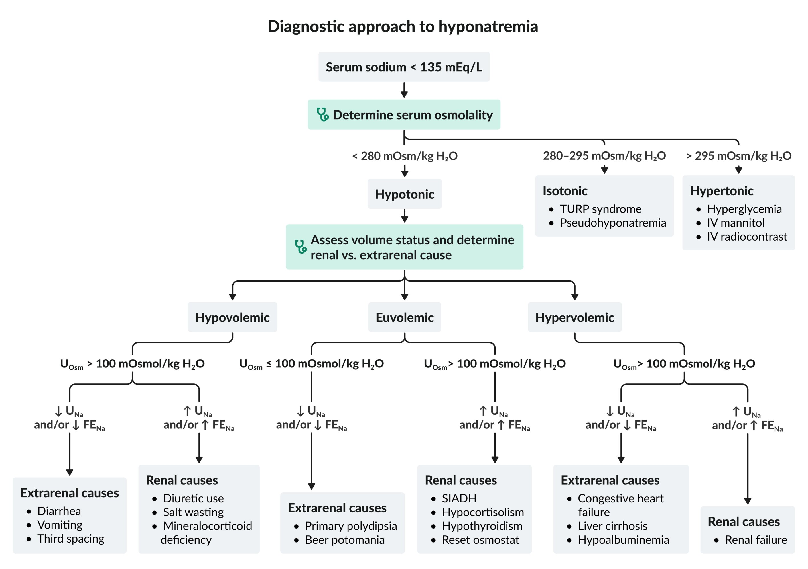
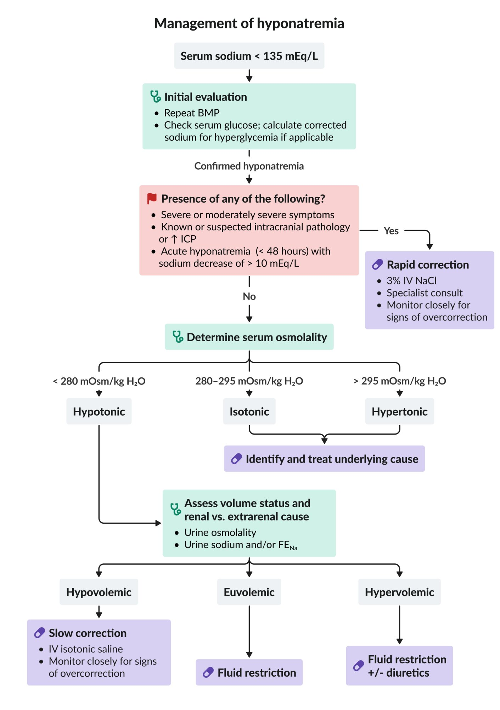
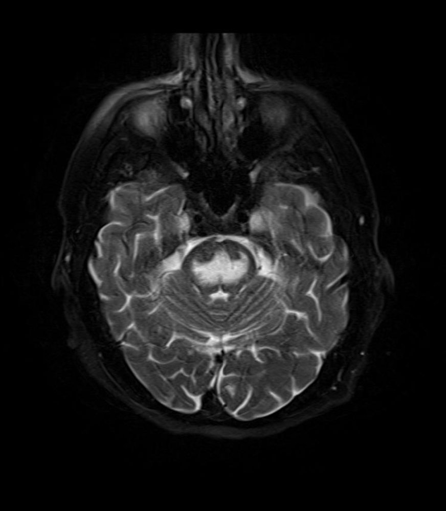

# Hyponatremia

*Categories: Clinical knowledge > Internal medicine > Nephrology > Fluids, electrolytes, and acid-base disorders > Hyponatremia*

[Original Article Link](https://coursology-qbank.com/amboss/article/rg0f92)

---

## Summary

Hyponatremia is defined as a serum <u>sodium</u> concentration below < 135 mEq/L. Hyponatremia is typically caused by fluid imbalance; common causes are categorized as <u>hypovolemic</u> (e.g., <u>dehydration</u>), <u>euvolemic</u> (e.g., <u>primary polydipsia</u>, <u>SIADH</u>), or <u>hypervolemic</u> (e.g., <u>CHF</u>). Onset can be acute or chronic, and symptoms are predominantly neurological and often nonspecific (e.g., <u>nausea</u>, <u>headache</u>, confusion). The cause of hyponatremia is determined by assessing the patient's <u>volume status</u> and ability to retain <u>sodium</u>. Conditions with very high protein (e.g., <u>multiple myeloma</u>) or <u>glucose</u> levels (e.g., <u>DKA</u>) in the blood can cause falsely low serum <u>sodium</u> levels (<u>pseudohyponatremia</u>). Treatment involves careful correction of the <u>sodium</u> deficit and/or fluid imbalance. A rapid increase in the serum <u>sodium</u> concentration can have damaging osmotic effects (i.e., <u>osmotic demyelination syndrome</u>).

See the section “Core IM podcast 5 pearls on hyponatremia (episode 1: diagnosis)” for their show notes on this topic.

CoreIM podcast: 5 Pearls on Hyponatremia (Episode 1 - Diagnosis)

---

## Definitions

* Eunatremia: a normal concentration of <u>sodium</u> in the blood (i.e., 136–145 mEq/L).

* Hyponatremia: reduced serum <u>sodium</u> concentration (< 135 mEq/L)

* Classification [[1]](https://coursology-qbank.com/amboss/article/MXYMAn)

* Severity [[2]](https://coursology-qbank.com/amboss/article/PMbWK8)

* Mild hyponatremia: 130–135 mEq/L

* Moderate hyponatremia: 125–129 mEq/L

* Severe hyponatremia (profound): < 125 mEq/L

* Disease onset [[2]](https://coursology-qbank.com/amboss/article/PMbWK8)

* Acute hyponatremia: < 48 hours  [[3]](https://coursology-qbank.com/amboss/article/ELb8z8)

* Chronic hyponatremia: ≥ 48 hours or duration unknown [[2]](https://coursology-qbank.com/amboss/article/PMbWK8)

* <u>Plasma osmolality</u> (see “Etiology”)

---

## Etiology

Hyponatremia is classified according to <u>serum osmolality</u> and extracellular <u>volume status</u>. Multiple etiologies may be present. [[1]](https://coursology-qbank.com/amboss/article/MXYMAn)[[2]](https://coursology-qbank.com/amboss/article/PMbWK8)

### Hypotonic hyponatremia [[1]](https://coursology-qbank.com/amboss/article/MXYMAn)[[4]](https://coursology-qbank.com/amboss/article/nXY7An)

* Definition: : low measured serum Na+ concentration and low <u>serum osmolality</u> (<u>true hyponatremia</u>)

* <u>Serum osmolality</u>: < 280 mOsmol/kg H2O

* Forms: <u>hypovolemic</u>, <u>euvolemic</u>, <u>hypervolemic</u>

* Causes: extrarenal and renal (see “<u>Causes of hypotonic hyponatremia</u>”)

* Pathophysiology: relative excess of water compared to <u>sodium</u> in the extracellular compartments

* Dilution: excess body water → dilution of the blood → lower serum <u>sodium</u> concentration

* Depletion: ↓ body <u>sodium</u> → relative excess body water → lower serum <u>sodium</u> concentration

| Causes of hypotonic hyponatremia |  |  |  |
| --- | --- | --- | --- |
|  | Hypovolemic hypotonic hyponatremia | Euvolemic hypotonic hyponatremia | Hypervolemic hypotonic hyponatremia |
| Description |  * Low <u>extracellular fluid</u> volume   |  * Normal or minimal changes in <u>extracellular fluid</u> volume   |  * High <u>extracellular fluid</u> volume   |
| Renal causes |   * Acute or <u>chronic renal failure</u> with high urine output (<u>polyuria</u>)  * <u>Diuretics</u>  * <u>Mineralocorticoid</u> deficiency (<u>Addison disease</u>)  * Recovery phase of <u>acute tubular necrosis</u>  * <u>Cerebral salt wasting syndrome</u>    |   * <u>SIADH</u>  * Medication use  * <u>Exercise-associated hyponatremia</u> (<u>EAH</u>)  * Acute or <u>chronic renal failure</u>  * <u>Glucocorticoid</u> deficiency (<u>adrenal insufficiency</u>)  [[5]](https://coursology-qbank.com/amboss/article/Lybwfw)  * Severe <u>hypothyroidism</u>  [[1]](https://coursology-qbank.com/amboss/article/MXYMAn)[[5]](https://coursology-qbank.com/amboss/article/Lybwfw)    |  * Acute or <u>chronic renal failure</u> with low urine output (i.e., failure to excrete free water)   |
| Extrarenal causes |   * <u>Diarrhea</u>  * <u>Vomiting</u>  * <u>Dermal</u> fluid loss (e.g., <u>burns</u>, sweating)  * <u>Third space fluid loss</u> (e.g., <u>peritonitis</u>, <u>ascites</u>)  * Bleeding/hemorrhage    |   * Decreased salt intake (e.g., “tea and toast” diet)  * Water intoxication (dilutional hyponatremia)   * Excessive infusion of hypotonic (e.g., <u>0.45% NaCl</u>) or <u>sodium</u>-free isotonic <u>IV fluids</u>  * <u>Primary polydipsia</u>  * <u>Beer potomania</u>  * <u>Reset osmostat syndrome</u>    |   * <u>Congestive heart failure</u>  * <u>Liver cirrhosis</u>  * Severe <u>hypoproteinemia</u> (e.g., <u>nephrotic syndrome</u>)    |

> [!TIP]
> <u>Thiazide diuretic</u> use and <u>SIADH</u> are the most common causes of hyponatremia in the emergency department. [[6]](https://coursology-qbank.com/amboss/article/aW1QPf0)

#### Exercise-associated hyponatremia (<u>EAH</u>) [[7]](https://coursology-qbank.com/amboss/article/m11Vhf0)

* Definition: serum <u>sodium</u> level < 135 mmol/L that occurs during or up to 24 hours after prolonged, intense physical exercise

* Pathophysiology

* Ingestion of water or hypotonic beverages in excess of fluid losses

* ↑ <u>ADH</u> secretion → ↑ solute-free water retention

* <u>Sodium</u> loss via <u>diaphoresis</u>

* Clinical features

* Nonspecific symptoms (e.g., <u>dizziness</u>, <u>headache</u>, <u>nausea</u>, <u>vomiting</u>, <u>bloating</u>)

* Exercise-associated hyponatremic encephalopathy (<u>EAHE</u>): <u>symptoms of cerebral edema</u> (e.g., <u>agitation</u>, confusion, <u>seizures</u>)

* Treatment: fluid restriction PLUS

* Mild symptoms: oral <u>hypertonic saline</u>

* Moderate to severe symptoms or <u>EAHE</u>: intravenous <u>hypertonic saline</u>

* Prevention

* Limit fluid intake according to thirst

* Education of individuals at risk (e.g., athletes)

> [!TIP]
> <u>Exercise-associated hyponatremia</u> is most commonly associated with marathon running but has also been reported following other exertional activities such as football, cycling, fraternity hazing, and military training. [[7]](https://coursology-qbank.com/amboss/article/m11Vhf0)

### Hypertonic hyponatremia [[1]](https://coursology-qbank.com/amboss/article/MXYMAn)[[4]](https://coursology-qbank.com/amboss/article/nXY7An)

* Definition: : low measured serum Na+ concentration and high <u>serum osmolality</u>

* <u>Serum osmolality</u>: > 295 mOsmol/kg H2O

* Causes

* <u>Hyperglycemia</u>

* IV <u>mannitol</u>

* IV radiocontrast use

### Isotonic hyponatremia [[1]](https://coursology-qbank.com/amboss/article/MXYMAn)[[4]](https://coursology-qbank.com/amboss/article/nXY7An)

* Definition: : low measured serum Na+ concentration and normal <u>serum osmolality</u>

* <u>Serum osmolality</u>: 280–295 mOsmol/kg H2O

* Causes

* <u>TURP syndrome</u> [[8]](https://coursology-qbank.com/amboss/article/-7YDoq)

* Pseudohyponatremia

* Asymptomatic laboratory artifact falsely indicating hyponatremia when <u>sodium</u> has not been reduced or diluted

* Due to very high amounts of protein or lipids in the plasma (e.g., <u>hyperlipidemia</u>, <u>multiple myeloma</u>), which then alter the plasma water concentration

* Clinical features may include:

* <u>Pancreatitis</u>

* <u>Diabetic ketoacidosis</u>

* <u>Obstructive jaundice</u>  [[9]](https://coursology-qbank.com/amboss/article/TLb6C8)

* <u>CRAB criteria</u> in <u>multiple myeloma</u>

> [!TIP]
> <u>Isotonic hyponatremia</u> should always be excluded as a cause of hyponatremia to avoid unnecessarily aggressive treatment.

---

## Pathophysiology

| <u>Fluid compartment</u> changes in hyponatremia |  |  |  |  |  |  |  |
| --- | --- | --- | --- | --- | --- | --- | --- |
| Defined by |  | Changes |  |  |  |  |  |
| <u>Tonicity</u> | <u>Volume status</u> |  |  |  |  |  |  |
|  <u>Serum osmolality</u>  |  <u>Total body water</u>  |  |  Total body <u>sodium</u>  |  |  |  |  |
| <u>Hypotonic hyponatremia</u> | <u>Hypovolemic hypotonic hyponatremia</u> | ↓   | ↓ |  | ↓↓ |  |  |
| <u>Euvolemic hypotonic hyponatremia</u> | ↓   | ↑ |  | ↓ Or normal |  |  |  |
|  <u>Hypervolemic hypotonic hyponatremia</u>   | ↓   | ↑↑   |  | ↑   |  |  |  |
| <u>Isotonic hyponatremia</u> |  | Normal   | ↑   |  | Normal   |  |  |
| <u>Hypertonic hyponatremia</u> |  | ↑   | ↓   |  | Normal   |  |  |

---

## Clinical features

Clinical features depend on the onset, duration, and severity of hyponatremia. Most patients with <u>chronic hyponatremia</u> are asymptomatic and symptoms typically only occur with serum <u>sodium</u> concentration < 120 mEq/L. [[4]](https://coursology-qbank.com/amboss/article/nXY7An)[[10]](https://coursology-qbank.com/amboss/article/S30y3f)

Hyponatremia fact sheet

### Severely symptomatic hyponatremia [[4]](https://coursology-qbank.com/amboss/article/nXY7An)

Symptoms usually develop acutely (onset < 48 hours). The severity tends to correlate with the extent of <u>cerebral edema</u>.

* Confusion, <u>stupor</u>, <u>coma</u>

* <u>Seizures</u>

* <u>Ataxia</u>

* <u>Respiratory failure</u>

* Other: <u>malaise</u>; , <u>lethargy</u>, <u>headache</u>, <u>nausea</u>, <u>vomiting</u>

### Mild and moderately symptomatic hyponatremia [[4]](https://coursology-qbank.com/amboss/article/nXY7An)

Symptoms usually develop slowly (onset > 48 hours) and are typically nonspecific (patients can also be asymptomatic).

* Forgetfulness

* Gait disturbances

* <u>Muscle weakness</u>

* <u>Malaise</u>

* <u>Headache</u>

* <u>Dizziness</u>

* Fatigue

* <u>Lethargy</u>

* <u>Nausea</u>, <u>vomiting</u>

> [!TIP]
> Depending on the underlying etiology, patients may present with <u>signs of fluid overload</u>, <u>euvolemia</u>, or <u>volume depletion</u>.

---

## Diagnosis

### Diagnostic approach to hyponatremia [[1]](https://coursology-qbank.com/amboss/article/MXYMAn)[[2]](https://coursology-qbank.com/amboss/article/PMbWK8)[[4]](https://coursology-qbank.com/amboss/article/nXY7An)[[8]](https://coursology-qbank.com/amboss/article/-7YDoq)

* Confirm hyponatremia: Repeat <u>BMP</u>.

* Exclude <u>hyperglycemia</u>: Check serum <u>glucose</u>.

* Check the <u>serum osmolality</u> (SOsm): first step in the evaluation of confirmed hyponatremia

* Measured in serum or calculated (see “<u>Hyponatremia formulas</u>” below)  [[1]](https://coursology-qbank.com/amboss/article/MXYMAn)

* Interpretation

* Low <u>serum osmolality</u>;  (< 280 mOsmol/kg H2O): <u>hypotonic hyponatremia</u> (<u>true hyponatremia</u>; most common)

* High <u>serum osmolality</u>;  (> 295 mOsmol/kg H2O): <u>hypertonic hyponatremia</u>

* Normal <u>serum osmolality</u>;  (280–295 mOsmol/kg H2O): <u>isotonic hyponatremia</u> or <u>pseudohyponatremia</u>

* Consider additional focused diagnostic evaluation to identify the underlying cause.

Diagnosis of hyponatremia

> [!WARNING]
> Initiate treatment immediately for acute or <u>severely symptomatic hyponatremia</u>.

> [!TIP]
> <u>Serum osmolality</u> measurement is the first step in the evaluation of verified hyponatremia.

### Diagnostic evaluation of hyponatremia based on serum osmolality

#### <u>Hypotonic hyponatremia</u> [[2]](https://coursology-qbank.com/amboss/article/PMbWK8)[[4]](https://coursology-qbank.com/amboss/article/nXY7An)[[8]](https://coursology-qbank.com/amboss/article/-7YDoq)[[11]](https://coursology-qbank.com/amboss/article/pHdLrr0)

* Initial <u>laboratory studies</u>

* Serum studies: <u>CBC</u>, <u>BMP</u>; consider <u>uric acid</u>

* Urine studies

* <u>Osmolality</u> (<u>UOsm</u>)

* <u>Creatinine</u> (UCreatinine)

* <u>Sodium</u> (UNa)

* <u>Potassium</u> (UK)

* Consider also: <u>urea</u> (UUrea)  , <u>uric acid</u> (UUA)

* Interpretation of <u>urine osmolality</u> (<u>UOsm</u>): to determine <u>antidiuretic hormone</u> (<u>ADH</u>) activity ;  [[8]](https://coursology-qbank.com/amboss/article/-7YDoq)[[11]](https://coursology-qbank.com/amboss/article/pHdLrr0)

* <u>UOsm</u> ≤ 100 mOsmol/kg H2O, and/or <u>urine specific gravity</u> ≤ 1.003: Dilute urine (<u>ADH</u> is suppressed) indicates excess water intake.

* <u>UOsm</u> > 100 mOsmol/kg H2O , and/or <u>urine specific gravity</u> > 1.003: concentrated urine (<u>ADH</u> is appropriately or inappropriately elevated)

* Determination of <u>volume status</u>: to determine if <u>ADH</u> activity is appropriate (i.e., in response to low <u>effective arterial blood volume</u>) or inappropriate (e.g., in <u>SIADH</u>) 

* History: e.g., significant <u>nausea</u>/<u>vomiting</u> or recent hemorrhage might suggest low <u>effective arterial volume</u> due to <u>hypovolemia</u>

* <u>Clinical assessment of volume status</u>: somewhat limited utility for the distinction between <u>hypovolemia</u> and <u>euvolemia</u> [[1]](https://coursology-qbank.com/amboss/article/MXYMAn)[[2]](https://coursology-qbank.com/amboss/article/PMbWK8)[[8]](https://coursology-qbank.com/amboss/article/-7YDoq)

* <u>Laboratory studies</u>: See “<u>Laboratory findings that suggest hypovolemia</u>;” should include interpretation of urine <u>sodium</u> (next step)

* <u>Imaging assessment of volume status</u>: e.g., <u>IVC ultrasound</u>

* Useful additional tests in patients who are taking <u>diuretics</u> 

* ↓ <u>Fractional excretion of urea</u> (<u>FEUrea</u>)  [[4]](https://coursology-qbank.com/amboss/article/nXY7An)[[8]](https://coursology-qbank.com/amboss/article/-7YDoq)

* <u>FEUrea</u> < 35%: suggests low <u>effective arterial volume</u> (e.g., in <u>hypovolemia</u>)

* <u>FEUrea</u> > 55%: suggests <u>euvolemia</u> (e.g., <u>SIADH</u>)

* ↓ <u>Fractional excretion of uric acid</u> (<u>FEUA</u>)  [[8]](https://coursology-qbank.com/amboss/article/-7YDoq)

* <u>FEUA</u> < 12%: suggests low <u>effective arterial volume</u> (e.g., in <u>hypovolemia</u>)

* <u>FEUA</u> ≥ 12%: highly suggests <u>euvolemia</u> (e.g., <u>SIADH</u>)  [[2]](https://coursology-qbank.com/amboss/article/PMbWK8)

* Interpretation of UNa and/or <u>FENa</u> ; : to determine if the cause is renal or extrarenal ;  [[8]](https://coursology-qbank.com/amboss/article/-7YDoq)

* Findings [[1]](https://coursology-qbank.com/amboss/article/MXYMAn)[[4]](https://coursology-qbank.com/amboss/article/nXY7An)[[8]](https://coursology-qbank.com/amboss/article/-7YDoq)

* UNa20–30 mEq/L and/or <u>FENa</u> ≥1%: may suggest renal loss of <u>sodium</u>  [[8]](https://coursology-qbank.com/amboss/article/-7YDoq)

* UNa20–30 mEq/L and/or <u>FENa</u> < 1%: may suggest extrarenal loss of <u>sodium</u>

* Urinary <u>sodium</u> excretion is affected by the following: [[2]](https://coursology-qbank.com/amboss/article/PMbWK8)[[12]](https://coursology-qbank.com/amboss/article/hnbcG8)

* <u>Effective arterial blood volume</u> (see <u>RAAS</u> and <u>ADH</u>)

* Dietary <u>sodium</u> intake

* <u>Renal failure</u>

* Use of <u>diuretics</u>

|  Interpretation of diagnostic evaluation in <u>hypotonic hyponatremia</u> [[1]](https://coursology-qbank.com/amboss/article/MXYMAn)[[4]](https://coursology-qbank.com/amboss/article/nXY7An)[[8]](https://coursology-qbank.com/amboss/article/-7YDoq)  |  |  |  |  |  |  |  |
| --- | --- | --- | --- | --- | --- | --- | --- |
| <u>Volume status</u> | <u>Hypovolemic</u> |  | <u>Euvolemic</u> |  |  | <u>Hypervolemic</u> |  |
| <u>Urine osmolality</u> |  * > 100 mOsmol/kg H2O   |  |  * ≤ 100 mOsmol/kg H2O   |  |  * > 100 mOsmol/kg H2O   |  * > 100 mOsmol/kg H2O   |  |
| <u>Urine specific gravity</u> |  * > 1.003   |  |  * ≤ 1.003   |  |  * > 1.003   |  * > 1.003   |  |
| Urine <u>sodium</u> |  * 20–30 mEq/L   |  * 20–30 mEq/L   |  * 20–30 mEq/L   |  |  * 20–30 mEq/L   |  * 20–30 mEq/L   |  * 20–30 mEq/L   |
|  <u>FENa</u>   |  * < 1%   |  * ≥ 1%   |  * < 1%   |  |  * ≥ 1%  [[8]](https://coursology-qbank.com/amboss/article/-7YDoq)   |  * < 1%   |  * ≥ 1%   |
|  Causes (see “Etiology” for more information) |  * Extrarenal causes (e.g., <u>diarrhea</u>, <u>vomiting</u>, <u>third spacing</u>)   |  * Renal causes (e.g., <u>diuretic</u> use, salt-wasting nephropathy, <u>mineralocorticoid</u> deficiency)   |  * Extrarenal causes (e.g., <u>primary polydipsia</u>, <u>beer potomania</u>)   |  |  * Renal causes (e.g., <u>SIADH</u>, <u>hypocortisolism</u>, <u>hypothyroidism</u>, <u>reset osmostat</u>)   |  * Extrarenal causes (e.g., <u>CHF</u>, <u>cirrhosis</u>, <u>hypoalbuminemia</u>)   |  * Renal causes (e.g., <u>renal failure</u>)   |

Fractional excretion of sodium (FENa)

> [!TIP]
> In patients taking <u>diuretics</u>, urinary <u>sodium</u> concentrations should be interpreted with caution. An FEUa< 12% can provide more diagnostic <u>accuracy</u> than UNa to differentiate <u>hypovolemia</u> from <u>euvolemia</u>. [[8]](https://coursology-qbank.com/amboss/article/-7YDoq)

> [!TIP]
> The distinction between <u>hypovolemia</u> and <u>euvolemia</u> is usually difficult to make on examination alone; examination findings have low <u>sensitivity</u> and <u>specificity</u>. Many authors recommend focusing on urinary <u>sodium</u> rather than clinical features to distinguish between the two. [[1]](https://coursology-qbank.com/amboss/article/MXYMAn)[[2]](https://coursology-qbank.com/amboss/article/PMbWK8)[[8]](https://coursology-qbank.com/amboss/article/-7YDoq)

##### Additional tests [[1]](https://coursology-qbank.com/amboss/article/MXYMAn)[[2]](https://coursology-qbank.com/amboss/article/PMbWK8)[[8]](https://coursology-qbank.com/amboss/article/-7YDoq)

Consider the following based on clinical suspicion:

* <u>Laboratory studies</u>

* <u>TSH</u> to evaluate for <u>hypothyroidism</u> (hyponatremia usually only occurs with signs of <u>myxedema</u> or <u>TSH</u> > 50 mIU/L) [[1]](https://coursology-qbank.com/amboss/article/MXYMAn)

* Serum <u>cortisol</u> and <u>ACTH</u> to evaluate for <u>hypocortisolism</u> and <u>hypoaldosteronism</u> (see “<u>Adrenal insufficiency</u>”)

* <u>Urine drug screen</u> to evaluate for suspected <u>MDMA</u> use (see “<u>Stimulant intoxication and withdrawal</u>”)

* <u>BNP</u> to evaluate for <u>CHF</u> (see “Diagnostics” in “<u>CHF</u>”)

* Urine <u>chloride</u> (UCl) may be helpful in rare cases.

* Imaging [[13]](https://coursology-qbank.com/amboss/article/kIYm1q)

* <u>CXR</u> or CT chest: to look for possible pulmonary <u>causes of SIADH</u>

* CT or <u>MRI</u> head: to identify <u>cerebral edema</u> or suspected <u>CNS</u> etiology

#### <u>Hypertonic hyponatremia</u> [[4]](https://coursology-qbank.com/amboss/article/nXY7An)

* Check serum <u>glucose</u> and calculate <u>corrected sodium for hyperglycemia</u>. 

* Calculate in all patients with hyponatremia to assess for <u>sodium imbalance</u> due to high <u>glucose</u> levels.

* Interpretation

* Low corrected Na+: <u>hypotonic hyponatremia</u> likely

* High corrected Na+: <u>hypernatremia</u> likely

* Normal corrected Na+: no hyponatremia

* Identify and treat the underlying cause (see “Etiology”).

Corrected sodium in hyperglycemia

#### <u>Isotonic hyponatremia</u> or <u>pseudohyponatremia</u> [[8]](https://coursology-qbank.com/amboss/article/-7YDoq)[[14]](https://coursology-qbank.com/amboss/article/Q70ulh)[[15]](https://coursology-qbank.com/amboss/article/j70_lh)

* Confirm or exclude hyponatremia by measuring <u>whole blood sodium</u> (direct <u>potentiometry</u>): Normal Na+ concentration confirms the diagnosis of <u>pseudohyponatremia</u>. [[16]](https://coursology-qbank.com/amboss/article/eLbx98)

* Further diagnostic workup of <u>pseudohyponatremia</u> should be guided by clinical suspicion and may include the following: [[9]](https://coursology-qbank.com/amboss/article/TLb6C8)[[16]](https://coursology-qbank.com/amboss/article/eLbx98)

* <u>Lipid panel</u>

* Total protein concentration

> [!TIP]
> If <u>pseudohyponatremia</u> is suspected, confirm or exclude hyponatremia using <u>whole blood sodium</u>.

---

## Formulas for hyponatremia

|  <u>Hyponatremia formulas</u> [[4]](https://coursology-qbank.com/amboss/article/nXY7An)  |  |  |
| --- | --- | --- |
|  | Use | Formula |
| <u>Serum osmolality</u> |  * Distinguish between hypotonic, isotonic, and <u>hypertonic hyponatremia</u>   |  * (2 × Na+) + (<u>glucose</u>/18) + (<u>BUN</u>/2.8) + (ethanol/4.6)   |
|  Corrected serum sodium concentration for hyperglycemia  [[17]](https://coursology-qbank.com/amboss/article/RPXley)[[18]](https://coursology-qbank.com/amboss/article/iPXJey)  |  * Assess for <u>hyperglycemia</u>-induced <u>hypertonic hyponatremia</u>   |   * Katz formula: measured Na+ concentration + [0.016 × (serum <u>glucose</u> concentration - 100)]  * Hillier formula: measured Na+ concentration + [0.024 × (serum <u>glucose</u> concentration - 100)]    |
|  <u>Fractional excretion of sodium</u> (<u>FENa</u>)  [[8]](https://coursology-qbank.com/amboss/article/-7YDoq)[[12]](https://coursology-qbank.com/amboss/article/hnbcG8)  |  * Assess if the cause of hyponatremia is renal or extrarenal   |  * (SCreatinine × UNa)/(UCreatinine× SNa) × 100%   |
|  Fractional excretion of urea (<u>FEUrea</u>)  [[19]](https://coursology-qbank.com/amboss/article/3PXSey)  |  * Assess if hyponatremia is caused by low <u>effective arterial volume</u> (e.g., <u>hypovolemia</u>, <u>CHF</u>) in patients taking <u>diuretics</u>   |  * (UUrea × SCreatinine)/(UCreatinine × SUrea) × 100%   |
|  Fractional excretion of uric acid (<u>FEUA)</u>) [[2]](https://coursology-qbank.com/amboss/article/PMbWK8)[[8]](https://coursology-qbank.com/amboss/article/-7YDoq)[[20]](https://coursology-qbank.com/amboss/article/U_bbnw)  |  * Assess if hyponatremia is caused by low <u>effective arterial volume</u> (e.g., <u>hypovolemia</u>, <u>CHF</u>) in patients taking <u>diuretics</u> (<u>diuretics</u> make urine <u>sodium</u> difficult to interpret)   |  * (UUA × SCreatinine)/(UCreatinine × SUA) × 100%   |
|  <u>Urine-to-serum electrolyte ratio</u> [[21]](https://coursology-qbank.com/amboss/article/U6bb4u)  |  * Assess suppression of aquaresis in <u>euvolemic hyponatremia</u> to guide fluid restriction   |  * (UNa + UK)/SNa   |
|  Total body water (<u>TBW</u>)  [[22]](https://coursology-qbank.com/amboss/article/a_bQ5w)  |  * Calculate <u>IV fluid rate for correction of hyponatremia</u>   |   * Weight (in kg) × k * k depends on age and sex  * 0.6 in male individuals  * 0.5 in female and older male individuals  * 0.45 in older female individuals  * Watson formula  * Male individuals: 2.447 - 0.09156 × age (in years) + 0.1074 × height (in cm) + 0.3362 × weight (in kg)  * Female individuals: -2.097 + 0.1069 × height (in cm) + 0.2466 × weight (in kg)    |
|  Predicted change in sodium concentration [[23]](https://coursology-qbank.com/amboss/article/Yobn0u)  |  * Predict the expected change in <u>sodium</u> concentration after infusing 1 L of an IV solution   |  * Δ [Na+] = [(<u>sodium</u> infusate + <u>potassium</u> infusate) - serum Na+)]/(<u>TBW</u> + 1)  * <u>Sodium</u> infusate: amount of <u>sodium</u> present in 1 L of the given solution  * See “<u>Crystalloid solutions</u>” for the mEq of <u>sodium</u> (and <u>potassium</u>) in each fluid.   |
|  <u>IV fluid rate for correction of hyponatremia</u> (mL/hour)  [[23]](https://coursology-qbank.com/amboss/article/Yobn0u)  |  * Determine the IV fluid rate (mL/hour) that will achieve a desired change in <u>sodium</u> concentration in patients with <u>hypovolemic hyponatremia</u>   |  * 1000 × (Na+ correction rate in mEq/L/hour)/change in <u>sodium</u> concentration   |

Fractional excretion of sodium (FENa)

Corrected sodium in hyperglycemia

Fractional excretion of urea (FEUrea)

Total body water (TBW) - Watson formula

Sodium correction rate for hyponatremia

---

## Treatment

### Approach

* Management depends on symptom severity, acuity, and the underlying cause.

* Moderately severe or <u>severely symptomatic hyponatremia</u>: rapid increase in serum <u>sodium</u> with IV <u>hypertonic saline</u> followed by <u>cause-specific treatment for hyponatremia</u>

* Nonsevere symptoms (usually <u>chronic hyponatremia</u>): slow correction of serum <u>sodium</u> with <u>cause-specific treatment for hyponatremia</u> (e.g., fluid restriction in <u>SIADH</u>).

* Stop all medications that may be causing hyponatremia.

* Avoid <u>sodium</u> overcorrection and minimize the risk of <u>ODS</u>.

* Carefully monitor <u>sodium</u> levels and urine output (frequency depends on the severity).

* Follow the <u>recommended sodium correction rates</u> (goals and limits).

* Provide <u>management of sodium overcorrection</u> if needed.

* <u>Potassium</u> supplementation also increases <u>sodium</u> levels.  [[1]](https://coursology-qbank.com/amboss/article/MXYMAn)[[11]](https://coursology-qbank.com/amboss/article/pHdLrr0)

Management of hyponatremia

> [!WARNING]
> Rapid correction of <u>chronic hyponatremia</u> can cause <u>osmotic demyelination syndrome</u>! Do not exceed hourly or daily maximum correction limits.

> [!TIP]
> Severe or moderately severe symptoms require initial aggressive treatment with IV <u>hypertonic saline</u> to reverse neurological symptoms and prevent <u>brain herniation</u>.

### Hypertonic saline (emergency treatment) [[1]](https://coursology-qbank.com/amboss/article/MXYMAn)[[8]](https://coursology-qbank.com/amboss/article/-7YDoq)[[11]](https://coursology-qbank.com/amboss/article/pHdLrr0)

Early specialist consultation (intensive care, and/or nephrology) is advised.

* Indications [[1]](https://coursology-qbank.com/amboss/article/MXYMAn)[[8]](https://coursology-qbank.com/amboss/article/-7YDoq)[[11]](https://coursology-qbank.com/amboss/article/pHdLrr0)

* Severe symptoms (e.g., cardiorespiratory <u>distress</u>, <u>somnolence</u>, and/or <u>seizures</u>) [[8]](https://coursology-qbank.com/amboss/article/-7YDoq)[[11]](https://coursology-qbank.com/amboss/article/pHdLrr0)

* Moderately severe symptoms (e.g., <u>vomiting</u> and/or confusion) [[11]](https://coursology-qbank.com/amboss/article/pHdLrr0)

* Suspected or known <u>elevated ICP</u> or intracranial pathology

* A single <u>hypertonic saline</u> bolus may be considered in <u>acute hyponatremia</u> without severe or moderately severe symptoms.  [[8]](https://coursology-qbank.com/amboss/article/-7YDoq)

* Regimen 

* Severe symptoms: <u>hypertonic saline</u> bolus (e.g., 3% NaCl DOSAGE) [[1]](https://coursology-qbank.com/amboss/article/MXYMAn)

* Moderately severe symptoms: Consider <u>hypertonic saline</u> infusion (e.g., 3% NaCl infusion DOSAGE)  [[1]](https://coursology-qbank.com/amboss/article/MXYMAn)[[8]](https://coursology-qbank.com/amboss/article/-7YDoq)

* Consider adding <u>desmopressin</u> (<u>off-label</u>) DOSAGE to prevent overcorrection in patients with <u>sodium</u> < 120 mEq/L.  [[11]](https://coursology-qbank.com/amboss/article/pHdLrr0)[[24]](https://coursology-qbank.com/amboss/article/W6bPPu)

* Monitoring

* Serial serum <u>sodium</u> measurement 

* While receiving <u>hypertonic saline</u> bolus: after each bolus (e.g., every 20 minutes) until symptoms resolve and <u>sodium</u> goal is met [[8]](https://coursology-qbank.com/amboss/article/-7YDoq)

* After the initial goal is met: every 4–6 hours during the first 24 hours [[11]](https://coursology-qbank.com/amboss/article/pHdLrr0)

* Monitor urine output closely (e.g., every hour).  [[25]](https://coursology-qbank.com/amboss/article/VW1G4f0)[[26]](https://coursology-qbank.com/amboss/article/eW1x4f0)

* Goal

* Increase <u>sodium</u> concentration by 4–6 mEq/L within 1–2 hours  [[1]](https://coursology-qbank.com/amboss/article/MXYMAn)[[8]](https://coursology-qbank.com/amboss/article/-7YDoq)[[11]](https://coursology-qbank.com/amboss/article/pHdLrr0)

* After <u>sodium</u> concentration has increased by 4–6 mEq/L, consider postponing further correction until the following day.  [[1]](https://coursology-qbank.com/amboss/article/MXYMAn)

* For <u>acute hyponatremia</u>: Recommendations vary; consider rapid autocorrection vs. slower correction goals.  [[1]](https://coursology-qbank.com/amboss/article/MXYMAn)[[8]](https://coursology-qbank.com/amboss/article/-7YDoq)

* See “<u>Recommended sodium correction rates</u>” for daily goals and limits.

> [!TIP]
> <u>Sodium</u> concentration should be increased by 4–6 mEq/L within 1–2 hours for patients with severe or moderately severe symptoms or <u>acute hyponatremia</u>. [[1]](https://coursology-qbank.com/amboss/article/MXYMAn)

### Cause-specific treatment for hyponatremia [[1]](https://coursology-qbank.com/amboss/article/MXYMAn)

* Indications

* Hyponatremia without severe symptoms: initial therapy

* Acute and/or <u>severely symptomatic hyponatremia</u> after stabilization and symptom resolution

* Regimens: See “<u>Hypovolemic hyponatremia treatment</u>,” “<u>Euvolemic hyponatremia treatment</u>,” and “<u>Hypervolemic hyponatremia treatment</u>.”

* Trial of volume expansion: Consider if the cause is unclear to differentiate between <u>hypovolemic hypotonic hyponatremia</u> and <u>euvolemic hypotonic hyponatremia</u>.

* Administer <u>isotonic saline</u> infusion (<u>0.9% NaCl</u> DOSAGE) and monitor serum <u>sodium</u>.  [[21]](https://coursology-qbank.com/amboss/article/U6bb4u)

* ↑ Serum <u>sodium</u>: <u>Hypovolemic hypotonic hyponatremia</u> is likely.

* ↓ Serum <u>sodium</u>: <u>SIADH</u> is likely.  [[2]](https://coursology-qbank.com/amboss/article/PMbWK8)

* Monitoring: Monitor patients closely for signs of overcorrection (see “<u>Management of sodium overcorrection</u>”).

* Monitor urine output (e.g., every hour): > 1 mL/kg/hour should raise concern for overcorrection. [[1]](https://coursology-qbank.com/amboss/article/MXYMAn)

* Measure serum <u>sodium</u> frequently (at least every 4–6 hours until ≥ 125 mEq/L). [[1]](https://coursology-qbank.com/amboss/article/MXYMAn)

* Goal: The goal correction rate depends on the risk of <u>ODS</u>; see “<u>Recommended sodium correction rates</u>.”  [[27]](https://coursology-qbank.com/amboss/article/6LbjA8)

|  Recommended sodium correction rates [[1]](https://coursology-qbank.com/amboss/article/MXYMAn)[[11]](https://coursology-qbank.com/amboss/article/pHdLrr0)  |  |  |
| --- | --- | --- |
|  | Patients with a normal risk for <u>ODS</u> | Patients with <u>high-risk factors for ODS</u> |
| Minimum correction rate (goal) |  * 4–8 mEq/L within 24 hours   |  * 4–6 mEq/L within 24 hours   |
| Maximum correction rate (limit) |   * 10–12 mEq/L within 24 hours  * 18 mEq/L within 48 hours    |  * 8 mEq/L within 24 hours   |

> [!WARNING]
> After management of the underlying cause of hyponatremia (e.g., discontinuation of <u>diuretics</u>, <u>glucocorticoids</u> for <u>glucocorticoid</u> deficiency), there is a high risk of rapid autocorrection, which can cause a dangerous increase in <u>sodium</u> concentration.

> [!WARNING]
> Urine output > 1 mL/kg/hour should raise concern for <u>sodium</u> overcorrection, which can lead to osmotic damage.

#### Treatment of hypovolemic hyponatremia [[1]](https://coursology-qbank.com/amboss/article/MXYMAn)

* <u>Isotonic saline</u> (e.g., <u>0.9% NaCl</u> IV  DOSAGE)

* Consider using <u>hyponatremia formulas</u> to guide the initial correction rate (e.g., calculate the <u>predicted change in sodium concentration</u> and <u>IV fluid rate for correction of hyponatremia</u>).   [[21]](https://coursology-qbank.com/amboss/article/U6bb4u)[[23]](https://coursology-qbank.com/amboss/article/Yobn0u)

* Adjust the infusion rate until the <u>sodium</u> goal is met (see “<u>Recommended sodium correction rates</u>”).

Sodium correction rate for hyponatremia

#### Treatment of euvolemic hyponatremia [[1]](https://coursology-qbank.com/amboss/article/MXYMAn)

* Fluid restriction (all fluids, not just free water) 

* Usually 500–1000 mL/day

* Consider < 500 mL/day if the urine-to-serum <u>electrolyte</u> <u>ratio</u> is > 1 (see “<u>Hyponatremia formulas</u>”).  [[21]](https://coursology-qbank.com/amboss/article/U6bb4u)

* Pharmacological interventions  [[1]](https://coursology-qbank.com/amboss/article/MXYMAn)[[8]](https://coursology-qbank.com/amboss/article/-7YDoq)[[21]](https://coursology-qbank.com/amboss/article/U6bb4u)

* Consider in patients with:

* High <u>urine osmolality</u> (especially if Uosm is > 500 mOsmol/kg), and/or <u>urine specific gravity</u> > 1.020  [[1]](https://coursology-qbank.com/amboss/article/MXYMAn)

* <u>Euvolemic hyponatremia</u> refractory to fluid restriction

* Available agents

* <u>Urea</u> DOSAGE [[1]](https://coursology-qbank.com/amboss/article/MXYMAn)

* <u>Demeclocycline</u> (<u>off-label</u>) DOSAGE [[1]](https://coursology-qbank.com/amboss/article/MXYMAn)

* <u>Vaptans</u> (e.g., <u>conivaptan</u> DOSAGE, <u>tolvaptan</u> DOSAGE)  [[1]](https://coursology-qbank.com/amboss/article/MXYMAn)[[21]](https://coursology-qbank.com/amboss/article/U6bb4u)

* Management of the underlying cause: see “<u>Hypothyroidism</u>,” “<u>Adrenal insufficiency</u>,” and “<u>SIADH</u>.”

> [!WARNING]
> Serum <u>sodium</u> should be monitored every 6–8 hours in patients receiving <u>vaptan</u> therapy to identify overcorrection. [[1]](https://coursology-qbank.com/amboss/article/MXYMAn)

#### Treatment of hypervolemic hyponatremia [[1]](https://coursology-qbank.com/amboss/article/MXYMAn)

* Fluid restriction with or without <u>loop diuretics</u> (e.g., <u>furosemide</u> DOSAGE)

* Consider <u>vaptans</u> (e.g., <u>conivaptan</u> DOSAGE, <u>tolvaptan</u> DOSAGE) in hospitalized patients with hyponatremia refractory to fluid restriction. [[1]](https://coursology-qbank.com/amboss/article/MXYMAn)

* <u>Vaptans</u> are unlikely to be effective if <u>creatinine</u> levels are > 3 mg/dL.

* The use of <u>vaptans</u> is controversial in patients with <u>cirrhosis</u>.  [[1]](https://coursology-qbank.com/amboss/article/MXYMAn)[[8]](https://coursology-qbank.com/amboss/article/-7YDoq)

> [!TIP]
> If hyponatremia persists after <u>diuretic</u> use has been stopped, consider other causes. [[8]](https://coursology-qbank.com/amboss/article/-7YDoq)

### Management of sodium overcorrection  [[1]](https://coursology-qbank.com/amboss/article/MXYMAn)

* Initial serum Na+≥ 120 mEq/L: Management of overcorrection is probably not necessary.  [[1]](https://coursology-qbank.com/amboss/article/MXYMAn)

* Initial serum Na+< 120 mEq/L: If the increase in <u>sodium</u> exceeds <u>sodium</u> correction limits (e.g., > 8 mEq/L/24 hours in a patient at <u>high risk for ODS</u>), start treatment to lower serum <u>sodium</u>.

* Discontinue <u>hyponatremia treatment</u> and consider early specialist consult (e.g., nephrology, intensive care).

* <u>Replace free water</u> losses (e.g., <u>5% dextrose</u> in water DOSAGE). [[1]](https://coursology-qbank.com/amboss/article/MXYMAn)

* Consider adding <u>desmopressin</u> (<u>off-label</u>) DOSAGE. [[1]](https://coursology-qbank.com/amboss/article/MXYMAn)

* Consider <u>glucocorticoids</u>, e.g., <u>dexamethasone</u> (<u>off-label</u>) DOSAGE, to prevent <u>ODS</u>. [[1]](https://coursology-qbank.com/amboss/article/MXYMAn)

* Monitor urine output and <u>fluid balance</u> closely (typically every hour).

* Check serum <u>sodium</u> frequently (e.g., hourly) until <u>sodium</u> goals and limits are achieved. [[1]](https://coursology-qbank.com/amboss/article/MXYMAn)

### Disposition

* Severe symptomatic hyponatremia and/or treatment with <u>hypertonic saline</u>: <u>ICU</u> admission

* Acute, symptomatic, or severe hyponatremia and/or <u>risk factors for ODS</u>: inpatient care

* Asymptomatic mild hyponatremia with underlying cause identified and treated: Consider outpatient management with close follow-up.

> [!TIP]
> Patients with serum <u>sodium</u> values < 120 mEq/L typically require intensive care; specialists should be involved early on.

---

## Complications

* <u>Edema</u>: sudden decrease in <u>intravascular</u> Na+ level → reduced <u>intravascular</u> <u>osmotic pressure</u>  → water moving into the <u>interstitium</u> and intracellular space → <u>edema</u>

* <u>Cerebral edema</u> → elevated intracranial pressure → risk of <u>brain herniation</u> [[28]](https://coursology-qbank.com/amboss/article/esYxFq)

* Noncardiogenic <u>pulmonary edema</u>

* Bone <u>fractures</u>

* Permanent neurological damage

* <u>Death</u>

* Treatment-associated complications

* <u>Intracranial hemorrhage</u>

* <u>Osmotic demyelination syndrome</u> (<u>ODS</u>)

> [!NOTE]
> Correcting hyponatremia too rapidly may cause two complications: From low to high, your <u>pons</u> will die (<u>osmotic demyelination syndrome</u>); from high to low, your <u>brain</u> will blow (<u>cerebral edema</u>).

Neurological complications of dysnatremia

We list the most important complications. The selection is not exhaustive.

---

## Osmotic demyelination syndrome (ODS)

* Definition: damage to the <u>myelin</u> sheath of the <u>white matter</u> in the <u>CNS</u> caused by a sudden rise in <u>serum osmolality</u> 

* Central pontine myelinolysis  

* Most common type

* Affects the central region of the <u>pons</u>

* Extrapontine myelinolysis: can affect the <u>cerebellum</u>, <u>lateral geniculate body</u>, <u>thalamus</u>, <u>putamen</u>, cortical, and/or subcortical <u>white matter</u>

* Causes

* <u>Iatrogenic</u>: rapid correction of <u>chronic hyponatremia</u>
* High-risk factors for ODS: <u>alcohol use disorder</u>, <u>malnutrition</u>, <u>liver</u> disease, <u>hypokalemia</u>, initial <u>sodium</u> concentration ≤ 105 mEq/L [[1]](https://coursology-qbank.com/amboss/article/MXYMAn)

* Rapid changes in other osmotically active solutes (e.g., <u>glucose</u>)

* Acute severe <u>hypernatremia</u>

* Clinical features [[29]](https://coursology-qbank.com/amboss/article/jsY_uq)[[30]](https://coursology-qbank.com/amboss/article/P6bWOu)

* Symptoms first develop several days after the correction of hyponatremia.

* There can be a wide range of symptoms, depending on the degree and location of <u>demyelination</u>.

* <u>Central pontine myelinolysis</u>

* <u>Altered level of consciousness</u>, including <u>coma</u>

* <u>Locked-in syndrome</u>

* Impaired <u>cranial nerve function</u>: <u>dysarthria</u>, <u>dysphagia</u> , and <u>diplopia</u>

* Worsening quadriparesis (initially flaccid, later <u>spastic</u>)

* <u>Extrapontine myelinolysis</u>: <u>parkinsonism</u> (<u>tremor</u>, rigidity), <u>dystonia</u>, <u>chorea</u> or <u>choreoathetosis</u>, <u>myoclonus</u>, opsoclonus, <u>ataxia</u>, gait disorders

* Other general symptoms: <u>seizures</u>, <u>encephalopathy</u>, <u>catatonia</u>, <u>mutism</u>, <u>frontal release signs</u>, <u>depression</u>

* Diagnostics: Imaging may only show signs of <u>ODS</u> days to weeks after the onset of symptoms. 

* <u>MRI</u>: imaging technique of choice 

* T2: <u>hyperintense</u> lesion

* T1: <u>hypointense</u> lesion

* No <u>contrast enhancement</u> of the lesion

* CT: easier to conduct in ventilated patients

* Treatment: <u>supportive care</u> (with close monitoring of <u>electrolytes</u>); prevention is key to improving patient outcomes.

* Prognosis: variable; ranging from fatal to residual deficits or a complete recovery

* Prevention

* Avoid overcorrection of <u>chronic hyponatremia</u> (see “<u>Recommended sodium correction rates</u>”).

* Frequent reevaluation of the serum <u>sodium</u> concentration

* See “<u>Management of sodium overcorrection</u>.”  [[31]](https://coursology-qbank.com/amboss/article/PsYWEq)

> [!WARNING]
> Correcting hyponatremia too rapidly can cause osmotic damage to the axonal <u>myelin</u> sheath in the <u>CNS</u>.

> [!TIP]
> The symptoms and imaging findings of <u>osmotic demyelination syndrome</u> (<u>ODS</u>) first appear several days after the correction of hyponatremia!

Central pontine myelinolysis

Neurological complications of dysnatremia

---