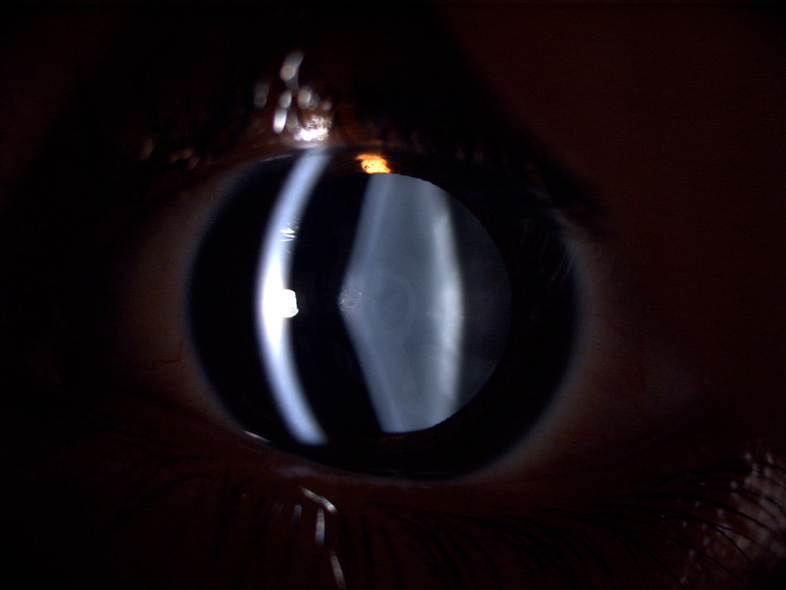
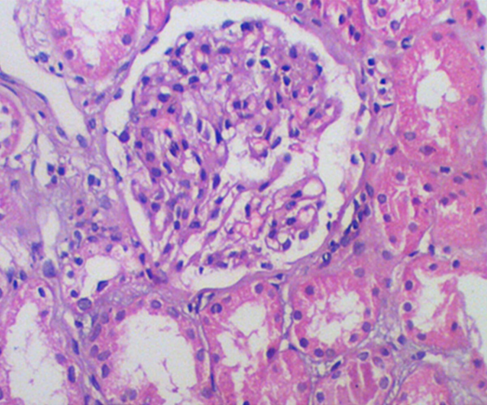
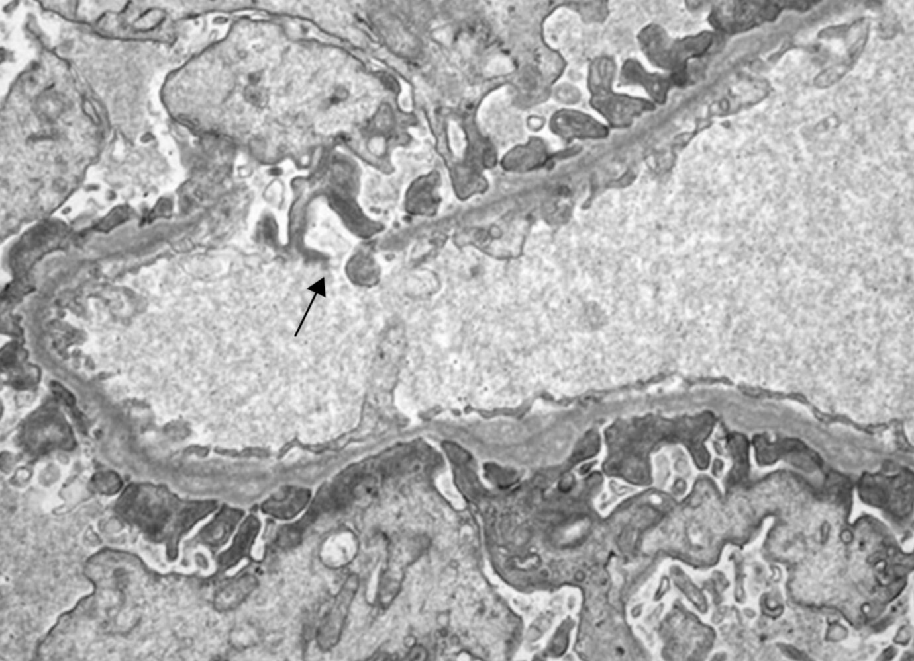

# Alport syndrome

*Categories: Clinical knowledge > Internal medicine > Nephrology > Glomerular diseases > Alport syndrome*

[Original Article Link](https://coursology-qbank.com/amboss/article/BL0z-g)

---

## Summary

Alport syndrome is a genetic disorder that is characterized by <u>glomerulonephritis</u>, often in combination with <u>sensorineural hearing loss</u> and sometimes <u>eye</u> abnormalities. It is caused by a genetic defect of type IV <u>collagen</u>, which is usually inherited in an X-linked dominant pattern. Patients typically present with intermittent <u>gross hematuria</u> during <u>infancy</u>. In <u>adolescence</u>, patients classically start to develop more serious <u>signs of chronic kidney disease</u> (e.g., <u>proteinuria</u>), and may experience <u>hearing loss</u> or, in rare cases, <u>vision</u> problems. In milder forms, patients may remain asymptomatic and only require monitoring. In classic Alport syndrome, diagnostic evaluation shows persistent <u>microhematuria</u> on <u>urinalysis</u> and splitting of the <u>glomerular basement membrane</u> on <u>kidney biopsy</u>. The classic form usually leads to end-stage renal disease (<u>ESRD</u>) between the second and third decade of life, and the only definitive treatment is a <u>kidney transplant</u>.

---

## Etiology

* Usually X-linked (80%)  [[2]](https://coursology-qbank.com/amboss/article/T5X6jA)[[3]](https://coursology-qbank.com/amboss/article/c5XaQA)[[4]](https://coursology-qbank.com/amboss/article/15X2QA)

* Can also be <u>autosomal recessive</u> (15%) or <u>autosomal dominant</u> (5%) [[4]](https://coursology-qbank.com/amboss/article/15X2QA)

* The disease tends to be more severe in males [[5]](https://coursology-qbank.com/amboss/article/yYXd79)

---

## Pathophysiology

* Genetic defect of <u>type IV collagen</u> chains (component of the <u>basement membrane</u> of the <u>kidneys</u>, <u>eye</u>, and <u>cochlea</u>) → <u>kidney</u> damage (<u>glomerulonephritis</u>), <u>sensorineural hearing loss</u>, and ocular abnormalities

---

## Clinical features

* Age of onset can vary markedly among individuals (from <u>infancy</u> to late adulthood) depending on the underlying genetic defect

* Often asymptomatic

* Initially intermittent gross <u>hematuria</u> (may present in <u>infancy</u>)

* As <u>glomerular</u> damage progresses, symptoms of <u>nephritic syndrome</u> and <u>chronic kidney disease</u> occur (usually leads to <u>ESRD</u> between 16–35 years of age) [[1]](https://coursology-qbank.com/amboss/article/BYXzr9)

* <u>Sensorineural hearing loss</u>

* Ocular findings: <u>retinopathy</u>, <u>anterior</u> lenticonus (a congenital conical elevation at the <u>anterior</u> pole or <u>posterior</u> pole of the crystalline <u>lens</u> in the <u>eye</u>)

* <u>Anterior</u> <u>lenticonus</u> may be seen in Alport's syndrome, and a <u>posterior</u> <u>lenticonus</u> may be seen in Lowe's syndrome (oculocerebral renal syndrome).

* A <u>lenticonus</u> appears as an oil globule in the center of the <u>red reflex</u> on <u>direct ophthalmoscopy</u>.

> [!NOTE]
> Patients with Alport syndrome can't pee, can't see, can't hear a bee.

Anterior lenticonus in Alport syndrome

---

## Diagnosis

* Laboratory tests

* <u>Urinalysis</u>: best initial test, signs of <u>nephritic syndrome</u> (e.g., <u>hematuria</u>, minor <u>proteinuria</u>)

* <u>BUN</u> and <u>creatinine</u> to assess severity of renal disease

* <u>Skin biopsy</u>

* <u>Confirmatory test</u>

* Shows absence of <u>collagen type IV</u> alpha-5 chains

* <u>Kidney biopsy</u> 

* <u>Light microscopy</u>: mesangial cell <u>proliferation</u> and <u>sclerosis</u>

* <u>Electron microscopy</u>: splitting and alternating irregular thickening and thinning of the <u>glomerular basement membrane</u> (“basket-weave appearance”)

* <u>Immunofluorescence</u>

* Initially may be negative

* Irregular deposits of <u>IgM</u>, <u>IgG</u>, and/or C3

* <u>Immunostaining</u>: absence of the <u>type IV collagen</u> alpha-3, alpha-4, and/or alpha-5 chains in the <u>basement membrane</u>

* Molecular <u>genetic testing</u>: can confirm and distinguish subtypes

* Other 

* <u>Audiometry</u>: may detect high-frequency <u>sensorineural hearing loss</u>

* Ophthalmic evaluation: may detect <u>anterior</u> <u>lenticonus</u>, perimacular flecks, and/or other <u>eye</u> abnormalities

Histology of alport syndrome

Alport syndrome

---

## Treatment

* Monitor renal function regularly

* In patients with <u>proteinuria</u>: <u>ACE inhibitors</u>/<u>angiotensin II receptor blockers</u>

* In patients with <u>renal failure</u>: See “Treatment” in “<u>Chronic kidney disease</u>” (e.g., <u>sodium</u> restriction, <u>diuretics</u>).

* <u>Kidney transplant</u>

* The only definitive treatment of Alport syndrome

* Complication: <u>Goodpasture disease</u> can occur due to newly developed <u>collagen type IV</u> <u>antigens</u> following a <u>kidney transplant</u>. [[6]](https://coursology-qbank.com/amboss/article/AYXR79)

* <u>Hearing aids</u> in patients with <u>hearing loss</u>

* Consider ocular <u>surgery</u> in patients with <u>lenticonus</u>

---