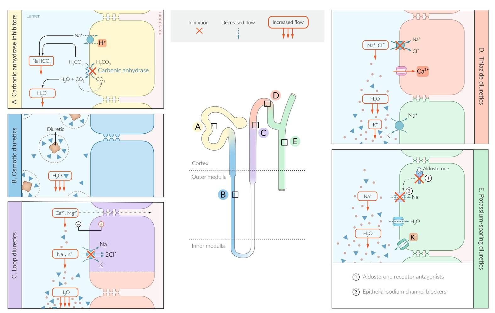
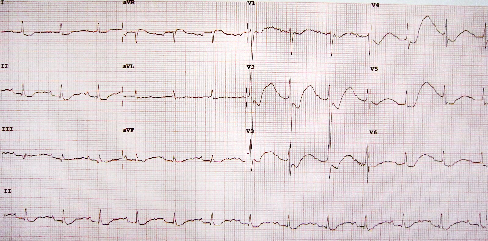
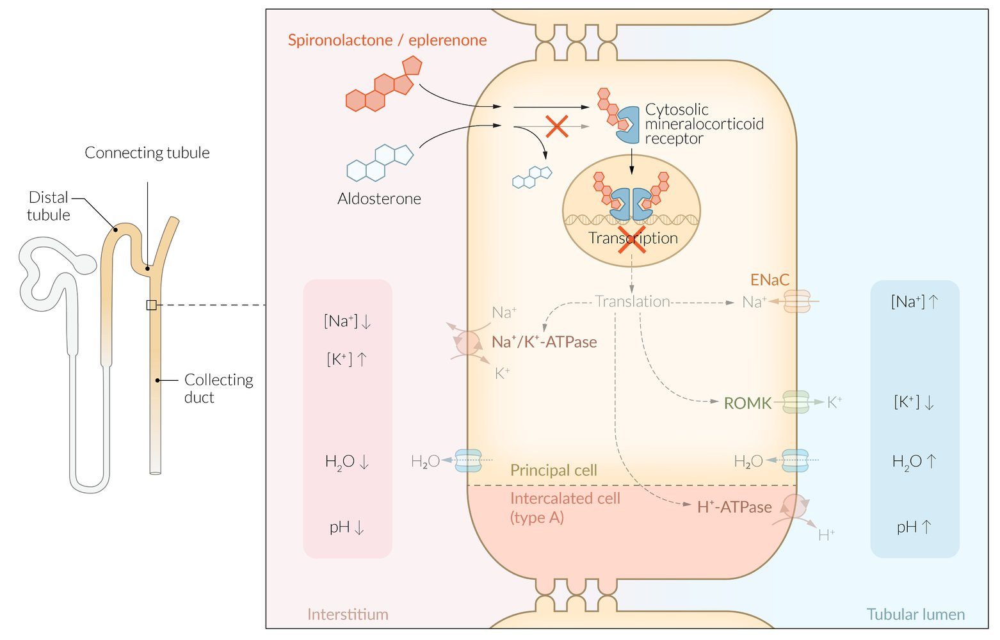

# Diuretics

*Categories: Clinical knowledge > Internal medicine > Nephrology > Relevant pharmacology > Diuretics*

[Original Article Link](https://coursology-qbank.com/amboss/article/gm0FUg)

---

## Summary

Diuretics are a group of drugs that increase the production of urine. Diuretics are categorized according to the renal structures they act on and the changes they lead to in the volume and composition of urine, as well as <u>electrolyte</u> balance. Some of these effects are useful in treating disorders such as <u>hypercalcemia</u>, <u>hypocalcemia</u>, and hyperaldosteronism. The most commonly used diuretics with a pronounced diuretic effect are <u>thiazides</u>, <u>loop diuretics</u>, and <u>potassium-sparing</u> diuretics. <u>Osmotic diuretics</u> and <u>carbonic anhydrase inhibitors</u> are used in acute settings to lower intracranial and/or <u>intraocular pressure</u> (e.g., <u>cerebral edema</u>, acute <u>glaucoma</u>). The most serious side effects of the majority of diuretics include <u>volume depletion</u> and excessive changes in serum <u>electrolyte</u> levels (particularly of <u>sodium</u> and <u>potassium</u>), which increases the risk for <u>cardiac arrhythmias</u>.

---

## Overview of diuretics

### <u>Overview of diuretic agents</u>

| Overview of diuretic agents |  |  |  |  |  |  |  |  |  |  |
| --- | --- | --- | --- | --- | --- | --- | --- | --- | --- | --- |
| Agents |  | Indications |  | Mechanism of action | Adverse effects |  | Contraindications |  | Interactions |  |
|  Osmotic agents (e.g., <u>mannitol</u>, <u>urea</u>) |  |   * <u>Elevated ICP</u>  * Acute <u>glaucoma</u>  * Forced <u>renal excretion</u> of substances    |  |   * Serum: ↑ shift of water into the <u>intravascular space</u> → ↑ binding of water → ↓ intracranial and <u>intraocular pressure</u>  * <u>Glomerular</u> filtrate: ↑ tubular fluid <u>osmolarity</u> → ↑ binding of water → ↑ urine production    |   * <u>Dehydration</u>  * <u>Pulmonary edema</u>, <u>hyponatremia</u> or <u>hypernatremia</u>    |  |   * <u>Anuria</u>  * Progressive <u>heart failure</u>    |  |  * Other types of diuretics: ↑ risk of <u>renal failure</u> [[1]](https://coursology-qbank.com/amboss/article/pWcLmY0)   |  |
|  <u>Carbonic anhydrase inhibitors</u> (e.g., <u>acetazolamide</u>) [[2]](https://coursology-qbank.com/amboss/article/JWcsmY0) |  |   * Acute <u>glaucoma</u>  * <u>Altitude sickness</u>  * <u>Idiopathic intracranial hypertension</u>    |  |   * Inhibition of <u>carbonic anhydrase</u> in <u>proximal convoluted tubules</u> → <u>alkalinization of urine</u> and blood  * Other effects: ↓ production of <u>aqueous humor</u> and <u>CSF</u>    |   * <u>Hypokalemia</u>, <u>hyperammonemia</u> with <u>paresthesias</u>, <u>calcium phosphate stone</u> formation  * <u>Proximal renal tubular acidosis</u>  * <u>Sulfonamide</u> hypersensitivity    |  |   * <u>Hyperchloremic metabolic acidosis</u>  * Severe <u>renal insufficiency</u>    |  |   * Increases <u>phenytoin</u> concentrations and <u>lithium</u> excretion  * Decreases excretion of <u>amphetamine</u>    |  |
|  <u>Thiazide diuretics</u> (e.g., <u>hydrochlorothiazide</u>) |  |   * <u>Hypertension</u>  * Chronic <u>edema</u> in <u>congestive heart failure</u>, <u>cirrhosis</u>  * <u>Nephrogenic diabetes insipidus</u>    |  |   * Inhibition of Na+-<u>Cl-</u> cotransporters in the early <u>distal</u> tubule segment  * ↑ Reabsorption of <u>Ca2+</u>    |   * <u>Hypokalemia</u> and <u>metabolic alkalosis</u>, <u>hyponatremia</u>, <u>hypomagnesemia</u>  * <u>Hyperglycemia</u>, <u>hyperuricemia</u>  * <u>Allergic reactions</u> (<u>sulfonamide</u> hypersensitivity)    |   * <u>Hypercalcemia</u>  * <u>Hyperlipidemia</u>  * <u>Megaloblastic anemia</u>  * <u>Thrombocytopenia</u>    |   * Hypersensitivity  * <u>Gout</u>, <u>anuria</u>, severe <u>hypokalemia</u>    |  |   * <u>Glucocorticoids</u>: ↑ <u>hypokalemia</u>  * <u>Lithium</u> and <u>carbamazepine</u>: ↑ <u>hyponatremia</u>  * <u>ACE inhibitors</u>: <u>hypotension</u>    |  |
| <u>Loop diuretics</u> |  <u>Sulfonamides</u> (e.g., <u>furosemide</u>) [[3]](https://coursology-qbank.com/amboss/article/qWcCmY0) |   * <u>Hypertension</u>  * <u>Edema</u> (cardiac, renal, hepatic)  * <u>Forced diuresis</u>    |  |   * Inhibition of <u>Na+-K+-2Cl- cotransporters</u> in the thick <u>ascending loop of Henle</u>  * ↓ <u>Calcium</u> reabsorption    |   * <u>Ototoxicity</u>  * <u>Hypocalcemia</u>  * <u>Dehydration</u>/<u>hypovolemia</u>    |  * <u>Anuria</u>   |  * <u>Sulfonamide</u> hypersensitivity   |  * <u>Aminoglycosides</u>, <u>ethacrynic acid</u>, and <u>cisplatin</u>: ↑ risk of <u>ototoxicity</u>   |  * <u>ACEIs</u>, <u>ARBs</u>: <u>renal failure</u>, <u>hypotension</u>   |  |
|  <u>Ethacrynic acid</u> [[4]](https://coursology-qbank.com/amboss/article/IWcY5Y0) |  * History of severe, drug-induced <u>watery diarrhea</u>   |  * <u>NSAIDs</u>: ↓ <u>effectiveness</u> of <u>ethacrynic acid</u>   |  |  |  |  |  |  |  |  |
| <u>Potassium-sparing diuretics</u> |  <u>Aldosterone receptor antagonists</u> (<u>spironolactone</u>, <u>eplerenone</u>) [[5]](https://coursology-qbank.com/amboss/article/rWcf5Y0) |   * <u>Hypertension</u>    * <u>Hypokalemia</u>    |   * <u>Ascites</u>/<u>edema</u> (<u>congestive heart failure</u>, <u>nephrotic syndrome</u>, <u>cirrhosis</u>)  * <u>PCOS</u>    |  * Competitively bind to <u>aldosterone</u> <u>receptors</u> in the late <u>distal convoluted tubule</u> → inhibition of <u>aldosterone</u> effects   |   * <u>Hyperkalemia</u>, <u>metabolic acidosis</u>  * Endocrine disturbances (<u>spironolactone</u>)  * Men: antiandrogenic effects (e.g., <u>gynecomastia</u>, <u>erectile dysfunction</u>)  * Women: <u>amenorrhea</u>    |  |   * <u>Anuria</u> and/or <u>renal insufficiency</u>  * Preexisting <u>hyperkalemia</u>  * <u>Addison disease</u>    |   * <u>Eplerenone</u>  * <u>Hypertension</u> with concomitant <u>type II diabetes mellitus</u> and <u>microalbuminuria</u>  * Concomitant use of strong <u>CYP3A4</u> inhibitors  * <u>Spironolactone</u>: renal impairment    |  * <u>ACEIs</u>: ↑ risk of <u>hyperkalemia</u>   |  |
|  <u>Epithelial sodium channel blockers</u> (<u>triamterene</u>, <u>amiloride</u>) |  * <u>Nephrogenic diabetes insipidus</u>   |  * Direct inhibition of <u>ENaCs</u> in <u>distal convoluted tubules</u> and <u>collecting ducts</u>   |  * <u>Amiloride</u>: <u>diabetic nephropathy</u>   |  |  |  |  |  |  |  |

### Overview of diuretic effects

| Overview |  |  |  |  |  |
| --- | --- | --- | --- | --- | --- |
| Agents | Water elimination | Effects on serum |  |  |  |
| <u>pH</u> |  Na+  | <u>K+</u> | <u>Ca2+</u> |  |  |
| <u>Osmotic diuretics</u> |  * Significantly increased   |  * Variable (see <u>osmotic diuretics</u> below)   |  |  |  |
| <u>Carbonic anhydrase inhibitors</u> |  * Slightly increase   |  * Decreased   |  * Slightly decreased   |  * Slightly decreased   |  * Slightly decreased   |
|  <u>Thiazide diuretics</u> [[6]](https://coursology-qbank.com/amboss/article/K_0U6i) |  * Increased   |  * Increased [[7]](https://coursology-qbank.com/amboss/article/QBbu0w)   |  * Decreased   |  * Decreased   |  * Increased   |
| <u>Loop diuretics</u> |  * Significantly increased   |  * Increased   |  * Normal/slightly decreased   |  * Decreased   |  * Decreased   |
| <u>Potassium-sparing diuretics</u> |  * Slightly increased   |  * Decreased   |  * Decreased   |  * Increased   |  * No change   |

### Mechanisms of blood <u>acid-base balance</u> changes

#### <u>Alkalosis</u>

* Agents: <u>loop diuretics</u> and <u>thiazides</u>

* Mechanisms

* Diuresis → volume contraction (i.e., volume loss) ; → ↑ <u>RAAS</u> → ↑ <u>ATII</u> → ↑ <u>Na+/H+ exchanger</u> in the PCT;   → ↑ <u>HCO3-</u> reabsorption (<u>contraction alkalosis</u>)

* <u>K+</u>excretion → <u>hypokalemia</u>, leading to the following effects:

* Induction of H+ excretion (instead of <u>K+</u> excretion) in exchange for Na+ reabsorption in the collecting duct → ↑ <u>HCO3-</u> reabsorption → <u>alkalosis</u> with paradoxical aciduria

* Induction of <u>H+/K+-ATPases</u> in all cells;  in order to counteract the decrease in serum <u>K+</u>→ <u>K+</u> outflow from the cells in exchange for H+→ ↓ serum H+ → <u>metabolic alkalosis</u>

#### <u>Acidosis</u>

* Agents: <u>carbonic anhydrase inhibitors</u> and <u>potassium-sparing</u> diuretics

* Mechanisms

* <u>Carbonic anhydrase inhibitors</u>: via decreased HCO3− reabsorption

* <u>Potassium-sparing</u> diuretics

* <u>Hyperkalemia</u> → influx of <u>K+</u> to the cells in exchange for H+ via H+/<u>K+</u>exchanger → <u>acidosis</u>

* <u>Aldosterone</u> blockers specifically inhibit renal <u>K+</u> and H+ secretion

Overview of diuretics

---

## Thiazide diuretics

### Agents

* Hydrochlorothiazide (<u>HCTZ</u>)

* Chlorthalidone

* Chlorothiazide

* Metolazone

### Mechanism of action

* Inhibition of Na+-<u>Cl-</u> cotransporters ;   in the early <u>distal convoluted tubule</u>;   → ↑ excretion of Na+ (saluresis) and <u>Cl-</u> → ↓ diluting capacity of <u>nephron</u> and ↑ excretion of <u>potassium</u>;  (<u>kaliuresis</u>) and ↓ excretion of <u>calcium</u>  → diuresis

* Increased reabsorption of <u>Ca2+</u>

* <u>Hyperpolarization</u> of <u>smooth muscle cells</u> → <u>vasodilation</u>

* <u>Hyperpolarization</u> of <u>pancreatic</u> <u>beta cells</u> → decreased <u>insulin</u> release [[8]](https://coursology-qbank.com/amboss/article/kKYmgJ)

* See “Mechanism of <u>blood pH</u>” changes in “Overview of diuretics” for mechanism of <u>alkalosis</u>.

### Side effects [[9]](https://coursology-qbank.com/amboss/article/q_0C6i)

* <u>Hypokalemia</u> and <u>metabolic alkalosis</u>

* <u>Hyponatremia</u> [[10]](https://coursology-qbank.com/amboss/article/J_0s6i)

* <u>Hypomagnesemia</u>

* <u>Hypercalcemia</u>

* <u>Hyperglycemia</u>  [[11]](https://coursology-qbank.com/amboss/article/RHYlJq)

* <u>Hyperlipidemia</u> (↑ <u>cholesterol</u>, <u>triglycerides</u>)

* <u>Hyperuricemia</u>

* <u>Allergic reactions</u> (<u>sulfonamide</u> hypersensitivity)

### Indications

* <u>Hypertension</u>

* Chronic <u>edema</u> secondary to <u>congestive heart failure</u>; , <u>cirrhosis</u>, and <u>kidney</u> disease

* Prevention of <u>calcium</u> <u>kidney stones</u>, <u>idiopathic hypercalciuria</u>

* <u>Osteoporosis</u>

* <u>Nephrogenic diabetes insipidus</u>  [[12]](https://coursology-qbank.com/amboss/article/GybBgw)[[13]](https://coursology-qbank.com/amboss/article/xL0E-g)

* <u>Sequential nephron blockade</u>

### Contraindications

* Hypersensitivity (including hypersensitivity to any <u>sulfonamide</u> medications) [[14]](https://coursology-qbank.com/amboss/article/OKYIgJ)

* <u>Gout</u>

* <u>Anuria</u>

* Severe <u>hypokalemia</u>

> [!WARNING]
> <u>Thiazides</u> should be used with caution in patients with <u>prediabetes</u> and <u>diabetes mellitus</u> because they can cause <u>hyperglycemia</u> and changes in <u>glucose</u> concentration.

### Interactions

* <u>Glucocorticoids</u>: increased <u>hypokalemia</u>

* <u>Carbamazepine</u>: increased <u>hyponatremia</u>

* <u>Lithium</u>: increased <u>hyponatremia</u> [[15]](https://coursology-qbank.com/amboss/article/ghYFWK)

* <u>ACE inhibitors</u>: <u>hypotension</u> (especially first-dose <u>hypotension</u>)

* <u>Propranolol</u>: increased <u>hyperlipidemia</u> and <u>hyperglycemia</u>

* <u>NSAIDs</u>: decreased diuretic effect

* Increased effects of <u>digitalis</u> , <u>methotrexate</u>, and <u>lithium</u>

> [!NOTE]
> To avoid <u>hypokalemia</u>, <u>thiazide diuretics</u> may be combined with <u>potassium-sparing</u> diuretics (e.g., <u>aldosterone receptor antagonists</u>).

> [!NOTE]
> To remember the side effects of <u>thiazide diuretics</u>, think of “hyperGLUC”: hyperGlycemia, hyperLipidemia, hyperUricemia, and hyperCalcemia.

---

## Loop diuretics

### Agents

* <u>Sulfonamides</u>: furosemide, torsemide, bumetanide

* Other: ethacrynic acid

### Mechanism of action [[16]](https://coursology-qbank.com/amboss/article/7_04pi)

* Blockage of <u>Na+-K+-2Cl-cotransporter</u> ;  in the thick <u>ascending loop of Henle</u>

* Diminishing concentration gradient between the (usually hypertonic) <u>renal medulla</u> and the cortex → <u>concentration of urine</u> is no longer possible → increased diuresis

* Decreased reabsorption of <u>Ca2+</u> and <u>Mg2+</u>

* Increased PGE release (can be inhibited by <u>NSAIDs</u>)

* Dilation of renal afferent <u>arterioles</u> → diuresis

* General venodilation (rapid venous pooling) → ↓ cardiac <u>preload</u>

* See “Mechanism of <u>blood pH</u>” changes in “Overview of diuretics” for mechanism of <u>alkalosis</u>.

> [!NOTE]
> To recall that <u>loop diuretics</u> cause increased excretion of <u>calcium</u>, think: loops lose <u>calcium</u>!

### Side effects [[17]](https://coursology-qbank.com/amboss/article/r_0fpi)

* Metabolic imbalances

* <u>Hypokalemia</u>, <u>hypomagnesemia</u>, <u>hypocalcemia</u>, <u>hypochloremia</u>, <u>hyponatremia</u> (moderate)

* <u>Metabolic alkalosis</u>

* <u>Hyperuricemia</u>/<u>gout</u>

* <u>Hyperglycemia</u>

* <u>Ototoxicity</u> (potentially permanent <u>hearing</u> damage): especially high risk with <u>ethacrynic acid</u>

* <u>Dehydration</u>/<u>hypovolemia</u>

* <u>Sulfonamide</u> hypersensitivity (except <u>ethacrynic acid</u>, which can be used for diuresis in patients with <u>allergies</u> to <u>sulfonamides</u>);  → <u>rash</u>, <u>interstitial</u> nephritis

> [!NOTE]
> To recall the side effects of <u>loop diuretics</u>, think of “GO PANDA”: Gout, Ototoxicity, low Potassium, Allergy, Nephritis, Dehydration, Alkalosis.

> [!NOTE]
> To remember that loop diuretics are <u>ototoxic</u>, imagine a vertical loop of a roller coaster and <u>deaf</u>ening screams of people passing through it.

> [!WARNING]
> <u>Hypokalemia</u> and/or <u>hypomagnesemia</u> can lead to life-threatening <u>arrhythmias</u>!

ECG features of hypokalemia

### Indications [[18]](https://coursology-qbank.com/amboss/article/t_0XJi)

* <u>Hypertension</u>

* <u>Edema</u>

* Cardiac (acute and <u>congestive heart failure</u>, <u>peripheral edema</u>, <u>lung</u> <u>edema</u>)

* Renal (<u>nephrotic syndrome</u>)

* Hepatic (<u>liver cirrhosis</u>)

* <u>Renal failure</u> (acute and chronic)

* <u>Hypercalcemia</u>

* Forced diuresis

* Definition: massive diuresis for forced <u>renal elimination</u> of (toxic) substances

* Implementation: IV administration of large amounts of fluids in combination with <u>loop diuretics</u>

* Indications: <u>hypercalcemic crisis</u>, severe <u>hyperkalemia</u>, <u>rhabdomyolysis</u>, intoxication (e.g., <u>lithium</u>)

* Sequential nephron blockade [[19]](https://coursology-qbank.com/amboss/article/H_0Kpi)

* Used to overcome resistance to diuretic treatment

* Method: combination of <u>loop diuretics</u> and <u>thiazides</u>  → restoration of diuretic effects

> [!WARNING]
> Because of the increased risk of <u>hypokalemia</u> and <u>hypovolemia</u> during <u>forced diuresis</u>, rigorous monitoring is necessary.

### Contraindications

| Contraindications for loop diuretics |  |  |  |  |
| --- | --- | --- | --- | --- |
| Condition | <u>Furosemide</u> | <u>Torsemide</u> | <u>Bumetanide</u> | <u>Ethacrynic acid</u> |
|  <u>Anuria</u>  |  * Yes   |  * Yes   |  * Yes   |  * Yes   |
| <u>Sulfonamide</u> hypersensitivity |  * Yes   |  * Yes   |  * Yes   |  * No   |
| Hepatic <u>coma</u> or severe <u>electrolyte</u> depletion |  * No   |  * No   |  * Yes   |  * No   |
|  History of severe <u>watery diarrhea</u> (caused by the drug)   |  * No   |  * No   |  * No   |  * Yes   |

---

## Potassium-sparing diuretics

### Agents

* <u>Aldosterone receptor antagonists</u>: spironolactone, eplerenone

* <u>Epithelial sodium channel blockers</u>: triamterene, amiloride

> [!NOTE]
> To remember that Spironolactone, Triamterene, Eplerenone, and Amiloride are <u>K+</u>-sparing, think of STEAK!

### Mechanism of action

Although the molecular pathways differ, both types of <u>potassium-sparing</u> diuretics have very similar clinical effects.

* Aldosterone receptor antagonists (<u>spironolactone</u>, <u>eplerenone</u>)

* Competitively bind to <u>aldosterone</u> <u>receptors</u> in the late <u>distal convoluted tubule</u>  and the <u>collecting duct</u> → inhibition of the effects of <u>aldosterone</u> → decreased Na+ reabsorption and <u>K+</u> excretion; ; ;   → diuresis

* Decreased H+ excretion → <u>acidosis</u>

* Evolving <u>hyperkalemia</u> induces <u>H+/K+-ATPases</u> in all cells;  to counteract the increase in serum <u>K+</u> → <u>K+</u> enters cells in exchange for H+→ amplifies <u>acidosis</u>

* <u>Spironolactone</u> also acts (nonspecifically) on sex <u>hormone</u> <u>receptors</u> → endocrine side effects (see section “<u>Gonads</u>” in “<u>General endocrinology</u>” for more information about hormonal effects of <u>spironolactone</u>)

* Epithelial sodium channel blockers (<u>triamterene</u>, <u>amiloride</u>): direct inhibition of the <u>epithelial sodium channels</u> (<u>ENaC</u>) in the <u>distal convoluted tubule</u> and the collecting duct → reduced Na+ reabsorption and reduced <u>K+</u> secretion → diuresis

Mechanism of action: potassium-sparing diuretics

> [!NOTE]
> Spironolactone and eplerenone are aldosterone <u>receptor</u> <u>antagonists</u>.

### Side effects

* General side effects

* Metabolic and <u>electrolyte</u> imbalances, such as <u>hyperkalemia</u>; , <u>hyponatremia</u>, and <u>metabolic acidosis</u>, can lead to <u>cardiac arrhythmias</u>

* Gastrointestinal disturbances (<u>nausea</u>, <u>vomiting</u>, <u>diarrhea</u>)

* <u>Spironolactone</u>-specific side effects: endocrine disturbances

* Men: antiandrogenic effects (e.g., <u>gynecomastia</u>, <u>erectile dysfunction</u>)

* Women: <u>amenorrhea</u>

### Indications

* <u>Hypertension</u> (especially if <u>hypokalemia</u> is also present)

* <u>Ascites</u>/<u>edema</u> due to <u>congestive heart failure</u>, <u>nephrotic syndrome</u>, or <u>cirrhosis</u> of the <u>liver</u> (mainly <u>spironolactone</u>)

* Hyperaldosteronism (<u>Conn syndrome</u>)

* <u>Nephrogenic diabetes insipidus</u> (<u>amiloride</u>) [[20]](https://coursology-qbank.com/amboss/article/vAbAlw)

* <u>Hypokalemia</u>

* Hyperandrogenic states, e.g., <u>polycystic ovary syndrome</u> (<u>spironolactone</u>)

### Contraindications

#### General

* <u>Anuria</u> and/or <u>renal insufficiency</u>

* Preexisting <u>hyperkalemia</u>

* <u>Addison disease</u>

* Combination with other <u>potassium-sparing</u> diuretics or <u>potassium</u> supplements

#### Specific

* <u>Spironolactone</u>: Use with caution in patients with <u>CHF</u> with either of the following:

* <u>GFR</u> < 30 mL/min

* <u>Creatinine</u> ≥ 2.5 mg/dL (men) or ≥ 2.0 mg/dL (women)

* <u>Eplerenone</u>

* Concomitant use of strong <u>CYP3A4</u> inhibitors

* Patients with <u>hypertension</u> with concomitant <u>type II diabetes</u> mellitus and <u>microalbuminuria</u> or with <u>renal insufficiency</u> (serum <u>creatinine</u> > 2 mg/dL for men or > 1.8 mg/dL for women; or <u>creatinine clearance</u> < 50 mL/min)

* <u>Creatinine clearance</u> < 30 mL/min

* <u>Amiloride</u>: <u>diabetic nephropathy</u>

---

## Osmotic diuretics

### Agents

* Mannitol

* <u>Urea</u>  [[21]](https://coursology-qbank.com/amboss/article/D_01qi)

### Mechanism of action

* Increase the <u>osmolality</u> of:

* Serum: ↑ shift of water into the <u>intravascular</u> space → ↑ binding of water → ↓ intracranial and <u>intraocular pressure</u>

* <u>Glomerular</u> filtrate: ↑ tubular fluid <u>osmolarity</u> → ↑ binding of water → ↑ <u>urine production</u>

* No <u>saluresis</u>

### Side effects

* <u>Dehydration</u>

* Initial cardiac volumetric strain

* Metabolic and <u>electrolyte</u> imbalances

* Effective <u>glomerular filtration</u> → <u>hypernatremia</u>

* Ineffective <u>glomerular filtration</u>  or administration of very high doses → ↑ plasma <u>osmolality</u> → ↑ <u>extracellular fluid</u> volume → <u>pulmonary edema</u>; , <u>potassium</u> fluctuations, <u>hyponatremia</u> or <u>hypernatremia</u>, and/or <u>metabolic acidosis</u>

### Indications

* <u>Elevated ICP</u> (e.g., <u>cerebral edema</u>)

* Acute <u>glaucoma</u>

* Prevention of <u>acute renal injury</u> in cases of <u>oliguria</u>

* Forced <u>renal excretion</u> of substances(e.g., drugs or toxins)

### Contraindications

* <u>Anuria</u>

* Progressive <u>heart failure</u>

* Severe <u>pulmonary edema</u>

* <u>Severe dehydration</u>

---

## Carbonic anhydrase inhibitors

### Agents

* Acetazolamide

### Mechanism of action

* Inhibition of <u>carbonic anhydrase</u> ;  in the following organs:

* <u>Kidney</u> (in the <u>proximal convoluted tubule</u>): → ↑ H+ reabsorption and inhibition of Na+/H+ exchange → ↑ <u>NaHCO3</u> diuresis and ↑ <u>HCO3-</u> elimination  → compensatory <u>hyperventilation</u>; disinhibition of central <u>chemoreceptors</u> → ↑ oxygenation

* Eyes: ↓ production of <u>aqueous humor</u>

* <u>Brain</u>: ↓ <u>CSF</u> production

* Acid-base effects: alkalinizes urine and acidifies blood

### Side effects

* <u>Hyperammonemia</u> with <u>paresthesias</u>

* <u>Proximal</u> renal tubular <u>acidosis</u> → <u>hyperchloremic</u>, nonanion gap <u>metabolic acidosis</u>

* <u>Hypokalemia</u>

* <u>Sulfonamide</u> hypersensitivity

* <u>Calcium phosphate stone</u> formation (alkaline urine promotes precipitation)

* Neuropathy

### Indications

* Acute <u>glaucoma</u>

* <u>Altitude sickness</u> (counteracts <u>respiratory alkalosis</u>)

* <u>Idiopathic intracranial hypertension</u>

* <u>Metabolic alkalosis</u>

* Prevention of <u>cystine</u> <u>kidney stones</u>

### Contraindications

* <u>Hyperchloremic metabolic acidosis</u>

* Severe <u>renal insufficiency</u>

* Adrenocortical insufficiency

* <u>Hyponatremia</u>, <u>hypokalemia</u>

* Hepatic disease or insufficiency [[22]](https://coursology-qbank.com/amboss/article/LKYwSJ)

* Long-term use in <u>glaucoma</u>

> [!NOTE]
> ACetazolamide causes ACidosis.

---