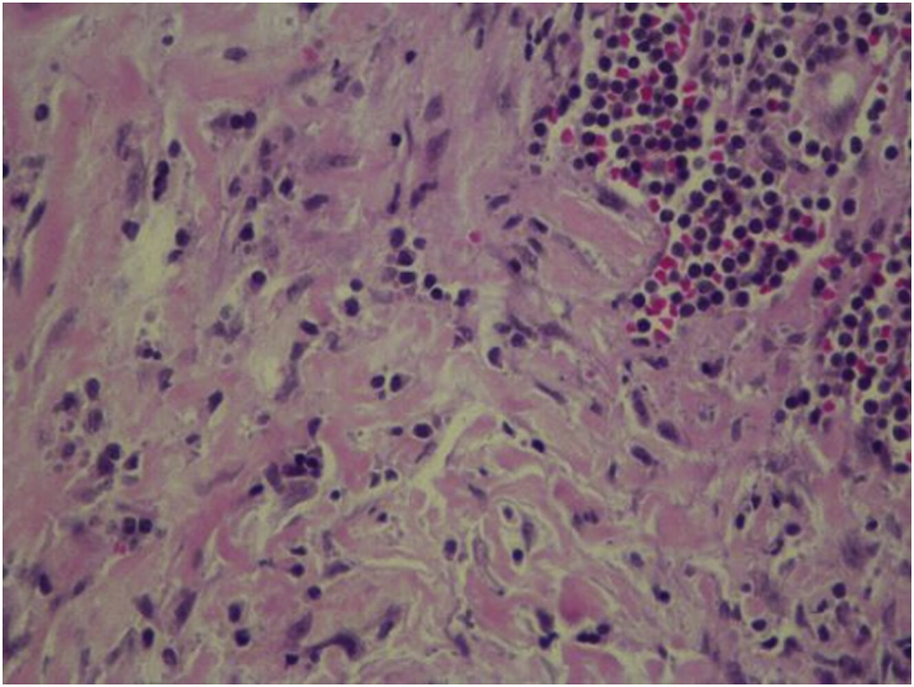

# IgG4-related disease

*Categories: Clinical knowledge > Internal medicine > Nephrology > Tubulointerstitial diseases > IgG4-related disease*

[Original Article Link](https://coursology-qbank.com/amboss/article/Vu0GJ3)

---

## Summary

IgG4-related disease (IgG4-RD) is a progressive, immune-mediated fibroinflammatory condition characterized by IgG4 infiltration with subsequent formation of <u>tumor</u>-like <u>sclerotic</u> masses and organ dysfunction. The most common manifestations include <u>type 1 autoimmune pancreatitis</u>, <u>retroperitoneal fibrosis</u>, <u>sialadenitis</u> and <u>dacryoadenitis</u>, and <u>tubulointerstitial nephritis</u>. Symptom onset is typically subacute. Findings on <u>serology</u> (e.g., elevated IgG4 levels) and imaging (e.g., masses, organ enlargement) are nonspecific but can help support the diagnosis. A <u>biopsy</u> is required for a definitive diagnosis; characteristic features include lymphoplasmacytic infiltrate with IgG4-positive <u>plasma cells</u>, storiform <u>fibrosis</u>, and obliterative phlebitis. <u>Glucocorticoids</u> are often used first line and are highly effective in inducing remission. <u>Immunosuppressive agents</u> (e.g., <u>rituximab</u>) may be used in refractory or relapsing disease. Long-term follow-up is essential due to the risk of relapse and potential organ damage if untreated.

---

## Overview

### <u>Epidemiology</u> [[1]](https://coursology-qbank.com/amboss/article/GQdBxp0)

* Onset: > 50 years of age [[1]](https://coursology-qbank.com/amboss/article/GQdBxp0)[[2]](https://coursology-qbank.com/amboss/article/8QdOBp0)

* <u>♂</u> > <u>♀</u>

### Clinical features and differential diagnoses

* IgG4-RD can involve almost any organ. [[1]](https://coursology-qbank.com/amboss/article/GQdBxp0)

* The most common manifestations are listed in the table below; other IgG4-related conditions include: [[1]](https://coursology-qbank.com/amboss/article/GQdBxp0)

* IgG4-related pachymeningitis

* IgG4-related hypophysitis

* IgG4-related pulmonary disease

* IgG4-related <u>fibrosing mediastinitis</u>

* Up to 90% of patients with IgG4-RD have multiorgan involvement. [[3]](https://coursology-qbank.com/amboss/article/FQdgBp0)

* It can be difficult to distinguish IgG4-RD from other conditions (e.g., <u>carcinoma</u>, other autoimmune diseases) based on clinical features alone. [[3]](https://coursology-qbank.com/amboss/article/FQdgBp0)[[4]](https://coursology-qbank.com/amboss/article/tQdXBp0)

|  Overview of IgG4-related disease [[1]](https://coursology-qbank.com/amboss/article/GQdBxp0)[[3]](https://coursology-qbank.com/amboss/article/FQdgBp0)  |  |  |  |
| --- | --- | --- | --- |
| Manifestations |  | Clinical features |  Differential diagnoses [[5]](https://coursology-qbank.com/amboss/article/4jd30J0)  |
| <u>IgG4-related pancreatitis</u> (<u>type 1 AIP</u>) |  |   * Painless <u>jaundice</u>  * <u>Pruritus</u>  * Weight loss  * Mild abdominal <u>pain</u>  * <u>Clinical features of diabetes mellitus</u>  * <u>Clinical features of malabsorption</u>    |   * Non-IgG4-related <u>autoimmune pancreatitis</u>  * <u>Pancreatic cancer</u>  * <u>Chronic pancreatitis</u>    |
| <u>IgG4-related sclerosing cholangitis</u> |  |  * <u>Features associated with cholestasis</u>   |   * <u>Primary sclerosing cholangitis</u>  * <u>Cholangiocarcinoma</u>    |
| Chronic periaortitis | IgG4-related <u>retroperitoneal fibrosis</u> |   * Diffuse lower abdominal, flank, back, and/or thigh <u>pain</u>  * <u>Lower extremity edema</u>  * <u>Clinical features of urinary tract obstruction</u>    |   * Malignant <u>retroperitoneal fibrosis</u>, e.g., <u>lymphoma</u>, <u>metastases</u>  * Other <u>causes of retroperitoneal fibrosis</u>    |
| IgG4-related abdominal <u>aortitis</u> |   * <u>Large-vessel vasculitis</u>  * <u>Medium-vessel vasculitis</u>  * <u>Rheumatoid arthritis</u>  * <u>SLE</u>  * <u>Sarcoidosis</u>  * <u>AAA</u>    |  |  |
| IgG4-related <u>sialadenitis</u> |  |   * Painless, bilateral, firm swelling of the sublingual, submandibular (Küttner <u>tumor</u>), and/or <u>parotid glands</u>  * <u>Sicca syndrome</u>  * Normal-appearing oral <u>mucosa</u>    |   * <u>Sjogren syndrome</u>  * <u>Sarcoidosis</u>  * <u>Mumps</u>  * <u>Lymphoma</u>  * <u>GPA</u>    |
| IgG4-related <u>dacryoadenitis</u> |  |   * Painless bilateral swelling of the <u>lacrimal glands</u>  * <u>Benign lymphoepithelial lesion</u> (if concomitant involvement of the <u>parotid</u> and/or <u>submandibular glands</u>)    |  |
| IgG4-related orbital pseudotumors |  |  * Painful <u>proptosis</u> (may be severe)   |   * Orbital <u>lymphoma</u>  * <u>Fungal infections</u>  * <u>GPA</u>    |
| IgG4-related <u>tubulointerstitial nephritis</u> |  |   * <u>Clinical features of AKI</u>  * <u>Hematuria</u>    |   * Other causes of <u>chronic tubulointerstitial nephritis</u>  * See “Etiology” in “<u>Nephritic syndrome</u>.”  * See “Etiology” in “<u>Nephrotic syndrome</u>.”    |
| <u>IgG4-related thyroiditis</u> (<u>Riedel thyroiditis</u>) |  |   * Diffuse <u>thyroid</u> enlargement  * <u>Dysphagia</u>, <u>dysphonia</u>, <u>dyspnea</u>  * <u>Clinical features of hypothyroidism</u>    |  * <u>Hashimoto thyroiditis</u>   |

> [!TIP]
> IgG4-RD often leads to the formation of <u>tumor</u>-like lesions, which are frequently misdiagnosed as cancers. [[1]](https://coursology-qbank.com/amboss/article/GQdBxp0)

---

## Diagnosis

### General principles [[3]](https://coursology-qbank.com/amboss/article/FQdgBp0)[[6]](https://coursology-qbank.com/amboss/article/sQdtxp0)

* Consult specialists (e.g., rheumatology, ENT, ophthalmology) for guidance on the diagnostic approach.

* Diagnosis is often incidental and based on:

* Clinical or imaging evidence of a mass or diffuse organ enlargement

* Elevated serum IgG4 level

* Characteristic <u>biopsy</u> findings

* Exclusion of alternative diagnoses, e.g., <u>malignancy</u>, infections, <u>GPA</u>, <u>Sjogren syndrome</u>

> [!TIP]
> Serologic and imaging findings of IgG4-RD are nonspecific; histopathologic confirmation is required for a definitive diagnosis. [[3]](https://coursology-qbank.com/amboss/article/FQdgBp0)[[4]](https://coursology-qbank.com/amboss/article/tQdXBp0)

### <u>Laboratory studies</u> [[1]](https://coursology-qbank.com/amboss/article/GQdBxp0)[[3]](https://coursology-qbank.com/amboss/article/FQdgBp0)

* ↑ Serum IgG4: nonspecific finding; normal levels do not exclude the diagnosis

* ↑ Serum <u>IgE</u> and <u>eosinophilia</u>

* Findings of specific organ involvement, e.g.:

* ↑ <u>Lipase</u> in <u>pancreatitis</u>

* ↑ <u>Creatinine</u> in renal disease

> [!TIP]
> Serum IgG4 may also be elevated in other conditions such as infections, autoimmune disease, <u>immune deficiency</u>, <u>malignancy</u>, allergic conditions, <u>atopy</u>, and <u>cystic fibrosis</u>. [[3]](https://coursology-qbank.com/amboss/article/FQdgBp0)[[7]](https://coursology-qbank.com/amboss/article/vkdApJ0)

### <u>Cross-sectional imaging</u> [[3]](https://coursology-qbank.com/amboss/article/FQdgBp0)[[5]](https://coursology-qbank.com/amboss/article/4jd30J0)

Masses and/or organ enlargement typically have the following features:

* CT: homogeneous <u>enhancement</u>

* <u>MRI</u>: low signal intensity on T2 imaging

### <u>Biopsy</u> [[1]](https://coursology-qbank.com/amboss/article/GQdBxp0)[[3]](https://coursology-qbank.com/amboss/article/FQdgBp0)

The feasibility of <u>biopsy</u> depends on the affected organ; supportive findings include:

* Dense lymphoplasmacytic infiltrate with IgG4-positive <u>plasma cells</u>

* Storiform <u>fibrosis</u>: loosely organized, forming spiral patterns (highly specific finding)

* Obliterative phlebitis

* <u>Eosinophil</u> infiltrates

Riedel thyroiditis

---

## Treatment

Consult specialists (e.g., rheumatology, ENT, ophthalmology) for guidance on management. [[3]](https://coursology-qbank.com/amboss/article/FQdgBp0)[[4]](https://coursology-qbank.com/amboss/article/tQdXBp0)

* <u>Glucocorticoids</u>, e.g., <u>prednisone</u> (<u>off-label</u>) DOSAGE [[3]](https://coursology-qbank.com/amboss/article/FQdgBp0)

* Other <u>immunosuppressants</u> (e.g., <u>rituximab</u>, <u>azathioprine</u>) may be added in refractory or relapsing disease.  [[1]](https://coursology-qbank.com/amboss/article/GQdBxp0)[[2]](https://coursology-qbank.com/amboss/article/8QdOBp0)

* <u>Surgery</u> may be indicated for obstructive masses.

* Long-term follow-up is essential due to the risk of relapse and potential organ damage if untreated.

> [!TIP]
> <u>Immunosuppressant therapy</u> is more likely to induce remission in early (inflammatory) rather than late-stage (<u>fibrotic</u>) disease. [[3]](https://coursology-qbank.com/amboss/article/FQdgBp0)

---