# Airway management

*Categories: Clinical knowledge > Internal medicine > Pulmonology > Basics of pulmonology > Airway management*

[Original Article Link](https://coursology-qbank.com/amboss/article/hl0c9T)

---

## Summary

<u>Airway</u> management is the practice of evaluating, planning, and using a wide array of medical procedures and devices for the purpose of maintaining or restoring a safe, effective pathway for oxygenation and ventilation. These procedures are indicated in patients with <u>airway obstruction</u>, <u>respiratory failure</u>, or a need for <u>airway</u> protection (e.g., for <u>general anesthesia</u> or due to an <u>aspiration</u> risk).

<u>Basic airway maneuvers</u> are the most important first step and consist primarily of positioning, <u>supplemental oxygen</u>, and <u>bag-mask ventilation</u> with or without adjuncts. Patients with serious or persistent <u>airway</u> compromise typically require <u>advanced airway devices</u>, which consist of <u>supraglottic</u> devices, <u>endotracheal tubes</u>, and <u>surgical airway</u> devices.

In <u>endotracheal intubation</u>, a tube is inserted orally (or nasally) into the <u>trachea</u> to allow <u>gas exchange</u>, often via <u>mechanical ventilation</u>. The tube can be placed under direct visualization with the help of a <u>laryngoscope</u> or with <u>video-assisted laryngoscopy</u>. Correct placement is established based on multiple measurements, including exhaled CO2 and evidence of bilateral breath sounds on <u>auscultation</u>. Common <u>complications of endotracheal intubation</u> include <u>hypoxia</u>, <u>hypotension</u>, <u>airway</u> trauma, accidental esophageal <u>intubation</u>, and <u>aspiration</u>.

Surgical <u>airways</u> may be performed in an emergency, particularly as part of a <u>cannot intubate, cannot ventilate</u> (<u>CICV</u>) scenario, or placed for long-term <u>mechanical ventilation</u>. Patients with surgical <u>airways</u> are vulnerable to a sudden loss of the <u>airway</u> due to displacement or blockage of the tubes with secretions.

See also “<u>Cricothyrotomy</u>.”

---

## Clinical features of airway compromise

<u>Airway</u> management is used for patients with <u>signs of airway obstruction</u> and for patients whose <u>airway</u> is considered at-risk due to a potential loss of protective <u>airway</u> reflexes. See “<u>Clinical features of partial airway obstruction</u>” and “<u>Clinical features of complete airway obstruction</u>” for details.

### Red flags for an at-risk airway [[1]](https://coursology-qbank.com/amboss/article/35YSPp)[[2]](https://coursology-qbank.com/amboss/article/szct8U0)

* Loss of <u>airway protective reflexes</u>

* Reduced <u>level of consciousness</u> (traditionally <u>GCS</u> ≤ 8)  [[3]](https://coursology-qbank.com/amboss/article/SIXyXz)[[4]](https://coursology-qbank.com/amboss/article/Nzc-GU0)

* Ability to comfortably tolerate an oral <u>airway</u>

* Inability to swallow secretions

* <u>Procedural sedation</u> and/or <u>general anesthesia</u>

* <u>Airway obstruction</u>

* Facial trauma

* Burn injury and/or <u>inhalational injury</u>  [[5]](https://coursology-qbank.com/amboss/article/mzcVtU0)

* Progressive <u>angioedema</u> [[6]](https://coursology-qbank.com/amboss/article/5zcitU0)

* Known or suspected <u>foreign body aspiration</u>

* Known laryngeal or <u>pharyngeal cancer</u>

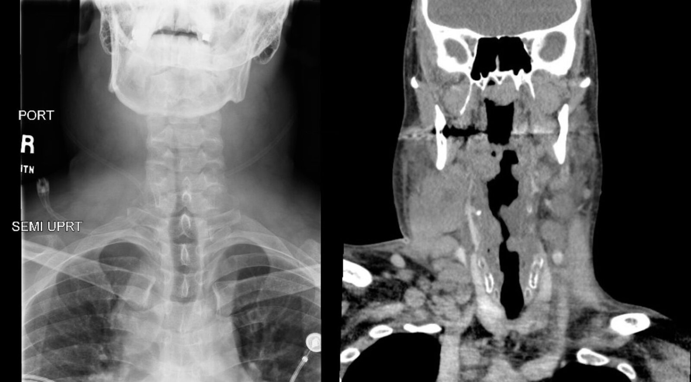

Airway narrowing in Hodgkin lymphoma

> [!WARNING]
> Urgently manage acute or rapidly-progressive <u>stridor</u> as it can indicate > 50% <u>airway obstruction</u> with a high risk of <u>respiratory failure</u> and <u>difficult intubation</u>. [[1]](https://coursology-qbank.com/amboss/article/35YSPp)[[7]](https://coursology-qbank.com/amboss/article/GzcB8U0)[[8]](https://coursology-qbank.com/amboss/article/tzcXuU0)

> [!WARNING]
> Continuously monitor patients with <u>red flags for an at-risk airway</u> and exercise caution when transporting these patients away from a supervised setting, (e.g., for imaging studies). [[2]](https://coursology-qbank.com/amboss/article/szct8U0)

---

## Endotracheal intubation

### Definitions [[1]](https://coursology-qbank.com/amboss/article/35YSPp)[[11]](https://coursology-qbank.com/amboss/article/3wYSir)

* Endotracheal tube (<u>ET tube</u>): a flexible hollow tube designed to enter the <u>trachea</u> via the <u>oropharynx</u> or the <u>nasopharynx</u>, facilitate <u>gas exchange</u>, and protect the <u>airway</u> from <u>aspiration</u>

* <u>Endotracheal intubation</u>: placement of an <u>ET tube</u> in the <u>trachea</u> below the <u>vocal cords</u>

* <u>Orotracheal intubation</u>: most common

* <u>Nasotracheal intubation</u>: used in select conditions

* Insertion usually assisted by <u>direct laryngoscopy</u>, <u>video laryngoscopy</u> , or <u>flexible fiberoptic laryngoscopy</u>

* Typically requires sedation and <u>paralysis</u>  [[23]](https://coursology-qbank.com/amboss/article/CqXq0z)

* Often preceded by <u>BMV</u> in <u>fasting</u> patients (e.g., elective <u>surgery</u>)

* Rapid sequence intubation/induction (<u>RSI</u>): commonly used when patients are at risk of <u>aspiration</u> 

* Goals: maximize first-pass success, reduce the risk of <u>aspiration</u>

* Technique: rapid induction of anesthesia and <u>paralysis</u> followed by immediate <u>intubation</u> without intervening attempts at ventilation  [[24]](https://coursology-qbank.com/amboss/article/BqXz0z)[[25]](https://coursology-qbank.com/amboss/article/yqXdaz)

* Differences from traditional <u>intubation</u>

* Weight-based bolus doses of short-acting <u>intubation medications</u> are used without <u>titration</u>.

* <u>BMV</u> is not performed

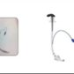

Mastering video laryngoscopy

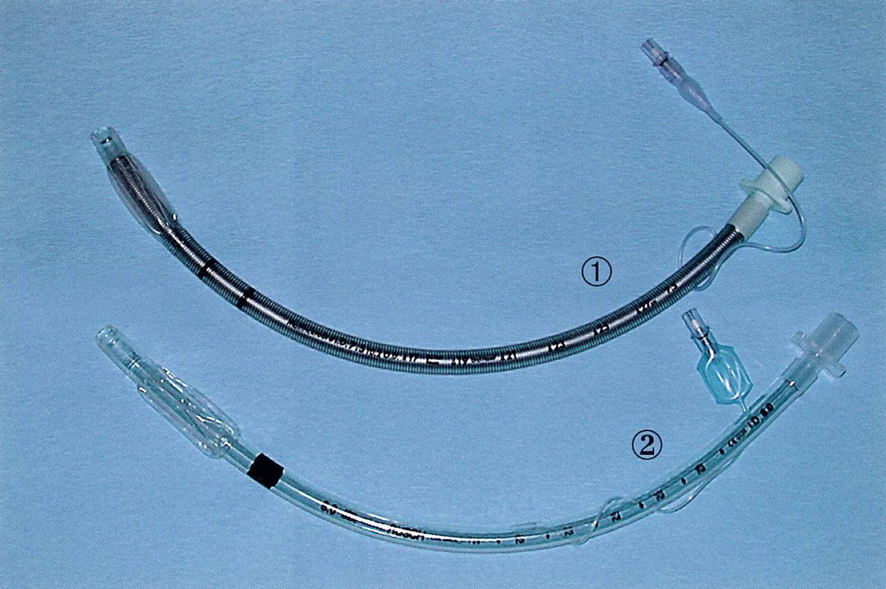

Endotracheal tubes

### Indications for endotracheal intubation [[1]](https://coursology-qbank.com/amboss/article/35YSPp)

* <u>Airway obstruction</u>: e.g., <u>anaphylaxis</u>, <u>peritonsillar abscess</u>, <u>angioedema</u>

* <u>Airway</u> protection

* Loss of <u>airway protective reflexes</u>: e.g., <u>general anesthesia</u>, persistent causes of <u>AMS or coma</u>

* High risk of <u>aspirating</u> blood or secretions: e.g., <u>hematemesis</u>, <u>massive hemoptysis</u>, <u>posttonsillectomy hemorrhage</u>, uncontrollable <u>vomiting</u>

* Anticipated deterioration: e.g., <u>smoke inhalation injury</u>, overdose

* <u>Indications for invasive mechanical ventilation</u>: : e.g., <u>respiratory failure</u>, <u>respiratory arrest</u>, multisystem trauma, <u>septic</u> shock

### Contraindications

* Absolute: Presence of a valid <u>do-not-intubate order</u> and/or <u>DNAR order</u>

* Relative

* Avoid <u>RSI</u> in certain types of <u>difficult airways</u> where rapid induction could precipitate a <u>CICV scenario</u>.

* Avoid <u>nasotracheal intubation</u> in patients with facial and basal <u>skull fractures</u>. [[26]](https://coursology-qbank.com/amboss/article/6CYjGr)

### Complications

#### Mainstem intubation

* Definition: the placement of the <u>distal</u> end of an <u>endotracheal tube</u> into either the right or left main <u>bronchus</u>

* Etiology: inadvertent placement during <u>intubation</u>

* Clinical features

* <u>Hypoxia</u>

* Asymmetric breath sounds

* High <u>peak pressures</u>

* Management: repositioning of the <u>endotracheal tube</u>

---

## Extubation

### Timing of <u>extubation</u>

The decision of when to extubate varies and depends on the:

* Reason for <u>intubation</u>

* Patient's respiratory status and risk of post-<u>extubation</u> deterioration

* Health provider's <u>advanced airway management</u> skills, e.g., performing urgent reintubation

### Extubation criteria

* Adequate spontaneous <u>minute ventilation</u>

* Presence of protective reflexes (<u>swallowing</u> and <u>coughing</u> reflex)

* Patient awake and following commands

* Adequate reversal of neuromuscular blockade

* Patient otherwise clinically stable

* No planned major diagnostic or therapeutic procedures

> [!TIP]
> Consider <u>ventilator weaning</u> and/or a <u>spontaneous breathing trial</u> prior to <u>extubation</u> for patients who have received prolonged <u>mechanical ventilation</u>.

### Procedure

* Preoxygenate with 100% <u>FiO2</u>.

* Consider placing a <u>bite block</u>.

* Suction <u>airways</u> to minimize the risk of <u>aspiration</u> (e.g., of fluids, foreign material).

* Remove the securing mechanism and deflate the cuff.

* Remove the <u>ET tube</u> as the patient exhales.

* If <u>respiratory failure</u> occurs, reintubate and treat the underlying cause.

> [!WARNING]
> Do not extubate patients unless an adequately trained provider is available to reintubate if needed.

### Complications

* <u>Respiratory failure</u> (i.e., failed <u>extubation</u>) due to: [[46]](https://coursology-qbank.com/amboss/article/JIXsdz)

* <u>Respiratory muscle weakness</u>

* Decreased <u>GCS</u>

* Excessive secretions

* <u>Postextubation laryngeal edema</u>  [[47]](https://coursology-qbank.com/amboss/article/1Zb20H)

* Inadequate <u>cough</u>

* Cardiovascular instability

* <u>Laryngospasm</u> and <u>bronchospasm</u>

* <u>Aspiration</u>

* <u>Negative pressure pulmonary edema</u>

* <u>Hypoventilation</u> and <u>upper airway</u> obstruction

* <u>Coughing</u> and straining

* <u>Vocal cord</u> injury

---

## Difficult airway

### Approach

* Whenever possible, screen for <u>red flags for a difficult airway</u> during the preintubation assessment.

* Plan for <u>difficult airway management</u> in consultation with a specialist using techniques tailored to the patient.

* Obtain required equipment for difficult airway management and/or <u>failed intubation</u>, e.g.: 

* <u>ET tubes</u> of various sizes

* <u>Supraglottic airways</u>

* <u>Intubation adjuncts</u>, e.g., <u>tracheal tube introducer</u>

* <u>Emergency surgical airway</u> equipment

* Basic <u>airway</u> equipment and adjuncts, e.g., <u>BMV</u>, <u>OPA</u>, <u>NPA</u>

* Forceps and suction devices

> [!WARNING]
> Call for help early (e.g., anesthesia or otolaryngology) if <u>difficult intubation conditions</u> are present. The most experienced provider should manage <u>difficult airways</u>.

### Red flags for difficult airway

* Copious oral blood/secretions

* <u>Upper airway</u> distortion: e.g., <u>edema</u>, trauma, mass, anatomic variants

* Limited mouth opening: e.g, <u>trismus</u>, <u>seizures</u>, surgical hardware, oral <u>neoplasms</u>, anatomic variants

* Limited neck mobility: e.g., severe <u>kyphosis</u>, <u>C-spine immobilization</u>, <u>ankylosing spondylitis</u>, <u>rheumatoid arthritis</u>

* <u>Obesity</u>

* Previously documented <u>difficult intubation</u>, e.g, Cormack and Lehane grade III or IV

Airway narrowing in Hodgkin lymphoma

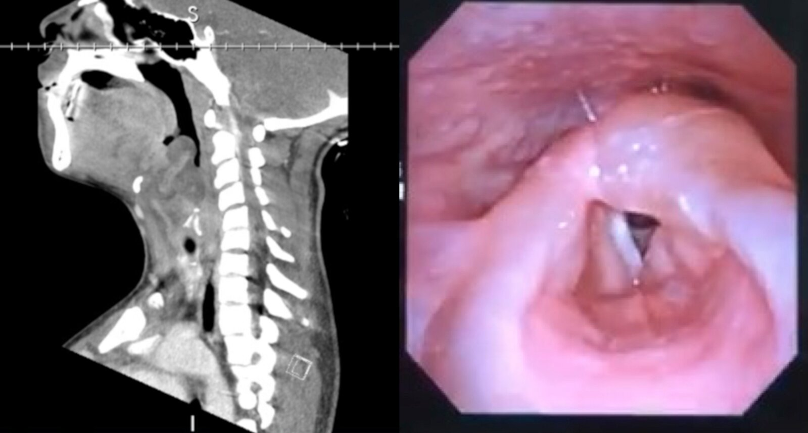

Epiglottitis (supraglottitis)

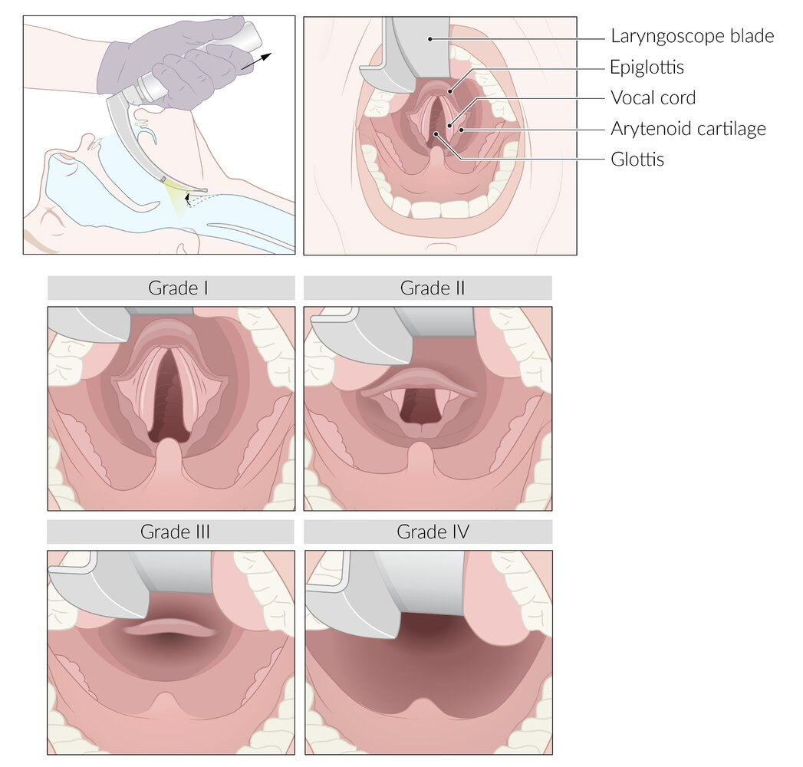

Cormack and Lehane classification

### The LEMON assessment [[1]](https://coursology-qbank.com/amboss/article/35YSPp)

Identify <u>difficult airway red flags</u> prior to <u>intubation</u> with the following steps:  [[53]](https://coursology-qbank.com/amboss/article/hIXccz)

* Look for concerning features: e.g., facial swelling or trauma, dentures, or <u>C-spine</u> <u>immobilization</u>.

* Evaluate: Use the 3-3-2 rule to assess mouth opening and <u>larynx</u> position. <u>Intubation</u> conditions are favorable if there are at least: 

* 3 fingerbreadths of mouth opening

* 3 fingerbreadths of hyomental distance

* 2 fingerbreadths of thyrohyoid distance

* Mallampati: Evaluate oral accessibility via visualization of the <u>palate</u> and throat with the Mallampati classification.

* Obstruction/obesity

* Check for obstructive conditions (e.g., infection, <u>angioedema</u>, <u>burns</u>, or tumors) or <u>clinical features of airway obstruction</u>.

* Evaluate body habitus.

* Neck mobility: Check for conditions requiring <u>spinal precautions</u> and evaluate <u>range of motion</u>.

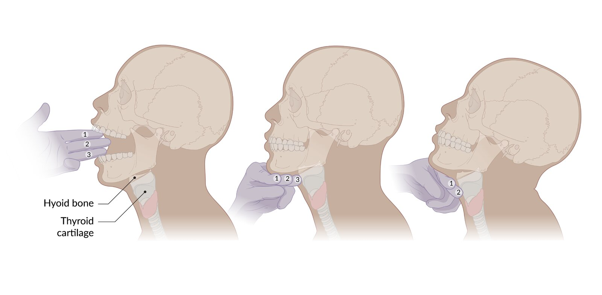

3-3-2 rule

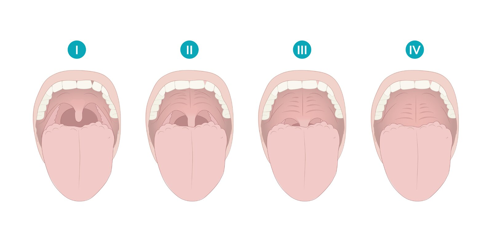

Modified Mallampati classification

### Intubation adjuncts

These devices are used to facilitate difficult intubations. Some practitioners consider <u>videolaryngoscopy</u> an <u>intubation</u> adjunct, while others use is as a first-line technique for <u>intubation</u>.

* <u>Tracheal tube introducer</u>/gum-elastic bougie (<u>GEB</u>)  [[11]](https://coursology-qbank.com/amboss/article/3wYSir)[[54]](https://coursology-qbank.com/amboss/article/NuY-rI)

* A long, semirigid stylet used in conjunction with <u>laryngoscopy</u> to facilitate passage of the <u>ET tube</u> through the <u>vocal cords</u>  [[55]](https://coursology-qbank.com/amboss/article/x-cEzU0)

* The tip is slightly bent to allow passage under the <u>epiglottis</u> and to provide tactile feedback as it “clicks” over the <u>tracheal</u> rings.

* Indication: a poor or completely obstructed view of the laryngeal inlet

* Flexible fiberoptic intubation [[56]](https://coursology-qbank.com/amboss/article/quYCHI)

* A flexible <u>fiberoptic laryngoscope</u> or bronchoscope is used to visualize the <u>glottis</u> and guide an <u>endotracheal tube</u> into place, with the patient under <u>minimal sedation</u> and with no <u>paralysis</u> (i.e., <u>awake intubation</u>).

* <u>Local anesthetic</u> is used to minimize <u>airway</u> sensation/reflexes and medication is used to reduce secretions.

* <u>Procedural sedation</u> with <u>ketamine</u> or <u>dexmedetomidine</u>  is often added.

* Indications

* Known or suspected <u>difficult airway</u>

* Backup for <u>failed intubation</u>

* Others: e.g., lighted stylet, intubating <u>SGAs</u>, <u>rigid bronchoscopy</u>

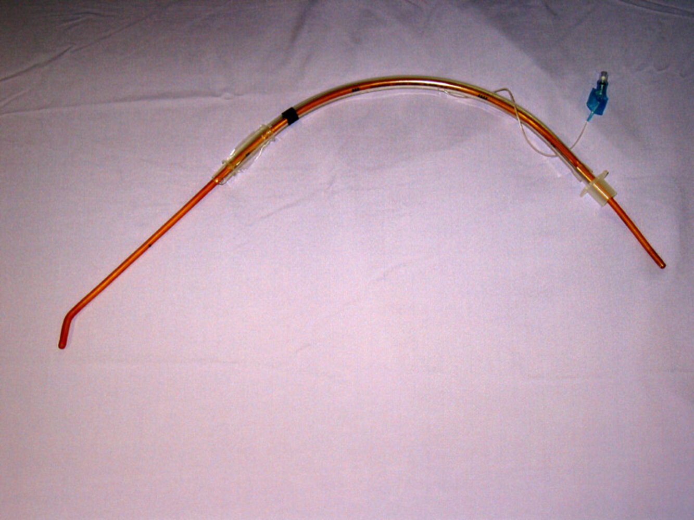

Eschmann endotracheal tube introducer (gum elastic bougie)

### Difficult airway management  [[57]](https://coursology-qbank.com/amboss/article/YZ1nZ20)

If <u>Intubation</u> is optional (e.g., planned <u>surgery</u>), consider alternatives to <u>general anesthesia</u> (e.g., <u>local or regional anesthesia</u>).  [[58]](https://coursology-qbank.com/amboss/article/GIXBVz)

#### Impending need for <u>intubation</u>

* Urgently consult an experienced <u>airway</u> specialist to:

* Manage the <u>airway</u>

* Determine if <u>RSI</u> is safe or unsafe

* Evaluate the patient for <u>awake flexible fiberoptic intubation</u>

* Ensure the following are readily available:

* <u>Difficult airway equipment</u>, including <u>supraglottic airways</u> and <u>intubation adjuncts</u>

* <u>Emergency surgical airway</u> equipment  [[58]](https://coursology-qbank.com/amboss/article/GIXBVz)[[59]](https://coursology-qbank.com/amboss/article/67Xj5z)

* Optimize <u>preoxygenation</u>.

> [!WARNING]
> <u>RSI</u> can precipitate a <u>cannot intubate-cannot ventilate</u> (<u>CICV</u>) scenario in some patients with <u>difficult airways</u>. An awake <u>flexible fiberoptic intubation</u> may be the safest option. Urgently consult an <u>airway</u> specialist as soon as possible for patients with <u>difficult airways</u> requiring <u>intubation</u>.

#### Unavoidable immediate <u>intubation</u>  [[57]](https://coursology-qbank.com/amboss/article/YZ1nZ20)

* Consult local <u>difficult intubation</u> protocols and cognitive aids where available.

* Use a predefined sequence and combination of <u>intubation adjuncts</u>, e.g.: 

* <u>Videolaryngoscopy</u> to help facilitate visualization.

* <u>Gum elastic bougie</u> to facilitate <u>ET tube</u> passage if the <u>glottis</u> is poorly visible.

* If <u>intubation medications</u> are used, choose a short-acting <u>NMJ blocker</u> (e.g., <u>succinylcholine</u>) if reversal agents for <u>rocuronium</u> are unavailable.

* For <u>obese</u> patients:

* Use ramp position: Elevate shoulder and head so that the <u>sternum</u> is at the level of the <u>external auditory meatus</u>.   [[60]](https://coursology-qbank.com/amboss/article/1Z12020)

* Consider using a short handle if <u>direct laryngoscopy</u> is performed

* Manage as a <u>failed intubation</u> if unsuccessful.

### Failed intubation  [[57]](https://coursology-qbank.com/amboss/article/YZ1nZ20)[[61]](https://coursology-qbank.com/amboss/article/3xYSwr)

* Declare a <u>failed intubation</u>.

* Urgently consult an <u>airway</u> specialist (e.g., anesthesia, ENT) to manage the <u>airway</u>.

* Perform <u>BMV</u> between attempts to maximize <u>SpO2</u> and <u>safe apnea time</u> for the following attempt.

* Consider alternative <u>intubation adjuncts</u>.

* Limit the number of <u>intubation</u> attempts.  [[61]](https://coursology-qbank.com/amboss/article/3xYSwr)

* Attempt ventilation through a <u>supraglottic airway</u>.

* If the ability to ventilate the patient is lost:

* Declare a <u>CICV scenario</u>.

* Maximize oxygenation, e.g., using <u>HFNC</u>, or <u>apneic oxygenation</u>

* Prepare for <u>surgical airway</u> or <u>cricothyrotomy</u>.

> [!WARNING]
> Limit the number of <u>intubation</u> attempts to three, plus one additional attempt by a skilled practitioner. Repeated <u>intubation</u> attempts can cause bleeding, <u>edema</u>, and/or <u>airway</u> trauma that may prevent ventilation and/or delay the establishment of a definitive <u>surgical airway</u>. [[57]](https://coursology-qbank.com/amboss/article/YZ1nZ20)

### Cannot intubate, cannot ventilate (<u>CICV</u>) scenario [[57]](https://coursology-qbank.com/amboss/article/YZ1nZ20)[[61]](https://coursology-qbank.com/amboss/article/3xYSwr)

* Definition: the inability to ventilate and/or maintain <u>arterial oxygen saturation</u> with either <u>BMV</u> or a <u>supraglottic</u> device in addition to the inability to intubate the <u>trachea</u>

* Causes: severe oropharyngeal <u>edema</u>, <u>foreign body aspiration</u>, severe oropharyngeal or <u>nasal hemorrhage</u>, facial trauma, acute <u>epiglottitis</u>

* Management: <u>surgical airway</u> or <u>ECMO</u>

> [!TIP]
> <u>Cannot intubate, cannot ventilate</u> (<u>CICV</u>) is the most common indication for an <u>emergency surgical airway</u>. [[11]](https://coursology-qbank.com/amboss/article/3wYSir)

---

## Surgical airway management

Surgical <u>airways</u> may be placed in an emergency, if endotracheal or nasal <u>intubation</u> fails, as a planned intervention for patients with <u>upper airway</u> disease, or as part of the management of patients receiving longer-term ventilation.

---

## Emergency surgical airways

### General principles

* Typically used to treat <u>CICV scenarios</u>, e.g., after <u>failed intubation</u>.

* Can be considered early in <u>difficult airway management</u> if other options are contraindicated or too risky.

* Options

* <u>Surgical cricothyrotomy</u>: <u>definitive airway</u>; can be performed by generalists (e.g., emergency physicians, trauma surgeons)

* <u>Needle cricothyrotomy</u> paired with <u>jet ventilation</u>: can only be used as a temporizing measure (most often in young children)

* Emergency <u>tracheostomy</u>: <u>definitive airway</u>; requires specialized skill to perform (e.g., ENT <u>surgery</u>)

> [!TIP]
> <u>Cricothyrotomy</u> is the <u>emergency surgical airway</u> of choice because it is fast, simple, and has a high rate of successful placement. [[11]](https://coursology-qbank.com/amboss/article/3wYSir)[[62]](https://coursology-qbank.com/amboss/article/AN1Rdh0)

### <u>Cricothyrotomy</u> [[2]](https://coursology-qbank.com/amboss/article/szct8U0)[[11]](https://coursology-qbank.com/amboss/article/3wYSir)[[62]](https://coursology-qbank.com/amboss/article/AN1Rdh0)

See “<u>Cricothyrotomy</u>” for detailed procedural guidance and steps.

* <u>Surgical cricothyrotomy</u>

* Performed either via open technique or percutaneously (<u>Seldinger technique</u>)

* An <u>ET tube</u> or <u>tracheostomy</u> tube is placed into the <u>trachea</u> through the <u>cricothyroid membrane</u> via the <u>skin</u> and cervical <u>fascia</u>.

* <u>Needle cricothyrotomy</u>: typically performed in young children for whom <u>surgical cricothyrotomy</u> is contraindicated

* Ventilation may be insufficient (e.g., impaired exhalation because of the small aperture of the needle)

* Must be rapidly replaced with a <u>definitive airway</u>

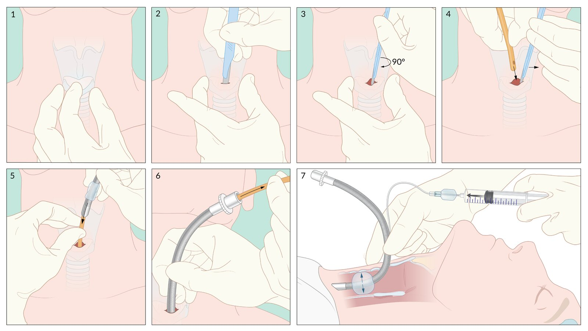

Surgical cricothyrotomy: stab-twist-bougie-tube technique

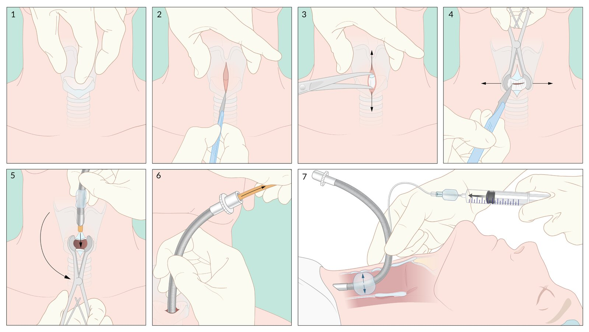

Surgical cricothyrotomy: Bougie-assisted surgical cricothyrotomy

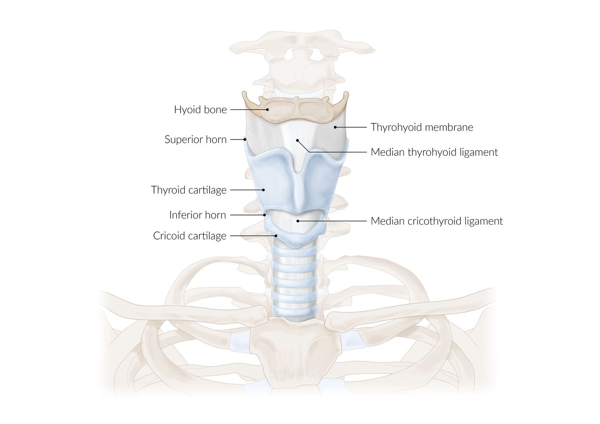

Larynx (ventral view)

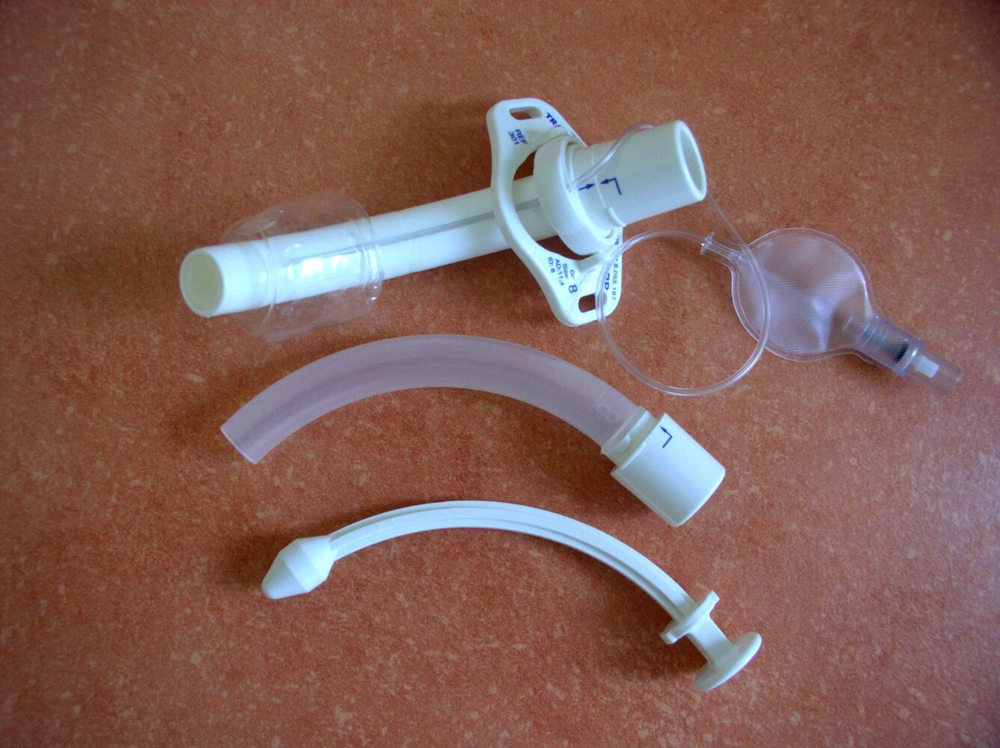

Tracheostomy tube

### Emergency <u>tracheostomy</u>

* May be performed in a <u>CICV scenario</u> by a trained practitioner

* Less commonly performed than a <u>cricothyrotomy</u>, as a <u>tracheostomy</u> is more complex, takes more time, and is associated with more bleeding [[9]](https://coursology-qbank.com/amboss/article/ZyYZd7)

* The procedure is similar to a planned <u>tracheostomy</u>.

---

## Planned surgical airways

### Tracheostomy [[11]](https://coursology-qbank.com/amboss/article/3wYSir)

* Definition: a permanent or temporary opening (<u>stoma</u>) in the cervical <u>trachea</u> created through a surgical <u>incision</u> below the cricoid <u>cartilage</u>

* Indications

* For emergency indications, same as for <u>cricothyroidotomy</u>

* Long-term <u>mechanical ventilation</u> (> 3 weeks)

* <u>Malignancy</u>

* Options

* Percutaneous <u>tracheostomy</u> (typically under <u>bronchoscopy</u> guidance)

* Open surgical <u>tracheostomy</u>

* Complications: See “<u>Tracheostomy complications</u>.”

### Laryngectomy [[63]](https://coursology-qbank.com/amboss/article/tIXXez)

* Definition: the removal of all of the laryngeal structures, including the <u>epiglottis</u> and part of the upper <u>trachea</u>, with the <u>trachea</u> brought to the front of the neck to create a <u>stoma</u>

* Indications: <u>laryngeal cancer</u>

* Caution: As the <u>upper airway</u> is no longer connected to the <u>trachea</u>, patients with a <u>laryngectomy</u> cannot be oxygenated or intubated through the <u>upper airway</u>.

---