# Airways and lungs

*Categories: Clinical knowledge > Internal medicine > Pulmonology > Basics of pulmonology > Airways and lungs*

[Original Article Link](https://coursology-qbank.com/amboss/article/ap0QLS)

---

## Summary

The respiratory system consists of a <u>conducting zone</u> (<u>anatomic dead space</u>; i.e., the airways of the mouth, nose, <u>pharynx</u>, <u>larynx</u>, <u>trachea</u>, <u>bronchi</u>, <u>bronchioles</u>, and <u>terminal bronchioles</u>) and a <u>respiratory zone</u> (<u>lung parenchyma</u>; i.e., <u>respiratory bronchioles</u>, alveolar ducts, alveolar sacs). The <u>conducting zone</u> is composed of nonrespiratory tissue and provides the passage for ventilation of the <u>respiratory zone</u>, where the O2 and CO2 exchange takes place. The respiratory system is furthermore divided into an upper tract (structures from the <u>larynx</u> upwards) and a lower tract (structures below the <u>larynx</u>). The entire respiratory tract down to the <u>bronchioles</u> is covered in <u>ciliated epithelium</u>, which provides immunologic protection by helping clear the airways of dust and microorganisms. <u>Hyaline cartilage</u> in the form of C-shaped rings (<u>trachea</u>) and plates (<u>bronchi</u>) provides structural protection and integrity. <u>Gas exchange</u> takes place in the <u>alveoli</u> of the lungs. The right lung consists of 3 lobes (upper, middle, lower), while the left lung consists of 2 lobes (upper, lower) and the lingula, a structure that is homologous to the middle lobe of the right lung. The left lung shares its space with the <u>heart</u>, which it accommodates in the cardiac notch. The development of the lungs begins in the <u>embryonic period</u> and continues until approximately 8 years of age.

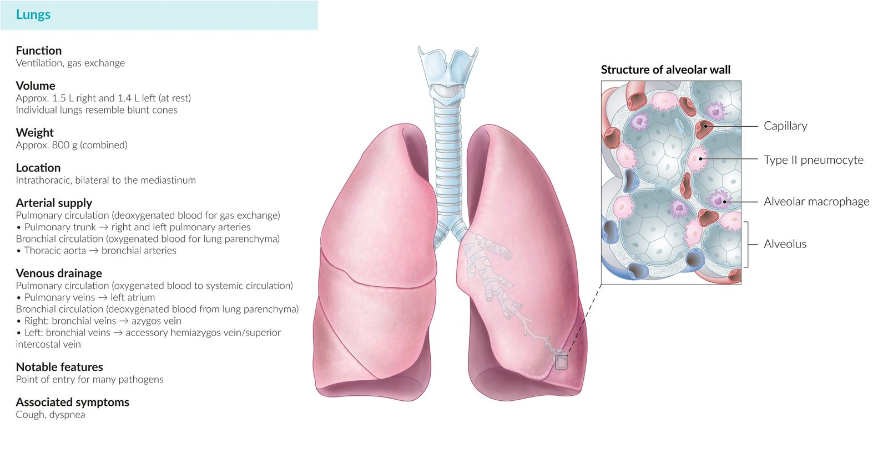

Organ fact sheet: lungs

---

## Gross anatomy

### Overview

#### Zones

* <u>Conducting zone</u>: large airways and small airways (<u>intrapulmonary conducting system</u>; nonrespiratory tissue)

* <u>Respiratory zone</u>: <u>lung parenchyma</u> (site of O2 and CO2 exchange)

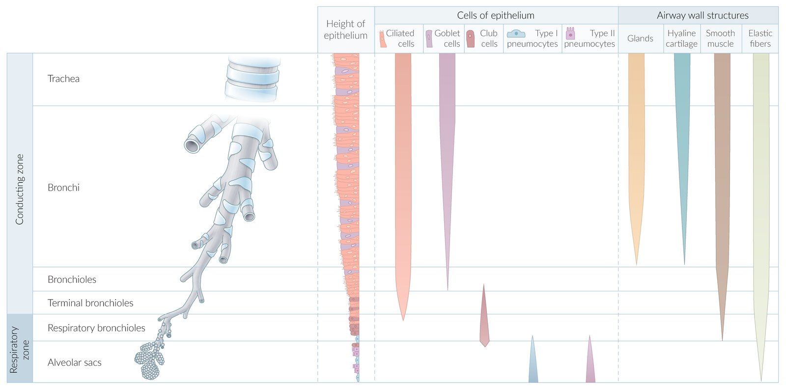

Cells and structures of lungs and airways

#### Location

* <u>Upper respiratory tract</u>

* <u>Nasopharynx</u>

* <u>Larynx</u>

* <u>Lower respiratory tract</u>

* <u>Trachea</u>

* <u>Bronchi</u>, <u>bronchioles</u>

* Lungs: located in the <u>thoracic cavity</u> (protected by the <u>rib</u> cage)

* Between the lungs: <u>inferior mediastinum</u> (including <u>heart</u>, large vessels, <u>tracheal</u> bifurcation, <u>esophagus</u>)

* Superior to the lungs: <u>superior mediastinum</u>

* Inferior to the lungs: <u>diaphragm</u>

* <u>Anterior</u> to the lungs: <u>ribs</u>

* <u>Posterior</u> to the lungs: <u>vertebral column</u>, <u>ribs</u>

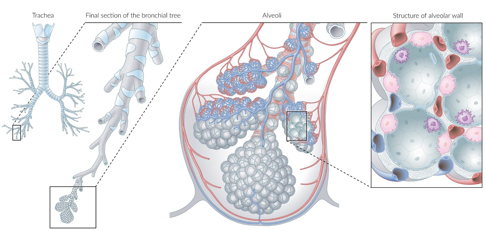

Final section of the bronchial tree

#### Function

* Ventilation (distribution of air in the airway)

* Respiration: <u>gas exchange</u> (absorption of O2 into the blood and release of CO2 into the air)

* Immune defense (ciliary clearance, <u>alveolar macrophages</u>, <u>goblet cells</u>)

* For <u>respiratory mechanics</u>, see <u>pulmonary function testing</u>.

* For more information, see “<u>Respiratory physiology</u>.”

### Intrapulmonary conducting system

#### Large airways

* Nose

* <u>Nasopharynx</u>

* Most superior portion of the <u>pharynx</u>; connecting the nasal cavity to the <u>oropharynx</u>

* Contains the <u>adenoids</u> and <u>eustachian tube</u> openings

* Neighboring structures

* Anteriorly: the nasal choanae

* Posteriorly: clivus, prevertebral musculature covering C1–C2

* Laterally: pharyngeal opening of the <u>eustachian tube</u>, <u>fossa of Rosenmuller</u>, <u>medial pterygoid</u> plates, and <u>superior pharyngeal constrictor muscles</u>

* <u>Larynx</u>

* Trachea

* Formed by a series of cartilages (15–20), joined together by annular <u>ligaments</u>.

* Bifurcates at the level of T4 into the left and the right main <u>bronchus</u> (tracheal carina)

* Neighboring structures

* <u>Posterior</u>: <u>esophagus</u>, <u>descending aorta</u>

* <u>Anterior</u>: <u>thyroid</u>, <u>ascending aorta</u>, <u>brachiocephalic trunk</u>, <u>superior vena cava</u>

* Bronchi  

* The right main (primary) <u>bronchus</u> divides into 3 lobar <u>bronchi</u> (secondary <u>bronchi</u>).

* The left main (primary) <u>bronchus</u> divides into 2 lobar <u>bronchi</u> (secondary <u>bronchi</u>).

* The lobar <u>bronchi</u> divide further into segmental bronchi (tertiary <u>bronchi</u>).

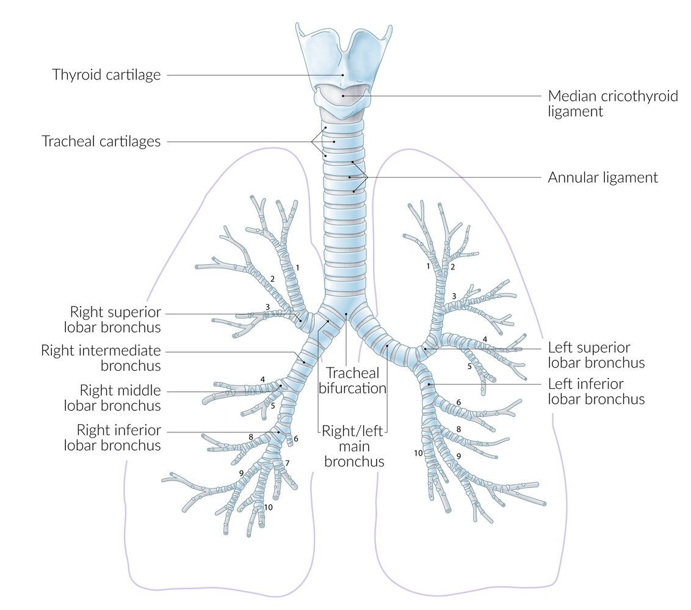

Trachea

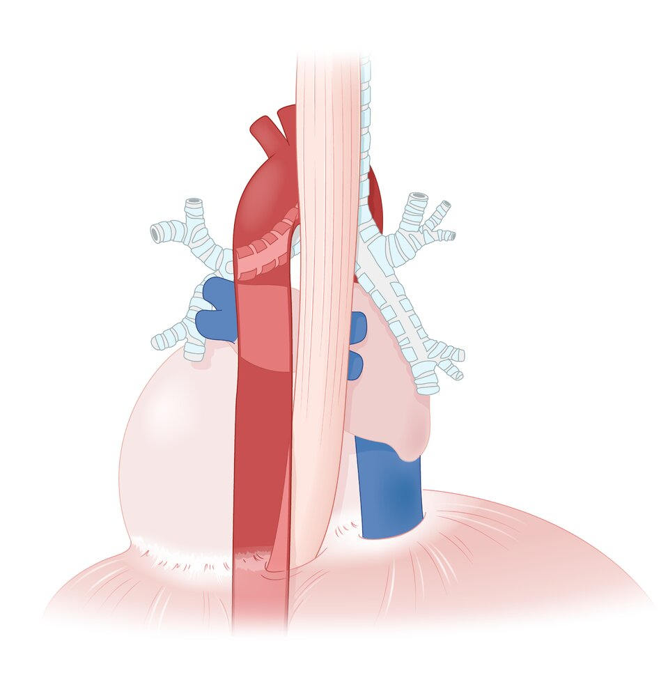

Anatomy of the heart, aorta, trachea, and esophagus

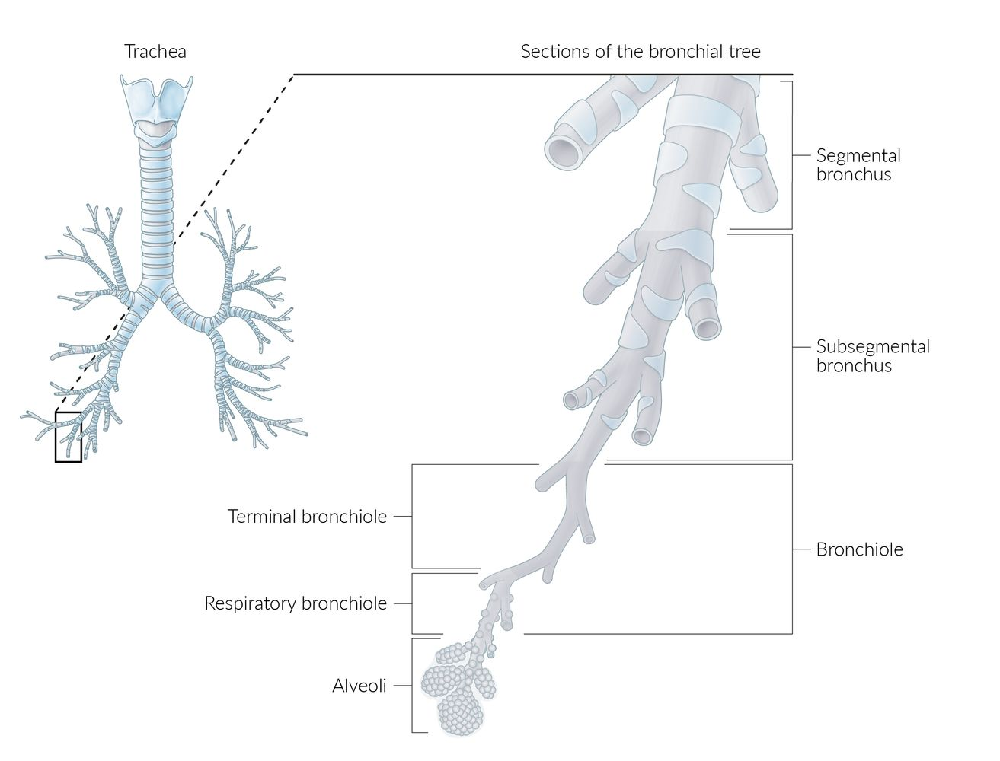

Respiratory tree

#### Small airways

* <u>Bronchioles</u>

* <u>Terminal bronchioles</u>

#### Function

* Conduction of air in and out of the respiratory tree

* <u>Anatomic dead space</u> (no <u>gas exchange</u>)

* Warms and humidifies air

* Mucociliary clearance: <u>ciliated epithelium</u> transports mucus, bacteria, and dust towards the throat, where it is either swallowed or expelled through the mouth

### <u>Respiratory zone</u>

#### Lungs

* Overview

* Paired organ of the respiratory system

* Located in the <u>thoracic cavity</u>

* Surrounded by the <u>visceral pleura</u>

* Hilum of the lung: the point of attachment of the lung to the lung root, which serves as the entry and exit site of the primary <u>bronchi</u>, <u>pulmonary arteries</u> and <u>veins</u>, <u>bronchial arteries</u> and <u>veins</u>, pulmonary nervous plexus, and <u>lymphatics</u> of each lung

* Bronchopulmonary segments 

* Segments of <u>lung tissue</u> that are supplied by a <u>segmental bronchus</u> and a segmental branch of the <u>pulmonary artery</u>.

* They are surrounded by a <u>connective tissue</u> septum (intersegmental septum), which encloses a branch of the <u>pulmonary vein</u>.

* <u>Lung parenchyma</u>

* <u>Respiratory bronchioles</u>

* Alveolar ducts

* Alveolar sacs, which contain several <u>pulmonary alveoli</u> surrounded by <u>capillaries</u>

* Pulmonary acinus: a part of the airway <u>distal</u> to a <u>terminal bronchiole</u>; each acinus contains multiple <u>respiratory bronchioles</u>, alveolar ducts, alveolar sacs, and <u>alveoli</u>.

| Overview |  |  |
| --- | --- | --- |
|  | Left lung | Right lung |
|  Lobes and <u>bronchopulmonary segments</u>       |   * 2 lobes (upper, lower)  * Upper lobe includes the lingula, a <u>tongue</u>-shaped projection homologous to the middle lobe of the right lung (the rest of the space occupied by the middle lobe in the right lung is occupied by the <u>heart</u> in the left lung).  * 8–10 <u>bronchopulmonary segments</u>    |   * 3 lobes (upper, middle, lower)  * 10 <u>bronchopulmonary segments</u>    |
| <u>Bronchi</u> |   * Left main stem <u>bronchus</u> is longer and more horizontal than the right <u>bronchus</u>  * Inferior to the <u>left pulmonary artery</u>    |   * Right main stem <u>bronchus</u> is more vertical, shorter, and wider than the left <u>bronchus</u> and, therefore, more <u>prone</u> to <u>aspiration</u> (See “<u>Pathophysiology of foreign body aspiration</u>.”)  * <u>Posterior</u> to the <u>right pulmonary artery</u>    |
| Notches |   * Cardiac notch of left lung: cardiac impression on the <u>anterior</u> border of the left lung  * Indentations for ascending and <u>descending aorta</u> and <u>left subclavian artery</u>    |  * Contains several notches for <u>superior vena cava</u>, <u>esophagus</u>, and arch of the <u>azygos vein</u>   |

> [!TIP]
> Only the right lung has a middle lobe. It can be <u>auscultated</u> in the fourth to six <u>intercostal space</u> anteriorly at the <u>midclavicular line</u>.

> [!TIP]
> The right main <u>bronchus</u> is wider, shorter, and more vertical than the left main <u>bronchus</u> so <u>aspiration</u> of foreign bodies and <u>aspiration pneumonia</u> are more likely in the right lung.

> [!TIP]
> Each <u>bronchopulmonary segment</u> can be surgically removed without affecting the function of the others.

> [!NOTE]
> The Lingula is in the Left Lung.

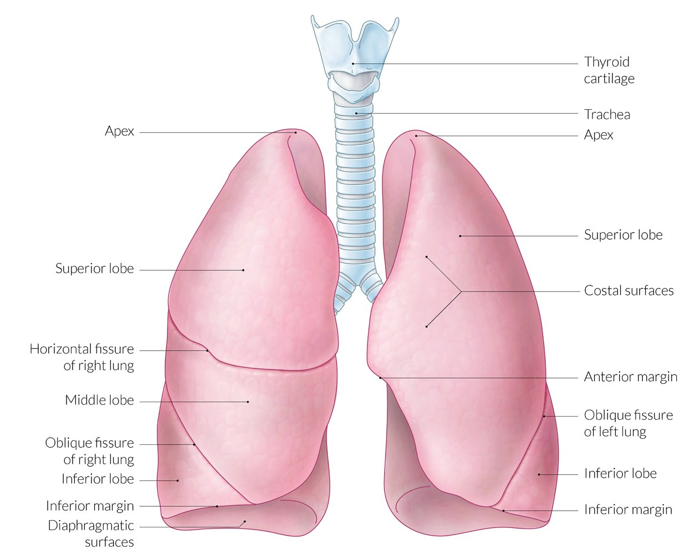

Anatomy of the lung

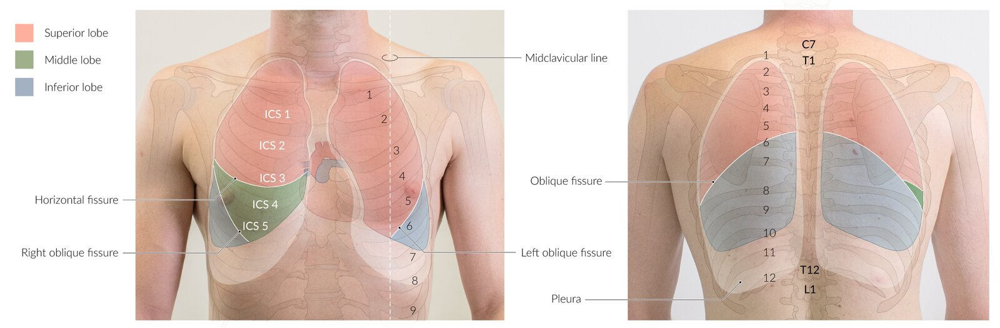

Surface anatomy of the lungs

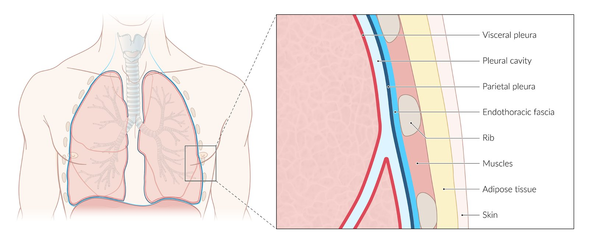

Pleural cavity

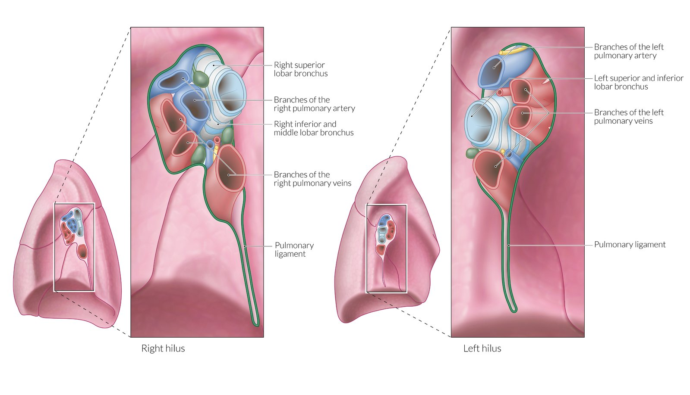

Hilus of the lung

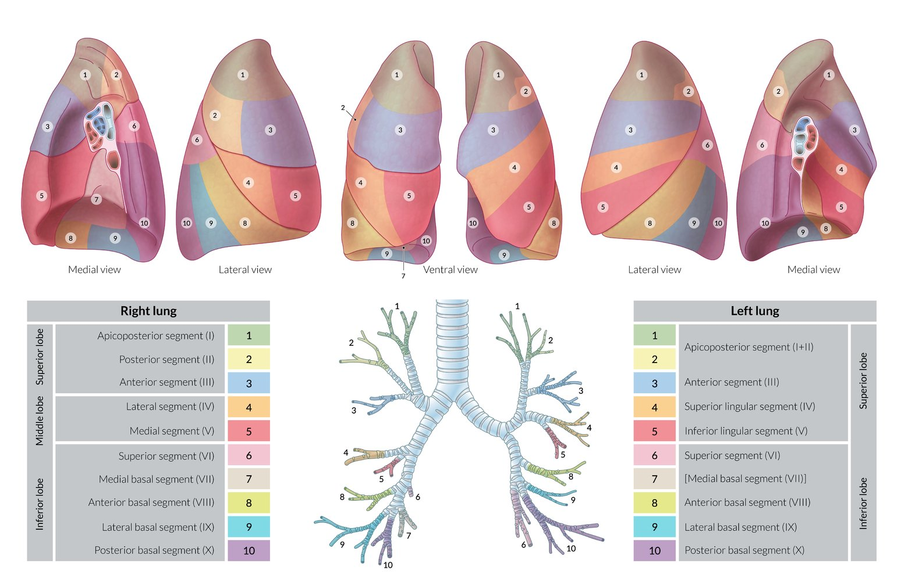

Bronchopulmonary segments

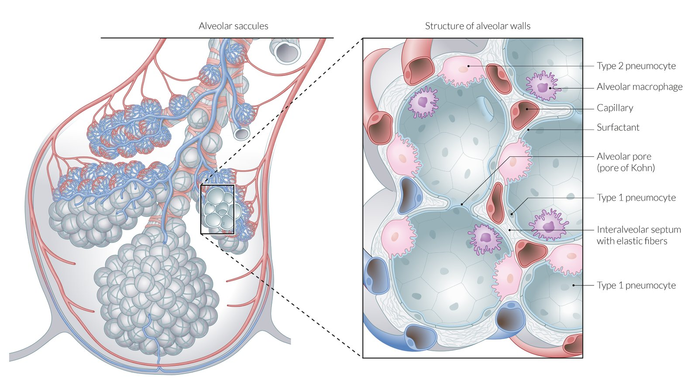

Alveolar structure

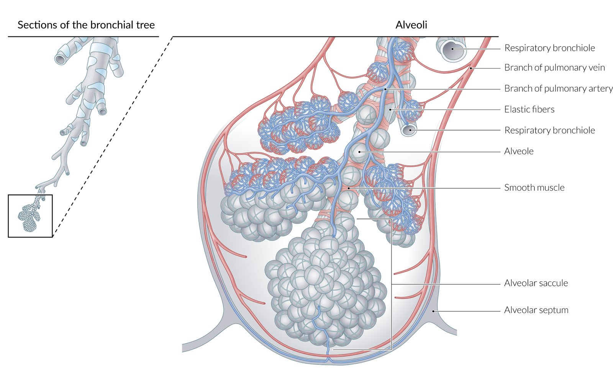

Alveolar sac

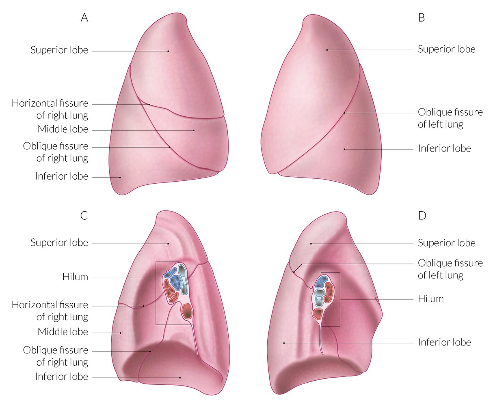

Right and left lung

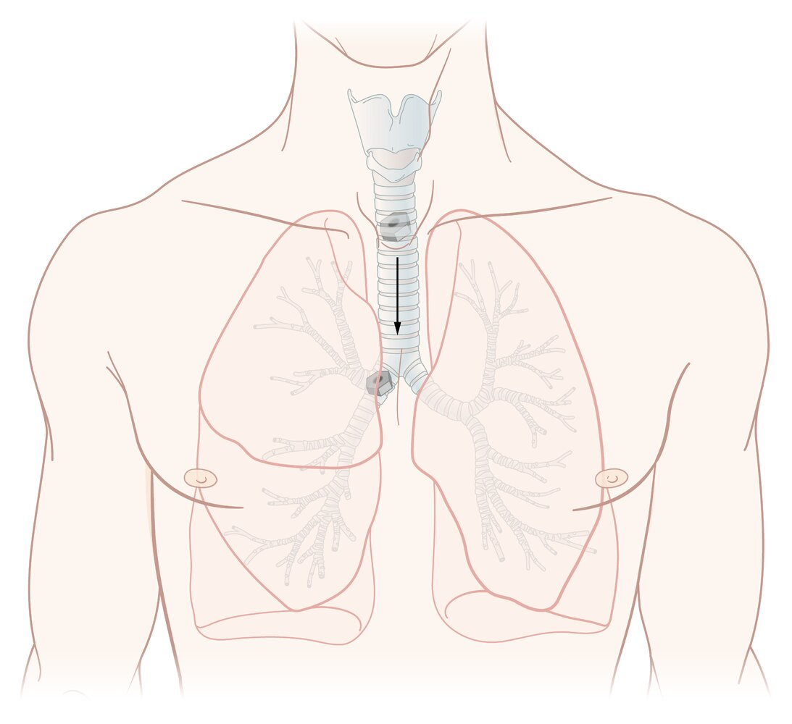

Distribution of affected bronchi in foreign body aspiration

#### Function

* Oxygen and carbon dioxide exchange across <u>blood-air barrier</u>

* <u>Alveolar macrophages</u> <u>phagocytose</u> fine dust particles (< 2 μm)

### Vasculature

The lungs have a dual blood supply.

#### Pulmonary circulation

| Overview of <u>pulmonary circulation</u> |  |  |
| --- | --- | --- |
| Vessels | Anatomy | Characteristics |
| Pulmonary trunk |   * Originates in the <u>right ventricle</u> of the <u>heart</u>  * Divides into the left and right pulmonary <u>arteries</u> → lobar, segmental, and subsegmental <u>arteries</u>    |  * Carries deoxygenated blood from the <u>right ventricle</u> to the lungs for oxygenation   |
|  Left pulmonary artery   |   * Superior to the left main <u>bronchus</u>.  * Connects to the <u>arch of the aorta</u> by the <u>ligamentum arteriosum</u>    |  * Carries deoxygenated blood from the <u>pulmonary trunk</u> to the left lung for <u>gas exchange</u>   |
|  Right pulmonary artery   |   * <u>Posterior</u> to the aorta and the <u>superior vena cava</u>  * <u>Anterior</u> to the right main <u>bronchus</u>    |  * Carries deoxygenated blood from the <u>pulmonary trunk</u> to the right lung for <u>gas exchange</u>   |
| Pulmonary veins |  * Originate in the <u>alveoli</u> from <u>venules</u> → form 2 pulmonary <u>veins</u> in each lung → 4 pulmonary <u>veins</u> merge into the <u>left atrium</u>   |   * Drain oxygenated blood from <u>alveoli</u> to the <u>left atrium</u>  * Drain deoxygenated blood from the <u>visceral pleura</u> and respiratory zones to the <u>left atrium</u>    |

> [!NOTE]
> Relationship of <u>pulmonary arteries</u> to the corresponding <u>bronchi</u> (Right: Anterior to the mainstem <u>bronchus</u>; Left: Superior to the mainstem <u>bronchus</u>): RALS.

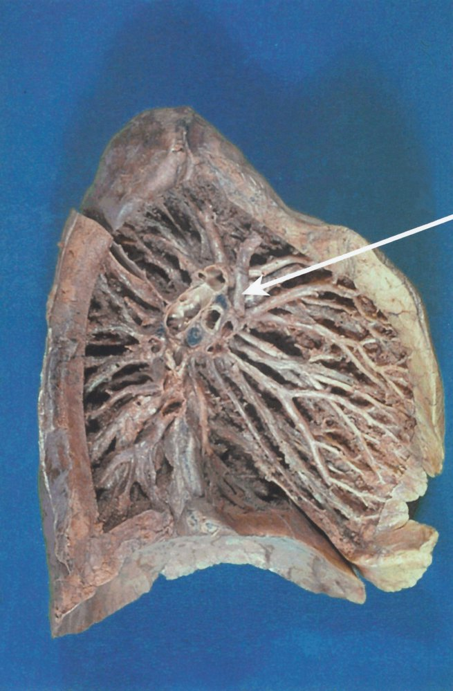

Left lung

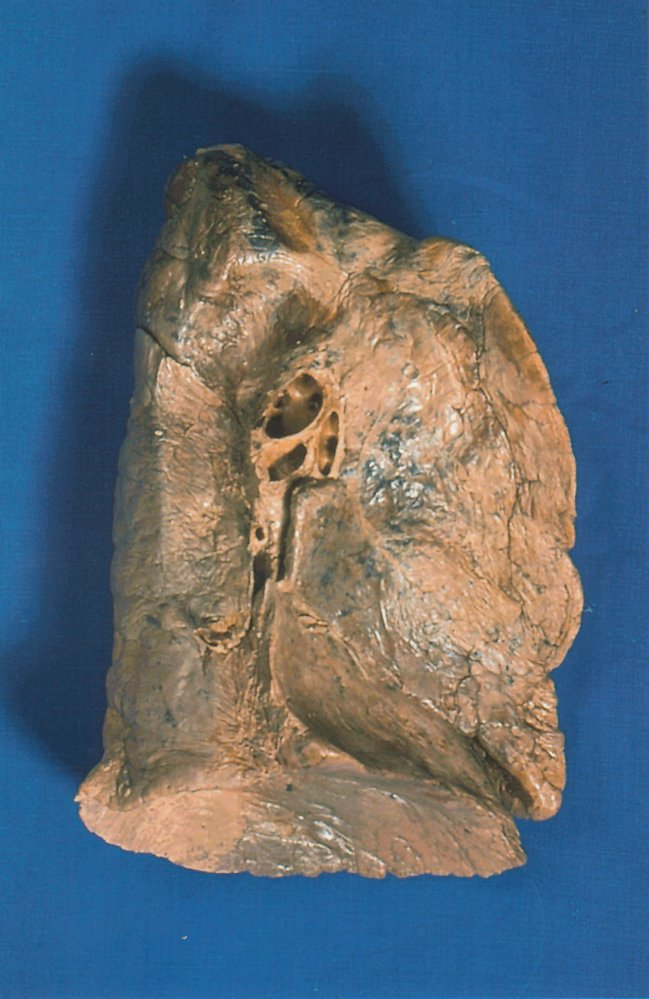

Left lung

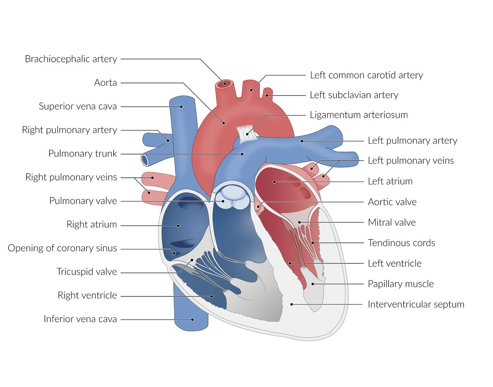

Anatomy of the heart and adjacent large vessels

#### Bronchial circulation

| Overview of <u>bronchial circulation</u> |  |  |
| --- | --- | --- |
| Vessels | Anatomy | Characteristics |
| Bronchial arteries |   * Left: usually 2 <u>arteries</u> that arise from the <u>thoracic aorta</u>  * Right: usually 1 <u>artery</u> that arises from one of the following  * Right <u>posterior intercostal artery</u>  * <u>Thoracic aorta</u>  * Left superior bronchial <u>artery</u>    |  * Supply oxygenated blood to the <u>lung parenchyma</u>, <u>bronchi</u>, and the <u>visceral pleura</u>   |
| Bronchial veins |   * Originate near the <u>bronchi</u>  * Empty into the <u>azygos vein</u> (right) and into the <u>accessory hemiazygos vein</u> or the <u>superior intercostal vein</u> (left)    |  * Drain deoxygenated blood from hilar structures and <u>conducting zone</u> structures   |

### <u>Lymphatics</u>

* Lymphatic vessels drain the entire respiratory tree (lymphatic vessels are not present in the <u>pulmonary alveoli</u>)

* Intrapulmonary nodes → bronchopulmonary nodes → tracheobronchial nodes → paratracheal nodes → bronchomediastinal nodes and trunks → <u>thoracic duct</u> on the left and <u>right lymphatic duct</u> on the right

### Innervation (pulmonary plexus)

* Branches accompany the <u>blood vessels</u> and <u>bronchi</u> into the lung.

* <u>Parasympathetic</u> fibers from the <u>vagus nerve</u> (<u>M3 receptors</u>) innervate <u>smooth muscle</u> and glands (bronchoconstriction, increase secretion)

* <u>Sympathetic</u> fibers (act on <u>ß2-receptors</u>): innervate <u>blood vessels</u>, <u>smooth muscle</u>, and glands (bronchodilation, <u>vasoconstriction</u>, decrease secretion)

---

## Microscopic anatomy

Cells and structures of lungs and airways

### Conducting zone

* <u>Nasopharynx</u>

* Two main types of <u>epithelium</u>: <u>stratified</u> <u>squamous epithelium</u> and ciliated respiratory-type <u>epithelium</u>

* Lymphoid aggregates

* <u>Goblet cells</u>

* <u>Seromucous glands</u>

* <u>Basal cells</u>

* <u>Trachea</u> and <u>bronchi</u>  

* <u>Pseudostratified</u> <u>ciliated columnar epithelium</u>: important for <u>mucociliary clearance</u>

* <u>Goblet cells</u>

* <u>Cartilage</u>: C-shaped <u>hyaline cartilage</u> rings in the <u>trachea</u> and <u>hyaline cartilage</u> plates in the <u>bronchi</u> provide structural support.

* Annular ligaments of trachea: horizontal fibrous bands that join the <u>tracheal</u> <u>cartilage</u> rings together

* <u>Smooth muscle</u>

* <u>Seromucous glands</u> (secrete mucus)

* <u>Basal cells</u>

* Bronchioles: <u>simple ciliated columnar epithelium</u>; enclosed by <u>smooth muscle</u>

* Terminal bronchioles: simple ciliated <u>cuboidal epithelium</u>; <u>smooth muscle</u>

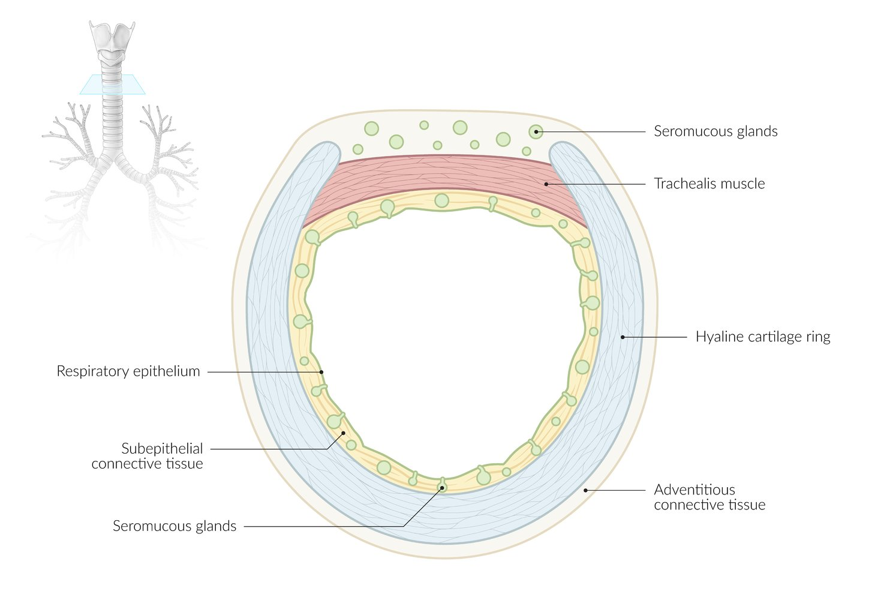

Trachea (transverse section)

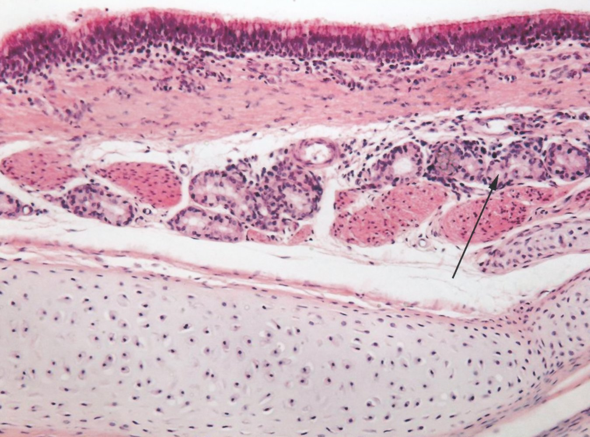

Trachea

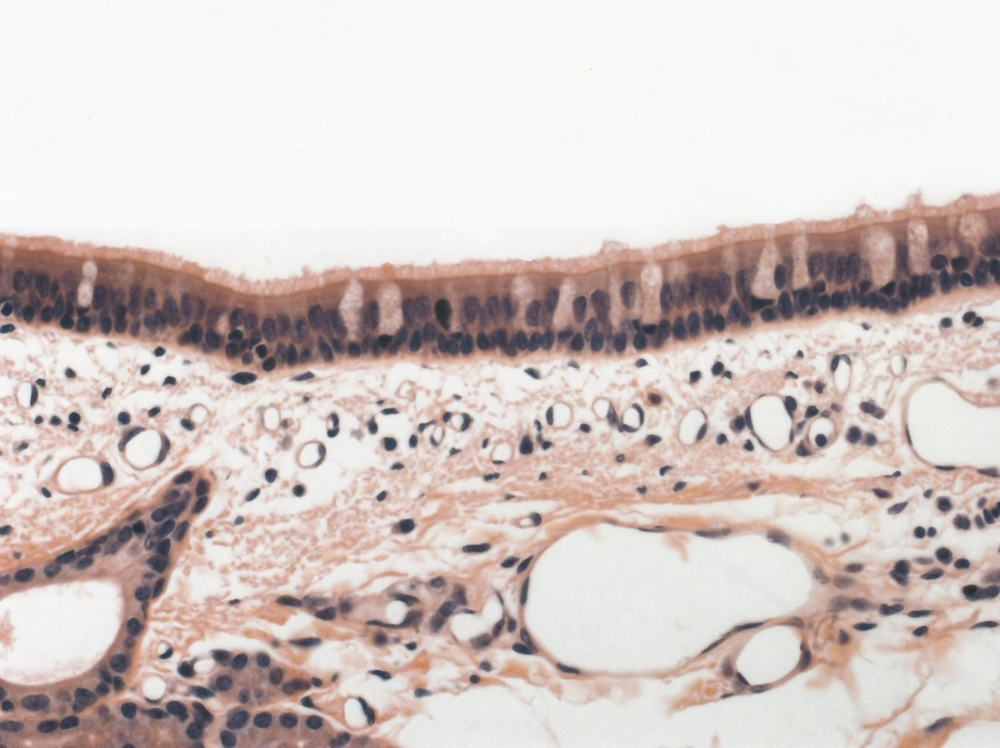

Respiratory epithelium of the trachea with goblet cells

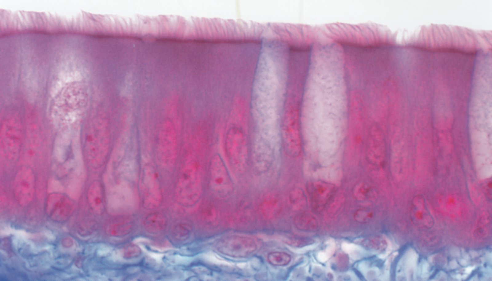

Respiratory epithelium with goblet cells

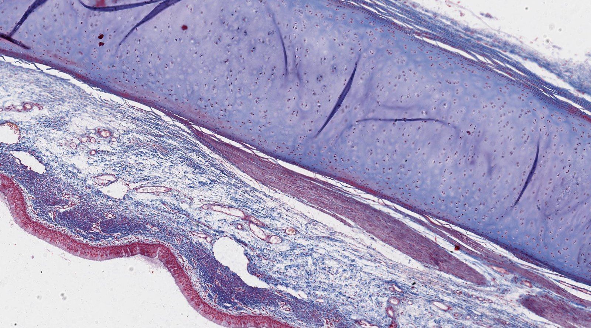

Cross-section of the trachea

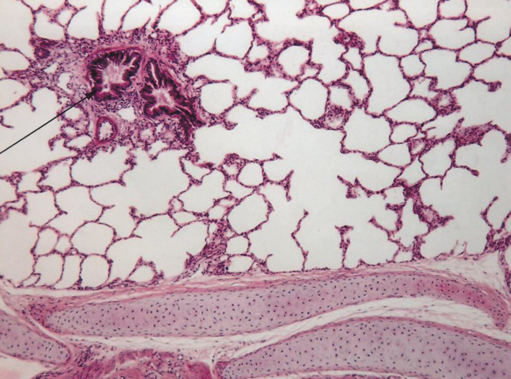

Alveoli and bronchioli of the lung

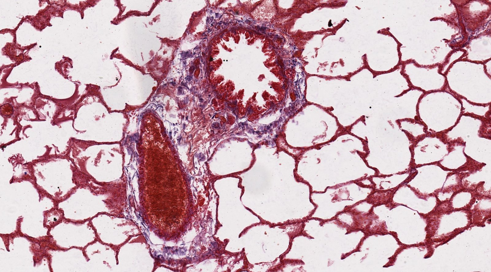

Bronchiole with an arterial vessel

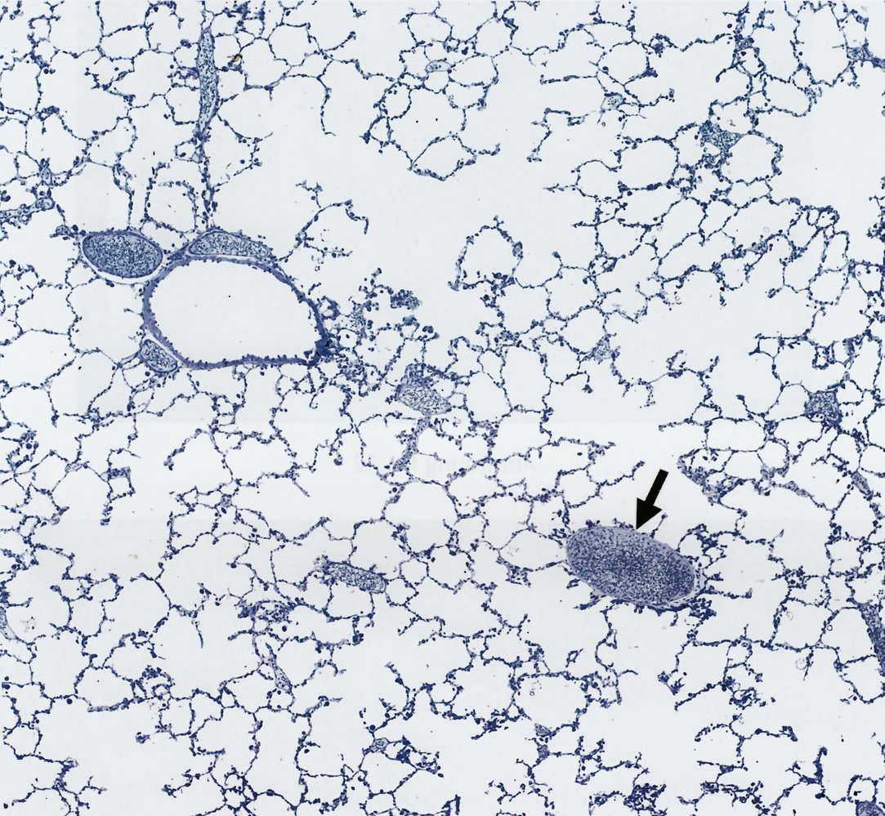

Lung parenchyma

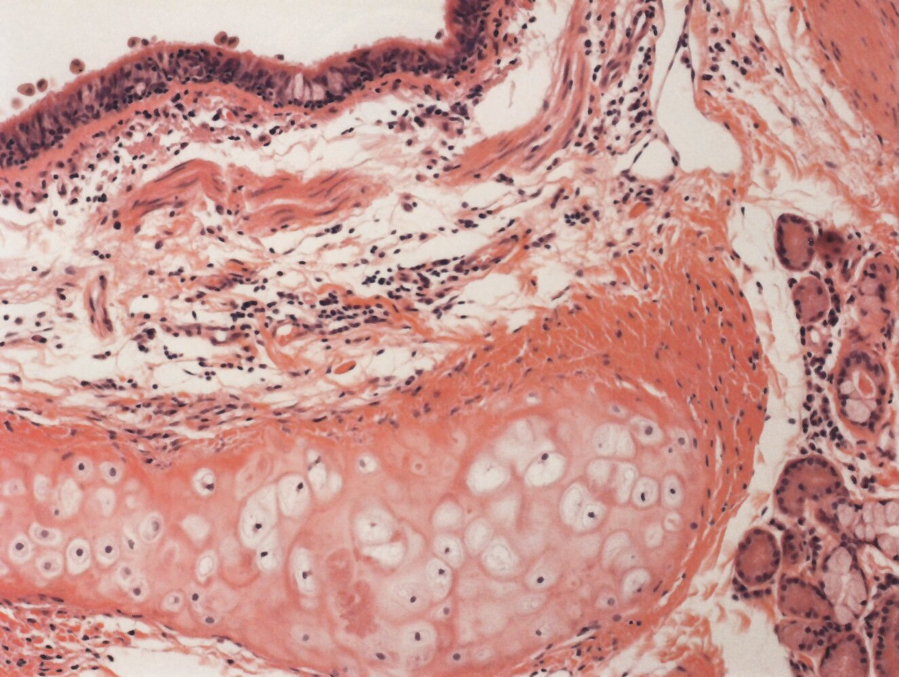

Normal bronchial histology

### Respiratory zone [[1]](https://coursology-qbank.com/amboss/article/H4YKk6)

#### Respiratory bronchioles

<u>Respiratory bronchioles</u> contain simple (non-ciliated) cuboidal and <u>squamous epithelium</u> and <u>smooth muscle</u>.

* Club cells (formerly known as <u>Clara cells</u>) 

* Maintain the integrity of the <u>respiratory epithelium</u> by secreting specialized immunomodulatory <u>proteins</u>, glycoproteins, and lipids.

* <u>Cytochrome P450</u>-dependent degradation of toxins

* Act as a reserve for <u>ciliated cells</u> to restore bronchiolar <u>epithelium</u> (<u>stem cell</u> properties) [[2]](https://coursology-qbank.com/amboss/article/PdbWJs)

* Nonciliated, secretory, cuboidal cells located in the terminal and the <u>respiratory bronchioles</u> of the lung

* Respiratory airway secretory cells (<u>RAS cells</u>) ;  [[3]](https://coursology-qbank.com/amboss/article/SYWyoP0)[[4]](https://coursology-qbank.com/amboss/article/yw1dlQ0)

* Low cuboidal cells located in the <u>distal airways</u> and <u>respiratory bronchioles</u>

* Act as progenitor cells for <u>type II pneumocytes</u>

* Secrete <u>proteins</u>, glycoproteins, and lipids essential for the integrity of the <u>respiratory epithelium</u>

* Chronic exposure to tobacco (e.g., patients with <u>COPD</u>) alters <u>gene expression</u> and the differentiation pathway of <u>type II pneumocytes</u>.

#### Pulmonary alveoli

<u>Pulmonary alveoli</u> are separated from each other by the interalveolar septum with <u>elastic fibers</u> and <u>capillaries</u>. Interalveolar pores connect adjacent <u>alveoli</u>.

* Type I pneumocytes: thin squamous cells that line the <u>alveoli</u> that allow for <u>transcellular</u> <u>gas exchange</u>

* Comprise 95% of the total alveolar area

* Connected to each other by <u>tight junctions</u>

* Form the blood-air barrier, together with the <u>endothelial</u> cells of the <u>capillaries</u> and the <u>basement membrane</u> between the two cells.

* Type II pneumocytes: cuboidal alveolar cells 

* Comprise 5% of the total alveolar area, but 60% of total number of cells

* Surfactant formation: <u>Type II pneumocytes</u> contain lamellar bodies, which secrete surfactant (surface-activating <u>lipoprotein</u> complex).

* <u>Surfactant</u> is mainly composed of the phospholipids dipalmitoylphosphatidylcholine (<u>DPPC</u> or lecithin) and phosphatidylglycerol.

* It reduces alveolar surface tension and thereby prevents the <u>alveoli</u> from collapsing.

* Lung regeneration and repair: <u>Type II pneumocytes</u> can proliferate to replace type I or <u>type II pneumocytes</u> following lung damage.

* Alveolar macrophages: <u>phagocytose</u> foreign materials and initiate the <u>immune response</u> by releasing <u>cytokines</u>  

* Produce alveolar elastase, which is degraded by <u>tissue inhibitors of metalloproteinases</u> (<u>TIMPs</u>)

* Increased <u>elastase</u> activity is associated with the development of <u>emphysema</u>.

* Presence of hemosiderin-laden macrophages (or <u>heart failure cells</u>) may be a sign of <u>pulmonary edema</u> or alveolar hemorrhage (from <u>pulmonary infarction</u>, <u>vasculitis</u>, or <u>aspiration</u> of blood).

> [!TIP]
> <u>Pulmonary surfactant</u> produced by <u>type II pneumocytes</u> reduces the surface tension of the thin layer of water that covers the pulmonary <u>epithelium</u>, thereby preventing alveolar collapse at end-expiration, increasing compliance, and reducing the <u>work of breathing</u>!

> [!TIP]
> The presence on microscopy of <u>hemosiderin-laden macrophages</u> of <u>lung tissue</u> indicates alveolar hemorrhage or <u>pulmonary edema</u>.

Alveolar structure

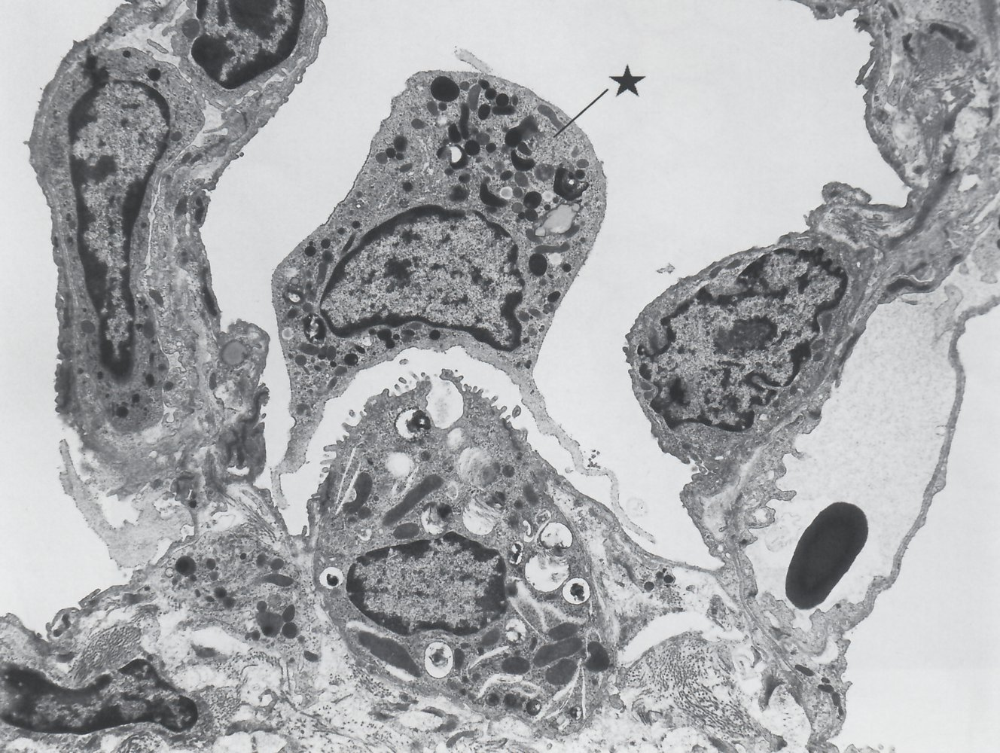

Pulmonary alveolus

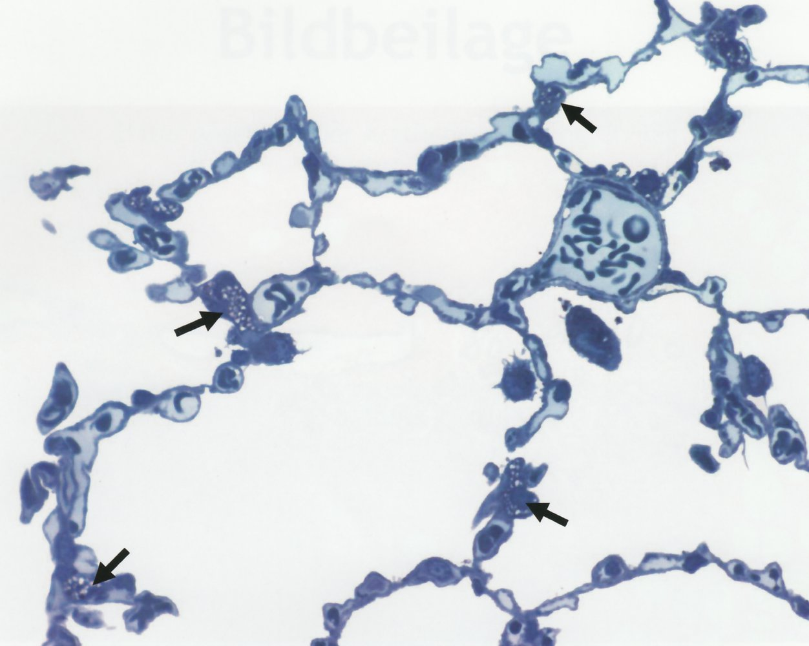

Alveoli

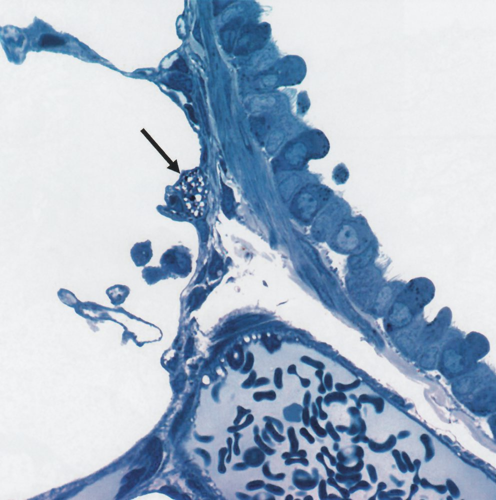

Alveolus

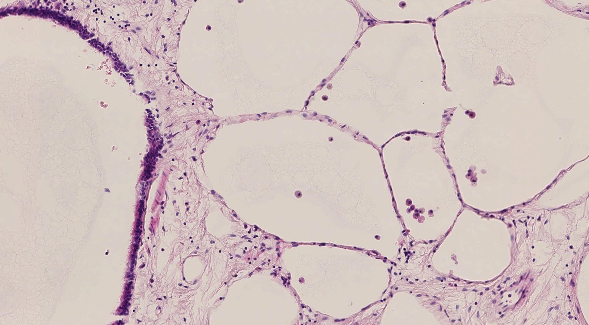

Pulmonary alveolus with alveolar macrophages

### Deposition and clearance of inhaled particles

Inhaled particles within the respiratory tree are cleared by different means depending on their size.

| Overview |  |  |
| --- | --- | --- |
| Particle size | Deposit into | Clearance via |
| Small (< 3 μm) | <u>Alveoli</u> | <u>Alveolar macrophages</u> |
| Medium (3–10 μm) | <u>Trachea</u> and/or <u>bronchi</u> | <u>Mucociliary clearance</u> |
| Large (≥ 10 μm) | Nasal cavity | Nasal <u>hair</u> (vibrissae) |

---

## Function

The main function of the lung is the absorption of oxygen into the blood and the release of carbon dioxide into the air.

* For this purpose, the air must first reach the <u>alveoli</u> (see <u>pulmonary function testing</u> for <u>respiratory mechanics</u>).

* The distribution of air (ventilation) is adjusted to the <u>perfusion</u> of pulmonary vessels so that the <u>gas exchange</u> proceeds evenly.

* The <u>respiratory center</u> adjusts the breathing to the needs of the entire organism.

* For more information, see ”<u>Respiratory physiology</u>.”

---

## Embryology

|  Overview of <u>embryology</u>  [[5]](https://coursology-qbank.com/amboss/article/r4Yfk6) |  |  |
| --- | --- | --- |
| Developmental stage | Description | Clinical significance |
| <u>Embryonic period</u> (weeks 4–7) |  * Lung bud at the <u>distal</u> end of the respiratory diverticulum develops into:  * <u>Trachea</u>  * Bronchial buds → mainstem <u>bronchi</u>, secondary (lobar) <u>bronchi</u>, tertiary (segmental) <u>bronchi</u>   |  * Errors lead to <u>tracheoesophageal fistula</u> or <u>pulmonary sequestration</u>.   |
|  <u>Pseudoglandular period</u>  (weeks 5–17)    |  * Development of:  * <u>Bronchioles</u> and <u>terminal bronchioles</u> from the <u>endodermal</u> tubules  * Fine lung <u>capillaries</u> (surrounding <u>terminal bronchioles</u>)  * Development of <u>type II pneumocytes</u>   |   * Bronchopulmonary <u>epithelium</u> begins to produce <u>amniotic fluid</u>.  * Errors lead to <u>bronchogenic cyst</u>.  * Nonviable state: immature <u>lung tissue</u> incapable of <u>gas exchange</u>    |
|  <u>Canalicular period</u> (weeks 16–25) |   * Development of:  * <u>Respiratory bronchioles</u>, alveolar ducts and primitive <u>alveoli</u>  * <u>Blood-air barrier</u>  * Prominent lung <u>capillaries</u> (surrounding alveolar ducts)  * Airway diameter increases    |   * Errors lead to <u>pulmonary hypoplasia</u> or <u>respiratory distress</u> syndrome [[6]](https://coursology-qbank.com/amboss/article/FbYgvn)  * Pneumocyte development and <u>surfactant</u> production begin at 20–22 weeks' <u>gestation</u>; mature <u>surfactant</u> levels are reached at 35 weeks' <u>gestation</u>.  * Respiration first possible at 25 weeks  * <u>Corticosteroids</u> are crucial for lung development and <u>surfactant</u> production    |
|  <u>Saccular period</u>  (weeks 26–<u>birth</u>) |  * Development of terminal sacs (thin-walled <u>alveoli</u> separated by primary septa) from alveolar ducts   |  * Fetus can breathe outside the <u>uterus</u> from about 24–25 weeks of <u>gestation</u> with intensive care.   |
|  Alveolar period (week 36–8 years) |  * Development of:  * Mature <u>type II pneumocytes</u>  * Definitive <u>alveoli</u> (separated by secondary septa) from terminal sacs   |   * Following <u>birth</u>, <u>alveoli</u> increase in number but not in size  * At <u>birth</u>: approx. 20–70 million <u>alveoli</u>  * In adults: approx 300 million <u>alveoli</u>  * In utero: increased <u>vascular resistance</u> due to <u>aspiration</u> of <u>amniotic fluid</u>  * Postpartum: inspiration of air leads to a drop in <u>pulmonary vascular resistance</u>    |

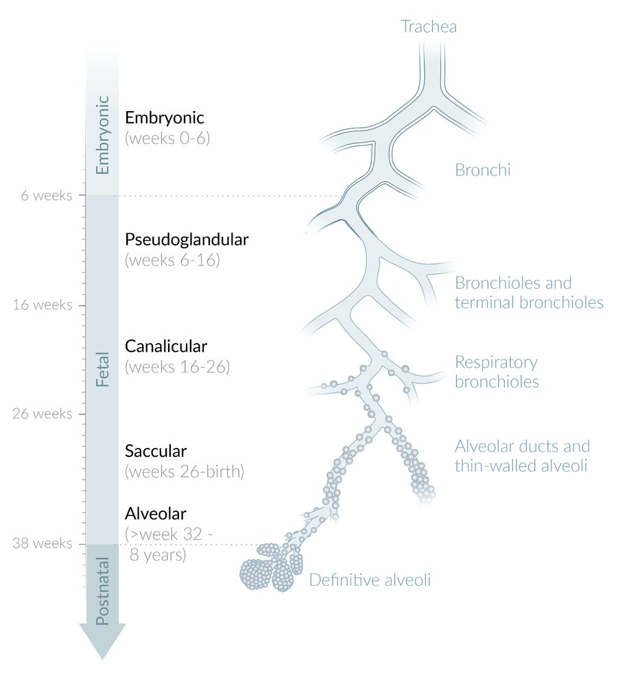

Developmental stages of the lung

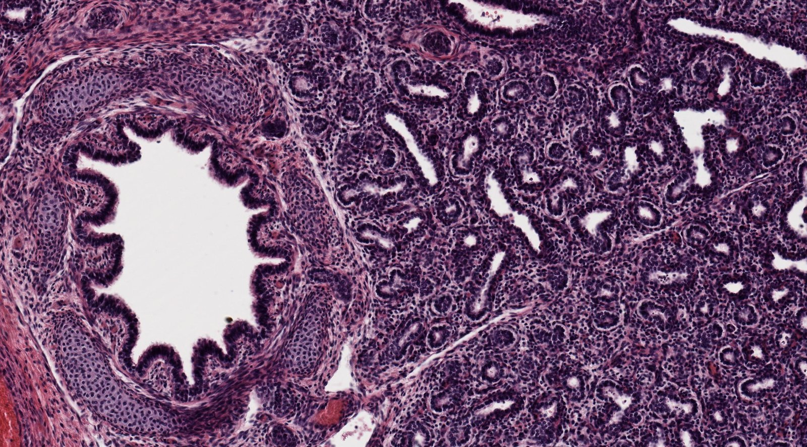

Fetal lung (pseudoglandular stage)

---

## Clinical significance

* <u>Pulmonary examination</u>

* <u>Pulmonary function testing</u>

* Embryonic abnormalities

* <u>Congenital tracheoesophageal fistula</u>

* <u>Pulmonary hypoplasia</u>

* <u>Bronchogenic cysts</u>

* <u>Neonatal respiratory distress syndrome</u>

* <u>Surfactant deficiency</u>

* <u>Tracheal</u> conditions

* <u>Tracheomalacia</u>

* <u>Tracheostomy</u>

* <u>Laryngotracheitis</u>

* <u>Obstructive lung diseases</u>

* <u>Restrictive lung diseases</u>

* <u>Interstitial lung disease</u>

* <u>Acute respiratory distress syndrome</u>

* <u>Pulmonary hypertension</u>

* <u>Pleural effusion</u>

* <u>Pneumothorax</u>

* <u>Atelectasis</u>

* <u>Pulmonary embolism</u>

* <u>Cystic fibrosis</u>

* <u>Pneumonia</u>

* <u>Tuberculosis</u>

* <u>Lung cancer</u>

* <u>Pneumonectomy</u>

* <u>Aging respiratory system</u>

---