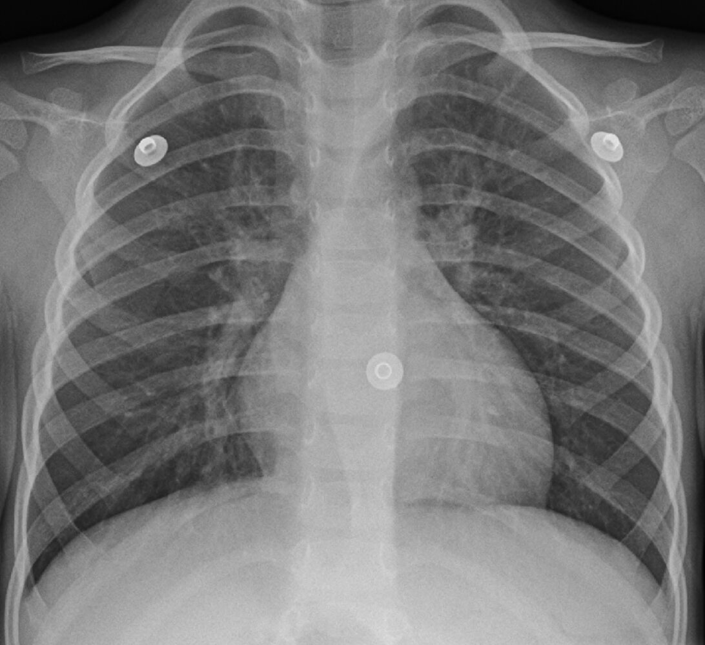

# Acute bronchitis

*Categories: Clinical knowledge > Internal medicine > Pulmonology > Infectious lung diseases > Acute bronchitis*

[Original Article Link](https://coursology-qbank.com/amboss/article/hh0cdf)

---

## Summary

Acute bronchitis is a <u>lower respiratory tract infection</u> (<u>LRTI</u>) characterized by inflammation of the <u>bronchi</u>. It often follows an <u>upper respiratory tract infection</u> (<u>URTI</u>) and, in more than 90% of cases, the cause is viral. Acute bronchitis may manifest with <u>cough</u>, runny nose, <u>headache</u>, and <u>malaise</u>. The <u>cough</u> may persist for 2–3 weeks and is usually <u>self-limiting</u>; it is often productive and associated with <u>chest pain</u>. The diagnosis is made on the basis of clinical symptoms and <u>auscultation</u> findings; further diagnostic testing is not routinely necessary. Important differential diagnoses to consider include <u>asthma</u>, <u>acute exacerbation of COPD</u>, and <u>pneumonia</u>. <u>Management of acute bronchitis</u> consists of adequate hydration and symptomatic relief. Treatment with <u>antibiotics</u> is not generally indicated. While <u>chronic bronchitis</u> also involves inflammation of the <u>bronchi</u>, its clinical picture and management are very different (see “<u>COPD</u>”).

---

## Etiology

* Viral (> 90% of cases)

* <u>Influenza A</u> and B

* <u>Parainfluenza</u>

* <u>Adenovirus</u>

* <u>RSV</u>

* <u>Rhinovirus</u>

* <u>Coronavirus</u>

* Bacterial

* Environmental

> [!NOTE]
> The etiology of acute bronchitis is viral in > 90% of cases!

References:[[1]](https://coursology-qbank.com/amboss/article/m1aVhj)[[2]](https://coursology-qbank.com/amboss/article/K1aU3j)[[3]](https://coursology-qbank.com/amboss/article/XWa9Pj)

---

## Clinical features

* Signs and symptoms [[4]](https://coursology-qbank.com/amboss/article/6NXjXA)

* <u>Cough</u>

* <u>Coughing</u> bouts with or without <u>sputum</u> production  [[5]](https://coursology-qbank.com/amboss/article/ZMXZMA)

* Typically resolves within 2–3 weeks [[6]](https://coursology-qbank.com/amboss/article/2NXT0A)

* Symptoms of preceding or simultaneous <u>URTI</u>

* Runny nose and <u>sore throat</u>

* <u>Headache</u>

* <u>Malaise</u>

* <u>Myalgias</u>

* <u>Chest pain</u>

* Mild <u>dyspnea</u>

* <u>Fever</u> (uncommon after first few days)

* <u>Vital signs</u> are usually normal.  [[6]](https://coursology-qbank.com/amboss/article/2NXT0A)[[7]](https://coursology-qbank.com/amboss/article/bHbHKE)[[8]](https://coursology-qbank.com/amboss/article/fNXk0A)

* <u>Auscultation</u> findings [[4]](https://coursology-qbank.com/amboss/article/6NXjXA)

* May be clear

* <u>Rhonchi</u>

* <u>Wheezing</u>

* Fine <u>crackles</u> (rarely)  [[9]](https://coursology-qbank.com/amboss/article/TNX60A)[[10]](https://coursology-qbank.com/amboss/article/YoXn0_)

---

## Diagnosis

### Approach

* Acute bronchitis is a <u>clinical diagnosis</u> based on typical clinical features and <u>auscultation</u> findings

* Diagnostic studies are usually only required to: [[6]](https://coursology-qbank.com/amboss/article/2NXT0A)

* Rule out alternative diagnoses: e.g., <u>CBC</u>, <u>CXR</u>, <u>nasopharyngeal swab</u>

* Evaluate for complications (e.g., <u>pneumonia</u>, <u>AECOPD</u>) in patients with:

* Atypical clinical findings

* Increased risk of bacterial infection: e.g., smokers, patients > 75 years old, patients with <u>lung</u> disease

### Routine laboratory and imaging studies [[4]](https://coursology-qbank.com/amboss/article/6NXjXA)

* <u>CBC</u>:  may show mild <u>leukocytosis</u>

* <u>Chest x-ray</u>

* Indication: to evaluate for <u>pneumonia</u> in patients with abnormal examination findings  or atypical clinical presentation  [[8]](https://coursology-qbank.com/amboss/article/fNXk0A)

* Findings: often normal or nonspecific, e.g., <u>peribronchial thickening</u>  [[11]](https://coursology-qbank.com/amboss/article/oMX0pA)[[12]](https://coursology-qbank.com/amboss/article/pMXLpA)

### Further diagnostic testing [[4]](https://coursology-qbank.com/amboss/article/6NXjXA)

Consider targeted testing for alternate diagnoses or complications in patients with the following:

* High <u>fevers</u>: Consider a <u>diagnosis of pneumonia</u> or <u>influenza</u> (see “Diagnostics” in “<u>Influenza</u>”).

* Prominent <u>coughing</u> fits: Consider <u>pertussis testing</u>.  [[13]](https://coursology-qbank.com/amboss/article/ZoXZ0_)

* Worsening symptoms or <u>cough</u> lasting > 3 weeks: Consider adding <u>sputum</u> culture, <u>spirometry</u>, or other <u>laboratory studies</u> (e.g., <u>CRP</u>) depending on clinical suspicion. [[6]](https://coursology-qbank.com/amboss/article/2NXT0A)

* Recurrent episodes of bronchitis: Consider diagnostic testing for <u>asthma</u> or <u>COPD</u>.

> [!TIP]
> In otherwise healthy patients with typical clinical findings and <u>normal vital signs</u>, acute bronchitis does not require diagnostic testing. [[6]](https://coursology-qbank.com/amboss/article/2NXT0A)

Peribronchial cuffing

---

## Differential diagnoses

* <u>Bronchiolitis</u>

* For <u>cough</u> persisting < 8 weeks, see “<u>Differential diagnosis of acute cough</u>.”

* For <u>cough</u> persisting ≥ 8 weeks, see “<u>Differential diagnosis of chronic cough</u>.”

The differential diagnoses listed here are not exhaustive.

---

## Treatment

Acute bronchitis is generally <u>self-limiting</u>. Treatment is focused on the relief of symptoms. [[4]](https://coursology-qbank.com/amboss/article/6NXjXA)[[6]](https://coursology-qbank.com/amboss/article/2NXT0A)

* Supportive management

* Recommend rest and adequate hydration.

* Advise patients to avoid <u>lung</u> irritants (e.g., smoke, incense). [[14]](https://coursology-qbank.com/amboss/article/IMXYJA)[[15]](https://coursology-qbank.com/amboss/article/wMXhIA)

* Reevaluate if any of the following:

* Worsening typical symptoms (e.g., <u>fever</u>, <u>dyspnea</u>, <u>cough</u>)

* New worrisome symptom (e.g., <u>hemoptysis</u>)

* Persistent <u>cough</u> (lasting > 3 weeks)

* Symptomatic treatment [[4]](https://coursology-qbank.com/amboss/article/6NXjXA)[[6]](https://coursology-qbank.com/amboss/article/2NXT0A)

* <u>Analgesics</u>: <u>NSAIDs</u> or <u>acetaminophen</u>  [[16]](https://coursology-qbank.com/amboss/article/WmXPeA)

* Other symptom relievers: not routinely recommended ;  [[17]](https://coursology-qbank.com/amboss/article/bmXHVA)

* <u>Antitussives</u>  [[4]](https://coursology-qbank.com/amboss/article/6NXjXA)

* <u>Expectorants</u>

* <u>Bronchodilators</u>  [[18]](https://coursology-qbank.com/amboss/article/XmX9VA)

* <u>Steroids</u>

* <u>Antihistamines</u>

* See “Treatment” in “<u>Cough</u>” for more details on symptomatic treatment.

* <u>Antibiotic</u> treatment [[4]](https://coursology-qbank.com/amboss/article/6NXjXA)[[6]](https://coursology-qbank.com/amboss/article/2NXT0A)[[7]](https://coursology-qbank.com/amboss/article/bHbHKE)

* Generally not recommended

* Only consider <u>antibiotics</u> in patients with suspected bacterial complications or an alternate diagnosis (e.g., <u>pneumonia</u>, <u>pertussis</u>, <u>acute exacerbation of COPD</u>).

> [!TIP]
> Treatment is focused on symptomatic management. <u>Antibiotics</u>, <u>cough</u> and cold medications, <u>bronchodilators</u>, and <u>steroids</u> have no proven <u>efficacy</u> in uncomplicated acute bronchitis.

---

## Complications

* <u>Respiratory failure</u>

* Secondary bacterial infections (especially <u>pneumonia</u>)

* Protracted bacterial bronchitis [[19]](https://coursology-qbank.com/amboss/article/pacLla0)

* Chronic bacterial infection that causes a productive <u>cough</u>

* <u>Clinical diagnosis</u> requires all of the following:

* Daily <u>cough</u> for > 4 weeks

* Resolution within 2–4 weeks of <u>antibiotic</u> treatment

* Absence of alternate diagnosis

We list the most important complications. The selection is not exhaustive.

---