# Aspergillosis

*Categories: Clinical knowledge > Internal medicine > Pulmonology > Infectious lung diseases > Aspergillosis*

[Original Article Link](https://coursology-qbank.com/amboss/article/7f04n2)

---

## Summary

Aspergillosis is a fungal infection caused by the <u>Aspergillus</u> species. The most common clinical manifestations are <u>allergic bronchopulmonary aspergillosis</u> (<u>ABPA</u>), <u>chronic pulmonary aspergillosis</u> (CPA), and <u>invasive aspergillosis</u>. <u>ABPA</u> is a respiratory <u>hypersensitivity reaction</u> caused by exposure to <u>Aspergillus fumigatus</u> <u>antigens</u> and typically affects individuals with underlying <u>asthma</u> or <u>cystic fibrosis</u>. Clinical features of <u>ABPA</u> include <u>wheezing</u>, <u>cough</u>, and expectoration of brown mucus plugs. CPA is a spectrum of chronic <u>lung</u> infections caused by <u>Aspergillus</u> spp. (ranging from a single <u>aspergilloma</u> to chronic cavitary pulmonary aspergillosis) that occur in individuals with preexisting <u>lung</u> diseases such as <u>tuberculosis</u> or <u>COPD</u>. Symptoms of CPA include <u>chronic cough</u>, fatigue, weight loss, and <u>hemoptysis</u>. <u>Invasive aspergillosis</u> is a severe infection characterized by invasion of <u>lung tissue</u> by <u>Aspergillus</u> spp., which results in severe <u>pneumonia</u> with potential dissemination to other organs. This condition primarily affects <u>immunocompromised individuals</u>, including those undergoing <u>chemotherapy</u> or <u>stem cell</u> or organ transplant. Clinical features vary based on organ involvement and include <u>fever</u>, <u>cough</u>, and <u>dyspnea</u>. Diagnosis of aspergillosis varies based on clinical manifestation and typically involves a combination of imaging, culture, and/or <u>serology</u>. Treatment may include <u>systemic glucocorticoids</u> to reduce inflammation, <u>antifungal</u> therapy (e.g., <u>itraconazole</u> or <u>voriconazole</u>), and/or surgical resection, depending on the clinical presentation.

<u>Allergic fungal rhinosinusitis</u> is described in a separate article. See “<u>Sinusitis</u>.”

---

## Etiology

* <u>Pathogen</u>

* <u>Aspergillus</u>, a genus including over 200 species

* Most common: Aspergillus fumigatus and Aspergillus flavus

* Transmission: airborne exposure to <u>mold</u> spores

* <u>Aspergillus</u> spores (also referred to as <u>conidia</u>) are ubiquitous indoors, as they enter with the normal flow of air.

* The spores can also settle on easily accessible sources of nutrition (e.g., water), dust, <u>cellulose</u> (e.g., in wallpaper), and indoor plants

* <u>Aspergillus</u> spores may also be found in <u>intensive care units</u>

---

## Allergic bronchopulmonary aspergillosis

<u>ABPA</u> is a respiratory <u>hypersensitivity reaction</u> caused by exposure to <u>A. fumigatus</u> <u>antigens</u>. [[1]](https://coursology-qbank.com/amboss/article/X0d9eo0)

### <u>Risk factors</u> [[2]](https://coursology-qbank.com/amboss/article/Dmd13q0)

* Preexisting bronchopulmonary conditions (e.g., <u>asthma</u>, <u>cystic fibrosis</u>)  [[1]](https://coursology-qbank.com/amboss/article/X0d9eo0)

* Genetic factors

### Clinical features [[2]](https://coursology-qbank.com/amboss/article/Dmd13q0)[[3]](https://coursology-qbank.com/amboss/article/jWd_OK0)

* <u>Persistent asthma</u> symptoms and <u>acute asthma exacerbations</u> despite adherence to appropriate <u>asthma treatment</u>

* Productive <u>cough</u> with brown mucus plugs, <u>hemoptysis</u>

* Low-grade <u>fever</u>, fatigue, <u>malaise</u>, weight loss

* <u>Clinical features of sinusitis</u> in patients with concurrent <u>allergic fungal rhinosinusitis</u> (see “<u>Fungal rhinosinusitis</u>”)

### Diagnostics

Suspect <u>ABPA</u> in individuals with <u>asthma</u> or <u>cystic fibrosis</u> (<u>CF</u>) who have refractory respiratory symptoms.

#### <u>Laboratory studies</u> [[2]](https://coursology-qbank.com/amboss/article/Dmd13q0)[[3]](https://coursology-qbank.com/amboss/article/jWd_OK0)[[4]](https://coursology-qbank.com/amboss/article/-i1D8g0)

* <u>A. fumigatus</u> sensitization: ↑ <u>A. fumigatus</u> <u>IgE</u> levels (e.g., ≥ 0.35 kUA/L) [[2]](https://coursology-qbank.com/amboss/article/Dmd13q0)

* Supportive findings

* ↑ Total <u>IgE</u> levels (e.g., ≥ 500 IU/mL) [[2]](https://coursology-qbank.com/amboss/article/Dmd13q0)

* ↑ <u>A. fumigatus</u> <u>IgG</u> levels

* <u>Eosinophilia</u> (> 500/μL) [[2]](https://coursology-qbank.com/amboss/article/Dmd13q0)

* Positive <u>in vivo allergy skin tests</u> to <u>Aspergillus</u> [[3]](https://coursology-qbank.com/amboss/article/jWd_OK0)[[4]](https://coursology-qbank.com/amboss/article/-i1D8g0)

> [!NOTE]
> Increased <u>IgE</u> and <u>eosinophil</u> count are common findings in <u>ABPA</u>.

#### Imaging [[2]](https://coursology-qbank.com/amboss/article/Dmd13q0)[[3]](https://coursology-qbank.com/amboss/article/jWd_OK0)

* Obtain <u>HRCT</u> chest in all patients with suspected <u>ABPA</u>.

* Typical findings include:

* Central <u>bronchiectasis</u>

* Pulmonary infiltrates

* Mucoid impaction

* <u>Mosaic</u> attenuation

* <u>Tree-in-bud sign</u>

* <u>Fibrosis</u>

* Centrilobular <u>nodules</u>

### Management [[2]](https://coursology-qbank.com/amboss/article/Dmd13q0)[[4]](https://coursology-qbank.com/amboss/article/-i1D8g0)[[5]](https://coursology-qbank.com/amboss/article/Q0dufo0)

Promptly treat <u>ABPA</u> by decreasing the <u>immune response</u> through management and prevention of acute exacerbations and decreasing the fungal burden with <u>antifungals</u>. Consult pulmonology and/or infectious diseases for help with management.

* Oral <u>glucocorticoids</u>: e.g., <u>prednisone</u> DOSAGE to reduce the inflammatory response [[6]](https://coursology-qbank.com/amboss/article/40d3To0)

* <u>Antifungal</u> therapy: to reduce the fungal burden [[4]](https://coursology-qbank.com/amboss/article/-i1D8g0)

* Preferred: <u>itraconazole</u> DOSAGE [[4]](https://coursology-qbank.com/amboss/article/-i1D8g0)

* Alternatives include <u>voriconazole</u> (<u>off-label</u>) DOSAGE [[4]](https://coursology-qbank.com/amboss/article/-i1D8g0)

* <u>Surgical debridement</u>: for select patients with allergic <u>fungal rhinosinusitis</u>

* Prevention of acute exacerbations

* Avoidance of <u>Aspergillus</u> exposure  (see “Prevention”)

* <u>Age-appropriate vaccinations</u> (e.g., <u>pneumococcal vaccine</u>, <u>Hib vaccine</u>)

* Treatment of underlying conditions: e.g., <u>asthma</u>, <u>CF</u>

* Monitoring: Follow up at least every 8 weeks to monitor improvement in symptoms, total <u>IgE</u> levels, and radiographic findings. [[2]](https://coursology-qbank.com/amboss/article/Dmd13q0)

> [!WARNING]
> Delaying treatment of <u>ABPA</u> can lead to <u>pulmonary fibrosis</u>, chronic <u>bronchiectasis</u>, and permanent loss of <u>lung function</u>. [[5]](https://coursology-qbank.com/amboss/article/Q0dufo0)

---

## Chronic pulmonary aspergillosis

CPA is a spectrum of chronic <u>lung</u> infections caused by <u>Aspergillus</u> spp. in individuals with preexisting <u>lung</u> disease.

### <u>Risk factors</u> [[7]](https://coursology-qbank.com/amboss/article/l0dvTo0)

* Destructive pulmonary pathology, e.g.:

* <u>Scar</u> tissue or <u>lung</u> cavities (e.g., from <u>tuberculosis</u>)

* <u>Sarcoidosis</u>

* <u>Pneumocystis pneumonia</u>

* <u>COPD</u>, <u>emphysema</u>

* <u>Subacute invasive aspergillosis</u> is associated with moderate <u>immunosuppression</u>, e.g., <u>alcohol use disorder</u>, prolonged <u>glucocorticoid</u> use, <u>COPD</u>, <u>malnutrition</u>, and type 2 <u>diabetes</u>. [[7]](https://coursology-qbank.com/amboss/article/l0dvTo0)

### Clinical features [[3]](https://coursology-qbank.com/amboss/article/jWd_OK0)[[7]](https://coursology-qbank.com/amboss/article/l0dvTo0)[[8]](https://coursology-qbank.com/amboss/article/ZZdZZo0)

* Occasionally asymptomatic (may be an incidental finding on chest imaging)

* Chronic productive <u>cough</u>

* <u>Hemoptysis</u>

* <u>Shortness of breath</u>

* <u>Fever</u>, weight loss, night sweats

* Chronic fatigue

* Signs of an underlying <u>lung</u> pathology (e.g., <u>digital clubbing</u> in <u>tuberculosis</u>)

### Manifestations [[7]](https://coursology-qbank.com/amboss/article/l0dvTo0)[[8]](https://coursology-qbank.com/amboss/article/ZZdZZo0)

* Chronic cavitary pulmonary aspergillosis (most common): one or more pulmonary cavities containing <u>aspergillomas</u> and/or microbiological or serological evidence of <u>Aspergillus</u> spp. along with pulmonary and/or systemic symptoms

* Aspergilloma: an <u>Aspergillus</u> fungus ball in a preexisting pulmonary cavitary lesion (e.g., from <u>tuberculosis</u>)

* <u>Aspergillus</u> <u>nodule</u>: one or more <u>nodules</u> with possible cavitation and <u>necrosis</u>

* Chronic fibrosing pulmonary aspergillosis: severe <u>fibrotic</u> destruction of ≥ 2 <u>lung</u> lobes due to untreated chronic cavitary pulmonary aspergillosis [[7]](https://coursology-qbank.com/amboss/article/l0dvTo0)

* Subacute invasive aspergillosis (formerly <u>chronic necrotizing pulmonary aspergillosis</u>): a type of aspergillosis characterized by pulmonary cavitation, <u>nodules</u>, and consolidations that progress over 1–3 months [[7]](https://coursology-qbank.com/amboss/article/l0dvTo0)

### Diagnostics

#### <u>Laboratory studies</u> [[7]](https://coursology-qbank.com/amboss/article/l0dvTo0)

Test for direct evidence of <u>Aspergillus</u> infection in patients with characteristic clinical or radiographic features for ≥ 3 months. [[7]](https://coursology-qbank.com/amboss/article/l0dvTo0)

* Positive <u>Aspergillus</u> <u>IgG</u> <u>serology</u> confirms the diagnosis in patients with: 

* Radiographic evidence of an <u>aspergilloma</u>

* Other radiographic evidence of CPA after differential diagnoses have been excluded

* If <u>serology</u> is negative, consider other modalities to identify an immunologic response to <u>Aspergillus</u> spp., e.g.:

* Serum <u>Aspergillus</u> <u>antibody</u> levels

* <u>Galactomannan enzyme immunoassay</u> or <u>Aspergillus</u> <u>DNA</u> testing of <u>bronchoalveolar lavage</u> fluid

* <u>Fungal hyphae</u> or <u>Aspergillus</u> spp. from <u>biopsy</u> and/or respiratory fluids (e.g., <u>bronchoalveolar lavage</u>, <u>sputum</u>)

> [!TIP]
> Serum <u>galactomannan enzyme immunoassay</u> has low <u>sensitivity</u> and should not be used to diagnose CPA. [[7]](https://coursology-qbank.com/amboss/article/l0dvTo0)

#### Chest imaging [[7]](https://coursology-qbank.com/amboss/article/l0dvTo0)[[8]](https://coursology-qbank.com/amboss/article/ZZdZZo0)

* <u>Chest x-ray</u> (initial test)

* <u>CTA</u> of the thorax if there are findings of CPA on <u>chest x-ray</u>

* Findings include:

* Chronic cavitary pulmonary aspergillosis: one or more cavities, often with irregular intraluminal material and/or <u>aspergilloma</u>, pericavitary infiltrates, and/or pleural thickening [[4]](https://coursology-qbank.com/amboss/article/-i1D8g0)

* <u>Aspergilloma</u>  

* Mobile fungus ball (visible when the patient is moved from a <u>supine position</u> to a <u>prone</u> or <u>lateral</u> <u>recumbent position</u>)

* Monod sign: a peripheral air crescent surrounding a fungus ball in a preexisting <u>lung</u> cavity

* The upper lobe is most commonly affected

* <u>Aspergillus</u> <u>nodule</u>: one or more <u>nodules</u> (may be cavitated), frequently <u>necrotic</u>

* Chronic fibrosing pulmonary aspergillosis: cavities and extensive <u>fibrosis</u>

* <u>Subacute invasive aspergillosis</u>: cavities, <u>nodules</u>, and/or consolidations with <u>abscess</u> formation

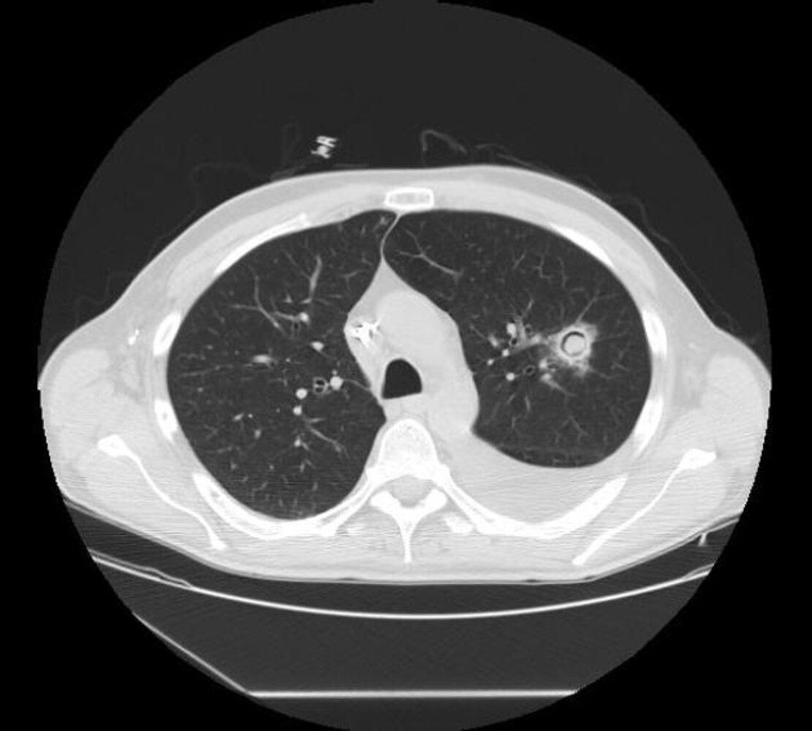

Aspergilloma

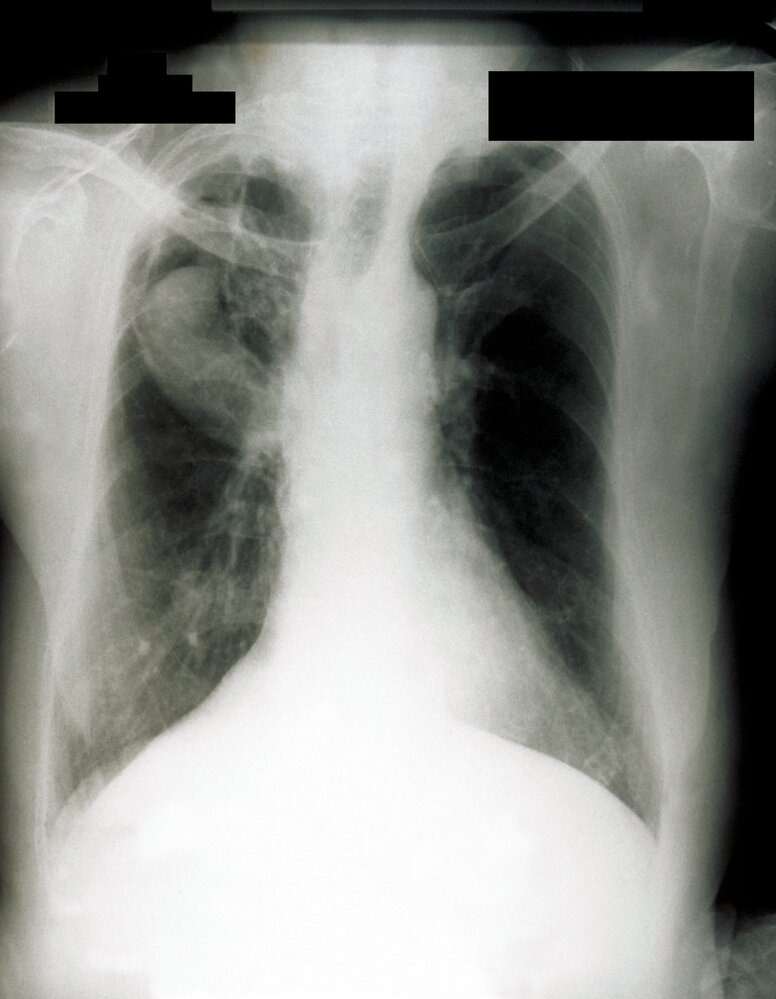

Aspergilloma (fungus ball) within right upper lobe cavity

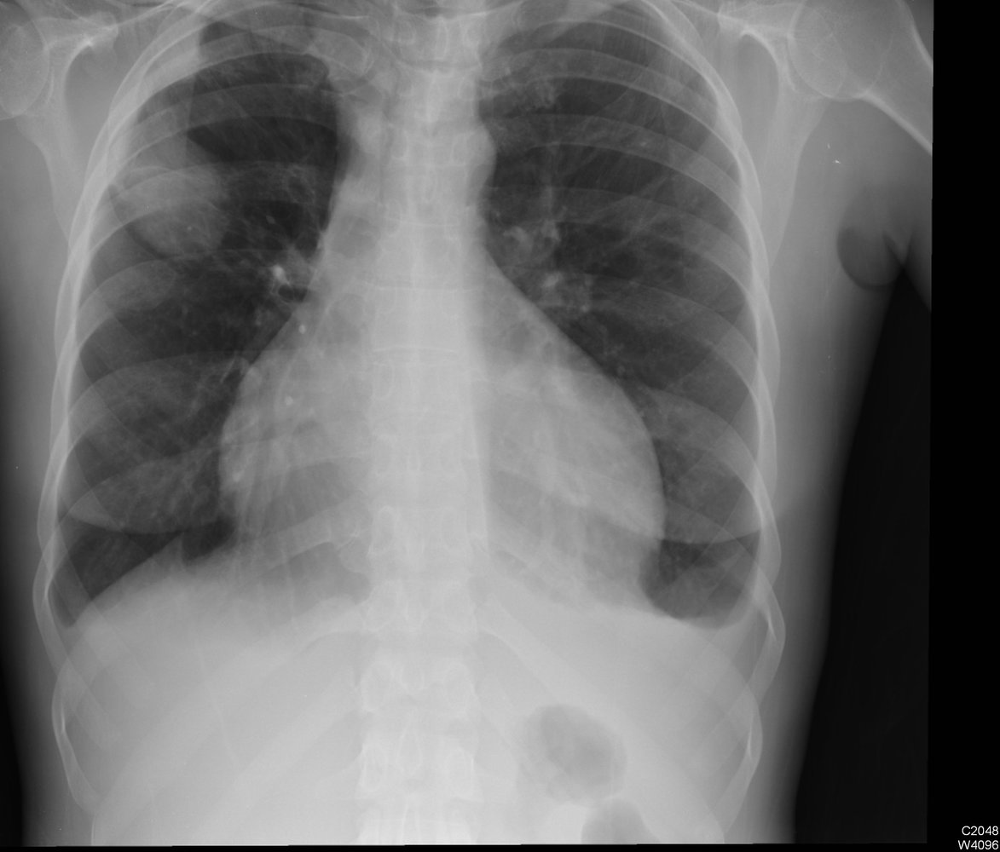

Pulmonary aspergillosis with air crescent sign

### Differential diagnosis of CPA

* <u>Mycobacterial</u> infections (e.g., <u>TB</u>, <u>nontuberculous mycobacteria</u>)

* <u>Lung cancer</u>

* <u>Pulmonary infarction</u>

* <u>Vasculitides</u>

* <u>Rheumatoid nodules</u>

* See also “Differential diagnoses of pulmonary <u>fungal infections</u>.”

### Management [[4]](https://coursology-qbank.com/amboss/article/-i1D8g0)

* <u>Expectant management</u>: for asymptomatic patients without disease progression, e.g., those with incidentally discovered <u>Aspergillus</u> <u>nodules</u> [[4]](https://coursology-qbank.com/amboss/article/-i1D8g0)[[9]](https://coursology-qbank.com/amboss/article/--WD-L0)

* Systemic <u>antifungal</u> therapy [[4]](https://coursology-qbank.com/amboss/article/-i1D8g0)

* Indications: symptomatic patients and/or those with radiographic progression or loss of <u>lung function</u>.

* Duration: Usually at least 6 months

* Preferred agents: <u>itraconazole</u> DOSAGE or <u>voriconazole</u> (<u>off-label</u>) DOSAGE  [[4]](https://coursology-qbank.com/amboss/article/-i1D8g0)[[8]](https://coursology-qbank.com/amboss/article/ZZdZZo0)[[9]](https://coursology-qbank.com/amboss/article/--WD-L0)

* Alternative agent: <u>posaconazole</u>

* Surgical resection

* Indicated for symptomatic patients with an <u>aspergilloma</u> [[4]](https://coursology-qbank.com/amboss/article/-i1D8g0)

* Considered in patients with:

* Symptomatic disease refractory to <u>antifungal</u> therapy [[4]](https://coursology-qbank.com/amboss/article/-i1D8g0)

* Refractory <u>hemoptysis</u> [[8]](https://coursology-qbank.com/amboss/article/ZZdZZo0)

* Management of <u>hemoptysis</u>: e.g., <u>bronchial artery embolization</u>, oral <u>tranexamic acid</u>, surgical resection [[8]](https://coursology-qbank.com/amboss/article/ZZdZZo0)

> [!TIP]
> <u>Voriconazole</u> may be more effective in <u>subacute invasive aspergillosis</u>. [[4]](https://coursology-qbank.com/amboss/article/-i1D8g0)[[9]](https://coursology-qbank.com/amboss/article/--WD-L0)

---

## Invasive aspergillosis

<u>Invasive aspergillosis</u> is a severe form of <u>Aspergillus</u> infection resulting from the invasion of <u>lung tissue</u> by <u>Aspergillus</u> species, which results in severe <u>pneumonia</u> with potential dissemination to other organs. [[8]](https://coursology-qbank.com/amboss/article/ZZdZZo0)

### <u>Risk factors</u> [[4]](https://coursology-qbank.com/amboss/article/-i1D8g0)[[8]](https://coursology-qbank.com/amboss/article/ZZdZZo0)[[9]](https://coursology-qbank.com/amboss/article/--WD-L0)

* <u>Immune deficiency</u>

* Prolonged <u>neutropenia</u> or <u>neutrophil</u> dysfunction (e.g., due to <u>chronic granulomatous disease</u>)

* <u>Immunosuppression</u> (e.g., due to <u>AIDS</u>, <u>chemotherapy</u>, after solid organ or <u>stem cell</u> transplant)

* Hematologic <u>malignancy</u> (e.g., <u>acute leukemia</u>)

* <u>Glucocorticoid</u> use

* Critical illness

* Other chronic diseases, e.g.:

* <u>COPD</u>

* <u>HIV</u>

* <u>Liver</u> disease

* <u>Diabetes mellitus</u>

* Extensive exposure to <u>Aspergillus</u> spores in hosts

### Clinical features [[8]](https://coursology-qbank.com/amboss/article/ZZdZZo0)

Symptoms are most commonly caused by pulmonary involvement. Other organ systems can be affected via hematogenous spread (most common in <u>immunocompromised individuals</u>) or direct <u>inoculation</u> (e.g., due to trauma, <u>surgery</u>, foreign bodies).  [[8]](https://coursology-qbank.com/amboss/article/ZZdZZo0)

* Onset [[9]](https://coursology-qbank.com/amboss/article/--WD-L0)

* Days to weeks in patients with prolonged <u>neutropenia</u>

* Weeks to months in patients with additional <u>immune deficiency</u>

* Features of severe <u>pneumonia</u>, e.g.:

* <u>Cough</u>

* <u>Dyspnea</u>

* <u>Tachypnea</u>, <u>tachycardia</u>, <u>hypoxemia</u>

* <u>Fever</u>

* <u>Hemoptysis</u>, <u>pleuritic chest pain</u>, <u>septic shock</u> following angioinvasion

* Features of <u>CNS</u> infection

* Symptoms include <u>headaches</u>, <u>lethargy</u>, <u>altered mental status</u>, <u>seizures</u>, <u>focal neurological deficits</u>. [[10]](https://coursology-qbank.com/amboss/article/ZbdZHo0)

* Manifestations include <u>brain abscess</u>, <u>meningitis</u>, ventriculitis, and/or <u>cerebral venous thrombosis</u>.

* Features of cutaneous infection [[11]](https://coursology-qbank.com/amboss/article/YbdnHo0)

* Induration and <u>erythema</u>

* <u>Macules</u>, <u>nodules</u>, <u>papules</u>, and <u>plaques</u>

* May develop into hemorrhagic <u>bullae</u> or ulcerative <u>nodules</u> and eventually <u>eschars</u>

* <u>Clinical features of infective endocarditis</u> in <u>Aspergillus</u> <u>endocarditis</u>

* <u>Clinical features of sinusitis</u> in <u>Aspergillus</u> <u>sinusitis</u>; may involve invasion of the surrounding tissue

* Features of orbital invasion, e.g., <u>endophthalmitis</u>, decreased <u>visual acuity</u>, painful <u>exophthalmos</u>, or <u>chemosis</u> [[12]](https://coursology-qbank.com/amboss/article/kcdmcK0)[[13]](https://coursology-qbank.com/amboss/article/0bdeHo0)

* <u>Clinical features of UTI</u>, e.g., <u>fever</u>, flank <u>pain</u> [[14]](https://coursology-qbank.com/amboss/article/iWdJOK0)

* Clinical features of <u>liver</u> infection, e.g., <u>right upper quadrant</u> <u>pain</u> in <u>liver abscess</u> [[15]](https://coursology-qbank.com/amboss/article/QWduOK0)

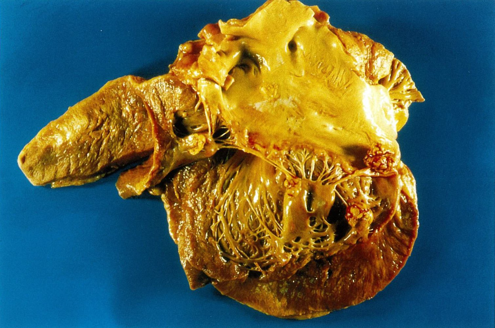

Aspergillus endocarditis

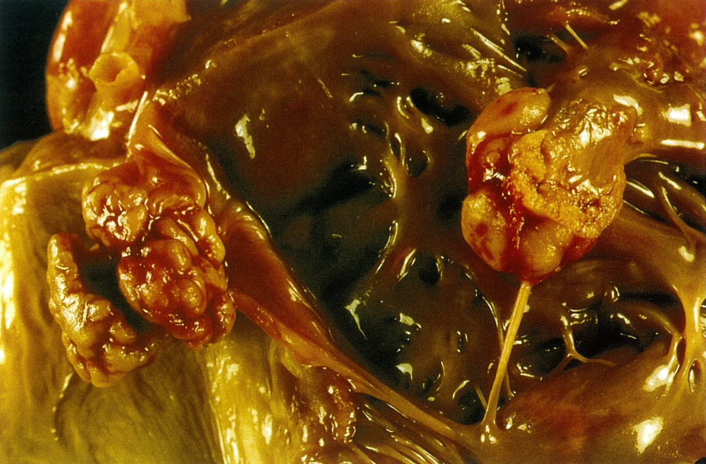

Aspergillus endocarditis

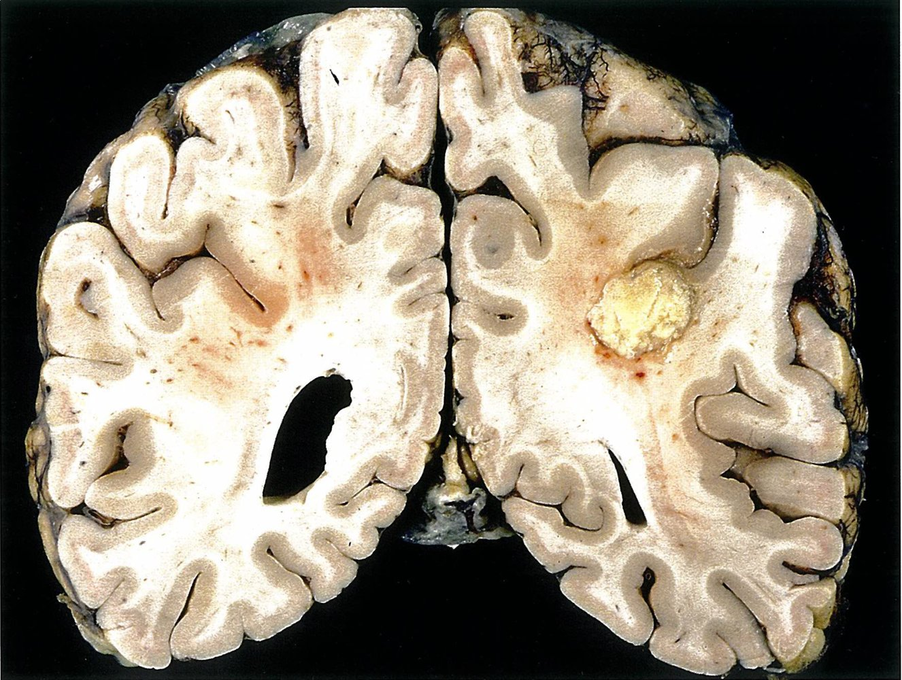

Cerebral aspergillosis

> [!TIP]
> <u>Invasive aspergillosis</u> primarily affects the <u>lungs</u> but can also manifest as a disseminated infection (e.g., involvement of <u>skin</u>, <u>CNS</u>).

### Diagnostics [[8]](https://coursology-qbank.com/amboss/article/ZZdZZo0)

Suspect <u>invasive aspergillosis</u> in patients with characteristic clinical features. If laboratory and imaging studies support the diagnosis, confirm with a positive culture or <u>biopsy</u> showing septate <u>hyphae</u> and tissue destruction.

#### <u>Laboratory studies</u> [[4]](https://coursology-qbank.com/amboss/article/-i1D8g0)[[8]](https://coursology-qbank.com/amboss/article/ZZdZZo0)

* Supportive findings include:

* Positive galactomannan enzyme immunoassay: an <u>EIA</u> that detects galactomannan antigen, a heteropolysaccharide component of the <u>Aspergillus</u> <u>cell wall</u> that is shed during hyphal growth

* Positive 1,3-β-D glucan assay  [[4]](https://coursology-qbank.com/amboss/article/-i1D8g0)

#### Imaging

Characteristic radiographic findings of <u>Aspergillus</u> infection support the diagnosis.

* <u>HRCT</u> chest without contrast (for all suspected cases): [[3]](https://coursology-qbank.com/amboss/article/jWd_OK0)[[8]](https://coursology-qbank.com/amboss/article/ZZdZZo0)

* Air crescent sign: a <u>radiolucent</u> crescent around a <u>radiopaque</u> <u>nodule</u>, characteristic of <u>invasive aspergillosis</u>

* <u>Halo sign</u>: hemorrhagic <u>ground glass opacities</u> around <u>nodules</u>

* Multiple <u>nodules</u>

* CT and <u>MRI</u> <u>brain</u> with contrast (for suspected <u>CNS</u> <u>Aspergillus</u> infection): [[10]](https://coursology-qbank.com/amboss/article/ZbdZHo0)

* <u>Ring-enhancing lesions</u> consistent with <u>abscess</u> formation

* <u>Enhancement</u> of intracranial <u>dura</u>

* Bone <u>erosion</u> in <u>Aspergillus</u> <u>sinusitis</u> with invasion of the surrounding tissue

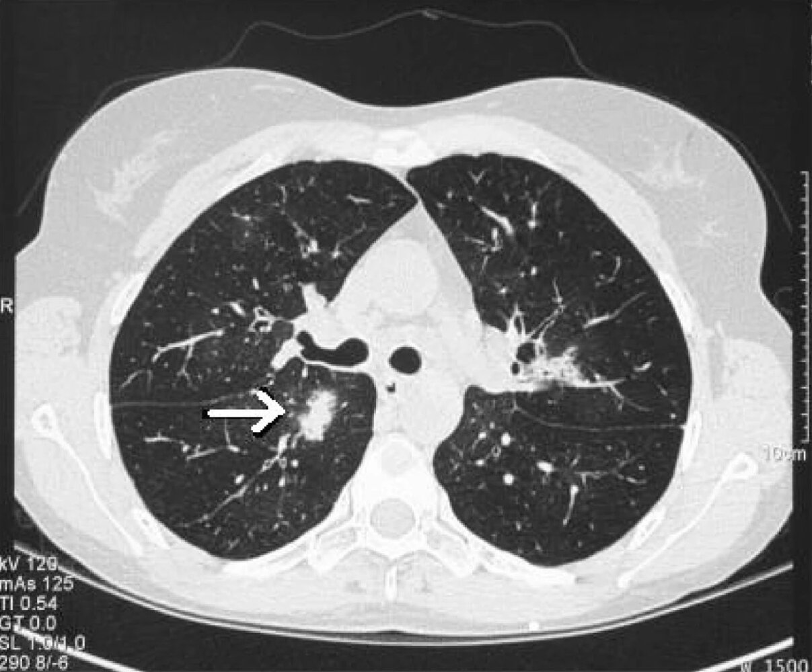

Halo sign in pulmonary aspergillosis

#### Diagnostic confirmation [[4]](https://coursology-qbank.com/amboss/article/-i1D8g0)

* Obtain a tissue or fluid sample (e.g., via <u>bronchoscopy</u> with <u>biopsy</u> and/or <u>bronchoalveolar lavage</u>) if <u>invasive aspergillosis</u> is supported by laboratory and imaging findings. [[8]](https://coursology-qbank.com/amboss/article/ZZdZZo0)

* Send samples for culture and <u>cytology</u>.

* Staining: Gomori methenamine <u>silver stain</u> or <u>periodic acid-Schiff</u> stain

* Findings: monomorphic and/or septate <u>hyphae</u> branching dichotomously at 45°

> [!TIP]
> Positive culture or <u>biopsy</u> showing septate <u>hyphae</u> is the <u>gold standard</u> for the diagnosis of <u>invasive aspergillosis</u>.

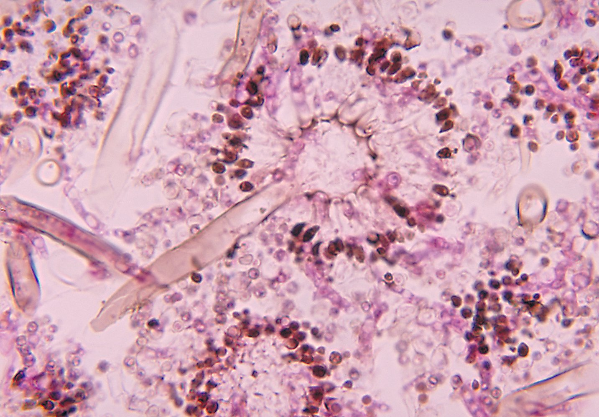

Aspergillus conidiophores

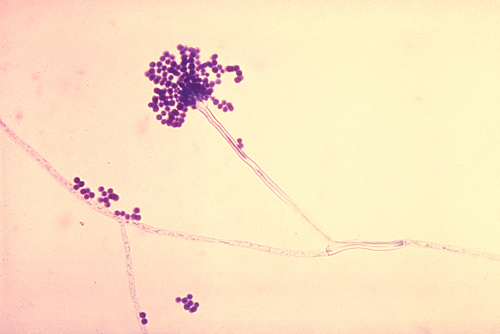

Aspergillus fumigatus

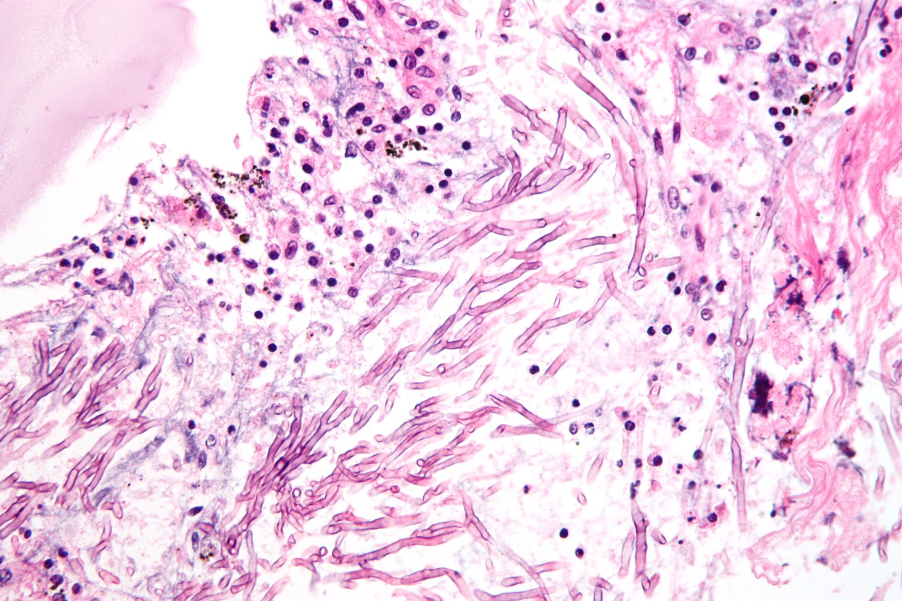

Pulmonary aspergillosis

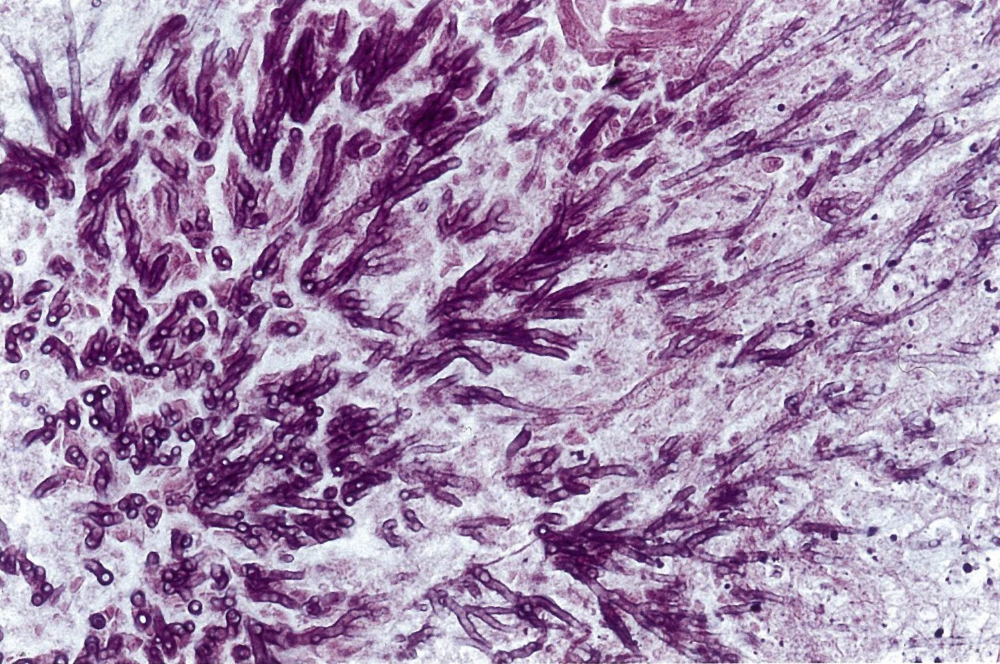

Aspergillus endocarditis

### Management [[3]](https://coursology-qbank.com/amboss/article/jWd_OK0)[[4]](https://coursology-qbank.com/amboss/article/-i1D8g0)[[8]](https://coursology-qbank.com/amboss/article/ZZdZZo0)

* Consult infectious diseases in all cases of <u>invasive aspergillosis</u>.

* Initiate <u>antifungal</u> treatment promptly.

* Preferred: <u>voriconazole</u> DOSAGE [[4]](https://coursology-qbank.com/amboss/article/-i1D8g0)

* Alternatives include:

* Liposomal <u>amphotericin B</u>

* <u>Isavuconazole</u>

* In combination with <u>caspofungin</u> if monotherapy fails

* Manage immunocompromising conditions.

* Initiate <u>antiretroviral therapy</u> in patients with <u>HIV</u>.

* Decrease the level of <u>immunosuppression</u> in patients taking <u>immunosuppressants</u>.

* Order additional testing (e.g., <u>echocardiogram</u>, ophthalmologic exam) based on clinical manifestations.

* Encourage protective measures (see “Prevention”).

---

## Differential diagnoses

| Differential diagnosis of pulmonary fungal infections |  |  |  |  |
| --- | --- | --- | --- | --- |
| Mycoses | Etiology | Clinical features | Diagnosis | Treatment |
| Aspergillosis |   * <u>Pathogen</u>: <u>Aspergillus</u> species  * <u>Aspergillus fumigatus</u>  * <u>Aspergillus flavus</u>  * <u>Risk factors</u>:  * Chronic granulomatous infection  * Immunosupression (e.g., <u>HIV</u>)    |   * <u>ABPA</u>  * Associated <u>asthma</u> or <u>CF</u>  * Causes <u>bronchiectasis</u> and <u>eosinophilia</u>  * Pulmonary <u>aspergilloma</u> (especially after <u>TB</u> infection):  * <u>Chronic cough</u>  * <u>Hemoptysis</u>  * <u>Invasive aspergillosis</u>:  * <u>Fever</u>  * <u>Cough</u>  * <u>Respiratory distress</u>  * <u>Endocarditis</u>    |   * <u>ABPA</u>  * <u>Eosinophilia</u>  * ↑ <u>IgE</u>  * Pulmonary infiltrates on chest <u>x-ray</u>/CT  * Pulmonary <u>aspergilloma</u>:  * Mobile fungus ball on <u>x-ray</u>/CT  * Positive <u>Aspergillus</u> <u>IgG</u> <u>serology</u>  * <u>Invasive aspergillosis</u>: 45° angle branching septate <u>hyphae</u> with fruiting bodies on tissue <u>biopsy</u> with silver/<u>PAS</u>-staining    |   * <u>ABPA</u>  * Oral <u>prednisone</u> if severe  * <u>Itraconazole</u> if recurrent  * Pulmonary <u>aspergilloma</u>: <u>lobectomy</u> for <u>massive hemoptysis</u>  * <u>Invasive aspergillosis</u>: IV <u>voriconazole</u>    |
|  <u>Coccidioidomycosis</u> (<u>Valley fever</u>) |   * <u>Pathogen</u>: <u>Coccidioides immitis</u>  * <u>Risk factors</u>:  * Travel to Southwestern United States, California  * Immunosupression (e.g., <u>HIV</u>)    |   * Often asymptomatic  * Acute <u>pneumonia</u> (e.g,, <u>fever</u>, <u>cough</u>, <u>dyspnea</u>)  * Extrapulmonary findings  * <u>CNS</u> (e.g., <u>meningitis</u>)  * <u>Skin</u> (e.g., <u>erythema nodosum</u>, <u>erythema multiforme</u> )    |   * <u>Chest x-ray</u>: normal or infiltrates/<u>lymphadenopathy</u>/<u>pleural effusion</u>  * <u>Serology</u>: <u>IgM</u> is initially increased, <u>IgG</u> increases after 1–3 months  * KOH/calcofluor staining on smears or silver/<u>PAS</u>-staining on tissue <u>biopsy</u>: <u>dimorphic fungus</u> and spherules filled with <u>endospores</u>  * Confirmatory: culture    |   * IV <u>Amphotericin B</u> if severe infection  * Alternative: <u>itraconazole</u>    |
| <u>Paracoccidioidomycosis</u> |   * <u>Pathogen</u>: <u>Paracoccidioides</u> species  * <u>Paracoccidioides brasiliensis</u>  * <u>Paracoccidioides lutzii</u>  * <u>Risk factors</u>: travel to South and Central America    |   * Infected patients often asymptomatic  * Acute <u>pneumonia</u>  * Painful nasal, pharyngeal, and laryngeal <u>mucosal</u> <u>ulcerations</u>  * <u>Lymphadenopathy</u> (usually cervical)  * Extrapulmonary manifestations (e.g., <u>verrucous</u> <u>skin</u> lesions)    |   * KOH/calcofluor staining on smears or silver/<u>PAS</u>-staining on tissue <u>biopsy</u>: <u>budding</u> <u>yeast</u> with “captain's wheel” appearance  * Cultures have a low <u>sensitivity</u>    |   * <u>Itraconazole</u>  * <u>Amphotericin B</u> if severe or refractory    |
| <u>Blastomycosis</u> |   * <u>Pathogen</u>: <u>Blastomyces dermatitidis</u>  * <u>Risk factors</u>: travel to states East of Mississippi River and Central America    |   * Infected patients often asymptomatic  * <u>Pneumonia</u> with <u>flulike symptoms</u>  * Extrapulmonary manifestations  * <u>Verrucous</u> <u>skin</u> lesions  * Lytic bone lesions  * Genitourinary involvement  * <u>CNS</u> lesions    |   * KOH/calcofluor staining on smears or silver/<u>PAS</u>-staining on tissue <u>biopsy</u>: broad-based <u>dimorphic fungus</u>  * Confirmatory: culture    |   * Local infection: <u>fluconazole</u> and <u>itraconazole</u>  * Systemic infection: IV <u>amphotericin B</u>    |
| <u>Histoplasmosis</u> |   * <u>Pathogen</u>: <u>Histoplasma capsulatum</u>  * <u>Risk factors</u>:  * Immunosupression (e.g., <u>HIV</u>)  * Exposure to bird or bat droppings especially in Mississippi and Ohio river valleys    |   * Infected patients often asymptomatic  * Acute <u>pneumonia</u>  * Extrapulmonary manifestations (e.g., ulcerative oral lesions)    |   * Best initial: positive urine and serum <u>polysaccharide</u> <u>antigen</u> test  * Chest <u>x-ray</u>:  * Diffuse nodular densities  * Focal infiltrate or cavity  * <u>Lymphadenopathy</u>  * Silver/<u>PAS</u>-staining on <u>bronchoalveolar lavage</u> or <u>biopsy</u>: <u>macrophages</u> filled with <u>yeast</u> form [[16]](https://coursology-qbank.com/amboss/article/mGXV-z)  * Confirmatory: culture    |   * Mild disease: supportive therapy  * Chronic cavitation: oral <u>itraconazole</u> > 1 year  * Severe pulmonary or disseminated disease: <u>amphotericin B</u>/liposomal then <u>itraconazole</u>    |
| <u>Cryptococcosis</u> |   * <u>Pathogen</u>: <u>Cryptococcus neoformans</u>  * <u>Risk factors</u>:  * Immunosupression (e.g., <u>HIV</u>)  * Exposure to pigeon droppings    |   * Infected patients often asymptomatic  * Isolated <u>pneumonia</u> is possible  * Extrapulmonary manifestations :  * <u>Cryptococcal</u> <u>meningoencephalitis</u>  * <u>Brain abscess</u>    |  * <u>Lumbar puncture</u> (<u>LP</u>)  * <u>India ink stain</u> or <u>Mucicarmine</u>  * Positive <u>cryptococcal</u> <u>antigen</u> (also in blood)  * Fungal culture: ∼10 μm <u>yeast</u> with thick <u>polysaccharide</u> capsule and narrow, unequal <u>budding</u>   |   * IV <u>amphotericin B</u> and <u>flucytosine</u> followed by oral <u>fluconazole</u>  * <u>Maintenance therapy</u>: <u>fluconazole</u> (until symptoms resolve and <u>CD4</u> > 100/mm³ for at least 1 year)  * Serial therapeutic LPs for ↑ intracranial pressure    |
| <u>Candidiasis</u> |   * <u>Pathogen</u>: <u>Candida</u> albicans  * <u>Risk factors</u>:  * <u>Antibiotics</u>  * ↑ <u>Estrogen</u> during <u>pregnancy</u>  * Minor trauma (e.g., abrasio)    |   * Pulmonary involvement in severe <u>immunosuppression</u>  * Extrapulmonary:  * Oral and esophageal <u>thrush</u>  * <u>Vulvovaginitis</u>  * <u>Skin infection</u>  * Disseminated disease: <u>sepsis</u>, <u>meningitis</u>, multiple <u>abscesses</u>, <u>endocarditis</u>    |   * <u>KOH staining</u> on scrapings or smears: <u>budding</u> <u>yeasts</u>, <u>hyphae</u>, and <u>pseudohyphae</u>  * Confirmatory: culture (blood or tissue)    |   * Vaginal (uncomplicated): topical <u>azole</u>  * Oral:   * <u>Nystatin</u>  * <u>Fluconazole</u> if refractory  * <u>Esophagitis</u>: oral <u>fluconazole</u>, <u>caspofungin</u>  * <u>Superficial</u> <u>skin</u> <u>candidiasis</u>: topical <u>antifungals</u>  * Systemic: <u>fluconazole</u>, <u>caspofungin</u>, or <u>amphotericin B</u>    |
| <u>Pneumocystis pneumonia</u> |   * <u>Pathogen</u>: <u>P. jirovecii</u> (previously <u>P. carinii</u>)  * <u>Risk factors</u>: Immunosupression (e.g., <u>HIV</u> with <u>CD4 count</u> < 200/mm³)    |  * <u>Pneumocystis pneumonia</u> (<u>PCP</u>):  * <u>Fever</u>  * <u>Exertional dyspnea</u>  * Nonproductive <u>cough</u>  * Weight loss  * Impaired oxygenation   |   * Chest <u>x-ray</u>/CT: diffuse, bilateral <u>ground-glass opacities</u>  * <u>Silver stain</u> and <u>immunofluorescence</u> on <u>bronchoalveolar lavage</u> (or <u>lung</u> <u>biopsy</u> if <u>sputum</u> is negative): disc-shaped <u>yeasts</u>  * Cannot be cultured    |   * High-dose <u>TMP-SMX</u> (treatment and prophylaxis)  * Alternatively: <u>clindamycin</u> PLUS <u>primaquine</u>  * <u>Prednisone</u> (in the case of moderate to severe <u>hypoxemia</u>)    |

The differential diagnoses listed here are not exhaustive.

---