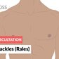
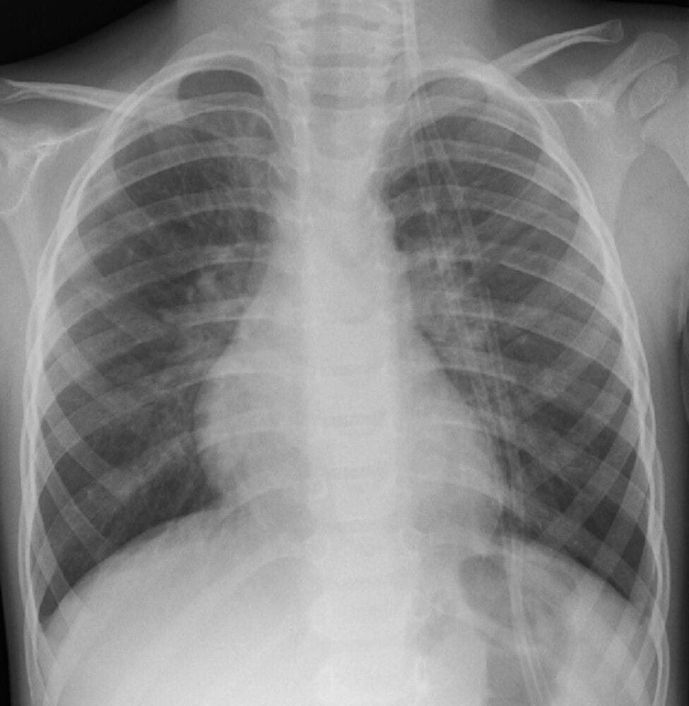
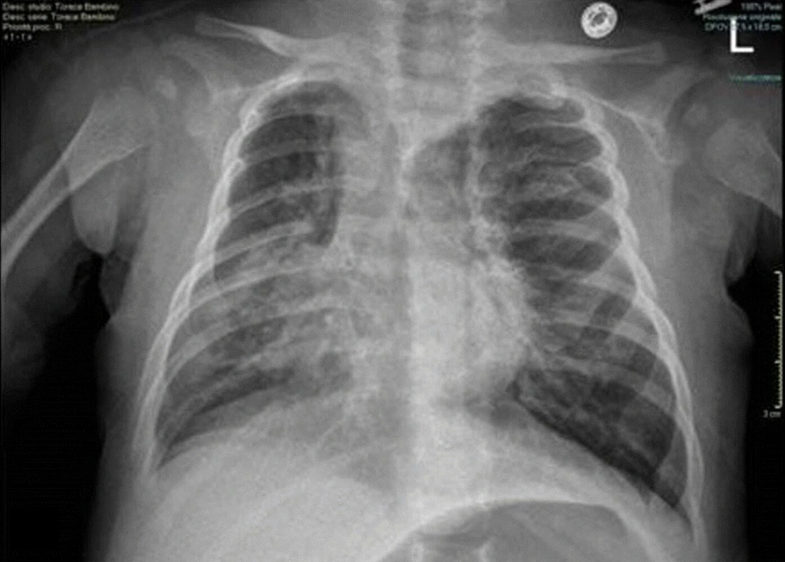

# Bronchiolitis

*Categories: Clinical knowledge > Internal medicine > Pulmonology > Infectious lung diseases > Bronchiolitis*

[Original Article Link](https://coursology-qbank.com/amboss/article/oL00Ag)

---

## Summary

Bronchiolitis is a <u>lower respiratory tract infection</u> (<u>LRTI</u>) characterized by inflammation of the <u>bronchioles</u> in children < 2 years of age. <u>Respiratory syncytial virus</u> (<u>RSV</u>) is the primary <u>pathogen</u>, although many <u>viruses</u> have been implicated in bronchiolitis. Patients first present with <u>upper respiratory tract infection</u> (<u>URTI</u>) symptoms (e.g., low-grade <u>fever</u>, nasal congestion) followed by a <u>cough</u>, <u>wheezing</u>, and, in severe cases, <u>signs of acute respiratory distress</u>. Bronchiolitis is a <u>clinical diagnosis</u>; diagnostic studies are usually not needed unless the child presents with severe illness that requires an evaluation for associated complications (e.g., <u>superinfection</u>, <u>respiratory acidosis</u>) or if the diagnosis is uncertain. Management consists of supportive treatment (e.g., <u>nasal suction</u>) and close monitoring. Severe illness requires hospitalization for additional management (e.g., <u>IV fluids</u>, <u>respiratory support</u>, <u>nutritional support</u>) and close monitoring of respiratory status. Bronchiolitis prevention includes <u>RSV vaccination</u> of pregnant individuals in the <u>third trimester</u> and routine <u>passive immunization</u> of all <u>infants</u> < 8 months of age with <u>RSV monoclonal antibodies</u>.

---

## Epidemiology

* Primarily affects children < 2 years of age

* Peak <u>incidence</u>: 2–6 months of age

* Common during winter months

* <u>Risk factors</u> are the same as <u>risk factors for severe RSV infection in children</u>.

Epidemiological data refers to the US, unless otherwise specified.

---

## Etiology

* Most common: <u>respiratory syncytial virus</u> (<u>RSV</u>), a <u>paramyxovirus</u>

* Less common

* <u>Parainfluenza virus</u>

* <u>Influenza virus</u>

* <u>Adenovirus</u>

* <u>Rhinovirus</u>

* <u>Coronavirus</u>

* <u>Metapneumovirus</u>

---

## Clinical features

* Initially, <u>URTI symptoms</u> (e.g., copious <u>rhinorrhea</u>, low-grade <u>fever</u>, <u>cough</u>) [[1]](https://coursology-qbank.com/amboss/article/gSaF_P)[[2]](https://coursology-qbank.com/amboss/article/VBcG-e0)

* Followed by <u>LRTI</u> symptoms [[1]](https://coursology-qbank.com/amboss/article/gSaF_P)[[2]](https://coursology-qbank.com/amboss/article/VBcG-e0)

* <u>Crackles</u>, <u>wheezes</u>; , and/or <u>rhonchi</u> on <u>auscultation</u>  [[2]](https://coursology-qbank.com/amboss/article/VBcG-e0)

* Findings vary minute-to-minute as mucus is cleared and/or respiratory efforts change.

* Severe illness: <u>respiratory distress</u> (usually occurs in children < 1 year of age) 

* <u>Tachypnea</u> or <u>apnea</u>

* Prolonged expiration

* <u>Nasal flaring</u>

* Intercostal <u>retractions</u>

* <u>Cyanosis</u>

* Often associated with poor feeding  [[3]](https://coursology-qbank.com/amboss/article/hxccwe0)

> [!TIP]
> If significant nasal congestion is present, provide <u>nasal suction</u> and reassess respiratory status to differentiate <u>upper airway</u> involvement (clear breath sounds after <u>nasal suction</u>) from <u>lower airway</u> involvement (abnormal breath sounds after <u>nasal suction</u>). [[2]](https://coursology-qbank.com/amboss/article/VBcG-e0)

> [!WARNING]
> Symptoms typically peak 3–5 days after onset and then gradually improve over 2–3 weeks. The onset of new symptoms or worsening of existing symptoms (e.g., <u>fever</u>) after 3–5 days should raise concern for <u>complications of bronchiolitis</u>. [[1]](https://coursology-qbank.com/amboss/article/gSaF_P)[[2]](https://coursology-qbank.com/amboss/article/VBcG-e0)

Fine Crackles (Rales) - Lung Auscultation - Episode 2 LC

Fine Crackles (Rales) - Lung Auscultation - Episode 2

---

## Diagnosis

### General principles [[1]](https://coursology-qbank.com/amboss/article/gSaF_P)[[4]](https://coursology-qbank.com/amboss/article/Um1bUh0)

* Bronchiolitis is a <u>clinical diagnosis</u> based on the patient's age (< 2 years) and the presence of classic <u>clinical features of bronchiolitis</u>.

* Further testing is not usually required but may be considered in patients with:

* Severe disease, e.g., if there is concern for <u>respiratory failure</u>

* Suspected <u>complications of bronchiolitis</u>

* Diagnostic uncertainty to rule out <u>differential diagnoses of bronchiolitis</u>

### <u>Laboratory studies</u> [[1]](https://coursology-qbank.com/amboss/article/gSaF_P)[[2]](https://coursology-qbank.com/amboss/article/VBcG-e0)

* <u>Blood gas</u>  [[5]](https://coursology-qbank.com/amboss/article/351SPh0)

* Indicated for worsening severe disease and/or <u>impending respiratory failure</u>

* May show <u>hypoxemia</u> and/or <u>CO2 retention</u>

* <u>Respiratory viral panel</u>

* Indications

* Hospitalized <u>infants</u> receiving <u>palivizumab prophylaxis</u>

* Consider if <u>patient cohorting</u> is planned.

* Findings [[1]](https://coursology-qbank.com/amboss/article/gSaF_P)

* 60–75% are positive for <u>RSV</u>

* <u>Coinfections</u> are present in up to one-third of those tested

* Studies to exclude differential diagnoses (not routinely recommended) 

* <u>Blood culture</u>

* <u>Urinalysis</u> and <u>urine culture</u>  [[6]](https://coursology-qbank.com/amboss/article/sm1tSh0)

* <u>CBC</u> and <u>BMP</u>

### Chest x-ray in bronchiolitis

* Indications: severe disease if there is diagnostic uncertainty or suspected complications (e.g., <u>pneumothorax</u>, <u>pneumonia</u>)

* Potential findings

* Normal

* Nonspecific findings, e.g., <u>peribronchial thickening</u>, hyperinflation of the <u>lungs</u>, <u>interstitial</u> infiltrates, <u>atelectasis</u>

* Superimposed complications, e.g., <u>pneumonia</u>

Viral bronchiolitis

Bilateral hyperinflation and right lung consolidation

---

## Management

### Approach [[1]](https://coursology-qbank.com/amboss/article/gSaF_P)[[7]](https://coursology-qbank.com/amboss/article/SSay_P)

* Determine the need for immediate <u>respiratory support</u>.

* <u>Hypoxemia</u> (i.e., O2 ≤ 90% on room air): <u>oxygen therapy</u> via <u>nasal cannula</u>

* Refractory <u>hypoxemia</u>, <u>signs of respiratory distress</u>, <u>respiratory failure</u>: <u>intubation</u>, <u>CPAP</u>, or <u>high-flow nasal cannula</u>

* Start supportive measures including adequate hydration, relief of nasal congestion and/or obstruction, and monitoring.

* Screen for <u>admission criteria for bronchiolitis</u> and initiate <u>inpatient management of bronchiolitis</u> if present.

* Provide <u>outpatient management of bronchiolitis</u> with close medical follow-up for patients who do not meet the admission criteria.

> [!TIP]
> Children with bronchiolitis and <u>oxygen saturation</u> ≥ 90% do not require <u>supplemental oxygen</u>. [[1]](https://coursology-qbank.com/amboss/article/gSaF_P)[[4]](https://coursology-qbank.com/amboss/article/Um1bUh0)

> [!WARNING]
> Avoid <u>bronchodilators</u>, <u>epinephrine</u>, <u>corticosteroids</u>, <u>antibiotics</u>, and chest <u>physiotherapy</u> unless there are comorbidities (e.g., <u>asthma</u>, <u>croup</u>, <u>cystic fibrosis</u>, <u>acute otitis media</u>). [[1]](https://coursology-qbank.com/amboss/article/gSaF_P)

### Admission criteria for bronchiolitis [[1]](https://coursology-qbank.com/amboss/article/gSaF_P)[[7]](https://coursology-qbank.com/amboss/article/SSay_P)[[8]](https://coursology-qbank.com/amboss/article/nBc7YU0)

* Unwell appearance, <u>lethargy</u>

* Moderate to severe <u>signs of respiratory distress</u> (including significantly elevated <u>respiratory rate</u> for age)

* Ongoing <u>respiratory support</u> required

* Need for supplemental hydration

* History of <u>apnea</u>

* Consider if:

* <u>Risk factors for severe bronchiolitis</u> are present

* <u>Supportive care</u> at home is not feasible  [[8]](https://coursology-qbank.com/amboss/article/nBc7YU0)

### Inpatient management of bronchiolitis [[1]](https://coursology-qbank.com/amboss/article/gSaF_P)[[7]](https://coursology-qbank.com/amboss/article/SSay_P)

#### <u>Respiratory support</u>

* Frequently monitor routine <u>vital signs</u> including <u>O2 saturation</u>; consider using:

* Continuous <u>pulse oximetry</u>  [[1]](https://coursology-qbank.com/amboss/article/gSaF_P)

* An objective respiratory score  [[9]](https://coursology-qbank.com/amboss/article/3f1SNT0)

* Adjust <u>short-term oxygen therapy</u> as needed.

* Provide regular <u>external nasal suction</u>.  [[1]](https://coursology-qbank.com/amboss/article/gSaF_P)

* Consider scheduled nebulizations with 3% hypertonic saline DOSAGE  [[1]](https://coursology-qbank.com/amboss/article/gSaF_P)[[10]](https://coursology-qbank.com/amboss/article/Sf1ylT0)

> [!WARNING]
> <u>Hypertonic saline</u> nebulizations may trigger <u>bronchospasm</u>. Discontinue treatment if nebulizations cause severe <u>coughing</u> fits and/or worsen the patient's respiratory status. [[10]](https://coursology-qbank.com/amboss/article/Sf1ylT0)

#### Caloric and fluid support

* Ensure patients receive the recommended daily intake for their age.

* Encourage normal oral feeds (e.g., with <u>breastmilk</u>, formula, regular diet for age) as tolerated.

* Consider NG/<u>IV fluids</u> for any of the following: [[1]](https://coursology-qbank.com/amboss/article/gSaF_P)

* Poor oral intake

* <u>Respiratory rate</u> consistently > 60–70 bpm

* Worsening respiratory status during feeds

* Symptoms of <u>aspiration</u>

> [!TIP]
> <u>Respiratory distress</u> increases caloric and fluid requirements but also increases the risk for <u>aspiration</u> during oral feeds. Nutritional and fluid support via a <u>feeding tube</u> (orogastric or nasogastric) and/or intravenously is often necessary. [[1]](https://coursology-qbank.com/amboss/article/gSaF_P)

#### Other recommendations

* Start <u>isolation precautions</u> in accordance with local protocols (e.g., <u>contact precautions</u> and <u>droplet precautions</u> for <u>RSV</u>).[[11]](https://coursology-qbank.com/amboss/article/7Wc45Y0)[[12]](https://coursology-qbank.com/amboss/article/Bedza60)

* If used, discontinue <u>palivizumab prophylaxis</u>. [[1]](https://coursology-qbank.com/amboss/article/gSaF_P)

### Outpatient management of bronchiolitis [[1]](https://coursology-qbank.com/amboss/article/gSaF_P)[[7]](https://coursology-qbank.com/amboss/article/SSay_P)

* Arrange follow-up within 24 hours.  [[13]](https://coursology-qbank.com/amboss/article/35YSPp)

* Educate caregivers on:

* Signs of deterioration  and the need to seek immediate medical attention if present [[13]](https://coursology-qbank.com/amboss/article/35YSPp)

* How and when to provide <u>nasal suction</u>

* The expected course of disease

* Encourage adequate oral caloric and fluid intake.

* Advise caregivers to avoid exposing the patient to second-hand smoke; offer <u>counseling on smoking cessation</u> for household members.

> [!TIP]
> Advise caregivers to seek immediate medical attention if the child shows signs of deterioration such as <u>dehydration</u>, poor feeding, <u>lethargy</u> or irritation, new <u>fever</u>, and/or <u>signs of respiratory distress</u>. [[13]](https://coursology-qbank.com/amboss/article/35YSPp)

---

## Differential diagnoses

* No <u>URTI symptoms</u>

* <u>Congenital heart disease</u>

* <u>Foreign body aspiration</u>

* Congenital <u>airway</u> abnormalities (e.g., <u>vascular ring</u>)

* <u>Wheeze</u>

* Polyphonic

* <u>Asthma</u>

* <u>Congestive heart failure</u> secondary to <u>congenital heart disease</u> [[7]](https://coursology-qbank.com/amboss/article/SSay_P)

* Monophonic: <u>foreign body aspiration</u>

* See also “<u>Wheezing in children</u>”.

* Asymmetric <u>crackles</u>: bacterial or <u>viral pneumonia</u>

* <u>Cough</u>

* <u>Pneumonia</u>

* <u>Pertussis</u>

* See also “<u>Differential diagnosis of acute cough</u>” and “<u>Bronchitis</u>.”

* <u>Neonatal fever</u>: <u>neonatal sepsis</u>

The differential diagnoses listed here are not exhaustive.

---

## Complications

* <u>Apnea</u>

* <u>Respiratory failure</u>

* <u>Pneumonia</u>

* <u>Dehydration</u>

* <u>Otitis media</u>

We list the most important complications. The selection is not exhaustive.

---

## Prognosis

* With timely diagnosis and adequate treatment, the prognosis is good.

* Bronchiolitis in <u>infancy</u> is associated with an increased risk of developing <u>asthma</u>.

---