# Asbestos-related diseases

*Categories: Clinical knowledge > Internal medicine > Pulmonology > Neoplastic lung diseases > Asbestos-related diseases*

[Original Article Link](https://coursology-qbank.com/amboss/article/lh0vVf)

---

## Summary

<u>Asbestos</u>-related diseases are a group of conditions caused by exposure to <u>asbestos</u> fibers. <u>Occupational exposure</u> (e.g., in shipbuilding, roofing, plumbing) is the primary cause. <u>Asbestos</u>-related diseases include nonmalignant diseases such as <u>asbestosis</u> and <u>benign asbestos-related pleural effusion</u>, as well as malignant diseases such as <u>lung cancer</u> and <u>mesothelioma</u>. Diagnosis is primarily based on history of exposure, clinical and imaging findings, and, in some cases, <u>histopathology</u>. Preventing <u>asbestos</u> exposure is crucial. <u>Asbestos</u> is banned in many countries worldwide, and as part of ongoing efforts to reduce <u>asbestos</u> exposure risks, the US is also striving toward a complete ban on <u>asbestos</u>.

<u>Asbestosis</u> is a type of <u>pneumoconiosis</u> caused by the inhalation of <u>asbestos</u> fibers. After a long <u>latency period</u> of > 20 years, <u>asbestosis</u> manifests with nonspecific respiratory symptoms such as <u>coughing</u> and <u>dyspnea</u>. These symptoms are caused by slowly progressive <u>fibrotic</u> changes in the <u>lungs</u>, which are best visualized on <u>high-resolution CT</u> (<u>HRCT</u>) and often result in a nonspecific <u>restrictive lung disease</u> pattern on <u>pulmonary function tests</u> (<u>PFTs</u>). Management mainly consists of symptomatic (e.g., <u>oxygen therapy</u>) and preventive measures (e.g., cessation of <u>asbestos</u> exposure and smoking, appropriate <u>immunization</u>).

<u>Mesothelioma</u> is a rare type of cancer that develops in <u>mesothelial</u> cells. <u>Pleural mesothelioma</u> is the most common type and manifests with respiratory and <u>constitutional symptoms</u> in advanced stages. Histological confirmation is necessary to confirm the diagnosis. <u>Chemotherapy</u> is the primary treatment for most patients and can be combined with <u>surgery</u> and/or <u>radiation therapy</u>. The prognosis of unresectable <u>mesothelioma</u> is poor, with a median survival time of ∼ 1 year.

---

## Etiology

### Causes of <u>asbestos</u>-related diseases

* Inhalation of airborne <u>asbestos</u> fibers is the primary cause.

* Duration and intensity of <u>asbestos</u> exposure play crucial roles in the development of <u>asbestos</u>-related diseases.

* Several months of exposure to visible dust > 10 years ago is considered significant. [[1]](https://coursology-qbank.com/amboss/article/QYduKo0)

* Other factors, e.g., smoking and genetic factors, may influence disease development and progression.

### Sources of <u>asbestos</u> exposure [[1]](https://coursology-qbank.com/amboss/article/QYduKo0)[[2]](https://coursology-qbank.com/amboss/article/RYdlKo0)

* <u>Occupational exposure</u> 

* <u>Asbestos</u> miners and millers

* Shipyard workers involved in the manufacture or demolition of ships

* Plumbers, roofers, insulators, and other building tradespeople

* Brake mechanics

* Electricians

* Firefighters

* Environmental exposure

* Living with someone with <u>occupational exposure</u>

* Living near <u>asbestos</u> mines or <u>asbestos</u>-contaminated construction sites

* Extended stay in contaminated buildings

* Natural exposure to geological sources

---

## Pathophysiology

* Inhalation of airborne <u>asbestos</u> fibers into <u>alveoli</u>;  → inflammation and <u>fibrosis</u> of pleural <u>parenchyma</u> → risk of <u>carcinogenic</u> effects  [[3]](https://coursology-qbank.com/amboss/article/8CbOFD)

---

## Asbestosis

<u>Asbestosis</u> is a type of <u>pneumoconiosis</u>; development and severity are generally dose-dependent.  [[1]](https://coursology-qbank.com/amboss/article/QYduKo0)

### Clinical features [[2]](https://coursology-qbank.com/amboss/article/RYdlKo0)[[4]](https://coursology-qbank.com/amboss/article/abdQHo0)

* Long <u>latent period</u> (∼ 20–30 years after exposure)  [[1]](https://coursology-qbank.com/amboss/article/QYduKo0)

* Progressive exertional <u>dyspnea</u> (most common symptom)

* Nonproductive <u>cough</u>, which may progress to a productive <u>cough</u>

* Bilateral fine, basal end-inspiratory <u>rales</u> on <u>auscultation</u>

* Late finding: signs of chronic <u>hypoxemia</u>, e.g., <u>digital clubbing</u>

> [!TIP]
> As symptoms are often mild and nonspecific, a history of <u>asbestos</u> exposure is key to suspecting <u>asbestos</u>-related diseases.

### Diagnostics [[1]](https://coursology-qbank.com/amboss/article/QYduKo0)[[2]](https://coursology-qbank.com/amboss/article/RYdlKo0)[[3]](https://coursology-qbank.com/amboss/article/8CbOFD)

#### General principles

* Obtain <u>HRCT</u> and <u>PFTs</u> in patients with <u>dyspnea</u> and a history of significant <u>asbestos</u> exposure.

* Diagnostic criteria [[4]](https://coursology-qbank.com/amboss/article/abdQHo0)

* <u>Asbestos</u> exposure, determined by history or markers of exposure (e.g., <u>pleural plaques</u>)

* Evidence of structural or functional changes on imaging studies, <u>PFTs</u>, or <u>histopathology</u>

* Exclusion of differential diagnoses of <u>asbestosis</u>

> [!TIP]
> Diagnosis is based on a history of <u>asbestos</u> exposure, clinical features, and radiological findings; <u>histopathology</u> is not routinely required.

#### Imaging studies [[2]](https://coursology-qbank.com/amboss/article/RYdlKo0)[[4]](https://coursology-qbank.com/amboss/article/abdQHo0)[[5]](https://coursology-qbank.com/amboss/article/t0dX3o0)

<u>Chest x-ray</u> is often performed as part of a routine workup for respiratory symptoms, however, <u>HRCT</u> has higher <u>sensitivity</u> and <u>specificity</u> (especially in early disease stages).

* <u>Chest x-ray</u>

* Signs of <u>interstitial</u> <u>fibrosis</u> (e.g., diffuse bilateral opacities, predominantly in the lower lobes)

* Pleural abnormalities (e.g., <u>pleural plaques</u> and pleural thickening) may be seen.

* <u>HRCT</u>

* Signs of <u>interstitial</u> <u>fibrosis</u>, e.g.: 

* Subpleural linear opacities

* Septal and interlobular thickening

* <u>Honeycombing</u>

* <u>Rounded atelectasis</u>

* Pleural abnormalities 

* Calcified (ivory white) or noncalcified <u>pleural plaques</u>

* Pleural reticulonodular opacities

* Pleural thickening

> [!NOTE]
> Although <u>asbestos</u> is commonly found in roofing materials, it predominantly affects the lower lobes of the <u>lungs</u>.

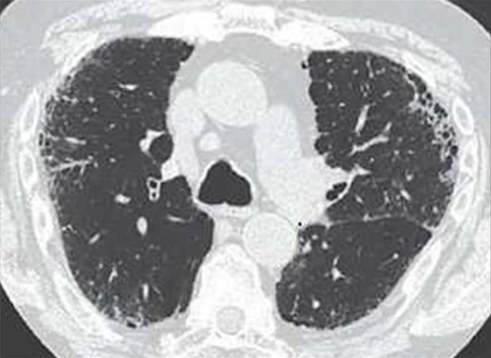

Interstitial lung disease

#### <u>Pulmonary function tests</u> (<u>PFTs</u>) [[1]](https://coursology-qbank.com/amboss/article/QYduKo0)[[2]](https://coursology-qbank.com/amboss/article/RYdlKo0)

<u>PFTs</u> typically show a nonspecific <u>restrictive lung disease</u> pattern; results are used to determine disease severity.

* Early stages: ↓ <u>DLCO</u>

* Later stages: signs of <u>restrictive lung disease</u>

* ↓ <u>Lung compliance</u>

* ↓ TLC and ↓ <u>VC</u>

* Normal or ↓ <u>FEV1/FVC</u>

> [!TIP]
> <u>PFTs</u> typically show a <u>restrictive lung disease</u> pattern but cannot be used to distinguish between different types of <u>interstitial lung disease</u>.

#### Invasive testing [[2]](https://coursology-qbank.com/amboss/article/RYdlKo0)[[4]](https://coursology-qbank.com/amboss/article/abdQHo0)

Invasive testing is not routinely required for diagnosis but may be useful to exclude infections and malignancies.

* <u>Bronchoalveolar lavage</u>

* Microscopic asbestos bodies (a type of <u>ferruginous body</u>) 

* Dumbbell-shaped, golden-brown fusiform rods surrounded by an <u>iron</u> protein coat   [[3]](https://coursology-qbank.com/amboss/article/8CbOFD)

* Stain positive with <u>Prussian blue</u> [[6]](https://coursology-qbank.com/amboss/article/nWd7NK0)

* Occasionally also found in alveolar <u>sputum</u> samples [[6]](https://coursology-qbank.com/amboss/article/nWd7NK0)

* <u>Asbestos</u> fiber count

* <u>Biopsy</u>

* Microscopic <u>asbestos bodies</u>

* <u>Fibrosis</u>

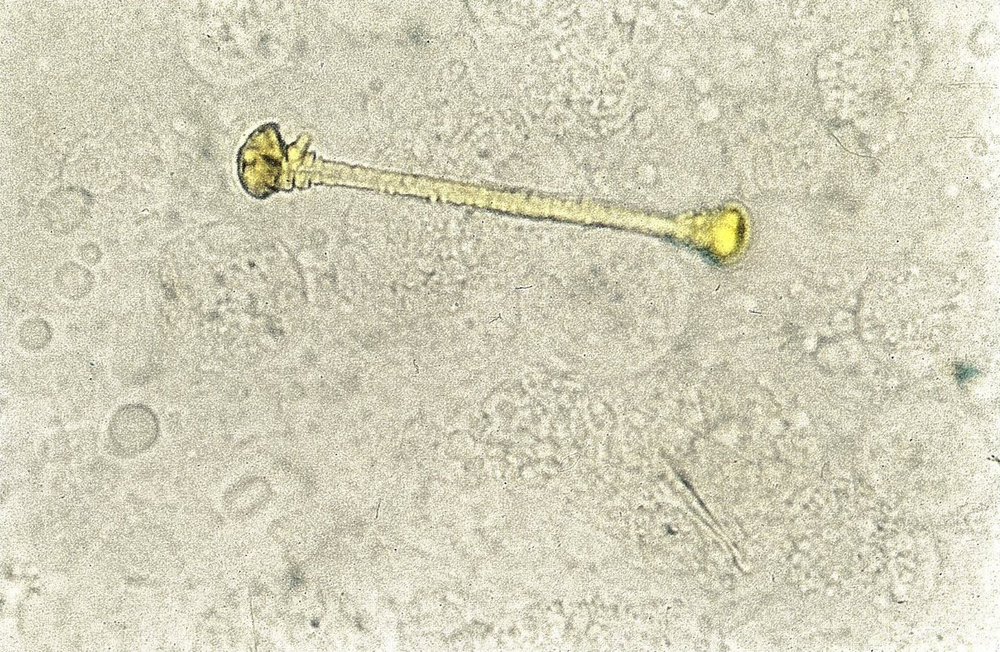

Asbestosis

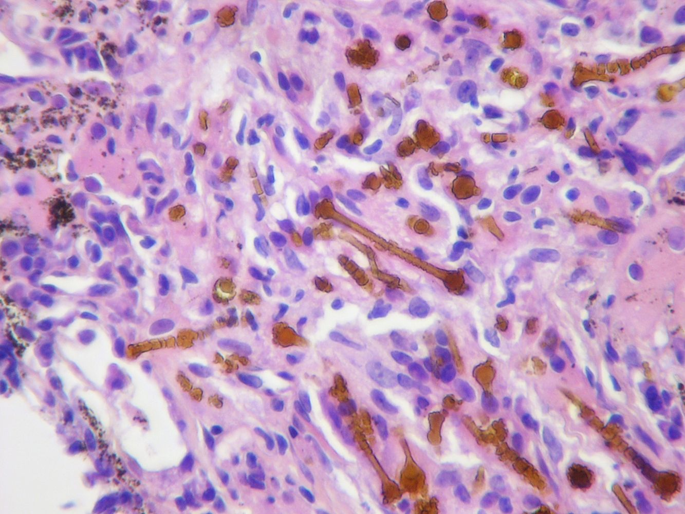

Asbestosis

Pulmonary asbestosis

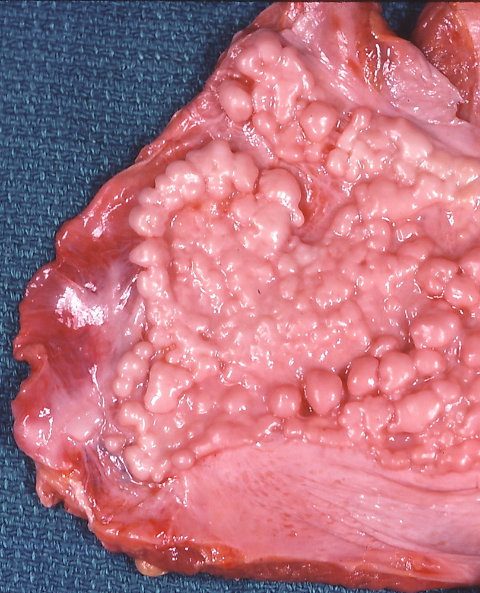

Asbestosis

### Differential diagnoses

* Other <u>causes of interstitial lung disease</u>, e.g., <u>idiopathic pulmonary fibrosis</u>, other <u>pneumoconioses</u>

* <u>Combined pulmonary fibrosis and emphysema</u>

* <u>Interstitial pneumonitis</u>

* <u>Lung cancer</u>

* Other <u>asbestos</u>-related diseases, e.g., <u>mesothelioma</u>

> [!TIP]
> <u>Asbestosis</u> clinically resembles <u>idiopathic pulmonary fibrosis</u> but progression is much slower. [[1]](https://coursology-qbank.com/amboss/article/QYduKo0)

### Management [[2]](https://coursology-qbank.com/amboss/article/RYdlKo0)

There is no specific treatment for <u>asbestosis</u>. Management focuses on prevention of complications and symptomatic treatment.

#### Supportive management

* <u>Smoking cessation</u>

* Cessation of <u>asbestos</u> exposure

* <u>Immunization</u> against <u>influenza</u> and <u>pneumococcal</u> <u>pneumonia</u>

* Antimicrobial treatment for respiratory infections

* <u>Pulmonary rehabilitation</u>

* <u>Oxygen therapy</u> as needed

* <u>Palliative care</u> for advanced disease

#### <u>Surgery</u>

Consider in selected advanced cases.

* <u>Decortication</u> or pleurectomy for extensive <u>fibrosis</u>

* <u>Lung transplantation</u> in end-stage disease

### Complications

* <u>Pulmonary hypertension</u> [[4]](https://coursology-qbank.com/amboss/article/abdQHo0)

* <u>Cor pulmonale</u> [[4]](https://coursology-qbank.com/amboss/article/abdQHo0)

* <u>Right-sided heart failure</u>

* Progressive <u>respiratory failure</u>

* <u>Caplan syndrome</u>

---

## Mesothelioma

<u>Mesothelioma</u> is a type of cancer that develops in <u>mesothelial</u> cells. <u>Pleural mesothelioma</u> is the most common type; <u>peritoneal</u> <u>mesothelioma</u> and <u>pericardial</u> <u>mesothelioma</u> are rare.

### <u>Epidemiology</u> [[7]](https://coursology-qbank.com/amboss/article/L-WwBL0)[[8]](https://coursology-qbank.com/amboss/article/o-W0yL0)

* <u>Incidence</u>: rare (∼ 3000 registered cases/year in the US) [[7]](https://coursology-qbank.com/amboss/article/L-WwBL0)

* <u>♂</u> > <u>♀</u>

* Most commonly occurs in adults > 50 years of age [[8]](https://coursology-qbank.com/amboss/article/o-W0yL0)

### Etiology [[7]](https://coursology-qbank.com/amboss/article/L-WwBL0)[[9]](https://coursology-qbank.com/amboss/article/E-W8_L0)

* <u>Asbestos</u> exposure (most important <u>risk factor</u>)

* Exposure to other <u>carcinogenic</u> fibers, e.g., erionite [[7]](https://coursology-qbank.com/amboss/article/L-WwBL0)

* Genetic mutations, e.g., BAP1 mutation [[7]](https://coursology-qbank.com/amboss/article/L-WwBL0)

* Radiation

> [!TIP]
> Smoking has not been shown to increase the <u>incidence</u> of <u>mesothelioma</u>.

### Clinical features [[7]](https://coursology-qbank.com/amboss/article/L-WwBL0)[[9]](https://coursology-qbank.com/amboss/article/E-W8_L0)

* Long <u>latent period</u> (∼ 30–50 years after exposure) [[7]](https://coursology-qbank.com/amboss/article/L-WwBL0)

* <u>Constitutional symptoms</u>, e.g., fatigue, weight loss, <u>fever</u>, night sweats

* <u>Features of pleural effusion</u> (in <u>pleural mesothelioma</u>), e.g.:

* <u>Dyspnea</u> and nonpleuritic <u>chest pain</u> (most common)

* Dull percussion and absent or reduced breath sounds on the affected side

* Nonproductive <u>cough</u>

* <u>Clinical features of ascites</u> (in <u>peritoneal</u> <u>mesothelioma</u> or <u>metastasized</u> <u>pleural mesothelioma</u>)

* Signs of <u>paraneoplastic syndromes</u>

### Diagnostics [[7]](https://coursology-qbank.com/amboss/article/L-WwBL0)[[9]](https://coursology-qbank.com/amboss/article/E-W8_L0)[[10]](https://coursology-qbank.com/amboss/article/XYd9no0)

Suspect <u>pleural mesothelioma</u> in patients with a history of <u>asbestos</u> exposure and typical symptoms and/or imaging findings (e.g., pleural thickening, <u>pleural effusion</u>).

#### Initial imaging

* Modalities

* <u>Chest x-ray</u>: often routinely obtained first

* <u>Contrast-enhanced CT</u>: most sensitive imaging modality for diagnosis

* Findings in <u>pleural mesothelioma</u>

* Multiple nodular pleural lesions (pleural thickening)

* <u>Pleural effusion</u>

* Thickening of interlobar fissures

* Pleural opacities (calcifications or <u>plaques</u>)

* Signs of local <u>tumor</u> growth, e.g., reduced size of <u>ipsilateral</u> <u>lung</u> fields, <u>mediastinal</u> shift

* Signs of local invasiveness, e.g., obliteration of fat planes

Left-sided pleural effusion in malignant mesothelioma (1/2)

Left-sided pleural effusion in malignant mesothelioma (2/2)

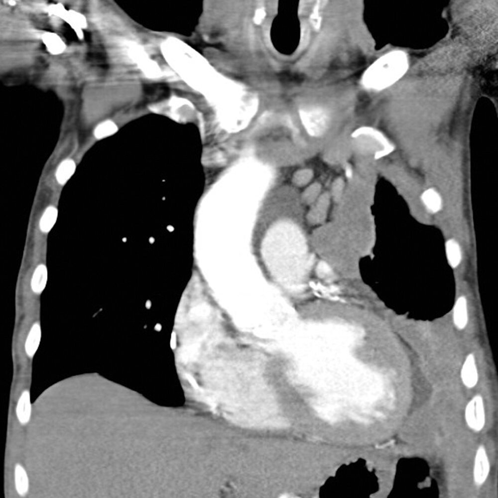

Diffuse nodular pleural thickening

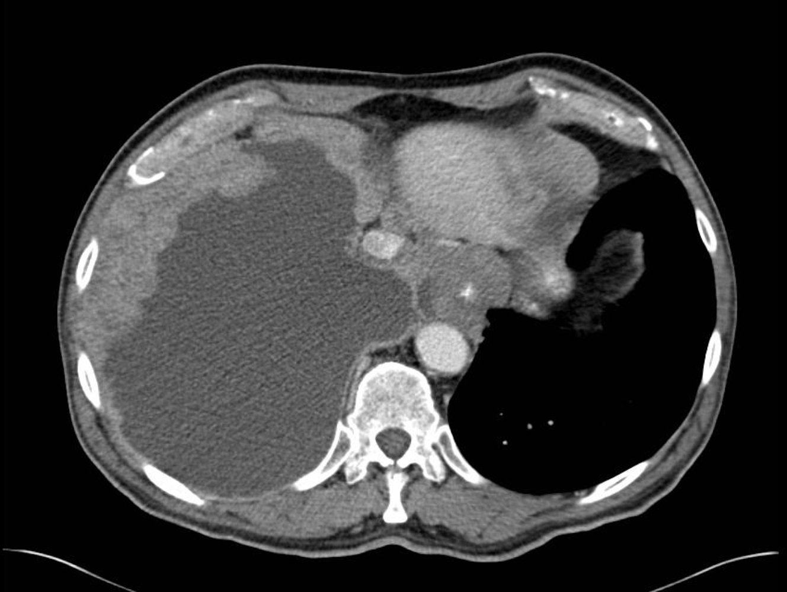

Mesothelioma

#### <u>Pleurocentesis</u> and <u>pleural fluid analysis</u>

* Indicated for all patients with <u>pleural effusion</u> and suspected <u>mesothelioma</u> [[10]](https://coursology-qbank.com/amboss/article/XYd9no0)

* Cytological examination findings: usually bloody <u>exudate</u>, may show malignant <u>mesothelial</u> cells (<u>mesothelioma</u> cells)  [[11]](https://coursology-qbank.com/amboss/article/VZdG0o0)

* <u>Sensitivity</u> varies widely and local invasion cannot be assessed: Confirm results with a <u>biopsy</u>.

#### <u>Biopsy</u>

* Uses

* Histopathological confirmation and differentiating <u>mesothelioma</u> from <u>adenocarcinoma</u>

* Confirmation of <u>mesothelioma</u> subtype: epithelioid, sarcomatoid, or mixed

* Modality: usually thoracoscopic <u>biopsy</u> (or <u>laparoscopic</u> <u>biopsy</u>:  in suspected <u>peritoneal</u> <u>mesothelioma</u>)   [[10]](https://coursology-qbank.com/amboss/article/XYd9no0)

* Findings  

* <u>Mesothelioma</u> cells (<u>tumor</u> cells with long and slender <u>microvilli</u>, tonofilaments, and <u>desmosomes</u> on <u>electron microscopy</u>) [[12]](https://coursology-qbank.com/amboss/article/TZd6ao0)

* <u>Psammoma bodies</u> (rare, not specific for <u>mesothelioma</u>) [[12]](https://coursology-qbank.com/amboss/article/TZd6ao0)

* <u>Immunohistochemical markers</u>: calretinin, <u>cytokeratin</u> 5 and 6, <u>thrombomodulin</u>, and <u>mesothelin</u> [[9]](https://coursology-qbank.com/amboss/article/E-W8_L0)

> [!TIP]
> <u>Histopathology</u> is required to confirm the diagnosis of <u>mesothelioma</u>.

> [!NOTE]
> In contrast to <u>mesothelioma</u> cells, the <u>tumor</u> cells of <u>adenocarcinomas</u> have short and stubby <u>microvilli</u> and are usually negative for <u>cytokeratin</u> 5 and 6. [[12]](https://coursology-qbank.com/amboss/article/TZd6ao0)

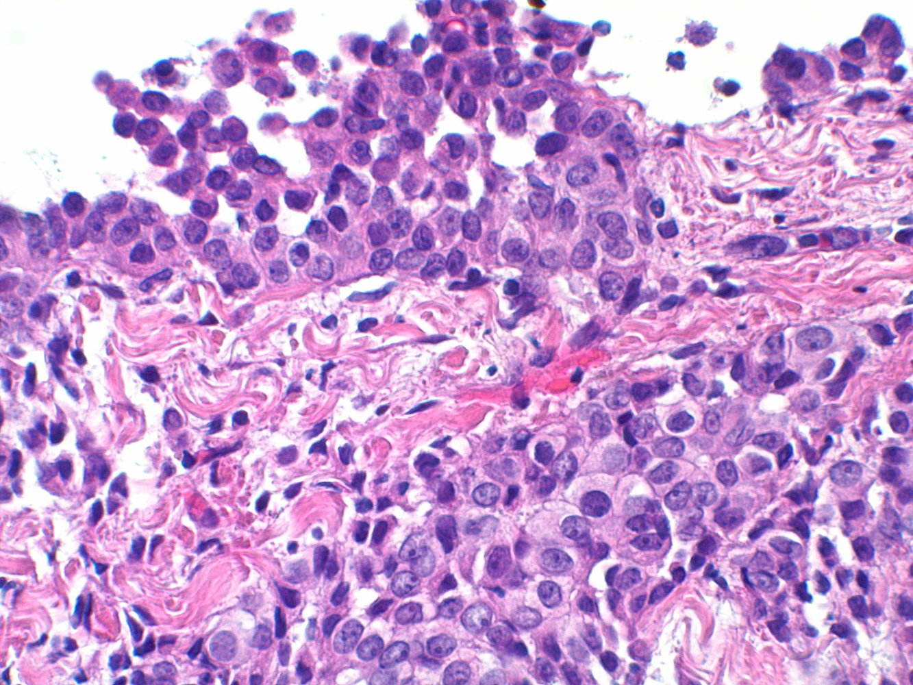

Epithelioid mesothelioma

#### Staging [[10]](https://coursology-qbank.com/amboss/article/XYd9no0)[[13]](https://coursology-qbank.com/amboss/article/w-WhzL0)

* Initial studies

* CT chest and upper abdomen with contrast

* <u>PET-CT</u>

* Further assessment

* <u>MRI</u> with contrast may be considered to assess <u>tumor</u> invasion.

* Other studies may be indicated based on clinical features and/or imaging findings, e.g., <u>mediastinoscopy</u> to evaluate <u>mediastinal lymph nodes</u>.

### Treatment [[7]](https://coursology-qbank.com/amboss/article/L-WwBL0)[[10]](https://coursology-qbank.com/amboss/article/XYd9no0)

Refer all patients to a specialist (e.g., oncology, pulmonology) and/or experienced centers of excellence.

* Systemic <u>chemotherapy</u>

* Primary treatment for most patients as it improves quality of life and survival

* May be used alone or as part of a multimodal approach (adjuvant or <u>neoadjuvant</u>)

* Agents

* First line: <u>pemetrexed</u> PLUS either <u>cisplatin</u> OR <u>carboplatin</u>

* Adjunctive <u>bevacizumab</u> may be offered to selected patients.

* Maximal <u>surgical cytoreduction</u>  

* May be considered for selected patients with localized disease as part of a multimodal approach

* Modalities include pleurectomy with <u>decortication</u> (preferred, as it is <u>lung</u>-sparing) and <u>pneumonectomy</u>. [[10]](https://coursology-qbank.com/amboss/article/XYd9no0)

* <u>Adjuvant radiation therapy</u>: may be considered for selected patients as part of a multimodal approach

* <u>Palliative care</u>

* Palliative intervention: e.g., <u>pleurodesis</u> or pleural catheter for recurrent effusions

* Palliative radiation: e.g., in patients with <u>pain</u> or symptomatic obstruction

> [!TIP]
> Systemic <u>chemotherapy</u> is the primary treatment for most patients with <u>mesothelioma</u>.

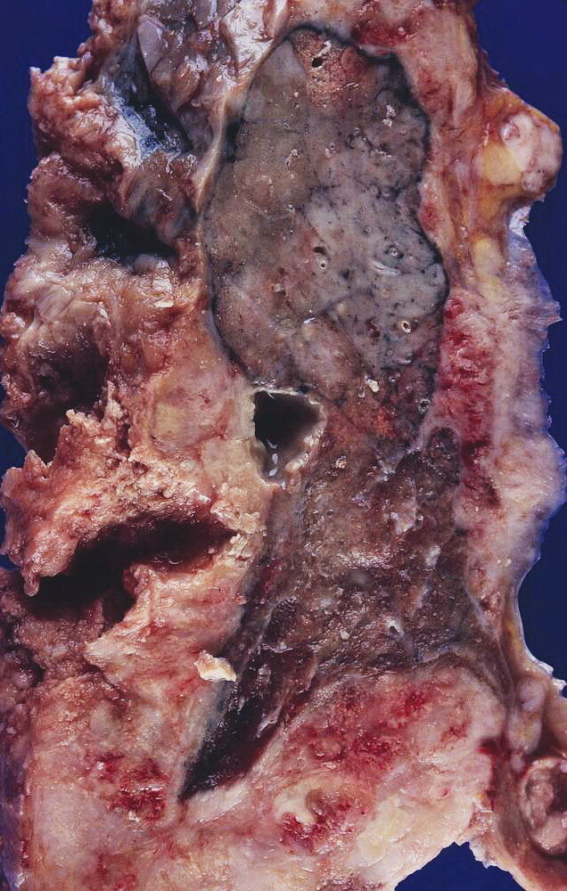

Mesothelioma

### Prognosis [[7]](https://coursology-qbank.com/amboss/article/L-WwBL0)

* Poor (median survival in unresectable <u>mesothelioma</u> is ∼ 1 year)

* ∼ 50% of mesotheliomas <u>metastasize</u>.

* Common <u>causes of death</u> include <u>pulmonary emboli</u>, <u>bronchopneumonia</u>, <u>cardiac tamponade</u>, invasion of great vessels, and <u>cachexia</u>.

---

## Other asbestos-related diseases

### Nonmalignant [[1]](https://coursology-qbank.com/amboss/article/QYduKo0)[[2]](https://coursology-qbank.com/amboss/article/RYdlKo0)

* Circumscribed pleural plaques

* Composed of <u>collagen fibers</u> in the <u>parietal pleura</u>

* Characteristic markers of <u>asbestos</u> exposure

* Typically asymptomatic

* Calcified (ivory white) or noncalcified opacities on chest imaging

* <u>Benign asbestos-related pleural effusion</u> (<u>BAPE</u>)

* <u>Exudative</u> effusion, often unilateral

* Early manifestation of <u>asbestos</u> exposure (<u>latency period</u> of 10–20 years)

* Asymptomatic or nonspecific symptoms, e.g., <u>dyspnea</u>, <u>pleuritic chest pain</u>, <u>fever</u>

* <u>Rounded atelectasis</u> may be seen on chest imaging.

* Diagnosis of exclusion: <u>Biopsy</u> is needed to rule out <u>malignancy</u> and <u>tuberculosis</u>.

* Management: <u>pleural tap</u>

* <u>Diffuse pleural thickening</u>

* Abnormal thickening of the <u>visceral</u> and <u>parietal pleura</u>

* Often a consequence of <u>BAPE</u>

* Asymptomatic or nonspecific symptoms, e.g., <u>chest pain</u>

* Obliteration of <u>costophrenic angles</u> may be seen on chest imaging.

> [!TIP]
> <u>HRCT</u> has higher <u>sensitivity</u> for detecting pleural abnormalities than <u>chest x-ray</u>.

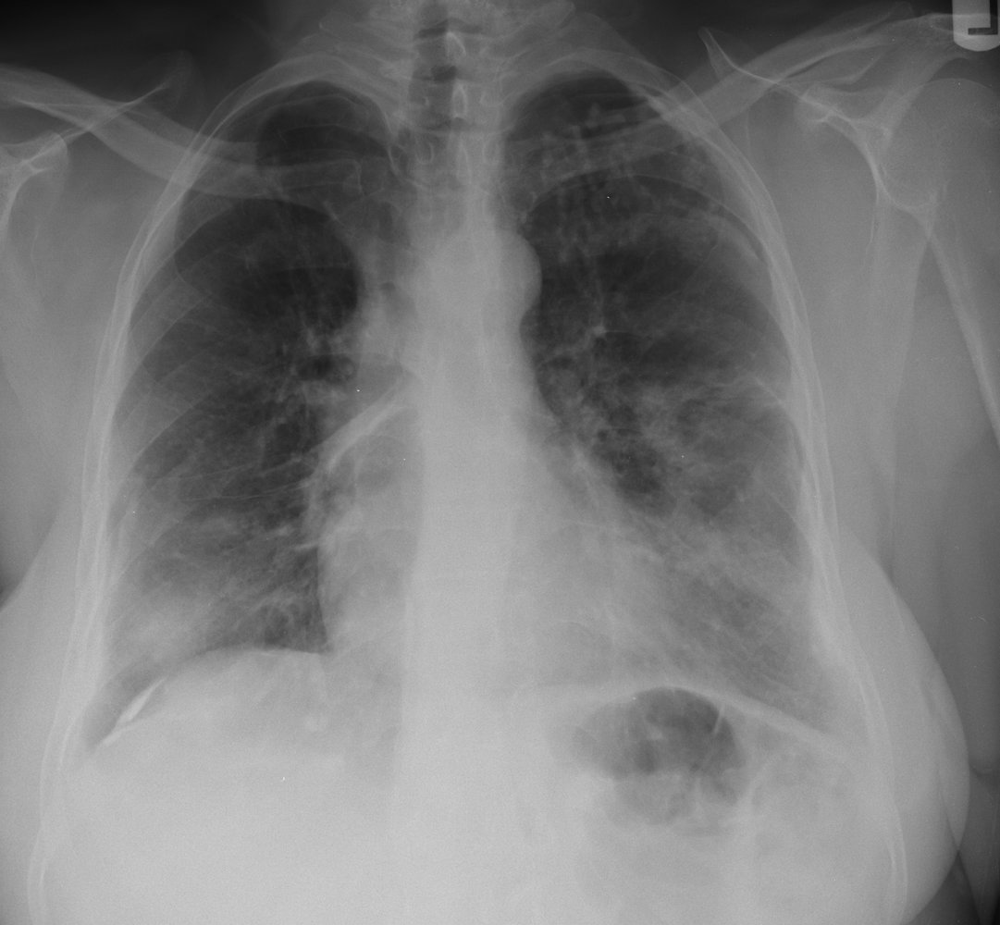

Asbestos-related pleural disease

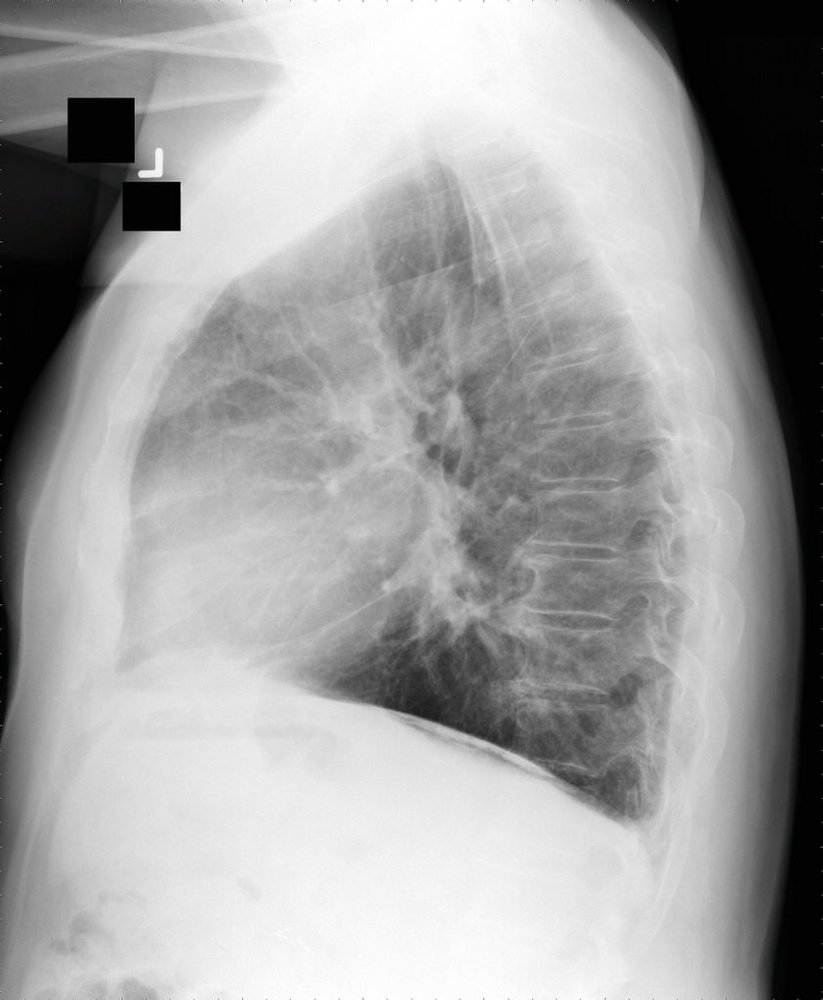

Asbestos-related pleural disease

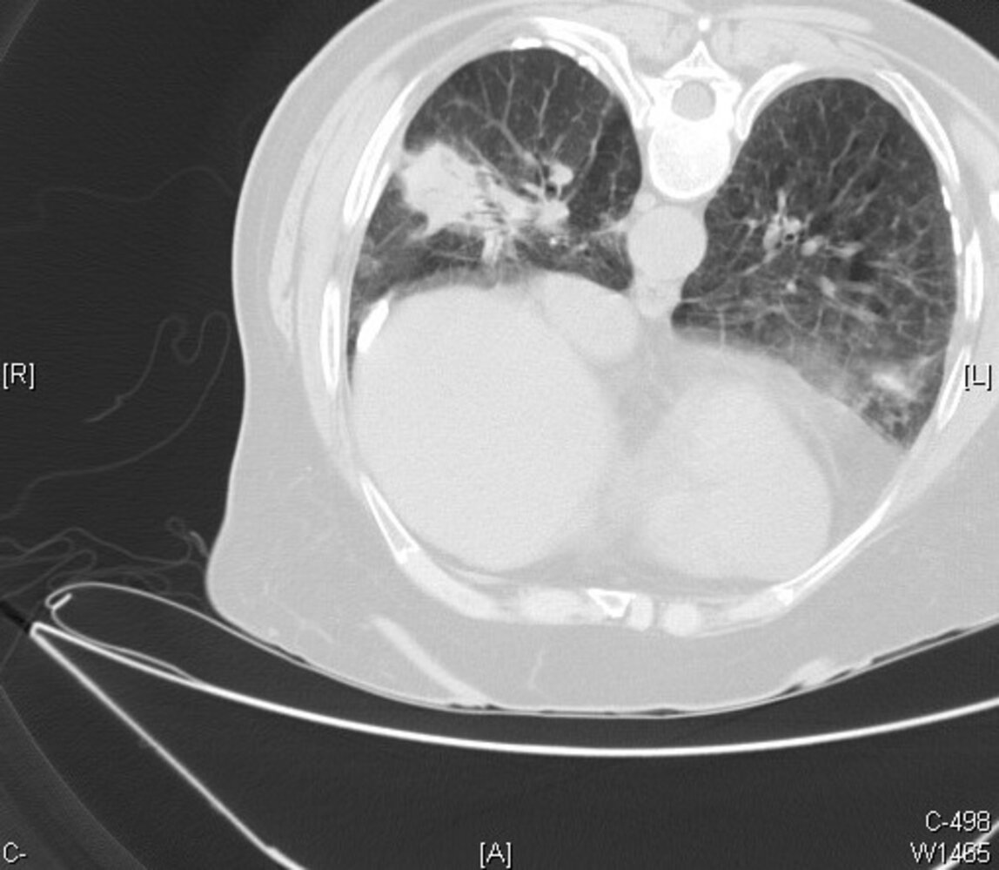

Asbestos-related pleural disease

### Malignant [[5]](https://coursology-qbank.com/amboss/article/t0dX3o0)

* <u>Lung cancer</u>

* Most common malignant complication of <u>asbestos</u> exposure

* Smoking has a synergistic effect with <u>asbestos</u> that further increases the risk of <u>lung cancer</u>.

* <u>Laryngeal cancer</u>

* <u>Ovarian cancer</u>

> [!TIP]
> The most common <u>malignancy</u> associated with <u>asbestos</u> exposure is <u>lung cancer</u>, not <u>mesothelioma</u>.

---