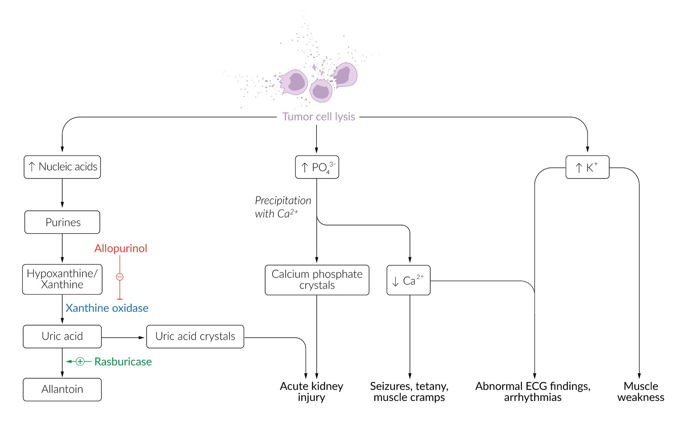
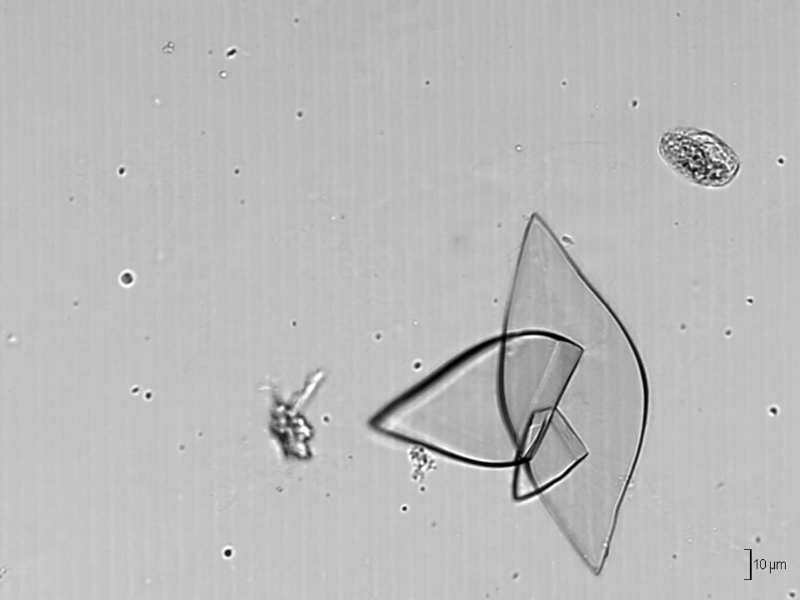
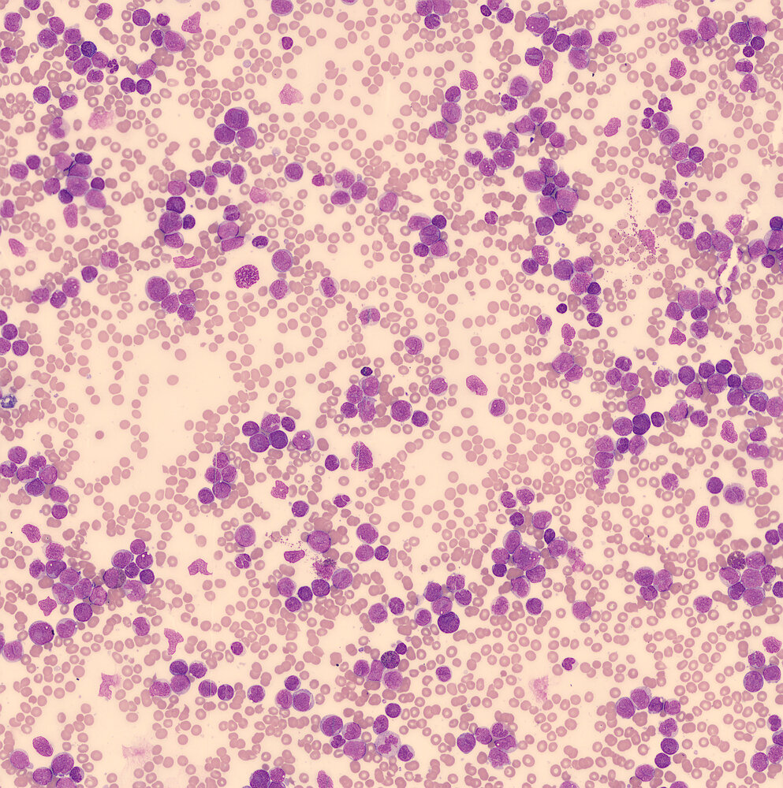
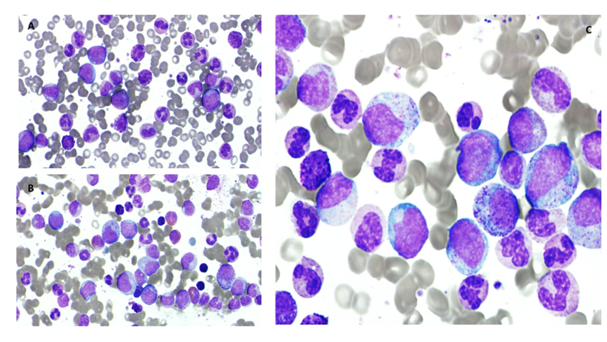
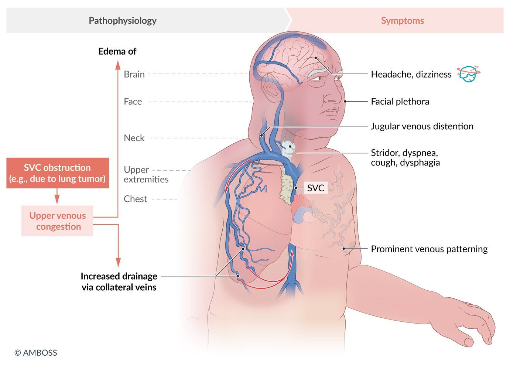
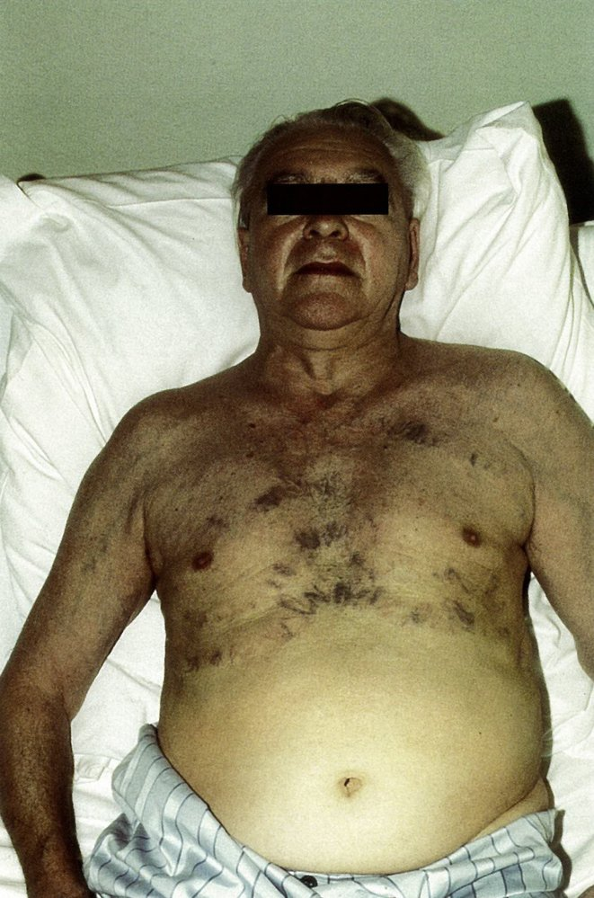
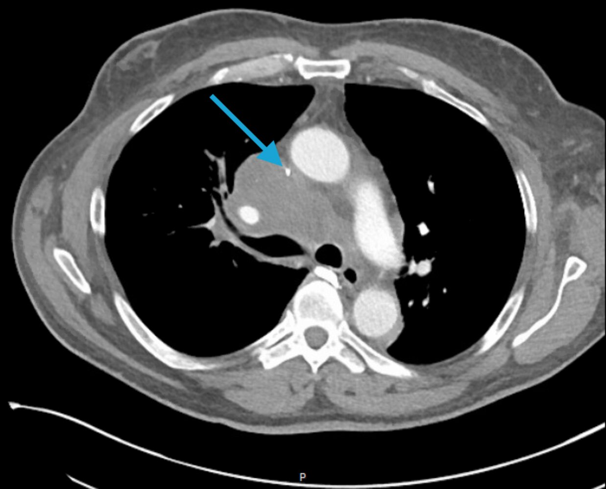

# Oncologic emergencies

*Categories: Clinical knowledge > Internal medicine > Pulmonology > Neoplastic lung diseases > Oncologic emergencies*

[Original Article Link](https://coursology-qbank.com/amboss/article/uJ0pDS)

---

## Summary

Oncologic emergencies are a group of potentially life-threatening conditions that can manifest as a result of malignant disease and/or their treatment. These conditions include, but are not limited to, <u>leukostasis</u>, <u>tumor lysis syndrome</u> (<u>TLS</u>), <u>superior vena cava</u> (<u>SVC</u>) syndrome, malignant <u>hypercalcemia</u>, and <u>neutropenic fever</u>. Symptomatic patients must be rapidly assessed with early specialist intervention. Therapeutic goals in the treatment of the underlying oncologic condition (e.g., <u>palliative care</u>) should always be taken into account during management. <u>TLS</u> results from rapid destruction of <u>tumor</u> cells releasing intracellular components into the bloodstream that can damage the <u>kidneys</u> and cause potentially fatal <u>electrolyte</u> imbalances. <u>Management of TLS</u> consists of hydration, correction of <u>electrolyte</u> disturbances and reduction of serum <u>uric acid</u> to preserve <u>kidney function</u>. <u>Leukostasis</u> results from massive amounts of <u>leukocytes</u> that cause <u>microcirculatory</u> obstruction leading to organ <u>ischemia</u> and failure. Management of <u>leukostasis</u> consists of <u>cytoreduction</u>, hydration, and prophylaxis against <u>TLS</u>. <u>SVC syndrome</u> results from impaired blood flow from the <u>SVC</u> into the <u>heart</u>, which leads to venous congestion in the head and upper extremities. Management of <u>SVC syndrome</u> depends on the underlying etiology and is aimed at reducing symptoms (e.g., fluid restriction), treating complications (e.g., <u>cerebral edema</u>), and restoring blood flow pharmacologically, radiologically, or mechanically.

This article covers <u>tumor lysis syndrome</u>, <u>leukostasis</u>, and <u>superior vena cava syndrome</u>. <u>Neutropenic fever</u> and <u>hypercalcemia</u> are discussed in separate articles.

---

## Tumor lysis syndrome

### Definition [[1]](https://coursology-qbank.com/amboss/article/wSbhbt)[[2]](https://coursology-qbank.com/amboss/article/9SbNbt)

A potentially life-threatening oncologic emergency;  resulting from the rapid destruction of <u>tumor</u> cells, which leads to a massive release of intracellular components; , e.g., <u>potassium</u> (<u>K+</u>), <u>phosphate</u> (<u>PO43-</u>), and <u>uric acid</u>, that can damage the <u>kidneys</u> and cause <u>renal failure</u>.

### Etiology [[1]](https://coursology-qbank.com/amboss/article/wSbhbt)[[2]](https://coursology-qbank.com/amboss/article/9SbNbt)

* <u>TLS</u> most commonly occurs after initiating cytotoxic treatment in patients with hematologic malignancies (e.g., <u>ALL</u>, <u>AML</u>, or <u>NHL</u>).

* Can also manifest unrelated to therapy in patients with a very high <u>tumor</u> burden

### Pathophysiology

* <u>Tumor</u> cell lysis → release of intracellular components (e.g., <u>K+</u>, <u>PO43-</u>, <u>nucleic acids</u>) into the bloodstream

* ↑ <u>Nucleic acid</u> → conversion to <u>uric acid</u> → <u>hyperuricemia</u>  → <u>urate nephropathy</u> and risk of <u>acute kidney injury</u>

* ↓ <u>Ca2+</u> secondary to <u>PO43-</u> binding → <u>hypocalcemia</u> → neuronal excitability → risk of <u>seizures</u>

* <u>Hyperphosphatemia</u>: <u>PO43-</u> binds <u>Ca2+</u> and forms <u>calcium</u> <u>phosphate</u> crystals that obstruct renal tubules → <u>acute kidney injury</u>

* <u>Hyperkalemia</u>: changes in resting membrane potential → risk of <u>cardiac arrhythmias</u>

> [!NOTE]
> Think of “PUKE <u>calcium</u>” to remember the <u>electrolytes</u> affected in <u>tumor lysis syndrome</u>: Phosphorus, Uric acid, and <u>potassium</u> (K+) are Elevated; <u>Calcium</u> is decreased.

Tumor lysis syndrome

Uric acid crystals

### Clinical features [[3]](https://coursology-qbank.com/amboss/article/chba1t)

Signs and symptoms are closely related to the degree of <u>electrolyte</u> abnormalities and <u>acute kidney injury</u>.

* <u>Renal failure</u>: e.g., <u>edema</u>, <u>lethargy</u>, <u>oliguria</u>

* <u>Hyperkalemia</u>: : e.g., <u>cardiac arrhythmias</u>; , <u>nausea</u>, <u>vomiting</u>, and <u>diarrhea</u>

* <u>Hypocalcemia</u>: : e.g., <u>tetany</u>, muscle cramps, <u>seizures</u>

> [!WARNING]
> <u>Electrolyte</u> abnormalities in <u>TLS</u> can lead to <u>seizures</u>, <u>cardiac arrhythmias</u>, and <u>sudden cardiac death</u>. [[1]](https://coursology-qbank.com/amboss/article/wSbhbt)

### Diagnostics [[1]](https://coursology-qbank.com/amboss/article/wSbhbt)

Consider <u>TLS</u> in any patient with hematological malignancies and <u>hyperleukocytosis</u> who have <u>electrolyte</u> imbalances, <u>kidney failure</u>, or recently initiated cytotoxic therapy.

* Routine tests

* <u>BMP</u>

* ↑ <u>Creatinine</u>: may indicate <u>AKI</u>

* ↑ <u>K+</u>

* ↓ <u>Ca2+</u>

* <u>CBC</u>

* <u>WBC count</u>: often 50,000–100,000 /mm³

* Possibly ↓ <u>hemoglobin</u> and ↓ <u>platelets</u>

* <u>Urinalysis</u>  : presence of <u>uric acid crystals</u>

* <u>ECG</u>: to detect <u>cardiac arrhythmias</u> due to <u>electrolyte</u> abnormalities (see “Diagnostics” in “<u>Hyperkalemia</u>” and “<u>Hypocalcemia</u>”)

* Other important markers of cell lysis

* ↑ <u>LDH</u>

* ↑ <u>PO43-</u>

* ↑ <u>Uric acid</u>

Uric acid crystals

#### Diagnostic criteria

Although there is no universally established classification of <u>TLS</u>, the Cairo-Bishop definition is widely used to help confirm the diagnosis and guide management. [[2]](https://coursology-qbank.com/amboss/article/9SbNbt)[[4]](https://coursology-qbank.com/amboss/article/A4bRNF)

|  Cairo-Bishop definition of tumor lysis syndrome [[3]](https://coursology-qbank.com/amboss/article/chba1t)  |  |
| --- | --- |
| Laboratory <u>TLS</u> | Clinical <u>TLS</u> |
|  * Presence of ≥ 2 of the following around the period of treatment initiation (including 3 days prior and 7 days after):  * <u>K+</u>  > 6.0 mEq/L or 25% increase from baseline  * <u>PO43-</u> > 4.5 mg/dL (> 1.45 mmol/L) or 25% increase from baseline  * <u>Uric acid</u> 8 mg/dL (0.48 mmol/L) or 25% increase from baseline  * <u>Corrected calcium</u> < 7.0 mg/dL (< 1.75 mmol/L) or ionized <u>Ca2+</u> < 4.5 mg/dL (< 1.12 mmol/L) or 25% decrease from baseline   |  * Presence of laboratory <u>TLS</u> plus ≥ 1 of the following:  * <u>Creatinine</u> levels ≥ 1.5 × the <u>upper reference range</u>  * <u>Seizures</u>  * <u>Cardiac arrhythmias</u>   |

### Management of TLS [[1]](https://coursology-qbank.com/amboss/article/wSbhbt)[[2]](https://coursology-qbank.com/amboss/article/9SbNbt)[[4]](https://coursology-qbank.com/amboss/article/A4bRNF)[[5]](https://coursology-qbank.com/amboss/article/aRbQlt)

* Identify patients with established <u>TLS</u> and those at high risk (e.g., hematological <u>malignancy</u>, <u>chemotherapy</u>)  [[6]](https://coursology-qbank.com/amboss/article/nhb7et)

* Start intensive <u>fluid therapy</u>, <u>uric acid</u> reduction, and <u>correction of electrolyte imbalances</u>.

* Consider notifying <u>ICU</u>, nephrology, and oncology early on.

> [!TIP]
> <u>Renal replacement therapy</u> is indicated if the following complications are intractable: <u>fluid overload</u>, <u>electrolyte</u> imbalances, or <u>hyperuricemia</u>.

#### Fluid management

Hydration is the mainstay of <u>TLS</u> prophylaxis and treatment.

* Low-risk patients: oral hydration, <u>monitor fluid balance</u>, consider IV hydration

* Intermediate and high-risk patients, or established <u>TLS</u>: aggressive IV hydration (see “<u>IV fluid therapy</u>”)

* Hyperhydration with <u>isotonic crystalloids</u> (e.g., <u>0.9% NaCl</u> DOSAGE)  [[7]](https://coursology-qbank.com/amboss/article/KhbUUt)

* Close monitoring for <u>fluid overload</u> 

* Target urine output: ≥ 2 mL/kg/hour

* To maintain adequate urine output, consider administering <u>loop diuretics</u> (e.g., <u>furosemide</u> DOSAGE) once the patient is hydrated.

> [!TIP]
> Hydration is the most effective preventive measure.

> [!WARNING]
> Avoid <u>nephrotoxic drugs</u> (e.g., <u>NSAIDs</u>) and fluids with added <u>potassium</u> due to the risk of <u>hyperkalemia</u>.

#### <u>Electrolyte</u> imbalances

Monitor <u>electrolytes</u> regularly, as they can also be affected by <u>fluid therapy</u>.

* <u>Hyperkalemia</u>: <u>cardiac monitoring</u> and standard therapy for <u>hyperkalemia</u> if <u>K+</u> ≥ 6 mEq/L, e.g., <u>glucose</u> and <u>insulin</u> (rapid action)

* <u>Hyperphosphatemia</u>: hydration and possibly <u>oral phosphate binders</u>, e.g., <u>sevelamer</u> DOSAGE

* <u>Hypocalcemia</u>: Treat only if symptomatic, and give the lowest <u>calcium</u> dose to relieve symptoms (see “<u>Hypocalcemia</u>”).

#### <u>Hyperuricemia</u>

* <u>Allopurinol</u> DOSAGE 

* Indicated as prophylaxis in patients at low to intermediate risk

* No additional benefit to combining with <u>rasburicase</u>

* Rasburicase: recombinant uricase that catalyzes the breakdown of <u>uric acid</u> to allantoin 

* Indications and dosing

* Treatment of established <u>TLS</u>: <u>rasburicase</u> infusion DOSAGE .

* Prophylaxis for intermediate to high-risk patients: <u>rasburicase</u> infusion DOSAGE OR single fixed-dose <u>rasburicase</u> DOSAGE

* Contraindications: <u>G6PD deficiency</u>, which can precipitate <u>hemolytic anemia</u>

* <u>Urinary alkalinization</u>: no longer routinely recommended

> [!TIP]
> <u>Rasburicase</u> is indicated for patients with established <u>TLS</u> or those at intermediate to high risk for <u>TLS</u>.

### Acute management checklist for established <u>TLS</u>

* <u>Continuous cardiac monitoring</u>

* Consult <u>ICU</u> and oncology.

* Start vigorous hydration with IV <u>isotonic crystalloids</u>.

* Treat <u>electrolyte</u> imbalances: <u>hyperkalemia</u>, <u>hyperphosphatemia</u>, <u>hypocalcemia</u>.

* Give <u>rasburicase</u> unless contraindicated.

* Stop <u>nephrotoxic medications</u> (e.g., <u>NSAIDs</u>).

* Order frequent <u>electrolytes</u>, <u>kidney function</u>, and markers of cell lysis.

* Monitor urine output every hour and <u>fluid balance</u> frequently.

* Nephrology consult for <u>hemodialysis</u> if there is intractable <u>hyperkalemia</u>, <u>hyperuricemia</u>, or <u>fluid overload</u>.

---

## Leukostasis

### Definitions [[8]](https://coursology-qbank.com/amboss/article/fRbkmt)

* <u>Leukostasis</u>: a <u>medical emergency</u> characterized by tissue <u>hypoxia</u> and <u>hypercoagulability</u> due to an excessive number of immature <u>leukocytes</u> causing <u>microvascular</u> obstruction

* Hyperleukocytosis: a <u>leukocyte count</u> > 100,000/mm³ that may or may not be accompanied by <u>leukostasis</u> [[8]](https://coursology-qbank.com/amboss/article/fRbkmt)

### Etiology [[8]](https://coursology-qbank.com/amboss/article/fRbkmt)[[9]](https://coursology-qbank.com/amboss/article/y3bdOt)

* Most commonly occurs in <u>acute leukemia</u>: more common in <u>AML</u> than <u>ALL</u> ;  [[10]](https://coursology-qbank.com/amboss/article/8_bOJw)

* <u>AML</u>: with <u>WBC</u> > 150,000/mm³

* <u>ALL</u>: with <u>WBC</u>  > 400,000/mm³

* Rarely seen in chronic <u>leukemia</u>

* <u>CML</u>: almost exclusively in accelerated phases or <u>blast crisis</u>

* <u>CLL</u>: with extremely high <u>WBC</u> (> 1,000,000/mm³).

### Pathophysiology

* Very high number of <u>leukemic</u> blasts → increased viscosity of blood → increased risk of vascular obstruction → tissue <u>hypoxemia</u> and <u>infarction</u> → clinical features of <u>leukostasis</u>

* Contributing factors: <u>endothelial</u> activation and high metabolic activity of the dividing immature <u>leukocytes</u>  [[5]](https://coursology-qbank.com/amboss/article/aRbQlt)

### Clinical features [[5]](https://coursology-qbank.com/amboss/article/aRbQlt)[[9]](https://coursology-qbank.com/amboss/article/y3bdOt)

Clinical features depend on the affected system or organ. Although the <u>lungs</u> and the <u>CNS</u> are most commonly affected; , <u>leukostasis</u> can also cause <u>TLS</u> and <u>DIC</u> (a frequent complication of APL).

* Respiratory  [[9]](https://coursology-qbank.com/amboss/article/y3bdOt)

* <u>Dyspnea</u> and <u>tachypnea</u>

* Pulmonary <u>crackles</u>

* <u>Hypoxemic respiratory failure</u>

* Neurological

* <u>Headache</u>, confusion

* <u>Dizziness</u>, <u>vertigo</u>, <u>focal neurological deficits</u>

* <u>Seizures</u>

* Ophthalmological: blurry <u>vision</u>, <u>retinal hemorrhages</u>, <u>papilledema</u>

* Others

* <u>Fever</u> (common)

* <u>Acute kidney injury</u> symptoms

* <u>Deep venous thrombosis</u>, <u>myocardial infarction</u>, <u>priapism</u>

* Symptoms of concomitant <u>TLS</u> or <u>DIC</u>

### Diagnostics [[5]](https://coursology-qbank.com/amboss/article/aRbQlt)[[9]](https://coursology-qbank.com/amboss/article/y3bdOt)

* <u>Leukostasis</u> is primarily a <u>clinical diagnosis</u>.

* High index of suspicion in oncologic patients with clinical features suggestive of end-organ damage

* <u>Hyperleukocytosis</u> is commonly present but not mandatory for diagnosis.

#### <u>Laboratory studies</u> [[5]](https://coursology-qbank.com/amboss/article/aRbQlt)[[9]](https://coursology-qbank.com/amboss/article/y3bdOt)

Findings are nonspecific and vary widely depending on the organ system involved and the underlying condition.

* Routine tests

* <u>CBC</u> with <u>peripheral blood smear</u> (<u>PBS</u>) 

* ↑ <u>WBC count</u>, <u>hyperleukocytosis</u>

* <u>Anemia</u>

* Overestimated <u>platelet count</u>

* <u>BMP</u> 

* Signs of <u>renal failure</u> and <u>electrolyte</u> imbalances

* <u>Pseudohyperkalemia</u> may occur due to <u>WBC</u> <u>death</u> that occurs after sampling.

* <u>Coagulation studies</u>: <u>signs of DIC</u> (see “Diagnostics” in “<u>Disseminated intravascular coagulation</u>”)

* Additional tests

* <u>ABG</u> (in <u>dyspneic</u> patients)

* True <u>hypoxemia</u> as a sign of pulmonary involvement

* Spuriously decreased <u>PaO2</u> (pseudohypoxemia)  [[9]](https://coursology-qbank.com/amboss/article/y3bdOt)

* Diagnostic microbiology (e.g., <u>blood cultures</u>): in patients with suspected infection  [[9]](https://coursology-qbank.com/amboss/article/y3bdOt)

Hyperleukocytosis in acute myeloid leukemia (AML)

> [!TIP]
> <u>Hyperleukocytosis</u> can lead to falsely normal <u>platelet counts</u>, falsely reduced <u>PaO2</u>, and falsely elevated <u>potassium</u> levels.

#### Imaging and additional studies [[9]](https://coursology-qbank.com/amboss/article/y3bdOt)

Additional diagnostics should be guided by clinical symptoms and <u>pretest probability</u> and should not unnecessarily delay treatment.

* <u>Chest x-ray</u> (if pulmonary symptoms are present): Findings include pulmonary infiltrates, <u>pleural effusion</u>, or normal <u>CXR</u>

* CT head or <u>MRI</u> head (if neurological symptoms are present): Findings include <u>ischemia</u>, hemorrhage, masses

* <u>Direct fundoscopy</u>: Findings include <u>papilledema</u>, <u>retinal hemorrhages</u>, and dilation of the retinal <u>blood vessels</u>.  [[9]](https://coursology-qbank.com/amboss/article/y3bdOt)

* <u>Bone marrow</u> examination: required prior to initiating <u>induction chemotherapy</u> [[9]](https://coursology-qbank.com/amboss/article/y3bdOt)

* <u>Histopathology</u> : <u>Microvascular</u> occlusion by <u>leukocyte</u> plugs confirms the diagnosis. [[5]](https://coursology-qbank.com/amboss/article/aRbQlt)

Hyperleukocytosis in chronic myeloid leukemia

> [!TIP]
> <u>Leukostasis</u> is a <u>clinical diagnosis</u> in <u>leukemia</u> patients with a markedly elevated <u>WBC count</u> and signs of end-organ damage (particularly the <u>CNS</u> and the <u>lungs</u>). [[9]](https://coursology-qbank.com/amboss/article/y3bdOt)

> [!WARNING]
> <u>Leukostasis</u> is a <u>medical emergency</u>. Diagnostic studies should not delay treatment.

### Treatment [[9]](https://coursology-qbank.com/amboss/article/y3bdOt) [[8]](https://coursology-qbank.com/amboss/article/fRbkmt)

#### General principles

* Treatment aims to reduce the <u>WBC count</u> (<u>cytoreduction</u>) and control symptoms.

* <u>Induction chemotherapy</u> is the only treatment option that improves the survival rate.

* <u>Leukapheresis</u> and <u>hydroxyurea</u> are bridging therapies that provide rapid symptom control.

* Admit to <u>ICU</u> and involve specialists early.

#### <u>Cytoreduction</u>

Individualize cytoreductive treatment regimens and involve specialists early.

* <u>Induction chemotherapy</u>: treatment of choice for curative intent [[8]](https://coursology-qbank.com/amboss/article/fRbkmt)[[9]](https://coursology-qbank.com/amboss/article/y3bdOt)

* Regimen depends on the underlying condition.

* Provides sustained response on <u>WBC</u>

* Usually requires concurrent <u>TLS</u> prophylaxis

* <u>Leukapheresis</u>

* Indications

* Symptoms of <u>leukostasis</u> or a <u>WBC</u> ≥ 100,000/mm³ [[8]](https://coursology-qbank.com/amboss/article/fRbkmt)

* Severe pulmonary and neurological manifestations  [[9]](https://coursology-qbank.com/amboss/article/y3bdOt)

* Patients awaiting further diagnostic workup before <u>chemotherapy</u> [[8]](https://coursology-qbank.com/amboss/article/fRbkmt)[[9]](https://coursology-qbank.com/amboss/article/y3bdOt)

* <u>Acute promyelocytic leukemia</u> is usually considered a contraindication.  [[8]](https://coursology-qbank.com/amboss/article/fRbkmt)[[11]](https://coursology-qbank.com/amboss/article/ylbdzF)

* <u>Hydroxyurea</u> DOSAGE [[5]](https://coursology-qbank.com/amboss/article/aRbQlt)[[9]](https://coursology-qbank.com/amboss/article/y3bdOt)
* Indications

* Bridging to <u>induction chemotherapy</u> (e.g., while awaiting results of diagnostic studies)

* Contraindications for <u>induction chemotherapy</u>

#### Additional measures

* Intravenous <u>fluid resuscitation</u> with IV <u>isotonic crystalloids</u>

* <u>TLS</u> prophylaxis according to risk (see “<u>Tumor lysis syndrome</u>”) and monitoring for <u>DIC</u>

* Avoid blood cell <u>transfusions</u>, if possible.

* <u>Cranial</u> <u>radiotherapy</u>: not routinely recommended  [[5]](https://coursology-qbank.com/amboss/article/aRbQlt)

* <u>ICU</u> <u>level of care</u> with <u>continuous cardiac monitoring</u>

### Acute management checklist for <u>leukostasis</u>

* <u>ABCDE assessment</u>

* <u>Fluid resuscitation</u>

* Order routine <u>laboratory studies</u>, <u>PBS</u>, and <u>coagulation panel</u>.

* Consider differentials (e.g., infection) and order diagnostic studies as needed.

* Start <u>cytoreduction</u> therapy (in consultation with <u>hematology</u>, oncology).

* Discuss individual treatment goals, consider <u>ICU</u> admission.

* Frequent evaluation for signs of <u>TLS</u> and <u>DIC</u>

---

## Superior vena cava syndrome

### Definition [[12]](https://coursology-qbank.com/amboss/article/ETb8sG)

Venous congestion of the head, neck, and upper extremities resulting from impaired venous flow through the <u>superior vena cava</u> (<u>SVC</u>) to the <u>right atrium</u>.

Superior vena cava syndrome

### Etiology [[13]](https://coursology-qbank.com/amboss/article/fgbkuG)

Conditions that obstruct the <u>SVC</u> intraluminally (e.g., <u>neoplastic</u> invasion, <u>thrombosis</u>) or due to extraluminal compression (e.g., <u>Pancoast tumors</u>, <u>mediastinal masses</u>). The etiology of <u>SVC syndrome</u> is the basis for its classification.

* Malignant <u>SVC syndrome</u> (most common) [[12]](https://coursology-qbank.com/amboss/article/ETb8sG)[[14]](https://coursology-qbank.com/amboss/article/1gb28G)

* The following entities account for > 80% of all <u>SVC syndrome</u> cases:

* <u>Non-small cell lung cancer</u> (<u>NSCLC</u>)

* <u>Small cell lung cancer</u> (<u>SCLC</u>)

* <u>Non-Hodgkin lymphoma</u> (<u>NHL</u>)

* Less common: <u>metastatic</u> cancer (usually <u>breast cancer</u>), <u>germ cell tumors</u>, <u>thymoma</u>, <u>mesothelioma</u>

* Nonmalignant <u>SVC syndrome</u> [[13]](https://coursology-qbank.com/amboss/article/fgbkuG)

* Most commonly caused by <u>thrombosis</u> associated with an <u>intravascular</u> device (e.g., dialysis catheter, pacemaker wire)  [[13]](https://coursology-qbank.com/amboss/article/fgbkuG)

* Can also be due to other conditions that cause compression of the <u>SVC</u>

### Clinical features [[12]](https://coursology-qbank.com/amboss/article/ETb8sG)[[14]](https://coursology-qbank.com/amboss/article/1gb28G)[[15]](https://coursology-qbank.com/amboss/article/jgb_EG)

Symptoms usually progress over weeks, but rapid deterioration causing emergency presentation can occur.  Evaluate patients for <u>signs of increased ICP</u>.

* Hemodynamic symptoms

* <u>Edema</u> of the upper extremities and face (facial <u>plethora</u>)

* Prominent venous pattern on the chest, face, and upper extremities

* <u>Jugular venous distension</u>

* <u>Orthostatic hypotension</u>

* <u>Syncope</u>

* <u>Renal failure</u>

* Symptoms and signs of congestion of the neck

* <u>Dyspnea</u>

* <u>Cough</u> and <u>hoarseness</u>

* <u>Stridor</u>

* <u>Dysphagia</u>

* Neurological symptoms  [[16]](https://coursology-qbank.com/amboss/article/ogb0wG)

* <u>Headache</u>

* <u>Dizziness</u>

* Confusion and mental <u>obtundation</u>

* Visual impairment

> [!WARNING]
> Evaluate frequently for signs of laryngeal <u>edema</u>, <u>hemodynamic instability</u>, and <u>↑ ICP</u>.

Superior vena cava obstruction

### Diagnostics [[13]](https://coursology-qbank.com/amboss/article/fgbkuG)[[14]](https://coursology-qbank.com/amboss/article/1gb28G)

* Unstable or severely symptomatic patients : invasive <u>venography</u> with or without <u>stent</u> placement (<u>gold-standard</u>)

* Stable patients

* CT chest with CT <u>venography</u>: modality of choice for most patients  [[17]](https://coursology-qbank.com/amboss/article/PgbWvG)
* Findings

* <u>SVC obstruction</u>

* Dilated collateral vessels

* Signs of an underlying condition

* <u>Doppler ultrasound</u>: initial investigation for suspected catheter-associated <u>thrombosis</u>  [[18]](https://coursology-qbank.com/amboss/article/USbb_G)
* Findings 

* Abnormal flow pattern (e.g., retrograde flow in the <u>internal thoracic vein</u>)

* Visualization of a <u>thrombus</u> or venous incompressibility in <u>central veins</u>

* Additional investigations

* <u>MRI</u> chest with <u>MR venography</u> (<u>MRV</u>): if <u>CT is contraindicated</u> (e.g., in <u>pregnancy</u>)

* <u>Chest x-ray</u>: not routinely recommended  [[19]](https://coursology-qbank.com/amboss/article/QgbuEG)
* Nonspecific findings or signs of an underlying condition, including:

* <u>Mediastinal enlargement</u>

* Hilar <u>lymphadenopathy</u>

* <u>Pleural effusion</u>

Superior vena cava obstruction

### Management [[13]](https://coursology-qbank.com/amboss/article/fgbkuG)[[20]](https://coursology-qbank.com/amboss/article/kgbmvG)

#### General principles

* Patients with severe symptoms   usually require emergency endovascular treatment. [[5]](https://coursology-qbank.com/amboss/article/aRbQlt)

* Definitive treatment depends on the underlying condition.

* Malignant <u>SVC syndrome</u>: <u>tumor</u>-specific management

* Nonmalignant <u>SVC syndrome</u>: directed therapy  if possible, anticoagulation if <u>thrombosis</u> is present

* Specialists should be involved early to provide an individualized treatment strategy.

> [!WARNING]
> Patients with severe or life-threatening <u>SVC syndrome</u>  require emergency treatment (e.g., invasive <u>venography</u> with <u>stent</u> placement).

#### Supportive measures [[13]](https://coursology-qbank.com/amboss/article/fgbkuG)[[20]](https://coursology-qbank.com/amboss/article/kgbmvG)

* Head elevation

* <u>Oxygen therapy</u> and <u>pain management</u>

* Consider fluid restriction and/or <u>loop diuretics</u>.  [[12]](https://coursology-qbank.com/amboss/article/ETb8sG)[[14]](https://coursology-qbank.com/amboss/article/1gb28G)

* Consider removal of <u>intravascular</u> device if catheter-associated <u>thrombosis</u> is present.

#### Invasive treatment

* <u>Stent</u> placement: for unstable patients or patients with severe symptoms, regardless of the underlying cause

* Surgical bypass or <u>SVC</u> reconstruction: individual decision  [[15]](https://coursology-qbank.com/amboss/article/jgb_EG)[[17]](https://coursology-qbank.com/amboss/article/PgbWvG)

#### Medical treatment [[13]](https://coursology-qbank.com/amboss/article/fgbkuG)[[14]](https://coursology-qbank.com/amboss/article/1gb28G)[[21]](https://coursology-qbank.com/amboss/article/aSbQyG)

<u>Radiotherapy</u> and <u>chemotherapy</u> usually require prior histologic confirmation of the underlying <u>malignancy</u>.

* <u>Radiotherapy</u>: radiosensitive tumors

* <u>Chemotherapy</u>: tumors with rapid <u>response to chemotherapy</u>

* <u>Glucocorticoids</u>: <u>steroid</u>-responsive tumors , laryngeal <u>edema</u> or prophylaxis of radiation-induced <u>edema</u> [[20]](https://coursology-qbank.com/amboss/article/kgbmvG)

* E.g., <u>dexamethasone</u> DOSAGE

* Should be initiated after a histologic sample has been obtained to avoid altering it.

* <u>Antithrombotic therapy</u>

* Initial <u>parenteral anticoagulation</u> (e.g., <u>enoxaparin</u> DOSAGE): in <u>SVC syndrome</u> due to <u>thrombotic</u> disease  [[12]](https://coursology-qbank.com/amboss/article/ETb8sG)[[14]](https://coursology-qbank.com/amboss/article/1gb28G)[[17]](https://coursology-qbank.com/amboss/article/PgbWvG)

* <u>Thrombolysis</u> (systemic or catheter-directed): case-by-case decision  [[17]](https://coursology-qbank.com/amboss/article/PgbWvG)[[22]](https://coursology-qbank.com/amboss/article/YibnJt)

### Acute management checklist for SVC syndrome

* <u>ABCDE assessment</u>

* Elevate the head.

* Supplementary oxygen if needed

* Check for signs of severity (e.g., <u>cerebral edema</u>).

* If unstable, prepare for emergency <u>venography</u> and endovascular treatment.

* Restrict fluids.

* Consider <u>loop diuretics</u>.

* Order routine <u>laboratory studies</u>.

* Order first diagnostic imaging study.

* Usually CT with CT <u>venography</u>

* Consider <u>doppler ultrasound</u> if catheter-associated <u>thrombosis</u> is suspected.

* Involve specialists early (vascular <u>surgery</u>, oncology, radiation oncology, interventional radiology).

---