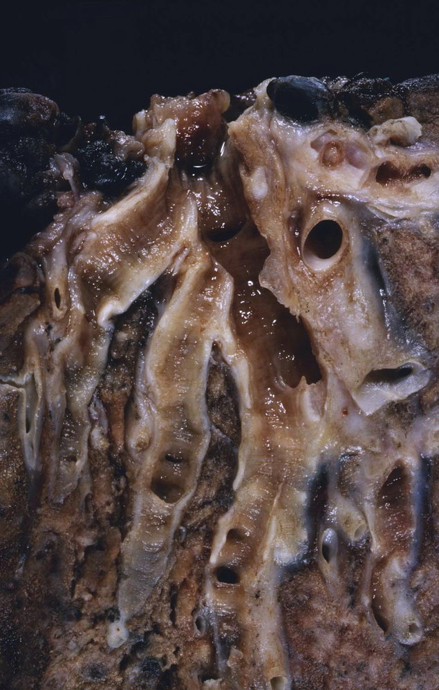
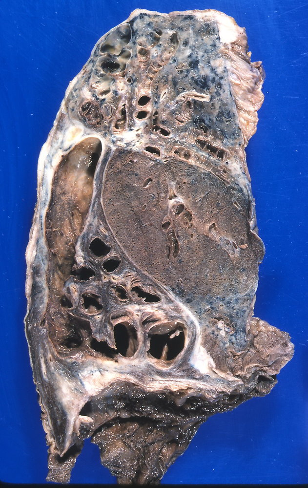
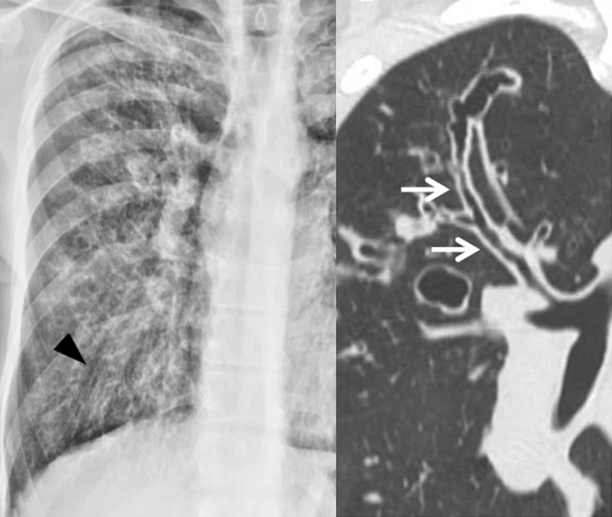
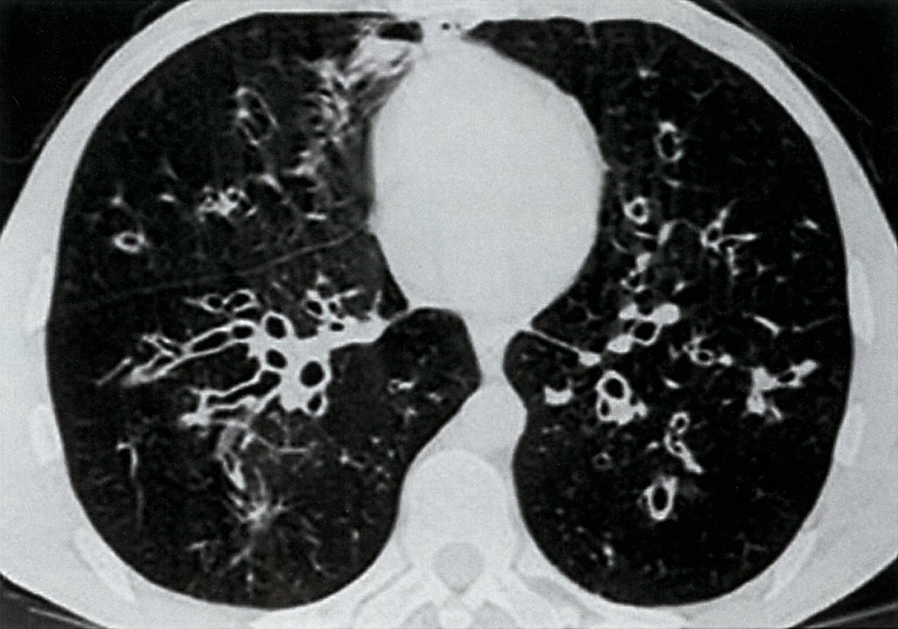
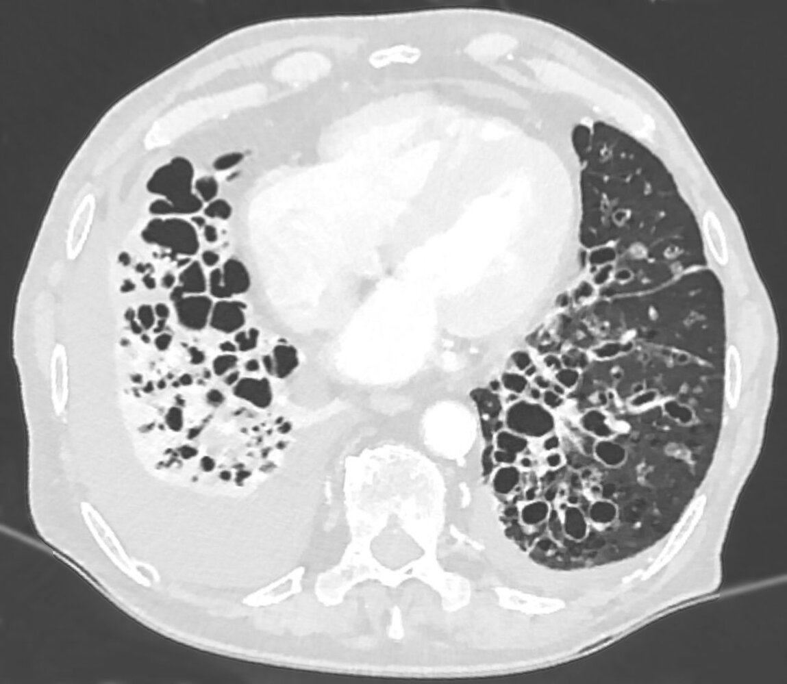

# Bronchiectasis

*Categories: Clinical knowledge > Internal medicine > Pulmonology > Obstructive lung diseases > Bronchiectasis*

[Original Article Link](https://coursology-qbank.com/amboss/article/ih0Jdf)

---

## Summary

Bronchiectasis is an irreversible and abnormal dilation in the bronchial tree caused by cycles of bronchial inflammation leading to mucous plugging and progressive <u>airway</u> destruction. Bronchiectasis is classified according to etiology as either <u>cystic fibrosis</u> (<u>CF</u>) bronchiectasis or non-<u>CF</u> bronchiectasis (e.g., secondary to severe or protracted <u>pneumonia</u>, <u>immunodeficiency</u>, or <u>COPD</u>). The characteristic clinical feature is a <u>chronic cough</u> with copious mucopurulent <u>sputum</u>. Other symptoms may include <u>dyspnea</u>, <u>rhinosinusitis</u>, and <u>hemoptysis</u>. <u>Physical examination</u> reveals <u>crackles</u> and <u>rhonchi</u> on <u>auscultation</u>, often accompanied by <u>wheezing</u>. High-resolution <u>computed tomography</u> confirms the diagnosis and usually shows thickened bronchial walls, with so-called “signet-ring” and “tram track” signs. Patients can periodically experience an acute worsening of symptoms, referred to as an <u>acute exacerbation of bronchiectasis</u>, which commonly requires <u>antibiotic</u> treatment. The goal of long-term <u>management of bronchiectasis</u> is to control symptoms and prevent exacerbations, and includes pulmonary <u>physiotherapy</u> and pharmacological therapy. <u>Massive hemoptysis</u> is a rare complication of bronchiectasis and requires <u>surgery</u> or <u>pulmonary artery</u> embolization.

---

## Etiology

Bronchiectasis requires the combination of two important processes taking place in the <u>bronchi</u>: either local infection or inflammation along with either inadequate clearance of secretions, <u>airway obstruction</u>, or impaired host defenses. These processes result in the permanent dilation of <u>airways</u>.

* Pulmonary infections (i.e., bacterial, viral, fungal), especially severe or chronic infections

* Disorders of secretion clearance or mucous plugging

* <u>Cystic fibrosis</u> (<u>CF</u>)  [[2]](https://coursology-qbank.com/amboss/article/yCbduD)

* <u>Primary ciliary dyskinesia</u> (PCD)

* <u>Allergic bronchopulmonary aspergillosis</u> (<u>ABPA</u>)

* Smoking: associated with poor ciliary motility

* Bronchial narrowing or other forms of obstruction

* <u>COPD</u>

* <u>Aspiration</u>

* Tumors

* <u>α1-antitrypsin deficiency</u>

* Other congenital and acquired conditions (e.g., congenital bronchiectasis, <u>tracheomalacia</u>, <u>bronchogenic cyst</u>)

* <u>Immunodeficiency</u> (e.g., <u>common variable immunodeficiency</u>, <u>hypogammaglobulinemia</u>, <u>HIV</u>)

* Chronic inflammatory diseases (e.g., <u>rheumatoid arthritis</u>, <u>Sjogren syndrome</u>, <u>Crohn disease</u>)

> [!TIP]
> <u>Primary prevention</u> of bronchiectasis includes <u>antibiotic</u> control of bronchial and pulmonary infections in predisposed individuals.

Bronchiectasis

Bronchiectasis

References:[[2]](https://coursology-qbank.com/amboss/article/yCbduD)[[3]](https://coursology-qbank.com/amboss/article/BCbz8D)[[4]](https://coursology-qbank.com/amboss/article/_Cb5uD)

---

## Clinical features

* Chronic productive <u>cough</u> (lasting months to years) with copious mucopurulent <u>sputum</u> ;

* <u>Auscultation</u>

* <u>Crackles</u> and <u>rhonchi</u>

* <u>Wheezing</u> (due to obstruction from secretions, <u>airway</u> collapsibility, or a concomitant condition)

* <u>Bronchophony</u>

* <u>Rhinosinusitis</u>

* <u>Dyspnea</u>

* <u>Hemoptysis</u>: usually mild or <u>self-limiting</u>, but severe hemorrhage that requires embolization may occur

* Nonspecific symptoms (i.e., fatigue, weight loss, <u>pallor</u> due to <u>anemia</u>)

* <u>Clubbing</u> of <u>nails</u> (uncommon)

* Exacerbations of bronchiectasis

* Recurrent bouts of <u>pneumonia</u> and acute bacterial infection of sections of dilated <u>bronchi</u>

* Frequently due to <u>Pseudomonas aeruginosa</u> [[5]](https://coursology-qbank.com/amboss/article/MebMzs)

* Features

* Increased production of mucous above baseline

* Low-grade <u>fever</u>

> [!NOTE]
> Bronchiectasis should be suspected in patients with a <u>chronic cough</u> that produces large amounts of <u>sputum</u>. 
> References: [[4]](https://coursology-qbank.com/amboss/article/_Cb5uD)[[6]](https://coursology-qbank.com/amboss/article/TYa6oQ)

---

## Diagnosis

### Approach [[7]](https://coursology-qbank.com/amboss/article/iUXJ1x)

* Confirm the diagnosis with imaging studies in patients with features suggestive of bronchiectasis. 

* Poor control or frequent exacerbations in patients with chronic pulmonary disease (e.g., <u>COPD</u>, <u>asthma</u>)

* <u>Chronic cough</u> or recurrent pulmonary infections in patients with <u>immunosuppression</u> or conditions associated with bronchiectasis

* Productive <u>cough</u> lasting > 8 weeks in otherwise healthy patients

* Identify the underlying etiology.

* Routine <u>laboratory studies</u>, <u>sputum</u> culture and smear, and <u>pulmonary function tests</u>

* Clinical suspicion for a specific etiology: Obtain additional studies based on individual evaluation.

> [!TIP]
> In patients with suspected bronchiectasis, diagnosis is confirmed using imaging studies, preferably a <u>HRCT</u> scan. Additional diagnostic studies are useful to identify the underlying cause and possibly provide specific treatment.

### Imaging [[7]](https://coursology-qbank.com/amboss/article/iUXJ1x)[[8]](https://coursology-qbank.com/amboss/article/FuXgG-)[[9]](https://coursology-qbank.com/amboss/article/_UX5fx)

* Imaging modalities

* <u>X-ray</u> chest: best initial test (may not show mild disease)

* <u>High-resolution computed tomography</u>;  (<u>HRCT</u>) chest: <u>confirmatory test</u>

* Findings

* Bronchial dilation  ;   [[7]](https://coursology-qbank.com/amboss/article/iUXJ1x)[[8]](https://coursology-qbank.com/amboss/article/FuXgG-)

* Cylindrical or tubular (most common) : parallel tram track sign and signet ring sign

* Varicose

* Saccular or cystic (most severe form)

* Thickened bronchial walls; , mucus plugging, <u>honeycombing</u> (suggests late-stage bronchiectasis)

* Specific findings suggestive of the underlying etiology

* Focal distribution : localized disease (e.g., tumors, foreign bodies, strictures)

* Diffuse distribution: fibrosing diffuse <u>lung</u> diseases

* Lower <u>lung</u> predominance (e.g., recurrent <u>aspiration</u>, <u>pulmonary fibrosis</u>, <u>α1-antitrypsin deficiency</u>)

* Upper or middle <u>lung</u> predominance (e.g., <u>CF</u>, <u>sarcoidosis</u>, <u>ABPA</u>, <u>tuberculosis</u>)

* Perihilar lymphadenopathies (e.g., <u>sarcoidosis</u>, <u>tuberculosis</u>)

* <u>Situs inversus</u> (seen in <u>primary ciliary dyskinesia</u>)

Tram track sign

Bronchiectasis

Bronchiectasis

### Identification of the underlying etiology

Studies to determine the underlying etiology of bronchiectasis are usually requested by a specialist. In many cases, it is not possible to reach a specific diagnosis and the disease may be classified as <u>idiopathic</u>. [[10]](https://coursology-qbank.com/amboss/article/u2Xpjx)

#### Initial workup  [[7]](https://coursology-qbank.com/amboss/article/iUXJ1x)[[11]](https://coursology-qbank.com/amboss/article/0xbeED)

Perform at the time of diagnosis to obtain baseline references. <u>Sputum</u> culture and smear, as well as <u>spirometry</u>, are also used for monitoring.

* <u>Laboratory studies</u> [[7]](https://coursology-qbank.com/amboss/article/iUXJ1x)[[11]](https://coursology-qbank.com/amboss/article/0xbeED)

* <u>CBC</u>: Findings are variable and depend on the underlying etiology.

* ↓ <u>Hb</u>

* Variable <u>leukocyte</u> levels

* ↑ <u>Thrombocytes</u>

* Consider <u>ABG</u> (e.g., in patients with ↓ <u>SaO2</u> on room air): may show <u>hypercapnia</u>

* Quantitative measurement of serum <u>immunoglobulins</u> and <u>electrophoresis</u> (<u>IgA</u>, <u>IgG</u>, <u>IgM</u>, and <u>IgG</u> subclasses): to exclude <u>immunodeficiencies</u>  [[11]](https://coursology-qbank.com/amboss/article/0xbeED)

* <u>Aspergillus fumigatus</u> <u>IgG</u> and <u>IgE</u>: to exclude <u>ABPA</u>

* Serum <u>AAT</u> level: to evaluate for <u>AAT deficiency</u> [[12]](https://coursology-qbank.com/amboss/article/mMWV6N0)

* <u>Sputum</u> culture and smear: culture <u>induced sputum</u> or <u>bronchoalveolar lavage</u> for all of the following pathogens to detect infection or <u>colonization</u> [[7]](https://coursology-qbank.com/amboss/article/iUXJ1x)[[13]](https://coursology-qbank.com/amboss/article/eEXxu-)

* Bacterial cultures: e.g., <u>H. influenzae</u> or <u>P. aeruginosa</u>

* Fungal cultures: <u>Candida</u> spp. or <u>Aspergillus</u> spp.

* <u>Mycobacterial</u> culture (with <u>AFB smear microscopy</u>): <u>tuberculosis</u> or <u>nontuberculous mycobacteria</u>

* <u>Spirometry</u>: not needed to establish a diagnosis but useful to monitor disease progression [[7]](https://coursology-qbank.com/amboss/article/iUXJ1x)[[14]](https://coursology-qbank.com/amboss/article/2EXTE-)

* Mixed obstructive/restrictive pattern

* Restrictive pattern (i.e., ↓ <u>FEV1</u> and <u>FVC</u> with normal or ↑ <u>FEV1/FVC ratio</u>)

* Obstructive pattern (i.e., ↓ <u>FEV1/FVC ratio</u>)

#### Additional diagnostics [[7]](https://coursology-qbank.com/amboss/article/iUXJ1x)[[11]](https://coursology-qbank.com/amboss/article/0xbeED)

These studies may be considered depending on clinical suspicion if the initial workup was not diagnostic.

* <u>Laboratory studies</u>

* Specific <u>antibodies</u> (e.g., <u>rheumatoid factor</u>, <u>ANAs</u>, <u>anti-CCP</u> <u>antibodies</u>, <u>ANCAs</u>): suspected <u>connective tissue</u> or autoimmune diseases

* <u>Sweat chloride test</u> and/or <u>genetic testing</u> for <u>CFTR</u> mutations: suspected <u>CF</u>

* <u>HIV testing</u> , serum <u>α1-antitrypsin</u> levels , <u>nasal nitric oxide</u> testing for <u>primary ciliary dyskinesia</u>

* Further studies

* <u>Bronchoscopy</u>

* Indicated to visualize tumors, foreign bodies, or other lesions (most useful in patients with localized disease)

* May also be used in combination with <u>bronchoalveolar lavage</u> (<u>BAL</u>) to obtain specimens for staining and culture

* Upper GI studies (e.g., <u>upper endoscopy</u>, <u>barium swallow</u>, <u>esophageal manometry</u>): consider for suspected <u>gastroesophageal reflux disease</u> or recurrent pulmonary <u>aspiration</u>

* <u>Colonoscopy</u> with <u>biopsies</u>: if associated <u>inflammatory bowel disease</u> is suspected (e.g., <u>GI bleeding</u>)

> [!TIP]
> If the initial workup does not identify the underlying cause, perform further studies guided by the patient's clinical features and consider referral to a specialist.

---

## Management

This section focuses on the management of non-<u>CF</u> bronchiectasis. See “<u>Cystic fibrosis</u>” for specific recommendations regarding that condition.

---

## Management of acute exacerbations

### Approach [[7]](https://coursology-qbank.com/amboss/article/iUXJ1x)[[11]](https://coursology-qbank.com/amboss/article/0xbeED)[[15]](https://coursology-qbank.com/amboss/article/sBXtX00)

* Provide supportive treatment and <u>oxygen therapy</u> as needed.

* Optimize <u>mucoactive agents</u> (see “<u>Pharmacotherapy for airway clearance in bronchiectasis</u>”).

* Optimize <u>airway clearance techniques</u>.

* Obtain a new <u>sputum</u> culture and start <u>empiric antibiotic therapy</u>, based on the most recent <u>sputum</u> culture.

* Tailor <u>antibiotics</u> to the most recent <u>sputum</u> culture once available and preferably complete 14 days of therapy.

### Monitoring and disposition [[7]](https://coursology-qbank.com/amboss/article/iUXJ1x)[[11]](https://coursology-qbank.com/amboss/article/0xbeED)

* Outpatient treatment: for hemodynamically stable patients with mild to moderate symptoms

* Consider inpatient treatment in the following cases:

* Clinical deterioration or no clinical improvement following completion of an oral <u>antibiotic</u> regimen (e.g., lasting 10–14 days)

* <u>Sepsis</u> or severe <u>pneumonia</u> (see “<u>Pneumonia treatment</u>” and “<u>Acute management checklist for sepsis</u>” for more information)

* <u>Hemoptysis</u> ≥ 10 mL in 24 hours and clinical deterioration

* New isolation of <u>P. aeruginosa</u>

|  Common <u>empiric antibiotic</u> regimens for bronchiectasis exacerbations [[7]](https://coursology-qbank.com/amboss/article/iUXJ1x)[[11]](https://coursology-qbank.com/amboss/article/0xbeED)   |  |  |
| --- | --- | --- |
|  Outpatient treatment [[7]](https://coursology-qbank.com/amboss/article/iUXJ1x)[[15]](https://coursology-qbank.com/amboss/article/sBXtX00)  |  |   * No previous culture data available: Consider <u>fluoroquinolones</u>.  * <u>Ciprofloxacin</u> DOSAGE  * <u>Levofloxacin</u> DOSAGE  * Previous culture data and <u>antibiotic sensitivities</u> available  * <u>Colonization</u> with sensitive pathogens  * <u>Amoxicillin</u> DOSAGE  * OR <u>doxycycline</u> DOSAGE  * OR <u>clarithromycin</u> DOSAGE  * <u>Colonization</u> with <u>beta-lactamase</u> positive organisms  * <u>Amoxicillin/clavulanic acid</u> DOSAGE  * OR <u>doxycycline</u> DOSAGE  * <u>Colonization</u> with <u>P. aeruginosa</u>: <u>ciprofloxacin</u> DOSAGE    |
|  Inpatient treatment [[7]](https://coursology-qbank.com/amboss/article/iUXJ1x)[[15]](https://coursology-qbank.com/amboss/article/sBXtX00)  |  |   * <u>Colonization</u> with <u>P. aeruginosa</u>  * <u>Piperacillin-tazobactam</u> DOSAGE  * OR <u>ceftazidime</u> DOSAGE  * OR <u>meropenem</u> DOSAGE  * <u>Colonization</u> with <u>MRSA</u>  * <u>Vancomycin</u> DOSAGE  * OR <u>linezolid</u> DOSAGE  * See also “<u>Empiric antibiotic therapy for community-acquired pneumonia in an inpatient setting</u>.”    |

> [!TIP]
> Acute exacerbations are defined as acute deterioration or worsening local symptoms and/or additional systemic symptoms such as <u>fever</u> or <u>malaise</u>. Exacerbations are associated with increased inflammation and progressive damage to the <u>lungs</u>. [[11]](https://coursology-qbank.com/amboss/article/0xbeED)

---

## Long-term management

Management goals are to stop or delay disease progression, reduce exacerbation frequency (goal ≤ 2 per year), achieve symptom control, and improve the patient's quality of life.

### Approach [[7]](https://coursology-qbank.com/amboss/article/iUXJ1x)[[11]](https://coursology-qbank.com/amboss/article/0xbeED)

* General measures

* Educate the patient regarding prognosis and the use of long-term medications.

* Promote lifestyle changes like regular exercise and <u>smoking cessation</u>.

* Educate the patient on <u>airway clearance techniques</u>.  [[7]](https://coursology-qbank.com/amboss/article/iUXJ1x)[[11]](https://coursology-qbank.com/amboss/article/0xbeED)[[16]](https://coursology-qbank.com/amboss/article/s2XtQx)

* <u>Bronchopulmonary hygiene</u> and chest <u>physiotherapy</u>: e.g., cupping and clapping, <u>postural drainage</u>, directed <u>cough</u>, hydration

* <u>Pulmonary rehabilitation</u>: may improve exercise capacity and respiratory symptoms  [[10]](https://coursology-qbank.com/amboss/article/u2Xpjx)

* Administer <u>vaccinations</u> (i.e., seasonal <u>influenza</u> <u>vaccine</u>, <u>pneumococcal</u> <u>vaccine</u>).

* Consider treatment with <u>mucoactive agents</u>, <u>bronchodilators</u>, or <u>corticosteroids</u> if <u>airway</u> clearance is difficult.

* Provide specific treatment for the underlying cause if identified.

* Follow-up: Perform follow-ups every 6–12 months to identify disease progression. 

* Bacterial and fungal <u>sputum</u> culture: every 6–12 months

* <u>Spirometry</u>: every 12 months

* Disease progression  

* Consider <u>long-term antibiotic therapy for bronchiectasis</u> with ≥ 3 exacerbations per year.

* Repeat diagnostic studies to assess disease progression.

* Screen for complications.

* <u>ECG</u>

* Consider <u>echocardiogram</u>.

* Consider CT chest with contrast.

* Advanced disease

* Ensure <u>respiratory support</u> as needed.

* <u>Long-term oxygen therapy</u> for <u>chronic respiratory failure</u> (indications are the same as for <u>COPD</u>)

* Consider <u>oxygen with humidification</u> for patients with <u>respiratory failure</u> with <u>hypercapnia</u>.

* Invasive procedures: not routinely indicated

> [!TIP]
> Perform a careful reassessment of patients who are progressively deteriorating (i.e., patients with increased frequency and/or severity of exacerbations, frequent hospital admissions, worsening symptoms, rapid decline in <u>lung function</u>). Identify the cause of bronchiectasis if still unknown, and exclude any comorbidities or exacerbating conditions such as new <u>pathogen</u> <u>colonization</u>.

> [!TIP]
> For patients with bronchiectasis and chronic productive <u>cough</u> or difficulty expectorating, consider referral to a trained respiratory physiotherapist for <u>airway clearance techniques</u>. [[16]](https://coursology-qbank.com/amboss/article/s2XtQx)

### Pharmacotherapy for airway clearance in bronchiectasis

#### <u>Mucoactive agents</u>

Consider in patients with difficulty expectorating or persistent symptoms despite adequate <u>airway clearance techniques</u>; continue use based on clinical benefits. There is a paucity of evidence for the benefit of <u>mucoactive agents</u> in bronchiectasis. [[7]](https://coursology-qbank.com/amboss/article/iUXJ1x)[[17]](https://coursology-qbank.com/amboss/article/iEXJv-)

* <u>Nebulized</u> <u>mucoactive agents</u>: Trial for at least 3 months.  [[11]](https://coursology-qbank.com/amboss/article/0xbeED)

* <u>Hypertonic saline</u> (3–7% NaCl)  [[7]](https://coursology-qbank.com/amboss/article/iUXJ1x)[[18]](https://coursology-qbank.com/amboss/article/v2XAjx)[[19]](https://coursology-qbank.com/amboss/article/D2X1Px)

* <u>Mannitol</u> DOSAGE  [[20]](https://coursology-qbank.com/amboss/article/E2X8jx)

* Oral <u>mucolytics</u>: Trial for at least 6 months, e.g., <u>N-acetylcysteine</u> DOSAGE.

#### <u>Bronchodilators</u>

Consider on a case-by-case basis. Evidence to support the use of <u>bronchodilators</u> in bronchiectasis is limited. [[7]](https://coursology-qbank.com/amboss/article/iUXJ1x)[[11]](https://coursology-qbank.com/amboss/article/0xbeED)

* Short-term <u>bronchodilators</u> (e.g., <u>SABA</u>): in patients with <u>airway</u> reactivity and <u>bronchospasm</u> or prior to inhaled mucoactive treatment [[16]](https://coursology-qbank.com/amboss/article/s2XtQx)

* Long-term <u>bronchodilators</u> (e.g., <u>LABA</u>, <u>LAMA</u>): may be used in patients with severe <u>dyspnea</u>

* Regular use of <u>bronchodilators</u> (e.g., for <u>asthma</u> or <u>COPD</u>): Continue as usual.

#### <u>Corticosteroids</u>

<u>Corticosteroids</u> are not routinely recommended because of the limited benefit and <u>side effects of corticosteroid therapy</u>.  [[7]](https://coursology-qbank.com/amboss/article/iUXJ1x)[[21]](https://coursology-qbank.com/amboss/article/ruXfs-)

* <u>Inhaled corticosteroids</u>: Continue if already indicated for <u>asthma</u> or <u>COPD</u>.

* <u>Systemic corticosteroids</u>: indicated in patients with <u>ABPA</u> [[10]](https://coursology-qbank.com/amboss/article/u2Xpjx)

> [!TIP]
> For patients receiving multiple inhaled treatments and chest <u>physiotherapy</u>, consider the following order of treatment to avoid <u>bronchospasm</u>: <u>bronchodilators</u>, <u>mucoactive agents</u>, respiratory <u>physiotherapy</u>, inhaled <u>antibiotics</u>. [[11]](https://coursology-qbank.com/amboss/article/0xbeED)

> [!WARNING]
> Avoid treatment with recombinant human DNase (e.g., <u>dornase alfa</u>), as it can increase the frequency of exacerbations in patients with non-<u>CF</u> bronchiectasis. [[7]](https://coursology-qbank.com/amboss/article/iUXJ1x)[[22]](https://coursology-qbank.com/amboss/article/F2Xgjx)

### <u>Long-term antibiotic therapy</u> [[7]](https://coursology-qbank.com/amboss/article/iUXJ1x)[[11]](https://coursology-qbank.com/amboss/article/0xbeED)[[15]](https://coursology-qbank.com/amboss/article/sBXtX00)

The goal is to suppress bacterial growth and to reduce symptoms and exacerbations as a measure of <u>secondary prevention</u> in patients with ≥ 3 exacerbations per year. <u>Antibiotic therapy</u> should be administered for at least 3 months and may be extended based on clinical response and tolerability.

> [!TIP]
> Before starting treatment, obtain new <u>sputum</u> cultures with <u>antibiotic sensitivity testing</u> and consult an infectious diseases specialist.

|  Long-term antibiotic therapy for bronchiectasis   |  |  |
| --- | --- | --- |
| No <u>colonization</u> with <u>P. aeruginosa</u> |  |   * First-line: oral <u>macrolides</u> * <u>Azithromycin</u> DOSAGE  [[7]](https://coursology-qbank.com/amboss/article/iUXJ1x)[[10]](https://coursology-qbank.com/amboss/article/u2Xpjx)[[23]](https://coursology-qbank.com/amboss/article/KBXUb00)[[24]](https://coursology-qbank.com/amboss/article/qBXCb00)  * Alternative: inhaled <u>antibiotics</u> (e.g., <u>tobramycin</u> DOSAGE) [[7]](https://coursology-qbank.com/amboss/article/iUXJ1x)[[15]](https://coursology-qbank.com/amboss/article/sBXtX00)    |
|  <u>Colonization</u> with <u>P. aeruginosa</u>  [[7]](https://coursology-qbank.com/amboss/article/iUXJ1x)[[11]](https://coursology-qbank.com/amboss/article/0xbeED)  |  |   * Growth suppression [[7]](https://coursology-qbank.com/amboss/article/iUXJ1x)[[11]](https://coursology-qbank.com/amboss/article/0xbeED)  * <u>Tobramycin</u> DOSAGE [[15]](https://coursology-qbank.com/amboss/article/sBXtX00)  * <u>Aztreonam</u> DOSAGE  * Alternative: long-term treatment with <u>macrolides</u> (e.g., <u>azithromycin</u>)  * Eradication therapy (weak evidence)  [[7]](https://coursology-qbank.com/amboss/article/iUXJ1x)[[11]](https://coursology-qbank.com/amboss/article/0xbeED) * E.g., 2 weeks of oral <u>fluoroquinolones</u> (e.g., <u>ciprofloxacin</u>) followed by 3 months of inhaled <u>antibiotics</u> (e.g., <u>tobramycin</u>, <u>colistin</u>)    |
| Isolation of other pathogens |  |   * <u>Nontuberculous mycobacteria</u>: Treatment usually includes three drugs (<u>macrolide</u> PLUS <u>rifampicin</u> PLUS <u>ethambutol</u>) for at least one year. [[25]](https://coursology-qbank.com/amboss/article/jfX_Nx)  * <u>MRSA</u>: Consider eradication therapy based on local protocols.  [[7]](https://coursology-qbank.com/amboss/article/iUXJ1x)[[11]](https://coursology-qbank.com/amboss/article/0xbeED)    |

> [!TIP]
> Chronic <u>macrolide</u> use can increase the growth of <u>macrolide</u>-resistant <u>mycobacterial</u> strains. It is recommended to rule out active nontuberculous <u>mycobacterial</u> infection with a negative culture before starting treatment.

> [!WARNING]
> Long-term <u>macrolides</u> can lead to QT-prolongation and fatal <u>arrhythmias</u>. Before starting treatment, perform an <u>ECG</u> and review whether any medications the patient is taking are known to alter the <u>QT interval</u>. [[7]](https://coursology-qbank.com/amboss/article/iUXJ1x)[[10]](https://coursology-qbank.com/amboss/article/u2Xpjx)

### Invasive procedures [[7]](https://coursology-qbank.com/amboss/article/iUXJ1x)

* Surgical resection of bronchiectatic <u>lung</u> or <u>lobectomy</u>: indicated in pulmonary hemorrhage, inviable <u>bronchus</u>, and poor control of symptoms despite optimal medical therapy in unilateral bronchiectasis with well-localized disease

* <u>Pulmonary artery</u> embolization: indicated in pulmonary hemorrhage

* <u>Lung transplantation</u>: Consider for severe disease or rapid disease progression.

---

## Complications

* Recurrent bronchopulmonary infections → <u>chronic obstructive pulmonary disease</u> → <u>respiratory failure</u> and <u>cor pulmonale</u>

* Pulmonary hemorrhage (<u>massive hemoptysis</u>)

* <u>Lung abscess</u>

References: [[6]](https://coursology-qbank.com/amboss/article/TYa6oQ)

We list the most important complications. The selection is not exhaustive.

---