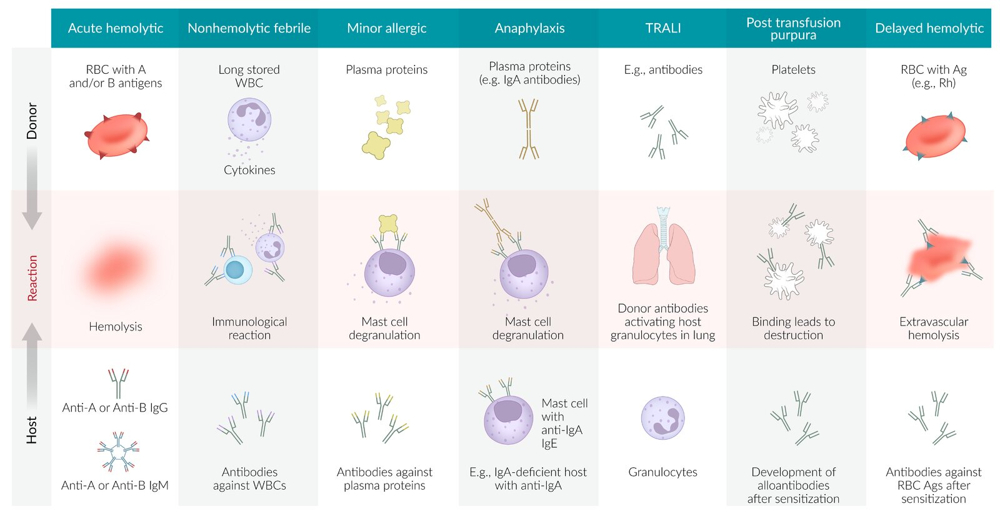
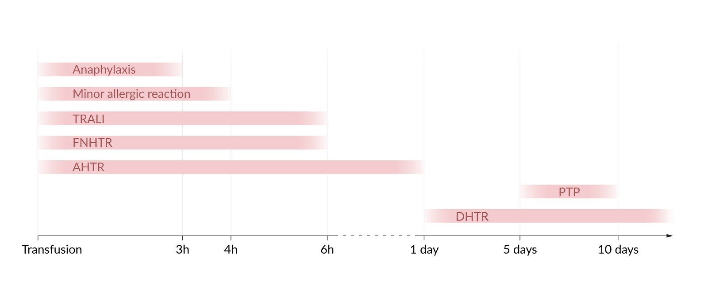
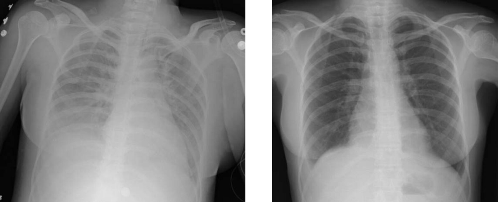
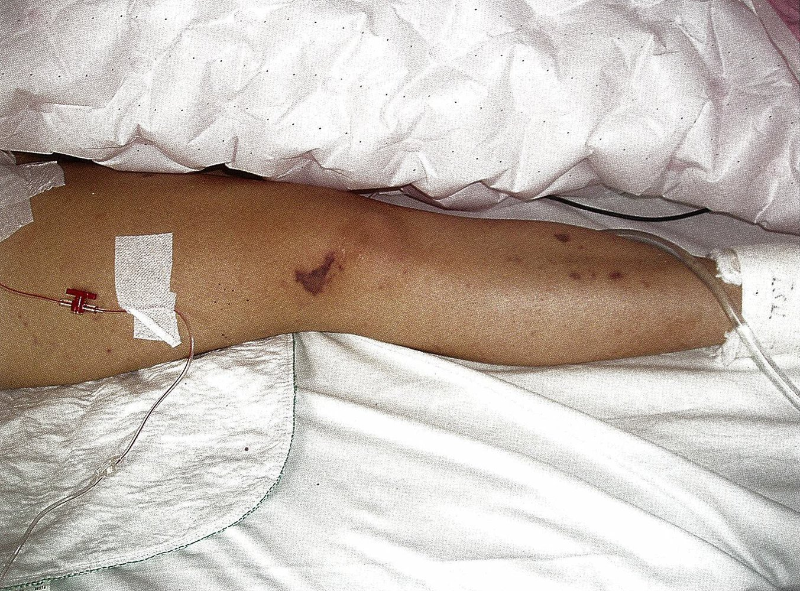

# Transfusion reactions

*Categories: Clinical knowledge > Internal medicine > Pulmonology > Respiratory failure > Transfusion reactions*

[Original Article Link](https://coursology-qbank.com/amboss/article/X7094h)

---

## Summary

Blood component <u>transfusions</u> are usually safe and, given extensive screening and <u>pretransfusion testing</u>, serious <u>adverse events</u> are uncommon. When acute reactions occur they are typically mild, with the most common reactions including <u>fever</u> and <u>rash</u>. Rarely, more severe reactions can occur, causing <u>respiratory distress</u>, <u>hemolysis</u>, or <u>shock</u>. As there is significant overlap between the manifestations of mild <u>transfusion</u> reactions and the early stages of severe <u>transfusion</u> reactions, the first step is to stop the <u>blood transfusion</u> while assessment is performed. For minor <u>transfusion</u> reactions, it may be possible to restart the <u>transfusion</u> at a slower rate once more serious diagnoses have been excluded. Patients may also experience <u>delayed transfusion reactions</u> days to weeks after a <u>transfusion</u>. <u>Delayed transfusion reactions</u> typically have a more insidious presentation than acute reactions, and identifying them requires a high degree of clinical suspicion.

See also “<u>Transfusion</u>.”

---

## Overview

### Immunological <u>transfusion</u> reactions

| Overview of immunological transfusion reactions |  |  |  |
| --- | --- | --- | --- |
|  | Background |  Clinical features   | Management |
| <u>Acute hemolytic transfusion reaction</u> (<u>AHTR</u>) |   * Frequency: 1 in 105,000–200,000 <u>transfusions</u> [[2]](https://coursology-qbank.com/amboss/article/r5XflA)  * Mechanism: Donor <u>RBCs</u> are destroyed by preformed recipient <u>antibodies</u> (typically due to <u>ABO incompatibility</u>) and/or by other nonimmune-mediated forces (e.g., mechanical shear), leading to <u>intravascular hemolysis</u>.    |   * Onset: Rapid; during or up to 24 hours after <u>transfusion</u>  * <u>Fever</u>, chills, <u>nausea</u>, flushing  * <u>Signs of shock</u>  * <u>Respiratory distress signs</u>  * <u>Signs of hemolysis</u>    |   * Immediately stop <u>transfusion</u> and notify the blood bank.  * Perform <u>Direct Coombs test</u> on recipient blood.  * Repeat <u>blood typing</u> and <u>crossmatching</u> of the donor blood.  * Start <u>immediate hemodynamic support</u> (i.e., IV <u>fluid resuscitation</u>, <u>vasopressors and inotropes</u> as needed).  * Treat complications, e.g., <u>hyperkalemia</u>, <u>DIC</u>, <u>renal failure</u>.    |
| <u>Febrile nonhemolytic transfusion reaction</u> (<u>FNHTR</u>) |   * Frequency: 1 in 900 <u>transfusions</u> (more common in children) [[2]](https://coursology-qbank.com/amboss/article/r5XflA)[[3]](https://coursology-qbank.com/amboss/article/t3cX4X0)  * Mechanism: <u>Cytokines</u> released from old or lysed donor <u>WBCs</u> provoke an inflammatory reaction in the recipient.    |   * Onset: During or up to 6 hours after <u>transfusion</u>  * <u>Fever</u>, chills, <u>malaise</u>, flushing, <u>headache</u>    |   * Stop <u>transfusion</u> until <u>AHTR</u> has been ruled out.  * Use leukoreduced <u>blood products</u> for prevention.  * Consider <u>acetaminophen</u> for symptoms.    |
| <u>Anaphylactic transfusion reaction</u> |   * Frequency: 1 in 30,000 <u>transfusions</u> [[2]](https://coursology-qbank.com/amboss/article/r5XflA)  * Mechanism: <u>type I hypersensitivity reaction</u> to donor <u>plasma proteins</u> (due to preformed recipient <u>antibodies</u>)    |   * Onset: Sudden; during or up to 3 hours after <u>transfusion</u>  * <u>Clinical features of anaphylaxis</u>    |   * Immediately stop <u>transfusion</u>.  * <u>Epinephrine IM</u>  * <u>Immediate hemodynamic support</u>  * <u>Airway management</u>    |
| Minor <u>allergic transfusion reaction</u> |   * Frequency: 1 in 1200 <u>transfusions</u> (more common in children) [[2]](https://coursology-qbank.com/amboss/article/r5XflA)[[3]](https://coursology-qbank.com/amboss/article/t3cX4X0)  * Mechanism: <u>allergic reaction</u> to components in donor plasma (due to preformed recipient <u>antibodies</u>)    |   * Onset: during or up to 4 hours after <u>transfusion</u>  * <u>Pruritus</u>, <u>urticaria</u>    |   * Stop <u>transfusion</u> initially.  * Use <u>diphenhydramine</u> for symptoms.  * Restart <u>transfusion</u> slowly under close observation if <u>anaphylaxis</u> has been ruled out and symptoms resolved.    |
| <u>Transfusion-related acute lung injury</u> (<u>TRALI</u>) |   * Frequency: 1 in 60,000 <u>transfusions</u> [[2]](https://coursology-qbank.com/amboss/article/r5XflA)[[4]](https://coursology-qbank.com/amboss/article/85XONA)  * Mechanism: activation of primed <u>granulocytes</u> in recipient's <u>lungs</u> by donor blood components leads to an inflammatory cascade, culminating in <u>lung injury</u> and <u>NCPE</u>  [[5]](https://coursology-qbank.com/amboss/article/B5XzmA)    |   * Onset: Sudden; during or up to 6 hours after <u>transfusion</u>  * Features resembling <u>ARDS</u>  * <u>Respiratory distress signs</u>  * <u>Signs of increased work of breathing</u>  * <u>Fever</u>, <u>hypotension</u>    |   * Immediately stop <u>transfusion</u> and notify blood bank.  * <u>Respiratory support</u>: e.g., <u>lung-protective ventilation</u>  * <u>Hemodynamic support</u>.    |
| <u>Delayed hemolytic transfusion reaction</u> (<u>DHTR</u>) |   * Frequency: 1 in 22,000 <u>transfusions</u>  [[2]](https://coursology-qbank.com/amboss/article/r5XflA)  * Mechanism: delayed <u>anamnestic response</u> to specific donor <u>RBC</u> <u>antigens</u> (e.g., <u>Rh(D) antigen</u>) leads to <u>extravascular hemolysis</u> mediated by recipient <u>antibodies</u>.    |   * Onset: days or weeks after <u>transfusion</u>  * Most commonly asymptomatic  * Features may include mild <u>fever</u>, <u>jaundice</u>, <u>signs of anemia</u>    |   * No acute therapy required (<u>self-limiting</u>)  * <u>Direct Coombs test</u> to prevent future reaction    |
| Post-<u>transfusion</u> <u>purpura</u> |   * Frequency: 1 in 57,000 <u>transfusions</u> [[2]](https://coursology-qbank.com/amboss/article/r5XflA)  * Mechanism: delayed <u>anamnestic response</u> to <u>platelet</u> <u>antigens</u> leads to <u>antibody</u>-mediated destruction of both donor and recipient <u>platelets</u>. [[6]](https://coursology-qbank.com/amboss/article/ufcpLb0)    |   * Onset: 5–10 days after <u>transfusion</u>  * <u>Petechiae</u>, <u>purpura</u>    |  * IVIG therapy   |

Transfusion reactions

Transfusion reaction timeline

### Nonimmunological <u>transfusion</u> complications

| Overview of nonimmunological <u>transfusion</u> complications |  |  |  |  |
| --- | --- | --- | --- | --- |
| Complications |  | Background | Features | Management |
| Transfusion-associated sepsis |  |   * <u>Incidence</u>: 1:10,000-200,000 <u>transfusions</u>  [[7]](https://coursology-qbank.com/amboss/article/A2cR4b0)[[8]](https://coursology-qbank.com/amboss/article/gTcFJb0)  * Mechanism: bacterial contamination of <u>blood product</u>    |   * Onset within 4 hours of <u>transfusion</u>  * <u>Fever</u>, <u>hypotension</u>, <u>rigor</u>, and other signs of <u>SIRS</u>    |   * Immediately stop the <u>transfusion</u>.  * Start <u>immediate hemodynamic support</u> (e.g., IV fluid resuscitation, <u>vasopressors</u>, and <u>inotropes</u> as needed).  * Obtain <u>blood cultures</u> from both patient and remaining <u>blood product</u>.  * Administer broad-spectrum <u>empiric antibiotic therapy</u> for <u>sepsis</u>.    |
| <u>Transfusion-associated circulatory overload</u> (<u>TACO</u>) |  |   * Frequency: 1 in 9000 <u>transfusions</u> [[2]](https://coursology-qbank.com/amboss/article/r5XflA)[[4]](https://coursology-qbank.com/amboss/article/85XONA)  * Mechanism: <u>fluid overload</u>    |   * Onset during or within 12 hours of <u>transfusion</u>  * <u>Signs of hypervolemia</u>: <u>shortness of breath</u>, <u>S3 gallop</u>, <u>jugular venous distention</u>, <u>hypertension</u>    |   * <u>Respiratory support</u>: e.g. <u>oxygen therapy</u>, <u>mechanical ventilation</u>  * Consider <u>diuretics</u> to correct <u>volume status</u>.    |
|  <u>Massive transfusion</u>-related complications [[4]](https://coursology-qbank.com/amboss/article/85XONA)  | <u>Hypocalcemia</u> |   * Resulting from the binding of <u>ionized calcium</u> by <u>citrate</u> (an <u>anticoagulant</u> added to <u>RBC</u>, <u>platelet</u>, <u>FFP</u>, and whole <u>blood transfusion</u> units)  * See also “<u>Clinical features of hypocalcemia</u>”    |  |   * Monitoring of <u>ionized calcium</u>  * <u>Calcium repletion</u>    |
| <u>Hyperkalemia</u> |  * Resulting from the lysis of <u>RBCs</u> in stored blood units; the risk is higher with increased <u>transfusion</u> rate and/or volume and longer storage age.   |  |   * Monitoring of serum <u>potassium</u>  * See “<u>Therapeutic approach to hyperkalemia</u>.”    |  |
| <u>Hypothermia</u> |  * Triggered by the rapid infusion of cold <u>blood products</u>   |  |  * Prevention: inline blood warming devices   |  |
| <u>Coagulopathy</u> |  * Thought to be multifactorial, including dilution of <u>platelets</u> and <u>clotting factors</u>, <u>hypothermia</u>, and <u>platelet dysfunction</u>  [[9]](https://coursology-qbank.com/amboss/article/NTc-Ib0)   |  |   * Prevention: Consider using balanced <u>ratio</u> of <u>blood products</u>. [[10]](https://coursology-qbank.com/amboss/article/lTcvIb0)  * See also “<u>Treatment of DIC</u>.”    |  |
| Other |  |   * Bloodborne viral, treponemal, and parasitic infections (e.g., <u>HIV</u>, <u>hepatitis B</u>, <u>hepatitis C</u>): uncommon in the US as a result of routine <u>blood donation infection screening</u> protocols [[11]](https://coursology-qbank.com/amboss/article/rLXf_A)  * <u>Iron overload</u> (<u>secondary hemochromatosis</u>): May occur with repeated <u>blood transfusion</u>, e.g., in <u>thalassemia</u>, <u>sickle cell anemia</u> (see also “<u>Iron overload disease in thalassemia</u>”)    |  |  |

---

## Acute transfusion reactions

### General principles [[12]](https://coursology-qbank.com/amboss/article/GdcBrY0)

* <u>Acute transfusion reaction</u> refers to an immune or nonimmune-mediated <u>adverse reaction</u> that occurs during or within 24 hours of the <u>transfusion</u> of <u>blood products</u>.

* All patients should undergo a similar initial assessment and management that is focused on stabilization until the underlying diagnosis can be determined.

* Definitive treatment can be provided once the underlying cause has been identified.

> [!TIP]
> Suspect an <u>acute transfusion reaction</u> in any patient who develops a change in <u>vital signs</u> (e.g., <u>fever</u>, <u>hypotension</u>) or any other new symptom during or within 24 hours of <u>blood product</u> <u>transfusion</u>.

### Initial management steps for acute transfusion reactions

* All patients

* Immediately discontinue the <u>transfusion</u> and disconnect the tubing from the patient.

* Maintain open <u>IV access</u> with IV <u>normal saline</u>.

* Check patient and <u>blood product</u> IDs for compatibility.

* Perform an <u>ABCDE survey</u> and determine the severity of the reaction (see “Severity assessment”).

* Narrow down the underlying cause using a <u>symptom-based diagnostic approach to acute transfusion reactions</u>.

* Severe <u>transfusion</u> reaction

* Call for help early; consider <u>hematology</u> and <u>ICU</u> consult.

* Provide <u>respiratory support</u> and <u>immediate hemodynamic support</u> as needed.

* Notify the blood bank/<u>transfusion</u> services and send them the following: 

* The <u>blood product</u> bag (including the administration set)

* A posttransfusion patient blood sample

* Order initial investigations

* Begin definitive treatment for specific <u>transfusion</u> reaction (e.g., <u>AHTR</u>) once identified.

* Mild <u>transfusion</u> reaction

* Exclude the possibility of an early manifestation of severe <u>transfusion</u> reactions.

* Provide symptomatic relief.

* If symptoms resolve, resume the <u>transfusion</u>.

> [!WARNING]
> Do not restart blood component <u>transfusion</u> before a severe <u>transfusion</u> reaction has been ruled out.

### Severity assessment

* Mild: the patient is stable with minor symptoms, e.g., isolated <u>fever</u> or cutaneous <u>allergic reaction</u>

* Severe: the patient is unstable or has any of the following features

* <u>Respiratory distress signs</u>

* <u>Signs of shock</u>, e.g., <u>chest pain</u>, <u>hypotension</u>

* <u>Signs of anaphylaxis</u>

* <u>Signs of hemolysis</u>

> [!WARNING]
> If uncertain, treat the reaction as severe.

### Initial investigations

* All patients

* Repeat patient and donor <u>ABO typing</u> and <u>crossmatching</u>.

* <u>CBC</u>: to assess for <u>anemia</u>, <u>thrombocytopenia</u>

* <u>Hemolysis workup</u>

* <u>BMP</u>: to assess for <u>AKI</u> and/or <u>electrolyte</u> imbalances

* <u>Coagulation panel</u>: to assess for <u>DIC</u>

* <u>Urinalysis</u>: to assess for <u>hemoglobinuria</u>

* Select patients: depending on the suspected underlying cause

* <u>DAT</u> to assess for <u>AHTR</u>

* <u>Blood cultures</u> if <u>sepsis</u> is suspected

* Chest imaging (e.g., <u>CXR</u>, <u>lung</u> <u>ultrasound</u>, CT chest) to evaluate <u>dyspnea</u>/<u>hypoxemia</u>

* <u>BNP</u> levels and <u>echocardiography</u> if <u>TACO</u> is suspected

> [!WARNING]
> Do not delay stabilization measures pending results of a diagnostic workup in patients with suspected severe <u>transfusion</u> reactions.

### Diagnostic approach

| Symptom-based diagnostic approach to acute transfusion reactions |  |  |
| --- | --- | --- |
| Symptom | Associated features | Potential causes |
| <u>Fever</u> |  * No other concerning features   |   * <u>FNHTR</u>  * Nontransfusion-related <u>febrile</u> illness    |
|  * <u>Hypotension</u>, <u>hypoxia</u>, <u>dyspnea</u>, or <u>symptoms of hemolytic anemia</u>   |   * <u>Septic transfusion reaction</u>  * <u>AHTR</u>  * <u>TRALI</u>    |  |
| <u>Rash</u> |  * No extracutaneous features   |  * Minor <u>allergic transfusion reaction</u>   |
|  * Extracutaneous features, e.g., <u>nausea and vomiting</u>, <u>shock</u>, <u>wheezing</u>   |   * <u>Anaphylactic transfusion reaction</u>  * <u>AHTR</u>    |  |
| <u>Respiratory distress</u> |  * Clinical features of <u>fluid overload</u>   |   * <u>TACO</u>  * Nontransfusion-related, e.g., <u>acute heart failure</u>    |
|  * <u>Hypotension</u> and/or <u>fever</u>   |   * <u>TRALI</u>  * <u>Septic transfusion reaction</u>  * <u>AHTR</u>  * Nontransfusion-related, e.g., <u>ARDS</u> or <u>pulmonary embolism</u>    |  |

---

## Acute hemolytic transfusion reaction

### Description

<u>Acute hemolytic transfusion reaction</u> (<u>AHTR</u>) is an <u>adverse reaction</u> to <u>blood transfusion</u> that occurs within the first 24 hours after <u>transfusion</u>.

### Frequency [[2]](https://coursology-qbank.com/amboss/article/r5XflA)

* ABO-related: 1:200,000 <u>transfusions</u>

* Non-ABO-related: 1:105,000 <u>transfusions</u>

### Pathophysiology [[2]](https://coursology-qbank.com/amboss/article/r5XflA)

* <u>ABO incompatibility</u>

* Immune-mediated destruction of donor <u>RBCs</u> (<u>intravascular hemolysis</u>; ) by recipient anti-A and/or anti-B <u>antibodies</u> (<u>type II hypersensitivity reaction</u>)

* Immune-mediated destruction of recipient <u>RBCs</u> by donor anti-A or anti-B <u>antibodies</u>

* Non-ABO-related

* Immune-mediated: the destruction of donor <u>RBCs</u> by recipient <u>alloantibodies</u> to non-ABO <u>RBC</u> <u>antigens</u>

* Nonimmune-mediated: <u>RBC</u> destruction resulting from mechanical, thermal, or <u>osmolar</u> injuries

### Clinical features [[2]](https://coursology-qbank.com/amboss/article/r5XflA)

* Rapid onset during <u>transfusion</u> (because of preformed <u>antibodies</u>) or up to 24 hours after the <u>transfusion</u>

* Clinical presentation ranges from asymptomatic  to severe.

* Symptoms include: [[13]](https://coursology-qbank.com/amboss/article/LdcwqY0)

* <u>Fever</u>, chills, <u>nausea</u>, flushing

* <u>Hypotension</u>, <u>tachycardia</u>

* Flank <u>pain</u> or <u>chest pain</u>

* <u>Dyspnea</u>, <u>tachypnea</u>

* <u>Hemoglobinuria</u> (due to <u>intravascular hemolysis</u>)

* <u>Jaundice</u> (due to <u>intravascular hemolysis</u>)

* <u>Pruritus</u>, <u>urticaria</u>

* Burning <u>pain</u> at the IV site

* Patients in a <u>coma</u> or under <u>general anesthesia</u> may present with oozing from wounds or puncture sites.

* Sequelae include:

* <u>DIC</u>

* <u>Shock</u>

* <u>Renal failure</u>

### Diagnosis [[2]](https://coursology-qbank.com/amboss/article/r5XflA)[[4]](https://coursology-qbank.com/amboss/article/85XONA)

<u>AHTR</u> is mainly a <u>clinical diagnosis</u>.

#### <u>Confirmatory testing</u>

* Repeat <u>blood typing</u> and <u>crossmatching</u> of patient and donor blood samples.

* <u>Direct Coombs test</u>: usually positive  [[14]](https://coursology-qbank.com/amboss/article/4VX3uC)

* Visual inspection of recipient plasma for pink discoloration: suggests <u>hemoglobinemia</u>  [[15]](https://coursology-qbank.com/amboss/article/F5XgNA)

#### Additional laboratory testing

* <u>CBC</u>

* <u>Anemia</u>: due to acute <u>hemolysis</u>; check serial <u>hemoglobin</u> to monitor for progressive <u>anemia</u>.

* <u>Thrombocytopenia</u>: may indicate <u>DIC</u>

* Serum <u>hemolytic indices</u>: ↑ <u>indirect bilirubin</u>, ↑ <u>LDH</u>, ↓ <u>haptoglobin</u>

* <u>BMP</u>: to assess for <u>AKI</u> and <u>electrolyte</u> imbalance (e.g., <u>hyperkalemia</u> resulting from massive <u>hemolysis</u>)

* <u>Coagulation panel</u>: ↑ <u>PTT</u>, ↑ <u>INR</u>, ↓ <u>fibrinogen</u> suggest <u>DIC</u>.

* <u>Urinalysis</u>: <u>hemoglobinuria</u>

### Management

<u>AHTR</u> is a <u>medical emergency</u>.

* Stop the <u>transfusion</u> immediately if <u>AHTR</u> is suspected.

* Follow the <u>initial management steps for acute transfusion reactions</u>.

* Initiate <u>fluid resuscitation</u> with <u>normal saline</u>: Maintain urine output > 1 mL/kg/hour.  [[16]](https://coursology-qbank.com/amboss/article/u5XpNA)

* Contact the <u>transfusion</u> service to undertake a clerical check on both the transfused <u>blood product</u> and the patient information.

* Consider the following:

* <u>Continuous cardiac monitoring</u>

* <u>Vasopressors</u> for refractory <u>hypotension</u>

* <u>Management of hyperkalemia</u> caused by severe <u>hemolysis</u>

* <u>Transfusion</u> of compatible <u>blood products</u>, e.g.:

* <u>RBC</u> <u>transfusion</u> for <u>severe anemia</u> (e.g., <u>Hb</u> < 7 g/dL)

* <u>FFP</u> and <u>platelet transfusion</u> for <u>DIC</u>

* Consult critical care.

> [!WARNING]
> Stop the <u>transfusion</u> immediately if <u>AHTR</u> is suspected!

### Prognosis [[17]](https://coursology-qbank.com/amboss/article/PMXWKA)

* Significant disease progression (e.g., requiring intensive care admission) in approx. 30% of cases.

* <u>Death</u> occurs in 5–10% of cases.

---

## Febrile nonhemolytic transfusion reaction

### Background

* Frequency: 1 in 900 <u>transfusions</u> (more common in children) [[2]](https://coursology-qbank.com/amboss/article/r5XflA)[[3]](https://coursology-qbank.com/amboss/article/t3cX4X0)

* Pathophysiology

* When <u>blood products</u> have been in storage for long periods of time, <u>cytokines</u> may leak from donor <u>WBCs</u> and cause a mild immunologic reaction in the recipient.

* Preformed recipient <u>antibodies</u> cause lysis of the few remaining <u>leukocytes</u> within donor <u>blood products</u>, resulting in an inflammatory reaction.

### Clinical features

* Rapid onset during or within 6 hours of <u>transfusion</u>;  (since <u>cytokines</u> are preformed)

* <u>Fever</u>, chills, <u>malaise</u>, flushing, <u>headache</u>

* More common in pediatric patients

* Recurrence is rare.

### Diagnosis [[2]](https://coursology-qbank.com/amboss/article/r5XflA)[[4]](https://coursology-qbank.com/amboss/article/85XONA)

* <u>Clinical diagnosis</u> based on the following findings (both must be present):

* Temperature increase to ≥ 38°C or an increase of ≥ 1°C from baseline during or shortly after <u>transfusion</u>

* Exclusion of other potential causes of <u>fever</u> during or following <u>transfusion</u> (e.g., <u>AHTR</u>, <u>TRALI</u>, <u>sepsis</u>)

* Diagnostic evaluation

* Check patient and blood bag IDs for compatibility and send a patient blood sample for <u>DAT</u> to rule out <u>AHTR</u>.

* Consider <u>blood cultures</u> to evaluate for <u>sepsis</u> if any of the following are present:

* A temperature increase of ≥ 2°C

* Clinical signs of bacterial infection (e.g., ≥ 2 <u>SIRS criteria</u> or <u>qSOFA criteria</u>)

* Lack of improvement with the cessation of <u>transfusion</u> and <u>antipyretics</u>

* Consider chest imaging (e.g., <u>CXR</u>) to evaluate for <u>TRALI</u> in patients with <u>hypoxemia</u> or <u>respiratory distress</u>.

### Management [[2]](https://coursology-qbank.com/amboss/article/r5XflA)[[4]](https://coursology-qbank.com/amboss/article/85XONA)

* Treatment

* Cessation of <u>transfusion</u> until an <u>AHTR</u> has been ruled out

* Consider <u>antipyretics</u> for <u>fever</u> (e.g., <u>acetaminophen</u> DOSAGE).

* Consider <u>meperidine</u> DOSAGE for severe chills/<u>rigors</u>.

* If other causes of <u>fever</u> have been excluded, restart the <u>transfusion</u> at a slower rate.

* Prevention: Use of leukoreduced <u>blood products</u>

> [!WARNING]
> Premedication with <u>antipyretics</u> to prevent <u>FNHTR</u> is not supported by available evidence. [[2]](https://coursology-qbank.com/amboss/article/r5XflA)[[4]](https://coursology-qbank.com/amboss/article/85XONA)

> [!TIP]
> If a patient receiving a <u>transfusion</u> develops a <u>fever</u>, repeat donor and patient <u>blood typing</u> and <u>crossmatching</u> to rule out <u>ABO incompatibility</u>.

---

## Anaphylactic transfusion reaction

See also “<u>Anaphylaxis</u>.”

* Frequency: 1 in 30,000 <u>transfusions</u> [[2]](https://coursology-qbank.com/amboss/article/r5XflA)

* Pathophysiology

* <u>Type I hypersensitivity reaction</u> in which preformed <u>IgE antibodies</u> on the surface of <u>mast cells</u> bind to donor <u>plasma proteins</u> (commonly donor <u>IgA</u> in recipients with <u>IgA</u> deficiency), leading to <u>mast cell</u> <u>degranulation</u>

* Individuals with <u>IgA</u> deficiency should receive <u>IgA</u>-depleted <u>blood products</u>.

* Clinical features: Sudden onset during or up to 3 hours after the <u>transfusion</u>

* <u>Shock</u>, <u>hypotension</u>, <u>wheezing</u>, <u>respiratory distress</u>

* <u>Skin</u> reactions (e.g., <u>pruritus</u>, <u>urticaria</u>)

* Diagnosis [[2]](https://coursology-qbank.com/amboss/article/r5XflA)

* <u>Clinical diagnosis</u> established according to <u>diagnostic criteria for anaphylaxis</u>

* If the diagnosis is in doubt, consider workup for <u>AHTR</u>, <u>TRALI</u>, and <u>septic transfusion reaction</u> as the presenting features (e.g., <u>hypotension</u>, <u>dyspnea</u>) may be similar.

* Consider testing the <u>transfusion</u> recipient for serum <u>IgA</u> levels and anti-<u>IgA</u> <u>antibodies</u>.

* Management [[2]](https://coursology-qbank.com/amboss/article/r5XflA)

* Follow <u>initial management steps for acute transfusion reactions</u>.

* Treatment is otherwise similar to the <u>management of anaphylaxis</u> from other causes.

* Administer <u>epinephrine</u> IM DOSAGE

* into the anterolateral thigh. Repeat every 5–15 minutes as needed.

* Consider adjunctive therapy with <u>antihistamines</u>, <u>corticosteroids</u>. [[16]](https://coursology-qbank.com/amboss/article/u5XpNA)

* Provide <u>airway management</u> and <u>respiratory support</u>.

* Provide <u>immediate hemodynamic support</u> to hypotensive patients (e.g., with IV <u>fluid resuscitation</u> and <u>vasopressors</u> as needed).

* Prevention: in patients with a previous history of <u>anaphylactic transfusion reaction</u> [[2]](https://coursology-qbank.com/amboss/article/r5XflA)

* Use washed <u>blood products</u> (<u>platelets</u>, <u>RBCs</u>) and solvent detergent plasma.

* Use <u>IgA</u>-deficient <u>blood products</u> for patients with <u>IgA</u> deficiency.

* The use of prophylactic <u>antihistamines</u> and/or <u>steroids</u> is commonly practiced but lacks supportive evidence. [[4]](https://coursology-qbank.com/amboss/article/85XONA)[[17]](https://coursology-qbank.com/amboss/article/PMXWKA)

Urticaria

---

## Minor allergic transfusion reaction

* Frequency: 1 in 1200 <u>transfusions</u> (more common in children) [[2]](https://coursology-qbank.com/amboss/article/r5XflA)[[3]](https://coursology-qbank.com/amboss/article/t3cX4X0)

* Pathophysiology: Preformed recipient <u>antibodies</u> against plasma components in the donor blood cause an <u>allergic reaction</u>.

* Clinical features

* Onset during or up to 4 hours after <u>transfusion</u>

* <u>Pruritus</u>, <u>urticaria</u>

* Diagnosis: <u>Clinical diagnosis</u> based on typical presentation with cutaneous symptoms only

* Treatment [[2]](https://coursology-qbank.com/amboss/article/r5XflA)[[4]](https://coursology-qbank.com/amboss/article/85XONA)

* Stop <u>transfusion</u> initially.

* Use <u>H1 antihistamine</u> (e.g., <u>diphenhydramine</u> DOSAGE) for symptomatic relief.

* Monitor closely for the development of signs or symptoms that may suggest <u>anaphylaxis</u> (e.g., <u>dyspnea</u>, <u>hypotension</u>).

* If symptoms have resolved, <u>transfusion</u> may be restarted with the same unit at a slower rate and under observation.

* Prevention: Monitor carefully with subsequent <u>transfusions</u>.

> [!TIP]
> Routine premedication with <u>antihistamines</u> and/or <u>steroids</u> is NOT indicated in patients with a previous history of minor <u>allergic transfusion reactions</u>.

---

## Pulmonary transfusion complications

### Approach

<u>TRALI</u> and <u>TACO</u> are both characterized by <u>respiratory distress</u>, i.e., <u>dyspnea</u> and <u>hypoxemia</u>, that develops acutely either during or within hours of <u>transfusion</u>.

* Begin <u>initial management steps for acute transfusion reactions</u> for all patients, i.e., stop the <u>transfusion</u> and start acute stabilization.

* Conduct thorough clinical and diagnostic evaluation to <u>differentiate between TRALI and TACO</u>.

* Exclude other conditions with potentially overlapping manifestations: See "<u>Symptom-based diagnostic approach to acute transfusion reactions</u>”.

* Confirm <u>hypoxemia</u>: Typically defined as <u>SpO2</u> < 90% on room air or <u>P/F ratio</u> < 300

* Perform chest imaging: e.g., <u>CXR</u>, CT chest, or <u>lung</u> <u>ultrasound</u>

* Consider additional investigations: e.g., <u>BNP</u>, <u>ABG</u>, <u>echocardiogram</u>.

* Consider a trial of <u>diuretic</u> therapy.

* Consult critical care.

### Transfusion-related acute lung injury (<u>TRALI</u>)

* Frequency: 1 in 60,000 <u>transfusions</u> [[2]](https://coursology-qbank.com/amboss/article/r5XflA)[[4]](https://coursology-qbank.com/amboss/article/85XONA)

* Pathophysiology [[5]](https://coursology-qbank.com/amboss/article/B5XzmA)

* Prior to <u>transfusion</u>: sequestration and priming of <u>neutrophils</u> in the pulmonary <u>endothelium</u> due to the recipient's comorbidities [[18]](https://coursology-qbank.com/amboss/article/8BYOc7)

* Following <u>transfusion</u> (most commonly of <u>FFP</u> or <u>platelets</u>): soluble factors (<u>antibodies</u>, certain lipids) in the donor blood lead to activation of the recipient's <u>granulocytes</u> → release of proinflammatory mediators → increase of vascular permeability → plasma transudation into pulmonary <u>interstitium</u> → <u>noncardiogenic pulmonary edema</u> [[19]](https://coursology-qbank.com/amboss/article/VO0GrT)

* Differential diagnosis also includes: <u>ARDS</u>, <u>AHTR</u>, <u>septic transfusion reaction</u>, and <u>anaphylactic transfusion reaction</u>

* Management: Provide aggressive <u>supportive care</u>. [[5]](https://coursology-qbank.com/amboss/article/B5XzmA)[[20]](https://coursology-qbank.com/amboss/article/YMXnMA)

* Start <u>oxygen therapy</u>.

* If <u>respiratory failure</u>, begin <u>mechanical ventilation</u> using a <u>lung-protective ventilation strategy</u>.  [[20]](https://coursology-qbank.com/amboss/article/YMXnMA)

* Control <u>hemodynamic parameters</u> with judicious use of fluids and <u>vasopressors</u>.  [[20]](https://coursology-qbank.com/amboss/article/YMXnMA)

* Prognosis

* Mortality: 10–20% [[16]](https://coursology-qbank.com/amboss/article/u5XpNA)

* With appropriate support, <u>TRALI</u> typically resolves within 1–3 days of ceasing the <u>transfusion</u>. [[17]](https://coursology-qbank.com/amboss/article/PMXWKA)

### Transfusion-associated circulatory overload (<u>TACO</u>)

* Definition: a <u>transfusion</u> reaction in which patients develop <u>pulmonary edema</u> as a result of <u>volume overload</u>. Typically occurs when a large amount of <u>blood products</u> are transfused rapidly.

* Frequency: 1 in 9000 <u>transfusions</u>  [[2]](https://coursology-qbank.com/amboss/article/r5XflA)[[4]](https://coursology-qbank.com/amboss/article/85XONA)

* <u>Risk factors</u>: underlying cardiovascular or renal disease

* Pathophysiology [[5]](https://coursology-qbank.com/amboss/article/B5XzmA)

* Prior to <u>transfusion</u>: increased susceptibility to <u>volume overload</u> due to <u>heart failure</u>, renal dysfunction, <u>hypoalbuminemia</u>, and/or positive <u>fluid balance</u>

* Following <u>transfusion</u>

* <u>Blood product</u> <u>transfusion</u> → expansion of <u>intravascular</u> volume → increased pulmonary venous hydrostatic pressure → (cardiogenic) <u>pulmonary edema</u>

* Inflammatory <u>cytokines</u> in the transfused product may also play a role.

* Differential diagnosis: <u>heart failure exacerbation</u>, acute <u>MI</u>

* Management: similar to that of <u>acute heart failure</u> [[5]](https://coursology-qbank.com/amboss/article/B5XzmA)[[20]](https://coursology-qbank.com/amboss/article/YMXnMA)

* Support oxygenation and ventilation (See also “<u>Respiratory support in acute heart failure</u>”).

* Correct <u>volume status</u> with <u>diuretics</u> (See also “<u>Diuretic therapy in acute heart failure</u>”).

* Prognosis: mortality ∼ 6.5% [[21]](https://coursology-qbank.com/amboss/article/w2chPb0)

### Distinguishing <u>TRALI</u> from <u>TACO</u>

| Differentiating between transfusion-related acute lung injury and transfusion-associated circulatory overload |  |  |  |
| --- | --- | --- | --- |
|  |  | <u>TRALI</u> | <u>TACO</u> |
|  Distinguishing clinical features [[5]](https://coursology-qbank.com/amboss/article/B5XzmA)  | Onset |  * During or within 6 hours of <u>transfusion</u>   |  * During or within 12 hours of <u>transfusion</u>   |
|  Cardiac features (may be present) |   * <u>Hypotension</u> (due to <u>hypovolemia</u>)  * No <u>signs of fluid overload</u>    |   * <u>Elevated blood pressure</u>  * Signs of <u>hypervolemia</u>, e.g.:  * <u>S3</u>  * <u>Jugular venous distension</u>  * <u>Peripheral edema</u> and/or <u>anasarca</u>  * <u>Respiratory distress</u>    |  |
| <u>Fever</u> |  * Usually present   |  * Sometimes present   |  |
|  Diagnostics [[5]](https://coursology-qbank.com/amboss/article/B5XzmA)  | <u>Laboratory studies</u> |   * <u>CBC</u>: Transient <u>leukopenia</u> and mild <u>thrombocytopenia</u> may be seen.  * <u>BNP</u>: Usually normal but may be elevated in the critically ill    |   * <u>CBC</u>: Nonspecific  * <u>BNP</u>: Typically elevated    |
| Imaging |   * Chest imaging   * Diffuse infiltrates (<u>noncardiogenic pulmonary edema</u>)  * <u>Pleural effusion</u>: usually absent.  * <u>Echocardiography</u>: Nonspecific    |   * Chest imaging   * Radiographic findings of <u>pulmonary edema</u>  * <u>Pleural effusion</u>: may be present.  * <u>Echocardiography</u>: Significantly reduced <u>LVEF</u> (e.g., < 45%) and/or estimated left atrial pressure > 18 mm Hg support the diagnosis.  [[5]](https://coursology-qbank.com/amboss/article/B5XzmA)    |  |
| Improves with a trial of diuresis |  |  * No   |  * Yes   |

Acute lung injury after transfusion

Cardiogenic pulmonary edema

---

## Delayed transfusion reactions

<u>Delayed transfusion reaction</u> refers to an immune-mediated <u>adverse reaction</u> that occurs > 24 hours after the <u>transfusion</u> of <u>blood products</u> (can be weeks to months later).  [[12]](https://coursology-qbank.com/amboss/article/GdcBrY0)

### Delayed hemolytic transfusion reaction (<u>DHTR</u>)

* Frequency: 1 in 22,000 <u>transfusions</u>  [[2]](https://coursology-qbank.com/amboss/article/r5XflA)

* Pathophysiology

* Occurs in patients who were previously sensitized to specific <u>RBC</u> <u>antigens</u> during <u>transfusions</u>, <u>pregnancy</u>, or <u>transplantations</u>

* Usually caused by <u>alloantibodies</u> that form following exposure to minor <u>blood group</u> <u>antigens</u> (e.g., Kidd or D (Rh) <u>antigens</u>)

* Reexposure to the <u>RBC</u> <u>antigens</u> → <u>anamnestic response</u> resulting in an increase in anti-<u>RBC</u> <u>alloantibody</u> <u>titers</u> 24 hours to 28 days following <u>transfusion</u> → binding of <u>alloantibodies</u> to donor <u>RBCs</u> causing <u>extravascular hemolysis</u>

* Clinical features [[4]](https://coursology-qbank.com/amboss/article/85XONA)

* Onset days or weeks after <u>transfusion</u> (due to the delay in the <u>anamnestic response</u>)

* Most commonly asymptomatic

* May cause:

* Mild <u>fever</u>

* <u>Jaundice</u>

* <u>Anemia</u>

* Chest, abdomen, or <u>back pain</u>

* May be mistaken for <u>vasoocclusive crises</u> in patients with <u>sickle cell disease</u> (<u>SCD</u>)

* Diagnosis [[2]](https://coursology-qbank.com/amboss/article/r5XflA)[[4]](https://coursology-qbank.com/amboss/article/85XONA)

* Positive <u>DAT</u>

* <u>CBC</u>: to evaluate for <u>anemia</u>

* <u>Laboratory evidence of hemolysis</u>

* Treatment [[2]](https://coursology-qbank.com/amboss/article/r5XflA)[[4]](https://coursology-qbank.com/amboss/article/85XONA)

* Most cases are <u>self-limited</u>;  and thus no acute therapy is usually required.

* Additional <u>RBC</u> <u>transfusions</u> are preferably delayed (unless <u>severe anemia</u>) until the culprit <u>alloantibodies</u> are identified.

* Prevention [[4]](https://coursology-qbank.com/amboss/article/85XONA)

* <u>Primary prevention</u> in individuals requiring chronic <u>transfusions</u> (e.g., <u>thalassemia</u>, <u>SCD</u>): use of <u>antigen</u>-matched <u>RBC</u> units whenever feasible

* <u>Secondary prevention</u> in individuals with identified <u>alloantibodies</u>: use of <u>antigen</u>-negative <u>RBC</u> units in future <u>transfusions</u>

* See “<u>Extended RBC phenotype matching</u>.”

### Posttransfusion <u>purpura</u>

* Frequency [[6]](https://coursology-qbank.com/amboss/article/ufcpLb0)

* 1 in 57,000 <u>transfusions</u> [[2]](https://coursology-qbank.com/amboss/article/r5XflA)

* Occurs primarily in women with a history of <u>multiple pregnancies</u> or multiple <u>transfusions</u>

* Pathophysiology [[6]](https://coursology-qbank.com/amboss/article/ufcpLb0)

* Occurs in patients who had previously been sensitized to <u>platelet</u> <u>antigens</u> through <u>pregnancy</u> or <u>transfusion</u>.

* Reexposure to <u>platelet</u> <u>antigens</u> → <u>anamnestic response</u> resulting in an increase in anti-<u>platelet</u> <u>alloantibodies</u> → binding of <u>antibodies</u> to both donor and patient <u>platelets</u> causing <u>platelet destruction</u> by the <u>reticuloendothelial system</u>

* Clinical features: Onset in 5–10 days after <u>transfusion</u>

* <u>Petechiae</u>

* <u>Purpura</u>

* Other <u>clinical features of thrombocytopenia</u>

* Diagnosis [[6]](https://coursology-qbank.com/amboss/article/ufcpLb0)

* <u>CBC</u>: typically shows severe <u>thrombocytopenia</u>

* <u>Blood smear</u>: to rule out <u>pseudothrombocytopenia</u> and assess for other <u>differential diagnoses of platelet disorders</u>

* <u>Coagulation studies</u>: usually normal

* PF4 <u>antibody</u> immunoassay: to rule out <u>HIT</u> or <u>VITT</u> in exposed patients

* <u>Confirmatory testing</u> for <u>platelet</u>-specific <u>alloantibodies</u>

* Treatment: As it may take time to obtain results from <u>confirmatory testing</u>, treatment is initiated presumptively in patients who develop severe unexplained <u>thrombocytopenia</u> 5–10 days after <u>transfusion</u>. [[6]](https://coursology-qbank.com/amboss/article/ufcpLb0)

* Preferred treatment: <u>intravenous immunoglobulin</u> (IVIG) DOSAGE

* High-dose <u>steroids</u> (e.g., <u>dexamethasone</u> DOSAGE) are often used but have unproven <u>efficacy</u>.

* Prevention: Use washed, <u>antigen</u>-negative, or <u>autologous</u> <u>blood products</u> for all subsequent <u>transfusions</u>. [[4]](https://coursology-qbank.com/amboss/article/85XONA)[[6]](https://coursology-qbank.com/amboss/article/ufcpLb0)

> [!TIP]
> <u>Platelet transfusions</u> may be administered to patients with life-threatening bleeding but are usually ineffective in increasing <u>platelet counts</u> in patients with posttransfusion <u>purpura</u>.

Purpura

### Transfusion-associated graft-versus-host disease [[4]](https://coursology-qbank.com/amboss/article/85XONA)

* An extremely rare complication seen in severely <u>immunocompromised</u> patients

* Manifests with <u>maculopapular rash</u>, <u>fever</u>, <u>diarrhea</u>, and marrow failure 5–10 days after <u>transfusion</u>

* Almost always fatal

---