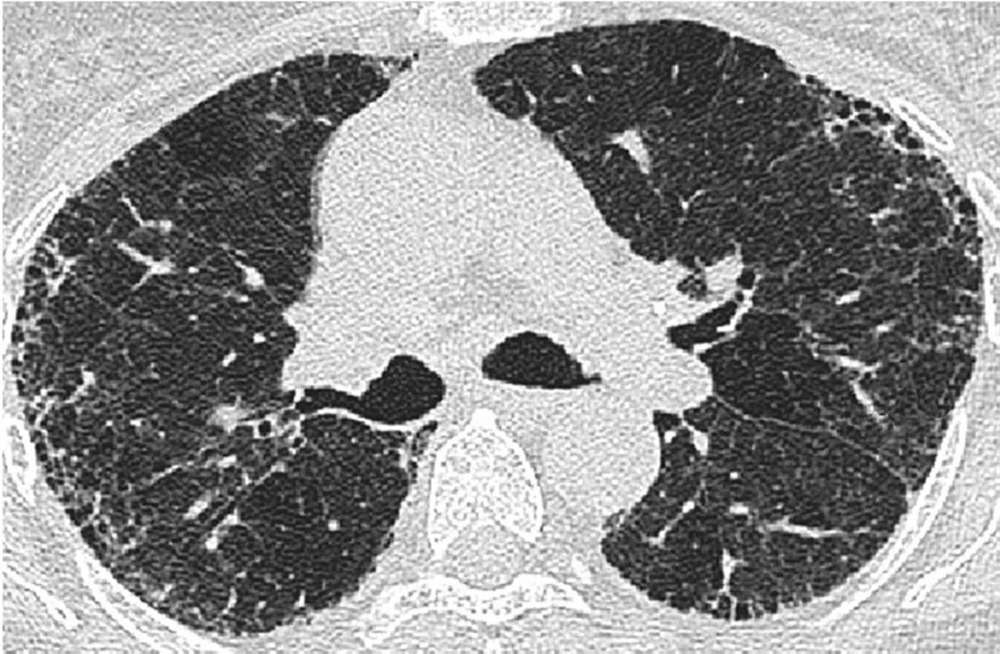
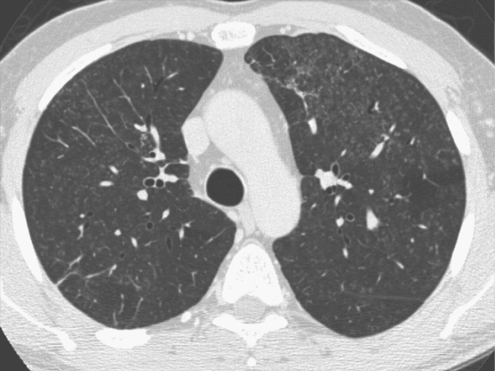
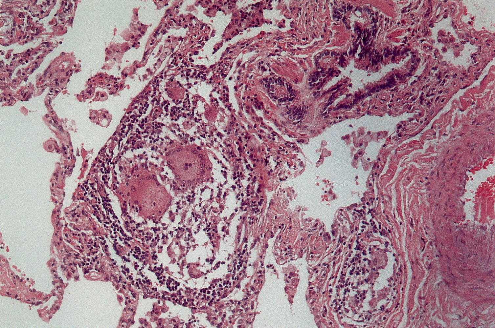
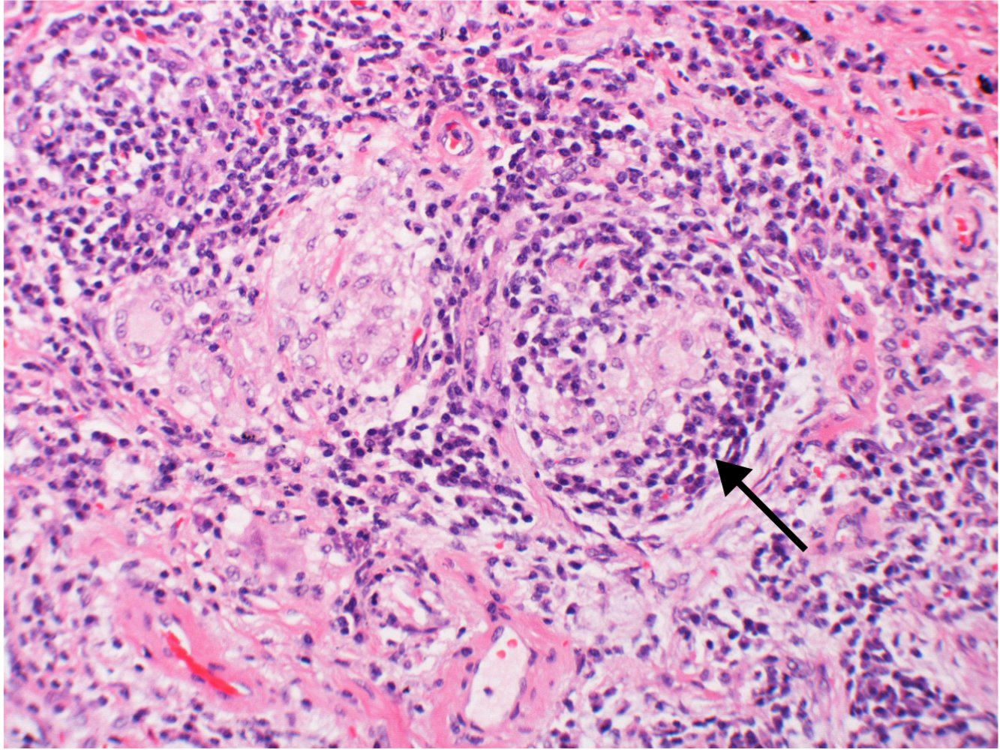

# Hypersensitivity pneumonitis

*Categories: Clinical knowledge > Internal medicine > Pulmonology > Restrictive lung diseases > Hypersensitivity pneumonitis*

[Original Article Link](https://coursology-qbank.com/amboss/article/kh0mVf)

---

## Summary

Hypersensitivity <u>pneumonitis</u> (HP) is a <u>hypersensitivity reaction</u> caused by inhalation of environmental and/or occupational <u>antigens</u>, manifesting in <u>interstitial lung disease</u> (<u>ILD</u>). Individuals affected by HP are most commonly exposed to animal <u>proteins</u> (especially birds), fungi, bacteria, or inorganic chemicals. HP can be classified as <u>fibrotic</u> or nonfibrotic based on findings on <u>high-resolution CT</u> (<u>HRCT</u>) of the chest. Onset may be acute with <u>constitutional symptoms</u>, <u>flu-like symptoms</u>, and <u>leukocytosis</u>, or more insidious (e.g., <u>cough</u>, <u>dyspnea</u>, fatigue, and weight loss). Diagnosis is based on exposure history and evidence of <u>fibrosis</u> on imaging, <u>lymphocytosis</u> on <u>bronchoalveolar lavage</u>, and <u>histopathology</u> showing poorly formed <u>noncaseating granulomas</u> or <u>mononuclear cell</u> infiltrate. Most acute episodes are <u>self-limited</u> and resolve with <u>antigen</u> avoidance. Patients with persistent symptoms after <u>antigen</u> removal often receive <u>immunosuppressants</u> (e.g., <u>glucocorticoids</u>). Patients with refractory <u>fibrotic</u> HP may ultimately require <u>lung transplantation</u>.

---

## Etiology

* Combined type III <u>hypersensitivity reaction</u> and <u>type IV hypersensitivity reaction</u> with genetic predisposition

* Inhalation of organic particles (< 5 microns), primarily through <u>occupational exposure</u> (notifiable <u>occupational disease</u>) [[1]](https://coursology-qbank.com/amboss/article/8paOrl)

* Farmers are frequently affected

| Overview of antigens and diseases in hypersensitivity pneumonitis |  |  |
| --- | --- | --- |
|  |  <u>Antigen</u> Source [[2]](https://coursology-qbank.com/amboss/article/upaprl) | Disease |
| Animal <u>proteins</u> |   * Avian <u>proteins</u>  * Exposure to droppings, serum, or feathers of birds (e.g., parakeets, canaries, chickens, pigeons)    |  * Pigeon breeder's lung   |
| Microorganisms |  * Actinomycete spores from air conditioners, humidifiers, and water reservoirs   |  * Humidifier lung (air-conditioner setting)   |
|  * Actinomycete spores from moldy hay   |  * Farmer's lung   |  |
|  * Actinomycete spores from sugar cane   |  * Bagassosis   |  |
|  * Penicillium casei or P. roqueforti spores from cheese casings   |  * Cheese washer's lung   |  |
|  * Actinomycete spores from moldy compost   |  * Mushroom worker's lung (compost treatment)   |  |
|  * <u>Aspergillus</u> clavatus spores from moldy paints   |  * Malt worker's lung   |  |
|  * Grain weevil dust   |  * Grain handler's lung   |  |
|  * Various bacteria in sawdust (through logging)   |  * Woodworker's lung   |  |
|  * <u>Mycobacterium avium complex</u> (associated with the use of hot tubs)   |  * Hot tub lung [[3]](https://coursology-qbank.com/amboss/article/cfXaOx)   |  |
| Chemical substances |  * <u>Isocyanates</u> (used in the adhesive and foam industry)   |  * Chemical worker's lung   |

> [!TIP]
> Smokers are less likely to be symptomatic because they have a decreased <u>immune response</u> to new <u>antigens</u>.

---

## Clinical features

* Acute: typically within 12 hours of exposure to the inciting <u>antigen</u> [[4]](https://coursology-qbank.com/amboss/article/Mx1MCQ0)

* <u>Flu-like</u> symptoms: <u>fever</u>, chills, <u>malaise</u>, <u>cough</u>, <u>headache</u>

* <u>Dyspnea</u> without <u>wheezing</u>

* Chest tightness [[5]](https://coursology-qbank.com/amboss/article/-2XD4x)

* Diffuse fine <u>crackles</u> and a late inspiratory squawk  upon <u>auscultation</u> [[6]](https://coursology-qbank.com/amboss/article/L1Wwh40)

* Symptoms subside within hours to days after removal of the inciting <u>antigen</u>.

* Chronic: after weeks to years of <u>antigen</u> exposure [[4]](https://coursology-qbank.com/amboss/article/Mx1MCQ0)

* Insidious onset of fatigue, <u>cough</u>, progressive <u>dyspnea</u>, <u>cyanosis</u>

* Bilateral <u>rales</u>

* Weight loss

> [!TIP]
> Patients with chronic HP do not necessarily have a history of acute HP. [[7]](https://coursology-qbank.com/amboss/article/A3cROX0)

> [!TIP]
> A recurrent <u>common cold</u> with an irritating <u>cough</u> and <u>fever</u> may indicate hypersensitivity <u>pneumonitis</u>.

---

## Diagnosis

The diagnosis of HP is based on a history of <u>antigen</u> exposure, typical clinical and radiologic features, and supportive diagnostic studies.

### Approach [[7]](https://coursology-qbank.com/amboss/article/A3cROX0)[[8]](https://coursology-qbank.com/amboss/article/MO1MGS0)

* Perform a thorough occupational and environmental exposure history to identify potential inciting <u>antigens</u>.

* Obtain a <u>high-resolution CT</u> (<u>HRCT</u>) for all patients.

* Consult a <u>multidisciplinary care</u> team to guide additional studies. [[7]](https://coursology-qbank.com/amboss/article/A3cROX0)[[8]](https://coursology-qbank.com/amboss/article/MO1MGS0)

> [!TIP]
> Clinical improvement after <u>antigen</u> avoidance supports the diagnosis of HP, but lack of improvement should not be used to rule out the diagnosis. [[7]](https://coursology-qbank.com/amboss/article/A3cROX0)

### <u>High-resolution CT</u> [[7]](https://coursology-qbank.com/amboss/article/A3cROX0)[[8]](https://coursology-qbank.com/amboss/article/MO1MGS0)

Findings are used to classify HP as <u>fibrotic</u> or nonfibrotic (i.e., purely inflammatory), which impacts further workup, treatment, and prognosis.

* Obtain an <u>HRCT</u> for all patients.  [[9]](https://coursology-qbank.com/amboss/article/UvcbzV0)

* Typical findings include:

* Ill-defined centrilobular <u>nodules</u>

* <u>Honeycombing</u> (irreversible <u>fibrotic</u> changes) with or without <u>emphysema</u>

* Thickening of alveolar septa

* <u>Traction bronchiectasis</u> or <u>bronchiolectasis</u>

* <u>Ground-glass opacities</u> with inspiratory mosaic attenuation  or <u>three-density pattern</u>   [[8]](https://coursology-qbank.com/amboss/article/MO1MGS0)

* Upper or midlung predominance and diffuse distribution in the <u>axial plane</u>

> [!TIP]
> Atypical <u>HRCT</u> findings for HP (e.g., <u>usual interstitial pneumonia</u> pattern) may still be compatible with HP. Specialist consultation is recommended for determining the likelihood of HP versus other <u>causes of ILD</u>. [[7]](https://coursology-qbank.com/amboss/article/A3cROX0)

> [!TIP]
> Classification of HP patients into acute, subacute, or chronic HP does not have clear treatment or prognostic implications and is no longer recommended; patients are now classified based on the presence or absence of <u>fibrosis</u>. [[7]](https://coursology-qbank.com/amboss/article/A3cROX0)[[8]](https://coursology-qbank.com/amboss/article/MO1MGS0)

Fibrotic hypersensitivity pneumonitis with mosaic attenuation

Hypersensitivity pneumonitis

### Additional studies [[7]](https://coursology-qbank.com/amboss/article/A3cROX0)[[8]](https://coursology-qbank.com/amboss/article/MO1MGS0)

Additional studies should be considered in consultation with a <u>multidisciplinary care</u> team (e.g., pulmonology, radiology, pathology, and occupational medicine). See also “<u>Diagnostics for ILD</u>” for a broader workup.

* <u>Bronchoalveolar lavage</u> (<u>BAL</u>)

* Consider <u>BAL</u> for all patients to further support the diagnosis or exclude differential diagnoses (e.g., infection).   [[7]](https://coursology-qbank.com/amboss/article/A3cROX0)

* Supportive findings: <u>Lymphocytosis</u> (e.g., 20–30 %) is highly sensitive for HP.  [[7]](https://coursology-qbank.com/amboss/article/A3cROX0)[[8]](https://coursology-qbank.com/amboss/article/MO1MGS0)

* <u>Serology</u>: The targeted use of <u>antigen</u>-specific <u>IgA</u> and/or <u>IgG antibodies</u> can support the diagnosis.   [[7]](https://coursology-qbank.com/amboss/article/A3cROX0)

* <u>Lung</u> <u>biopsy</u>

* Consider if noninvasive testing has yielded inconclusive results. [[7]](https://coursology-qbank.com/amboss/article/A3cROX0)[[8]](https://coursology-qbank.com/amboss/article/MO1MGS0)

* Supportive findings: <u>noncaseating granulomas</u> with <u>lymphocytes</u> and polynuclear <u>giant cells</u>

* <u>Pulmonary function testing</u>: restrictive pattern; see “<u>PFT findings in obstructive vs. restrictive lung diseases</u>.”  [[9]](https://coursology-qbank.com/amboss/article/UvcbzV0)[[10]](https://coursology-qbank.com/amboss/article/tEcXxV0)

> [!TIP]
> <u>Antigen</u>-specific inhalation challenge and specific <u>lymphocyte</u> <u>proliferation</u> testing (i.e., in-vitro assessment of polyclonal <u>T-cell</u> response after <u>antigen</u> exposure) are no longer recommended. [[7]](https://coursology-qbank.com/amboss/article/A3cROX0)

Hypersensitivity pneumonitis

Hypersensitivity pneumonitis

---

## Differential diagnoses

* See “<u>Differential diagnosis of acute cough</u>.”

* See “<u>Differential diagnosis of chronic cough</u>.”

* See “<u>Etiology of interstitial lung disease</u>.”

The differential diagnoses listed here are not exhaustive.

---

## Treatment

<u>Antigen</u> avoidance, supportive <u>management of ILD</u>, and specialist-directed pharmacotherapy are the mainstays of therapy. Consider <u>lung transplantation</u> for patients with <u>fibrotic</u> HP that does not respond to medical therapy.

### Pharmacotherapy [[4]](https://coursology-qbank.com/amboss/article/Mx1MCQ0)

* <u>Immunosuppressants</u>

* <u>Glucocorticoid</u> therapy

* Additional agents (e.g., <u>mycophenolate mofetil</u>, <u>azathioprine</u>, <u>rituximab</u>) may also be used in combination with <u>glucocorticoids</u> and/or as <u>glucocorticoid-sparing agents</u>.

* Antifibrotic drugs (e.g., <u>nintedanib</u>, <u>pirfenidone</u>): may decrease disease progression in patients with <u>fibrotic</u> HP.  [[11]](https://coursology-qbank.com/amboss/article/bfXHkx)[[12]](https://coursology-qbank.com/amboss/article/XfX9kx)

---

## Complications

* <u>Respiratory failure</u>

* <u>Pulmonary heart disease</u> [[2]](https://coursology-qbank.com/amboss/article/upaprl)

We list the most important complications. The selection is not exhaustive.

---

## Prognosis

* Favorable in the acute stage, but the disease recurs and worsens upon re-exposure

* Worsens with severity of <u>fibrosis</u>

---