# Interstitial lung diseases

*Categories: Clinical knowledge > Internal medicine > Pulmonology > Restrictive lung diseases > Interstitial lung diseases*

[Original Article Link](https://coursology-qbank.com/amboss/article/Nh0-Vf)

---

## Summary

<u>Interstitial</u> <u>lung</u> diseases (ILDs) are a diverse group of rare, highly morbid pulmonary disorders characterized by inflammation and progressive scarring (<u>fibrosis</u>) of the <u>lungs</u>. The most common types of ILD are <u>idiopathic pulmonary fibrosis</u> (<u>IPF</u>), <u>connective tissue disease</u>-associated ILD (<u>CTD-ILD</u>), chronic <u>hypersensitivity pneumonitis</u>, and smoking-related ILD. <u>Cough</u> and progressive <u>exertional dyspnea</u> are the most common symptoms. Bibasilar inspiratory <u>crackles</u> or <u>rales</u> are typically heard on <u>auscultation</u>. While most forms of ILD have similar clinical features, different types of ILD have unique epidemiological and radiographic features. A multidisciplinary approach is ideal for distinguishing <u>IPF</u> from other types of ILD, based on a thorough <u>medical history</u> and <u>HRCT</u> findings. <u>Bronchoscopy</u> or surgical <u>lung</u> <u>biopsy</u> is sometimes necessary to confirm the diagnosis. <u>Smoking cessation</u>, removal of exposures, symptom management, and <u>advance care planning</u> are central to the management of all forms of ILD. Long-term treatment of <u>IPF</u> may include antifibrotic agents. <u>Corticosteroids</u> should only be used to treat select cases of <u>acute exacerbations of IPF</u>. For other <u>causes of ILD</u>, treatment may involve <u>systemic immunomodulators</u> targeting the underlying cause (e.g., <u>rheumatoid arthritis</u>). Advanced stages of ILD can result in <u>pulmonary hypertension</u> and <u>right heart failure</u>. <u>Lung transplantation</u> is the only curative treatment.

---

## Etiology

### <u>Idiopathic interstitial pneumonias</u> (IIPs)

* <u>Idiopathic pulmonary fibrosis</u> (<u>IPF</u>)

* Other IIPs

* <u>Acute interstitial pneumonia</u> (<u>AIP</u>)

* <u>Cryptogenic organizing pneumonia</u> (<u>COP</u>)

* Respiratory <u>bronchiolitis</u>-associated <u>interstitial</u> <u>lung</u> disease (<u>RB-ILD</u>)

* <u>Desquamative interstitial pneumonia</u> (<u>DIP</u>)

* <u>Nonspecific interstitial pneumonia</u> (<u>NSIP</u>)

* <u>Lymphoid interstitial pneumonia</u> (LIP)

* <u>Idiopathic pleuroparenchymal fibroelastosis</u>

### Secondary to a known cause

#### Exposure-related (environmental and occupational)

* <u>Hypersensitivity pneumonitis</u> (<u>extrinsic allergic alveolitis</u>)

* <u>Farmer's lung</u>

* <u>Pigeon breeder's lung</u>

* <u>Chemical worker's lung</u>

* <u>Pneumoconioses</u>

* Coal worker's <u>lung</u>

* <u>Asbestosis</u>

* <u>Silicosis</u>

* <u>Berylliosis</u>

* <u>Radiation pneumonitis</u>

* Substance-induced ILD

* <u>Chemotherapeutic agents</u>

* <u>Bleomycin</u>

* <u>Busulfan</u>

* <u>Methotrexate</u>

* Other medications

* <u>Amiodarone</u>

* <u>Nitrofurantoin</u> (see “<u>Nitrofurantoin-induced lung disease</u>”)

* <u>Phenytoin</u>

* <u>Penicillamine</u>

* Other substances

* <u>Cocaine</u>

* <u>Heroin</u>

#### Secondary to underlying disease

* <u>Connective tissue diseases</u>

* <u>Systemic sclerosis</u>

* <u>Polymyositis</u>-<u>dermatomyositis</u>

* <u>Rheumatoid arthritis</u>

* <u>Systemic lupus erythematosus</u>

* <u>Mixed connective tissue disease</u>

* <u>Granulomatous diseases</u>: <u>sarcoidosis</u>

* <u>Vasculitis</u>

* <u>Granulomatosis with polyangiitis</u>

* <u>Eosinophilic granulomatosis with polyangiitis</u>

* <u>Hypersensitivity reactions</u>: <u>eosinophilic pneumonia</u>

* Alveolar filling diseases

* <u>Anti-glomerular basement membrane</u> <u>antibody</u> (<u>Goodpasture syndrome</u>)

* <u>Idiopathic pulmonary hemosiderosis</u>

* <u>Pulmonary alveolar proteinosis</u>

* Infectious diseases

* <u>Tuberculosis</u>

* <u>Legionellosis</u>

* Miscellaneous

* Pulmonary <u>Langerhans cell histiocytosis</u>

* <u>Amyloidosis</u>

* <u>Lymphangioleiomyomatosis</u> (<u>LAM</u>)

---

## Classification of idiopathic interstitial pneumonias

### Idiopathic pulmonary fibrosis (<u>IPF</u>)

* Definition: most common type of ILD, characterized by irreversible <u>pulmonary fibrosis</u> and impaired <u>pulmonary function</u>

* <u>Epidemiology</u>

* <u>Incidence</u>: 10:100,000 cases per year [[2]](https://coursology-qbank.com/amboss/article/x3cEkX0)

* Affects mostly men 50–70 years of age

* Diagnosis [[3]](https://coursology-qbank.com/amboss/article/qhcCUX0)

* Requires the absence of other known <u>causes of interstitial lung disease</u> (e.g., medication, environmental exposures, <u>CTD-ILD</u>)

* Presence of <u>usual interstitial pneumonia</u> (<u>UIP</u>) pattern on <u>HRCT</u> or <u>histopathologic studies</u>

* Honeycomb appearance with or without <u>traction bronchiectasis</u>

* <u>Ground-glass opacification</u> with superimposed reticular abnormalities

* Bibasal subpleural distribution

* Prognosis: <u>Respiratory failure</u> usually occurs within 3–7 years.

### Acute interstitial pneumonia (<u>AIP</u>)

* Definition: a severe, acute ILD that can rapidly progress to <u>respiratory failure</u>

* <u>Epidemiology</u>: most commonly affects individuals without preexisting <u>lung</u> conditions

* Diagnostics: histologically characterized by diffuse alveolar damage

### Cryptogenic organizing pneumonia (<u>COP</u>)

* Definition: a rare, type of ILD characterized by inflammation of the <u>bronchioles</u>, alveolar ducts, and alveolar walls

* <u>Epidemiology</u>

* <u>Incidence</u>: 1–3 per 100,000 hospital admissions [[4]](https://coursology-qbank.com/amboss/article/B3czkX0)

* Affects mostly individuals 40–50 years of age

* Diagnostics: histologically characterized by the presence of Masson bodies (<u>granulation tissue</u> buds made of foamy <u>macrophages</u>, <u>mononuclear cells</u>, and fibrous tissue) and chronic patchy <u>interstitial</u> inflammation without <u>fibrosis</u>

### Nonspecific interstitial pneumonia (<u>NSIP</u>)

* Definition: a type of ILD characterized by a mild to moderate chronic <u>interstitial</u> inflammation, without specific histopathologic findings that characterize <u>UIP</u>

* <u>Epidemiology</u>: affects nonsmoker women 50–60 years of age

* Etiology: associated with <u>connective tissue diseases</u> (e.g., <u>systemic sclerosis</u>), <u>HIV infection</u>, and <u>hypersensitivity pneumonitis</u>

* Diagnostics

* Immediate subpleural sparing on imaging studies is considered specific for <u>NSIP</u>.

* Histological findings include <u>interstitial</u> thickening due to <u>fibrosis</u> and/or inflammatory cells

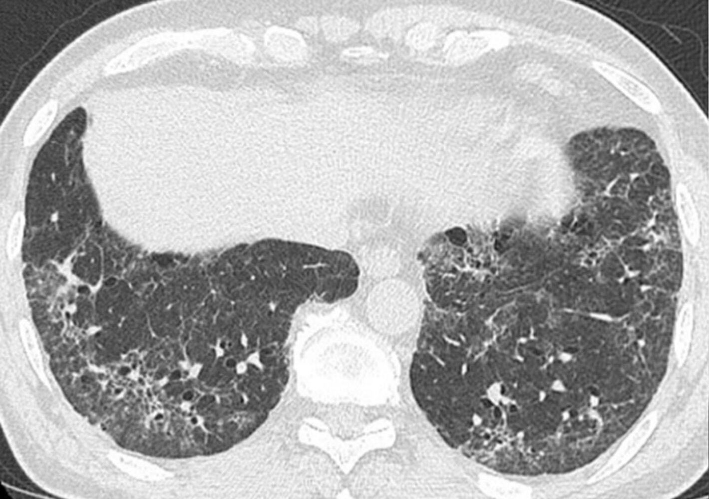

Nonspecific interstitial pneumonia (NSIP)

### Desquamative interstitial pneumonia (<u>DIP</u>)

* Definition: a rare type of ILD characterized by <u>lung</u> inflammation due to intraalveolar mononuclear infiltration

* <u>Epidemiology</u>: affects men 40–50 years of age with a history of smoking

* Diagnostics

* Imaging studies show ground-glass opacities in the lower pulmonary lobes, usually without peripheral reticular opacities

* Histologically characterized by intraalveolar accumulation of <u>macrophages</u> and thickening of alveolar septa

### Respiratory bronchiolitis-interstitial lung disease (<u>RB-ILD</u>)

* Definition: a rare, mild ILD characterized by bronchiolar inflammation

* <u>Epidemiology</u>: affects individuals 30–50 years of age with a history of smoking

* Diagnostics: histologically characterized by accumulation of brown pigmented <u>macrophages</u> and bronchiolar <u>submucosal</u> inflammation

### Lymphocytic interstitial pneumonia (LIP)

* Definition: a rare ILD characterized by <u>lymphocytic</u> infiltration of the alveolar and alveolar septa

* <u>Epidemiology</u>: affects adults (especially women) of all ages

* Etiology: Associated with autoimmune (e.g., Sjögren disease, <u>SLE</u>) disorders, <u>lymphoproliferative disorders</u>, and <u>HIV infection</u>

* Diagnostics: histologically characterized by diffuse alveolar and <u>interstitial</u> infiltration with <u>plasma cells</u> and polyclonal <u>lymphocytes</u>

### Idiopathic pleuroparenchymal fibroelastosis (<u>IPPFE</u>)

* Definition: a rare ILD characterized by pleural and subpleural <u>fibrosis</u>

* <u>Epidemiology</u>: affects nonsmoker individuals between 50 and 60 years of age

* Diagnostics

* Imaging studies show pleural and subpleural thickening of the upper pulmonary lobes on imaging studies

* Histological findings include intraalveolar <u>fibrosis</u> and elastosis of the alveolar walls

---

## Overview of pneumoconioses

|  Overview of pneumoconioses [[5]](https://coursology-qbank.com/amboss/article/QFau3m)[[6]](https://coursology-qbank.com/amboss/article/6gcjwb0)  |  |  |  |  |
| --- | --- | --- | --- | --- |
| Type | Etiology | Population at risk | Clinical features | Chest <u>x-ray</u> |
|  <u>Asbestosis</u> [[7]](https://coursology-qbank.com/amboss/article/QYduKo0)[[8]](https://coursology-qbank.com/amboss/article/RYdlKo0)  |  * Airborne <u>asbestos</u> fibers   |   * <u>Asbestos</u> miners and millers  * Brake linings and insulation manufacturers  * Ship construction workers  * Demolishers  * Firefighters  * Plumbers  * Roofers    |   * Symptoms typically develop 20–30 years after initial exposure.  * Exertional <u>dyspnea</u>  * Nonproductive <u>cough</u>, which may progress to a productive <u>cough</u>  * <u>Digital clubbing</u>  * Microscopic <u>asbestos bodies</u> (a type of <u>ferruginous body</u>) in alveolar septa on <u>histology</u>  * Malignant <u>asbestos-related diseases</u> include:  * <u>Lung cancer</u> (smoking increases the risk): <u>bronchogenic carcinoma</u> is most common  * <u>Mesothelioma</u>    |   * Diffuse bilateral infiltrates predominantly in the lower lobes  * <u>Interstitial</u> <u>fibrosis</u>  * Calcified <u>pleural plaques</u> (usually indicate benign pleural disease)  * <u>Pleural effusion</u>    |
|  <u>Silicosis</u>    |  * Crystalline silica dust   |   * Miners  * Workers of quarries, pottery production, sandblasting, glass manufacturers  * Construction workers    |   * Acute <u>silicosis</u>  * <u>Dyspnea</u>, <u>cough</u>  * Pleuritic <u>pain</u>  * Chronic <u>silicosis</u>  * <u>Chronic cough</u> (often with <u>sputum</u>)  * <u>Exertional dyspnea</u>  * Fatigue  * Weight loss  * Complications  * Increased risk of <u>tuberculosis</u> (annual <u>PPD</u> test is recommended)  * Progressive massive <u>fibrosis</u>  * <u>Respiratory failure</u>  * <u>Cor pulmonale</u>    |   * <u>Eggshell calcifications</u>  * Large number of rounded, solitary, small (< 1 cm) opacities particularly in the upper lobe of the <u>lungs</u>  * Bilateral diffuse ground-glass opacities    |
|  Aluminosis [[9]](https://coursology-qbank.com/amboss/article/hxbcwD)[[10]](https://coursology-qbank.com/amboss/article/jFa_3m)  |  * Aluminum dust   |  * Welders (e.g., automobile industry)   |   * Symptoms occur after months to years of exposure.  * Complications  * <u>Bullous</u> <u>emphysema</u>  * <u>Spontaneous pneumothorax</u>    |   * Nodular or diffuse infiltrates (predominantly affect the upper <u>lung</u> fields)  * Small cystic radiolucencies (<u>honeycombing</u>) [[10]](https://coursology-qbank.com/amboss/article/jFa_3m)    |
|  Anthracosis [[11]](https://coursology-qbank.com/amboss/article/3xbSwD)[[12]](https://coursology-qbank.com/amboss/article/PFaWRm)  |  * Carbon dust and sooty air   |   * Urban population  * Coal miners    |   * Milder than other types of <u>pneumoconiosis</u>, usually asymptomatic  * Upper lobes of the <u>lungs</u> are primarily affected.  * <u>Pulmonary fibrosis</u> rarely occurs.    |  * Heterogeneous pulmonary infiltrates, with/without mass lesion   |
|  Coal workers' pneumoconiosis [[11]](https://coursology-qbank.com/amboss/article/3xbSwD)[[12]](https://coursology-qbank.com/amboss/article/PFaWRm)  |   * Prolonged exposure to large amounts of coal dust  * Inflammation and <u>fibrosis</u> induced by carbon-laden <u>macrophages</u>    |   * A more severe form of <u>anthracosis</u>  * Complications  * <u>Chronic bronchitis</u> that progresses to progressive massive <u>pulmonary fibrosis</u>  * ↑ Risk of <u>Caplan syndrome</u>    |  * Fine nodular opacifications (< 1 cm) in upper <u>lung</u> zone   |  |
| Berylliosis |  * Beryllium   |  * Workers in manufacturing industries where alloys are frequently used (often high-tech)  * Aerospace engineering  * Ceramics industries  * Dental material production  * Nuclear and electronics plants  * Dye manufacturing  * Foundries   |   * Noncaseating granulomatous disease affecting the <u>lungs</u> and <u>skin</u>  * Chronic <u>beryllium</u> disease: Progressive <u>dyspnea</u> may occur within a few days of high-grade exposure.  * Treatment: chronic <u>glucocorticoids</u> [[13]](https://coursology-qbank.com/amboss/article/jUb_1G)  * Complications [[14]](https://coursology-qbank.com/amboss/article/iUbJ1G)  * ↑ Risk of <u>lung cancer</u>  * <u>Cor pulmonale</u>    |   * Reticular <u>interstitial</u> pattern (similar to <u>sarcoidosis</u>) that affects the upper lobes  * In some cases, hilar <u>lymphadenopathy</u>    |
|  Pulmonary siderosis [[15]](https://coursology-qbank.com/amboss/article/RxblwD)[[16]](https://coursology-qbank.com/amboss/article/ixbJwD)  |  * <u>Iron</u> dust   |  * Welders, <u>iron</u> miners, foundry workers   |   * Usually asymptomatic  * Occasionally, presents with features similar to <u>COPD</u>  * Complications: <u>pulmonary fibrosis</u> (rarely occurs)    |  * Small, round, patchy shadows on <u>x-ray</u>   |
| Organic dust toxic syndrome |  * Organic dust contaminated with mycotoxins (e.g., from moldy grain or hay)   |  * Farmers working with grain, hay, silage, and confined animals (e.g., swine and poultry)   |   * <u>Fever</u>  * <u>Flu-like symptoms</u> approx. 4–12 hours after exposure  * Subsequent exposures may increase the risk of <u>Farmer's lung</u>.    |  * N/A   |
|  Byssinosis [[17]](https://coursology-qbank.com/amboss/article/KgcUwb0)  |   * Mainly dust from raw cotton  * Less commonly: flax, jute, hemp, and sisal dust    |  * Textile industry workers   |   * Symptoms diminish with prolonged exposure but manifest again with increased severity upon reexposure after a period nonexposure, e.g., a weekend.  * Acute <u>byssinosis</u>  * <u>Dyspnea</u>  * Chest tightness  * <u>Cough</u>  * <u>Wheezing</u>  * Chronic <u>byssinosis</u>  * Disappearance of cyclical symptoms  * Chronic productive <u>cough</u>  * Complications: <u>pulmonary fibrosis</u>    |  * Diffuse haziness, predominantly in the lower lobes of the <u>lungs</u>.   |

> [!NOTE]
> Although coal is mined from under the earth, the upper lobes of the <u>lungs</u> are primarily affected.

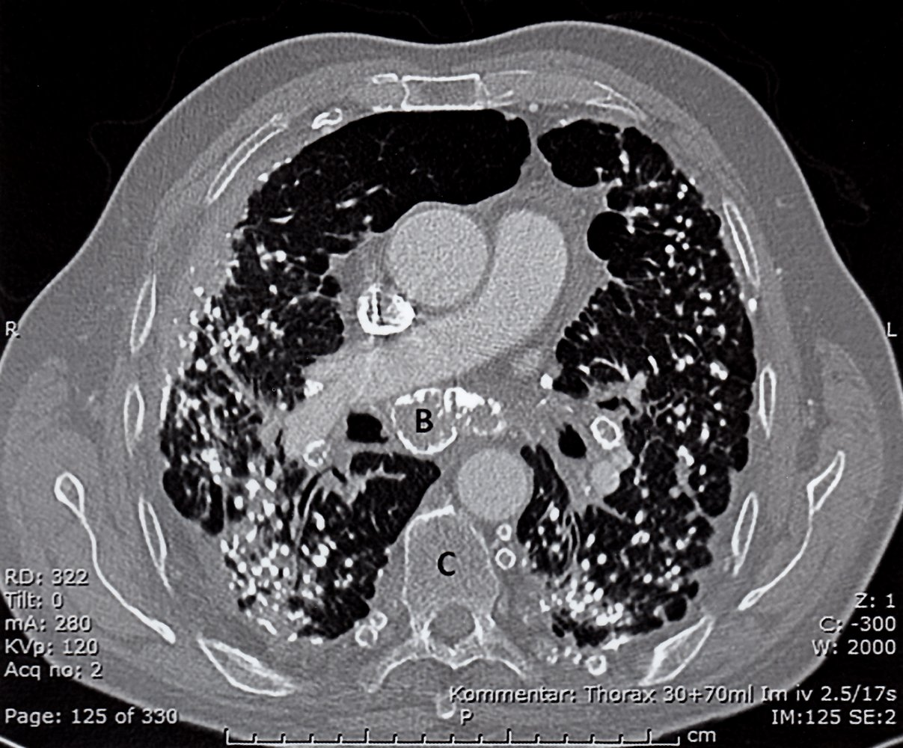

Silicosis

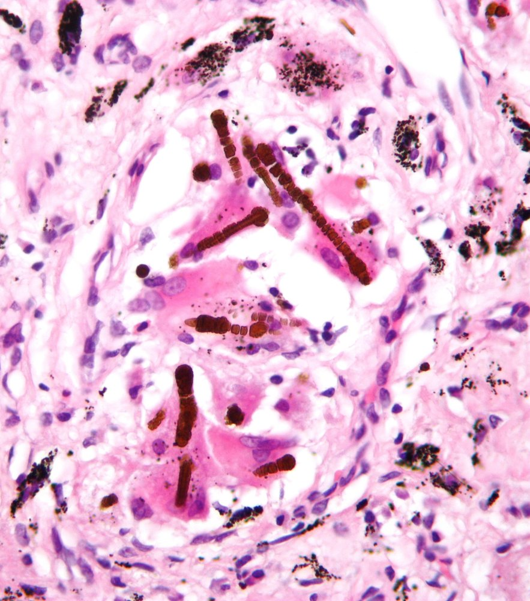

Pulmonary asbestosis

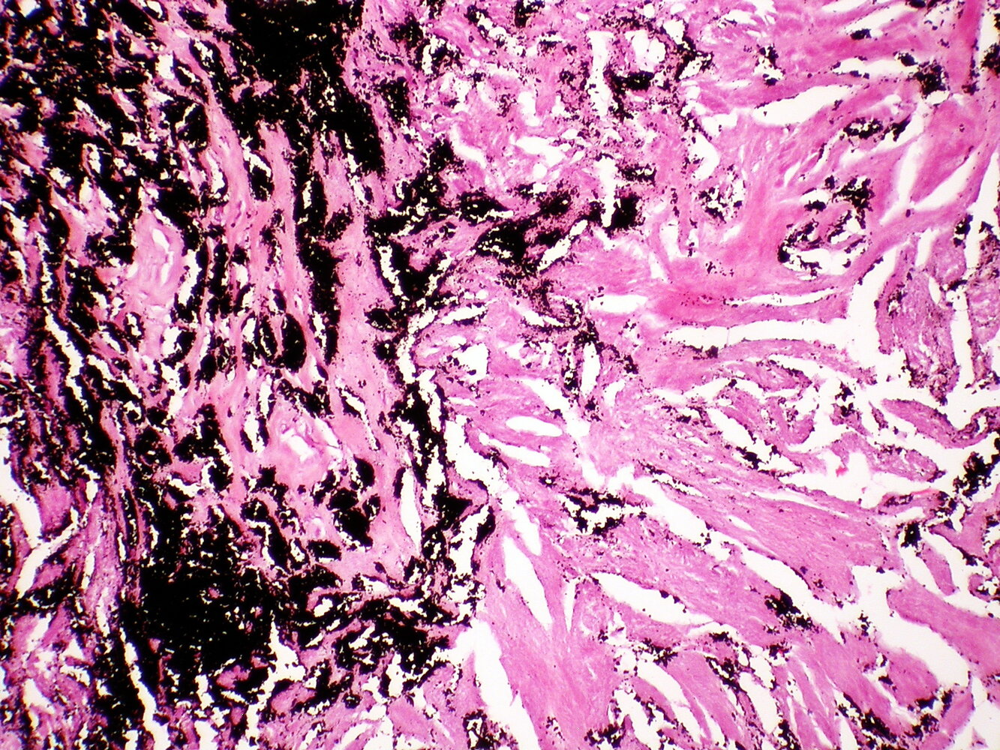

Anthracotic pigment in lung in coal worker's pneumoconiosis

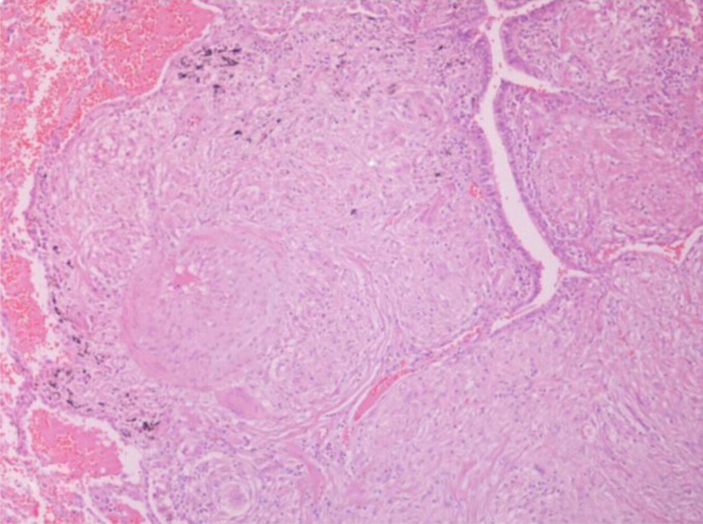

Noncaseating granuloma

---

## Pathophysiology

* General

* All types of ILDs share the same basic pathophysiology.

* Repeated cycles of tissue injury in the <u>lung parenchyma</u> with aberrant wound healing → collagenous <u>fibrosis</u> → remodeling of the pulmonary <u>interstitium</u> [[18]](https://coursology-qbank.com/amboss/article/8ebO0G)

* <u>Pneumoconiosis</u>: inhalation of dust particles →;  <u>phagocytosis</u> by <u>alveolar macrophages</u> → destruction of <u>alveolar macrophages</u>, inflammatory reaction → scarring, <u>granuloma</u> formation

---

## Clinical features

### Features

* Progressive <u>dyspnea</u>

* <u>Exertional dyspnea</u> that progresses to <u>dyspnea</u> at rest

* Patients may present with high-frequency, shallow breathing to compensate for <u>dyspnea</u>. [[19]](https://coursology-qbank.com/amboss/article/9jXNcy)

* Persistent nonproductive <u>cough</u>

* Bibasilar, inspiratory <u>crackles</u> or <u>rales</u> (velcro-like <u>rales</u>) on <u>auscultation</u>

* Fatigue

* <u>Fever</u> is common in <u>hypersensitivity pneumonitis</u> and <u>sarcoidosis</u>, but otherwise uncommon.

* Findings suggestive of <u>connective tissue disease</u>, <u>sarcoidosis</u>, or <u>vasculitis</u>

### Advanced disease

* <u>Digital clubbing</u> due to chronic <u>hypoxia</u>

* <u>Cyanosis</u>

* Loud inspiratory <u>wheeze</u>

---

## Diagnosis

### Approach [[3]](https://coursology-qbank.com/amboss/article/qhcCUX0)[[20]](https://coursology-qbank.com/amboss/article/GEcBCV0)[[21]](https://coursology-qbank.com/amboss/article/UvcbzV0)

* Perform a thorough clinical evaluation.

* <u>Past medical history</u> and <u>family history</u> for pulmonary and/or autoimmune conditions   [[3]](https://coursology-qbank.com/amboss/article/qhcCUX0)

* <u>Physical examination</u>, including evaluation for <u>signs of connective tissue disorders</u>

* Obtain <u>HRCT</u> of the chest to evaluate for <u>IPF</u> and other alternative diagnoses.  [[22]](https://coursology-qbank.com/amboss/article/tEcXxV0)

* Obtain <u>laboratory studies</u> to screen for <u>CTD-ILD</u>.

* Perform <u>pulmonary function tests</u> to assess disease severity and treatment response.

* If diagnosis remains unclear, consider:

* Additional <u>laboratory studies</u> based on clinical suspicion

* Invasive testing

> [!TIP]
> <u>Multidisciplinary care</u> helps increase diagnostic <u>accuracy</u>. [[3]](https://coursology-qbank.com/amboss/article/qhcCUX0)[[23]](https://coursology-qbank.com/amboss/article/sEctCV0)

### <u>High-resolution CT</u> (<u>HRCT</u>) chest [[3]](https://coursology-qbank.com/amboss/article/qhcCUX0)[[24]](https://coursology-qbank.com/amboss/article/CEcqBV0)[[25]](https://coursology-qbank.com/amboss/article/vT1AsT0)

<u>Usual interstitial pneumonia</u> (<u>UIP</u>) pattern is highly specific for <u>IPF</u>.

* Typical <u>UIP</u> pattern findings  

* Honeycombing: multiple cystic lesions within the <u>lung parenchyma</u> due to <u>fibrosis</u>

* Irregular thickening of intralobular septa

* Reticular pattern and mild <u>ground glass opacity</u> (<u>GGO</u>)

* Traction bronchiectasis (irreversible dilatation of the <u>bronchi</u> and <u>bronchioles</u> due to <u>fibrosis</u>)  or <u>bronchiolectasis</u>

* Pulmonary <u>ossification</u> may be seen.

* Other findings may be classified into:

* Probable <u>UIP</u>: some findings that support a diagnosis of <u>IPF</u>, e.g., a reticular pattern and <u>traction bronchiectasis</u>, but no <u>honeycombing</u>

* Indeterminate for <u>UIP</u>: nonspecific <u>fibrosis</u> that neither supports a diagnosis of <u>IPF</u> nor any alternative diagnosis

* Alternative diagnosis, e.g., <u>hypersensitivity pneumonitis</u> or <u>sarcoidosis</u>, can be made based on <u>HRCT</u> findings

* Interpretation

* If <u>UIP</u> pattern is present, a definitive diagnosis can be made without histopathologic confirmation.

* If other patterns are present, further evaluation is required to determine the cause.

> [!TIP]
> In patients with <u>IPF</u>, the extent of abnormalities on <u>HRCT</u> correlates with the severity of functional impairment. [[26]](https://coursology-qbank.com/amboss/article/bvcHAV0)

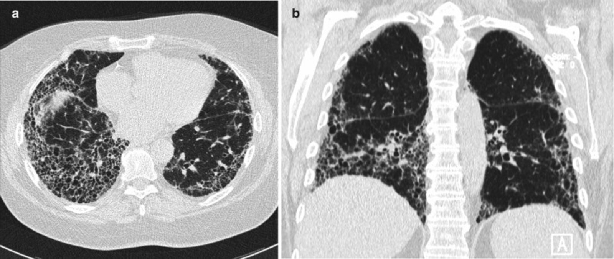

Usual interstitial pneumonia (UIP)

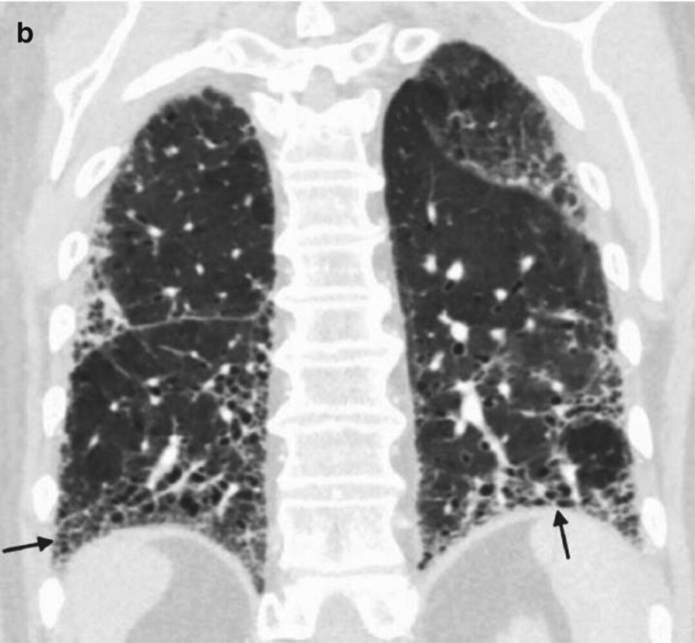

Idiopathic pulmonary fibrosis 2/2

Pulmonary fibrosis

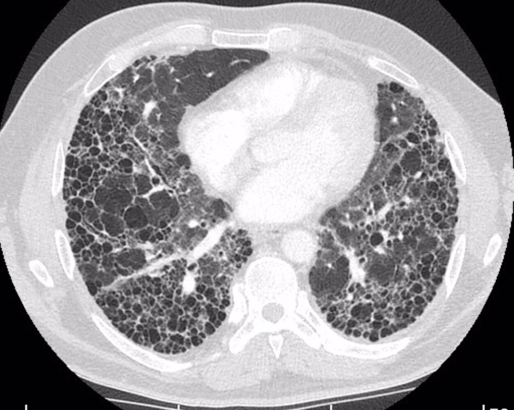

Pulmonary fibrosis from occupational exposure

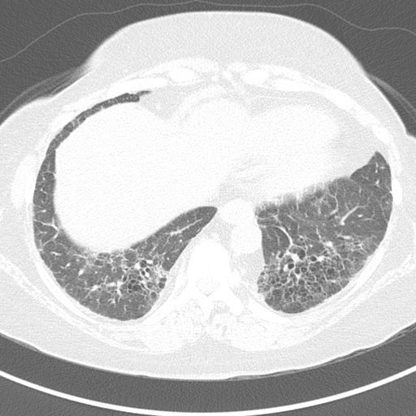

Rheumatoid-associated interstitial lung disease (RA-ILD)

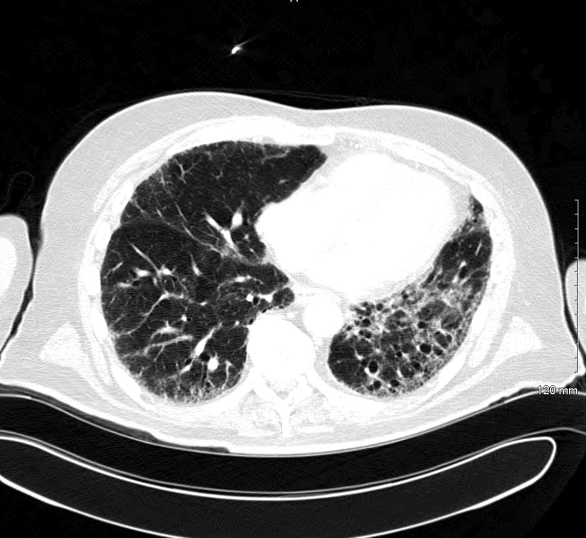

Chronic interstitial lung disease

### Laboratory evaluation for <u>CTD-ILD</u> [[3]](https://coursology-qbank.com/amboss/article/qhcCUX0)[[23]](https://coursology-qbank.com/amboss/article/sEctCV0)

* Obtain in all patients:

* <u>Autoantibodies</u>: <u>ANA</u>, <u>rheumatoid factor</u> and <u>anti-CCP</u>; , <u>myositis-specific antibodies</u> (e.g., <u>anti-Jo-1 antibodies</u>)

* May be elevated depending on underlying disease

* Consider additional studies on a case-by-case basis.

* <u>Inflammatory markers</u>: ↑ <u>CRP</u>, ↑ <u>ESR</u>

* Obtain in patients with clinical features of <u>myositis</u>: <u>muscle enzymes</u>, e.g., ↑ <u>aldolase</u>

> [!TIP]
> All patients should be screened for rheumatic and autoimmune diseases. [[3]](https://coursology-qbank.com/amboss/article/qhcCUX0)[[23]](https://coursology-qbank.com/amboss/article/sEctCV0)

### <u>Pulmonary function tests</u> (<u>PFTs</u>)

<u>PFTs</u> can help assess disease severity but do not identify a specific <u>cause of ILD</u>. [[22]](https://coursology-qbank.com/amboss/article/tEcXxV0)

* <u>Restrictive lung disease</u> pattern 

* ↓ <u>Total lung capacity</u> and ↓ <u>vital capacity</u>

* Normal or ↓ <u>FEV1</u>

* ↓ <u>FVC</u>

* Normal or ↑ <u>FEV1:FVC ratio</u>

* Decreased <u>diffusing capacity</u> for CO (<u>DLCO</u>): highly sensitive parameter

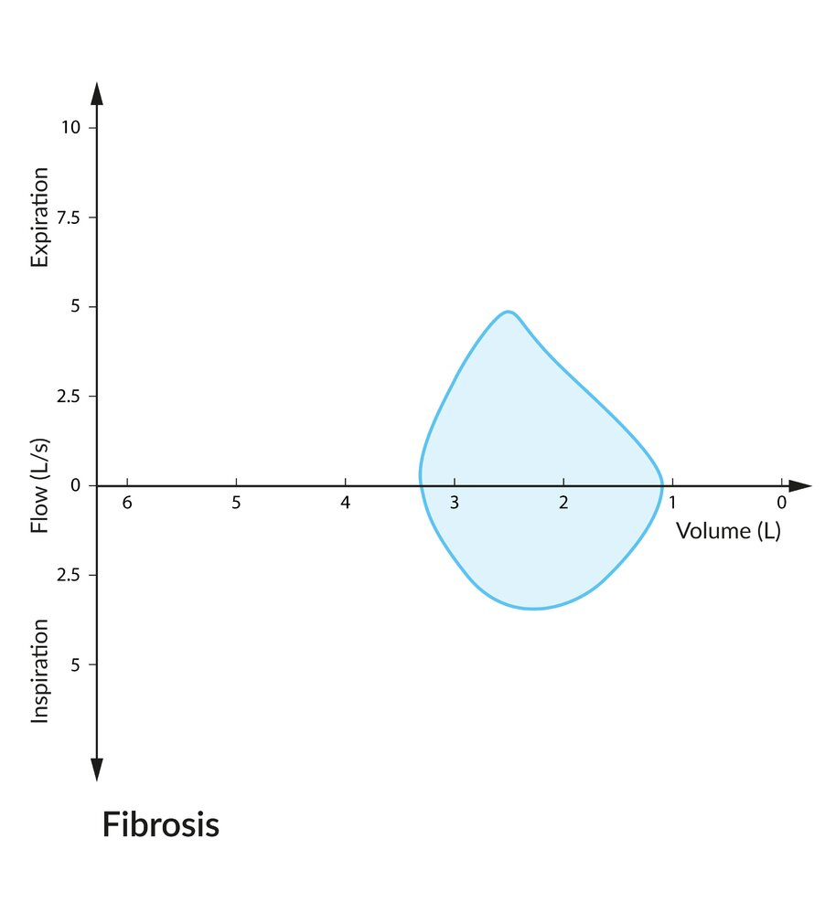

Flow-volume loop in fibrosis

### Additional studies

#### <u>X-ray chest</u> [[21]](https://coursology-qbank.com/amboss/article/UvcbzV0)

Findings are not sufficient for a diagnosis but can raise clinical suspicion for ILD. [[21]](https://coursology-qbank.com/amboss/article/UvcbzV0)

* Normal in approx. 10% of patients

* Predominantly basilar increase in reticular opacities (sign of <u>fibrosis</u>)

* Patients may have nodular or mixed patterns.

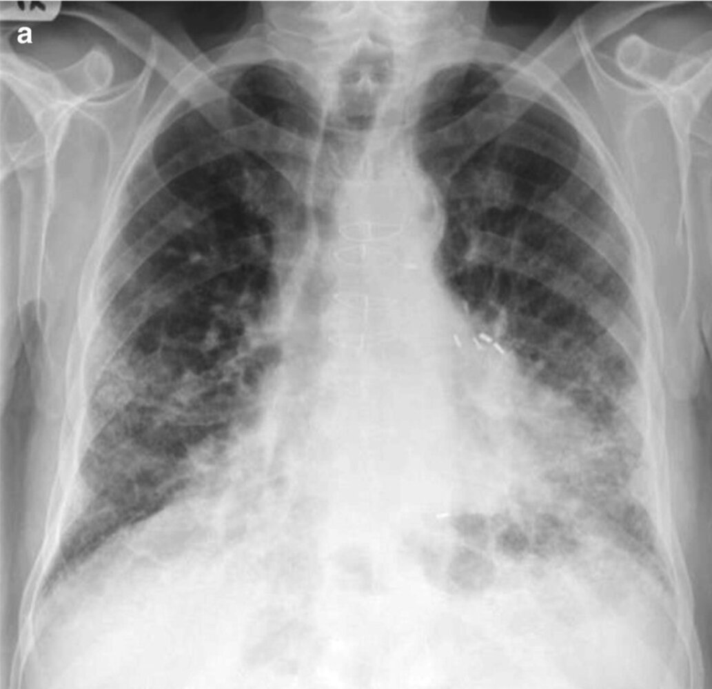

Idiopathic pulmonary fibrosis 1/2

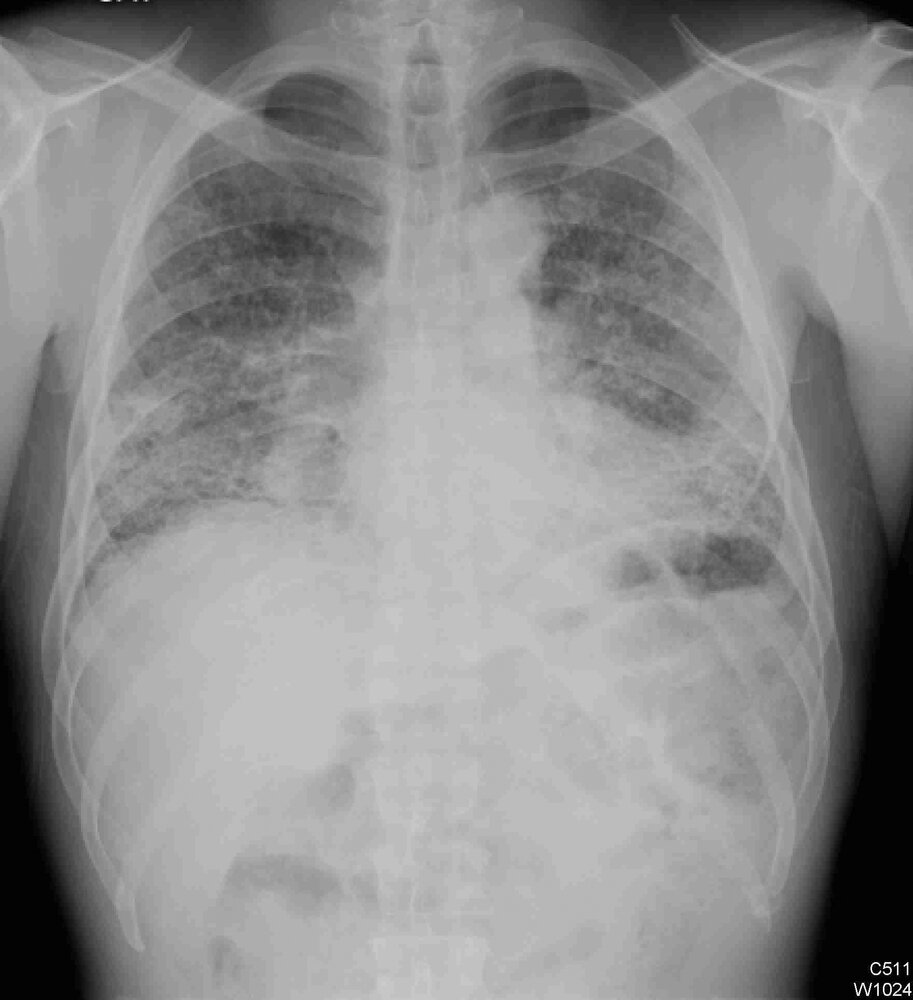

Interstitial lung disease

#### Additional <u>laboratory studies</u> [[21]](https://coursology-qbank.com/amboss/article/UvcbzV0)[[22]](https://coursology-qbank.com/amboss/article/tEcXxV0)[[24]](https://coursology-qbank.com/amboss/article/CEcqBV0)

* <u>CBC with differential</u>

* <u>Anemia</u>, e.g., <u>anemia of chronic disease</u> or due to occult pulmonary hemorrhage

* <u>Eosinophilia</u>, e.g., due to <u>hypersensitivity pneumonitis</u> or drug toxicity

* <u>Liver</u> enzymes: ↑ <u>GGT</u>, ↑ <u>ALT</u>, and/or ↑ <u>AST</u> may be consistent with <u>sarcoidosis</u>, <u>amyloidosis</u>, or <u>polymyositis</u>

* <u>BMP</u>: ↑ <u>creatinine</u> may be seen in <u>CTD-ILD</u>, <u>pulmonary-renal syndromes</u>, <u>sarcoidosis</u>, and <u>amyloidosis</u>

* <u>Urinalysis</u>: <u>RBC casts</u>, and/or <u>dysmorphic RBCs</u> may be seen in <u>vasculitis</u> and <u>pulmonary-renal syndromes</u>

* <u>ABG</u>: nonspecific findings in patients with ILD

* ↑ <u>Alveolar-arterial oxygen gradient</u>

* ↓ <u>PaO2</u>

* Serum biomarkers for <u>IPF</u>: not recommended   [[3]](https://coursology-qbank.com/amboss/article/qhcCUX0)

#### Invasive testing [[21]](https://coursology-qbank.com/amboss/article/UvcbzV0)[[27]](https://coursology-qbank.com/amboss/article/SvcyzV0)

Obtain invasive testing if the diagnosis remains unclear and results will affect management.

* <u>Bronchoscopy</u> with <u>bronchoalveolar lavage</u> (<u>BAL</u>): Cellular analysis may help identify an underlying <u>cause of ILD</u> and exclude <u>IPF</u>.  [[3]](https://coursology-qbank.com/amboss/article/qhcCUX0)

* Surgical <u>lung</u> <u>biopsy</u>   [[21]](https://coursology-qbank.com/amboss/article/UvcbzV0)[[28]](https://coursology-qbank.com/amboss/article/OX1Iy20)

* Obtain if the diagnosis remains unclear after <u>BAL</u>.

* <u>Biopsy</u> findings may show a histopathologic pattern of definite, probable, or indeterminate <u>UIP</u> ; or an alternative diagnosis.

> [!TIP]
> If <u>HRCT</u> shows a pattern of definite <u>UIP</u>, invasive testing is not usually necessary for diagnostic confirmation. [[3]](https://coursology-qbank.com/amboss/article/qhcCUX0)

---

## Management

### Approach [[24]](https://coursology-qbank.com/amboss/article/CEcqBV0)[[29]](https://coursology-qbank.com/amboss/article/PvcWZe0)

* Offer supportive management, including preventive measures.

* Refer all patients to pulmonology for:

* Pharmacological therapy depending on the <u>cause of ILD</u>

* Evaluation for <u>lung transplantation</u>

* Identify and treat common comorbidities, e.g., <u>GERD</u>, <u>pulmonary hypertension</u>, <u>major depressive disorder</u>. [[24]](https://coursology-qbank.com/amboss/article/CEcqBV0)[[25]](https://coursology-qbank.com/amboss/article/vT1AsT0)[[30]](https://coursology-qbank.com/amboss/article/bDcH1e0)

* Initiate early <u>advance care planning</u> while patients are still able to participate in decision-making.  [[31]](https://coursology-qbank.com/amboss/article/_vc5ce0)

> [!TIP]
> ILD is a chronic, progressive, life-limiting condition. Encourage <u>advance care planning</u> and early engagement with <u>palliative care</u>. [[29]](https://coursology-qbank.com/amboss/article/PvcWZe0)

### Supportive management [[24]](https://coursology-qbank.com/amboss/article/CEcqBV0)

* Encourage measures to prevent exacerbations and slow disease progression:

* <u>Counsel on smoking cessation</u> and treat tobacco-related disorders.

* Ensure <u>recommended vaccinations</u> are administered.

* Recommend avoidance of triggers for secondary <u>causes of ILD</u>.

* Offer <u>pulmonary rehabilitation</u>.  [[32]](https://coursology-qbank.com/amboss/article/jvc_-V0)[[33]](https://coursology-qbank.com/amboss/article/XDc91e0)

* Supplementary <u>oxygen therapy</u> as needed

* Symptom management

* Consider <u>cough suppressants</u> and referral for multimodal <u>speech therapy</u>.

* Consider <u>palliative pharmacotherapy for dyspnea</u> as indicated, e.g., <u>palliative anxiolysis</u>. [[31]](https://coursology-qbank.com/amboss/article/_vc5ce0)[[34]](https://coursology-qbank.com/amboss/article/zvcrce0)[[35]](https://coursology-qbank.com/amboss/article/ZDcZ1e0)

### Treatment of <u>IPF</u> [[24]](https://coursology-qbank.com/amboss/article/CEcqBV0)

* Pharmacological therapy

* Antifibrotic agents may reduce mortality and acute exacerbations and slow the decline in <u>FVC</u>. [[36]](https://coursology-qbank.com/amboss/article/HOYKF6)[[37]](https://coursology-qbank.com/amboss/article/sOYtF6)[[38]](https://coursology-qbank.com/amboss/article/0Sceyb0)

* Pirfenidone: inhibits <u>TGF-β</u>-stimulated <u>collagen synthesis</u>

* Nintedanib: inhibits <u>tyrosine kinases</u> that target fibrogenic growth factors, e.g., <u>VEGF</u>, <u>PDGF</u>, and <u>fibroblast</u> growth factor <u>receptor</u>

* <u>Immunosuppressive therapy</u> is not indicated.

* <u>Lung transplantation</u>: Refer for evaluation at the time of diagnosis. [[39]](https://coursology-qbank.com/amboss/article/kvcmZe0)

> [!WARNING]
> Do not start patients with <u>IPF</u> on <u>immunosuppressive therapy</u>; immunomodulation may worsen outcomes. [[29]](https://coursology-qbank.com/amboss/article/PvcWZe0)

### Treatment of non-<u>IPF</u> ILD

* Pharmacological therapy: depending on the <u>cause of ILD</u> [[24]](https://coursology-qbank.com/amboss/article/CEcqBV0)

* Treat the underlying condition if possible, e.g.:

* Specific management for patients with <u>CTD-ILD</u>

* <u>Antibiotics</u> if bacterial <u>interstitial pneumonia</u> is suspected

* Consider <u>corticosteroids</u> and/or <u>systemic immunomodulators</u>, e.g., for <u>COP</u> or <u>NSIP</u>, in consultation with a specialist.

* <u>Lung transplantation</u> [[39]](https://coursology-qbank.com/amboss/article/kvcmZe0)

* In patients with <u>fibrotic</u> <u>NSIP</u>, refer for evaluation at the time of diagnosis.

* Refer patients with other types of non-<u>IPF</u> ILD and:

* Progression to <u>respiratory failure</u>

* ILD refractory to disease-specific therapies

> [!TIP]
> <u>Lung transplantation</u> is the only curative option for ILD.

### Management of acute exacerbation of IPF (<u>AE-IPF</u>) [[40]](https://coursology-qbank.com/amboss/article/aDcQ1e0)[[41]](https://coursology-qbank.com/amboss/article/ac1Qaf0)

<u>AE-IPF</u> is characterized by acute respiratory deterioration accompanied by new widespread alveolar abnormalities and it may be <u>idiopathic</u> or triggered.  [[41]](https://coursology-qbank.com/amboss/article/ac1Qaf0)

* Clinical features may include: [[40]](https://coursology-qbank.com/amboss/article/aDcQ1e0)

* Worsening <u>cough</u> with increased <u>sputum</u> production

* <u>Fever</u>

* <u>Hypoxemia</u>

* Diagnose <u>AE-IPF</u> if all four clinical diagnostic criteria are present : [[41]](https://coursology-qbank.com/amboss/article/ac1Qaf0)

* Known diagnosis of <u>IPF</u>

* Worsening <u>dyspnea</u> for < 1 month

* New bilateral <u>ground-glass opacities</u> and/or consolidation over a background of <u>UIP</u> on <u>HRCT</u> chest

* Symptoms are not explained by an alternative diagnosis.

* Management  [[40]](https://coursology-qbank.com/amboss/article/aDcQ1e0)[[41]](https://coursology-qbank.com/amboss/article/ac1Qaf0)

* Admit to hospital.

* Consider <u>ICU</u> admission and <u>mechanical ventilation</u> to bridge eligible patients to <u>lung transplantation</u>.

* Offer <u>supportive care</u>, e.g., <u>supplemental oxygen</u>, <u>palliative treatment for dyspnea</u>.

* High-dose <u>systemic corticosteroids</u> and/or <u>antibiotic therapy</u> may be considered.

* Consult the patient's pulmonologist as soon as possible.

* <u>Discuss goals of care</u> and consult <u>palliative care</u> if indicated.

> [!TIP]
> <u>AE-IPF</u> has an in-hospital <u>mortality rate</u> of ∼ 50%. An elevated APACHE score, the need for <u>mechanical ventilation</u>, and <u>hypoxemia</u> are all associated with increased mortality in hospitalized patients with ILD. [[42]](https://coursology-qbank.com/amboss/article/-vcDce0)

---

## Complications

* <u>Pulmonary hypertension</u>

* <u>Cor pulmonale</u>

* <u>Respiratory failure</u>: initially partial <u>respiratory failure</u> (↓ pO2), followed by <u>global</u> <u>respiratory failure</u> (↑ <u>pCO2</u>) in advanced stages

We list the most important complications. The selection is not exhaustive.

---