# Forearm, wrist, and hand

*Categories: Clinical knowledge > Internal medicine > Rheumatology and immunology > Basics of rheumatology > Forearm, wrist, and hand*

[Original Article Link](https://coursology-qbank.com/amboss/article/3p0S6S)

---

## Summary

The wrist is comprised of the carpus and the <u>radiocarpal joint</u>. The carpus is the complex of eight <u>carpal bones</u> (<u>scaphoid</u>, lunate, <u>triquetrum</u>, <u>pisiform</u>, <u>trapezium</u>, trapezoid, <u>capitate</u>, and <u>hamate</u>), while the <u>radiocarpal joint</u> is the region of articulation between the carpus and radius. Distally, the carpus articulates with the <u>metacarpal bones</u>, which, together with the <u>phalanges</u>, make up the <u>bones of the hand</u>. The forearm (lower arm or antebrachium) has an <u>anterior</u> compartment, which consists of the flexor group of muscles and is innervated by the ulnar and <u>median nerve</u>, and a <u>posterior</u> compartment, which consists of the extensor group of muscles and is innervated by the <u>radial nerve</u>. The flexor group of muscles is involved in <u>pronation</u> of the forearm and <u>flexion</u> of the wrist and fingers, while the extensor group of muscles is involved in <u>supination</u> of the forearm and extension of the wrist and fingers. Both groups of muscles are also involved in the <u>abduction</u> and <u>adduction</u> of the wrist. The <u>intrinsic muscles of the hand</u> are responsible for hand and finger movement and consist of the thenar, <u>hypothenar</u>, <u>lumbrical</u>, and <u>interossei</u> muscles. The forearm, the wrist, and the hand are <u>perfused</u> by the radial and <u>ulnar artery</u> and their branches. They are drained by the <u>superficial</u> cephalic and <u>basilic veins</u> and the deep radial and <u>ulnar veins</u>.

---

## Bones and joints

### Bones of the forearm

* The forearm is the portion of the upper limb between the <u>elbow</u> and <u>wrist joint</u>.

* The <u>bones of the forearm</u> are the radius and <u>ulna</u>.

* They articulate with each other at the <u>proximal</u> and <u>distal</u> <u>radioulnar joints</u>.

* The <u>radioulnar joints</u> are responsible for forearm <u>pronation</u> and <u>supination</u>.

* The <u>proximal</u> ends of the radius and <u>ulna</u> articulate with the <u>distal</u> <u>humerus</u> to form the <u>elbow joint</u>.

* The interosseus membrane connects the shafts of the radius and <u>ulna</u> and stabilizes the <u>radioulnar joints</u>.

#### Ulna

* Description: the <u>medial</u> bone of the forearm (when in <u>anatomical position</u>)

* Parts of the <u>ulna</u>

* <u>Proximal</u> <u>ulna</u>

* Olecranon

* An <u>anterior</u>-facing, hook-like bony projection that fits into the <u>olecranon fossa</u> on the <u>dorsal</u> aspect of the <u>distal</u> <u>humerus</u> when the <u>elbow</u> is extended

* Prevents <u>elbow</u> hyperextension (> 180°)

* Coronoid process: an <u>anterior</u>-facing bony projection that forms the lower lip of the <u>trochlear notch</u>

* Trochlear notch: a concavity between the <u>olecranon</u> and the <u>coronoid process</u> that articulates with the <u>trochlea of the humerus</u> (<u>humeroulnar joint</u>)

* Radial notch: a <u>lateral</u> continuation of the <u>trochlear notch</u> that accommodates the <u>head of the radius</u>, forming the <u>proximal radioulnar joint</u>

* Tuberosity of the ulna: a rough area of bone just <u>distal</u> to the <u>coronoid process</u> into which the <u>brachialis muscle</u> inserts

* <u>Diaphysis</u>: triangular in shape, with three surfaces (<u>anterior</u>, <u>posterior</u>, and <u>medial</u>) and three borders (<u>anterior</u>, <u>posterior</u>, and interosseous)

* <u>Distal</u> <u>ulna</u>

* Ulnar head (articular circumference): articulates with the radius to form the <u>distal radioulnar joint</u>

* Ulnar styloid: a bony projection <u>posterior</u> and <u>medial</u> to the <u>ulna</u>

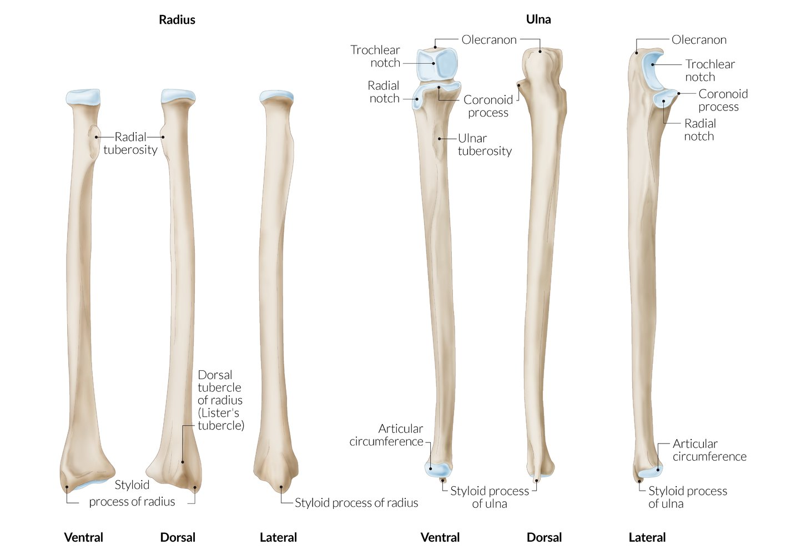

Radius and ulna

#### Radius (bone)

* Description: the <u>lateral</u> bone of the forearm (when in <u>anatomical position</u>)

* Parts of the radius 

* <u>Proximal</u> radius

* Head of radius

* A disk-shaped structure, the <u>medial</u> rim of which articulates with the <u>radial notch</u> of the <u>ulna</u>, forming the <u>proximal radioulnar joint</u>

* The superior <u>concave</u> surface (articular fovea) articulates with the <u>capitulum of the humerus</u> (<u>humeroradial joint</u> of the <u>elbow</u>).

* Radial tuberosity

* <u>Distal</u> to the <u>medial</u> aspect of the head

* Point of attachment for the <u>biceps brachii</u> <u>tendon</u>

* <u>Distal</u> radius

* Radial styloid: insertion site for the <u>brachioradialis muscle</u> and the radial collateral <u>ligament</u>

* Carpal articular surface of the radius

* Ulnar notch of the radius

* Located on the <u>medial</u> surface

* Articulates with the <u>ulna</u>, forming the <u>distal radioulnar joint</u>

* Dorsal tubercle of the radius (<u>Lister tubercle</u>)

* Bony prominence of the <u>distal</u> radius

* Serves as a pulley for the <u>extensor pollicis longus</u> <u>tendon</u>

Radius and ulna

### Joints of the forearm

#### Radioulnar joint

* General: the radius and <u>ulna</u> articulate with one another proximally and distally.

* Type of <u>joint</u>: <u>pivot joint</u>, allowing the <u>distal</u> end of the radius to move <u>anterior</u> and medially over the <u>ulna</u> (i.e., forearm <u>pronation</u> and <u>supination</u>)

* Proximal radioulnar joint: allows articulation of the <u>head of the radius</u> and the <u>radial notch</u> on the <u>ulna</u>

* Distal radioulnar joint: allows articulation of the <u>ulnar head</u> and <u>ulnar notch</u> on the radius

* Movement: forearm <u>pronation</u> and <u>supination</u>

> [!TIP]
> Injury to the radial or ulnar <u>diaphysis</u> can disrupt the <u>proximal</u> or <u>distal</u> <u>radioulnar joints</u>.

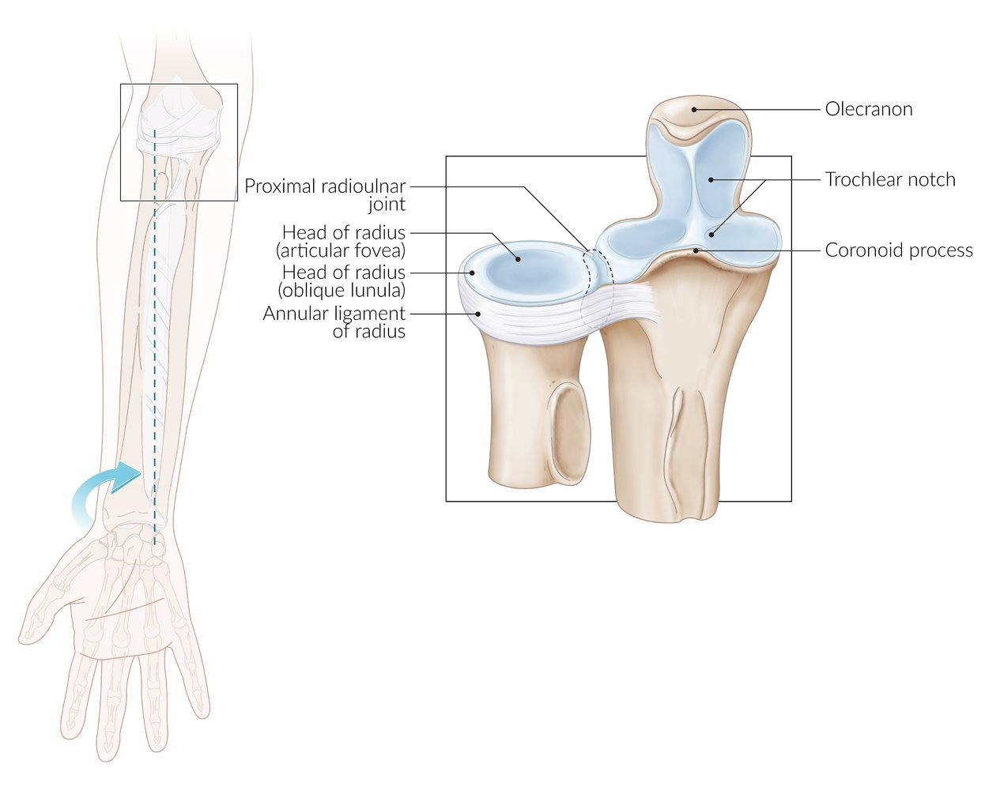

Proximal radioulnar joint

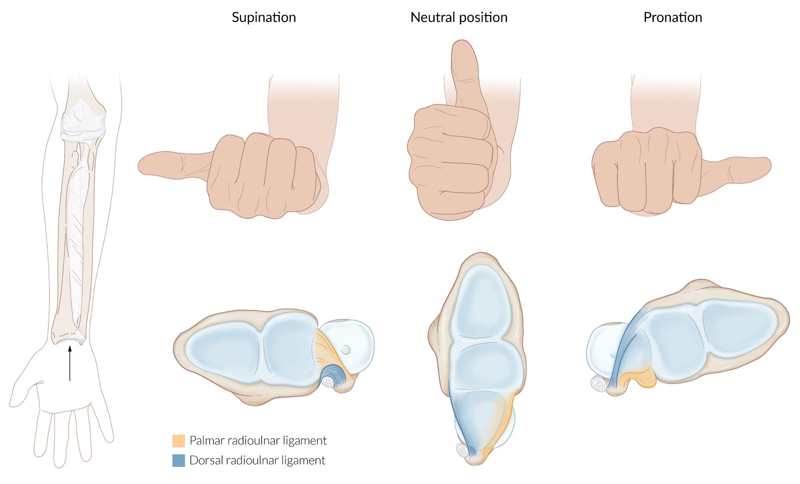

Distal radioulnar joint

#### Interosseous membrane of the forearm

* Definition: fibrous <u>connective tissue</u> that connects the <u>lateral</u> <u>ulna</u> to the <u>medial</u> radius

* Function

* Connects the radius and <u>ulna</u> without restricting movement

* Attaches muscles to the radius and <u>ulna</u>

* Stabilizes the <u>radioulnar joint</u> by preventing <u>proximal</u> migration of the radius

Supination and pronation

### Bones of the wrist (carpal bones)

* Description: Eight <u>carpal bones</u>, arranged in two rows of four bones each, make up the <u>wrist joint</u>. 

* <u>Proximal</u> row (<u>lateral</u> to <u>medial</u>): <u>scaphoid</u>, lunate, <u>triquetrum</u>, and <u>pisiform</u>

* <u>Distal</u> row (<u>lateral</u> to <u>medial</u>): <u>trapezium</u>, trapezoid, <u>capitate</u>, and <u>hamate</u>

| Rows | <u>Carpal bones</u> | Characteristics |
| --- | --- | --- |
|  <u>Proximal</u> row (<u>lateral</u> to <u>medial</u>) | Scaphoid bone |   * Located deep to the <u>anatomical snuff box</u>  * Articulates with the radius proximally, trapezoid and <u>trapezium</u> distally, <u>capitate</u> and lunate medially  * Forms the <u>lateral</u> border of the <u>carpal tunnel</u>, along with the <u>trapezium</u>  * Origin of the <u>abductor pollicis brevis</u>  * Most commonly fractured carpal bone (see “<u>Scaphoid fracture</u>”)  * Vascular supply   * Deficient in the <u>proximal</u> part of the bone  * At risk of <u>nonunion</u> or <u>avascular necrosis</u> after a <u>scaphoid fracture</u>    |
| Lunate bone |   * Articulates with the radius proximally, <u>capitate</u> and <u>hamate</u> distally, <u>scaphoid</u> laterally, and <u>triquetrum</u> medially  * <u>Fracture</u> or <u>dislocation</u> can cause acute <u>carpal tunnel syndrome</u>.    |  |
|  Triquetrum (formerly <u>cuneiform</u>) |   * Wedge-shaped bone  * Articulates with the radius, the <u>pisiform</u> anteriorly, the <u>hamate</u> distally, and the lunate laterally  * Second most common carpal bone <u>fracture</u>    |  |
| Pisiform |   * <u>Sesamoid bone</u> located in the <u>tendon</u> of the <u>flexor carpi ulnaris muscle</u>  * Does not articulate with the radius  * Origin of the <u>abductor digiti minimi</u>  * Forms the <u>medial</u> border of the <u>carpal tunnel</u> and the <u>medial</u> border of the <u>Guyon canal</u> (along with the hook of <u>hamate</u>)    |  |
|  <u>Distal</u> row (<u>lateral</u> to <u>medial</u>) | Trapezium |   * Articulates with the thumb <u>metacarpal</u> bone to form the <u>carpometacarpal joint of the thumb</u>  * Forms the <u>lateral</u> border of the <u>carpal tunnel</u>, along with the <u>scaphoid</u>  * Insertion of <u>flexor pollicis brevis</u>, <u>opponens pollicis</u>, <u>abductor pollicis brevis</u>, and <u>distal</u> attachment of the radial collateral <u>ligament</u> of the thumb  * Has a deep groove for the <u>flexor carpi radialis</u> <u>tendon</u>    |
| Trapezoid bone |   * Smallest carpal bone of the <u>distal</u> row  * Articulates with the <u>scaphoid</u> proximally, the second <u>metacarpal</u> distally, with the <u>trapezium</u> laterally, and with the <u>capitate</u> medially  * Origin of the <u>adductor pollicis</u>    |  |
| Capitate |   * Largest carpal bone  * Articulates with the <u>scaphoid</u> and lunate proximally, with the base of the 3rd <u>metacarpal</u> and base of the 2nd and 4th <u>metacarpal bones</u> distally, with the trapezoid laterally, and the <u>hamate</u> medially  * Origin of the oblique head of the <u>adductor pollicis</u>    |  |
| Hamate |   * The hook of the <u>hamate</u> is a bony projection on the <u>palmar</u> surface that is the point of insertion for the <u>flexor carpi ulnaris</u>.  * Articulates with the lunate proximally, with the 4th and 5th <u>metacarpals</u> distally, the <u>capitate</u> laterally, and the <u>triquetrum</u> medially  * The hook forms the <u>medial</u> border of the <u>carpal tunnel</u> and <u>Guyon canal</u>  * Origin of the <u>flexor digiti minimi brevis</u> and <u>opponens digiti minimi</u>    |  |

> [!NOTE]
> “Stubborn Larry Tried Pills That Triumphantly Cured Him:” Scaphoid, Lunate, Triquetrum, Pisiform, Trapezium, Trapezoid, Capitate, Hamate (<u>carpal bones</u> from <u>lateral</u> to <u>medial</u> and <u>proximal</u> to <u>distal</u>).

#### Anatomical snuffbox

* Definition: a triangular groove on the radial aspect of the <u>dorsal</u> wrist that becomes prominent when extending and <u>abducting</u> the thumb

* Boundaries  

* <u>Lateral</u> (radial): <u>extensor pollicis brevis</u>, <u>abductor pollicis longus</u> <u>tendons</u>

* <u>Medial</u> (ulnar): <u>extensor pollicis longus</u> <u>tendon</u>

* <u>Proximal</u>: <u>distal</u> end of the radius

* Contents

* A branch of <u>radial artery</u>

* A branch of <u>radial nerve</u>

* The <u>proximal</u> end of the <u>cephalic vein</u>

* <u>Scaphoid</u> and <u>trapezium</u>

> [!TIP]
> <u>Pain</u> and tenderness in the <u>anatomical snuffbox</u> after trauma to the wrist suggest a <u>scaphoid fracture</u>. These <u>fractures</u> can be difficult to see on plain <u>x-ray</u>.

### Bones of the hand

* Metacarpal bones 

* There are five <u>metacarpal bones</u>, which are located <u>distal</u> to the <u>carpal bones</u>.

* Each has a base that articulates with the <u>carpal bones</u> (<u>carpometacarpal joints</u>), a head that articulates with the <u>proximal</u> <u>phalanges</u> (<u>metacarpophalangeal joints</u>), and a shaft in between.

* Phalanges 

* Small, <u>long bones</u> of the digits

* Each digit has three <u>phalanges</u>, except the thumb, which only has two.

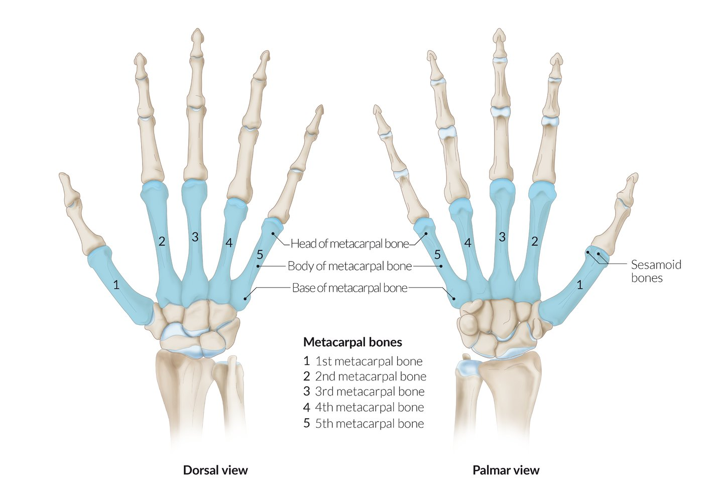

Metacarpal bones

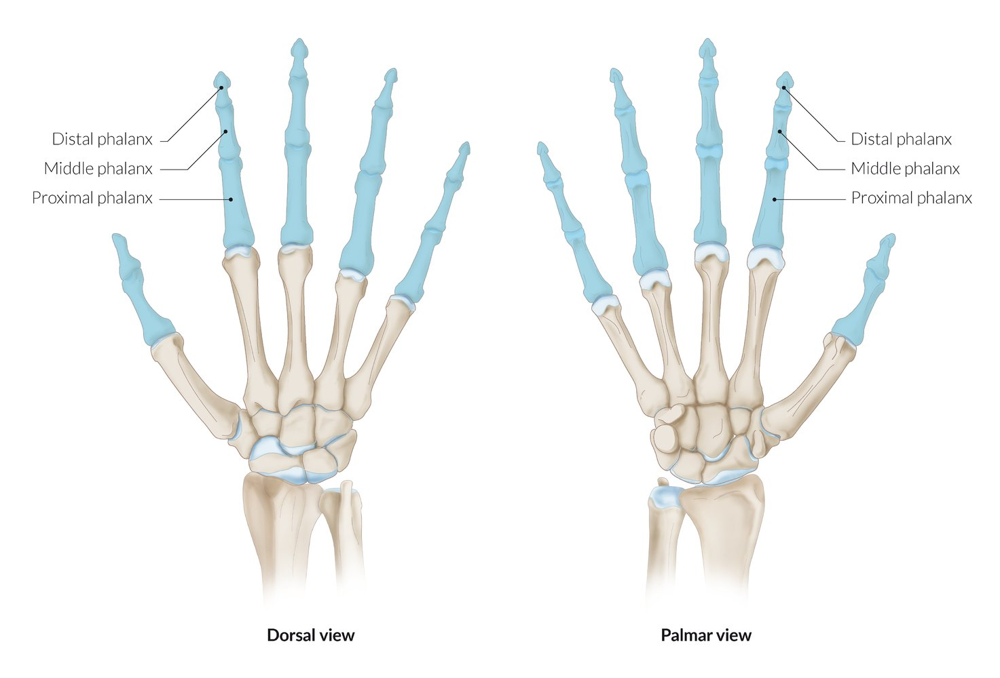

Phalanges

### Joints of the wrist and hand

| Characteristics of the <u>joints of the wrist and hand</u> |  |  |  |  |
| --- | --- | --- | --- | --- |
| <u>Joints</u> |  | Type | Components | Movements/function |
| <u>Joints</u> of the wrist |  |  |  |  |
|  Radiocarpal joint  (<u>wrist joint</u>) |  |  * Synovial <u>ellipsoid joint</u>   |   * <u>Distal</u> radius and the <u>proximal</u> row of <u>carpal bones</u> (except the <u>pisiform</u>)  * <u>Ligaments</u>  * Radial collateral <u>ligament</u> of the wrist and ulnar collateral <u>ligament</u> of the wrist  * <u>Palmar</u> and <u>dorsal</u> radiocarpal <u>ligaments</u>    |   * Biaxial <u>flexion</u>  * Biaxial extension  * Biaxial <u>abduction</u> (radial side)  * Biaxial <u>adduction</u> (ulnar side)    |
| Midcarpal joint |  |  * Relatively immobile compound <u>synovial joint</u>   |  * <u>Proximal</u> and <u>distal</u> <u>carpal bones</u>   |  * Sliding and gliding   |
| Intercarpal joint |  |  * <u>Amphiarthroses</u>   |  * <u>Joints</u> between the individual <u>carpal bones</u> of a row   |  * Stabilizes the wrist   |
|  Carpometacarpal joint (<u>CMC</u>) | 2nd–5th <u>CMC joints</u> |  * The <u>carpal bones</u> and <u>metacarpal bones</u>   |   * Minimal gliding  * Stabilizes the structure of the wrist    |  |
| Carpometacarpal joint of the thumb |  * <u>Saddle joint</u>   |  * The <u>trapezium</u> and first <u>metacarpal</u> bone   |  * <u>Multiaxial joint</u>, unlike the other <u>carpometacarpal joints</u>  * <u>Flexion</u>  * Extension  * <u>Abduction</u>  * <u>Adduction</u>  * Opposition  * <u>Circumduction</u>   |  |
| <u>Joints</u> of the hand |  |  |  |  |
|  Metacarpophalangeal joint(<u>MCP</u>) |  2nd–5th <u>MCP joints</u>   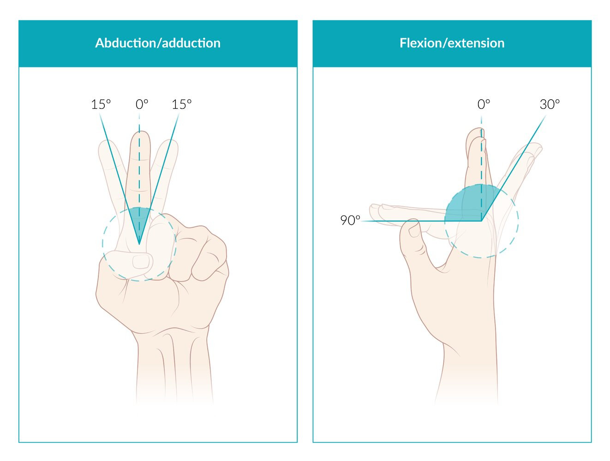  Range of motion of the 2nd–5th metacarpophalangeal (MCP) joints    |  * <u>Ellipsoid joints</u>   |  * The 2nd–5th <u>metacarpals</u> and the <u>proximal</u> <u>phalanges</u> of the <u>medial</u> four fingers   |   * <u>Flexion</u>  * Extension  * <u>Abduction</u>  * <u>Adduction</u>    |
| 1st <u>MCP joint</u> |  * <u>Hinge joint</u>:   |  * The 1st <u>metacarpal</u> and the <u>proximal</u> <u>phalanx</u> of the thumb   |   * <u>Flexion</u>  * Extension    |  |
| Interphalangeal joint |  |  * <u>Hinge joint</u>   |  * Proximal interphalangeal joint (<u>PIP</u>)  and distal interphalangeal joint (<u>DIP</u>)   |   * <u>Flexion</u>  * Extension    |

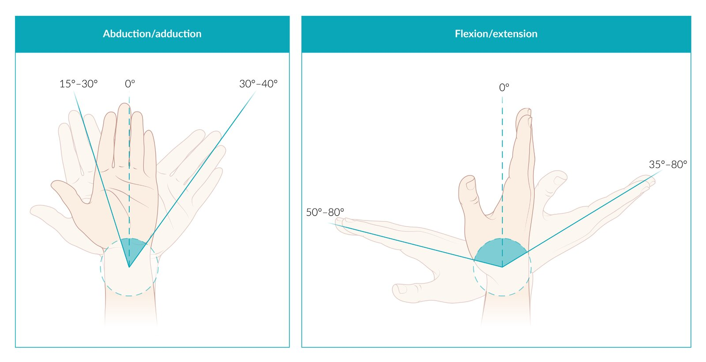

Range of motion of the wrist (radiocarpal) joint

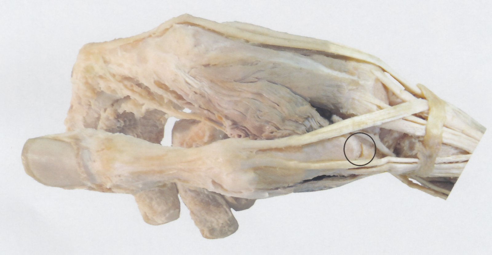

Right hand

Range of motion of the 2nd–5th metacarpophalangeal (MCP) joints

---

## Muscles and fascia

### Muscles of the forearm [[1]](https://coursology-qbank.com/amboss/article/ES08Yf)

* The <u>anterior</u> (<u>volar</u>) compartment

* Contains the flexor group of muscles, which are innervated by the median and ulnar nerves

* Function

* <u>Flexion</u> of the wrist and fingers

* <u>Pronation</u> of the hand

* The <u>posterior</u> (<u>dorsal</u>) compartment

* Contains the extensor group of muscles, which are innervated by the <u>radial nerve</u>

* Function

* Extension of the wrist and fingers

* <u>Supination</u> of the hand

* Most <u>muscles of the forearm</u> move the wrist and hand <u>joints</u> (<u>extrinsic muscles of the hand</u>).

|  Flexor compartment of the forearm (<u>anterior</u> compartment) [[1]](https://coursology-qbank.com/amboss/article/ES08Yf) |  |  |  |  |  |
| --- | --- | --- | --- | --- | --- |
|  <u>Superficial</u> flexor compartment    |  |  |  |  |  |
| Muscle | Origin | Insertion | Innervation | Function |  Testing   |
| Pronator teres |  * <u>Medial epicondyle</u> of the <u>humerus</u> and ulnar <u>coronoid process</u>   |  * Midshaft of the radius   |  * <u>Median nerve</u>   |   * Forearm: <u>pronation</u>  * <u>Elbow</u>: <u>flexion</u> (weak)    |  * <u>Pronate</u> the patient's forearm against resistance, while palpating the muscle belly.   |
| Flexor carpi radialis |  * <u>Medial epicondyle</u> of the <u>humerus</u>   |  * Base of the 2nd and 3rd <u>metacarpal bones</u>   |   * Forearm: <u>flexion</u>  * Wrist: <u>flexion</u> and <u>abduction</u>    |   * Flex the patient's wrist against resistance, while palpating the muscle belly.  * <u>Abduct</u> the wrist against resistance.    |  |
|  Flexor digitorum superficialis  |  * <u>Medial epicondyle</u> of the <u>humerus</u>, <u>proximal</u> shaft of the radius   |  * Middle <u>phalanges</u> of the digits, except the thumb   |  * Wrist, <u>MCP</u>, and <u>PIP</u> <u>joints</u>: <u>flexion</u>   |  * Flex the patient's specific digit while holding the other fingers in extension.   |  |
|  Palmaris longus [[1]](https://coursology-qbank.com/amboss/article/ES08Yf) |  * <u>Medial epicondyle</u> of the <u>humerus</u>   |  * <u>Palmar aponeurosis</u>   |  * Wrist: <u>flexion</u> (weak)   |  * Flexing the patient's wrist against resistance will make the <u>tendon</u> taut.   |  |
| Flexor carpi ulnaris |  * <u>Medial epicondyle</u> of the <u>humerus</u>, <u>olecranon</u>, and <u>posterior</u> surface of the <u>proximal</u> <u>ulna</u>   |  * <u>Pisiform bone</u>, <u>hamate</u>, and base of the 5th <u>metacarpal</u> bone   |  * <u>Ulnar nerve</u>   |  * Wrist: <u>flexion</u> and <u>adduction</u> (strong)   |   * Flex the patient's wrist against resistance, while palpating the <u>tendon</u>.  * <u>Adduct</u> the patient's wrist against resistance.    |
|  Deep flexor compartment   |  |  |  |  |  |
| Flexor digitorum profundus |  * Interosseous membrane and the ulnar shaft (<u>medial</u> and <u>anterior</u> surfaces)   |  * <u>Distal</u> <u>phalanges</u> of the fingers, except the thumb   |   * <u>Medial</u> half (to the ring and little fingers): <u>ulnar nerve</u>  * <u>Lateral</u> half (to the index and middle fingers): <u>median nerve</u>    |  * Wrist, <u>MCP</u>, and <u>DIP</u> <u>joints</u>: <u>flexion</u>   |  * Hold the patient's <u>PIP</u> in extension, and flex the <u>DIP</u>.   |
| Flexor pollicis longus |  * Interosseous membrane, shaft of the radius (<u>anterior</u> surface)   |  * Base of the <u>distal</u> <u>phalanx</u> of the thumb   |  * <u>Median n.</u>   |  * <u>Joints</u> of the thumb (1st <u>MCP</u> and the <u>interphalangeal joint</u>): <u>flexion</u>   |  * Flex the patient's <u>interphalangeal joint</u> of the thumb against resistance.   |
| Pronator quadratus |  * <u>Anterior</u> surface of <u>distal</u> ulnar shaft   |  * <u>Anterior</u> surface of <u>distal</u> radial shaft   |  * <u>Pronation</u> of the forearm   |  * <u>Pronate</u> the patient's forearm against resistance, while holding the wrist and fingers in neutral position   |  |

> [!NOTE]
> The <u>median nerve</u> innervates all the forearm flexors, with the exception of the <u>flexor carpi ulnaris</u> and the ulnar portion of the <u>flexor digitorum profundus</u>, which are innervated by the <u>ulnar nerve</u>.

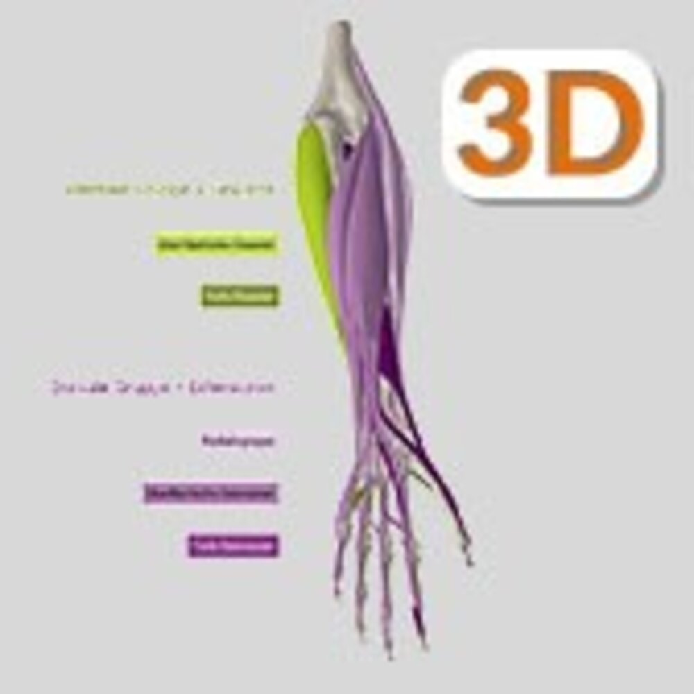

Muscles of the forearm: interactive 3D Tour

|  Extensor compartment of the forearm (<u>posterior</u> compartment) |  |  |  |  |  |
| --- | --- | --- | --- | --- | --- |
|  <u>Superficial</u> compartment  |  |  |  |  |  |
| Muscle | Origin | Insertion | Innervation | Function | Testing |
| Brachioradialis |  * <u>Lateral</u> supracondylar ridge of the <u>humerus</u>   |  * <u>Proximal</u> to the <u>radial styloid</u>   |  * <u>Radial nerve</u>   |  * <u>Elbow joint</u>: <u>flexion</u>   |  * Muscle belly becomes prominent on flexing the patient's <u>elbow</u> against resistance, with the forearm in half-<u>pronation</u>.   |
|  Extensor carpi radialis longus (<u>ECRL</u>) |  * Base of the 2nd <u>metacarpal</u> (<u>dorsal</u> aspect)   |  * Wrist: extension (<u>dorsiflexion</u>) and <u>abduction</u>   |  * Muscle bellies become prominent on extending the patient's wrist against resistance, with the forearm in <u>pronation</u>.   |  |  |
|  Extensor carpi radialis brevis (<u>ECRB</u>) |  * <u>Lateral epicondyle</u> of the <u>humerus</u>   |  * Base of the 2nd and 3rd <u>metacarpals</u> (<u>dorsal</u> aspect)   |  |  |  |
|  Extensor digitorum  (ED) |  * <u>Dorsal</u> base of the middle and <u>distal</u> <u>phalanges</u> of the fingers, except the thumb   |  * Posterior interosseous nerve (branch of the <u>radial nerve</u>)   |  * Wrist, <u>MCP</u>, <u>PIP</u>, and <u>DIP</u>: extension   |  * Extend the patient's fingers against resistance.   |  |
|  Extensor digiti minimi (EDM) |  * Middle and <u>distal</u> <u>phalanges</u> (extensor expansion) of the little finger   |  * Extension of the little finger (<u>MCP</u>, <u>PIP</u>, and <u>DIP</u>)   |  * Extend the patient's little finger with other fingers held in <u>flexion</u>.   |  |  |
|  Extensor carpi ulnaris (<u>ECU</u>) |  * Base of the 5th <u>metacarpal</u>   |  * Wrist: extension and <u>adduction</u>   |  * <u>Adducting</u> the patient's wrist against resistance makes the <u>tendon</u> taut.   |  |  |
| Anconeus |  * <u>Lateral</u> aspect of the <u>olecranon</u> and <u>posterior</u> surface of the <u>ulna</u>   |  * <u>Radial nerve</u>   |   * <u>Elbow</u>: extension (accessory extensor)  * Ulnar <u>abduction</u> in <u>pronation</u>    |  * Cannot be independently tested   |  |
|  Deep extensor compartment   |  |  |  |  |  |
|  Abductor pollicis longus (APL) |  * Interosseus membrane and <u>posterior</u> surface of the radius and <u>ulna</u>   |  * Base of the 1st <u>metacarpal</u>   |  * <u>Posterior interosseous nerve</u>   |   * 1st <u>MCP</u> (of the thumb): <u>abduction</u> and accessory extensor  * Wrist: <u>abduction</u>    |  * <u>Abducting</u> the patient's thumb against resistance makes the <u>tendon</u> taut.   |
|  Extensor pollicis longus (EPL) |  * Interosseus membrane and <u>posterior</u> surface of the <u>ulna</u>   |  * <u>Distal</u> <u>phalanx</u> of the thumb   |   * <u>MCP</u>, <u>CMC</u>, and <u>interphalangeal joint</u> of the thumb: extension  * Wrist: extension (weak)    |  * Extending the patient's <u>interphalangeal joint</u> of the thumb against resistance makes the <u>tendon</u> taut.   |  |
|  Extensor pollicis brevis (EPB) |  * Interosseous membrane and <u>posterior</u> surface of the radius   |  * <u>Proximal</u> <u>phalanx</u> of the thumb   |  * <u>MCP</u> and <u>interphalangeal joint</u> of the thumb: extension   |  * With the patient's thumb <u>interphalangeal joint</u> in slight <u>flexion</u>, there is resistance to extension.   |  |
| Extensor indicis |  * Interosseous membrane and <u>posterior</u> surface of the <u>ulna</u>   |  * Extensor expansion of index finger   |  * Extension of the index finger (<u>MCP</u>, <u>PIP</u>, and <u>DIP</u>)   |  * Extend the index finger with other fingers held in <u>flexion</u>.   |  |
| Supinator muscle |  * <u>Lateral epicondyle</u> of the <u>humerus</u> and <u>posterior</u> surface of the <u>ulna</u>   |  * <u>Lateral</u> surface of the <u>proximal</u> radius   |  * <u>Radioulnar joint</u>: <u>supination</u>   |  * <u>Supinate</u> against resistance with the <u>elbow</u> extended.   |  |

> [!TIP]
> De Quervain syndrome involves inflammation of the <u>tendons</u> on the radial side of the wrist, the <u>extensor pollicis brevis</u>, and the <u>abductor pollicis longus</u>.

> [!TIP]
> Supinator syndrome is a relatively rare entrapment syndrome in which the <u>deep branch of the radial nerve</u> is trapped in the supinator tunnel between the heads of the <u>supinator muscle</u>, resulting in weak finger extension. Causes include trauma or overuse of the <u>supinator muscle</u>.

> [!NOTE]
> The forearm extensors are innervated by the <u>radial nerve</u> or by its branch, the <u>posterior interosseous nerve</u>.

> [!NOTE]
> The <u>superficial</u> flexors originate from the <u>medial epicondyle</u> of the <u>humerus</u>, and the <u>superficial</u> extensors from the <u>lateral epicondyle</u> of the <u>humerus</u>.

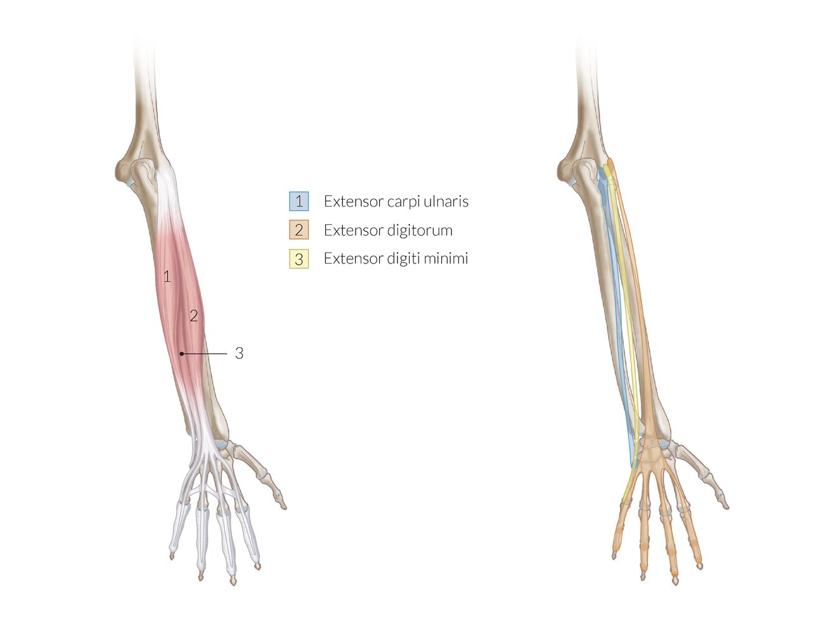

Superficial extensors of the forearm

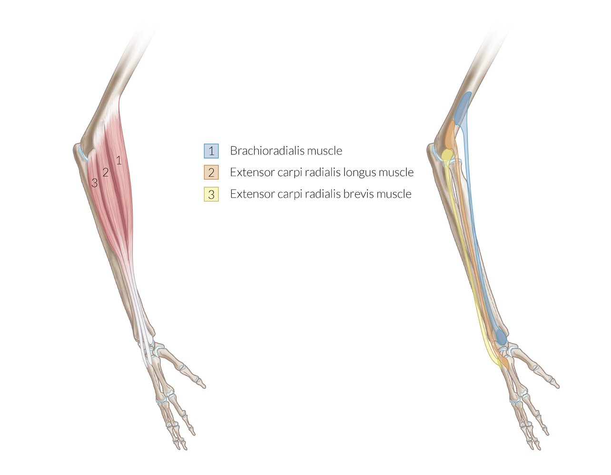

Superficial extensors of the forearm

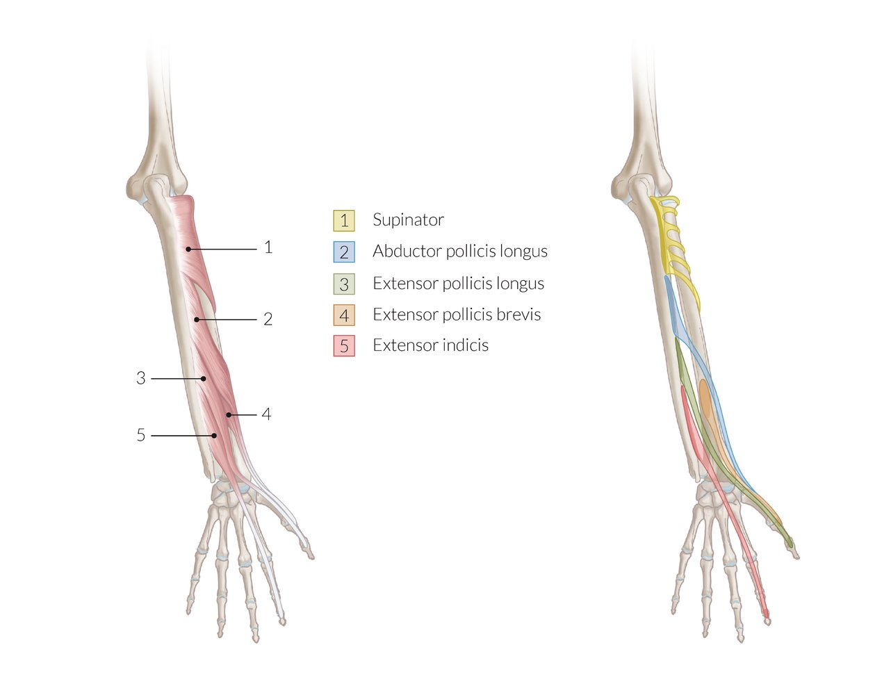

Deep extensors of the forearm

### Muscles of the hand

* Based on where the muscle belly is located, the muscles of the hand are divided into two groups.

* Extrinsic muscles of the hand: The muscle bellies are located in the forearm (see “<u>Muscles of the forearm</u>” above).

* Intrinsic muscles of the hand: The muscle bellies are located within the hand.

* All hand muscles are supplied by the <u>median nerve</u> or <u>ulnar nerve</u>.

* In the resting position, there is a balance between flexors and extensors (both extrinsic and intrinsic) of the hand.

#### Thenar muscles

These muscles form the thenar eminence (the muscular prominence on the <u>palmar</u> aspect at the base of the thumb) of the palm and exert their action mainly on the 1st <u>MCP</u>.

| Characteristics of the <u>thenar muscles</u> |  |  |  |  |  |
| --- | --- | --- | --- | --- | --- |
| Muscle | Origin | Insertion | Innervation | Function | Testing |
| Abductor pollicis brevis |  * <u>Scaphoid</u>, <u>trapezium</u>, and <u>flexor retinaculum of the hand</u>   |  * First <u>proximal</u> <u>phalanx</u>   |  * <u>Median n.</u>   |  * Thumb <u>abduction</u>   |   * <u>Abduct</u> the patient's thumb against resistance.  * Pen test (test to detect <u>weakness</u> in the <u>abductor pollicis brevis muscle</u>)    |
| Opponens pollicis |  * <u>Trapezium</u> and <u>flexor retinaculum of the hand</u>   |  * First <u>metacarpal</u> bone   |  * Thumb opposition   |  * Touch the tip of the patient's little finger with the thumb, against resistance.   |  |
| Flexor pollicis brevis |  * <u>Flexor retinaculum</u> of the wrist and <u>trapezium</u>   |  * First <u>proximal</u> <u>phalanx</u>   |   * <u>Superficial</u> head: <u>median nerve</u>  * Deep head: <u>ulnar nerve</u>    |  * Thumb <u>flexion</u>   |  * Flex the patient's 1st <u>MCP</u> against resistance, while holding the IP in extension.   |
| Adductor pollicis |  * <u>Capitate</u>, base of the 2nd and 3rd <u>metacarpals</u>   |  * First <u>proximal</u> <u>phalanx</u> (ulnar <u>sesamoid bone</u>)   |  * <u>Ulnar n.</u>   |  * Thumb <u>adduction</u>   |  * <u>Adduct</u> the patient's thumb against resistance.   |

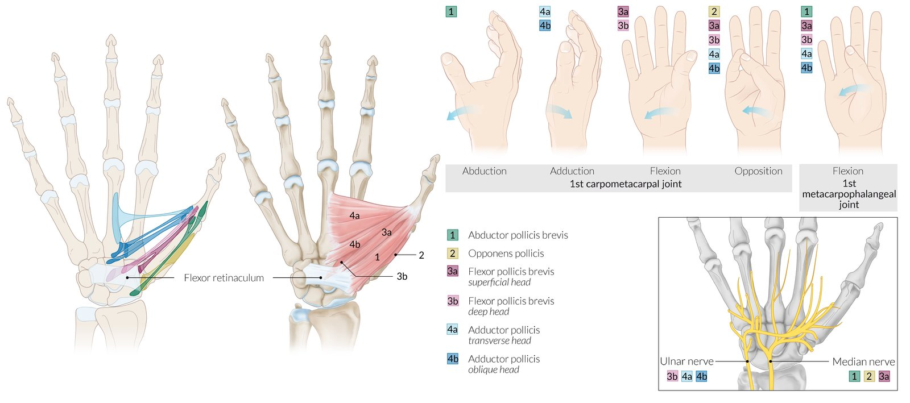

Thenar muscles

#### Hypothenar muscles

These form the <u>hypothenar eminence</u> (the muscular prominence located on the <u>palmar</u> aspect at the base of the 5th finger) and exert their action mainly on the 5th <u>MCP</u>.

| Characteristics of the <u>hypothenar muscles</u> |  |  |  |  |  |
| --- | --- | --- | --- | --- | --- |
| Muscle | Origin | Insertion | Innervation  | Function | Testing |
| Abductor digiti minimi |  * <u>Pisiform</u> and <u>flexor carpi ulnaris</u>   |  * <u>Proximal</u> <u>phalanx</u> of the 5th finger   |  * <u>Ulnar nerve</u>   |  * <u>Abduction</u>   |  * <u>Abduct</u> the patient's 5th finger against resistance.   |
| Flexor digiti minimi brevis |  * Hook of <u>hamate</u> and <u>flexor retinaculum</u>   |  * <u>Flexion</u>   |  * Flex the patient's 5th <u>MCP</u> against resistance with the IP in extension.   |  |  |
| Opponens digiti minimi |  * Ulnar border of the 5th <u>metacarpal</u> bone   |  * Opposition   |  * Touch the patient's tip of the thumb against resistance.   |  |  |
| Palmaris brevis |  * <u>Flexor retinaculum</u> and <u>palmar aponeurosis</u>   |  * <u>Skin</u> of the <u>hypothenar eminence</u>   |  * Strengthens <u>palmar</u> grip by wrinkling <u>skin</u> on the ulnar side of the palm   |  * The <u>skin</u> should pucker on the <u>medial</u> border of the palm when the tips of the patient's 5th finger and thumb are in contact with each other.   |  |

> [!NOTE]
> The muscles of the <u>hypothenar eminence</u> are innervated by the <u>ulnar nerve</u>.

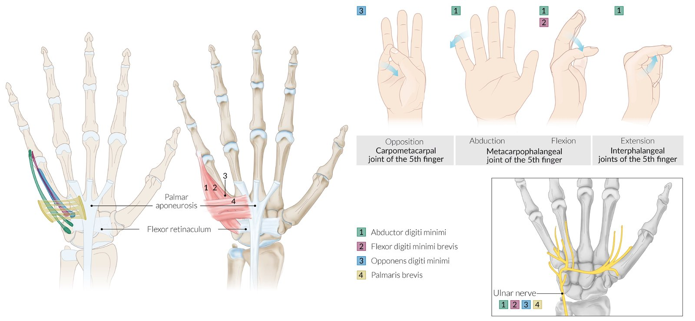

Hypothenar muscles

#### <u>Lumbricals</u> and interossei

* There are four <u>lumbricals</u>.

* There are seven <u>interossei</u> muscles: four on the <u>dorsal</u> side and three on the <u>palmar</u> side of the <u>metacarpal bones</u>.

* These muscles exert their actions on the fingers, but not the thumb.

| Characteristics of the <u>lumbricals</u> and <u>interosseous muscles</u> |  |  |  |  |  |
| --- | --- | --- | --- | --- | --- |
| Muscle | Origin | Insertion | Innervation | Function | Testing |
|  Lumbricals I–IV   |  * <u>Tendon</u> of the <u>flexor digitorum profundus</u>   |  * Extensor apparatus of the fingers   |   * <u>Lumbricals</u> I and II: <u>median nerve</u>  * <u>Lumbricals</u> III and IV: <u>ulnar nerve</u>    |   * <u>MCP</u> <u>flexion</u> at the <u>joint</u>  * <u>PIP</u> and <u>DIP</u> extension    |  * With the <u>PIP</u> and <u>DIP</u> held in extension, flex the patient's <u>MCP</u> against resistance.   |
|  * <u>Ulnar nerve</u>   |  |  |  |  |  |
| Palmar interossei muscles I–III |  * <u>Metacarpal bones</u> 2, 4, 5   |  * Extensor apparatus of digits 2, 4, 5   |  * <u>Adduct</u> the fingers toward the midline   |  * <u>Adduct</u> the patient's index and little finger against resistance.   |  |
| Dorsal interossei muscles I–IV |  * <u>Metacarpal bones</u> 1–5   |  * Extensor apparatus of digits 2–5   |  * <u>Abduct</u> the fingers away from the midline   |  * <u>Abduct</u> the patient's 2nd, 3rd, and 4th fingers against resistance.   |  |

> [!NOTE]
> <u>PAD</u>: Palmar <u>interossei</u> ADduct the fingers. DAB: Dorsal <u>interossei</u> ABduct the fingers.

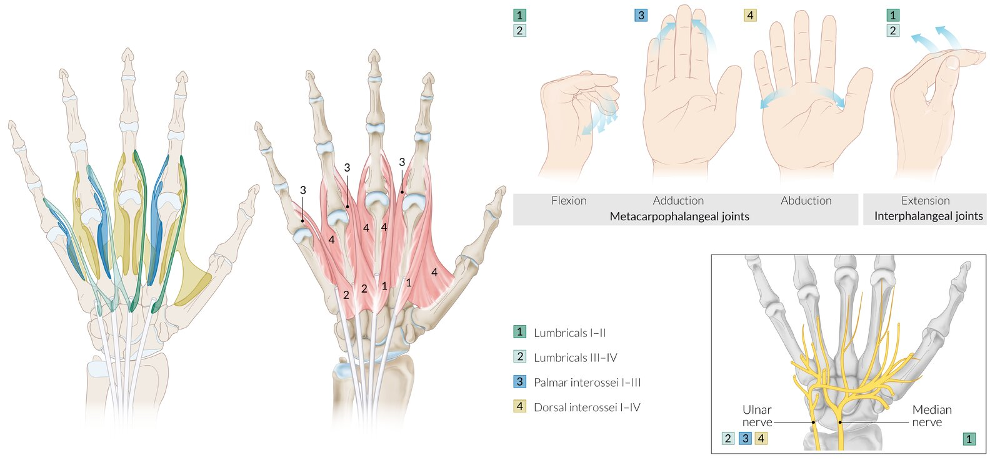

Lumbricals and interossei

### <u>Fascia</u> and retinacula of the wrist and hand [[1]](https://coursology-qbank.com/amboss/article/ES08Yf)

| Characteristics of the <u>fascia</u> and retinacula of the wrist and hand |  |  |  |  |
| --- | --- | --- | --- | --- |
| Structure | Definition | Attachments | Structures/contents | Function |
|  Flexor retinaculum of the hand (flexor retinaculum; <u>transverse carpal ligament</u>) |  * Fibrous thickening of the <u>palmar</u> deep <u>fascia</u> located at the <u>proximal</u> part of the palm   |   * <u>Medial</u>: <u>pisiform</u> and hook of <u>hamate</u>  * <u>Lateral</u>: <u>scaphoid</u> and <u>trapezium</u>    |  * From <u>medial</u> to <u>lateral</u>: <u>ulnar nerve</u>, <u>ulnar artery</u>, the <u>palmar</u> cutaneous branch of the <u>ulnar nerve</u>, <u>palmaris longus</u> <u>tendon</u>, the <u>palmar</u> cutaneous branch of the <u>median nerve</u>   |   * Forms the roof of the <u>carpal tunnel</u>  * Holds the flexor <u>tendons</u> in place    |
|  Extensor retinaculum (<u>dorsal</u> carpal <u>ligament</u>) |  * Fibrous thickening of the deep <u>fascia</u> of the forearm that is located on the <u>dorsal</u> aspect of the wrist   |   * <u>Medial</u>: <u>pisiform</u> and <u>triquetrum</u>  * <u>Lateral</u>: <u>distal</u> radius    |  * <u>Superficial</u> branch of <u>radial nerve</u>   |  * Holds the extensor <u>tendons</u> in place   |
| Palmar aponeurosis |  * A triangular thickening of the <u>palmar</u> deep <u>fascia</u> that invests the muscles of the hand   |   * The apex: continuation of the <u>palmaris longus</u> <u>tendon</u>  * The base: divides into 4 slips that insert into the <u>skin</u> overlying the <u>MCP joints</u> of the fingers    |  * Consists of fibers in multiple directions that distally go on to form the pretendinous bands   |   * Creates a semirigid barrier between the <u>skin</u> and the neurovascular and <u>tendon</u> structures  * Forms part of the flexor <u>tendon</u> pulley    |
| Carpal tunnel |  * An osteofibrous channel bound by the <u>carpal bones</u> at the deep aspect and the <u>flexor retinaculum</u> superficially   |   * <u>Medial</u>: hook of the <u>hamate</u> and <u>pisiform bone</u>  * <u>Lateral</u>: the <u>trapezium</u> and <u>scaphoid</u>    |   * Boundaries  * Roof: <u>flexor retinaculum</u>  * Floor: carpal groove  * <u>Medial</u>: <u>lateral</u> surface of <u>hamate</u>  * <u>Lateral</u>: <u>medial</u> surface of <u>trapezium</u>  * Contents: 9 <u>tendons</u> and 1 nerve  * <u>Median nerve</u>  * <u>Tendon</u> of the <u>flexor pollicis longus</u>  * 4 <u>tendons</u> of the <u>flexor digitorum profundus</u>  * 4 <u>tendons</u> of the <u>flexor digitorum superficialis</u>    |  * Passageway from the forearm to the <u>anterior</u> hand   |
|  Ulnar canal (<u>Guyon canal</u>) |  * An osteofibrous channel on the <u>medial</u> aspect of the palm   |   * <u>Medial</u>: <u>pisiform bone</u>  * <u>Lateral</u>: hook of the <u>hamate</u>    |   * Boundaries  * Roof: <u>palmar</u> carpal <u>ligament</u>  * Floor: <u>flexor retinaculum</u> and <u>hypothenar muscles</u>  * <u>Medial</u>: <u>pisiform</u>  * <u>Lateral</u>: hook of the <u>hamate</u>  * Contents  * <u>Ulnar nerve</u>  * <u>Ulnar artery</u>    |  |

> [!NOTE]
> The <u>palmar aponeurosis</u> is the structure that <u>hypertrophies</u> and contracts in Dupuytren disease.

Dupuytren contracture

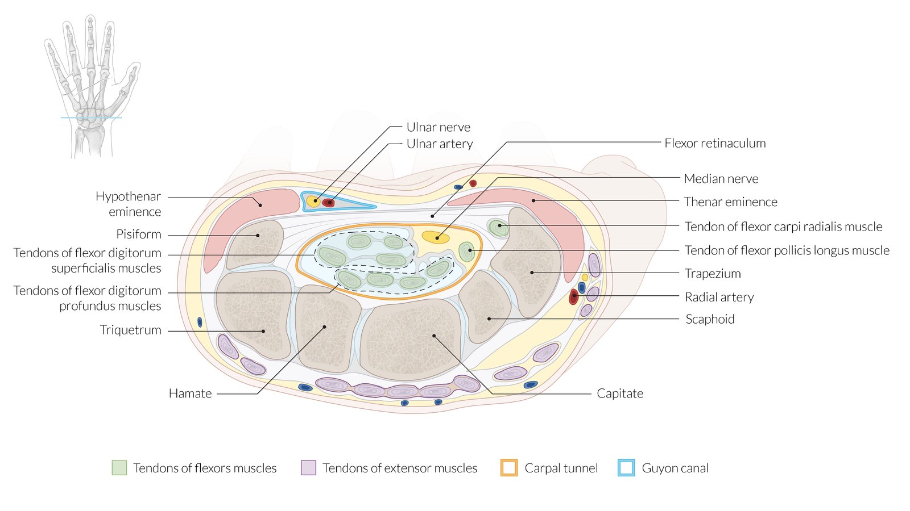

Cross-section of wrist showing the carpal tunnel and Guyon canal

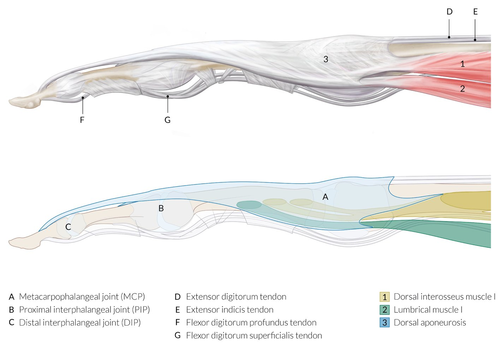

Dorsal extensor aponeurosis and tendons of the hand

---

## Vasculature and lymphatic drainage

### <u>Arteries</u>

* The arterial system of the forearm originates from the <u>brachial artery</u> in the <u>cubital fossa</u>, where it bifurcates into the ulnar and <u>radial arteries</u>.

* The <u>radial artery</u> and the <u>ulnar artery</u> are the two major <u>blood vessels</u> that supply blood to the forearm and hand.

* These two <u>arteries</u> <u>anastomose</u> in the hand, forming the <u>superficial palmar arch</u> and the <u>deep palmar arch</u>.

* For further information on the arterial supply of the forearm and hand, see “<u>Neurovasculature of the upper limbs</u>.”

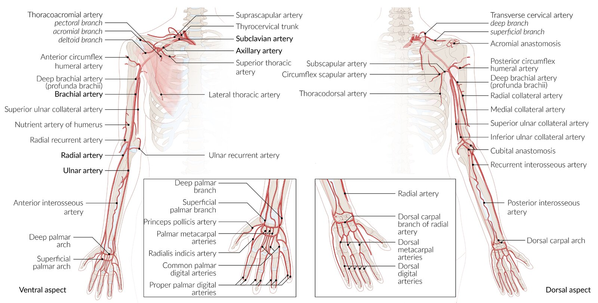

Arteries of the upper extremity

### <u>Veins</u>

* The venous system of the forearm and hand consists of a <u>superficial</u> and a <u>deep venous system</u>.

* <u>Superficial venous system</u>

* Located within the <u>subcutaneous tissue</u>

* Formed by the <u>cephalic vein</u>, <u>basilic vein</u>, and the <u>median antebrachial vein</u>

* <u>Deep venous system</u>

* Located below the deep <u>fascia</u>

* Formed by:

* Paired <u>veins</u> (<u>venae comitantes</u>), which accompany each <u>artery</u>

* <u>Radial vein</u>

* <u>Ulnar vein</u>

* <u>Brachial vein</u>: formed by the union of the radial and <u>ulnar veins</u> at the <u>elbow</u>

* The <u>deep veins</u> communicate with <u>superficial veins</u> via <u>perforator veins</u>.

* <u>Perforating veins</u> run between the deep and <u>superficial veins</u> of the upper limb, connecting the two systems.

* For further information on the venous supply of the forearm and hand, see “<u>Neurovasculature of the upper limbs</u>.”

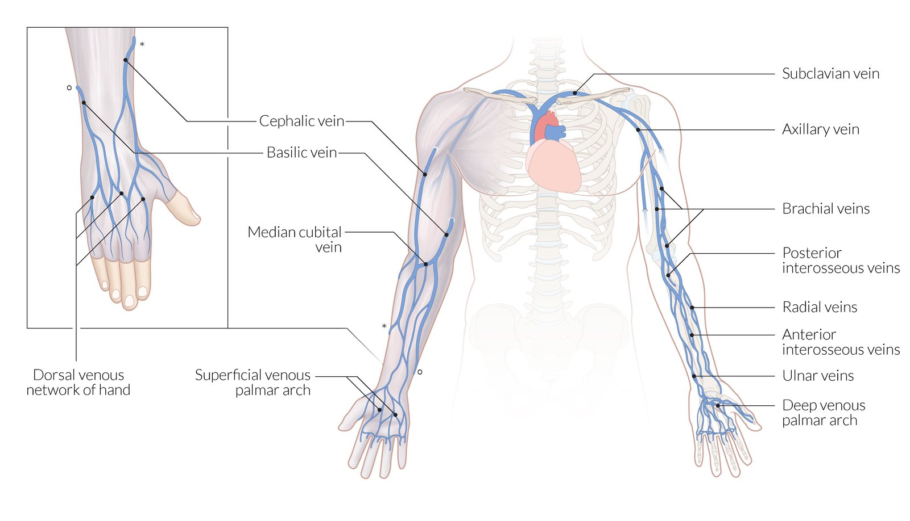

Veins of the upper extremity

### <u>Lymphatic drainage</u>

* <u>Superficial</u> <u>lymphatics</u>: accompany the <u>superficial veins</u> of the upper limb

* The <u>lymphatics</u> at the <u>lateral</u> side (radial) of the hand and forearm accompany the <u>cephalic vein</u> and drain mainly into the apical group of <u>axillary lymph nodes</u>.

* The <u>lymphatics</u> at the <u>medial</u> side (ulnar) of the hand and forearm accompany the <u>basilic vein</u> and drain first into the <u>cubital lymph nodes</u> (epitrochlear nodes), then terminate in the <u>lateral</u> group of <u>axillary lymph nodes</u>.

* Deep <u>lymphatics</u>: follow the <u>deep veins</u> and drain into the axillary group of <u>lymph nodes</u>

---

## Innervation

The forearm and hand are innervated by branches of the <u>brachial plexus</u>. The median, radial, and ulnar nerves are terminal branches of the <u>brachial plexus</u> that provide motor and sensory innervation.

### Motor innervation

| Motor innervation of the forearm and hand |  |  |  |
| --- | --- | --- | --- |
|  | Forearm | Hand | Deficit |
|  <u>Median nerve</u>    |  * All flexors (<u>anterior</u> compartment) except for those supplied by the <u>ulnar nerve</u>   |  * <u>Thenar muscles</u> and <u>lateral</u> two <u>lumbricals</u> of the hand   |   * <u>Pronation</u> of the forearm  * Opposition of thumb    |
|  <u>Ulnar nerve</u>    |  * <u>Flexor carpi ulnaris</u> and <u>medial</u> half of the <u>flexor digitorum profundus muscle</u> in the 4th and 5th fingers   |  * All muscles except those supplied by the <u>median nerve</u>   |  * <u>Abduction</u> of fingers   |
|  <u>Radial nerve</u>    |  * All extensors (<u>posterior</u> compartment)   |  * -   |  * Extension of the wrist   |

* For further information on motor innervation of the forearm and hand, see “<u>Neurovasculature of the upper limbs</u>.”

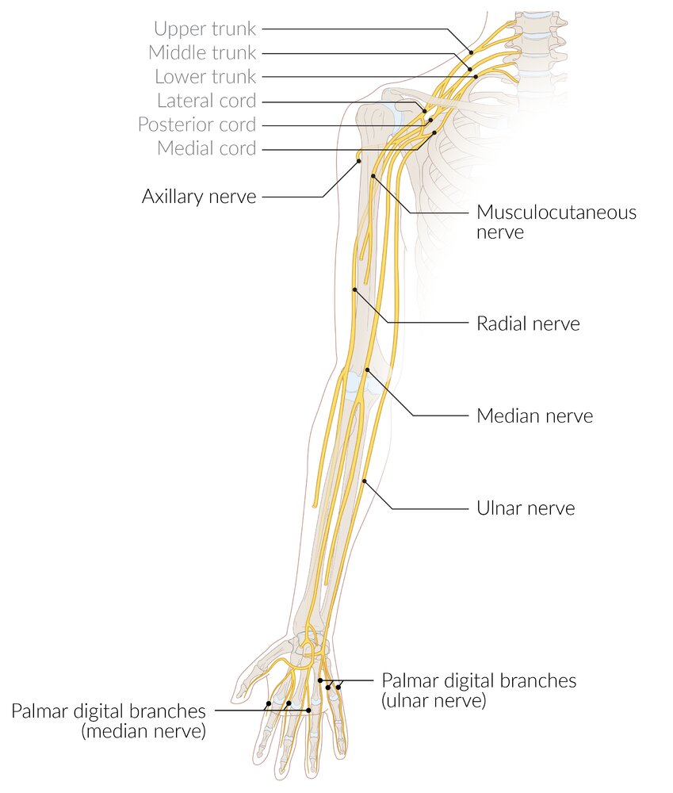

Innervation of the upper limb (anterior view)

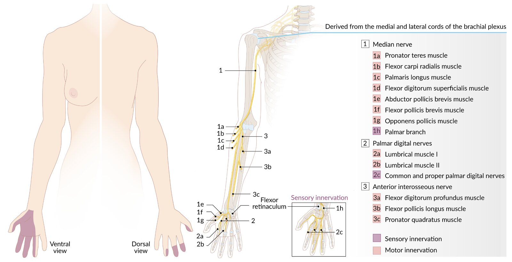

Median nerve

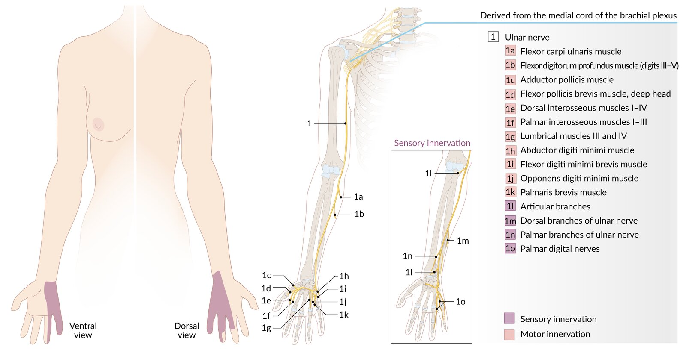

Ulnar nerve

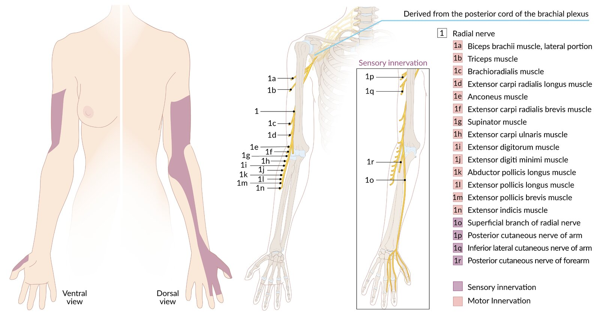

Radial nerve

Median nerve: interactive 3D Tour

### Sensory innervation

* The sensory innervation of the hand is provided by the <u>median nerve</u>, <u>radial nerve</u>, and <u>ulnar nerve</u>.

* The sensory innervation of the forearm is provided by the <u>lateral cutaneous nerve of the forearm</u>, <u>medial cutaneous nerve of the forearm</u>, and <u>posterior</u> cutaneous nerve of the arm.

* For further information on sensory innervation of the forearm and hand, see “<u>Neurovasculature of the upper limbs</u>.”

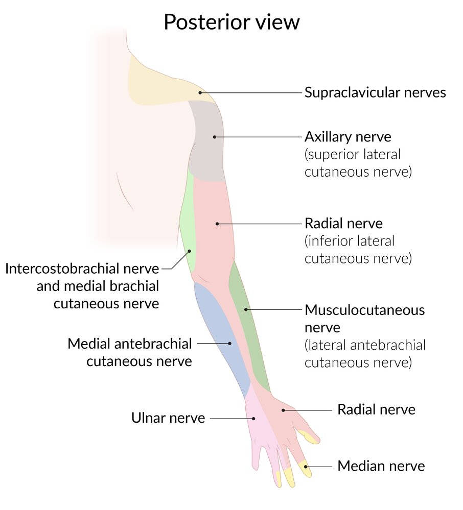

Sensory innervation areas of the peripheral nerves (arm, dorsal view)

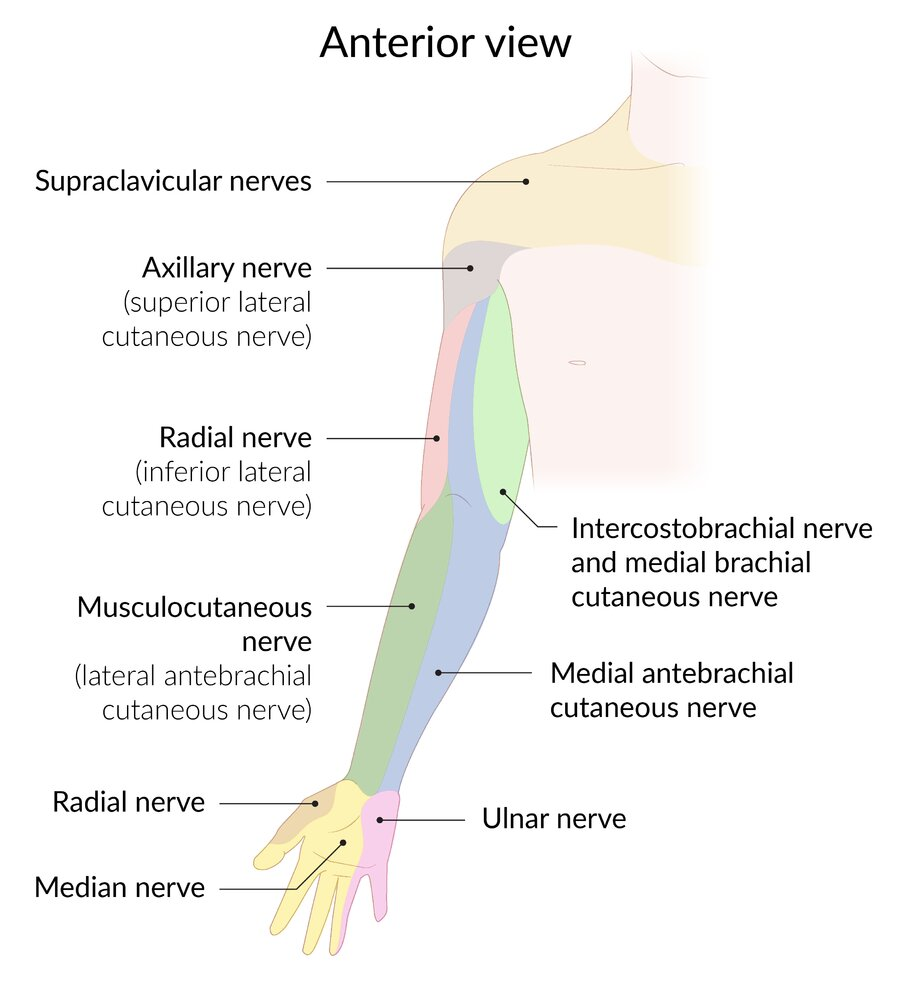

Sensory innervation areas of the peripheral nerves (arm, ventral view)

#### Dermatomal distribution of the forearm and hand

* C6: posterolateral forearm, thumb, and <u>lateral</u> side of the index finger

* C7: <u>ventral</u> forearm, middle finger, <u>medial</u> side of the index finger, and <u>lateral</u> side of the ring finger

* C8: <u>distal</u> third of the <u>medial</u> forearm, the little finger, and <u>medial</u> side of the ring finger

* T1: <u>proximal</u> two-thirds of the <u>medial</u> forearm

Dermatome map

---

## Clinical significance

### Bones and <u>joints</u>

* <u>Ulna</u>

* <u>Ulnar fractures</u>

* <u>Ulnar styloid fracture</u> (associated with <u>distal radius fractures</u>)

* Radius

* <u>Distal radius fractures</u> (e.g., <u>Colles fracture</u>, <u>Smith fracture</u>)

* <u>Radial head subluxation</u>

* <u>Radioulnar joint</u>

* <u>Monteggia fracture</u>

* <u>Galeazzi fracture</u>

* <u>Distal radioulnar joint instability</u>

* <u>Carpal bones</u>

* <u>Scaphoid fracture</u>

* <u>Lunate dislocation</u>

* <u>Metacarpal bones</u>: <u>boxer's fracture</u> (<u>metacarpal neck fracture</u>)

* <u>Joints of the wrist and hand</u>

* <u>Trapeziometacarpal osteoarthritis</u> (<u>rhizarthrosis</u>) 

* The <u>saddle joint</u> of the thumb is susceptible to <u>cartilaginous</u> degeneration, resulting in <u>osteoarthritis</u>.

* Approximately 8–12% of the population is affected by carpometacarpal <u>osteoarthritis</u>. [[2]](https://coursology-qbank.com/amboss/article/1RX2NB)

* Clinical features: <u>pain</u> and swelling at the base of the thumb

* Diagnostics [[2]](https://coursology-qbank.com/amboss/article/1RX2NB)

* Thumb grind test: performed by applying axial compression along the plane of the <u>metacarpal</u> bone and rotating the thumb <u>metacarpal</u> base. <u>Pain</u> or <u>crepitus</u> indicates a positive grind test, suggesting carpometacarpal <u>osteoarthritis</u>.

* Thumb lever test: performed by grasping the first <u>metacarpal</u> just <u>distal</u> to the base and moving it back and forth in the <u>lateral</u> and <u>medial</u> directions. <u>Pain</u> or <u>crepitus</u> indicates a positive lever test, suggesting carpometacarpal <u>osteoarthritis</u>.

* MCP extension test: performed by placing one finger on the <u>interphalangeal joint</u> and applying resistance against extension while the patient tries to extend the thumb. <u>Pain</u> or <u>crepitus</u> indicates a positive <u>MCP extension test</u>, suggesting carpometacarpal <u>osteoarthritis</u>.

* Treatment: may involve excision of the <u>trapezium</u>.

* <u>Metacarpophalangeal joint</u>: 1st <u>MCP</u> <u>joint</u> is affected early by <u>rheumatoid arthritis</u>

* <u>Interphalangeal joints</u>

* <u>Bouchard nodes</u> (in <u>osteoarthritis</u>) and <u>Boutonniere deformity</u> (in <u>rheumatoid arthritis</u>) affect the <u>PIP</u>.

* <u>Heberden nodes</u> (in <u>osteoarthritis</u>) and <u>Swan neck deformity</u> (in <u>rheumatoid arthritis</u>) affect the <u>DIP</u>.

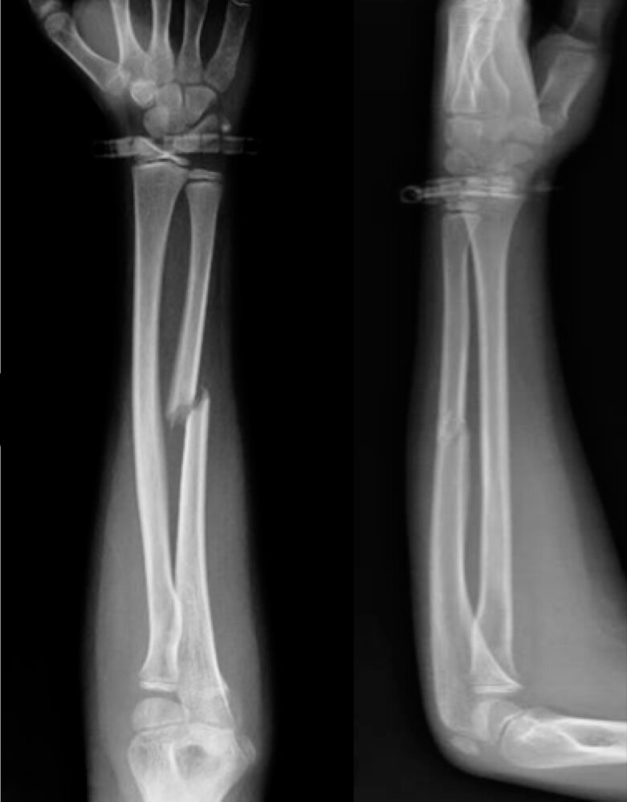

Ulnar shaft fracture

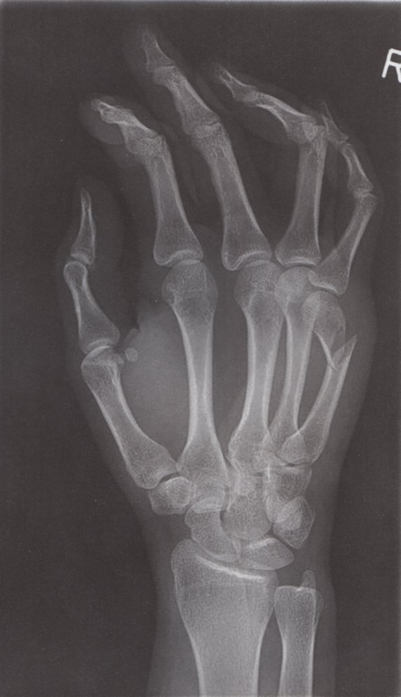

Fracture of the fifth metacarpal 2/2

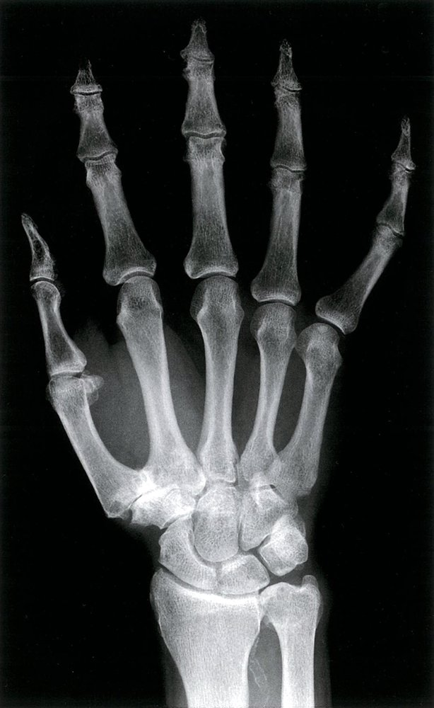

Carpometacarpal osteoarthritis

### Muscles and <u>fascia</u>

* <u>De Quervain tenosynovitis</u>

* <u>Dupuytren contracture</u>

* <u>Carpal tunnel syndrome</u>

* <u>Guyon canal syndrome</u>

* Supinator syndrome

### Innervation

* <u>Ulnar nerve entrapment</u>

* <u>Median nerve neuropathy</u>

* <u>Radial neuropathies</u>

### Other

* <u>Finger injuries</u>

* <u>Volkmann ischemic contracture</u>

* <u>Compartment syndrome</u>

---