# Pelvis and hip joint

*Categories: Clinical knowledge > Internal medicine > Rheumatology and immunology > Basics of rheumatology > Pelvis and hip joint*

[Original Article Link](https://coursology-qbank.com/amboss/article/A60RnS)

---

## Summary

The bony <u>pelvis</u> (<u>pelvic girdle</u>) is composed of the two <u>hip bones</u>, the <u>sacrum</u>, and the <u>coccyx</u>. These bones are firmly connected by the <u>pubic symphysis</u> anteriorly and the sacrococcygeal and <u>sacroiliac joints</u> posteriorly. Each <u>hip bone</u> consists of three fused bones: the <u>ilium</u>, <u>ischium</u>, and <u>pubis</u>. In female individuals, the <u>pelvis</u> additionally accommodates the <u>birth canal</u> and therefore is larger and wider than in male individuals. The <u>pelvic girdle</u> transmits body weight from the <u>axial skeleton</u> to the lower extremities and provides attachment to a large number of muscles and <u>ligaments</u>. The <u>pelvic cavity</u> is the space within the <u>pelvic girdle</u>; it contains abdominal and <u>pelvic</u> organs, which are protected by the <u>pelvic girdle</u>. Located in the space within <u>pelvic girdle</u> is the <u>pelvic cavity</u>, which provides protection for abdominal and <u>pelvic</u> organs. Anatomical spaces of the <u>pelvic cavity</u> (e.g., <u>rectouterine pouch</u>, <u>rectovesical pouch</u>) vary between male and female individuals because of their different reproductive organs. Located inferior to the <u>pelvic cavity</u> is the <u>pelvic floor</u>, a complex fibromuscular structure that prevents <u>pelvic organ prolapse</u>, helps maintain fecal and urinary continence, and separates the <u>perineal region</u> from the <u>pelvic cavity</u>. Openings in the <u>pelvic floor</u> allow for the passage of the <u>rectum</u>, <u>vagina</u>, and <u>urethra</u>. <u>The gluteal region</u> consists of the muscles that form the buttocks, which can be divided into a <u>superficial</u> and a deep muscle layer. The <u>superficial</u> <u>gluteal muscles</u> <u>abduct</u> and medially rotate the thigh, while the deep <u>gluteal muscles</u> are responsible for <u>lateral</u> rotation of the thigh. The <u>hip joint</u> is located between the head of the <u>femur</u> and the <u>acetabulum</u> of the <u>pelvis</u> on each side. It connects the trunk to the lower extremities and supports dynamic and static body weight. The arterial supply of the femoral head is ensured by the <u>foveolar artery</u> and branches of the <u>deep femoral artery</u>. <u>Movements of the hip joint</u> include <u>flexion</u>, extension, <u>lateral</u> and <u>medial</u> rotation, <u>abduction</u>, <u>adduction</u>, and circumflexion.

---

## Overview

### The <u>pelvis</u> (<u>pelvic girdle</u>)

* Characteristics

* A ring-like structure of the <u>axial skeleton</u> that connects the <u>vertebral column</u> to the lower extremities (e.g., <u>femur</u>)

* Largely immobile; provides stability and supports proper transfer of weight from the <u>vertebral column</u> to the lower extremities, especially in the upright position

* The shape of the <u>pelvis</u> differs significantly between male and female individuals.

* Bones 

* The <u>hip bones</u> (os coxae): <u>ilium</u>, <u>ischium</u>, <u>pubis</u>

* <u>Sacrum</u>

* <u>Coccyx</u>

* <u>Joints</u>: <u>lumbosacral joint</u>, <u>sacroiliac joint</u>, <u>sacrococcygeal joint</u>, <u>pubic symphysis</u>, <u>hip joint</u>

* <u>Ligaments</u> and <u>foramina of the pelvis</u> 

* A number of <u>ligaments</u> (e.g., <u>iliolumbar ligament</u>, sacroiliac <u>ligament</u>) stabilize and support the <u>joints of the pelvis</u>.

* The <u>foramina of the pelvis</u> (e.g., sciatic foramina, vascular and <u>muscular lacuna</u>) allow the passage of nerves, muscles, <u>blood vessels</u>, and <u>lymphatics</u>.

* <u>Pelvic cavity</u>: the space within the <u>pelvic girdle</u>

* Allows passage of gastrointestinal and urogenital structures into the <u>pelvis</u>, as well as <u>arteries</u> <u>veins</u>, muscles, and nerves

* Bounded inferiorly by the <u>pelvic floor</u>, which holds the organs in place

* <u>Pelvic spaces</u>: anatomical spaces of the <u>pelvic cavity</u> 

* In female individuals: <u>rectouterine pouch</u>, <u>vesicouterine pouch</u>

* In male individuals: <u>rectovesical pouch</u>

* In both male and female individuals: <u>pararectal fossa</u>, <u>ischiorectal fossa</u>, <u>retropubic space of Retzius</u>

* <u>Birth canal</u>

* <u>Pelvic</u> form: gynecoid, anthropoid, android, plateylpelloid

* <u>Pelvic regions</u>: <u>pelvic inlet</u>, <u>pelvic cavity</u>, <u>pelvic outlet</u>

* <u>Pelvic planes</u>: plane of the <u>pelvic inlet</u>, planes of the greatest and least <u>pelvic</u> dimension, plane of the anatomical outlet

* <u>Soft tissue</u> structures: inner portion (lower uterine segment, <u>cervix</u>, <u>vagina</u>, <u>vulva</u>), outer portion (<u>pelvic floor</u>)

* <u>Pelvic floor</u>: complex fibromuscular structure that holds the <u>pelvic</u> organs in place; separates the <u>pelvic cavity</u> superiorly from the <u>perineal region</u> inferiorly 

* Layers of the <u>pelvic floor</u>: <u>pelvic diaphragm</u>, <u>urogenital diaphragm</u>, <u>superficial perineal layer</u>

* <u>Perineal region</u>: an anatomical region inferior to the <u>pelvic floor</u>

* <u>Urogenital triangle</u>: consists of the <u>perineal membrane</u> and the deep and <u>superficial perineal pouch</u>

* <u>Anal triangle</u>: consists of the <u>anal canal</u>, the external sphincter muscle, and the <u>ischiorectal fossae</u>

* <u>Perineum</u>: <u>superficial</u> area between the <u>anus</u> and external genitalia

* Vessels, nerves, and <u>lymphatics</u>

* <u>Arteries</u>: mainly derived from the <u>internal iliac artery</u>

* <u>Veins</u>: follow the course of the <u>arteries</u> and are named accordingly

* Nerves: Innervation is mainly provided by autonomic nerves and the <u>pudendal nerve</u>.

* <u>Lymphatics</u>: travel along the iliac vessels

* <u>The gluteal region</u>: the group of muscles that form the buttocks

* <u>Superficial</u> <u>gluteal muscles</u>: <u>gluteus maximus</u>, <u>gluteus medius</u>, <u>gluteus minimus</u>, <u>tensor fasciae latae</u>

* Deep <u>gluteal muscles</u>: <u>piriformis</u>, <u>obturator internus</u>, <u>superior gemellus</u>, <u>inferior gemellus</u>, <u>quadratus femoris</u>

* <u>Embryology</u>: <u>Development of the pelvis</u> starts around week 4 of <u>embryonic development</u> and originates from the <u>paraxial mesoderm</u>.

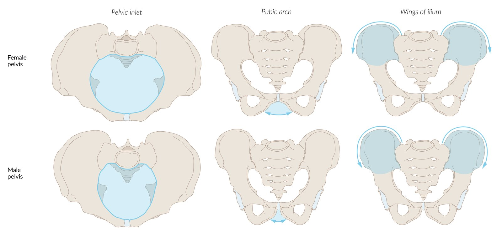

Differences between the male and female pelvis

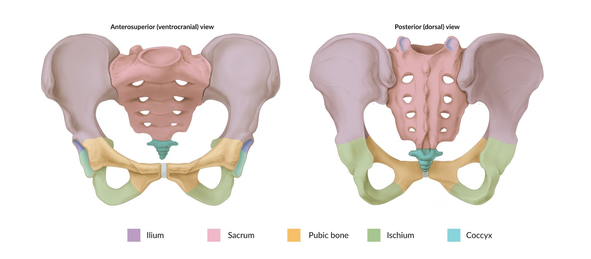

Parts of the bony pelvis

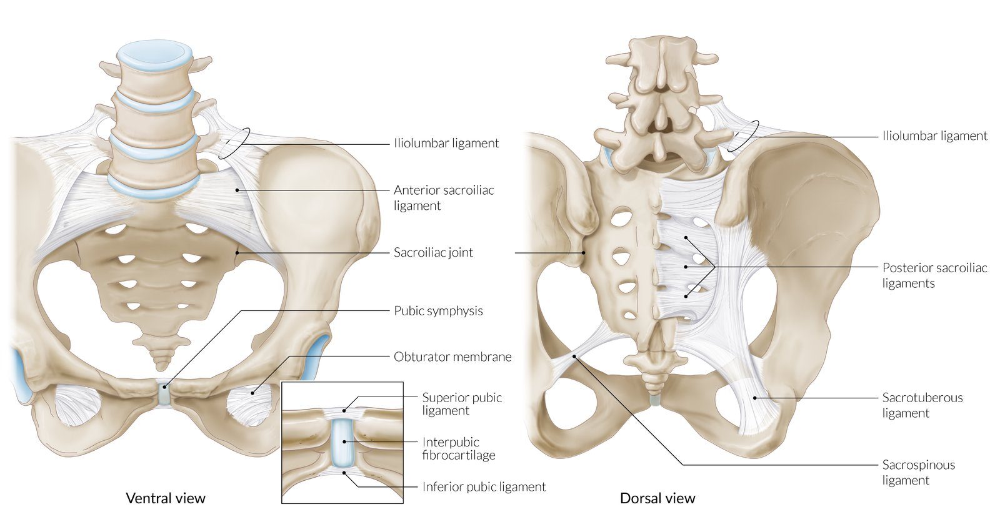

Ligaments of the pelvis

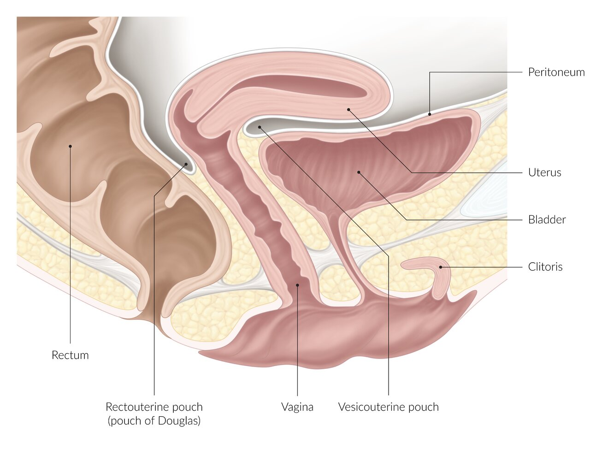

Female pelvic organs

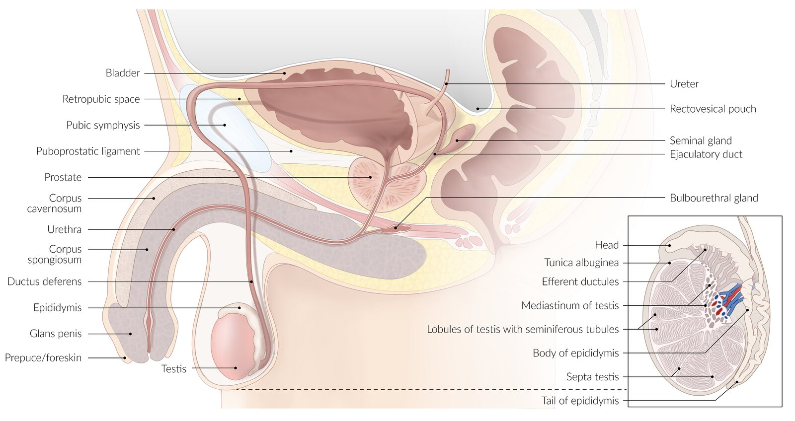

Median section of the male pelvis with detail of a testicle

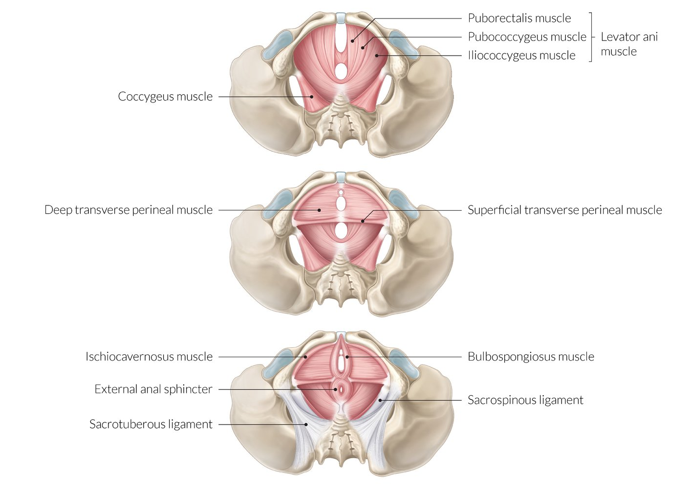

Layers of the pelvic floor

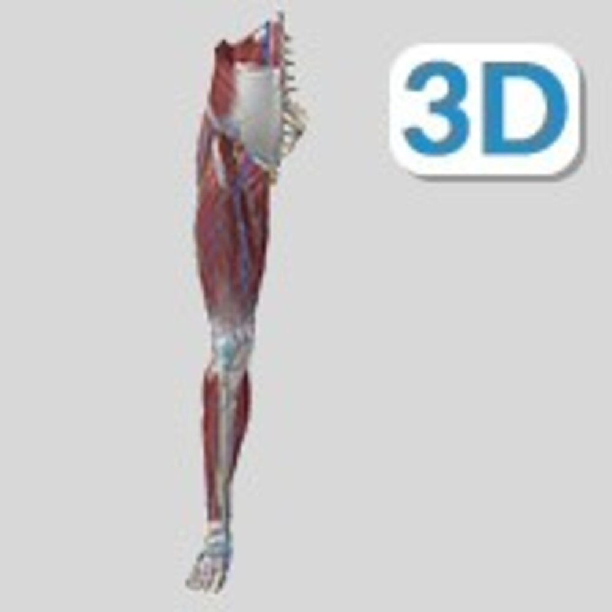

Lower extremity (complete): interactive 3D Model

### The <u>hip joint</u>

* Definition: a <u>joint</u> between the head of the <u>femur</u> and the <u>acetabulum</u> of the <u>pelvis</u>

* Function

* Connects the <u>axial skeleton</u> to the lower extremities

* Supports static (e.g., standing) and dynamic (e.g., walking, running) weight

* Type of <u>joint</u>: ball-and-socket <u>synovial joint</u>

* Arterial supply: <u>medial femoral circumflex artery</u>, <u>lateral femoral circumflex artery</u>, <u>foveolar artery</u>

* Movements  

* <u>Flexion</u> and extension, <u>lateral</u> and <u>medial</u> rotation, <u>abduction</u>, <u>adduction</u>

* The combination of these movements results in <u>circumduction</u>.

* <u>Articular capsule</u>: fibrous capsule that attaches to the margin of the <u>acetabulum</u>, the <u>transverse acetabular ligament</u>, and the neck of the <u>femur</u>

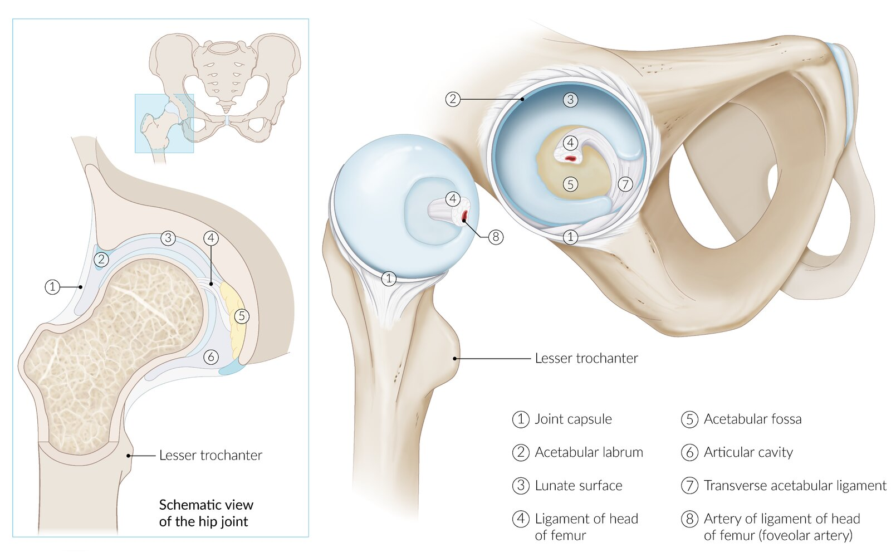

Hip joint anatomy

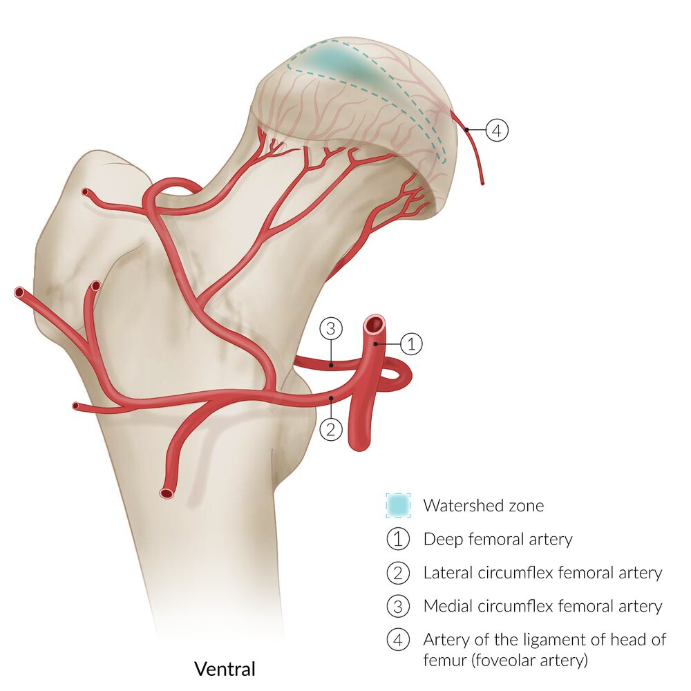

Arteries of the femoral head with watershed zone

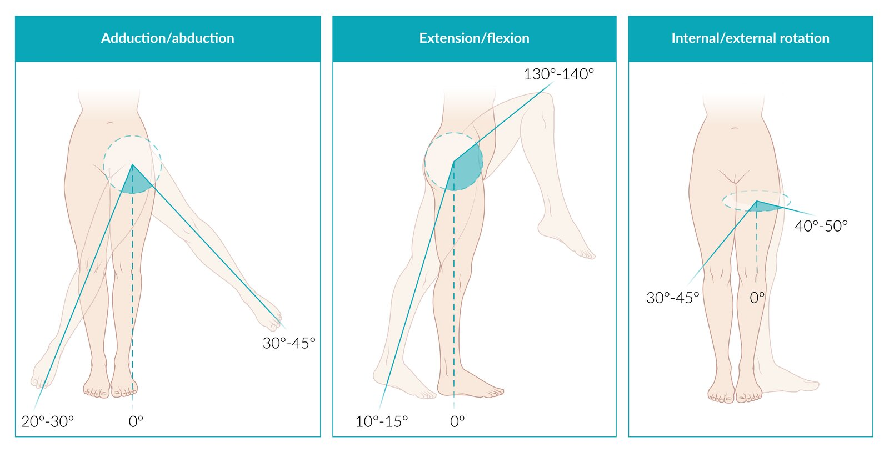

Hip joint range of motion

---

## Bony pelvis

### Bones of the <u>pelvis</u>

#### Hip bones

| Overview of the <u>hip bones</u> |  |  |
| --- | --- | --- |
| Bones |  Landmarks  | Anatomic features |
| Ilium |   * Iliac fossa  * <u>Posterior</u> superior iliac <u>spine</u>  * <u>Posterior</u> inferior iliac <u>spine</u>  * Anterior superior iliac spine  * <u>Anterior</u> inferior iliac <u>spine</u>  * Greater sciatic notch  * Gluteal lines  * Arcuate line (ilium)    |   * <u>Lateral</u> part of the <u>pelvic girdle</u>  * The ala of the <u>ilium</u> forms the iliac crest.  * Connects with <u>ischium</u> and <u>pubis</u> and forms the superior part of the <u>acetabulum</u>    |
| Ischium |   * Lesser sciatic notch  * Ischial spine  * Ischial tuberosity  * <u>Posterior</u> aspect of the <u>obturator foramen</u>    |   * <u>Posterior</u> and inferior part of the <u>pelvic girdle</u>  * The ramus of the <u>ischium</u> connects with the inferior pubic ramus to form the ischiopubic ramus.  * Forms the inferoposterior part of the <u>acetabulum</u>    |
| Pubis |   * <u>Pubic symphysis</u>  * <u>Pubic tubercle</u>  * Pectineal line (pubis)  * <u>Anterior</u> aspect of the <u>obturator foramen</u>    |   * Anteromedial part of the <u>pelvic girdle</u>  * Articulates on the midline to form the <u>pubic symphysis</u>  * The inferior ramus connects with the ramus of the <u>ischium</u> to form the ischiopubic ramus.  * The superior ramus forms the <u>anterior</u> part of the <u>acetabulum</u>.    |

> [!NOTE]
> The <u>anterior superior iliac spine</u> helps to determine the course of the <u>inguinal ligament</u>. It also aids in the identification of the <u>McBurney</u> and <u>Lanz points</u>, which are important anatomical areas where localized tenderness is indicative of <u>appendicitis</u>.

Parts of the bony pelvis

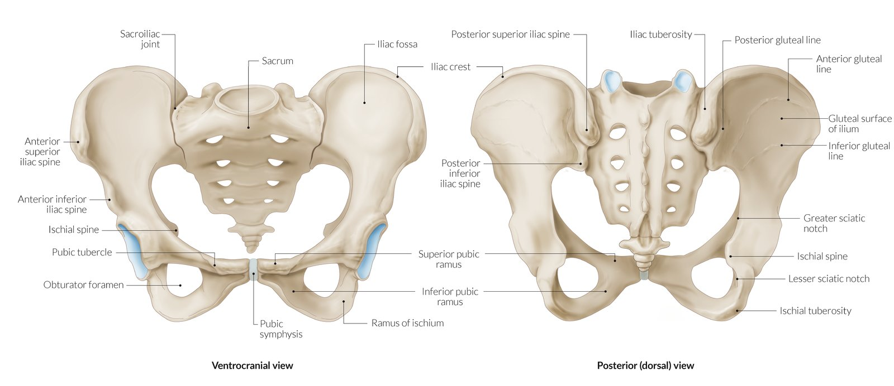

Overview of the bony pelvis

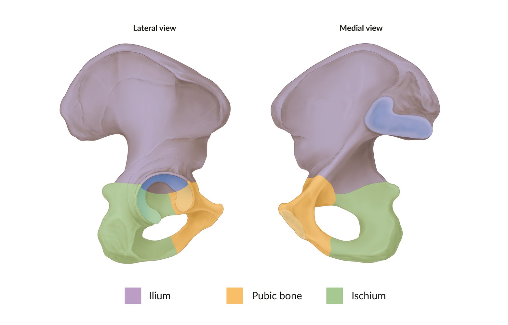

Parts of the hip bone

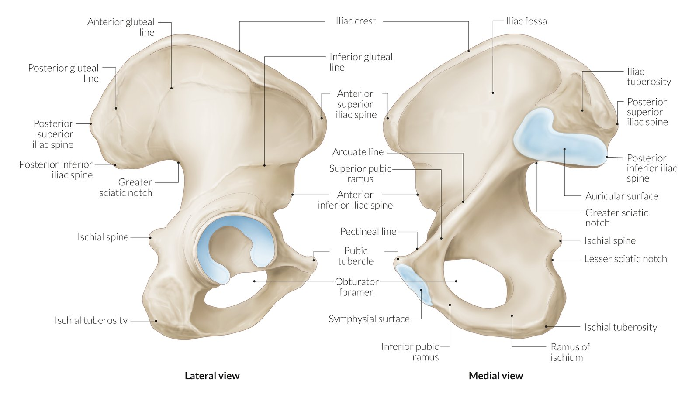

Bony pelvis

### <u>Sacrum</u> and <u>coccyx</u>

For information on the <u>sacrum</u> and <u>coccyx</u>, see “Gross anatomy” in “<u>Vertebral column</u>.”

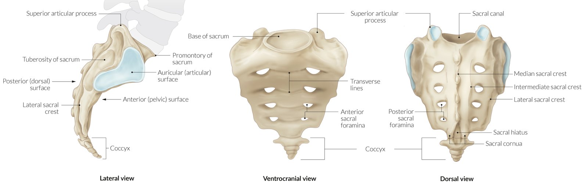

Sacrum and coccyx

### Pelvic inlet

* Definition: plane that separates the abdominal and <u>pelvic</u> cavities

* Location: superior rim of the <u>pelvic cavity</u> (upper <u>pelvic</u> aperture)

* Boundaries

* <u>Anterior</u>: <u>pectineal line (pubis)</u>, pubic crest, superior margin of the <u>pubic symphysis</u>

* <u>Posterior</u>: sacral promontory, <u>anterior</u> border of the sacral ala

* <u>Lateral</u>: <u>arcuate line (ilium)</u>

* Linea terminalis: the combination of the <u>pectineal line (pubis)</u>, sacral promontory, and <u>arcuate line (ilium)</u>; forms the boundary of the <u>pelvic inlet</u>

* Diameters: transverse, oblique, conjugate (anteroposterior), anatomical conjugate, diagonal, straight, median

* Structures passing through: <u>ureter</u>, <u>spermatic cord</u>, <u>round ligament of the uterus</u>, <u>suspensory ligament of the ovary</u>, median sacral vessels, gonadal vessels, iliolumbar vessels, <u>lumbosacral trunk</u>, <u>sympathetic trunk</u>, <u>obturator nerve</u>

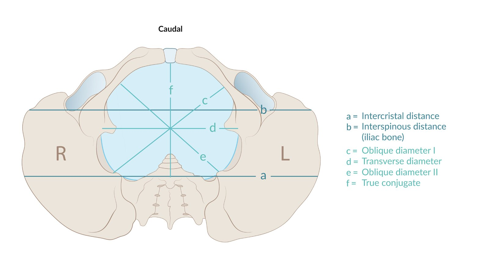

Pelvic diameters and conjungates

### Pelvic outlet

* Definition: inferior opening of the <u>pelvis</u>

* Location: lower <u>pelvic</u> aperture

* Boundaries

* <u>Anterior</u>: <u>pubic symphysis</u>, ischiopubic ramus, <u>inferior pubic ligament</u>

* <u>Posterior</u>: <u>sacrum</u>, <u>coccyx</u>

* <u>Lateral</u>: <u>ischial tuberosities</u>, <u>sacrotuberous ligaments</u>

* Inferior: <u>urogenital diaphragm</u>, <u>pelvic diaphragm</u>

* Diameters: <u>sagittal</u>, intertuberous, interspinous

### <u>Pelvic</u> form and <u>pelvic</u> diameters

For information on the <u>pelvic</u> form and diameters, see the section “<u>Birth canal</u>” below.

### Differences between the male and female pelvis

| Overview of <u>differences between the male and female pelvis</u> |  |  |
| --- | --- | --- |
|  | Male | Female |
| Bones | Bigger, thicker, and heavier | Smaller, thinner, and lighter |
| <u>Sacrum</u> | Longer and narrower | Shorter and wider |
| <u>Pelvic cavity</u> | Narrower and deeper | Wider and shallower |
| <u>Pelvic inlet</u> | <u>Heart</u>-shaped | Oval-shaped |
| <u>Pelvic outlet</u> | Smaller <u>pelvic outlet</u>; the <u>ischial tuberosities</u> face more medially | Larger <u>pelvic outlet</u>; everted <u>ischial tuberosities</u>  |
| <u>Obturator foramen</u> | Round | Triangular or oval |
| Subpubic angle | Smaller (< 90°) | Larger (> 90°) |

Differences between the male and female pelvis

---

## Joints, ligaments, and foramina of the pelvis

### Joints of the pelvis

* Lumbosacral joint 

* Located between the L5 <u>vertebra</u> and the sacral promontory

* Stabilized by <u>iliolumbar ligaments</u>

* <u>Symphysis</u> <u>joint</u> with two <u>facet joints</u>

* Site of most possible movement of the <u>lumbar spine</u>

* Sacroiliac joint 

* Located between the articular surfaces of the <u>ilium</u> and <u>sacrum</u>

* Stabilized by the <u>anterior</u> and <u>posterior sacroiliac ligaments</u>

* Synovial <u>plane joint</u>

* Transmits weight from the <u>vertebral column</u> to the <u>hip bones</u>

* Inflammation results in <u>sacroiliitis</u>.

* Sacrococcygeal joint 

* Located between the <u>sacrum</u> and <u>coccyx</u>

* Stabilized by <u>lateral</u>, <u>anterior</u>, and <u>posterior</u> sacrococcygeal <u>ligaments</u>

* <u>Cartilaginous joint</u>

* Pubic symphysis

* Located between the pubic bones in the midline of the body

* <u>Fibrocartilaginous</u> or <u>cartilaginous joint</u>

* Compensates shear forces while walking

* Enables <u>childbirth</u> by partially separating the pubic bones

* <u>Hip joint</u>

* Formed by the articulation of the <u>femur</u> and the <u>acetabulum</u>

* <u>Ball and socket joint</u>

* For more details, see “<u>Hip joint</u>” below.

Overview of the bony pelvis

Ligaments of the pelvis

### Ligaments of the pelvis

* Iliolumbar ligament 

* <u>Anterior</u> attachment between the <u>transverse processes</u> of L5 and the <u>ilium</u>

* Supports the <u>lumbosacral joint</u>

* Anterior sacroiliac ligament 

* <u>Anterior</u> attachment between the <u>ilium</u> and the <u>sacrum</u>

* Supports the <u>sacroiliac joint</u>

* Posterior sacroiliac ligament 

* <u>Posterior</u> attachment between the <u>ilium</u> and the <u>sacrum</u>

* Supports the <u>sacroiliac joint</u>

* Sacrospinous ligament 

* <u>Posterior</u> attachment between the <u>sacrum</u> and the <u>ischial spine</u>

* Supports and immobilizes the <u>sacrum</u> during weight transfer from the <u>vertebral column</u>

* Sacrotuberous ligament 

* <u>Posterior</u> attachment between the <u>sacrum</u> and the <u>ischial tuberosity</u>

* Supports and immobilizes the <u>sacrum</u> during weight transfer from the <u>vertebral column</u>

* Pubic <u>ligaments</u>

* Superior pubic ligament: attachment between the two <u>pubic tubercles</u>

* Inferior pubic ligament: attachment between the two pubic bones inferiorly

* Support and stabilize the <u>pubic symphysis</u>

* Obturator membrane 

* Spans the <u>obturator foramen</u>

* Perforated by the <u>obturator canal</u>

For information on the <u>ligaments of the hip joint</u>, see “<u>Hip joint</u>” below.

Ligaments of the pelvis

### Foramina of the pelvis

The <u>pelvis</u> contains many openings that allow the passage of nerves, vessels, muscles, and <u>lymphatics</u>.

| Overview of <u>foramina of the pelvis</u> |  |  |
| --- | --- | --- |
| Foramen | Anatomy | Structures passing through |
|  Greater sciatic foramen    |   * Formed by sacrospinous and <u>sacrotuberous ligaments</u>  * Boundaries  * Superior: <u>anterior sacroiliac ligament</u>  * Inferior: <u>sacrospinous ligament</u> and <u>ischial spine</u>  * Anterolateral: greater sciatic notch of the <u>ilium</u>  * Posteromedial: <u>sacrotuberous ligament</u>  * The <u>piriformis muscle</u> divides the <u>greater sciatic foramen</u> into the <u>suprapiriform foramen</u> and the <u>infrapiriform foramen</u>.    |   * Suprapiriform foramen: superior gluteal vessels and nerve  * Infrapiriform foramen  * Inferior gluteal vessels and nerve  * <u>Sciatic nerve</u>  * <u>Posterior femoral cutaneous nerve</u>  * Internal pudendal vessels  * <u>Pudendal nerve</u>  * Nerve to the <u>obturator internus muscle</u>  * Nerve to the <u>quadratus femoris muscle</u>    |
|  Lesser sciatic foramen    |   * Formed by sacrospinous and <u>sacrotuberous ligaments</u>  * Boundaries  * Superior: <u>sacrospinous ligament</u> and <u>ischial spine</u>  * <u>Anterior</u>: <u>ischial tuberosity</u>  * <u>Posterior</u>: <u>sacrotuberous ligament</u>    |   * Internal pudendal vessels  * <u>Pudendal nerve</u>  * <u>Tendon</u> of the <u>obturator internus muscle</u>  * Nerve to the <u>obturator internus muscle</u>    |
|  Obturator foramen    |   * Large opening formed by the <u>ischium</u> and the <u>pubis</u> bones of the <u>pelvis</u>  * Boundaries  * <u>Anterior</u> obturator tubercle (on the <u>pubis</u>)  * <u>Posterior</u> obturator tubercle (on the <u>ischium</u>)  * Contains the obturator canal, which perforates the <u>obturator membrane</u>    |  * <u>Obturator canal</u>: <u>obturator artery</u>, <u>vein</u>, and nerve   |
|  Pudendal canal   |  * Formed by the <u>fascia</u> of the <u>obturator internus muscle</u>   |  * <u>Internal pudendal artery</u>, <u>veins</u>, and <u>pudendal nerve</u>   |
|  Vascular lacuna   |   * <u>Medial</u> space in the upper thigh, inferior to the <u>inguinal ligament</u>  * Boundaries  * <u>Ventral</u>: <u>inguinal ligament</u>  * <u>Dorsal</u>: <u>pubis</u>  * <u>Medial</u>: <u>lacunar ligament</u>  * <u>Lateral</u>: iliopectineal arch    |   * Femoral branch of the <u>genitofemoral nerve</u>  * <u>Femoral artery</u> and <u>vein</u>  * Cloquet node: a <u>proximal deep inguinal lymph node</u>  * Other <u>lymph nodes</u>    |
|  Muscular lacuna   |   * <u>Lateral</u> space in the upper thigh, inferior to the <u>inguinal ligament</u>  * Separated from the <u>vascular lacuna</u> by the iliopectineal line  * Boundaries  * <u>Ventral</u>: <u>inguinal ligament</u>  * <u>Dorsal</u>: <u>ilium</u>  * <u>Medial</u>: iliopectineal arch    |   * <u>Iliopsoas muscle</u>  * <u>Lateral cutaneous nerve of the thigh</u>  * <u>Femoral nerve</u>    |

Anatomy of the pelvis

Overview of the bony pelvis

Obturator canal and pudendal canal

Contents and borders of the muscular lacuna and vascular lacuna

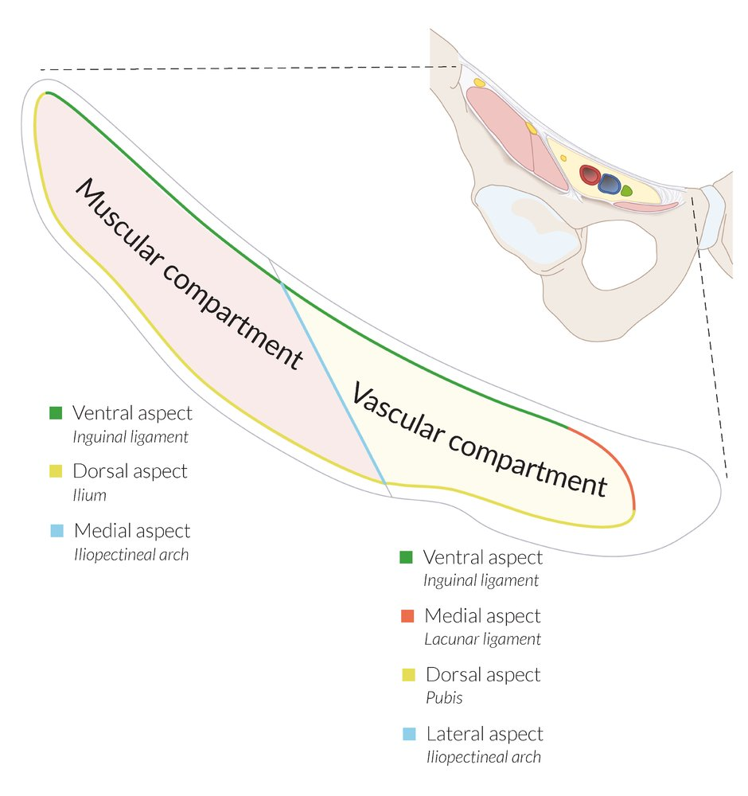

Boundaries of the muscular lacuna and vascular lacuna

---

## Pelvic cavity and pelvic spaces

### Pelvic cavity

* Definition: the space within the <u>pelvic girdle</u>

* Structures passing through: parts of the <u>gastrointestinal tract</u> (e.g., <u>colon</u> and <u>rectum</u>), urogenital tract (e.g., <u>ureters</u>, <u>bladder</u>, <u>uterus</u>), major <u>blood vessels</u> (e.g., <u>iliac arteries</u> and their branches), nerves (e.g., <u>pudendal nerve</u>), muscles that attach to the <u>spine</u> and the lower limbs (e.g., <u>psoas</u> muscle and <u>iliacus muscle</u>)

* Openings

* Superior opening: formed by the <u>pelvic inlet</u>

* Inferior opening: formed by the <u>pelvic outlet</u>

* Boundary: <u>pelvic floor</u> (holds <u>pelvic</u> organs in place)

### Pelvic spaces

The <u>pelvic spaces</u> include <u>peritoneal spaces</u> located within the <u>pelvic cavity</u>  and extraperitoneal anatomical spaces of the <u>pelvic cavity</u>. They vary significantly between male and female individuals due to their different reproductive organs.

* In female individuals 

* Rectouterine pouch (pouch of Douglas) 

* <u>Peritoneal space</u> formed by an indentation in the layer of <u>peritoneum</u> covering the <u>uterus</u>, <u>vagina</u>, and the <u>anterior</u> <u>rectum</u>

* The lowest part of the <u>peritoneal cavity</u> in the upright position in female individuals, where <u>intraperitoneal</u> fluid (e.g., <u>ascites</u>, blood, <u>pus</u>, malignant cells) and <u>endometrial</u> implants preferentially collect

* Vesicouterine pouch

* <u>Peritoneal space</u> formed by the <u>peritoneal</u> cover of the fundus and body of the <u>uterus</u> posteriorly and the posterosuperior surface of the <u>bladder</u> anteriorly

* Bounded posterolaterally by the broad and round <u>ligaments</u> of the <u>uterus</u>

* In male individuals  
* Rectovesical pouch (<u>pouch of Douglas</u>)

* <u>Peritoneal space</u> formed by an indentation in the layer of <u>peritoneum</u> that covers the <u>posterior</u> <u>bladder</u> and <u>anterior</u> <u>rectum</u>

* The lowest part of the <u>peritoneal cavity</u> in the upright position in male individuals, where <u>intraperitoneal</u> fluid (e.g., <u>ascites</u>, blood, <u>pus</u>) preferentially collects

* In female and male individuals

* Pararectal fossa

* <u>Peritoneal space</u> formed by folds of <u>peritoneum</u> on either side of the <u>rectum</u> and the <u>lateral</u> wall of the <u>pelvis</u>

* Laterally continuous with the <u>rectovesical pouch</u> in male individuals and the <u>rectouterine pouch</u> in female individuals

* Ischiorectal fossae

* Extraperitoneal, fat-filled spaces inferior to the <u>pelvic diaphragm</u>

* Surround the <u>anal canal</u>

* <u>Lateral</u> walls contain the <u>pudendal nerve</u> on each side of the <u>Alcock canal</u>.

* Allow expansion of the <u>anal canal</u> during defecation

* Retropubic space: extraperitoneal, fat-filled space between the <u>pubis</u> and the <u>anterior</u> surface of the <u>bladder</u>

Female pelvic organs

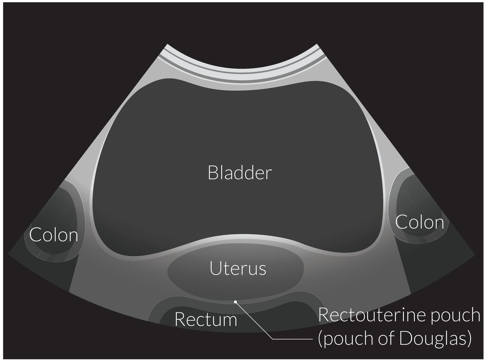

Rectouterine pouch of Douglas

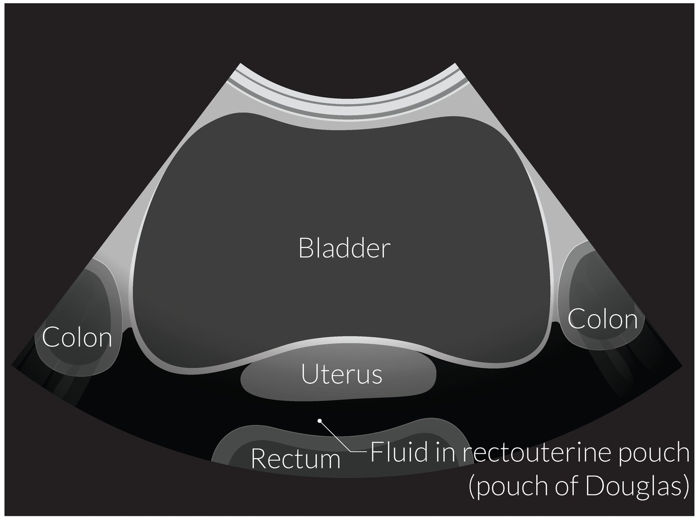

Free fluid in the rectouterine pouch of Douglas

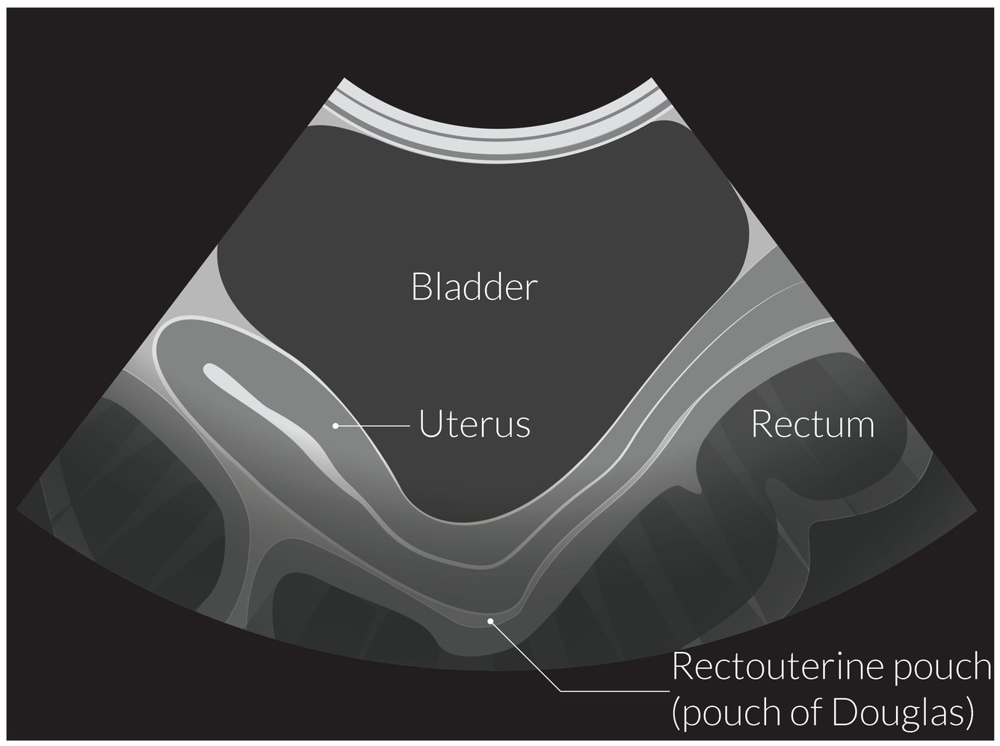

Rectouterine pouch of Douglas

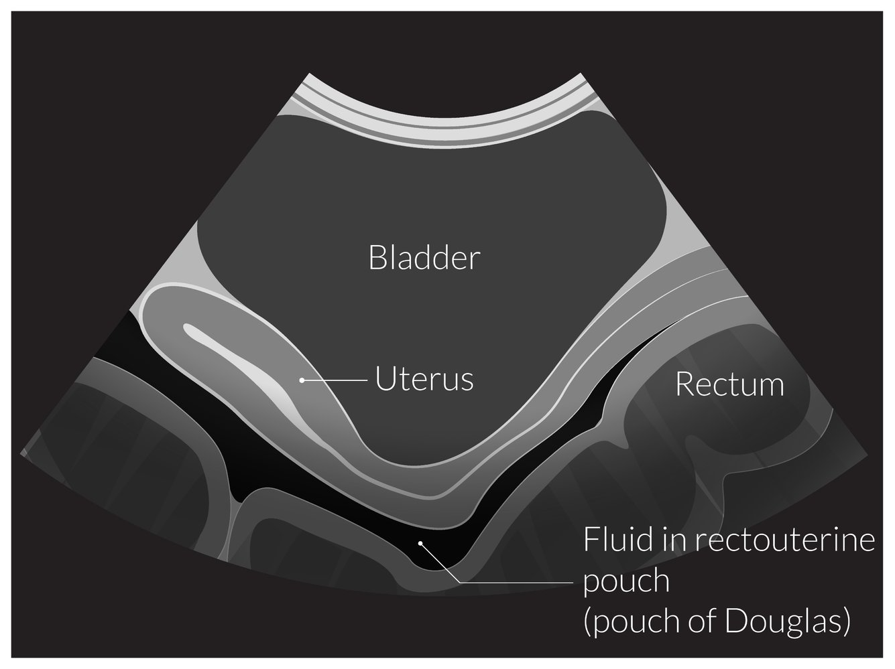

Free fluid in rectouterine pouch of Douglas

Median section of the male pelvis with detail of a testicle

---

## Pelvic floor and perineal region

### Pelvic floor

* Supports the abdominal and <u>pelvic</u> <u>viscera</u>

* Prevents prolapse of the <u>pelvic</u> organs

* Assists in increasing <u>intraabdominal pressure</u>

* Plays an integral role in urinary continence and defecation

* For information on the <u>defecation process</u>, see “Function” in “<u>Large intestine</u>.”

* For information on the <u>urination</u> process, see “<u>Urinary bladder</u>” in “<u>Overview of the urinary tract</u>.”

* Contains two openings formed by a gap between the <u>levator ani muscles</u>

* Urogenital hiatus

* Allows passage of <u>urethra</u> and <u>vagina</u> (in female individuals)

* <u>Anterior</u> to the <u>anus</u>

* Rectal hiatus

* Allows passage of the <u>rectum</u>

* Centrally positioned in the <u>pelvic floor</u>, <u>posterior</u> to the <u>perineal body</u>

* Stabilized by the perineal body: <u>central tendon</u> of the <u>perineum</u>, located between the anal and <u>urogenital hiatus</u>

#### Layers of the <u>pelvic floor</u>

##### Pelvic diaphragm

* Description: innermost layer of the <u>pelvic floor</u>

* Components

* <u>Levator ani muscle</u>

* Broad muscular sheet that forms the majority of the musculature of the <u>pelvic floor</u>

* Can be divided into three separate muscles: <u>pubococcygeus</u>, <u>puborectalis</u>, <u>iliococcygeus</u>

* <u>Coccygeus muscle</u>: <u>posterior</u> to the <u>levator ani muscle</u>

* Surrounded by the superior and inferior <u>fascia</u> of the <u>pelvic diaphragm</u>

* Anococcygeal ligament: a fibrous raphe mainly formed by fibers of the <u>levator ani muscles</u> uniting in the midline; connected to the <u>coccyx</u> and located <u>posterior</u> to the <u>anus</u>

|  Muscles of the <u>pelvic diaphragm</u>  |  |  |  |  |  |
| --- | --- | --- | --- | --- | --- |
| Muscle |  | Origin | Insertion | Innervation | Function |
| Levator ani | Puborectalis |  * <u>Pubic symphysis</u>   |   * Forms a U-shaped sling around the lower <u>rectum</u>  * Some <u>medial</u> fibers form another sling around the <u>urethra</u> (and <u>vagina</u> in female individuals).    |  * <u>Anterior</u> branches of sacral nerves (from <u>S2</u>–<u>S4</u> roots) and the perineal branch of the <u>pudendal nerve</u>   |   * Aids in fecal continence by maintaining the anorectal angle  * Relaxation of the muscle is required for defecation.  * Aids in maintaining urinary continence    |
| Pubococcygeus |  * Body of the <u>pubis</u>   |   * <u>Anococcygeal ligament</u>  * <u>Medial</u> fibers form the pubovaginalis muscle in female individuals and the levator <u>prostate</u> muscle in male individuals.    |   * Aids in urinary continence and assists in <u>ejaculation</u>  * Supports and stabilizes the <u>pelvic floor</u>  * Supports proper positioning of the <u>infant</u>'s head during <u>childbirth</u>    |  |  |
| Iliococcygeus |   * <u>Ischial spine</u>  * <u>Obturator internus</u> <u>fascia</u>    |  * <u>Anococcygeal ligament</u>   |  * Elevates the <u>pelvic floor</u> and the anorectal canal   |  |  |
| Coccygeus |  |  * <u>Ischial spine</u>   |   * <u>Sacrum</u> and <u>coccyx</u>  * Overlying the <u>sacrospinous ligaments</u>    |  * Branches of sacral nerves (<u>S4</u>–S5)   |  * Stabilizes the <u>pelvic floor</u> (complements <u>levator ani muscle</u>)   |

Layers of the pelvic floor

##### Urogenital diaphragm

* Description

* Middle layer of the <u>pelvic floor</u>

* Spans between the ischial and pubic rami

* Separates the upper <u>pelvis</u> from the <u>deep perineal pouch</u>

* Components

* <u>Deep transverse perineal muscle</u> (fibers form the <u>urethral sphincter</u>)

* <u>Urethral sphincter</u>: consists of two muscles that encircle the <u>urethra</u> and control the flow of urine

* <u>Internal urethral sphincter</u> (<u>smooth muscle</u>)

* <u>External urethral sphincter</u> (<u>skeletal muscle</u>) In male individuals: surrounds the <u>membranous urethra</u>
* In female individuals: consists of three parts (sphincter muscle, compressor urethrae, urethrovaginal muscle)

* Enclosed by the superior and <u>inferior fascia of the urogenital diaphragm</u> (i.e., <u>perineal membrane</u>).

* The <u>perineal body</u> is located <u>posterior</u> to the <u>deep transverse perineal muscle</u> (between the anal and <u>urogenital hiatus</u>).

| Muscles of the <u>urogenital diaphragm</u> |  |  |  |  |  |
| --- | --- | --- | --- | --- | --- |
| Muscle |  |  | Anatomy | Innervation | Function |
|  Deep transverse perineal muscle   |  |  |   * Runs from the ischial ramus towards the <u>median plane</u> to form a tendinous raphe with its counterpart muscle  * Gives passage to the <u>urethra</u> (and the <u>vagina</u> in female individuals)    |  * <u>Pudendal nerve</u>   |  * Supports the <u>pelvic floor</u>   |
|  Urethral sphincter   | Internal urethral sphincter |  |  * Surrounds the <u>bladder neck</u> (at the junction of the <u>urethra</u> and <u>urinary bladder</u>)   |  * <u>Autonomic nervous system</u> (no voluntary control)   |   * Aids in maintaining urinary continence  * Prevents <u>retrograde ejaculation</u>    |
| External urethral sphincter | In male individuals |   * Runs from the ischiopubic ramus towards the <u>median plane</u>, where it connects with its counterpart muscle  * Surrounds the <u>membranous urethra</u>    |  * Deep perineal branch of the <u>pudendal nerve</u> (voluntary control)   |  * Aids in maintaining urinary continence   |  |
| In female individuals |  * Consists of three parts (from the inside out):  * Sphincter muscle: muscle fibers encircling ∼ ⅔ of the <u>proximal</u> <u>urethra</u>  * Compressor urethrae muscle  * Continuous with the inferior fibers of the sphincter muscle  * Contraction causes the <u>urethra</u> to collapse against the <u>vagina</u>.  * Urethrovaginal muscle: broad band of muscle fibers surrounding both <u>urethra</u> and <u>vagina</u>   |   * Aids in maintaining urinary continence  * Contraction of the compressor urethrae causes the <u>urethra</u> to collapse against the <u>vagina</u>.    |  |  |  |

For more information on the muscles of the <u>urinary tract</u>, see “<u>Overview of the urinary tract</u>.”

Layers of the pelvic floor

Urinary bladder (male)

Urinary bladder (female)

##### Superficial perineal layer

* Outermost layer of the <u>pelvic floor</u>

* Components

* <u>Ischiocavernosus muscle</u>

* <u>Bulbocavernosus muscle</u> (<u>bulbospongiosus muscle</u> in male individuals)

* <u>External anal sphincter</u>

* Superficial transverse perineal muscle

* Origin: <u>ischial tuberosities</u>, ischial rami

* Insertion: <u>perineal body</u>

* Function: stabilizes the <u>perineal body</u>

* Innervation: <u>pudendal nerve</u>

Layers of the pelvic floor

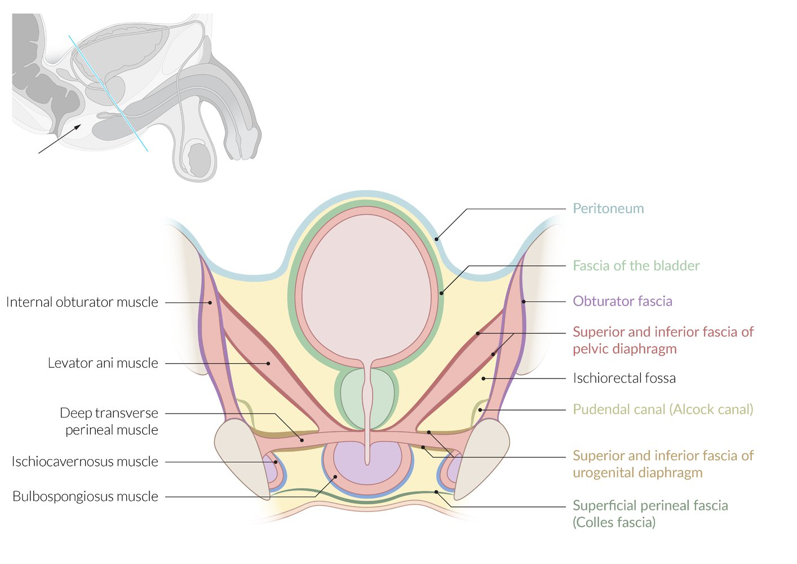

Pelvic fascia (male)

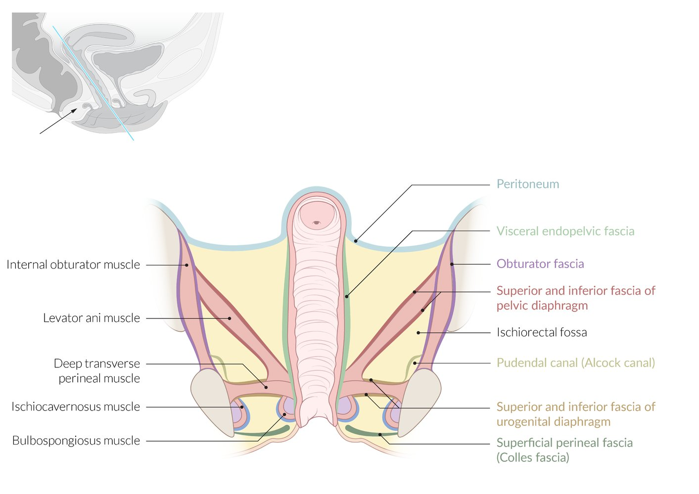

Pelvic fascia (female)

### Perineal region

* Definition: an anatomical region inferior to the <u>pelvic diaphragm</u>

* Boundaries

* <u>Anterior</u>: <u>pubic symphysis</u>

* <u>Posterior</u>: <u>coccyx</u>

* <u>Lateral</u>: inferior rami of the ischial and pubic bones, <u>sacrotuberous ligament</u>

* Superior: <u>pelvic diaphragm</u>

* Inferior: <u>skin</u>

#### Divisions of the <u>perineal region</u>

The <u>perineal region</u> can be divided by an imaginary line between the <u>ischial tuberosities</u>. This line forms two triangles within the <u>perineal region</u>, the <u>urogenital triangle</u> anteriorly and the <u>anal triangle</u> posteriorly. The contents of each triangle are listed below.

* Urogenital triangle

* Deep perineal pouch

* Space between the superior and <u>inferior fascia of the urogenital diaphragm</u> (<u>perineal membrane</u>)

* Contains the <u>deep transverse perineal muscle</u>, <u>urethral sphincter</u>, part of the <u>urethra</u>, and the <u>vagina</u> in female individuals

* Perineal membrane

* A triangular-shaped sheet of dense fibrous tissue

* Provides attachment to the muscles of the external genitalia

* Allows passage of the <u>urethra</u> and <u>vagina</u>

* Superficial perineal pouch

* Space between the <u>inferior fascia of the urogenital diaphragm</u> (<u>perineal membrane</u>) and the <u>Colles fascia</u>

* Contains erectile tissues of the <u>clitoris</u> and <u>penis</u>, the <u>Bartholin glands</u>, the <u>ischiocavernosus muscle</u>, the <u>bulbocavernosus muscle</u> (<u>bulbospongiosus muscle</u> in male individuals), and the <u>superficial transverse perineal muscle</u>

* Anal triangle

* <u>Anal canal</u> and orifice

* <u>External anal sphincter</u> muscle

* <u>Ischiorectal fossae</u>

* Perineum

* A diamond-shaped, <u>superficial</u> area between the <u>anus</u> and external genitalia

* Bounded laterally by the <u>medial</u> thighs, anteriorly by the <u>mons pubis</u> (in female individuals) or the base of the <u>penis</u> (in male individuals), and posteriorly by the superior end of the <u>intergluteal cleft</u>

Pelvic fascia (female)

Pelvic fascia (male)

---

## Vessels, nerves, and lymphatics of the pelvis

### <u>Arteries</u>

#### Internal iliac artery

The blood supply of the <u>pelvis</u> is primarily derived from the <u>internal iliac artery</u>, which originates from the bifurcation of the <u>common iliac artery</u>. The <u>internal iliac artery</u> divides into the <u>anterior</u> trunk and the <u>posterior</u> trunk.

* <u>Anterior</u> trunk

* <u>Umbilical artery</u>

* <u>Artery</u> to the <u>ductus deferens</u>

* Superior vesical <u>arteries</u>: blood supply for the superior aspect of the <u>bladder</u>

* Inferior vesical artery: supplies the fundus of the <u>bladder</u> and lower part of the <u>ureter</u>; in male individuals also supplies the <u>prostate gland</u>, <u>seminal vesicles</u>, and <u>ductus deferens</u>

* Vaginal artery: supplies the <u>anterior</u> and <u>posterior</u> wall of the <u>vagina</u>

* Uterine artery (in female individuals)

* Superior branch: supplies the body and <u>fundus of the uterus</u>

* Vaginal branch: supplies the <u>cervix</u> of the <u>uterus</u> and the <u>vagina</u>

* <u>Anastomoses</u> with the <u>ovarian artery</u>

* Inferior gluteal artery: supplies <u>the gluteal region</u> and thigh

* Middle rectal artery

* Supplies the lower <u>rectum</u>, upper <u>anal canal</u>, and the <u>ureter</u>

* In male individuals: supplies the <u>prostate gland</u> and <u>seminal vesicles</u>

* In female individuals: supplies the <u>vagina</u>

* Obturator artery: supplies the <u>medial compartment of the thigh</u> and the head of the <u>femur</u> (via the <u>foveolar artery</u>)

* <u>Internal pudendal artery</u>: supplies the <u>perineum</u>, genitalia, <u>anal canal</u>, and erectile tissues

* <u>Posterior</u> trunk

* Iliolumbar artery

* Iliac branch: supplies the <u>ilium</u> and the <u>iliacus muscle</u>

* Lumbar branch: supplies the <u>quadratus lumborum muscle</u> and the <u>psoas major muscle</u>

* Lateral sacral arteries: supply the <u>skin</u> <u>posterior</u> to the <u>sacrum</u>

* Superior gluteal artery: supplies the muscles and <u>skin</u> of <u>the gluteal region</u>

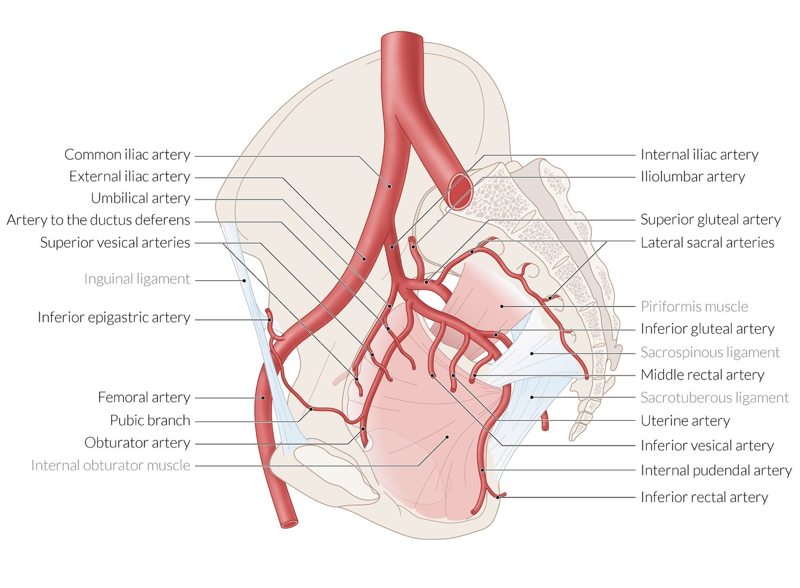

Arteries of the pelvic cavity

#### Other <u>arteries</u>

* Median sacral artery

* Arises from the <u>posterior</u> wall of the aorta, <u>proximal</u> to the bifurcation

* Supplies the <u>coccyx</u>, <u>lumbar vertebrae</u>, and <u>sacrum</u>

* Superior rectal artery

* Continuation of the <u>inferior mesenteric artery</u>

* Supplies the <u>anal canal</u> <u>above the pectinate line</u> (upper ⅔ of the <u>rectum</u>)

* Ovarian artery

* Arises from the <u>abdominal aorta</u> inferior to the <u>renal arteries</u>

* Crosses the <u>proximal</u> end of the <u>external iliac artery</u>

* Supplies the <u>ovary</u> and the <u>lateral</u> third of the <u>fallopian tube</u> through the <u>suspensory ligament of the ovary</u>

* Forms an <u>anastomosis</u> with the ovarian branch of the uterine <u>arteries</u>

### <u>Veins</u>

The <u>veins</u> follow the course of the <u>arteries</u> and are named accordingly, and they drain the same structures supplied by the <u>arteries</u> (e.g., <u>internal iliac artery</u> and internal iliac vein).

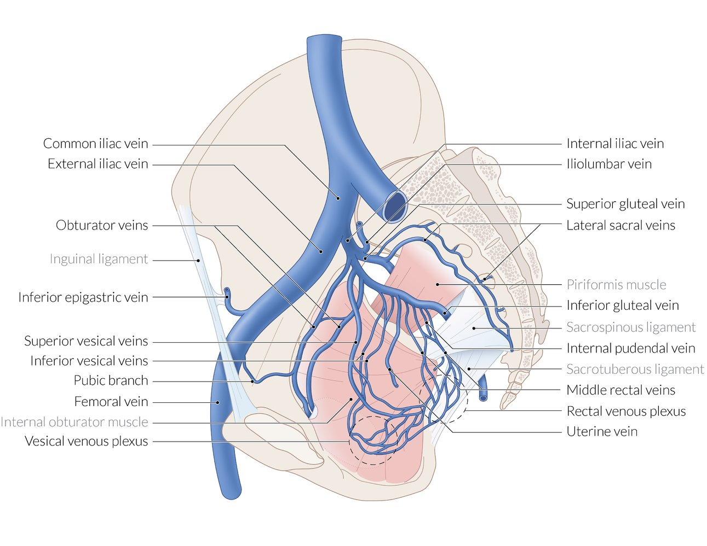

Veins of the pelvic cavity

### Nerves

#### Autonomic innervation

* <u>Parasympathetic</u> and <u>sympathetic</u> fibers

* <u>Superior hypogastric plexus</u>: distribution of fibers to the nerve plexus of the urogenital organs (e.g., <u>testicular plexus</u>, <u>ureteric plexus</u>); innervates <u>ovaries</u>, <u>testes</u>, <u>hindgut</u>, and the middle third of the <u>ureter</u>

* <u>Inferior hypogastric plexus</u> (<u>pelvic plexus</u>)

* Distribution of fibers to the nerve plexus of urogenital organs (e.g., <u>prostatic plexus</u>, <u>uterovaginal plexus</u>, <u>ovarian plexus</u>) and thereby innervates a majority of <u>viscera</u> within the <u>pelvic cavity</u> (e.g., <u>distal</u> third of the <u>ureter</u>, <u>ovaries</u>, <u>uterus</u>, upper <u>vagina</u>, <u>prostate</u>)

* Directly innervates <u>rectum</u>, <u>internal anal sphincter</u>, <u>bladder</u>, and <u>urethra</u>

* <u>Hypogastric nerve</u>: responsible for the emission of semen into the <u>posterior urethra</u> in male individuals

* <u>Parasympathetic</u> fibers: <u>pelvic splanchnic nerves</u> innervate the <u>hindgut</u> and <u>pelvic</u> organs (e.g., <u>bladder</u>)

* <u>Sympathetic</u> fibers: <u>sacral splanchnic nerves</u> <u>synapse</u> at the <u>inferior hypogastric plexus</u>

For additional information on the autonomic <u>innervation of the pelvis</u>, see “Nerves of the <u>abdominal cavity</u>” in “<u>Abdominal cavity</u>.”

#### Somatic innervation

* Pudendal nerve (<u>S2</u>–<u>S4</u>)
* Innervated structures

* Motor: external <u>urethral sphincter</u>, <u>external anal sphincter</u>, <u>levator ani</u>, <u>bulbospongiosus muscle</u>, <u>ischiocavernosus muscle</u>

* Sensory

* <u>Perineum</u>, <u>penis</u>/<u>clitoris</u>, <u>posterior</u> <u>scrotum</u>/labia, <u>anal canal</u>

* Responsible for <u>reflex erection</u>

* <u>Sympathetic</u>

* Fibers to the <u>penis</u>/<u>clitoris</u>

* Responsible for male <u>ejaculation</u>

For additional information on the lumbar and <u>sacral plexus</u> see ”<u>Thigh, knee, and popliteal fossa</u>” and for information on the innervation of the <u>gluteal muscles</u>, see “<u>The gluteal region</u>” below.

### <u>Lymphatics</u>

The <u>pelvic</u> <u>lymphatics</u> course along the internal iliac vessels and drain into the <u>lymph nodes</u> listed below.

* Inferior <u>mesenteric</u> and aortic <u>lymph nodes</u>: receive <u>lymph</u> from the upper part of the <u>rectum</u>

* <u>Paraaortic lymph nodes</u>: drain the <u>ovaries</u>, <u>fallopian tubes</u>, and the <u>fundus of the uterus</u>

* Internal and <u>external iliac lymph nodes</u>: drain the body and <u>cervix</u> of the <u>uterus</u>, <u>bladder</u>, <u>prostate</u>, and <u>rectum</u>

---

## The gluteal region

<u>The gluteal region</u> consists of a group of muscles that form the buttocks. These muscles arise from the <u>pelvic girdle</u>, are innervated by nerves that leave the <u>pelvis</u> through the <u>greater sciatic foramen</u>, and receive vascular supply from the superior and inferior gluteal <u>arteries</u>.

| Overview of the gluteal muscles |  |  |  |  |  |
| --- | --- | --- | --- | --- | --- |
| Muscle group | Muscle | Origin | Insertion | Innervation |  Function   |
| <u>Superficial</u> <u>gluteal muscles</u> | Gluteus maximus |  * <u>Sacrum</u>, <u>coccyx</u>, <u>ilium</u>, and <u>sacrotuberous ligament</u>   |  * Iliotibial band, gluteal tuberosity of the <u>femur</u>   |  * Inferior gluteal nerve: arises from L5, <u>S1</u>, <u>S2</u>   |   * <u>Lateral</u> rotation and extension of the <u>hip joint</u>  * <u>Abduction</u> (upper fibers) and <u>adduction</u> (lower fibers) of the thigh    |
| Gluteus medius |  * Outer surface of the <u>ilium</u>, between the iliac crest and the <u>anterior</u> and <u>posterior</u> gluteal lines   |  * Greater trochanter   |  * Superior gluteal nerve: arises from L4, L5, <u>S1</u>   |   * <u>Abduction</u> of the hip  * <u>Anterior</u> fibers (<u>lateral</u> portion): <u>flexion</u> and <u>medial</u> rotation of the hip  * <u>Posterior</u> fibers (<u>medial</u> portion): extension and <u>lateral</u> rotation of the hip  * Stabilize the <u>pelvis</u> in the <u>coronal plane</u>    |  |
| Gluteus minimus |  * Outer surface of the <u>ilium</u>, between the <u>anterior</u> and <u>posterior</u> gluteal lines   |  |  |  |  |
| Tensor fasciae latae |  * Iliac crest, <u>anterior</u>-superior iliac <u>spine</u>   |  * <u>Iliotibial band</u>   |  * <u>Medial</u> rotation, <u>flexion</u>, and <u>abduction</u> of the thigh   |  |  |
| Deep <u>gluteal muscles</u> | Piriformis |  * <u>Anterior</u> surface of the <u>sacrum</u> and <u>sacrotuberous ligament</u>   |  * Greater trochanter   |  * Nerve to <u>piriformis</u>   |  * <u>Lateral</u> rotation and <u>abduction</u> of the thigh   |
| Obturator internus |  * Ischiopubic ramus, <u>obturator membrane</u>   |  * Nerve to <u>obturator internus</u>   |  |  |  |
| Superior gemellus |  * <u>Ischial spine</u>   |  * <u>Lateral</u> rotation of the thigh   |  |  |  |
| Inferior gemellus |  * <u>Ischial tuberosity</u>   |  * Nerve to <u>quadratus femoris</u>   |  |  |  |
| Quadratus femoris |  * Intertrochanteric crest   |  |  |  |  |

> [!NOTE]
> All <u>superficial</u> <u>gluteal muscles</u> <u>abduct</u> and medially rotate the thigh. All deep <u>gluteal muscles</u> and the <u>gluteus maximus</u> laterally rotate the thigh.

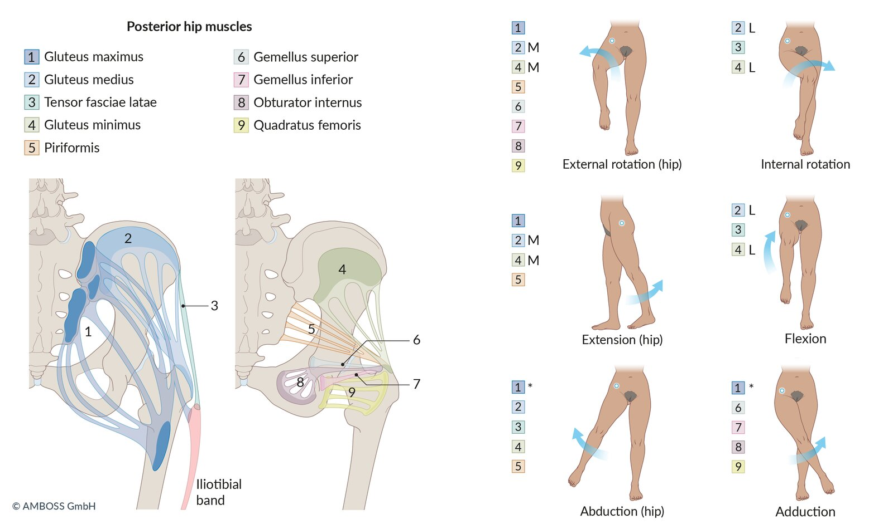

Superficial and deep muscles of the gluteal region

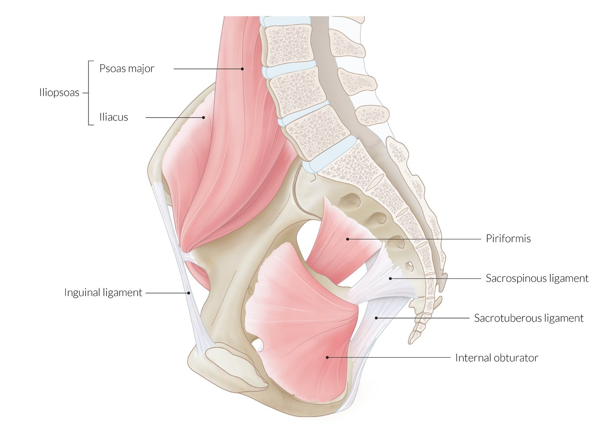

Muscles and ligaments of the pelvis

---

## Hip joint

### Articulating bones

* Acetabulum 

* Cup-like structure on the <u>lateral</u> side of the bony <u>pelvis</u> that articulates with the round femoral head

* Covered by the acetabular labrum: ring of <u>cartilage</u> that provides an articular surface for the femoral head

* Stabilized by capsular <u>ligaments</u> (<u>iliofemoral ligament</u>, <u>ischiofemoral ligament</u>, <u>pubofemoral ligament</u>)

* Surrounded by a fibrous capsule

* Attaches to the margin of the <u>acetabulum</u> and to the <u>transverse acetabular ligament</u>

* Attaches to the neck of the <u>femur</u>

* <u>Anterior</u>: intertrochanteric line (<u>anterior</u>) and the greater trochanter

* <u>Posterior</u>: intertrochanteric crest

* Encloses the femoral head and neck

* <u>Femur</u>: See “The <u>femur</u>” in “<u>Thigh, knee, and popliteal fossa</u>.”

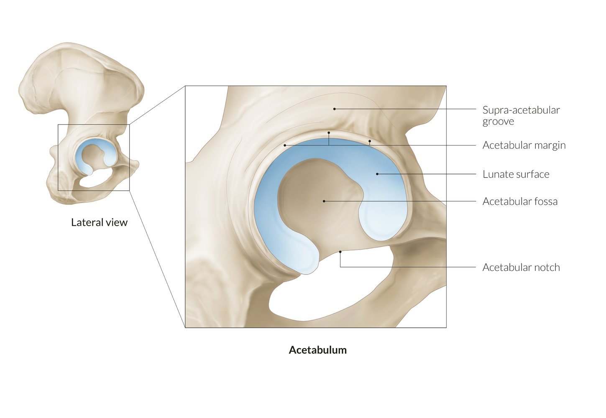

Acetabulum

### Ligaments of the hip joint

| Overview of the <u>ligaments of the hip joint</u> |  |  |
| --- | --- | --- |
|  | Description | Function |
| Iliofemoral ligament |   * Reinforces the fibrous capsule anteriorly  * Y-shaped <u>ligament</u> that runs from the <u>anterior</u> inferior iliac <u>spine</u> and the <u>acetabular</u> rim to the intertrochanteric line and the greater trochanter  * Strongest <u>ligament</u> in the human body    |  * Prevents excessive <u>lateral</u> rotation and hyperextension of the hip (in the standing position)   |
| Ischiofemoral ligament |   * Reinforces the fibrous capsule posteriorly  * Runs from the ischial region of the <u>acetabulum</u> to the neck of the <u>femur</u> <u>medial</u> to the greater trochanter    |  * Limits <u>medial</u> rotation and extension of the thigh   |
| Pubofemoral ligament |   * Runs from the pubic part of the <u>acetabular</u> rim and the superior pubic ramus to the lower part of the femoral neck  * Reinforces the fibrous capsule inferiorly    |  * Limits <u>abduction</u> and extension   |
| Transverse acetabular ligament |  * Fibrous structure on the lower part of the <u>acetabulum</u> that converts the <u>acetabular</u> notch into a foramen   |  * Allows passage of vessels and nerves into the <u>joint</u> space   |
| Round ligament of the head of femur |  * Originates within the <u>acetabular</u> fossa and attaches to the <u>fovea capitis femoris</u> (on the head of the <u>femur</u>)   |  * Forms a pathway for the <u>foveolar artery</u> to the head of the <u>femur</u>   |

Hip joint anatomy

### Arterial supply of the hip joint

* Superior and inferior gluteal <u>arteries</u>

* <u>Deep femoral artery</u>: main branch of the <u>femoral artery</u>

* Medial femoral circumflex artery

* Arises from the posteromedial side of the <u>profunda femoris artery</u>

* Supplies the head and neck of the <u>femur</u>

* Lateral femoral circumflex artery

* Arises from the <u>lateral</u> side of the <u>profunda femoris artery</u>

* Supplies the head and neck of the <u>femur</u>

* Foveolar artery

* Most commonly arises from the <u>obturator artery</u> and less commonly from the <u>medial circumflex femoral artery</u>

* Passes through the <u>ligament</u> of the <u>femur</u> head

* Supplies the head of the <u>femur</u>

Arteries of the femoral head with watershed zone

### Movements of the hip joint

The muscles enabling movement of the <u>hip joint</u> can be divided into the <u>gluteal muscles</u> (see “<u>The gluteal region</u>” above) and the musculature of the thigh (see “Muscles of the thigh” in “<u>Thigh, knee, and popliteal fossa</u>”).

* <u>Flexion</u>

* <u>Iliacus</u> and <u>psoas major</u>

* <u>Rectus femoris</u>

* <u>Tensor fasciae latae</u>

* <u>Pectineus</u>

* <u>Sartorius</u>

* <u>Gluteus medius</u> and minimus (<u>anterior</u> fibers)

* <u>Adductor longus</u>, brevis, and minimus

* <u>Gracilis</u>

* Extension

* <u>Gluteus maximus</u>

* <u>Semitendinosus</u>

* <u>Semimembranosus</u>

* <u>Biceps femoris</u>

* <u>Gluteus medius</u> and minimus (<u>posterior</u> fibers)

* <u>Adductor magnus</u> (hamstring part)

* <u>Abduction</u>

* <u>Gluteus medius</u> and minimus

* <u>Gluteus maximus</u> (upper fibers)

* <u>Tensor fasciae latae</u>

* <u>Piriformis</u>

* <u>Obturator externus</u>

* <u>Sartorius</u>

* <u>Adduction</u>

* <u>Adductor magnus</u>

* <u>Adductor longus</u>

* <u>Adductor brevis</u>

* <u>Gluteus maximus</u> (lower fibers)

* <u>Obturator externus</u>

* <u>Pectineus</u>

* <u>Gracilis</u>

* <u>Internal rotation</u> (<u>medial</u> rotation)

* <u>Gluteus medius</u> and minimus (<u>anterior</u> fibers)

* <u>Tensor fasciae latae</u>

* <u>External rotation</u> (<u>lateral</u> rotation)

* <u>Iliacus</u> and <u>psoas major</u>

* <u>Gluteus maximus</u>

* <u>Piriformis</u>

* <u>Obturator externus</u> and internus

* <u>Gluteus medius</u> and minimus (<u>posterior</u> fibers)

* Superior and <u>inferior gemellus</u>

* <u>Quadratus femoris</u>

* <u>Pectineus</u>

* <u>Sartorius</u>

Hip joint range of motion

---

## Clinical significance

* <u>Sacroiliitis</u> (associated with e.g., <u>ankylosing spondylitis</u>, <u>inflammatory bowel disease</u>)

* <u>Pelvic organ prolapse</u>

* <u>Obturator hernia</u>

* <u>Femoral hernia</u>

* <u>Hip replacement</u>

* <u>Hip fractures</u>

* <u>Coxarthrosis</u>

* <u>Avascular necrosis of the femoral head</u> (due to insufficient supply by the <u>foveolar artery</u>)

* <u>Trendelenburg sign</u>: Injury to the <u>superior gluteal nerve</u> leads to <u>paralysis</u> of the <u>gluteus medius</u> and minimus that results in a positive <u>Trendelenburg sign</u> and a <u>Trendelenburg gait</u>.

* Pudendal nerve block: injection of a <u>local anesthetic</u> into the <u>pudendal canal</u> to block transmission within the <u>pudendal nerve</u>

* Most commonly used during <u>childbirth</u> prior to an <u>episiotomy</u> or during surgical procedures involving the <u>perineum</u>

* The <u>ischial spine</u> is used as a landmark for injection.

* <u>Pudendal nerve injury</u> (due to, e.g., <u>pelvic</u> trauma, <u>pelvic</u> <u>surgery</u>) → urinary and/or <u>fecal incontinence</u>

* Piriformis syndrome

* A condition caused by entrapment of the <u>sciatic nerve</u> due to trauma or strain of the <u>piriformis muscle</u>

* Manifests with buttock <u>pain</u> and <u>paresthesia</u> in the distribution of the <u>sciatic nerve</u>

* <u>Urinary incontinence</u>

* <u>Premature ejaculation</u>

* <u>Pouch of Douglas</u>

* In the upright position, the <u>pouch of Douglas</u> is the lowest part of the <u>peritoneal cavity</u>, where blood, <u>pus</u>, malignant cells, and <u>endometrial</u> implants preferentially collect.

* Important in the diagnosis of gynecological conditions and emergencies (e.g., <u>ectopic pregnancy</u>, <u>pelvic inflammatory disease</u>)

> [!TIP]
> <u>Kegel exercises</u> involve the contraction of the entire <u>levator ani</u>. These exercises especially strengthen the <u>pubococcygeus</u> muscles, which can treat <u>stress incontinence</u>, <u>urge incontinence</u>, and <u>pelvic organ prolapse</u> and assists in <u>ejaculation</u>.

---