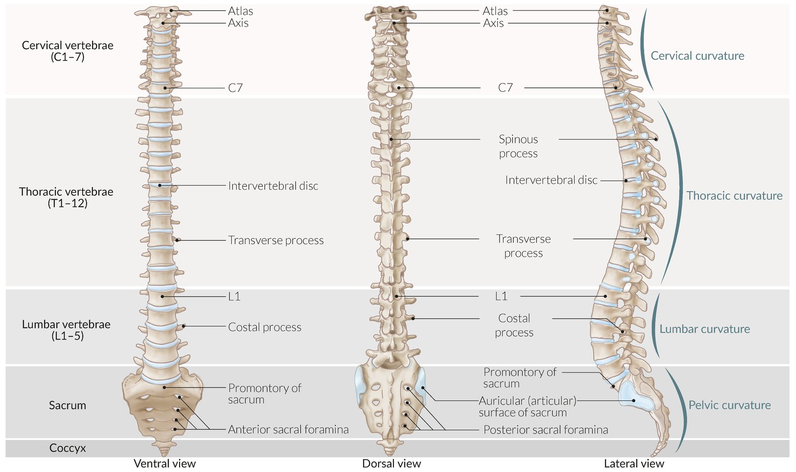
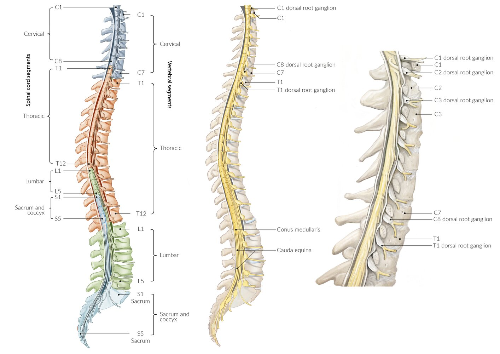
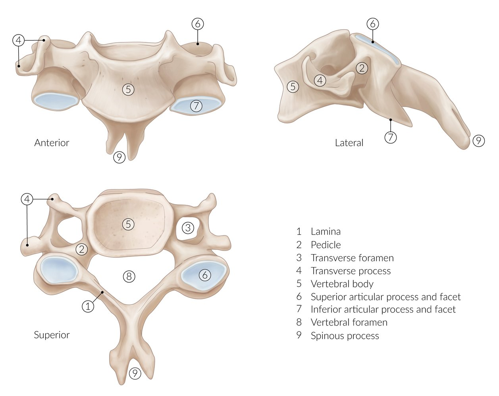
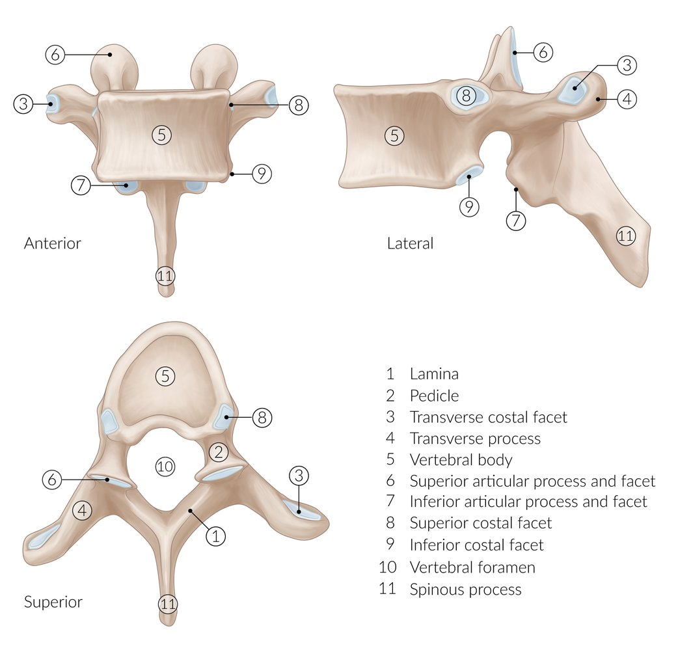
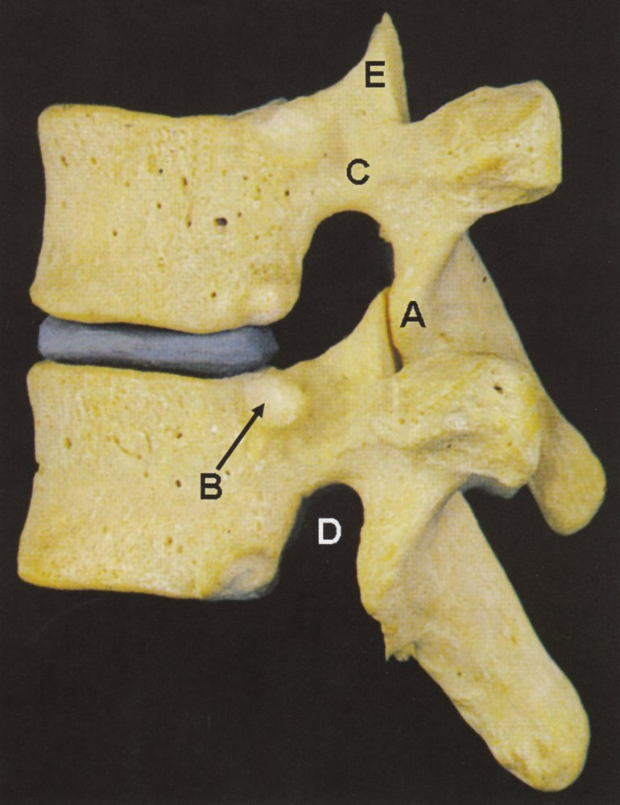
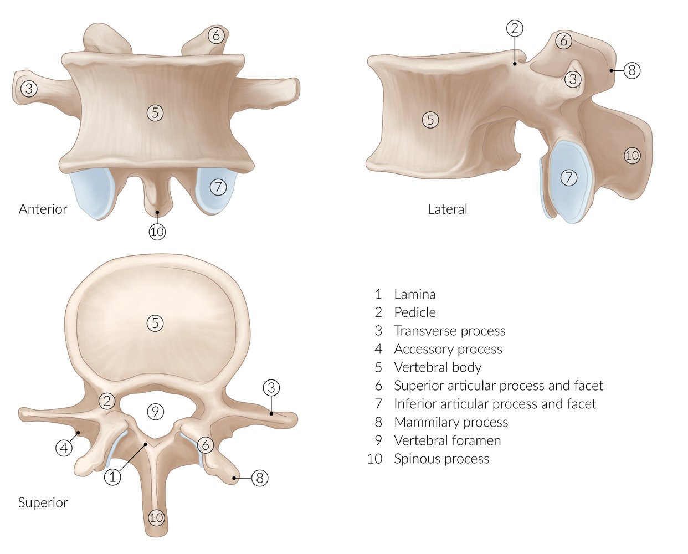
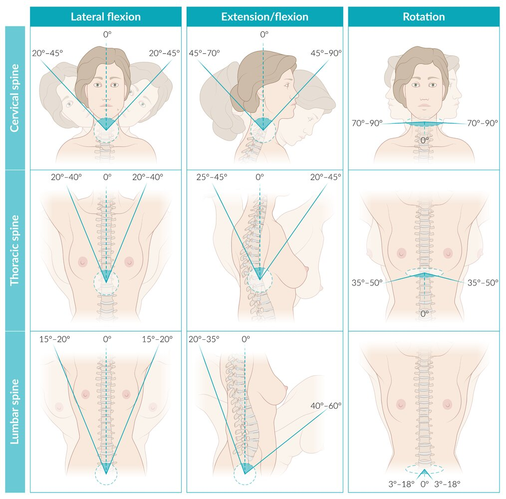
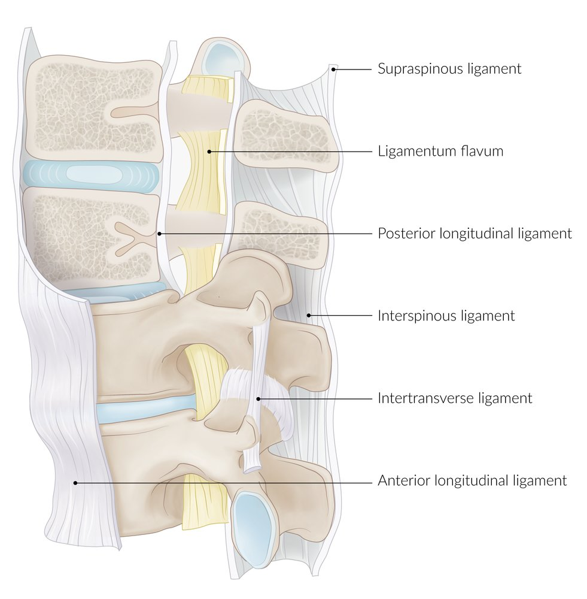
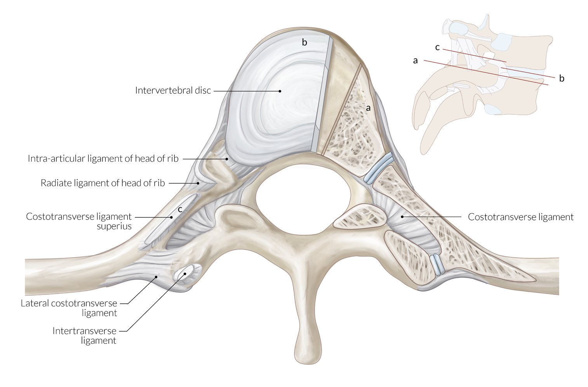

# Vertebral column

*Categories: Clinical knowledge > Internal medicine > Rheumatology and immunology > Basics of rheumatology > Vertebral column*

[Original Article Link](https://coursology-qbank.com/amboss/article/E6085S)

---

## Summary

The <u>vertebral</u> column extends from the <u>skull</u> to the <u>pelvis</u> and consists of 33 <u>vertebrae</u>, which are differentiated into five regions: the <u>cervical spine</u> (C1–C7), the <u>thoracic spine</u> (T1–T12), the <u>lumbar spine</u> (L1–L5), the <u>sacrum</u> (<u>S1</u>–S5; fused in adults), and the <u>coccyx</u> (3–5 fused bones). The functions of the <u>vertebral</u> column include protecting the spinal cord within the <u>vertebral canal</u>; transferring the weight of the upper body to the <u>pelvis</u>; articulating with the <u>skull</u>, <u>ribs</u>, and <u>pelvis</u>; and providing attachment for musculature. It is, furthermore, the main site of <u>hematopoiesis</u> besides the <u>pelvis</u>. The basic <u>vertebra</u> consists of a <u>vertebral body</u> (<u>anterior</u>), a <u>vertebral arch</u> (<u>posterior</u>), and a <u>vertebral foramen</u>, through which runs the spinal cord. More specific morphological features vary according to the region and associated function. Adjacent <u>vertebrae</u> articulate via <u>intervertebral discs</u> and <u>facet joints</u>, and there are specialized <u>joints</u> in the upper cervical region, the thoracic region, and between the <u>sacrum</u> and <u>pelvis</u> for articulation with the head and neck, the <u>ribs</u>, and the hip respectively. Embryologically, the <u>vertebrae</u> are derived from the <u>somites</u> of the <u>paraxial mesoderm</u>, and the <u>nucleus pulposus</u> of the <u>intervertebral discs</u> is derived from the <u>notochord</u>.

---

## Gross anatomy

### Overview [[1]](https://coursology-qbank.com/amboss/article/ES08Yf)[[2]](https://coursology-qbank.com/amboss/article/GNYBcp)

* Characteristics

* The <u>vertebral</u> column consists of 33 <u>vertebrae</u>.

* Differentiated into cervical, thoracic, lumbar, sacral, and coccygeal region

* Has a double-S shape.

* Curves <u>convex</u> anteriorly in the cervical and lumbar regions (lordosis)

* Curves <u>convex</u> posteriorly in the thoracic and sacral regions (kyphosis)

* Function

* Protection of the spinal cord, <u>spinal nerve</u> roots, and associated vasculature

* Transfer of weight from the upper body to the <u>pelvis</u>

* Articulation with the <u>skull</u>, <u>ribs</u>, and <u>pelvis</u>

* Articulations between <u>vertebrae</u> allow for <u>flexion</u>, extension, rotation, and <u>lateral</u> <u>flexion</u> of the trunk

* Attachment site for muscles, including the <u>diaphragm</u> and <u>pelvic floor</u>

* Main site of <u>hematopoiesis</u> besides the <u>pelvis</u>

| Spinal segment | Number of <u>vertebrae</u> | Short term | Curvature |
| --- | --- | --- | --- |
| <u>Cervical spine</u> | 7 | C1–C7 | <u>Lordosis</u> |
| <u>Thoracic spine</u> | 12 | T1–T12 | <u>Kyphosis</u> |
| Lumbar spine | 5 | L1–L5 | <u>Lordosis</u> |
| <u>Sacrum</u> | 5 (fused) | <u>S1</u>–S5 | <u>Kyphosis</u> |
| <u>Coccyx</u> | 3–5 (fused) | - | - |

Vertebral column

Structure of the spinal cord

### Vertebrae [[1]](https://coursology-qbank.com/amboss/article/ES08Yf)[[2]](https://coursology-qbank.com/amboss/article/GNYBcp)

#### Basic <u>vertebral</u> structure

The basic <u>vertebra</u> consists of a <u>vertebral body</u> anteriorly and <u>vertebral arch</u> posteriorly, which together surround the <u>vertebral foramen</u>.

Anatomy of the vertebra

##### Vertebral body

* Cylindrical <u>anterior</u> part of the <u>vertebra</u> responsible for <u>weight bearing</u>

* Contains <u>red bone marrow</u>

* Articulates with the <u>vertebral bodies</u> above and below via the <u>intervertebral disc</u>

##### Vertebral arch

Consists of two pedicles (laterally) and two laminae (posteriorly) with several vertebral processes

* Vertebral pedicles

* <u>Lateral</u> parts of the <u>vertebral arch</u>, between the <u>vertebral body</u> and the laminae

* Concavities on the <u>cranial</u> and <u>caudal</u> sides (<u>vertebral</u> notches) form the <u>intervertebral foramina</u>

* Vertebral laminae

* <u>Posterior</u> part of the <u>vertebral arch</u>, between <u>transverse processes</u> and <u>spinous process</u>

* Attachment site of the <u>ligamentum flavum</u> from C2/3 to the <u>sacrum</u>

* Intervertebral foramina
* <u>Lateral</u> space between the pedicles of two adjacent <u>vertebrae</u>, from which <u>spinal nerves</u> and their vessels emerge

* C1–C7 nerves exit superior to the pedicles of C1–C7.

* C8 nerves exit inferior to the pedicles of C7 because there is no C8 <u>vertebra</u>.

* The T1 nerve and the nerves below exit inferior to the pedicle of the corresponding <u>vertebral body</u>.

* Spinous process: single <u>posterior</u> midline process emerging at the junction of the two laminae

* Transverse processes

* Postero-<u>lateral</u> processes emerging at the junction of the pedicles and laminae on each side

* The <u>transverse processes</u> of the <u>lumbar vertebrae</u> are also called costal processes.

* Articular processes

* Flat surfaces at the junction of the pedicles and laminae, two superiorly and two inferiorly, that articulate with the <u>articular processes</u> of the adjacent <u>vertebrae</u>, forming the zygapophyseal (facet) <u>joints</u>

* The region between the superior and inferior <u>articular processes</u> at the junction of the pedicle and lamina is called the pars interarticularis.

##### Vertebral foramen

* Central space between the <u>vertebral arch</u> and <u>vertebral body</u>

* All <u>vertebral foramina</u> together form the vertebral canal, containing:

* The spinal cord

* <u>Meninges</u>

* <u>Nerve roots</u>

* <u>Blood vessels</u>

#### Specific <u>vertebrae</u>

* C1 (atlas) 

* Has no <u>vertebral body</u>: consists of an <u>anterior</u> and a <u>posterior</u> arch

* Articulates with the occiput cranially and the axis <u>caudally</u>, see “<u>atlanto-occipital joint</u>” and “<u>atlanto-axial joint</u>” below

* C2 (axis) 

* Characterized by the odontoid process (<u>dens</u>), which projects cranially from the <u>vertebral body</u> into the <u>vertebral foramen</u> of the <u>atlas</u>

* Articulates with the <u>atlas</u> cranially, see “<u>atlanto-axial joint</u>” below

* Cervical vertebrae 

* The <u>vertebral arteries</u>, <u>veins</u>, and <u>sympathetic</u> fibers pass through the transverse foramina in the <u>transverse processes</u> of C6–C1 before entering the <u>foramen magnum</u>.

* Have large the largest <u>vertebral foramina</u> to accommodate the cervical enlargement of the spinal cord.

* C2–C6 have bifid spinal processes.

* C7 (<u>vertebra</u> prominens) has a large, easily palpable spinal process to which the <u>ligamentum nuchae</u> attaches.

* Thoracic vertebrae 

* Demifacets on the <u>vertebral bodies</u> and transverse <u>costal facets</u> on the <u>transverse processes</u> articulate with the <u>ribs</u>, see <u>costovertebral joints</u> and <u>costotransverse joints</u> below.

* Have the smallest <u>vertebral foramina</u>, as the spinal cord is thinnest in the thoracic region.

* Lumbar vertebrae 

* Have the largest <u>vertebral bodies</u> to support the weight of the body

* The spinal cord terminates at approximately the level of L1.

* The <u>vertebral foramina</u> are larger than in the thoracic region but smaller than in the cervical region.

* L5 articulates with the sacral promontory.

* Sacrum 

* Formed by 5 fused <u>vertebrae</u>; forms the posterosuperior wall of the <u>pelvis</u>

* Articulates with the L5 cranially, the ilia laterally, and the <u>coccyx</u> <u>caudally</u>

* The sacral nerves emerge through the <u>anterior</u> and <u>posterior</u> sacral foramina between the central and <u>lateral</u> masses.

* The female sacral promontory is smaller and the <u>sacrum</u> is shorter and less curved than the male one, contributing to the larger <u>pelvic inlet</u> required for <u>childbirth</u>.

* The sacral hiatus is the <u>caudal</u> opening of the <u>vertebral canal</u> on the <u>dorsal</u> surface of the <u>sacrum</u> at the level of S5 <u>medial</u> to the sacral horns (cornua), it is the exit point for the S5 nerves.

* Coccyx

* 3–5 fused rudimentary <u>vertebrae</u>, articulates with the horns (cornua) of S5

* The <u>filum terminale</u> attaches to the first segment of the <u>coccyx</u>.

* Site of attachment for the <u>levator ani muscles</u> and <u>coccygeus muscle</u>, which form the <u>pelvic floor</u>

> [!NOTE]
> Specific <u>vertebra</u> levels are associated with key anatomical landmarks: e.g., C4 (bifurcation of <u>common carotid artery</u>), T2 (<u>aortic arch</u>), T4 (bifurcation of <u>trachea</u>), L1 (end of spinal cord in adults), L3 (end of spinal cord in <u>newborns</u>), and L4 (level of iliac crest; <u>bifurcation of aorta</u>).

Cervical vertebra (C4)

Thoracic vertebra (T9)

Thoracic vertebrae

Lumbar vertebra (L4)

Sacrum and coccyx

Course and segments of the vertebral artery

### Joints of the spine [[1]](https://coursology-qbank.com/amboss/article/ES08Yf)[[2]](https://coursology-qbank.com/amboss/article/GNYBcp)

* Atlanto-occipital joints

* <u>Synovial joints</u> between the superior articular facets of the <u>atlas</u> and the occipital condyles

* Allow for <u>flexion</u> and extension of the head

* Atlanto-axial joints

* Three <u>synovial joints</u>:

* Two <u>joints</u> between the <u>lateral</u> masses of the <u>atlas</u> and axis

* One <u>joint</u> between the odontoid of the axis and the <u>anterior</u> arch of the <u>atlas</u> anteriorly and the transverse <u>ligament</u> of the <u>atlas</u> posteriorly

* Allow for rotation of the <u>atlas</u> (and thus the head) around the odontoid

* Intervertebral joints (C2–<u>S1</u>)

* Adjacent <u>vertebral bodies</u> are linked by <u>fibrocartilage</u> intervertebral discs, which function as <u>shock</u> absorbers.

* They consist of:

* Nucleus pulposus: gelatinous core of the <u>vertebral</u> disk

* Annulus fibrosus: surrounding <u>fibrocartilaginous</u> lamina

* The <u>vertebral</u> endplate is a thin layer of <u>hyaline cartilage</u> between the <u>vertebra</u> and the disc.

* Discs are thickest in the lumbar region and thinnest in the upper thoracic region.

* There is no intervertebral disk between the <u>atlas</u> and the axis.

* Facet joints (<u>zygapophysial joints</u>) 

* <u>Synovial joints</u> between the <u>articular processes</u>

* Together these <u>joints</u> allow for <u>flexion</u>, extension, rotation, and <u>lateral</u> <u>flexion</u>, mostly in the cervical and lumbar regions.

* <u>Costovertebral joints</u> 
* <u>Synovial joints</u> between <u>costal facets</u> on the <u>vertebral bodies</u> and the heads of the <u>ribs</u>

* The superior demifacet articulates with the head of the <u>rib</u> corresponding to the <u>vertebral</u> level.

* The inferior demifacet articulates with the head of the <u>rib</u> inferior to the <u>vertebral</u> level.

* <u>Costotransverse joints</u>: <u>synovial joints</u> between the transverse <u>costal facets</u> on the <u>transverse processes</u> of T1 to T9/T10 and the <u>rib</u> tubercle of the <u>rib</u> inferior to the <u>vertebral</u> level

* <u>Sacroiliac joints</u>

* <u>Synovial joints</u> between the articular surfaces of the <u>ilium</u> and <u>sacrum</u>

* Limited <u>range of movement</u> due to the irregularity of the interlocking surfaces of each bone

* See “<u>Joints of the pelvis</u>.”

> [!NOTE]
> <u>Atlanto-axial instability</u> is the loss of ligamentous stability between <u>atlas</u> (C1) and axis (C2), which may cause the <u>odontoid process</u> to compress the spinal cord, medulla, or <u>vertebral arteries</u> when the neck is flexed. It is most commonly caused by <u>Down syndrome</u>, <u>rheumatoid arthritis</u>, or trauma. [[3]](https://coursology-qbank.com/amboss/article/tNYX1p)

> [!NOTE]
> Degeneration of the <u>intervertebral discs</u> with age is common and may lead to <u>back pain</u>, <u>radiculopathy</u>, or <u>cauda equina syndrome</u>.

Costovertebral joints and ligaments

Thoracic spine and costovertebral anatomy

Common intervertebral disc pathologies

Intervertebral disk herniation and nerve root compression

Range of motion of the spine

### Ligaments of the spine

| Overview of the <u>ligaments of the spine</u> |  |  |
| --- | --- | --- |
|  | Anatomy | Function |
| Anterior longitudinal ligament |  * Attached to the <u>anterior</u> surface of <u>vertebral bodies</u> and <u>intervertebral discs</u>, running continuously from the <u>occipital bone</u> to the <u>sacrum</u>   |   * Limits extension of the <u>vertebral</u> column  * Supports the <u>anterior</u> <u>annulus fibrosus</u>    |
| Posterior longitudinal ligament |   * Attached to the <u>posterior</u> surface of <u>vertebral bodies</u> and <u>intervertebral discs</u>, running continuously from the C2 to the <u>sacrum</u>  * Forms the <u>anterior</u> surface of the <u>spinal canal</u>  * Narrows as it travels <u>caudally</u>    |  * Limits <u>flexion</u> of the <u>vertebral</u> column   |
| Ligamenta flava |  * Attach to laminae of adjacent <u>vertebrae</u>, forming the <u>posterior</u> wall of the <u>spinal canal</u>   |  * Support upright posture   |
| Nuchal ligament |   * Formed of <u>tendons</u> and <u>fascia</u> of the <u>posterior</u> neck muscles  * Runs from the external occipital protuberance and <u>atlas</u> to the <u>spinous processes</u> of the <u>cervical vertebrae</u>, ending at C7  * Triangular in shape in the <u>sagittal plane</u>    |  * Limits <u>flexion</u> of the <u>cervical spine</u>   |
| Supraspinous ligament |  * Runs from C7 to the mid-lumbar spine, connecting the tips of the <u>spinous processes</u>   |  * Limits <u>flexion</u> of the <u>vertebral</u> column   |
| Interspinous ligaments |  * Run between <u>spinous processes</u> of adjacent thoracic and <u>lumbar vertebrae</u> (in the cervical region the <u>nuchal ligament</u> runs in these spaces)   |  * Limits <u>flexion</u> of the <u>vertebral</u> column   |
| Intertransverse ligaments |  * Run between <u>transverse processes</u> of adjacent cervical, thoracic, and <u>lumbar vertebrae</u>   |  * Limit <u>lateral</u> <u>flexion</u> of the <u>vertebral</u> column   |

> [!NOTE]
> The narrowing of the <u>posterior longitudinal ligament</u> leaves the <u>annulus fibrosus</u> without support in the posterolateral region, increasing the likelihood of <u>disk herniations</u> in this region, which may cause compression of the <u>spinal nerve</u> at the level below (e.g., <u>herniation</u> of the L4/5 disk compresses the L5 nerve)!

> [!NOTE]
> In <u>ankylosing spondylitis</u>, calcification of the spinal <u>ligaments</u> and <u>intervertebral discs</u> causes fusion and immobility of the spine!

> [!NOTE]
> During <u>lumbar puncture</u>, the needle pierces the following structures in order before it reaches the <u>subarachnoid space</u>: <u>skin</u>, <u>subcutaneous tissue</u>, <u>supraspinal ligament</u>, <u>interspinal ligament</u>, <u>ligamentum flavum</u>, <u>epidural space</u>, <u>dura mater</u>, and <u>arachnoid mater</u>.

Vertebral ligaments

Denis' three-column classification of spinal instability in thoracolumbar injuries

Costovertebral ligaments and articulations

Anatomical structures in lumbar puncture, spinal anesthesia, and epidural anesthesia

### Muscles

* The <u>intrinsic muscles of the back</u> are innervated by <u>dorsal rami</u> of the <u>spinal nerves</u> and enable extension, rotation, and <u>lateral</u> <u>flexion</u> of the head and spine.

* For other muscles attaching to the <u>vertebrae</u>, see:

* Deep muscles of the neck

* Muscles of the <u>shoulder joint</u>

* <u>Chest wall</u> musculature

* <u>Crura of the diaphragm</u>

* Muscles of the <u>posterior</u> abdominal wall

* <u>The gluteal region</u>

* <u>Pelvic floor</u>

### Vasculature and <u>lymphatics</u>

| Vasculature and <u>lymphatics</u> of the <u>vertebral</u> column |  |  |  |
| --- | --- | --- | --- |
|  | <u>Arteries</u> | <u>Veins</u> | <u>Lymphatics</u> |
| <u>Cervical vertebrae</u> |  * <u>Vertebral arteries</u> and deep cervical <u>arteries</u> (from <u>subclavian arteries</u>)   |   * Basivertebral veins: collect blood from the <u>hematopoietic</u> <u>bone marrow</u> of the <u>vertebrae</u> and drain into the venous plexuses when exiting the <u>vertebrae</u> posteriorly  * Radicular <u>veins</u>: drain into the spinal cord of a segment  * Drain into three valveless venous plexuses outside and within the <u>vertebral canal</u> (in the <u>epidural space</u>) along the entire <u>vertebral</u> column  * Internal vertebral venous plexuses  * Located in the <u>spinal canal</u> (canalis vertebralis)  * Develops multiple <u>anastomoses</u> with the external venous plexuses <u>ventral</u> and <u>dorsal</u> of the <u>vertebrae</u> (external <u>vertebral venous plexus</u> <u>anterior</u> & <u>posterior</u>)  * External vertebral venous plexuses  * Divided into a <u>ventral</u> (<u>anterior</u>) and <u>dorsal</u> (<u>posterior</u>) portion  * Develops multiple <u>anastomoses</u> with the <u>internal vertebral venous plexus</u> in the <u>spinal canal</u>  * Communicate with <u>veins</u> of the <u>prostatic venous plexus</u> via <u>Batson plexus</u> and with the <u>dural venous sinuses</u>  * Drain into the <u>vertebral</u> <u>veins</u>, venae cavae, azygous <u>veins</u>, and <u>deep veins</u> of the <u>pelvis</u>    |  * Drain to deep cervical nodes   |
| <u>Thoracic vertebrae</u> |  * <u>Posterior intercostal arteries</u> (from aorta)   |  * Drain to intercostal nodes   |  |
| <u>Lumbar vertebrae</u> |  * <u>Lumbar arteries</u> (from aorta)   |  * Drain to <u>para-aortic nodes</u>   |  |
| <u>Sacrum</u> |   * Iliolumbar <u>arteries</u>, superior and inferior <u>lateral sacral arteries</u> (from <u>internal iliac arteries</u>)  * <u>Median sacral artery</u> (continuation of aorta)    |  * Drain to <u>lateral</u> sacral and <u>internal iliac nodes</u>   |  |
| <u>Coccyx</u> |  * <u>Median sacral artery</u>   |  |  |

> [!NOTE]
> The lack of valves of the venous plexuses facilitates spread of malignant cells (e.g., from <u>prostate cancer</u>) and bacteria in the bloodstream to the <u>vertebrae</u>, leading to <u>metastases</u> and <u>osteomyelitis</u>.

### Innervation

* <u>Vertebrae</u>, <u>facet joints</u>, <u>superficial</u> <u>ligamenta flava</u>, and overlying <u>skin</u>: <u>dorsal rami</u> of the <u>spinal nerves</u>

* Walls of the <u>vertebral canal</u>, <u>dura mater</u>, outer annulus of <u>intervertebral discs</u>, and deep <u>ligamenta flava</u>: sinuvertebral nerves

* Atlanto-occipital and <u>atlanto-axial joints</u>: <u>ventral rami</u> of the C1 and C2 nerves

---

## Microscopic anatomy

See “<u>Bone tissue</u>,” “<u>Bone marrow</u>,” and “<u>Connective tissue</u>.”

---

## Embryology and development

The <u>vertebral</u> column is derived from the <u>somites</u> of the paraxial <u>mesoderm</u> and begins developing in the 4th week.

* <u>Vertebral bodies</u>

* <u>Sclerotome</u> cells migrate from the <u>somite</u> toward the midline and surround the <u>notochord</u>, forming the <u>vertebral body</u>.

* The <u>vertebral bodies</u> are each derived from parts of two sclerotomes

* The <u>caudal</u> part of the upper <u>sclerotome</u>

* The <u>cranial</u> part of the lower <u>sclerotome</u>

* <u>Sclerotome</u> migrates dorsally to form the <u>vertebral arch</u>, surrounding the <u>neural tube</u>

* <u>Ossification</u> starts in 8th week of <u>embryonic development</u>

* <u>Intervertebral discs</u>

* The <u>notochord</u> develops into the <u>nucleus pulposus</u> of each disc

* <u>Mesenchyme</u> at the center of the <u>sclerotome</u> develops into the <u>annulus fibrosus</u>

* Development of spinal curvatures

* In utero, the spine is C-shaped with thoracic and sacral <u>kyphoses</u>.

* Cervical <u>lordosis</u> develops when a child begins to hold their head up (from 1 month of age).

* The lumbar <u>lordosis</u> develops when a child begins to walk (from 12 months).

---

## Clinical significance

* Congenital and developmental abnormalities

* <u>Spina bifida</u>

* <u>Craniovertebral junction anomalies</u>

* <u>Idiopathic scoliosis</u>

* <u>Scheuermann juvenile kyphosis</u>

* <u>VACTERL association</u>

* <u>Atlanto-axial instability</u> in <u>Down syndrome</u>

* Degenerative disorders

* <u>Degenerative disk disease</u>

* <u>Osteoporosis</u>

* <u>Spinal stenosis</u>

* Infectious diseases

* <u>Vertebral osteomyelitis</u>

* <u>Tuberculosis</u> (<u>Pott disease</u>)

* Inflammatory conditions

* <u>Ankylosing spondylitis</u>

* <u>Seronegative spondyloarthropathies</u>

* <u>Rheumatoid arthritis</u>

* Trauma

* <u>Vertebral fractures</u>

* <u>Spondylolisthesis</u>

* <u>Neoplasia</u>

* <u>Bone metastasis</u>

* Primary bone <u>neoplasms</u>

* <u>Osteoblastoma</u>

* <u>Chordoma</u>

* Hematological malignancies

* <u>Multiple myeloma</u>

* <u>Acute leukemia</u>

* <u>Chronic myeloid leukemia</u>

* <u>Chronic lymphocytic leukemia</u>

* Neurological disorders

* <u>Radiculopathy</u>

* <u>Spinal cord compression</u>

* <u>Conus medullaris syndrome</u>

* <u>Cauda equina syndrome</u>

* Medical procedures

* <u>Spinal anesthesia</u>

* <u>Epidural anesthesia</u>

* <u>Lumbar puncture</u>

---