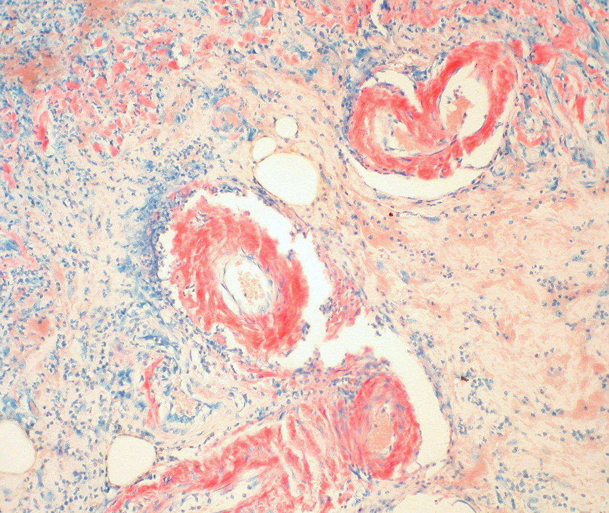
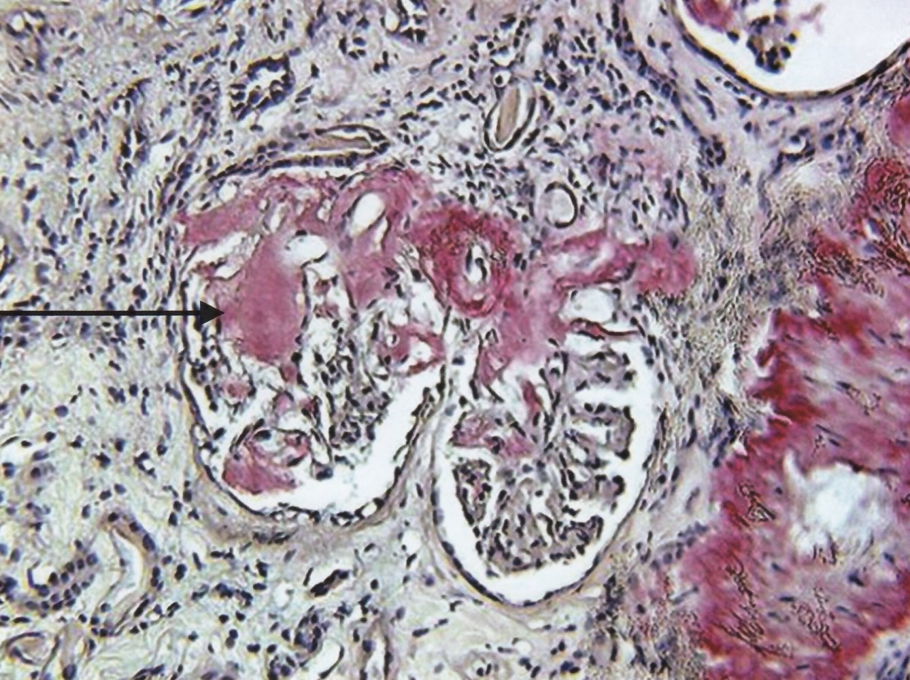
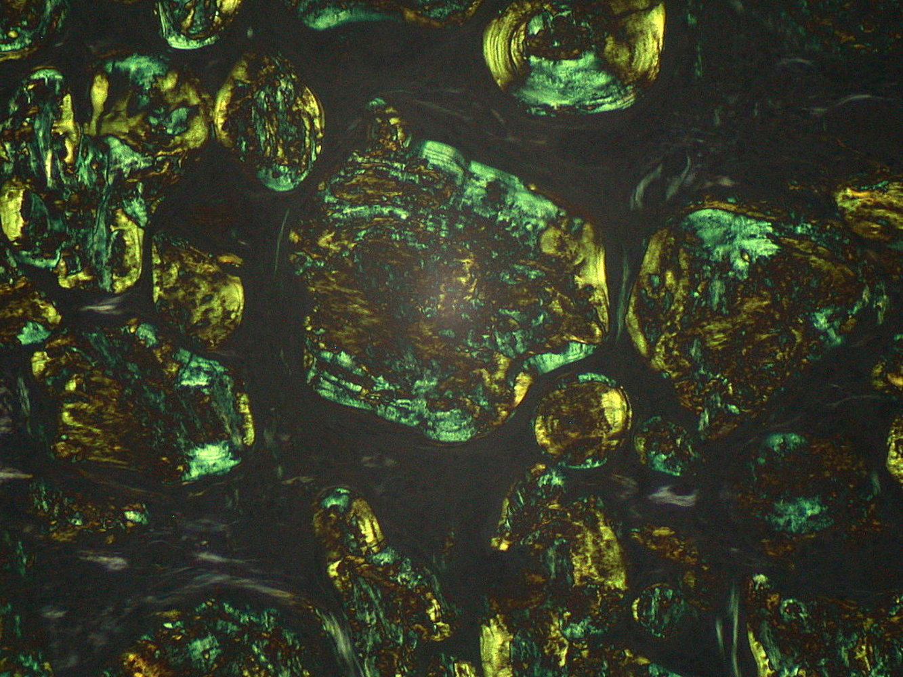
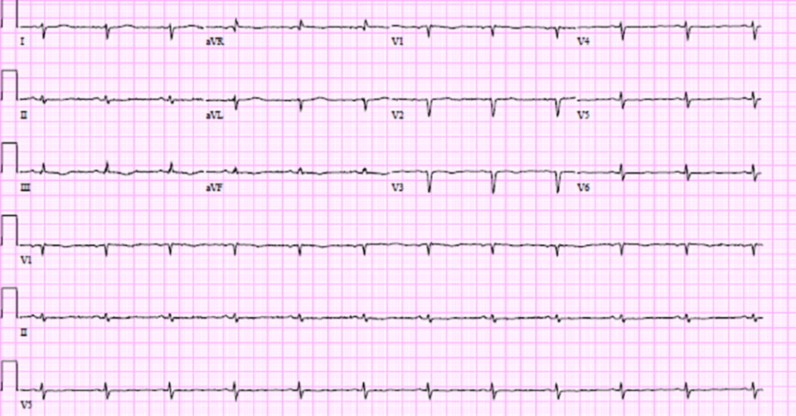

# Amyloidosis

*Categories: Clinical knowledge > Internal medicine > Rheumatology and immunology > Connective tissue diseases > Amyloidosis*

[Original Article Link](https://coursology-qbank.com/amboss/article/fP0kVT)

---

## Summary

Amyloidosis is a collective term for the extracellular deposition of abnormal <u>proteins</u>, in a single organ (<u>localized amyloidosis</u>) or throughout the body (<u>systemic amyloidosis</u>). The different subtypes of amyloidosis are classified according to the identity of the deposited <u>proteins</u>. The standardized naming convention dictates that the letter “A” for amyloidosis is followed by an identifier of the protein that forms the <u>amyloid</u> fibril deposits (e.g., AL for <u>immunoglobulin</u> light chain deposits). These abnormal <u>proteins</u> are produced as a result of various diseases. The most common form of <u>systemic amyloidosis</u> in developed nations is <u>light chain amyloidosis</u> (<u>AL amyloidosis</u>), which is associated with <u>plasma cell dyscrasias</u> such as <u>multiple myeloma</u>. The second most common systemic form, <u>reactive amyloidosis</u> (<u>AA amyloidosis</u>), is secondary to <u>chronic inflammation</u> and typically presents with <u>nephrotic syndrome</u>. Depending on which organs are affected, amyloidosis may also manifest with <u>hepatomegaly</u>, <u>macroglossia</u>, cardiac conduction abnormalities, and/or symptoms of <u>restrictive cardiomyopathy</u>. Abdominal fat or rectal <u>mucosa</u> <u>biopsies</u> are used to diagnose <u>systemic amyloidosis</u>. Target organ <u>biopsy</u> is more sensitive but less commonly required for definitive diagnosis because it presents a higher procedural risk. When stained with a <u>Congo red</u> dye, <u>amyloid</u> deposits in the <u>biopsy</u> sample exhibit an apple-green <u>birefringence</u> under polarized light. Management of amyloidosis is dependent on the specific type and is specialist-guided. In <u>AL amyloidosis</u>, <u>chemotherapy</u> with <u>melphalan</u> and <u>corticosteroids</u> may be used, and suitable patients may be referred for <u>autologous HSCT</u>. Treatment of the underlying disease is the mainstay of management for <u>AA amyloidosis</u>. <u>Organ transplantation</u> may also be an option for certain patients as directed by a specialist.

---

## Overview

### Definitions [[1]](https://coursology-qbank.com/amboss/article/l_1voj0)

* Amyloid: insoluble protein or protein fragments

* Amyloidosis: extracellular aggregation and subsequent deposition of <u>amyloid</u> in various organs

### Pathogenesis

* Accumulation of <u>amyloid</u> → <u>cellular injury</u> and <u>apoptosis</u> [[2]](https://coursology-qbank.com/amboss/article/Y1bn2s)

* Composition of <u>amyloid</u>:

* Fibrillar component (90–95% of <u>amyloid</u>): <u>β-sheet fibrils</u>

* Nonfibrillar component (5–10% of <u>amyloid</u>): usually the same in all types of <u>amyloid</u> (e.g., <u>amyloid</u> P component, <u>glycosaminoglycans</u>)

### Classification [[3]](https://coursology-qbank.com/amboss/article/kIYm1q)

* The standardized nomenclature convention for amyloidosis is “AX.”

* A denotes amyloidosis.

* X denotes the affected protein that comprises the fibrillar component.

* May also be classified as:

* <u>Systemic amyloidosis</u> or <u>localized amyloidosis</u>

* Acquired or hereditary amyloidosis

---

## Systemic amyloidosis

### Overview

The following list is not exhaustive; > 15 types of <u>systemic amyloidosis</u> have been identified, each caused by a different protein. [[1]](https://coursology-qbank.com/amboss/article/l_1voj0)

|  Overview of systemic amyloidosis [[1]](https://coursology-qbank.com/amboss/article/l_1voj0)[[4]](https://coursology-qbank.com/amboss/article/U91b5Q0)[[5]](https://coursology-qbank.com/amboss/article/qz1CFj0)  |  |  |  |
| --- | --- | --- | --- |
|  | Affected protein | Etiology | Characteristic features |
|  <u>AL amyloidosis</u> (<u>light-chain amyloidosis</u> or <u>primary amyloidosis</u>)  |  * <u>Light chains</u> of <u>immunoglobulins</u> become AL <u>amyloid</u> protein.   |  * <u>Plasma cell dyscrasias</u> (e.g., <u>multiple myeloma</u>)   |   * Median age of diagnosis is 64 years. [[6]](https://coursology-qbank.com/amboss/article/4XX3y9)  * Typically affects the:  * <u>Heart</u>  * <u>Kidney</u>  * <u>Tongue</u>  * Peripheral and <u>autonomic nervous system</u>  * <u>Gastrointestinal tract</u>  * Rapidly progressive clinical course    |
|  <u>AA amyloidosis</u>(<u>reactive amyloidosis</u> or <u>secondary amyloidosis</u>)  |  * Serum <u>amyloid</u>-associated protein (<u>SAA</u>) becomes AA <u>amyloid</u> protein.   |   * Chronic inflammatory conditions (e.g., <u>IBD</u>, <u>rheumatoid arthritis</u>, <u>familial Mediterranean fever</u>, <u>SLE</u>)  * Chronic infectious diseases (e.g., <u>tuberculosis</u>, <u>osteomyelitis</u>)  * <u>Renal cell carcinoma</u>, <u>lymphomas</u>    |   * May occur at any age  * Most common form of amyloidosis in children [[7]](https://coursology-qbank.com/amboss/article/yA1dmj0)  * Typically affects the:  * <u>Kidney</u>  * <u>Liver</u> and <u>spleen</u>  * <u>Gastrointestinal tract</u>  * <u>Adrenal glands</u>  * <u>Autonomic nervous system</u>  * Disease progression can be slowed by managing the underlying condition.    |
|  Aβ2M amyloidosis (<u>β2-microglobulin</u> amyloidosis or hemodialysis-associated amyloidosis) |  * <u>β2-microglobulin</u> becomes Aβ2M <u>amyloid</u> protein.   |   * Long-term <u>hemodialysis</u>  * <u>End-stage renal disease</u>    |   * Typically develops ∼ 10 years after starting <u>hemodialysis</u>  * Typically affects <u>joints</u> and <u>tendons</u>, manifesting with e.g.,:  * Scapulohumeral periarthritis  * <u>Carpal tunnel syndrome</u>  * Bone cysts    |
|  ATTRmt amyloidosis (mutated <u>transthyretin</u> amyloidosis, ATTRv (variant) amyloidosis, or hereditary <u>transthyretin</u> amyloidosis) [[8]](https://coursology-qbank.com/amboss/article/az1Qrj0)  |  * <u>Transthyretin</u> is mutated <u>transthyretin</u> (ATTR).   |  * <u>Autosomal dominant</u> disease   |   * <u>Familial amyloid cardiomyopathy</u>  * Typical age of onset: > 60 years  * Affects endomyocardium  * <u>Familial amyloid polyneuropathy</u>  * Typical age of onset: > 20 years  * Affects peripheral and autonomic nerves    |
|  ATTRwt amyloidosis (wild-type <u>transthyretin</u> amyloidosis or <u>senile cardiac amyloidosis</u>) |  * Normal (wild-type) <u>transthyretin</u> (ATTRwt) → deposition in cardiac ventricles → cardiac dysfunction (less drastic than in <u>AL amyloidosis</u>) [[9]](https://coursology-qbank.com/amboss/article/FLbgz8)   |  * Old age   |   * Median age of diagnosis is 75 years. [[1]](https://coursology-qbank.com/amboss/article/l_1voj0)  * More commonly reported in men (∼ 90% of patients)  [[1]](https://coursology-qbank.com/amboss/article/l_1voj0)  * Typically affects the:  * <u>Heart</u>  * <u>Ligaments</u> and <u>tendons</u>  * <u>Peripheral nerves</u>    |

### Approach to management [[1]](https://coursology-qbank.com/amboss/article/l_1voj0)[[4]](https://coursology-qbank.com/amboss/article/U91b5Q0)

Suspect <u>systemic amyloidosis</u> in patients with <u>constitutional symptoms</u> and multiple affected organs.

* Obtain tissue <u>biopsy</u> to confirm <u>amyloid</u> deposition and to identify the fibril type.

* Obtain baseline <u>laboratory studies</u>.

* Consider cardiac and imaging studies based on clinical suspicion of organ involvement.

* Obtain additional studies to identify the underlying cause.

* The goal of management is to suppress the <u>amyloid precursor protein</u> by treating the underlying disease.

* Treatment may include:

* Pharmacotherapy

* <u>Organ transplantation</u>

* <u>Supportive care</u> of complications, e.g.:

* <u>Heart failure management</u>

* <u>CKD management</u>

> [!TIP]
> Management should be focused on treating the underlying disease, as this may stall disease progression. [[1]](https://coursology-qbank.com/amboss/article/l_1voj0)

### Diagnostics of amyloidosis [[1]](https://coursology-qbank.com/amboss/article/l_1voj0)[[4]](https://coursology-qbank.com/amboss/article/U91b5Q0)

#### Tissue <u>biopsy</u>

The type of tissue sample depends on the extent of disease and organ involvement. [[10]](https://coursology-qbank.com/amboss/article/_TY5to)

* Tissue sample

* Target organ (e.g., of a <u>kidney</u> or a nerve): preferred in patients with single organ involvement

* Abdominal fat <u>aspiration</u> or rectal <u>mucosa</u>: preferred in patients with multiorgan and/or tissue involvement  [[3]](https://coursology-qbank.com/amboss/article/kIYm1q)

* Methods

* <u>Congo red</u> stain to confirm <u>amyloid</u> deposition

* Pink to red appearance under nonpolarized light

* Apple-green <u>birefringence</u> under polarized light

* Additional findings from an affected <u>kidney</u> may include deposits in <u>glomerular</u> mesangial areas (visible on H&E stain) and enlarged <u>tubular basement membranes</u> that can be identified via <u>light microscopy</u>. See “<u>Amyloid nephropathy</u>.”

* <u>Immunohistochemistry</u> or mass spectrometric analysis: for fibril typing and classification

> [!TIP]
> After staining demonstrates <u>amyloid</u> deposition, diagnosis is confirmed by identifying the specific protein fibril in the <u>amyloid</u> deposits of the biopsied tissue sample.

Amyloidosis within vessel walls

Renal amyloidosis

Amyloidosis within lymphatic tissue

#### Additional studies [[1]](https://coursology-qbank.com/amboss/article/l_1voj0)[[4]](https://coursology-qbank.com/amboss/article/U91b5Q0)

Additional studies should be obtained for risk <u>stratification</u> and to guide management decisions. Results will vary depending on the type and degree of end-organ involvement.

* <u>Laboratory studies</u>

* <u>BMP</u>

* <u>CBC</u>

* <u>Liver chemistries</u>

* <u>Coagulation studies</u>

* <u>Cardiac biomarkers</u>: e.g., <u>troponins</u>, <u>BNP</u>

* <u>Urinalysis</u>

* Cardiac studies: Consider in all patients to assess for cardiac involvement.

* <u>ECG</u>: may show low or inappropriately normal voltages

* <u>Echocardiogram</u>: may show diffuse atrial, ventricular, and septal thickening caused by <u>amyloid</u> depositions

* <u>Cardiac MRI</u>: can characterize disease severity in patients with known cardiac amyloidosis

* Radionucleotide <u>scintigraphy</u>: used to locate <u>amyloid</u> fibrils and monitor disease progression and/or response to therapy

* Additional imaging studies: Consider in select patients to assess other organ involvement.

* CT chest: to assess for <u>lung</u> involvement

* CT abdomen: to assess for <u>spleen</u> or <u>liver</u> involvement, or <u>lymphadenopathy</u>

* <u>MRI</u> <u>brain</u>: to assess for <u>leptomeningeal</u> involvement

* Assessment of the underlying etiology: The approach depends on the specific type of amyloidosis.

Low-voltage QRS complexes

Restrictive cardiomyopathy

---

## AL amyloidosis (primary amyloidosis)

### <u>Epidemiology</u> [[3]](https://coursology-qbank.com/amboss/article/kIYm1q)

Most common form of amyloidosis

### Etiology [[3]](https://coursology-qbank.com/amboss/article/kIYm1q)[[11]](https://coursology-qbank.com/amboss/article/7z148j0)

Low-level expansion of a <u>plasma cell dyscrasia</u> (e.g., <u>multiple myeloma</u>, <u>Waldenstrom macroglobulinemia</u>)

### Pathophysiology [[3]](https://coursology-qbank.com/amboss/article/kIYm1q)

Increased production of the <u>light chains</u> of <u>immunoglobulins</u> → deposition of <u>amyloid</u> <u>light chain</u> protein (AL protein) in various organs

### Clinical features [[3]](https://coursology-qbank.com/amboss/article/kIYm1q)[[5]](https://coursology-qbank.com/amboss/article/qz1CFj0)[[12]](https://coursology-qbank.com/amboss/article/rz1f8j0)

<u>AL amyloidosis</u> is a rare, but potentially severe disease that can affect any organ (with the exception of the <u>CNS</u>). [[12]](https://coursology-qbank.com/amboss/article/rz1f8j0)

* <u>Skin</u>: cutaneous <u>ecchymoses</u> around the eyes (<u>raccoon eyes</u>), combined with yellow waxy <u>papules</u>

* <u>Heart</u>: <u>restrictive cardiomyopathy</u>, <u>HFpEF</u>, <u>atrioventricular block</u>

* <u>Kidney</u>: <u>nephrotic syndrome</u>, <u>type II renal tubular acidosis</u>, <u>nephrogenic diabetes insipidus</u>

* <u>Tongue</u>: <u>macroglossia</u> → <u>obstructive sleep apnea</u>

* <u>Autonomic nervous system</u>: <u>autonomic neuropathy</u>

* <u>Gastrointestinal tract</u>: <u>malabsorption</u>, <u>hepatomegaly</u>

* <u>Hematopoietic</u> system: <u>bleeding disorders</u>, <u>splenomegaly</u> [[13]](https://coursology-qbank.com/amboss/article/VtaGcm)

* <u>Musculoskeletal system</u>

* <u>Carpal tunnel syndrome</u> (may be bilateral)

* <u>Shoulder pad sign</u>

> [!TIP]
> The combination of <u>raccoon eyes</u>, <u>macroglossia</u>, and the <u>shoulder pad sign</u> is highly specific for <u>AL amyloidosis</u> (but only present in ∼ 10 % of patients). [[5]](https://coursology-qbank.com/amboss/article/qz1CFj0)

Macroglossia in light-chain amyloidosis

### Diagnostics [[1]](https://coursology-qbank.com/amboss/article/l_1voj0)[[4]](https://coursology-qbank.com/amboss/article/U91b5Q0)[[11]](https://coursology-qbank.com/amboss/article/7z148j0)

Consult a specialist early (e.g., rheumatologist, hematologist).

* Obtain <u>diagnostics of amyloidosis</u>, including:

* Tissue <u>biopsy</u>

* Assessment of organ involvement, including <u>ECG</u>, <u>cardiac imaging</u>

* Obtain diagnostics for <u>plasma cell dyscrasias</u> to identify the underlying cause:

* <u>Serum protein immunofixation</u> (test of choice ): monoclonal <u>light chain</u> or whole <u>immunoglobulin</u> protein  [[3]](https://coursology-qbank.com/amboss/article/kIYm1q)[[4]](https://coursology-qbank.com/amboss/article/U91b5Q0)[[4]](https://coursology-qbank.com/amboss/article/U91b5Q0)

* <u>Serum electrophoresis</u>: monoclonal gammopathy

* <u>Urine protein electrophoresis</u> (<u>UPEP</u>) with <u>immunofixation</u>: <u>Bence-Jones proteins</u>

* <u>Bone marrow aspirate</u> and <u>biopsy</u>: The presence of monoclonal <u>plasma cells</u> (comprise approx. 10% of <u>aspirate</u> sample) supports the diagnosis. [[4]](https://coursology-qbank.com/amboss/article/U91b5Q0)

* Apply <u>diagnostic criteria for plasma cell dyscrasias</u> (e.g., <u>diagnostic criteria for multiple myeloma</u>).

> [!TIP]
> Suspect <u>AL amyloidosis</u> in patients with multiple affected organs (e.g., <u>heart failure with preserved ejection fraction</u>, <u>nephrotic range proteinuria</u>, <u>peripheral neuropathy</u>, <u>hepatomegaly</u>, and/or noninfectious <u>diarrhea</u>), and/or atypical <u>MGUS</u> or <u>smoldering multiple myeloma</u>.

### Management [[1]](https://coursology-qbank.com/amboss/article/l_1voj0)[[4]](https://coursology-qbank.com/amboss/article/U91b5Q0)

Treatment options are based on the stage of the underlying disease (e.g., <u>multiple myeloma staging</u>), and level of <u>end-organ damage</u> (e.g., <u>NYHA class</u> for <u>heart failure</u>), and include:

* Control of the underlying <u>plasma cell dyscrasia</u> with:

* <u>Chemotherapy</u>: e.g., <u>melphalan</u> plus <u>corticosteroids</u>, <u>thalidomide</u>, <u>bortezomib</u>

* <u>Autologous HSCT</u> in eligible patients

* <u>Supportive care</u> for associated complications (e.g., <u>heart failure</u>, <u>CKD</u>)

> [!TIP]
> The main goal of treatment is to inhibit <u>plasma cells</u> from producing <u>light chains</u>, which in turn reduces <u>amyloid</u> deposition and helps to facilitate organ recovery.

### Prognosis [[3]](https://coursology-qbank.com/amboss/article/kIYm1q)[[11]](https://coursology-qbank.com/amboss/article/7z148j0)

* Rapidly progressive clinical course if left untreated

* Survival depends largely on the severity of cardiac and/or renal dysfunction at diagnosis.

* The median survival time without treatment is 1–2 years.

---

## AA amyloidosis (secondary amyloidosis)

### Etiology [[3]](https://coursology-qbank.com/amboss/article/kIYm1q)

<u>AA amyloidosis</u> is secondary to a chronic disease, such as:

* Chronic inflammatory conditions (e.g., <u>IBD</u>, <u>rheumatoid arthritis</u>, <u>SLE</u>, <u>vasculitis</u>, <u>familial Mediterranean fever</u>)

* Chronic infectious diseases (e.g., <u>tuberculosis</u>, <u>bronchiectasis</u>, <u>leprosy</u>, <u>osteomyelitis</u>)

* <u>Malignancy</u> (e.g., <u>renal cell carcinoma</u>, <u>lymphomas</u>)

### Pathophysiology [[3]](https://coursology-qbank.com/amboss/article/kIYm1q)

Chronic inflammatory process → ↑ production of <u>acute phase reactant</u> <u>SAA</u> (serum <u>amyloid</u>-associated protein) → deposition of AA (<u>amyloid</u>-associated) protein in various organs

### Clinical features [[1]](https://coursology-qbank.com/amboss/article/l_1voj0)[[4]](https://coursology-qbank.com/amboss/article/U91b5Q0)[[5]](https://coursology-qbank.com/amboss/article/qz1CFj0)

* <u>Kidney</u>: <u>nephrotic syndrome</u>, <u>type II renal tubular acidosis</u>, <u>nephrogenic diabetes insipidus</u>

* <u>Adrenal glands</u>: <u>primary adrenal insufficiency</u>

* <u>Liver</u> and <u>spleen</u>: <u>hepatomegaly</u>, <u>splenomegaly</u>

* <u>Gastrointestinal tract</u>: <u>malabsorption</u>

* <u>Heart</u> (rare): severe thickening of ventricular wall

> [!TIP]
> The main feature of <u>AA amyloidosis</u> at diagnosis is renal dysfunction (e.g., <u>CKD</u>, <u>nephrotic syndrome</u>). Cardiac involvement is rare. [[3]](https://coursology-qbank.com/amboss/article/kIYm1q)[[5]](https://coursology-qbank.com/amboss/article/qz1CFj0)

### Diagnostics [[4]](https://coursology-qbank.com/amboss/article/U91b5Q0)[[5]](https://coursology-qbank.com/amboss/article/qz1CFj0)[[14]](https://coursology-qbank.com/amboss/article/9TYNGo)

Consult a specialist early (e.g., rheumatologist).

* Obtain <u>diagnostics of amyloidosis</u> including:

* <u>Kidney</u> tissue <u>biopsy</u>; findings include: [[15]](https://coursology-qbank.com/amboss/article/kgWmvk0)

* <u>Global</u> and segmental <u>amyloid</u> deposition

* Diffuse and/or focal <u>glomerular</u> involvement

* Enlargement of <u>glomeruli</u>

* Tubular <u>atrophy</u>

* <u>Interstitial</u> <u>fibrosis</u>

* Assessment of organ involvement, including <u>BMP</u>, <u>estimated GFR</u>, <u>urinalysis</u>

* For suspected cardiac involvement: multiparametric <u>CMR</u> (including <u>late-gadolinium-enhancement</u> imaging and novel mapping-based approaches) [[16]](https://coursology-qbank.com/amboss/article/PgWWvk0)

* Identify the underlying inflammatory disorder (if not yet known); consider:

* Chest <u>x-ray</u>

* <u>Inflammatory markers</u>: <u>ESR</u>, <u>CRP</u>

* <u>Genetic testing</u> for <u>familial Mediterranean fever</u> (<u>FMF</u>)  [[4]](https://coursology-qbank.com/amboss/article/U91b5Q0)

> [!TIP]
> Amyloidosis should always be considered in patients who present with <u>kidney</u>, <u>liver</u>, or GI involvement in the setting of chronic inflammatory and/or infectious disease.

### Management [[1]](https://coursology-qbank.com/amboss/article/l_1voj0)[[4]](https://coursology-qbank.com/amboss/article/U91b5Q0)[[14]](https://coursology-qbank.com/amboss/article/9TYNGo)

* Treat the underlying condition to reduce AA production (mainstay of treatment), e.g.:

* <u>Colchicine</u> for <u>FMF</u>  [[1]](https://coursology-qbank.com/amboss/article/l_1voj0)

* Antimicrobials for chronic infections (e.g., <u>TB</u>, <u>bronchiectasis</u>)

* <u>DMARDs</u> for rheumatological diseases (e.g., <u>rheumatoid arthritis</u>)

* Consider therapy with <u>IL-1</u> or <u>IL-6</u> inhibitors (e.g., <u>anakinra</u> or <u>tocilizumab</u>).  [[5]](https://coursology-qbank.com/amboss/article/qz1CFj0)

* Provide <u>supportive care</u> for associated complications (e.g., <u>CKD</u>).

### Prognosis [[1]](https://coursology-qbank.com/amboss/article/l_1voj0)[[12]](https://coursology-qbank.com/amboss/article/rz1f8j0)

* Median survival after diagnosis: approx. 11 years [[1]](https://coursology-qbank.com/amboss/article/l_1voj0)

* Survival depends largely on the severity of <u>end-organ damage</u> at diagnosis.

* Approx. 40% of patients will require <u>renal replacement therapy</u>. [[12]](https://coursology-qbank.com/amboss/article/rz1f8j0)

---

## ATTRmt amyloidosis

### Overview [[17]](https://coursology-qbank.com/amboss/article/bz1Hrj0)

* Mutated <u>transthyretin</u> amyloidosis (ATTRmt) is the most common type of hereditary amyloidosis. [[1]](https://coursology-qbank.com/amboss/article/l_1voj0)

* Clinical <u>phenotype</u> (e.g., <u>cardiomyopathy</u>, <u>polyneuropathy</u>, or mixed) is determined by the type of mutation.  [[1]](https://coursology-qbank.com/amboss/article/l_1voj0)

| Overview of ATTRmt amyloidosis |  |  |
| --- | --- | --- |
| Clinical <u>phenotype</u> |  Familial amyloid cardiomyopathy (FAC) |  Familial amyloid polyneuropathy (<u>FAP</u>) |
| Etiology |  * <u>Autosomal dominant</u> disease (most common) that is due to mutated <u>transthyretin</u> (ATTR) [[18]](https://coursology-qbank.com/amboss/article/6RYjLK)   |  |
| <u>Epidemiology</u> |  * Common in African Americans (3% of African Americans carry the <u>mutant allele</u> for FAC) [[19]](https://coursology-qbank.com/amboss/article/b1bH2s)   |  * Common in Portugal, Sweden, Japan, and among people of Irish descent   |
| Affected sites |   * Deposition in ventricular endomyocardium → <u>restrictive cardiomyopathy</u>  * Atrial deposition → <u>arrhythmia</u> [[20]](https://coursology-qbank.com/amboss/article/X1b92s)    |  * Peripheral and autonomic nerves   |

### Management [[4]](https://coursology-qbank.com/amboss/article/U91b5Q0)[[5]](https://coursology-qbank.com/amboss/article/qz1CFj0)

* Obtain <u>diagnostics of amyloidosis</u>, including tissue <u>biopsy</u>.

* Consider <u>genetic testing</u> to confirm the presence of a mutation.

* Consider pharmacotherapy with <u>TTR</u> stabilizers (e.g., tafamidis ). [[3]](https://coursology-qbank.com/amboss/article/kIYm1q)[[21]](https://coursology-qbank.com/amboss/article/Xz19rj0)

* <u>Liver transplantation</u> should be considered to decrease the source of <u>amyloid</u> protein . [[3]](https://coursology-qbank.com/amboss/article/kIYm1q)[[5]](https://coursology-qbank.com/amboss/article/qz1CFj0)

---

## Localized amyloidosis

* In <u>localized amyloidosis</u> (e.g., endocrine amyloidosis), a single organ is affected.

* A definitive diagnosis can only be made on <u>histopathology</u>.

* Management is specialist-guided and organ-specific.

|  Examples of localized amyloidosis  [[22]](https://coursology-qbank.com/amboss/article/pz1LFj0)[[23]](https://coursology-qbank.com/amboss/article/Jz1sFj0)  |  |  |  |  |  |  |
| --- | --- | --- | --- | --- | --- | --- |
| Type |  |  |  |  | Example diseases | Affected protein |
| Nonneurologic diseases |  |  |  |  | Isolated atrial amyloidosis (↑ risk of <u>atrial fibrillation</u>) | <u>ANP</u> (physiological in old age) |
| <u>Type 2 diabetes mellitus</u> | <u>Islet amyloid polypeptide</u> (<u>IAPP</u>) deposits in <u>pancreatic islet</u> |  |  |  |  |  |
| Injection-<u>localized amyloidosis</u> (from <u>insulin</u> injection in <u>diabetes mellitus</u>) |  <u>Amyloid</u> at <u>insulin</u> injection site (AIns) |  |  |  |  |  |
| Medullary <u>carcinoma</u> of the <u>thyroid</u> |  <u>Calcitonin</u> <u>amyloid</u> (ACal)   |  |  |  |  |  |
|  <u>Neurodegenerative diseases</u> (cerebral amyloidosis) |  |  |  |  | <u>Alzheimer disease</u> | <u>Aβ</u> (cleaved from the <u>APP</u>) |
| <u>Prion diseases</u> | APrP (<u>prion</u> protein <u>amyloid</u>) |  |  |  |  |  |

---