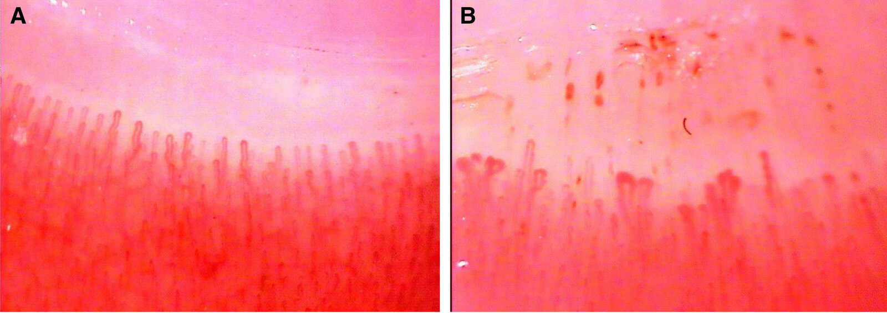

# Mixed connective tissue disease

*Categories: Clinical knowledge > Internal medicine > Rheumatology and immunology > Connective tissue diseases > Mixed connective tissue disease*

[Original Article Link](https://coursology-qbank.com/amboss/article/1v02_3)

---

## Summary

Mixed <u>connective tissue disease</u> (MCTD) is a rare systemic autoimmune condition characterized by concurrent features of at least two <u>autoimmune connective tissue diseases</u>, e.g., <u>systemic lupus erythematosus</u> (<u>SLE</u>), <u>systemic sclerosis</u> (<u>SSc</u>), <u>idiopathic inflammatory myopathies</u>. The clinical presentation is highly variable and may include <u>Raynaud phenomenon</u>, <u>acrosclerosis</u>, <u>myositis</u>, and <u>esophageal dysmotility</u> in the later stages. <u>Interstitial lung disease</u> (<u>ILD</u>) and <u>pulmonary hypertension</u> are common manifestations and major causes of mortality. Diagnosis is based on suggestive clinical features and the presence of <u>anti-U1 RNP antibodies</u>. Management involves <u>immunosuppressive agents</u> (e.g., <u>glucocorticoids</u>, <u>cyclophosphamide</u>), especially in patients with severe organ involvement.

Mixed connective tissue disease (Sharp syndrome) factsheet

---

## Clinical features

Mixed <u>connective tissue disease</u> is characterized by concurrent features of at least two <u>autoimmune connective tissue diseases</u> (e.g., <u>SLE</u>, <u>SSc</u>, <u>idiopathic inflammatory myopathies</u>).  [[2]](https://coursology-qbank.com/amboss/article/6qdjzI0)[[6]](https://coursology-qbank.com/amboss/article/KqdUzI0)[[7]](https://coursology-qbank.com/amboss/article/IqdY-I0)

* Initial presentation is often nonspecific, e.g., fatigue, low-grade <u>fever</u>, <u>lymphadenopathy</u>.

* Features of later stages include: [[2]](https://coursology-qbank.com/amboss/article/6qdjzI0)[[6]](https://coursology-qbank.com/amboss/article/KqdUzI0)[[7]](https://coursology-qbank.com/amboss/article/IqdY-I0)

* <u>Raynaud phenomenon</u> (∼ 90% of patients) [[2]](https://coursology-qbank.com/amboss/article/6qdjzI0)

* <u>Acrosclerosis</u> (including <u>sclerodactyly</u>), digital <u>ulcers</u>

* Puffy fingers

* <u>Synovitis</u>, <u>myositis</u>

* <u>Polyarthralgia</u>, <u>polyarthritis</u>

* <u>Xerostomia</u> and/or <u>xerophthalmia</u>

* Features of <u>esophageal dysmotility</u> (e.g., <u>GERD</u>, <u>dysphagia</u>)

* <u>Clinical features of ILD</u> and/or <u>pulmonary hypertension</u> (e.g., <u>dyspnea</u>, <u>cough</u>, inspiratory <u>crackles</u>)

* <u>Pericarditis</u>, <u>malar rash</u> or <u>discoid rash</u>, <u>peripheral neuropathy</u> (uncommon)

> [!TIP]
> In approximately 25% of patients, MCTD progresses into a specific <u>CTD</u>. [[2]](https://coursology-qbank.com/amboss/article/6qdjzI0)

Mixed connective tissue disease (Sharp syndrome) factsheet

---

## Diagnosis

### General principles [[2]](https://coursology-qbank.com/amboss/article/6qdjzI0)[[6]](https://coursology-qbank.com/amboss/article/KqdUzI0)

* Refer all patients with suspected MCTD to a rheumatologist and other specialists as needed (e.g., pulmonologist if <u>ILD</u> or <u>pulmonary hypertension</u> is suspected).

* Diagnosis is based on suggestive clinical features and the presence of <u>anti-U1 RNP antibodies</u>.

* <u>Laboratory studies</u> and cardiopulmonary evaluation are performed to assess organ involvement.

* Some specialists use diagnostic criteria (e.g., Sharp criteria, Kasukawa criteria) to facilitate the diagnosis.

> [!TIP]
> The diagnosis of MCTD is challenging because of the highly variable clinical presentation and overlap with other autoimmune <u>CTDs</u>.

### <u>Laboratory studies</u> [[2]](https://coursology-qbank.com/amboss/article/6qdjzI0)[[6]](https://coursology-qbank.com/amboss/article/KqdUzI0)

#### <u>Serology</u>

* <u>Antinuclear antibodies</u> (<u>ANAs</u>)

* Positive <u>titers</u> (typically > 1:1000)

* <u>ANA</u> patterns: can help determine the type of autoimmune disease

* A speckled pattern on <u>immunofluorescence</u> is typical in MCTD.

* Other <u>ANA</u> patterns can indicate overlap with established autoimmune <u>CTDs</u>.  [[8]](https://coursology-qbank.com/amboss/article/GIdBVr0)[[9]](https://coursology-qbank.com/amboss/article/tIdXer0)

* <u>Antigen-specific ANAs</u>

* <u>Anti-U1 RNP</u>: present in all patients with MCTD

* Others (e.g., <u>anti-Ro/SSA antibodies</u>, <u>anti-Sm antibodies</u>) may be present.

* Other possible <u>antibodies</u>: <u>rheumatoid factor</u> or <u>ANCA</u>

#### Routine studies [[2]](https://coursology-qbank.com/amboss/article/6qdjzI0)[[6]](https://coursology-qbank.com/amboss/article/KqdUzI0)

* <u>CBC</u>: may show <u>leukopenia</u>, <u>anemia</u>, and/or <u>thrombocytopenia</u>

* <u>Inflammatory markers</u>: <u>CRP</u> and <u>ESR</u> may be elevated.

* <u>Renal function testing</u>

* Serum <u>creatinine</u>: may be elevated

* <u>Urinalysis</u> with sediment: may show <u>proteinuria</u>, and/or nephritic or <u>nephrotic sediment</u>

* <u>CMP</u>: ↑ <u>creatine kinase</u> during acute flares of <u>myositis</u>

> [!TIP]
> The absence of severe <u>kidney</u> involvement helps distinguish MCTD from <u>SLE</u> and <u>SSc</u>.

### Additional studies [[2]](https://coursology-qbank.com/amboss/article/6qdjzI0)[[6]](https://coursology-qbank.com/amboss/article/KqdUzI0)

* Cardiopulmonary evaluation: MCTD is a <u>risk factor for PH</u> and <u>ILD</u>. The following should be obtained for all patients upon diagnosis.

* Screening for <u>ILD</u> (e.g., <u>PFTs</u> and/or <u>HRCT</u>)

* Screening for <u>pulmonary hypertension</u> (i.e., <u>echocardiography</u>)

* Further studies may be performed by a specialist (e.g., <u>nailfold capillary microscopy</u> to evaluate for <u>microvascular</u> abnormalities)

Nailfold capillaroscopy

---

## Prognosis

* The disease course is usually less severe compared to other <u>CTDs</u>. [[2]](https://coursology-qbank.com/amboss/article/6qdjzI0)[[6]](https://coursology-qbank.com/amboss/article/KqdUzI0)[[10]](https://coursology-qbank.com/amboss/article/KJdUEI0)

* Progression

* Remission occurs in approx. 45% of patients.

* In approx. 25% of patients, MCTD progresses into another <u>CTD</u>. [[2]](https://coursology-qbank.com/amboss/article/6qdjzI0)

* Poor prognostic factors include:

* <u>ILD</u> and/or <u>pulmonary hypertension</u>

* Male sex

* Older age at presentation

* Presence of <u>anti-Scl-70</u> or <u>anti-RNA polymerase III antibodies</u>

> [!TIP]
> <u>Pulmonary hypertension</u> and <u>ILD</u> are the main causes of mortality in patients with MCTD.

---