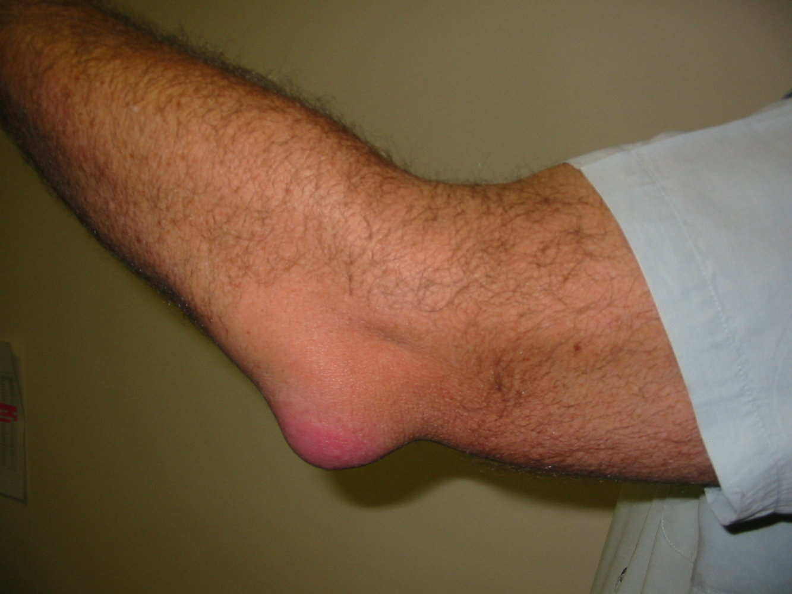
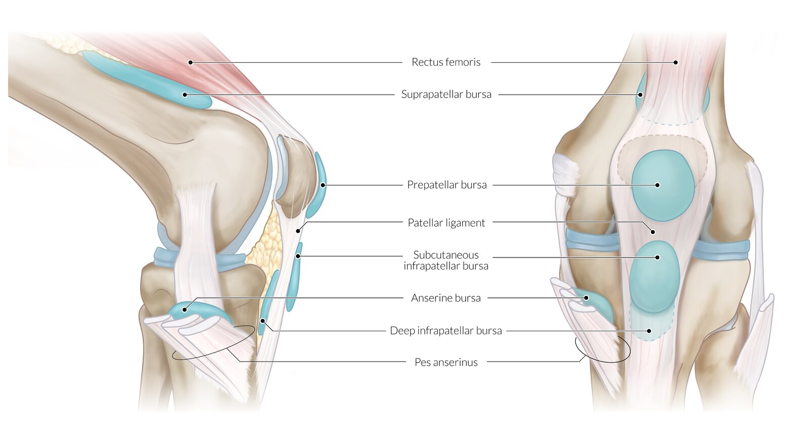
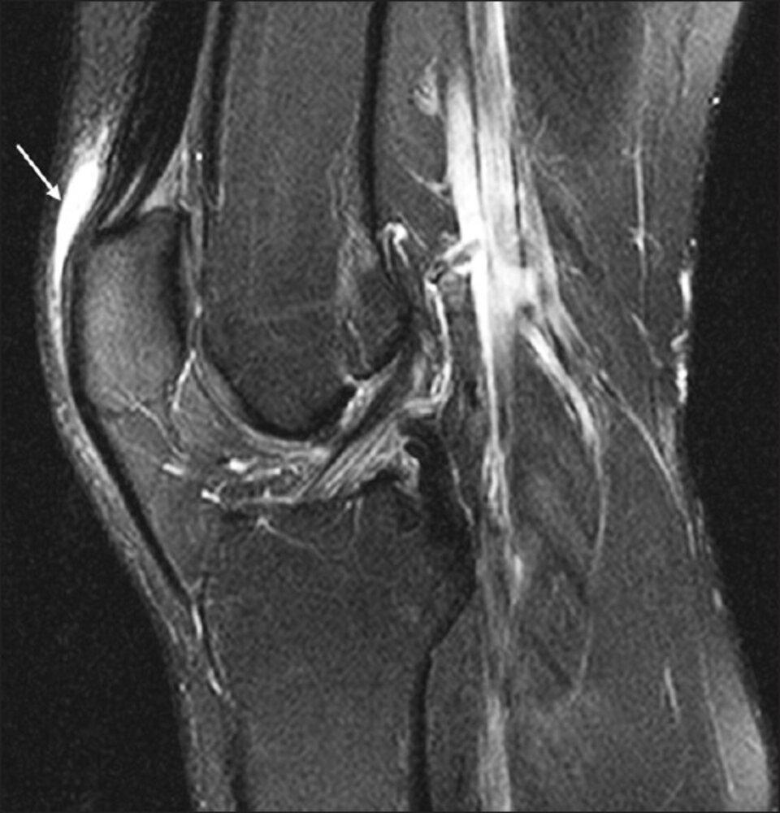

# Bursitis

*Categories: Clinical knowledge > Internal medicine > Rheumatology and immunology > Joint diseases > Bursitis*

[Original Article Link](https://coursology-qbank.com/amboss/article/eF0xS3)

---

## Summary

Bursitis is the inflammation of a <u>bursa</u> and is typically triggered by acute trauma, overuse, or an underlying inflammatory <u>joint</u> disease, such as <u>rheumatoid arthritis</u> or <u>gout</u>. Bursitis most commonly affects the <u>olecranon</u>, prepatellar, subacromial, or <u>anserine bursae</u>. Depending on which <u>bursa</u> is involved, the clinical presentation may include localized swelling, <u>fluctuance</u>, and/or <u>pain</u> with passive <u>range of motion</u> of the adjacent <u>joint</u>. Bursitis that is complicated by infection is referred to as <u>septic bursitis</u> and should be ruled out in patients with significant tenderness, <u>erythema</u>, and/or warmth of the inflamed <u>bursa</u>. Although bursitis is primarily a <u>clinical diagnosis</u>, imaging modalities such as <u>x-ray</u>, <u>ultrasound</u>, and <u>MRI</u> may be used to evaluate for alternative diagnoses or underlying <u>joint</u> disease. In patients with <u>signs of acute inflammation</u>, bursal <u>aspiration</u> with fluid analysis is indicated to rule out <u>septic bursitis</u> and <u>gout</u>. <u>Conservative management</u> (including rest, compression, and <u>NSAIDs</u>) is the mainstay of treatment for patients with nonseptic bursitis; intrabursal <u>glucocorticoid</u> injections may be used in refractory cases. <u>Septic bursitis</u> requires systemic <u>antibiotic therapy</u> and bursal drainage; surgical intervention is considered for patients with severe, recurrent, or refractory <u>purulent</u> effusions.

<u>Pes anserine bursitis</u> and <u>trochanteric bursitis</u> can occasionally contribute to <u>pain</u> syndromes that are primarily caused by tendinopathies; see “<u>Pes anserinus pain syndrome</u>” and “<u>Greater trochanteric pain syndrome</u>.”

---

## Definitions

* Nonseptic bursitis: inflammation of a <u>bursa</u> without infection

* Septic bursitis: inflammation of a <u>bursa</u> due to infection

---

## Etiology

* Nonseptic bursitis [[2]](https://coursology-qbank.com/amboss/article/AN1Rdh0)[[3]](https://coursology-qbank.com/amboss/article/zr1rPR0)

* Local trauma (e.g., fall on the <u>joint</u>)

* Overuse injury: prolonged and/or repetitive pressure and friction lead to microtrauma of bursal tissue (e.g., due to excessive kneeling, leaning on the <u>elbows</u>)

* Inflammatory <u>joint</u> disease (e.g., <u>rheumatoid arthritis</u>, <u>gout</u>)

* <u>Septic bursitis</u> [[2]](https://coursology-qbank.com/amboss/article/AN1Rdh0)[[3]](https://coursology-qbank.com/amboss/article/zr1rPR0)[[4]](https://coursology-qbank.com/amboss/article/gy1Fej0)

* Causative organisms: <u>S. aureus</u> (most common), <u>Streptococcus</u> spp

* Infection of <u>superficial</u> <u>bursae</u> often due to trauma of the <u>skin</u>; infection of deep <u>bursae</u> often due to <u>iatrogenic</u> trauma (e.g., injection or <u>aspiration</u>)

* <u>Risk factors</u>: <u>immunocompromise</u> (e.g., <u>diabetes</u>, chronic <u>alcohol</u> use), chronic <u>skin</u> or <u>joint</u> inflammation (e.g., <u>atopic dermatitis</u>, <u>rheumatoid arthritis</u>), prior nonseptic bursitis

---

## Clinical features

### By onset [[5]](https://coursology-qbank.com/amboss/article/My1Mfj0)

* Acute bursitis 

* Significant <u>pain</u> and tenderness

* Moderately decreased active <u>range of motion</u> (especially in acute <u>septic bursitis</u>)

* Chronic bursitis 

* Bursal thickening and swelling

* Minimal to no <u>pain</u>

* Minimal to no decreased <u>range of motion</u>

### By localization

* Olecranon bursitis: inflammation of the <u>olecranon bursa</u> typically caused by acute direct trauma or prolonged pressure ;  [[5]](https://coursology-qbank.com/amboss/article/My1Mfj0)[[6]](https://coursology-qbank.com/amboss/article/rTWfHk0)

* Most common form of <u>superficial</u> bursitis

* <u>♂</u> > <u>♀</u>

* Localized swelling and <u>fluctuance</u> over the extensor surface of the <u>elbow</u>

* Significant tenderness, <u>erythema</u>, warmth, and/or <u>skin</u> lesions may indicate <u>septic bursitis</u>.

* Prepatellar bursitis: inflammation of the <u>prepatellar bursa</u> typically caused by frequent kneeling or acute direct trauma ;  [[5]](https://coursology-qbank.com/amboss/article/My1Mfj0)[[6]](https://coursology-qbank.com/amboss/article/rTWfHk0)

* Second most common form of <u>superficial</u> bursitis

* <u>♂</u> > <u>♀</u>

* Localized swelling and <u>fluctuance</u> over the kneecap

* Significant tenderness, <u>erythema</u>, warmth, and/or <u>skin</u> lesions may indicate <u>septic bursitis</u>.

* Subacromial bursitis: inflammation of the <u>subacromial bursa</u> often caused by repetitive <u>overhead</u> motion  [[2]](https://coursology-qbank.com/amboss/article/AN1Rdh0)[[7]](https://coursology-qbank.com/amboss/article/KB1Ubj0)

* Shoulder <u>pain</u> exacerbated by reaching up

* Anterolateral tenderness below the <u>acromion</u>

* Positive <u>shoulder impingement tests</u> (e.g., <u>pain</u> with shoulder <u>abduction</u> beyond 60°)

* Pes anserine bursitis: inflammation of the <u>anserine bursa</u>, often secondary to overuse in runners, or in middle-aged women in association with <u>obesity</u> and <u>osteoarthritis</u>

* <u>Medial</u> <u>knee pain</u> that is worse when rising from a seated position or walking up stairs  [[3]](https://coursology-qbank.com/amboss/article/zr1rPR0)

* Localized tenderness and, sometimes, swelling over the <u>anserine bursa</u>

* Can be associated with tendinopathy of <u>pes anserinus</u> and inflammation at its insertion site (See “<u>Pes anserine pain syndrome</u>.”)

* Trochanteric bursitis: inflammation of the trochanteric <u>bursa</u> (rare)

* <u>Lateral</u> <u>hip pain</u> with localized tenderness over the greater trochanter

* Can be associated with <u>gluteus medius</u> or minimus tendinopathy (See “<u>Greater trochanteric pain syndrome</u>.”)

> [!WARNING]
> General <u>joint</u> swelling and significant <u>pain</u> with passive <u>range of motion</u> of the <u>elbow</u> or knee should raise concern for <u>arthritis</u> rather than bursitis. [[2]](https://coursology-qbank.com/amboss/article/AN1Rdh0)

> [!WARNING]
> <u>Fever</u>, <u>signs of acute inflammation</u>, and/or overlying <u>cellulitis</u> suggest <u>septic bursitis</u>. [[2]](https://coursology-qbank.com/amboss/article/AN1Rdh0)

Olecranon bursitis

Bursae of the knee

---

## Diagnosis

Bursitis is primarily a <u>clinical diagnosis</u>. [[2]](https://coursology-qbank.com/amboss/article/AN1Rdh0)[[3]](https://coursology-qbank.com/amboss/article/zr1rPR0)

* Bursal <u>aspiration</u>: : Consider if <u>signs of acute inflammation</u> are present (to rule out <u>septic bursitis</u> or <u>gout</u>).

* Fluid microbiology: Positive <u>Gram stain</u> and/or culture are diagnostic of <u>septic bursitis</u>.

* Fluid cell count: <u>WBC</u> 1,000–5,000 /mm³ can indicate infection (even if <u>Gram stain</u> is negative).  [[2]](https://coursology-qbank.com/amboss/article/AN1Rdh0)[[3]](https://coursology-qbank.com/amboss/article/zr1rPR0)[[4]](https://coursology-qbank.com/amboss/article/gy1Fej0)

* Imaging

* <u>Ultrasonography</u>: can support <u>clinical diagnosis</u> and guide <u>aspiration</u>, if indicated

* <u>X-ray</u> or <u>MRI</u>: can be used to exclude alternative diagnoses  or evaluate for underlying conditions

> [!WARNING]
> Identification of <u>monosodium urate crystals</u> in bursal fluid indicates <u>gout</u> but does not rule out concurrent <u>septic bursitis</u>. [[4]](https://coursology-qbank.com/amboss/article/gy1Fej0)

Prepatellar bursitis

---

## Treatment

### Nonseptic bursitis [[2]](https://coursology-qbank.com/amboss/article/AN1Rdh0)[[3]](https://coursology-qbank.com/amboss/article/zr1rPR0)

* Rest, ice or heat, elevation, and <u>NSAIDs</u>

* Bursal <u>aspiration</u> for significant swelling

* Compression to prevent fluid reaccumulation

* Consider intrabursal <u>glucocorticoid</u> injection with specialist guidance.  [[2]](https://coursology-qbank.com/amboss/article/AN1Rdh0)

* Bursectomy is a last resort but should not be performed during <u>acute inflammation</u>. [[6]](https://coursology-qbank.com/amboss/article/rTWfHk0)

### <u>Septic bursitis</u>  [[2]](https://coursology-qbank.com/amboss/article/AN1Rdh0)[[4]](https://coursology-qbank.com/amboss/article/gy1Fej0)

* <u>Antibiotics</u>: Empiric coverage for <u>S. aureus</u> and <u>Streptococcus</u> spp. [[2]](https://coursology-qbank.com/amboss/article/AN1Rdh0)[[4]](https://coursology-qbank.com/amboss/article/gy1Fej0)[[5]](https://coursology-qbank.com/amboss/article/My1Mfj0)

* Immunocompetent with mild to moderate infection: Consider trial of outpatient oral <u>antibiotic therapy</u> for 10–14 days

* No <u>MRSA risk factors</u>: <u>dicloxacillin</u> DOSAGE OR a <u>1st generation cephalosporin</u>, e.g. <u>cephalexin</u> DOSAGE [[2]](https://coursology-qbank.com/amboss/article/AN1Rdh0)[[5]](https://coursology-qbank.com/amboss/article/My1Mfj0)

* <u>MRSA risk factors</u> or <u>penicillin</u> <u>allergy</u>: <u>sulfamethoxazole</u>/<u>trimethoprim</u> DOSAGE OR <u>clindamycin</u> DOSAGE [[2]](https://coursology-qbank.com/amboss/article/AN1Rdh0)[[5]](https://coursology-qbank.com/amboss/article/My1Mfj0)

* <u>Immunocompromised</u>, poor follow-up, or severe infection E.g., extensive <u>skin</u> involvement, <u>fevers</u>, <u>rigors</u>, <u>leukocytosis</u>: Inpatient treatment with IV <u>vancomycin</u> DOSAGE [[2]](https://coursology-qbank.com/amboss/article/AN1Rdh0)[[5]](https://coursology-qbank.com/amboss/article/My1Mfj0)

* Adjust <u>antibiotic therapy</u> according to culture results.

* Bursal <u>aspiration</u>: : Repeat every 1–3 days as needed for persistent <u>purulent</u> effusion. [[2]](https://coursology-qbank.com/amboss/article/AN1Rdh0)[[5]](https://coursology-qbank.com/amboss/article/My1Mfj0)

* Surgical intervention: Consider for severe, recurrent, or refractory <u>purulent</u> effusions. [[2]](https://coursology-qbank.com/amboss/article/AN1Rdh0)[[5]](https://coursology-qbank.com/amboss/article/My1Mfj0)

* <u>Incision and drainage</u>

* Bursectomy

> [!WARNING]
> Oral <u>antibiotic therapy</u> for <u>septic bursitis</u> may fail in up to 50% of patients. Maintain a low threshold for admission and inpatient IV <u>antibiotic therapy</u>. [[2]](https://coursology-qbank.com/amboss/article/AN1Rdh0)[[5]](https://coursology-qbank.com/amboss/article/My1Mfj0)

---