# Gout and hyperuricemia

*Categories: Clinical knowledge > Internal medicine > Rheumatology and immunology > Joint diseases > Gout and hyperuricemia*

[Original Article Link](https://coursology-qbank.com/amboss/article/YT0n62)

---

## Summary

<u>Gout</u> is an inflammatory <u>crystal arthropathy</u> caused by the precipitation and deposition of <u>uric acid crystals</u> in <u>synovial fluid</u> and tissues. Decreased <u>renal excretion</u> and/or increased production of <u>uric acid</u> leads to <u>hyperuricemia</u>, which is commonly asymptomatic but also predisposes to <u>gout</u>. <u>Acute gout</u> flares typically manifest with a severely painful big toe (<u>podagra</u>) and occur most often in men following triggers such as <u>alcohol</u> consumption. Diagnosis is based on clinical presentation and, ideally, by the demonstration of negatively <u>birefringent</u> <u>monosodium urate (MSU) crystals</u> on <u>synovial fluid analysis</u>. Acute attacks are treated with <u>corticosteroids</u>, <u>NSAIDs</u> (e.g., <u>naproxen</u>, <u>indomethacin</u>), or <u>colchicine</u>. The management of <u>chronic gout</u> includes lifestyle modifications and <u>urate-lowering medications</u> (e.g., <u>allopurinol</u>) to control <u>hyperuricemia</u>.

Acute <u>calcium pyrophosphate crystal deposition</u> (<u>CPPD</u>) disease, sometimes referred to as <u>pseudogout</u>, is another <u>crystal arthropathy</u> that resembles an <u>acute gout</u> flare and is managed similarly. It is covered in detail in a separate article.

Arthritis & Osteoarthritis - Part 4: Joint Involvement Patterns in Rheumatic Diseases

---

## Epidemiology

* Sex: : <u>♂</u> > <u>♀</u> (3:1) [[1]](https://coursology-qbank.com/amboss/article/unapEO)

* Age of onset: 2 peaks of <u>incidence</u> (at 30–39 years and at 60 years of age) [[2]](https://coursology-qbank.com/amboss/article/96bNMu)

* <u>Prevalence</u>: ∼ 8 million people in the US [[1]](https://coursology-qbank.com/amboss/article/unapEO)

Epidemiological data refers to the US, unless otherwise specified.

---

## Etiology

### Hyperuricemia

* Can be <u>idiopathic</u> (<u>primary hyperuricemia</u>) or secondary to insufficient excretion or increased production of <u>purines</u>

* Predisposes to <u>gout</u> and <u>acute gout</u> attacks

* Not obligatory for developing <u>gout</u>

#### Primary hyperuricemia

* <u>Idiopathic</u> extracellular supersaturation of <u>uric acid</u>

* No history of comorbidities or medications that affect <u>uric acid</u> formation or excretion [[3]](https://coursology-qbank.com/amboss/article/vnaAEO)

> [!NOTE]
> <u>Primary hyperuricemia</u> can be aggravated by poor dietary habits.

#### Secondary hyperuricemia [[4]](https://coursology-qbank.com/amboss/article/9naNvO)

* Decreased <u>uric acid</u> excretion: most common cause

* Medications (e.g., <u>pyrazinamide</u>, <u>aspirin</u>, loop <u>diuretics</u>, <u>thiazides</u>, <u>niacin</u>)

* <u>Chronic renal insufficiency</u>, lead nephropathy [[5]](https://coursology-qbank.com/amboss/article/Dna1vO)

* Ketoacidosis (due to, e.g., <u>starvation</u>; , <u>diabetes mellitus</u>) and <u>lactic acidosis</u>

* <u>Postmenopause</u>

* Increased <u>uric acid</u> production

* High cell turnover, e.g.:

* <u>Tumor lysis syndrome</u>

* <u>Hemolytic anemia</u>  [[6]](https://coursology-qbank.com/amboss/article/Ena8EO)

* <u>Psoriasis</u>

* <u>Myeloproliferative neoplasms</u>

* <u>Chemotherapy</u>, radiation

* Enzyme defects, e.g.: [[5]](https://coursology-qbank.com/amboss/article/Dna1vO)

* <u>Lesch-Nyhan syndrome</u>

* <u>Phosphoribosyl pyrophosphate synthetase</u> overactivity

* <u>von Gierke disease</u>

* Diet rich in protein and especially <u>purine</u> (e.g., red meat, seafood)

* <u>Obesity</u>

* <u>Hypercholesterolemia</u>, <u>hypertriglyceridemia</u>

* <u>Hypertension</u> [[7]](https://coursology-qbank.com/amboss/article/y6bdnu)

* <u>Sleep apnea</u>  [[8]](https://coursology-qbank.com/amboss/article/yGbdbv)[[9]](https://coursology-qbank.com/amboss/article/p4XL4y)

* Combined decreased excretion and overproduction: high <u>alcohol</u> consumption

* Organic acids from <u>alcohol metabolism</u> compete with <u>uric acid</u> to be excreted by the <u>kidneys</u>.

* Many alcoholic beverages contain a high level of <u>purines</u>.

> [!NOTE]
> Imagine drugs associated with gout: <u>AS</u> a Guy painfully walking THe NIce PYRamid LOOP trail: aspirin, thiazides, niacin, pyrazinamide, loop <u>diuretics</u>.

---

## Pathophysiology

* <u>Gout</u>

* An inflammatory <u>crystal arthropathy</u> that is caused by the precipitation and deposition of <u>uric acid crystals</u> in <u>synovial fluid</u> and tissues.

* It is typically associated with <u>hyperuricemia</u>, but can also occur if <u>uric acid</u> levels are normal.

* <u>Uric acid</u>

* An end-product of <u>purine</u> metabolism that is excreted by the <u>kidneys</u>

* Has somewhat poor water solubility

* Predisposes to <u>gout</u>

* Triggers of <u>urate</u> crystal deposition

* ↑ <u>Uric acid</u> levels (due to insufficient excretion or increased production of <u>purines</u>)

* <u>Acidosis</u>

* Low temperature (e.g., cool peripheral <u>joints</u>)

* <u>Crystalline arthritis</u>: supersaturation of <u>uric acid</u> in <u>extracellular fluid</u> → intraarticular uric crystal precipitation (coated by IgGs) → <u>phagocytosis</u> by polymorphonuclear cells → release of inflammatory mediators and enzymes → local <u>joint</u> inflammation

* Chronic effects: repeated attacks → aggregations of <u>urate crystals</u> and <u>giant cells</u> (<u>tophi</u>) → deformities and <u>arthritis</u>

---

## Clinical features

### Asymptomatic stage

* <u>Hyperuricemia</u> with no symptoms

* May last ≥ 10 years

### Acute gouty arthritis

* Triggers

* Sudden increase in <u>uric acid</u>, e.g.,: consuming a large amount of <u>purine</u>-rich foods or <u>alcohol</u> (see <u>risk factors for gout</u>)

* Trauma, <u>surgery</u>

* Diuresis

* <u>Dehydration</u>

* Most common manifestation

* Acute severe <u>pain</u> with overlying <u>erythema</u>, decreased <u>range of motion</u>, swelling, warmth

* Possibly <u>fever</u>

* Symptoms are more likely to occur at night, typically waking the patient.

* Symptoms peak after 12–24 hours and regress over days to weeks. [[10]](https://coursology-qbank.com/amboss/article/xnaEvO)

* Desquamation of the <u>skin</u> overlying the <u>joint</u> may be seen during the recovery from an <u>acute gout</u> flare.

* Location

* Usually <u>monoarthritis</u> during first attacks

* In < 20% of cases, patients present with <u>polyarthritis</u> during first attacks.

* Asymmetrical distribution is common if more than one <u>joint</u> is affected

* Peripheral <u>small joints</u> in the lower extremities are especially affected.

* Podagra: <u>metatarsophalangeal joint</u> (<u>MTP joint</u>) inflammation of the big toe (the most common site)

* Gonagra: inflammation of the knee

* Chiragra: inflammation of finger <u>joints</u>, especially <u>metacarpophalangeal joint</u> of the thumb

* Others: ankle; , tarsus, other toe <u>joints</u>, wrist, <u>elbow</u>

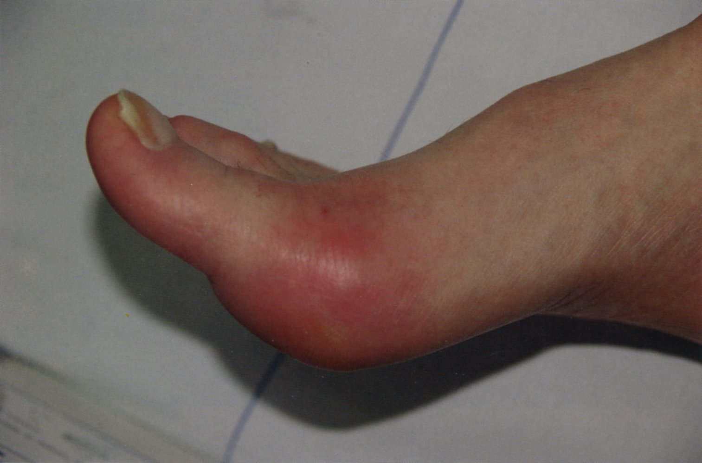

Podagra

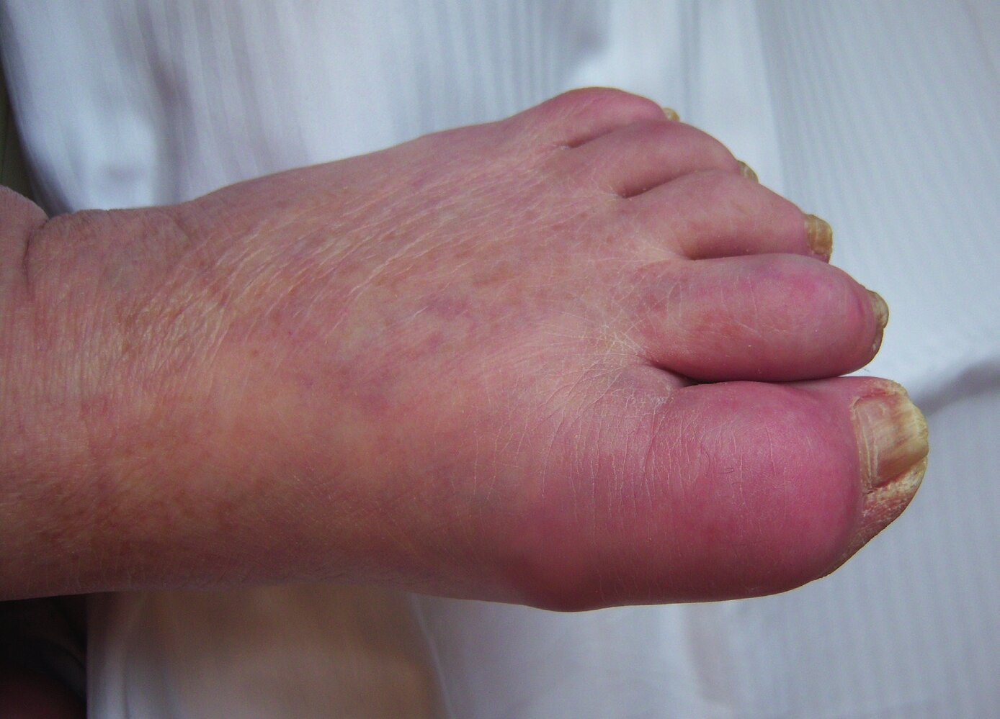

Podagra

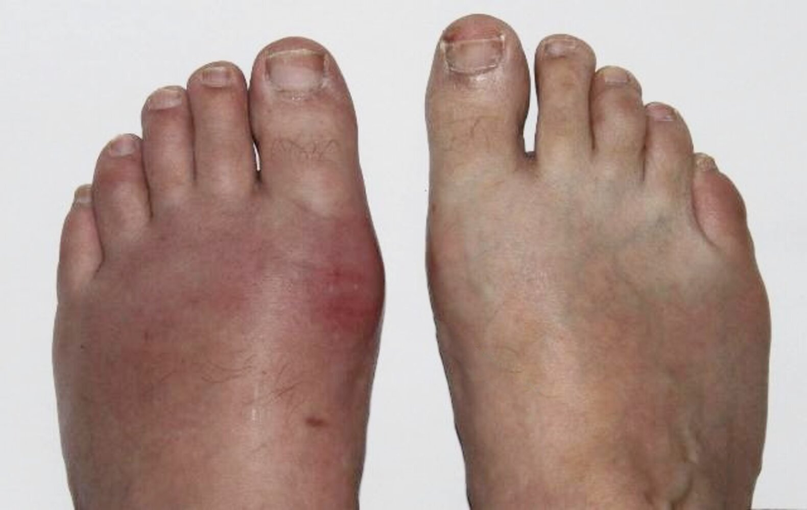

Podagra

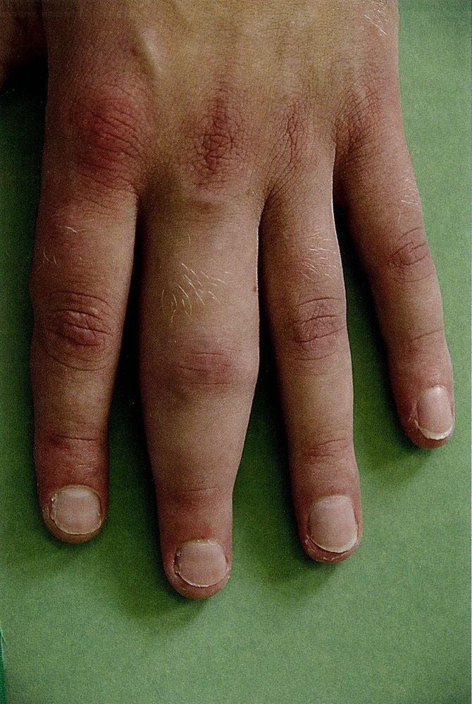

Monoarthritis in acute gouty arthritis

### Intercritical stage

* Asymptomatic

* May last up to several years

### Chronic gouty arthritis

* Uncommon in these times

* Progressive <u>joint</u> destruction

* Tophi formation 

* Multiple painless hard <u>nodules</u> with possible <u>joint</u> deformities [[11]](https://coursology-qbank.com/amboss/article/CnaqvO)

* May appear yellow or white because of overlying attenuated <u>skin</u>

* <u>Ulceration</u> and discharge (chalky white substance) may occur

* Bone tophi: <u>urate</u> crystal deposition in bones (e.g., <u>elbows</u>, knees, extensor surfaces of forearms)

* Soft tissue tophi: <u>urate</u> crystal deposition in the <u>pinna</u> of the external <u>ear</u>, <u>subcutis</u>, <u>tendon sheaths</u> (e.g., at the <u>Achilles tendon</u>), or <u>synovial bursae</u> (e.g., <u>olecranon bursa</u>)

* Renal manifestations with <u>uric acid</u> <u>nephrolithiasis</u> and <u>uric acid</u> nephropathy

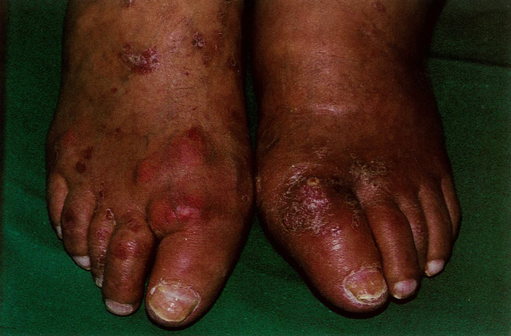

Gouty tophi

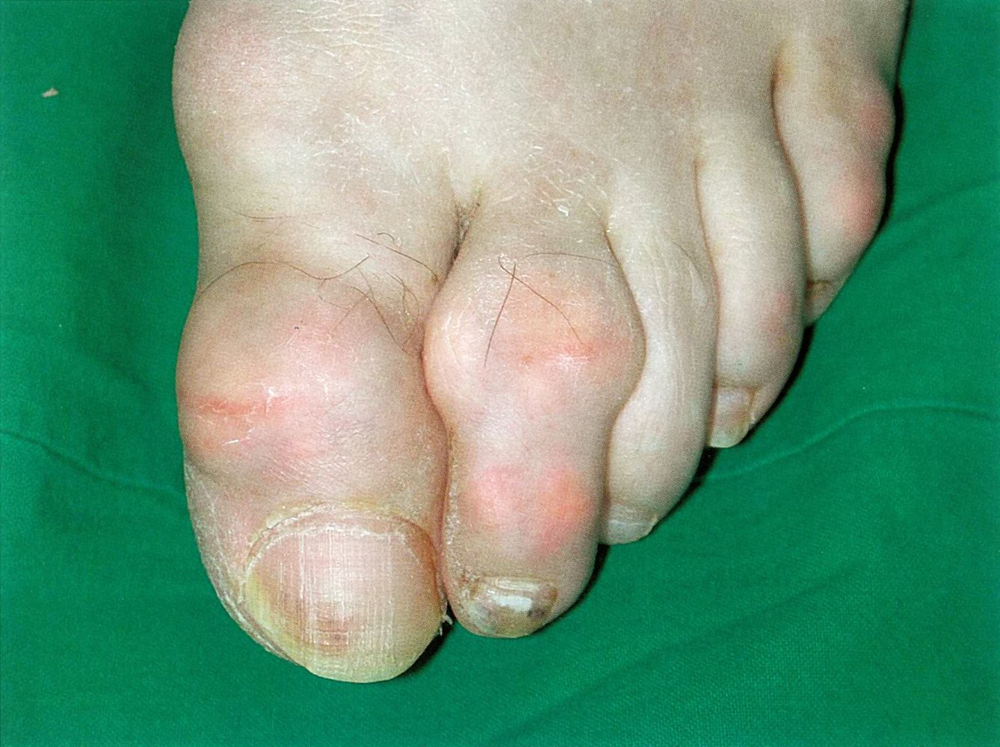

Gouty tophi due to urate crystal deposition in bones and soft tissues

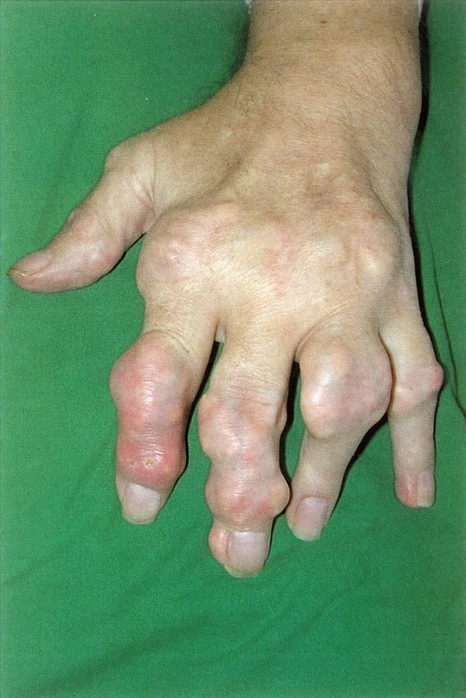

Gouty tophi

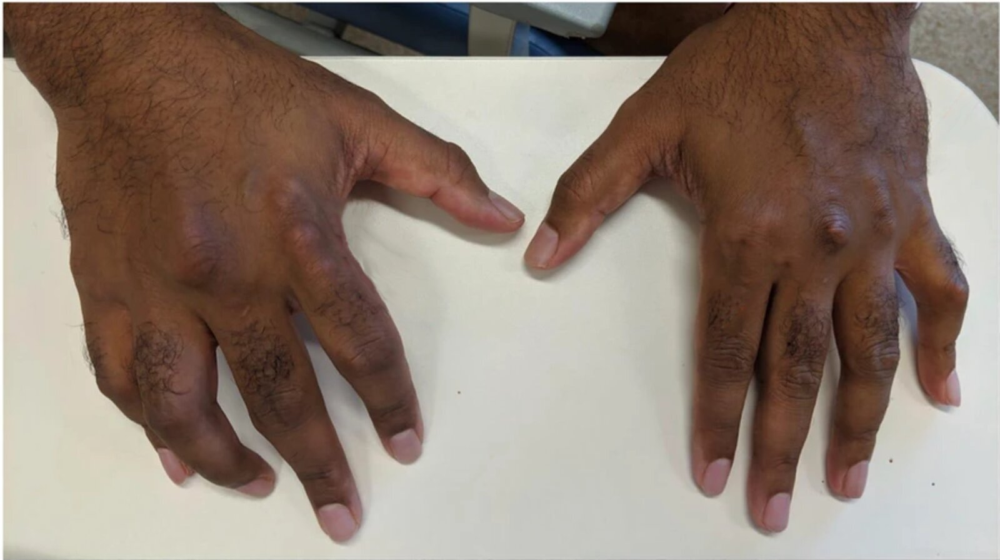

Gouty tophi of the hands

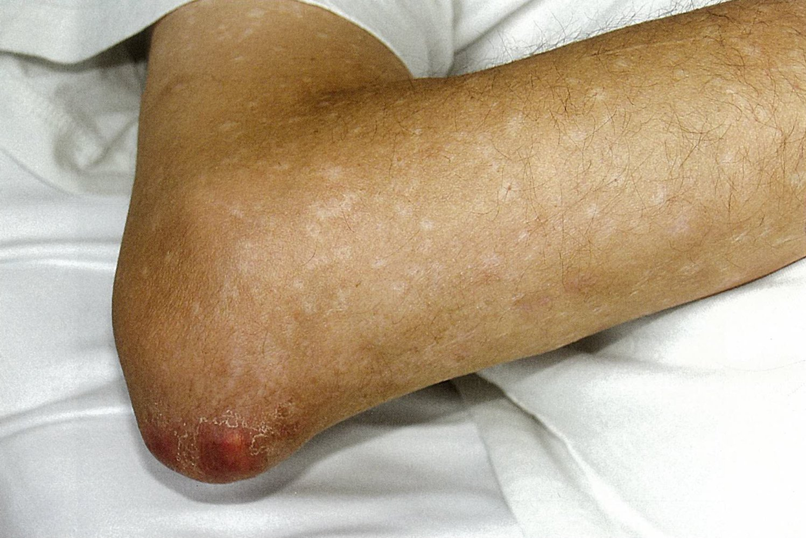

Soft tissue tophi

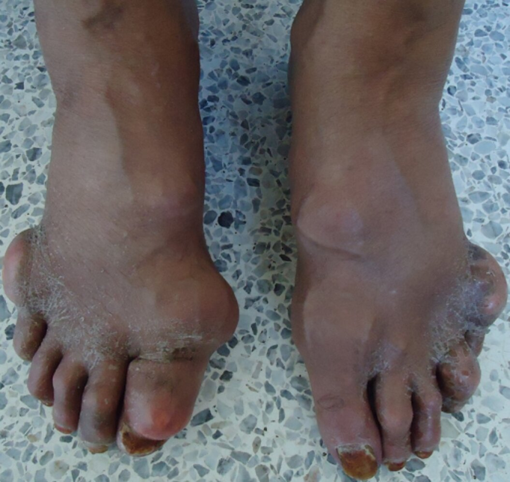

Gouty tophi in chronic gouty arthritis

---

## Diagnosis

Identification of <u>monosodium urate (MSU) crystals</u> on <u>synovial fluid analysis</u> of the affected <u>joint</u> is the <u>gold standard</u> to diagnose <u>gout</u> but requires an invasive technique (i.e., <u>arthrocentesis</u>), trained personnel, and specialized instruments to perform the test. In patients with typical clinical features, a <u>clinical diagnosis</u> may be considered with/without supportive diagnostic evidence on imaging and <u>laboratory studies</u>.

### Approach  [[8]](https://coursology-qbank.com/amboss/article/yGbdbv)[[12]](https://coursology-qbank.com/amboss/article/atbQXv)[[13]](https://coursology-qbank.com/amboss/article/ilXJ9y)

* <u>Acute gout</u> (<u>gout flare</u>)

* Assess the clinical <u>probability</u> of <u>septic arthritis</u>. 

* If relatively high, perform <u>arthrocentesis</u> for <u>synovial fluid analysis</u>

* Consult orthopedics as needed (see “<u>Diagnosis of septic arthritis</u>” for details).

* Assess the clinical <u>probability</u> of <u>acute gout</u>.  

* If relatively low :

* <u>Arthrocentesis</u> with <u>synovial fluid analysis</u> is recommended.

* Consider <u>differential diagnoses of gout</u>.

* If relatively high : Diagnostic tests are not routinely required.

* <u>Chronic gout</u>: A combination of history (e.g., recurrent episodes), examination and imaging findings (e.g., <u>tophi</u>), and evidence of <u>MSU crystals</u> on aspirates of <u>tophi</u> or <u>synovial fluid analysis</u> confirms the diagnosis of <u>chronic gout</u>. [[14]](https://coursology-qbank.com/amboss/article/BGbzYv)[[15]](https://coursology-qbank.com/amboss/article/LwbwjD)

### <u>Arthrocentesis</u> and <u>synovial fluid analysis</u> [[8]](https://coursology-qbank.com/amboss/article/yGbdbv)[[12]](https://coursology-qbank.com/amboss/article/atbQXv)

<u>Synovial fluid analysis</u> is the <u>gold standard</u> for diagnosing <u>gout</u> but should only be performed if <u>polarized light microscopy</u> is available and providers are trained in the procedure  and interpretation.

* Indications

* Uncertain <u>clinical diagnosis</u>

* Higher <u>probability</u> of <u>septic arthritis</u>

* Characteristic findings

* <u>Polarized light microscopy</u>: needle-shaped monosodium urate crystals that are negatively <u>birefringent</u> ;    [[10]](https://coursology-qbank.com/amboss/article/xnaEvO)

* Crystals appear yellow when their optical axis is oriented parallel to the polarizer.

* Crystals appear blue when their axis is perpendicular to the polarizer.

* <u>Synovial fluid</u> cell count: <u>WBC</u> > 2000/μL with > 50% <u>neutrophils</u> (see “<u>Interpretation of synovial fluid analysis</u>”)

* <u>Gram stain</u>: negative; useful for ruling out <u>septic arthritis</u>

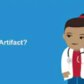

Guiding arthrocentesis with ultrasound

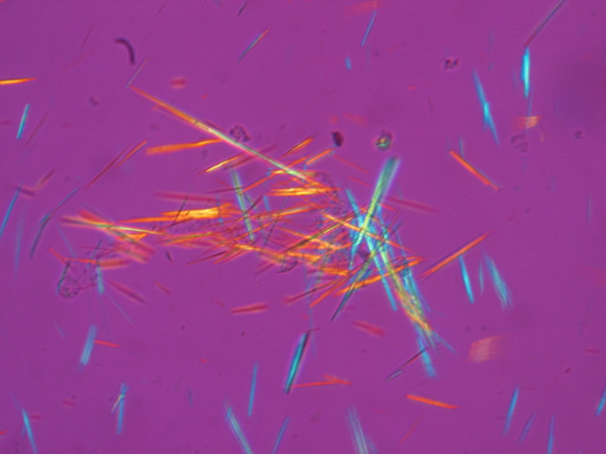

Synovial fluid crystals in gout

### <u>Clinical diagnosis</u> of <u>acute gout</u>  [[8]](https://coursology-qbank.com/amboss/article/yGbdbv)[[12]](https://coursology-qbank.com/amboss/article/atbQXv)

There is a lack of consensus regarding strict diagnostic criteria for <u>gout</u> in clinical settings.  [[8]](https://coursology-qbank.com/amboss/article/yGbdbv)[[14]](https://coursology-qbank.com/amboss/article/BGbzYv)[[15]](https://coursology-qbank.com/amboss/article/LwbwjD)[[16]](https://coursology-qbank.com/amboss/article/JFbsQv)

* A <u>clinical diagnosis</u> of <u>acute gout</u> can be considered in patients who fulfill all of the following parameters:

* Typical clinical presentation

* Low suspicion for <u>septic arthritis</u>

* <u>Monoarthritis</u>

* The <u>diagnostic rule for acute gout</u> can improve diagnostic <u>accuracy</u> for patients with acute <u>monoarthritis</u>.

|  Diagnostic rule for acute gout [[17]](https://coursology-qbank.com/amboss/article/qFbCQv)[[18]](https://coursology-qbank.com/amboss/article/IubYsv)  |  |  |
| --- | --- | --- |
|  | Criterion | Number of points |
| Patient characteristics | Male | 2 |
|  ≥ 1 of the following: <u>hypertension</u>, <u>angina</u>, <u>MI</u>, <u>CHF</u>, <u>TIA</u>, <u>stroke</u>, <u>PVD</u>  | 1.5 |  |
| History of previous <u>arthritis</u> attack | 2 |  |
| Features of current attack | Onset within 24 hours  | 0.5 |
|  <u>Joint</u> <u>erythema</u>  | 1 |  |
| Affects 1st<u>metatarsophalangeal joint</u>  | 2.5 |  |
|  Serum <u>uric acid</u> level > 5.88 mg/dL (> 0.35 mmol/L)  | 3.5 |  |
|  Interpretation   * ≤ 4 points: relatively low likelihood of <u>gout</u>; consider <u>differential diagnoses of gout</u>.  * > 4 but < 8 points: intermediate likelihood of <u>gout</u>; consider <u>synovial fluid analysis</u>, if feasible  * ≥ 8 points: relatively high likelihood of <u>gout</u>; see “Treatment” section     |  |  |

Acute gout diagnosis rule

### <u>Laboratory studies</u>

* Serum <u>uric acid</u> level ;  [[12]](https://coursology-qbank.com/amboss/article/atbQXv)[[16]](https://coursology-qbank.com/amboss/article/JFbsQv)

* <u>Acute gout</u> flare: often elevated (<u>hyperuricemia</u>)  ; may also be normal or low

* Intercritical stage or <u>chronic gout</u>

* Baseline levels are useful to determine the need for <u>urate-lowering therapy</u>.

* A normal or low level has a very low <u>negative likelihood ratio</u> for (but does not rule out) a diagnosis of <u>gout</u>.

* <u>CBC</u> and <u>inflammatory markers</u>: : <u>WBC</u> and <u>ESR</u> are typically elevated in an <u>acute gout</u> attack. [[19]](https://coursology-qbank.com/amboss/article/pxbLxD)

* Urinary <u>uric acid</u> measurement (via <u>24-hour urine collection</u>): not routinely recommended

> [!TIP]
> Serum <u>uric acid</u> levels are not always elevated in <u>acute gouty arthritis</u>.

### Imaging [[8]](https://coursology-qbank.com/amboss/article/yGbdbv)[[12]](https://coursology-qbank.com/amboss/article/atbQXv)[[16]](https://coursology-qbank.com/amboss/article/JFbsQv)[[20]](https://coursology-qbank.com/amboss/article/B9bzpD)

Imaging is indicated if <u>synovial fluid analysis</u> is unsuccessful or cannot be performed, and the diagnosis remains uncertain. It can be used to identify supportive findings of <u>gout</u>  but cannot rule out <u>septic arthritis</u>.

* <u>Ultrasound</u>

* Signs of acute <u>joint</u> inflammation

* Bone <u>erosions</u>

* Signs of <u>urate</u> crystal deposition 

* Double contour sign: a <u>hyperechoic</u> band of crystals covering the surface of the <u>hypoechoic</u> <u>articular cartilage</u>, which is over the <u>hyperechoic</u> bone contour

* <u>Tophi</u> (<u>pathognomonic</u> for <u>chronic gout</u>)

* <u>X-ray</u>

* <u>Acute gout</u>: typically normal; useful for ruling out a <u>fracture</u> in patients with posttraumatic <u>joint</u> inflammation

* <u>Chronic gout</u>

* Punched-out lytic bone lesions with spiky periosteal appositions (overhanging edges), known as “rat-bite <u>erosions</u>”

* <u>Radiopaque</u> in surrounding <u>soft tissue</u>

* <u>Joint</u> space is preserved until late stages.

* Conventional CT and <u>MRI</u>: can identify <u>erosions</u> and <u>tophi</u>; used less frequently

* Dual-energy CT : can detect crystals within deeper anatomical structures (e.g., the <u>spine</u>) and extra-articular sites

> [!TIP]
> <u>Ultrasound</u> or DECT are preferred imaging modalities to detect MSU crystal deposition within affected <u>joints</u>.

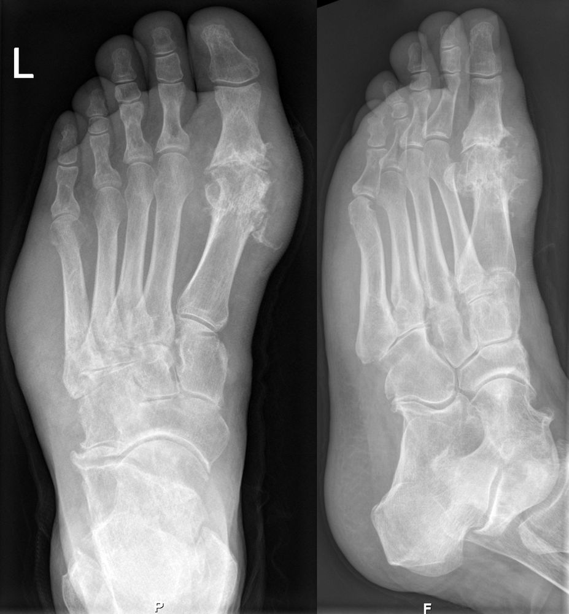

Podagra

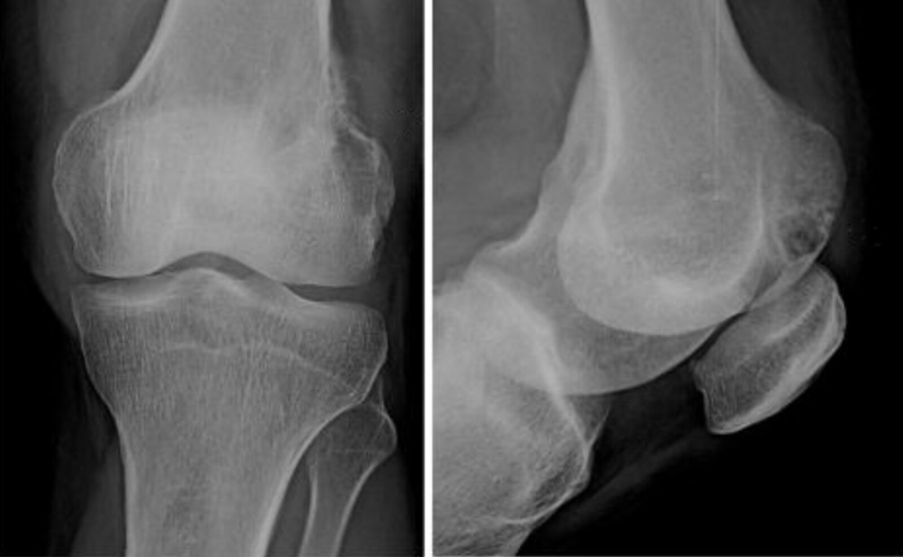

Gout of the knee

---

## Pathology

### <u>Foreign body granuloma</u>

* Caused by <u>urate</u> crystal deposition in <u>cutis</u> and <u>subcutis</u>

* Findings include:

* <u>Clusters</u> of crystal deposits

* <u>Macrophages</u> in the shape of <u>epithelioid cells</u> or polynuclear <u>giant cells</u>

Gout tophus with foreign body granulomas

---

## Differential diagnoses

* <u>Septic arthritis</u>

* Can occur concomitantly with <u>gout</u> [[21]](https://coursology-qbank.com/amboss/article/qxbCxD)

* <u>Joint</u> damage from <u>chronic gout</u> may increase risk. [[22]](https://coursology-qbank.com/amboss/article/IxbYBD)

* Inflammatory <u>arthritis</u> (other types): See “<u>Differential diagnoses of inflammatory arthritis</u>.”

* <u>Acute calcium pyrophosphate deposition disease</u> (<u>pseudogout</u>)

* <u>Rheumatoid arthritis</u>

* <u>Seronegative spondyloarthropathy</u> (e.g. <u>psoriatic arthritis</u>, <u>reactive arthritis</u>)

* <u>Basic calcium phosphate crystal deposition diseases</u>

* <u>Erosive osteoarthritis</u>

The differential diagnoses listed here are not exhaustive.

---

## Treatment

### General measures  [[23]](https://coursology-qbank.com/amboss/article/xGbEYv)

* Lifestyle modifications may help reduce the risk of flares. 

* Limit <u>alcohol</u> consumption

* Limit intake of <u>purines</u> (e.g., red meat and shellfish)

* Limit high-fructose <u>corn</u> syrup (e.g., sugary foods, juices, and non-diet sodas)

* Weight loss if patient is <u>overweight</u>

* Identify and treat <u>sleep apnea</u>. [[24]](https://coursology-qbank.com/amboss/article/J4Xs4y)[[25]](https://coursology-qbank.com/amboss/article/GLXB_A)

* Close management of comorbidities, such as <u>diabetes</u> and <u>hypertension</u>

* Adjust current antihypertensive regimen, if feasible: <u>losartan</u> preferred; avoid <u>hydrochlorothiazide</u>  [[23]](https://coursology-qbank.com/amboss/article/xGbEYv)

---

## Acute gout flare

### Approach [[12]](https://coursology-qbank.com/amboss/article/atbQXv)[[23]](https://coursology-qbank.com/amboss/article/xGbEYv)[[26]](https://coursology-qbank.com/amboss/article/_na5DO)[[27]](https://coursology-qbank.com/amboss/article/zGbrbv)[[28]](https://coursology-qbank.com/amboss/article/-GbDbv)

* Nonpharmacological measures: Rest and ice the affected <u>joint</u>. [[29]](https://coursology-qbank.com/amboss/article/AnaRDO)

* Pharmacotherapy: Initiate within 24 hours of onset. 

* First-line agents: <u>glucocorticoids</u>, <u>NSAIDs</u>, or <u>colchicine</u> (described in detail below)   [[23]](https://coursology-qbank.com/amboss/article/xGbEYv)[[27]](https://coursology-qbank.com/amboss/article/zGbrbv)

* Second-line agents : <u>IL-1</u> inhibitors or <u>ACTH</u>

* Combination therapy options: indicated for attacks involving ≥ 4 <u>joints</u>, > 1 <u>large joint</u>, or severe <u>pain</u>

* <u>Glucocorticoids</u> (any formulation) PLUS <u>colchicine</u>

* <u>NSAIDs</u> PLUS <u>colchicine</u>

* Intraarticular <u>glucocorticoids</u> PLUS <u>NSAIDs</u>

* Consider initiating <u>urate-lowering therapy</u> in select patients (see “Indications” in “<u>Urate-lowering therapy</u>” for details).

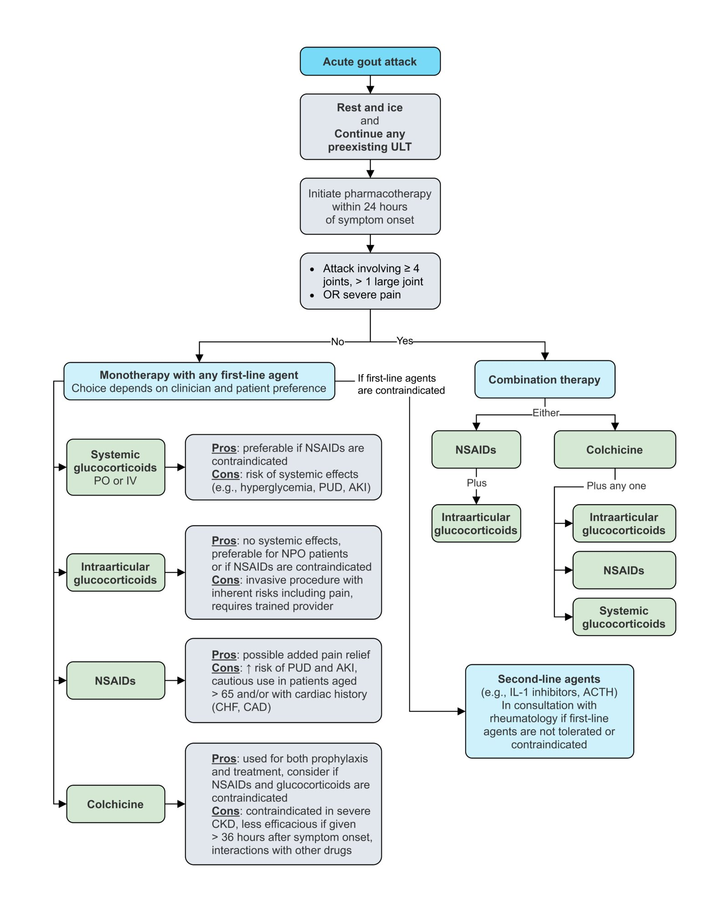

Therapy of acute gout

> [!TIP]
> If a patient is on long-term <u>urate</u>-lowering therapy, it should be continued during the treatment of an <u>acute gout</u> flare.

> [!WARNING]
> Avoid combining <u>NSAIDs</u> with <u>systemic glucocorticoids</u>. If prescribed together, add a <u>proton pump inhibitor</u> to reduce the risk of <u>gastrointestinal ulcers</u>.

#### <u>Glucocorticoids</u> [[23]](https://coursology-qbank.com/amboss/article/xGbEYv)[[27]](https://coursology-qbank.com/amboss/article/zGbrbv)

* Systemic administration

* Oral (e.g., <u>prednisone</u> DOSAGE or <u>prednisolone</u>;  DOSAGE or equivalent )

* Fixed-dose regimen: Treat for 5 days or until symptom resolution.

* A tapered regimen may reduce the risk of a rebound flare.  [[30]](https://coursology-qbank.com/amboss/article/eBbx-D)

* Parenteral or intramuscular (e.g., <u>methylprednisolone</u>  DOSAGE) if <u>NPO</u>

* Intraarticular administration: : Consider if there are 1–2 <u>joints</u> that are accessible and a trained provider is available.

> [!TIP]
> <u>Glucocorticoids</u> are preferable if there are contraindications (e.g., <u>CKD</u>), intolerance, or inadequate response to <u>colchicine</u> or <u>NSAIDs</u>.

#### <u>NSAIDs</u> [[23]](https://coursology-qbank.com/amboss/article/xGbEYv)[[27]](https://coursology-qbank.com/amboss/article/zGbrbv)

* <u>Naproxen</u>:  DOSAGE  or an alternative (e.g., <u>indomethacin</u>, <u>ibuprofen</u>; see “<u>Pain management</u>” for details)

* Fixed-dose regimen: Treat for shortest duration necessary to resolve symptoms (often at least 3–5 days).

* Tapered regimen  for patients with:

* Hepatic/renal impairment

* Comorbidities

* Severe symptoms

* <u>Selective COX-2 inhibitors</u>: Consider as an alternative to <u>naproxen</u> in patients without contraindications.

> [!WARNING]
> <u>Low-dose aspirin</u> can decrease <u>uric acid</u> excretion and trigger recurrent <u>gout</u> flares but it should not be stopped in patients taking it for specific indications (e.g., <u>coronary artery disease</u>, <u>cerebrovascular disease</u>), regardless of the severity of <u>gout</u>. [[23]](https://coursology-qbank.com/amboss/article/xGbEYv)[[31]](https://coursology-qbank.com/amboss/article/RSYlzo)

#### ColchicineDOSAGE [[23]](https://coursology-qbank.com/amboss/article/xGbEYv)[[27]](https://coursology-qbank.com/amboss/article/zGbrbv)

* Mechanism of action: binds and stabilizes <u>tubulin</u> subunits → inhibits <u>microtubule</u> polymerization → inhibits <u>phagocytosis</u> of <u>urate crystals</u>, <u>neutrophil</u> activation, migration, and <u>degranulation</u> [[32]](https://coursology-qbank.com/amboss/article/SiYyIK)

* Administration

* Administer within the first 12 hours of symptom onset to maximize <u>efficacy</u>.

* Reduce dose and monitor closely when prescribed in patients with hepatic impairment or mild-moderate <u>CKD</u>.

* Adverse effects

* Gastrointestinal symptoms, e.g., <u>diarrhea</u>, <u>nausea</u>, <u>vomiting</u>, and abdominal <u>pain</u>, are the most common.

* <u>Rhabdomyolysis</u> , <u>myopathy</u>

* <u>Polyneuropathy</u> [[33]](https://coursology-qbank.com/amboss/article/uBbpcw)

* Cardiac toxicity, <u>arrhythmias</u>

* <u>Nephrotoxicity</u>

* <u>Myelosuppression</u>

* <u>CNS</u> symptoms (e.g., fatigue, <u>headache</u>)

* Contraindications

* Severe <u>CKD</u>

* Patients on prophylactic <u>colchicine</u> who received an <u>acute gout</u> dose of <u>colchicine</u> in the previous 14 days

* <u>Drug interactions</u>

* <u>Statins</u>: Consider reducing dose of <u>pravastatin</u>, <u>atorvastatin</u>, or <u>simvastatin</u> when prescribed concomitantly.

* Potent <u>cytochrome P450</u> 3A4 substrates or inhibitors

* Reduce <u>colchicine</u> dose when prescribed concomitantly.

* Avoid in patients with <u>CKD</u> or hepatic impairment.

> [!TIP]
> <u>Colchicine</u> is unlikely to be effective when initiated > 24–36 hours after symptom onset. <u>Colchicine</u> is preferable in patients who cannot tolerate <u>NSAIDs</u> or <u>systemic glucocorticoids</u> (e.g., patients with <u>gastrointestinal ulcers</u>)

> [!WARNING]
> Monitor for myotoxicity when prescribing <u>colchicine</u> with <u>statins</u>. Reduce dose of <u>pravastatin</u>, <u>atorvastatin</u>, and <u>simvastatin</u> when prescribed concomitantly.

---

## Chronic gout

### Approach [[23]](https://coursology-qbank.com/amboss/article/xGbEYv)

* <u>Urate-lowering therapy</u> (<u>ULT</u>) is recommended for <u>chronic gout</u>.

* First-line: <u>xanthine-oxidase inhibitors</u> (<u>allopurinol</u>)

* Second-line: <u>uricosurics</u> (<u>probenecid</u>)

* Third-line: recombinant uricase (<u>pegloticase</u>)

* Administer anti-inflammatory prophylaxis before initiating <u>ULT</u> as <u>ULT</u> may trigger, prolong, or worsen an <u>acute gout</u> flare.

### Initial anti-inflammatory prophylaxis [[23]](https://coursology-qbank.com/amboss/article/xGbEYv)[[26]](https://coursology-qbank.com/amboss/article/_na5DO)[[28]](https://coursology-qbank.com/amboss/article/-GbDbv)

* Indication: pre-treatment in patients planned for <u>ULT</u> therapy

* Important consideration: should be initiated 1 week before starting <u>ULT</u> therapy

* Options: low dose of any one of the following agents  [[12]](https://coursology-qbank.com/amboss/article/atbQXv)[[23]](https://coursology-qbank.com/amboss/article/xGbEYv)[[26]](https://coursology-qbank.com/amboss/article/_na5DO)

* <u>Colchicine</u> DOSAGE

* <u>NSAIDs</u> (e.g., <u>naproxen</u> DOSAGE)

* <u>Glucocorticoids</u> (e.g., <u>prednisone</u> DOSAGE)

* Treatment duration: Should be administered concomitantly with <u>ULT</u> for at least 3–6 months (or longer if flares continue).

> [!TIP]
> Administering <u>XOIs</u> or <u>uricosuric agents</u> during an <u>acute gout</u> flare may worsen symptoms by mobilizing <u>urate crystals</u>. Anti-inflammatory prophylaxis with <u>colchicine</u>, <u>NSAIDs</u>, or <u>glucocorticoids</u> must be administered before initiating <u>ULT</u>.

### Urate-lowering therapy (<u>ULT</u>) [[23]](https://coursology-qbank.com/amboss/article/xGbEYv)[[26]](https://coursology-qbank.com/amboss/article/_na5DO)[[27]](https://coursology-qbank.com/amboss/article/zGbrbv)

#### Indications

* Absolute indications

* Damage due to <u>chronic gout</u> seen on imaging

* <u>Tophi</u> development

* Frequent <u>gout</u> attacks (≥ 2 per year)

* Relative indications

* < 2 <u>gout</u> attacks per year

* First episode of <u>acute gout</u> flare in patients with any of the following <u>risk factors</u>: 

* <u>CKD</u> ≥ stage 3

* Serum <u>uric acid</u> > 9 mg/dL

* History of <u>urolithiasis</u>

#### Contraindications

* Common to all <u>ULT</u> agents

* <u>Acute gout</u> flare (in the absence of the above-mentioned <u>risk factors</u>)

* Asymptomatic <u>hyperuricemia</u>

* Specific contraindications: see the table below for details

#### Important considerations

* Timing of initiating <u>ULT</u>: at least one week after initiating anti-inflammatory prophylaxis (see above)

* <u>Titration</u> target: serum <u>urate</u> < 6 mg/dL  [[23]](https://coursology-qbank.com/amboss/article/xGbEYv)

* Treatment duration: Continue indefinitely if tolerated and in remission

* Patient adherence: typically low ; monitoring and counseling recommended [[34]](https://coursology-qbank.com/amboss/article/aybQdw)

#### Agents

|  <u>Urate-lowering therapy</u>  [[23]](https://coursology-qbank.com/amboss/article/xGbEYv)[[27]](https://coursology-qbank.com/amboss/article/zGbrbv)[[35]](https://coursology-qbank.com/amboss/article/n_b7Kw)  |  |  |  |  |  |
| --- | --- | --- | --- | --- | --- |
| Drugs |  | First-line Xanthine oxidase inhibitors (<u>XOIs</u>) |  | Second-line Uricosurics | Third-line Recombinant uricase |
|  AllopurinolDOSAGE   |  Febuxostat DOSAGE  |  Probenecid DOSAGE  |  PegloticaseDOSAGE  |  |  |
|  Indications [[23]](https://coursology-qbank.com/amboss/article/xGbEYv)  |  |  * Preferred first-line agent   |  * Alternative first-line agent   |  * Use as an alternative to, or in combination with, a <u>xanthine oxidase inhibitor</u>   |  * Failure of first- and second-line medications  in combination with any of the following:  * Frequent <u>gout</u> attacks (≥ 2 per year)  * Persistent subcutaneous <u>tophi</u>   |
| Mechanism of action |  |   * Inhibition of <u>xanthine</u> <u>oxidase</u> → <u>hypoxanthine</u> and <u>xanthine</u> are not degraded into <u>uric acid</u>  * <u>Allopurinol</u> is a <u>competitive inhibitor</u>.  * <u>Febuxostat</u> is a non-<u>purine</u>, selective inhibitor that is metabolized in the <u>liver</u>.    |  |  * Inhibition of <u>uric acid</u> reabsorption along renal <u>proximal convoluted tubules</u>  → increased <u>renal elimination</u> [[10]](https://coursology-qbank.com/amboss/article/xnaEvO)   |  * Catalyzes the breakdown of <u>uric acid</u> to allantoin   |
| Specific contraindications |  |   * Presence of the <u>HLA</u>-B*5801 <u>allele</u>  * Previous <u>hypersensitivity reaction</u>    |  * History of cardiovascular disease (<u>CVD</u>) or a new <u>CVD</u>-related event (<u>relative contraindication</u>)   |   * <u>Nephrolithiasis</u>  * Moderate to severe <u>CKD</u>    |   * <u>G6PD deficiency</u>  * <u>Congestive heart failure</u>    |
| Side effects |  |   * <u>Rash</u> (<u>maculopapular</u> exanthema)  [[36]](https://coursology-qbank.com/amboss/article/_yb53w)  * <u>Stevens-Johnson</u> syndrome/<u>toxic epidermal necrolysis</u>  * Lowers <u>incidence</u> of <u>acute urate nephropathy</u>    |   * <u>Nausea</u>, <u>diarrhea</u>  * <u>Transaminitis</u>  * <u>Rash</u> (rare)    |   * <u>Urolithiasis</u> (<u>uric acid stones</u>)  * <u>Hypersensitivity reactions</u> (sulfa <u>allergy</u> due to being a <u>sulfonamide</u> derivative)  * Gastrointestinal symptoms  * <u>Rash</u>    |  * Infusion reactions, including <u>anaphylaxis</u>   |
| Important <u>drug interactions</u> |  |   * <u>Purine analogs</u> (e.g., <u>azathioprine</u>, <u>6-mercaptopurine</u>) combined with <u>XOIs</u> can cause <u>bone marrow</u> toxicity  * <u>Probenecid</u> and <u>thiazides</u> decrease the <u>efficacy</u> of <u>allopurinol</u>    |  |  * Inhibits <u>penicillin</u> secretion in the <u>proximal convoluted tubule</u>   |  * Should not be used concomitantly with <u>XOIs</u> or <u>uricosurics</u>.   |

> [!WARNING]
> Test for the <u>HLA</u>-B*5801 <u>allele</u> before initiating <u>allopurinol</u> in black patients and patients of Southeast Asian descent.

> [!WARNING]
> The combination of <u>allopurinol</u> and <u>azathioprine</u> leads to increased <u>bone marrow</u> toxicity!

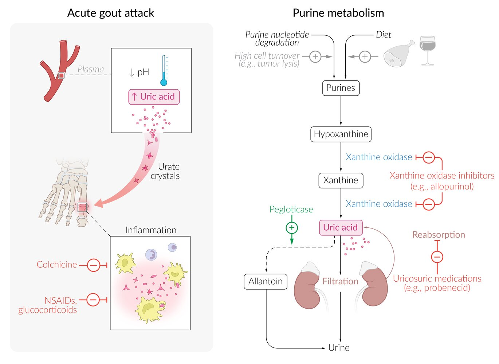

Mechanism of action: gout drugs

---

## Complications

* <u>Nephrolithiasis</u>: <u>uric acid stones</u>

* Uric acid nephropathy

* Acute uric acid nephropathy

* Can occur in <u>tumor lysis syndrome</u>

* Causes tubular obstruction → <u>acute renal failure</u>

* Chronic uric acid nephropathy: a form of chronic tubulointerstitial nephropathy with monosodium <u>urate</u> crystal deposition in the stroma of the <u>kidney</u>, which causes inflammation
* Clinical features

* <u>Hypertension</u>

* In rare cases, progressive <u>renal failure</u>

We list the most important complications. The selection is not exhaustive.

---