# Sarcoidosis

*Categories: Clinical knowledge > Internal medicine > Rheumatology and immunology > Joint diseases > Sarcoidosis*

[Original Article Link](https://coursology-qbank.com/amboss/article/Mh0Mef)

---

## Summary

Sarcoidosis is a multisystem inflammatory disorder characterized by <u>noncaseating granuloma</u> formation, most commonly in the <u>lungs</u> and <u>hilar lymph nodes</u>. Many patients are asymptomatic, especially in the early stages of disease. Symptomatic patients typically present with <u>constitutional symptoms</u>, <u>cough</u>, and <u>dyspnea</u>. The cause of sarcoidosis is unknown but is thought to be related to an environmental exposure in a genetically predisposed individual. <u>Chest x-ray</u> is the preferred initial test for individuals with suspected sarcoidosis since <u>bilateral hilar lymphadenopathy</u> and/or pulmonary involvement is present in ∼ 90% of affected patients. Sarcoidosis is a diagnosis of exclusion that typically requires characteristic clinical features and/or findings on chest imaging, <u>noncaseating granulomas</u> on <u>biopsy</u>, and exclusion of more common causes of granulomatous disease or <u>lymphadenopathy</u>. While most patients with <u>pulmonary sarcoidosis</u> do not require <u>immunosuppressive therapy</u>, patients with symptomatic or progressive disease are typically treated with <u>glucocorticoids</u>. Spontaneous remission without complications is common in patients with early-stage pulmonary disease, but the risk of irreversible <u>lung</u> <u>fibrosis</u> increases with disease recurrence and progression.

---

## Epidemiology

* Average age of onset: 30–55 years [[1]](https://coursology-qbank.com/amboss/article/Ob1IF20)[[2]](https://coursology-qbank.com/amboss/article/qY1CJ20)

* Sex: : <u>♀</u> > <u>♂</u> (2:1)

* <u>Prevalence</u>

* Highest in African American and Scandinavian populations

* 2–4 times higher in Black individuals than in non-Hispanic white individuals [[3]](https://coursology-qbank.com/amboss/article/Nb1-F20)[[4]](https://coursology-qbank.com/amboss/article/PW1Wlf0)

Epidemiological data refers to the US, unless otherwise specified.

---

## Pathophysiology

Sarcoidosis is a systemic disorder characterized by widespread, immune-mediated formation of <u>noncaseating granulomas</u>.

* General

* Inhalation of foreign <u>antigen</u> → <u>monocyte</u> differentiation → activation of <u>interstitial</u> <u>dendritic cells</u> and <u>alveolar macrophages</u>

* <u>Interstitial</u> <u>dendritic cells</u> migrate towards <u>mediastinal lymph nodes</u> and <u>alveolar macrophages</u> differentiate, serving as <u>antigen-presenting cells</u> to circulating <u>T helper</u> (Th) cells → differentiation and clonal expansion of <u>T cells</u>

* <u>T cell</u> recruitment and ↑ <u>B-cell</u> activity → local immune hyperactivity and inflammation → formation of <u>noncaseating granulomas</u> in the <u>lungs</u> and <u>the lymphatic system</u>

* <u>Granuloma</u> formation: Mature <u>granulomas</u> are composed of <u>epithelioid cells</u> and <u>macrophages</u> surrounded by <u>lymphocytes</u> and <u>fibroblasts</u>.

* <u>Macrophages</u> activate <u>Th1 cells</u>.

* <u>Th1 cells</u> stimulate the formation of <u>epithelioid cells</u> and <u>multinucleated giant cells</u> by releasing <u>IFN-γ</u>.

* <u>Epithelioid cells</u> produce <u>angiotensin-converting enzyme</u> (<u>ACE</u>) and release <u>cytokines</u> that recruit more <u>immune cells</u>.

* See “<u>Granulomatous inflammation</u>” for more details.

* <u>Fibrosis</u>: <u>Epithelioid cells</u> secrete <u>cytokines</u> to recruit <u>fibroblasts</u>, leading to <u>fibrosis</u> → damage of organs and tissue

* <u>Calcium</u> dysregulation: : activated pulmonary <u>alveolar macrophages</u> → ↑ <u>1-alpha hydroxylase</u> expression and activity → ↑ <u>1,25-dihydroxyvitamin D</u> (<u>calcitriol</u>) → <u>hypervitaminosis D</u> → <u>hyperphosphatemia</u>, <u>hypercalcemia</u>, and, possibly, <u>renal failure</u>  [[6]](https://coursology-qbank.com/amboss/article/2m1TUh0)

Hypercalcemia due to Sarcoidosis USMLE-style question walkthrough

---

## Clinical features

### Overview

* Sarcoidosis is a disease with highly variable manifestations, ranging from asymptomatic to progressive, relapsing disease.

* Typically sudden onset with spontaneous remission in approximately two-thirds of patients [[3]](https://coursology-qbank.com/amboss/article/Nb1-F20)

* Approx. one-third of patients develop progressive chronic disease.

* Most common presenting signs and symptoms

* Often asymptomatic (in early stages)

* General: <u>fever</u>, <u>malaise</u>, lack of appetite, weight loss, <u>lymphadenopathy</u>

* Pulmonary: <u>dyspnea</u>, <u>cough</u>, <u>chest pain</u>

* Extrapulmonary: <u>arthritis</u>, <u>erythema nodosum</u>, <u>anterior uveitis</u>

Sarcoidosis fact sheet

### Pulmonary sarcoidosis

* <u>Lungs</u> are the most commonly affected organ (90% of affected individuals).

* Often asymptomatic in the early stages

* <u>Interstitial</u> <u>fibrosis</u>

* <u>Cough</u>, <u>exertional dyspnea</u>, <u>chest pain</u>

* Mild <u>rales</u> on <u>pulmonary auscultation</u>

### Extrapulmonary sarcoidosis [[7]](https://coursology-qbank.com/amboss/article/HX1Kz20)

* Occurs in approx. 30% of affected individuals

* Extrapulmonary findings usually involve the <u>skin</u>, eyes, <u>heart</u>, and/or the renal and central nervous systems.

#### Cutaneous sarcoidosis [[8]](https://coursology-qbank.com/amboss/article/rX1fz20)

* Occurs in approx. 30% of affected individuals [[7]](https://coursology-qbank.com/amboss/article/HX1Kz20)

* <u>Erythema nodosum</u>: most common nonspecific cutaneous manifestation

* Lupus pernio

* A <u>pathognomonic</u> manifestation of sarcoidosis characterized by extensive, violaceous <u>skin plaques</u> (i.e., <u>epithelioid granulomas of the dermis</u>) on the nose, cheeks, chin, and/or <u>ears</u>

* <u>Butterfly rash</u> as seen in <u>systemic lupus erythematosus</u>

* <u>Papular</u> sarcoidosis 

* A common specific sarcoid cutaneous lesion showing <u>noncaseating granulomas</u> on <u>biopsy</u>

* Multiple scattered or confluent lesions, located on the face (<u>lips</u>, nostrils, eyelids, forehead, and neck hairline)

* <u>Plaque</u>-like lesions 

* Specific sarcoid cutaneous lesions

* Sharply demarcated, <u>scaling</u>, <u>erythematous</u> lesions

* Scar sarcoidosis: <u>papular</u> lesions in preexisting scars (e.g., <u>venipuncture</u> sites) and/or elevation of scars or tattoos

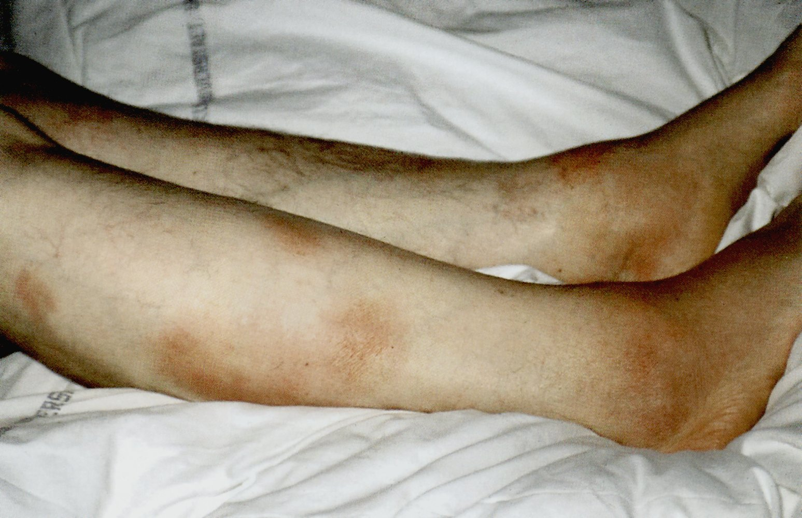

Erythema nodosum in sarcoidosis

Lupus pernio

Lupus pernio

Lupus pernio

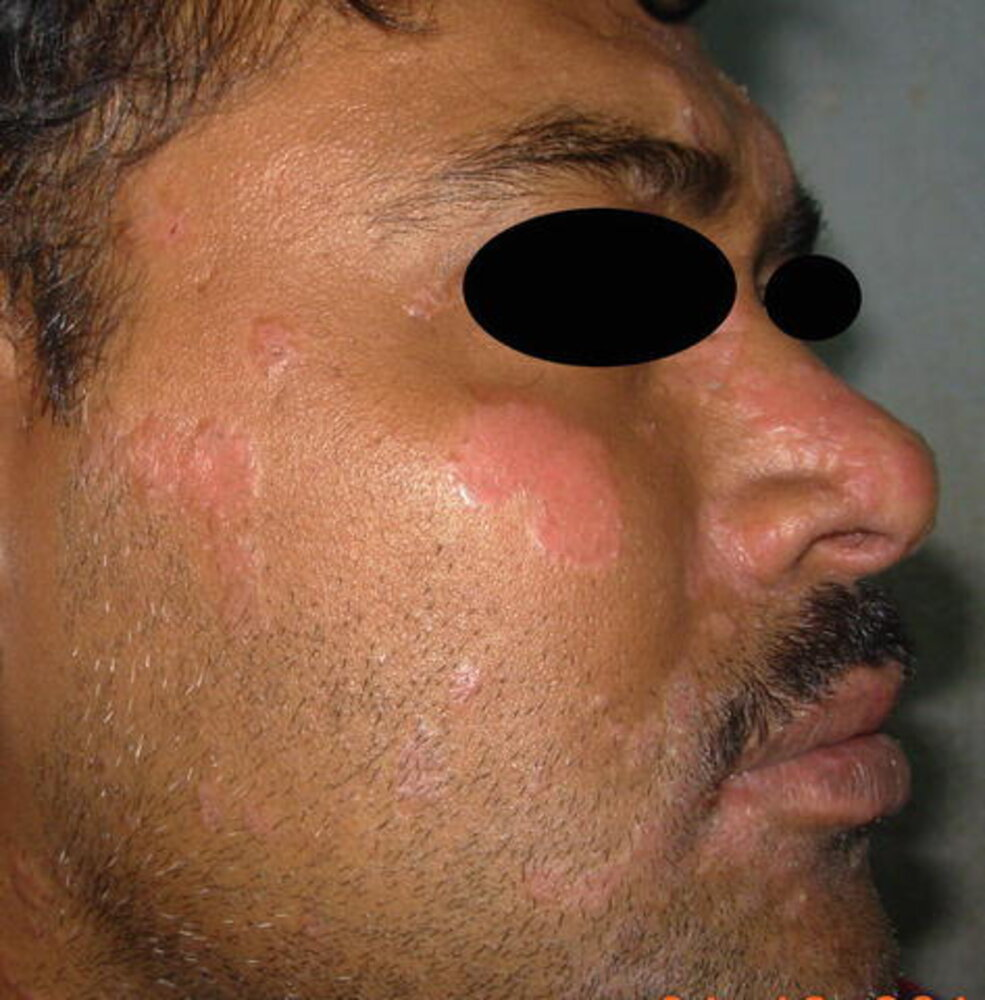

Annular sarcoidosis

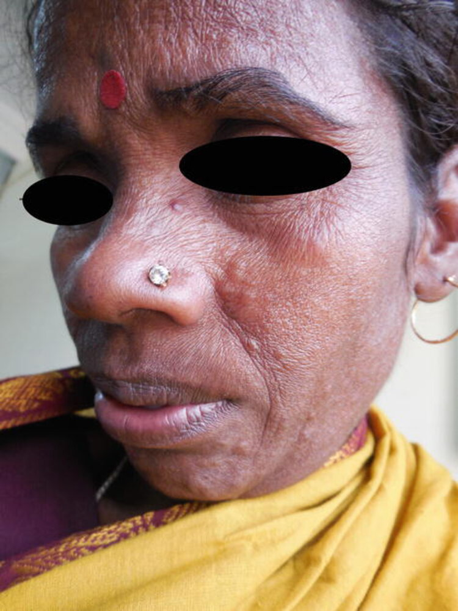

Maculopapular sarcoidosis

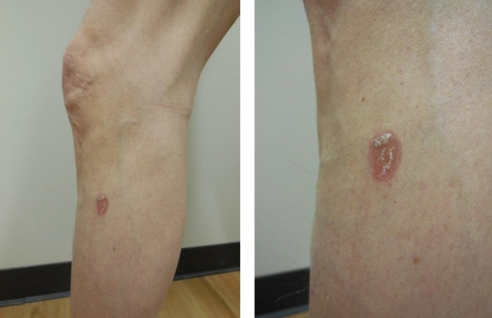

Cutaneous manifestation of sarcoidosis

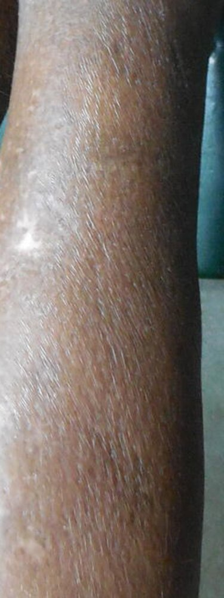

Morpheaform sarcoidosis

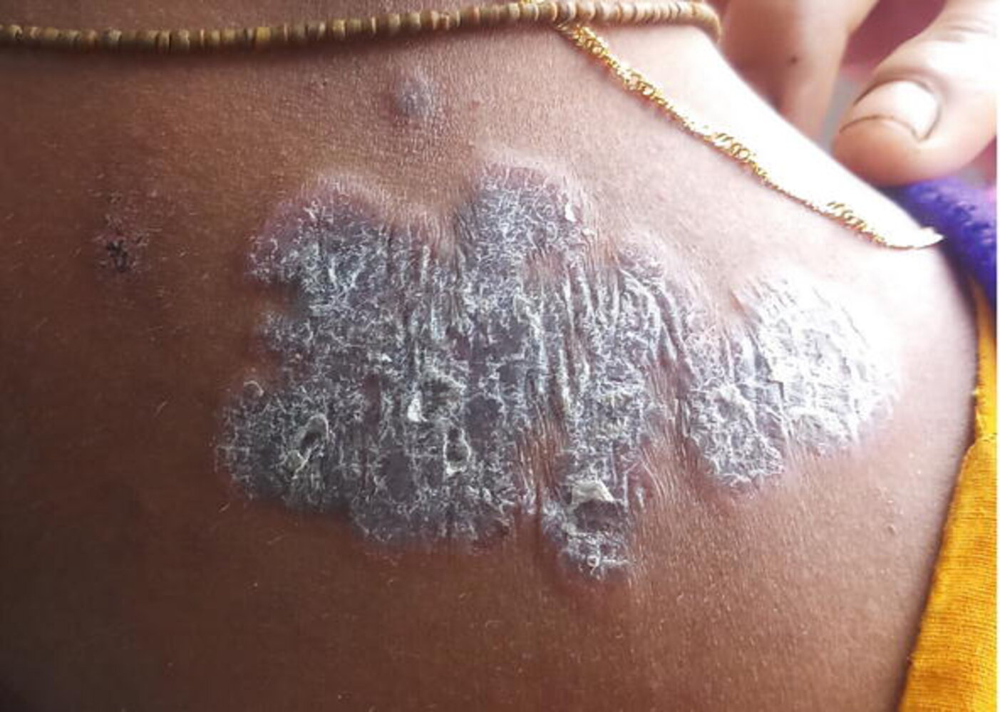

Psoriasiform sarcoidosis

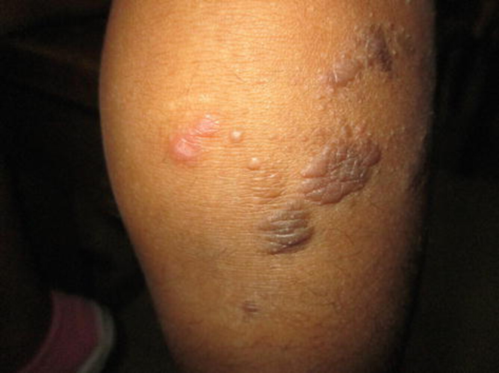

Plaque sarcoidosis

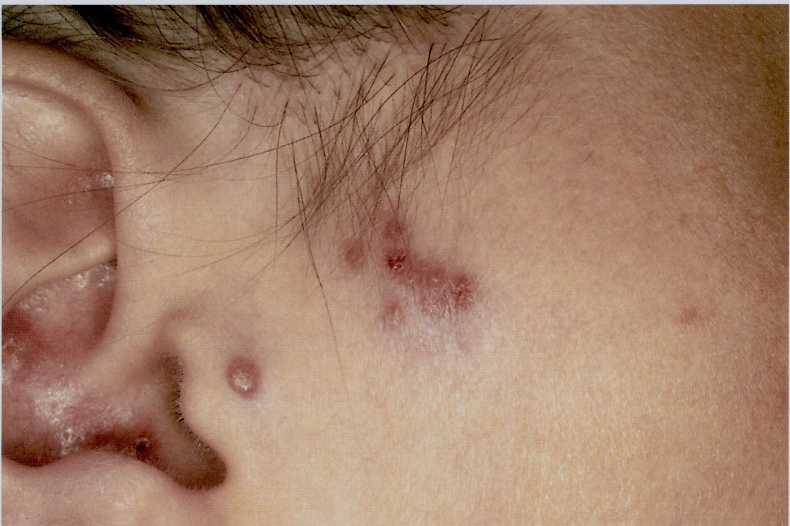

Scar sarcoidosis

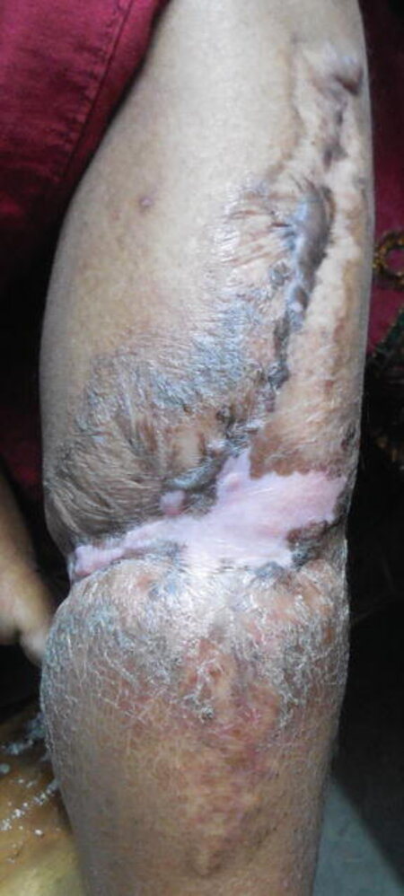

Scar sarcoidosis

#### <u>Lymph node</u> findings

* Most commonly affected extrapulmonary site

* Occurs in 70–90% of affected individuals

* <u>Mediastinal lymph nodes</u>: bilateral, hilar, and/or paratracheal <u>mediastinal</u> adenopathies (approx. 90% of affected individuals)

* Intraabdominal <u>lymphadenopathy</u> [[7]](https://coursology-qbank.com/amboss/article/HX1Kz20)

#### Ocular sarcoidosis

* Occurs in 10–25% of affected individuals [[7]](https://coursology-qbank.com/amboss/article/HX1Kz20)

* Can affect any part of the <u>eye</u> and associated structures

* Common manifestations include <u>uveitis</u>, <u>conjunctival</u> <u>nodules</u>, <u>keratoconjunctivitis sicca</u>

* Sarcoid uveitis 

* Most common ocular manifestation

* Manifests with <u>pain</u>, redness, and <u>photophobia</u>

Anterior uveitis

#### Musculoskeletal findings

* Occurs in approx. 10% of affected individuals [[7]](https://coursology-qbank.com/amboss/article/HX1Kz20)

* <u>Arthralgias</u> and <u>arthritis</u>

* <u>Polyarthritis</u> with involvement of the <u>small joints</u> of the hands (resembles <u>rheumatoid arthritis</u>)

* Acute <u>oligoarthritis</u> with bilateral involvement of the ankle <u>joints</u>

* Sarcoid myopathy

* Initially asymptomatic with insidious course

* Clinical patterns

* Chronic <u>sarcoid myopathy</u>: progressive, bilateral <u>proximal</u> <u>muscle weakness</u>

* Acute sarcoid <u>myositis</u>: diffuse, bilateral, <u>proximal</u> muscle <u>pain</u> and swelling

* Nodular <u>sarcoid myopathy</u>: one or more tender <u>nodules</u>; typically affects the lower limbs

* Bone lesions

* Hands and feet are most commonly affected.

* Can appear as lytic, <u>sclerotic</u>, or punched-out lesions on <u>x-ray</u>

* <u>Bone biopsy</u> to rule out <u>malignancy</u> and infections

#### Neurosarcoidosis

* Occurs in approx. 5% of affected individuals [[7]](https://coursology-qbank.com/amboss/article/HX1Kz20)

* <u>Cranial nerve</u> palsy (unilateral or bilateral <u>facial nerve palsy</u> is the most common)

* <u>Diabetes insipidus</u>

* <u>Hypopituitarism</u>

* <u>Meningitis</u> (e.g., acute <u>aseptic meningitis</u>, <u>chronic meningitis</u>)

* <u>Peripheral neuropathy</u> (e.g., mononeuropathy, <u>mononeuritis multiplex</u>, <u>polyneuropathies</u>)

* <u>Myopathy</u> (e.g., <u>proximal</u> <u>myopathy</u>, muscle <u>atrophy</u>)

### Other findings [[7]](https://coursology-qbank.com/amboss/article/HX1Kz20)

* Cardiac sarcoidosis: : dilated or <u>restrictive cardiomyopathy</u>, <u>myocarditis</u>, <u>pericardial effusion</u>, <u>arrhythmias</u> (e.g., <u>AV block</u>), <u>sudden cardiac death</u>

* <u>Kidneys</u>: <u>acute interstitial nephritis</u>, <u>nephrocalcinosis</u>, <u>nephrolithiasis</u>

* Hepatic sarcoidosis

* Asymptomatic (approx. 80% of affected individuals)

* Common manifestations: hepatic <u>granulomas</u>, <u>hepatomegaly</u> (∼ 30% of affected individuals)

* <u>Spleen</u>: <u>splenomegaly</u> in ∼ 30% of affected individuals

* <u>Exocrine glands</u>: enlarged salivary and <u>lacrimal glands</u>

> [!NOTE]
> Features of sarcoidosis are GRUELING: Granulomas, aRthritis, Uveitis, Erythema nodosum, Lymphadenopathy, Interstitial <u>fibrosis</u>, Negative <u>TB</u> test, and Gammaglobulinemia.

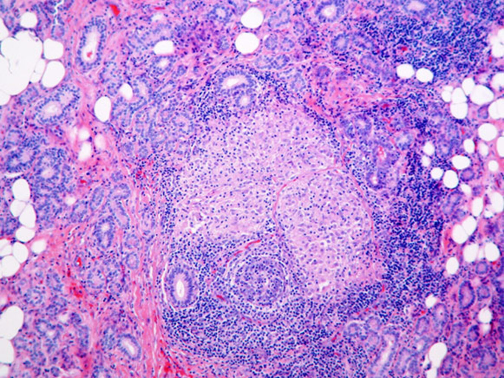

Granulomatous sialadenitis

---

## Subtypes and variants

### Lofgren syndrome [[9]](https://coursology-qbank.com/amboss/article/cw1a3Q0)

* An acute clinical manifestation with <u>fever</u> and the following triad of symptoms:

* Migratory <u>polyarthritis</u>: symmetrical <u>arthritis</u> that primarily affects the ankles

* <u>Erythema nodosum</u>: primarily affects the extensor surface of the lower legs

* <u>Bilateral hilar lymphadenopathy</u>

* Prognosis is good (spontaneous remission occurs in 70–80% of affected individuals). [[9]](https://coursology-qbank.com/amboss/article/cw1a3Q0)

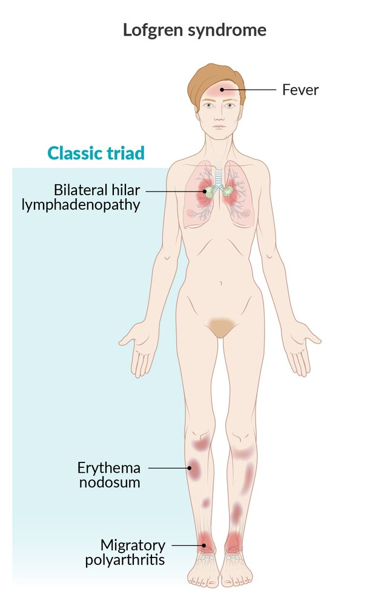

Lofgren syndrome 

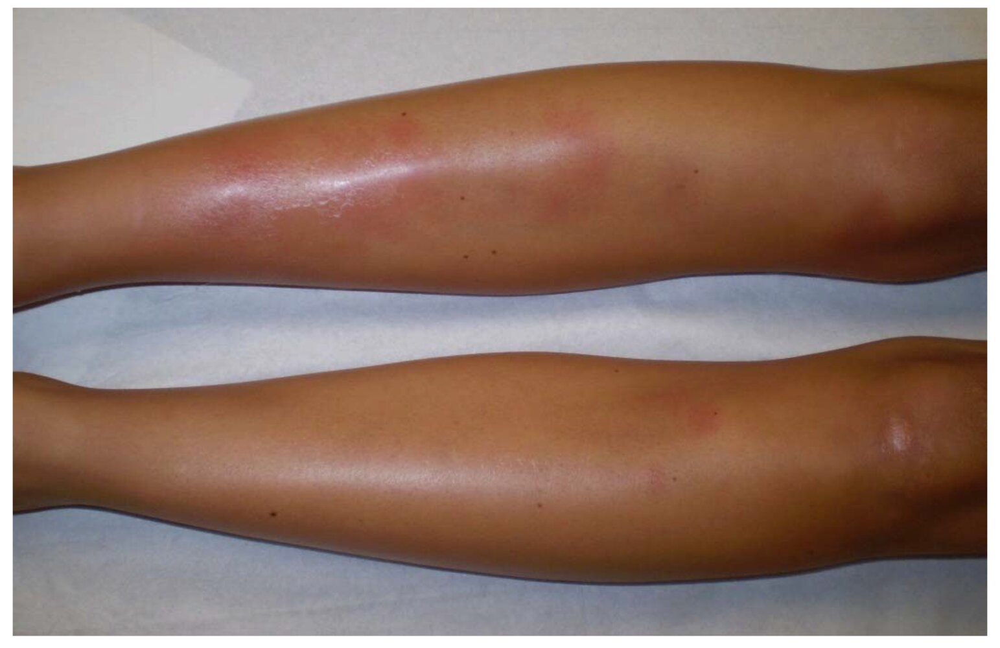

Erythema nodosum

### Heerfordt syndrome

* A rare form of sarcoidosis characterized by <u>fever</u> and the following triad of symptoms:

* <u>Parotitis</u>

* <u>Uveitis</u>

* <u>Facial palsy</u>

---

## Diagnosis

### General principles [[7]](https://coursology-qbank.com/amboss/article/HX1Kz20)[[10]](https://coursology-qbank.com/amboss/article/sX1tz20)[[11]](https://coursology-qbank.com/amboss/article/mD1VUQ0)

* Sarcoidosis is a diagnosis of exclusion supported by:

* Characteristic clinical features and/or findings on chest imaging

* <u>Noncaseating granulomas</u> on <u>biopsy</u>

* Exclusion of more common causes of granulomatous disease or <u>lymphadenopathy</u>

* Obtain initial studies to:

* Rule out differential diagnoses (e.g., other <u>granulomatous diseases</u>).

* Assess pulmonary and extrapulmonary disease (including ophthalmological evaluation).

* Consider additional studies (e.g., <u>biopsy</u>) under specialist guidance based on suspected organ involvement.

> [!TIP]
> Pulmonary involvement and/or hilar <u>lymphadenopathy</u> are present in ∼ 90% of patients. Obtain chest imaging in all patients. [[7]](https://coursology-qbank.com/amboss/article/HX1Kz20)

> [!TIP]
> The <u>eye</u> and the <u>skin</u> are the most common sites of extrathoracic disease. [[7]](https://coursology-qbank.com/amboss/article/HX1Kz20)

### Initial studies [[9]](https://coursology-qbank.com/amboss/article/cw1a3Q0)[[11]](https://coursology-qbank.com/amboss/article/mD1VUQ0)

* <u>Laboratory studies</u>

* <u>CBC</u> and differential: <u>leukocytopenia</u>

* <u>Inflammatory markers</u>: ↑ <u>ESR</u>, <u>CRP</u>

* <u>CMP</u>

* <u>Hypercalcemia</u> (due to elevated 1,25-dihydroxy-<u>vitamin D</u>)

* ↑ <u>BUN</u>, <u>creatinine</u>: may indicate <u>tubulointerstitial disease</u>

* ↑ <u>ALP</u> and/or <u>GGT</u> (> 3 × <u>ULN</u>): may indicate hepatic involvement  [[7]](https://coursology-qbank.com/amboss/article/HX1Kz20)

* <u>Urinalysis</u>: <u>hypercalciuria</u>

* 1,25-OH and 25-OH <u>vitamin D</u> levels in patients with <u>hypercalcemia</u>

* ↑ <u>IgG</u>

* <u>TB</u> screening: <u>interferon-γ release assay</u>

* 12-lead <u>ECG</u>: concerning findings include <u>heart block</u>, frequent <u>PVCs</u>, <u>tachyarrhythmias</u>

> [!TIP]
> Increased <u>ACE</u> levels may be seen. However, they are not specific for sarcoidosis and should not be used in isolation for diagnosis or monitoring. [[9]](https://coursology-qbank.com/amboss/article/cw1a3Q0)

> [!WARNING]
> <u>Cardiac sarcoidosis</u> can lead to <u>sudden cardiac death</u>. Perform an <u>ECG</u> in all patients with suspected sarcoidosis regardless of symptoms. [[10]](https://coursology-qbank.com/amboss/article/sX1tz20)

#### Imaging

* <u>Chest x-ray</u>  [[12]](https://coursology-qbank.com/amboss/article/1w123Q0)

* Preferred initial test for all patients with suspected sarcoidosis

* Classic findings: <u>bilateral hilar lymphadenopathy</u> with or without pulmonary infiltrates (i.e., reticular and/or <u>ground glass opacities</u>)

* <u>Pulmonary sarcoidosis</u> is staged according to radiographic findings.

|  Radiographic stages of pulmonary sarcoidosis [[12]](https://coursology-qbank.com/amboss/article/1w123Q0)  |  |
| --- | --- |
| Stages | <u>Chest x-ray</u> findings |
| Stage 0 |  * Normal   |
| Stage I |  * Bilateral hilar lymphadenopathy: bilateral enlargement of the <u>lymph nodes</u> of the <u>pulmonary hila</u> without pulmonary infiltrates   |
| Stage II |  * <u>Bilateral hilar lymphadenopathy</u> with pulmonary infiltrates   |
| Stage III |  * Pulmonary infiltrates without <u>bilateral hilar lymphadenopathy</u>   |
| Stage IV |  * Substantial <u>pulmonary fibrosis</u>   |

> [!TIP]
> Stage I <u>pulmonary sarcoidosis</u> is often an incidental finding detected on chest imaging. [[10]](https://coursology-qbank.com/amboss/article/sX1tz20)

* <u>High-resolution CT</u> (<u>HRCT</u>) [[10]](https://coursology-qbank.com/amboss/article/sX1tz20)[[12]](https://coursology-qbank.com/amboss/article/1w123Q0)

* Obtain an <u>HRCT</u> in all patients with confirmed or suspected <u>pulmonary sarcoidosis</u>.

* Findings

* Extensive hilar and <u>mediastinal</u> <u>lymphadenopathy</u>

* Bronchocentric and perilymphatic micronodules (i.e., bronchovascular beading)

* <u>Peribronchial thickening</u>

* <u>Fibrosis</u>

> [!TIP]
> Patients with <u>pulmonary sarcoidosis</u> may have minimal to no symptoms despite significant radiographic abnormalities.

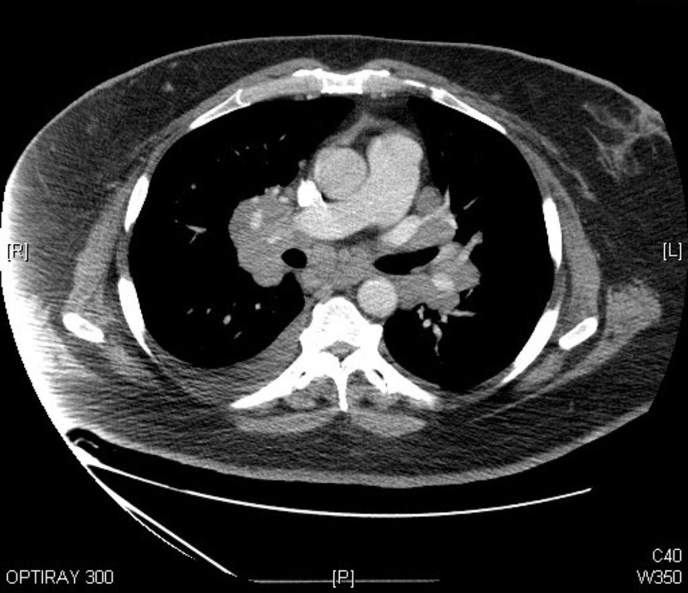

Sarcoidosis

#### <u>Pulmonary function testing</u> (<u>PFTs</u>) [[12]](https://coursology-qbank.com/amboss/article/1w123Q0)

Obtain <u>PFTs</u> to assess disease severity in patients with <u>pulmonary sarcoidosis</u>.

* <u>Spirometry</u>

* Typically shows a restrictive pattern

* Obstructive and mixed patterns may also be seen. (See “<u>Obstructive vs. restrictive lung disease</u>.”)

* <u>Diffusing capacity of the lung for carbon monoxide</u> (<u>DLCO</u>) is decreased.

> [!TIP]
> <u>PFTs</u> show an early reduction of <u>DLCO</u> and <u>lung compliance</u>.

### Additional studies [[11]](https://coursology-qbank.com/amboss/article/mD1VUQ0)

Consider the following studies under specialist guidance based on suspected organ involvement:

* <u>Bronchoalveolar lavage</u> (<u>BAL</u>):↑ <u>CD4:CD8 ratio</u>  [[9]](https://coursology-qbank.com/amboss/article/cw1a3Q0)

* <u>TTE</u> for <u>pulmonary hypertension</u> screening if ↓ <u>DLCO</u> or if enlarged <u>pulmonary artery</u> is present on <u>HRCT</u>

* <u>Cardiac MRI</u> and/or cardiac <u>FDG-PET</u> if there are concerning findings on 12-lead <u>ECG</u> or suspected <u>cardiac sarcoidosis</u>

* <u>Cross-sectional imaging</u> (abdomen) to assess for splenic involvement if <u>CBC</u> demonstrates <u>cytopenias</u>

### <u>Biopsy</u> [[10]](https://coursology-qbank.com/amboss/article/sX1tz20)[[11]](https://coursology-qbank.com/amboss/article/mD1VUQ0)

* <u>Gold standard</u> for the diagnosis

* Tissue should be obtained from the most easily accessible lesions (e.g., cutaneous lesions, <u>superficial</u> <u>lymph nodes</u>).

* Request fungal and <u>mycobacterial</u> staining and culture to rule out differential diagnoses. [[7]](https://coursology-qbank.com/amboss/article/HX1Kz20)

* <u>Histopathology</u> findings

* <u>Noncaseating granulomas</u> with <u>giant cells</u>

* <u>Asteroid bodies</u>

* <u>Schaumann bodies</u>

> [!TIP]
> Histopathological confirmation is not required in patients with <u>pathognomonic</u> presentations, i.e., <u>Lofgren syndrome</u>, <u>Heerfordt syndrome</u>, and <u>lupus pernio</u>. [[10]](https://coursology-qbank.com/amboss/article/sX1tz20)

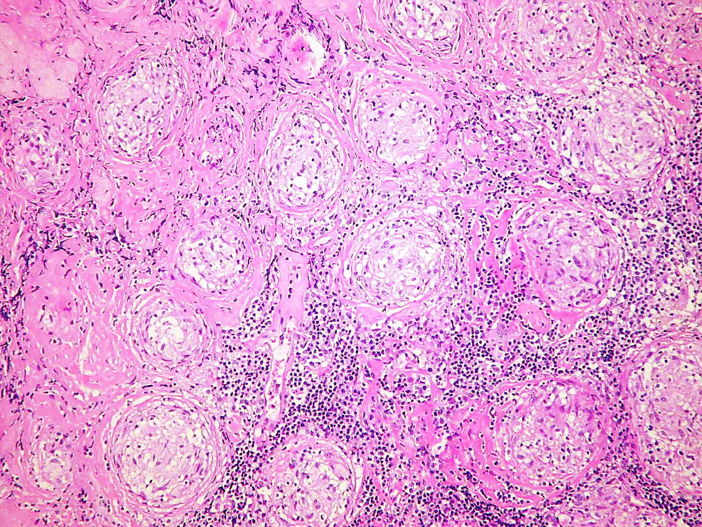

Pulmonary granuloma in sarcoidosis

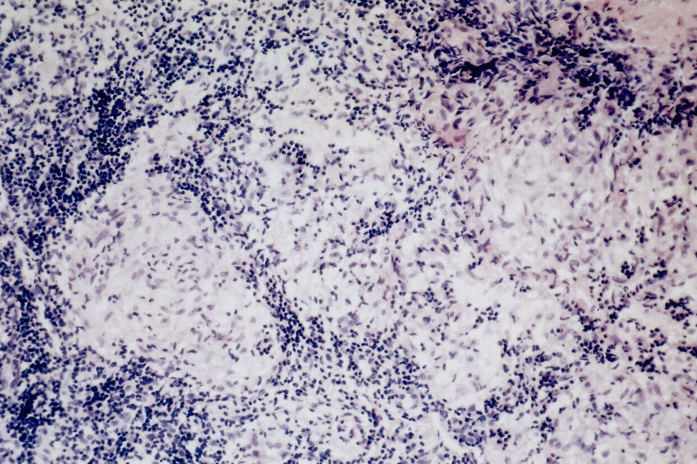

Noncaseating granuloma in sarcoidosis

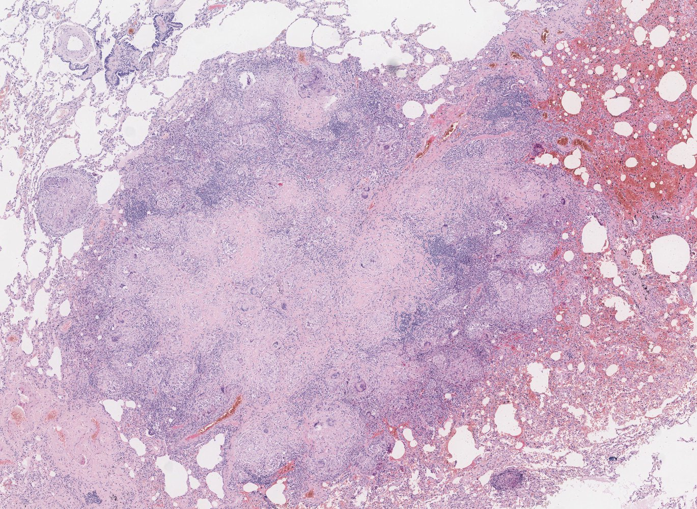

Pulmonary sarcoidosis

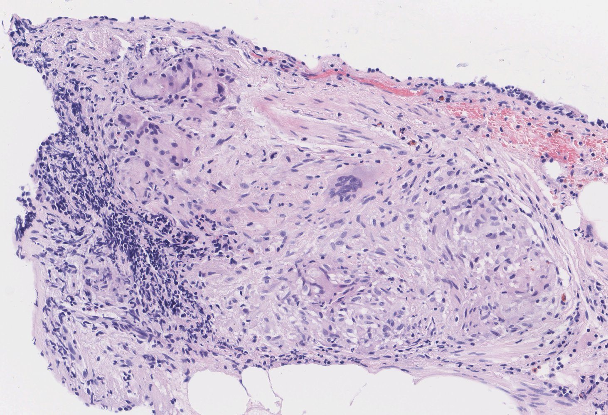

Multinucleated giant cells in pulmonary sarcoidosis

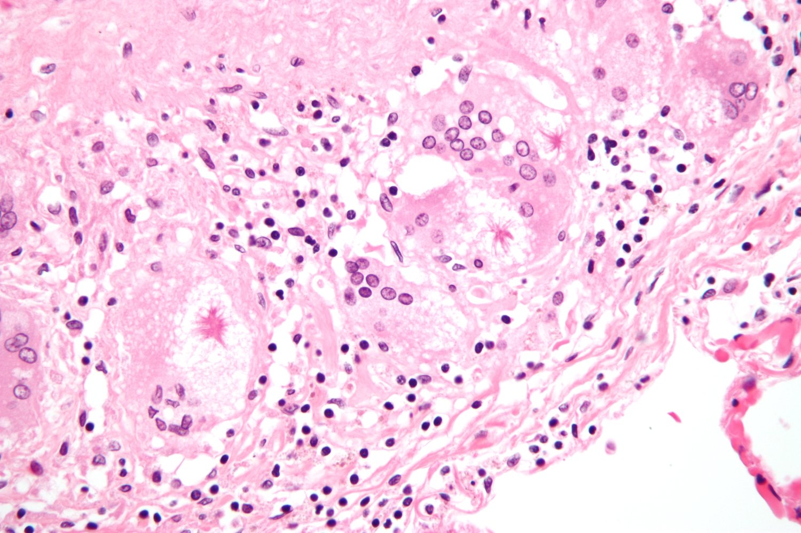

Asteroid bodies in pulmonary sarcoidosis

---

## Differential diagnoses

### Differential diagnosis of granulomatous disease

|  <u>Overview of granulomatous diseases</u> [[13]](https://coursology-qbank.com/amboss/article/tZaXWQ)[[14]](https://coursology-qbank.com/amboss/article/7OY4F6)  |  |  |  |  |
| --- | --- | --- | --- | --- |
|  | <u>Risk factors</u>/<u>prevalence</u> | Clinical features | <u>Lung</u> <u>biopsy</u> | Other laboratory findings |
| Sarcoidosis |   * Highest in African American and Scandinavian populations  * 2–4 times higher in Black individuals than in non-Hispanic white individuals    |   * Dry <u>cough</u>, mild <u>rales</u>, <u>bilateral hilar lymphadenopathy</u>  * <u>Erythema nodosum</u>  * <u>Lupus pernio</u>  * <u>Uveitis</u>  * <u>Arthralgias</u> and/or <u>arthritis</u>    |   * <u>Noncaseating granulomas</u>  * <u>Giant cells</u>    |   * ↑ <u>CD4:CD8 ratio</u> in <u>bronchoalveolar lavage</u>  * ↑ serum <u>ACE</u> levels    |
| <u>Tuberculosis</u> (<u>TB</u>) |   * <u>Immunocompromise</u>  * Previous <u>TB</u> and/or recent <u>TB</u> exposure    |   * <u>Fever</u>, weight loss, and night sweats  * Productive <u>cough</u> that does not respond to conventional <u>antibiotic therapy</u>  * <u>Hemoptysis</u>    |   * <u>Acid-fast</u> <u>M. tuberculosis</u>  * <u>Caseating granulomas</u>  * <u>Langhans giant cells</u>, <u>epithelioid macrophages</u>, and <u>lymphocytes</u>    |  * <u>M. tuberculosis</u> or its <u>DNA</u>   |
| <u>Hodgkin lymphoma</u> |  * History of <u>infectious mononucleosis</u>   |   * <u>Alcohol</u>-induced <u>pain</u>  * <u>Pel-Ebstein fever</u>  * <u>Pruritus</u>    |   * <u>Noncaseating granulomas</u>  * <u>Reed-Sternberg cells</u>  * Inflammatory cell infiltrates (e.g., <u>eosinophils</u>, <u>fibroblasts</u>, <u>plasma cells</u>)    |  * Single or combined <u>cytopenias</u> (e.g., <u>anemia</u>, <u>leukopenia</u>, <u>thrombocytopenia</u>)   |
| <u>Non-Hodgkin lymphoma</u> |   * Infection (e.g., <u>EBV</u> or <u>Helicobacter pylori</u> infection)  * Cell damage (caused by toxic substances, <u>immunosuppressive drugs</u>, cytostatic therapy, radiation)    |   * Indolent <u>lymph node</u> enlargement  * <u>Splenomegaly</u>  * Evidence of <u>bone marrow suppression</u> (e.g., <u>pallor</u>, infections)  * Large abdominal mass (possible in <u>Burkitt lymphoma</u>)    |   * <u>Noncaseating granulomas</u> without <u>Reed-Sternberg cells</u>  * <u>B-lymphocytes</u> or <u>T-lymphocytes</u>  * Inflammatory cell infiltrates    |  * Single or combined <u>cytopenias</u>   |
| <u>Pneumoconiosis</u> |  * Exposure to mineral dust (e.g., silica)   |   * Affected individuals are often asymptomatic and <u>physical examination</u> is unremarkable.  * In symptomatic patients  * Chronic, possibly productive <u>cough</u>  * Progressive <u>exertional dyspnea</u>  * <u>Auscultatory</u> findings (e.g., <u>rales</u>, <u>crackles</u>)  * <u>Signs of respiratory failure</u> (e.g., <u>digital clubbing</u>)    |   * Noncaseating <u>granulomas</u>  * Silica or <u>asbestos bodies</u>    |  * Positive <u>beryllium</u> <u>lymphocyte</u> <u>proliferation</u> test (BeLPT)   |
| <u>Granulomatosis with polyangiitis</u> |  * <u>Prevalence</u> in the US is highest among White individuals aged 65–74 years   |   * Chronic <u>rhinitis</u>  * <u>Sinusitis</u> with thick <u>purulent</u> bloody discharge  * Treatment-resistant <u>pneumonia</u>  * <u>Glomerulonephritis</u>    |  * Noncaseating <u>granulomas</u>   |  * Positive <u>cytoplasmic ANCA</u>   |
|  <u>Histoplasmosis</u> [[15]](https://coursology-qbank.com/amboss/article/FZagWQ)  |   * <u>AIDS</u>  * Exposure to bird or bat excrement    |  * Pulmonary (e.g., dry <u>cough</u>, oral <u>ulcers</u>) or extrapulmonary (e.g., <u>splenomegaly</u>) manifestations   |   * <u>Caseating granulomas</u>  * Identification of <u>H. capsulatum</u> <u>yeast</u> with <u>silver stain</u>    |  * Positive <u>polysaccharide</u> urine and serum <u>antigen</u> test   |

The differential diagnoses listed here are not exhaustive.

---

## Treatment

### General principles [[7]](https://coursology-qbank.com/amboss/article/HX1Kz20)[[10]](https://coursology-qbank.com/amboss/article/sX1tz20)

* Consult a pulmonologist and/or other specialists as required.

* Most patients with <u>pulmonary sarcoidosis</u> do not require <u>immunosuppressive therapy</u>.

* <u>Glucocorticoids</u> with/without <u>DMARDs</u> are indicated for patients with any of the following:

* Symptomatic progressive disease

* Persistent pulmonary infiltration

* Progressive decline of <u>lung function</u>

* <u>Organ transplantation</u> (e.g., <u>lung</u>, <u>heart</u>, <u>liver</u>) may be indicated in patients with severe, refractory disease.

### <u>Immunosuppressive therapy</u> [[10]](https://coursology-qbank.com/amboss/article/sX1tz20)[[12]](https://coursology-qbank.com/amboss/article/1w123Q0)

* First-line: <u>glucocorticoids</u>, e.g., <u>prednisone</u> DOSAGE [[11]](https://coursology-qbank.com/amboss/article/mD1VUQ0)[[12]](https://coursology-qbank.com/amboss/article/1w123Q0)

* If no response or adverse effects to <u>glucocorticoids</u>: <u>DMARDs</u> may be added.

* <u>Methotrexate</u> (preferred choice) or <u>azathioprine</u> (alone or with <u>glucocorticoids</u>)

* <u>Chloroquine</u> or <u>hydroxychloroquine</u>  [[11]](https://coursology-qbank.com/amboss/article/mD1VUQ0)

* <u>Biologics</u> (e.g., <u>TNF-alpha inhibitors</u>)  [[11]](https://coursology-qbank.com/amboss/article/mD1VUQ0)

### Supportive therapy [[11]](https://coursology-qbank.com/amboss/article/mD1VUQ0)

* <u>Prevent complications of glucocorticoid therapy</u> and <u>adverse effects of immunosuppressants</u>.

* Provide individualized <u>supportive care</u> (e.g., <u>NSAIDs</u> for <u>pain</u> relief, <u>noninvasive ventilation</u>, <u>supplemental oxygen</u>).

---

## Complications

* Individuals with sarcoidosis have an increased risk of <u>malignancy</u> (especially <u>lung cancer</u> and malignant <u>lymphomas</u>).

* Pulmonary complications 

* <u>Bronchiectasis</u>

* <u>Pulmonary hypertension</u> (<u>PH</u>) due to <u>pulmonary fibrosis</u>

* <u>Aspergilloma</u>

* <u>Chronic renal failure</u>  (see “Clinical features” above)

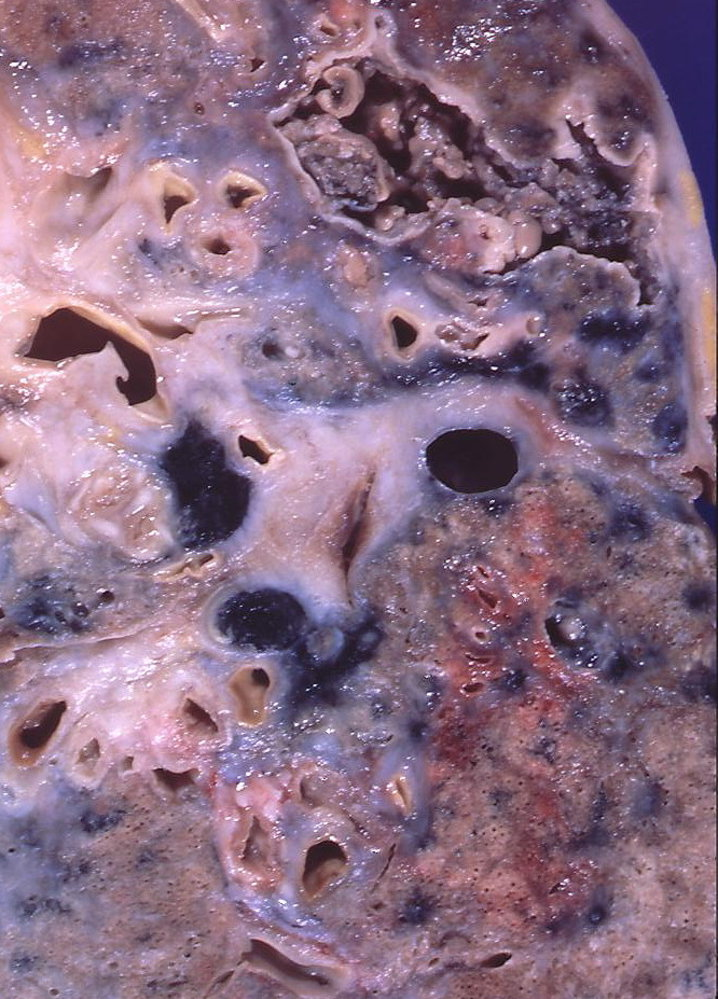

Pulmonary aspergilloma in sarcoidosis

We list the most important complications. The selection is not exhaustive.

---

## Prognosis

* Increased <u>calcium</u> indicates renal involvement with the risk of <u>chronic renal failure</u>.

* Remission rate according to staging [[16]](https://coursology-qbank.com/amboss/article/cTXapx)

* Stage I: approx. 70%

* Stage II: approx. 50%

* Stage III: approx. 20%

* Stage IV: <u>Life expectancy</u> is limited because of severely impaired <u>lung function</u>.

---