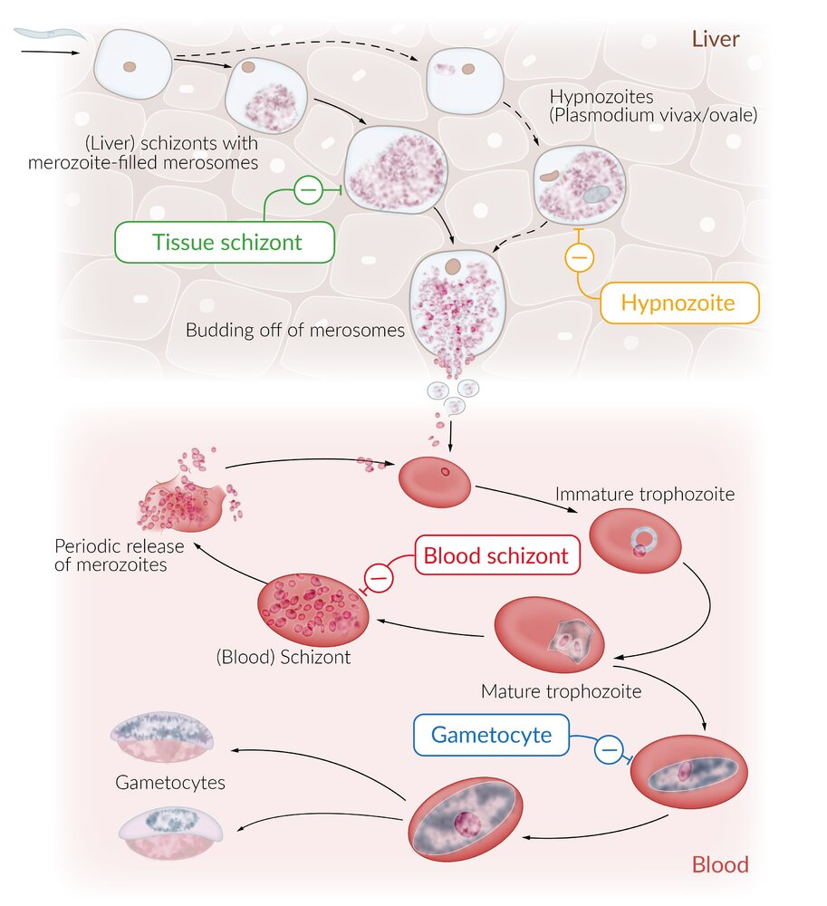
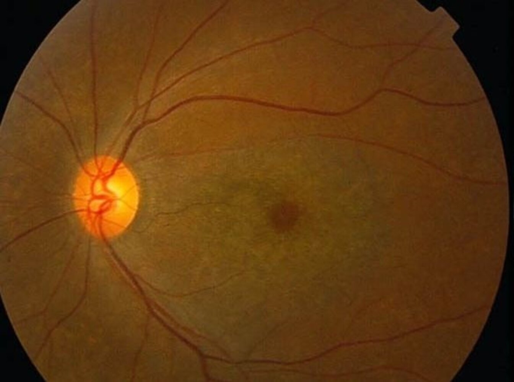

# Chloroquine and hydroxychloroquine

*Categories: Clinical knowledge > Internal medicine > Rheumatology and immunology > Relevant pharmacology > Chloroquine and hydroxychloroquine*

[Original Article Link](https://coursology-qbank.com/amboss/article/8M0Oqg)

---

## Summary

<u>Chloroquine</u> and <u>hydroxychloroquine</u> are drugs derived from the quinoline molecule. Both are used as <u>antimalarial</u> blood schizonticides, and <u>hydroxychloroquine</u> is also frequently used as an antirheumatic. Their mechanism of action is not entirely understood. Despite their varying therapeutic dosage and toxicity, both drugs have similar clinical indications and side effects. One of their most serious side effects is retinal toxicity, referred to as 4AQ <u>retinopathy</u> or <u>chloroquine retinopathy</u>, which must be screened for in all cases of long-term use.

---

## Pharmacodynamics

The precise mechanisms of action are unknown, but the following are the most widely accepted hypotheses:

* <u>Antimalarial</u> action: drug accumulation in the <u>parasite</u>'s food <u>vacuole</u>:   → inhibition of <u>heme</u> polymerization (and thus, detoxification) into hemozoin and formation of highly toxic <u>heme</u>-<u>chloroquine</u> complexes → lysis of membranes and <u>death</u> of the <u>parasites</u> [[1]](https://coursology-qbank.com/amboss/article/ANaRdO)

* Antirheumatoid action: interference with <u>antigen</u> processing in <u>macrophages</u> and other <u>APCs</u> → ↓ formation of <u>peptide</u>-<u>MHC</u> protein complexes → ↓ immune response against autoantigenic <u>peptides</u>  [[2]](https://coursology-qbank.com/amboss/article/_Na5dO)

Targets of antimalarial drugs

---

## Adverse effects

* Gastrointestinal [[3]](https://coursology-qbank.com/amboss/article/zNardO)[[4]](https://coursology-qbank.com/amboss/article/-NaDdO)

* <u>Nausea</u> with cramps (most common)

* <u>Anorexia</u>

* <u>Vomiting</u>

* Visual disturbances

* Irreversible bilateral <u>retinopathy</u>: key fundoscopic feature is <u>bull's eye maculopathy</u> and paracentral scotomata

* Blurred <u>vision</u>

* <u>Photophobia</u>

* Dermatologic

* <u>Pruritus</u> (most commonly seen in dark-skinned individuals ) [[5]](https://coursology-qbank.com/amboss/article/elbxDF)

* <u>Photosensitivity</u>

* <u>Alopecia</u>

* Whitening of <u>hair</u>

* Neurologic

* Myasthenia-like <u>muscle weakness</u>

* <u>Sensorineural deafness</u>

* <u>Tinnitus</u>

* <u>Cranial nerve palsies</u>

* Cardiac: <u>torsades de pointes</u> (due to possible <u>QT prolongation</u>), can cause sudden <u>death</u> [[6]](https://coursology-qbank.com/amboss/article/IMbYJ8)

* Hematologic: e.g., <u>thrombocytopenia</u>, <u>leukopenia</u>

* Worsening of preexisting conditions: <u>epilepsy</u>, <u>psoriasis</u>, <u>porphyria</u>, and preexisting retinal damage

> [!TIP]
> Patients using long-term <u>chloroquine</u>/<u>hydroxychloroquine</u> should have regular ophthalmological examinations.

We list the most important adverse effects. The selection is not exhaustive.

---

## Chloroquine maculopathy

* Definition: a type of toxic <u>retinopathy</u> caused by long-term <u>chloroquine</u> and <u>hydroxychloroquine</u> use

* Pathogenesis: long-term <u>chloroquine</u> and <u>hydroxychloroquine</u> use ; (<u>threshold dose</u> ∼ 300 mg/d) → irreversible changes in the <u>retinal pigment epithelium</u>; often bilateral

* Clinical features

* Decrease in <u>visual acuity</u>

* Impaired color perception

* Diagnostics

* <u>Ophthalmoscopy</u>: bull's eye maculopathy (annular changes of the <u>retinal pigment epithelium</u> with <u>hyperpigmentation</u> and <u>hypopigmentation</u>)

* Fluorescence <u>angiography</u>: central hyperfluorescence

* Differential diagnosis: In advanced stage, symptoms are similar to those of <u>retinitis pigmentosa</u>.

Chloroquine maculopathy

---

## Indications

* <u>Malaria</u>

* Treatment and prophylaxis of <u>malaria</u> due to <u>Plasmodium malariae</u>, <u>P. ovale</u>, or <u>P. vivax</u>

* Strains of <u>P. falciparum</u> are usually resistant

* See “Treatment” in “<u>Malaria</u>”

* Rheumatic diseases: used in mild courses

* <u>Rheumatoid arthritis</u> (basic therapy)

* <u>Systemic lupus erythematosus</u> and <u>discoid lupus erythematosus</u> (without organ involvement)

* <u>Porphyria cutanea tarda</u> (in low doses)

---

## Mechanism of resistance

* Attributed to the development of membrane efflux pumps, which decrease the intracellular concentration of the drug.

* Occurs especially in <u>P. falciparum</u>

---