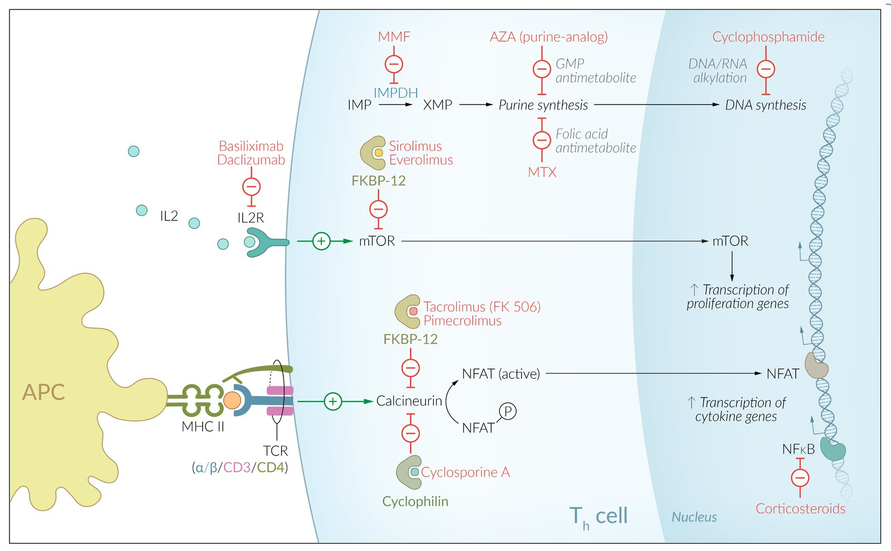
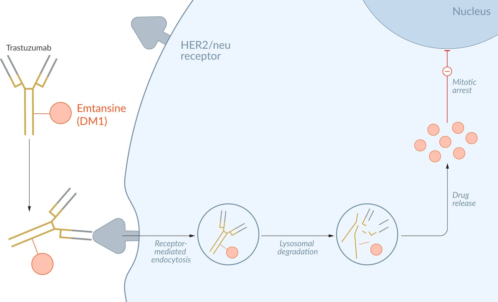

# Immunosuppressants

*Categories: Clinical knowledge > Internal medicine > Rheumatology and immunology > Relevant pharmacology > Immunosuppressants*

[Original Article Link](https://coursology-qbank.com/amboss/article/qM0Cpg)

---

## Summary

Immunosuppressants use heterogeneous mechanisms of action to suppress the body's cell-mediated and <u>humoral immune response</u>. They may be used as <u>transplant rejection</u> prophylaxis or to treat autoimmune disorders such as <u>lupus</u>, <u>psoriasis</u>, and <u>rheumatoid arthritis</u>. Commonly used immunosuppressants include <u>cyclosporine A</u>, <u>tacrolimus</u>, <u>glucocorticoids</u>, <u>methotrexate</u>, and <u>biological agents</u> (e.g., <u>rituximab</u>). A common side effect of immunosuppressants is an increased susceptibility to infection and <u>malignancy</u>.

<u>Glucocorticoids</u> are discussed in detail in another article.

Mechanism of action: immunosuppressants

---

## Overview

* Immunosuppressants are a heterogeneous class of drugs used to suppress the body's cell-mediated and <u>humoral immune response</u> via <u>lymphocyte</u> inhibition.

* The most common indications include <u>transplant rejection</u> prophylaxis and the treatment of autoimmune disorders such as <u>lupus</u>, <u>psoriasis</u>, and <u>rheumatoid arthritis</u>.

* It is common practice to use a combination of different <u>immunosuppressive</u> drugs to maximize their <u>immunosuppressive</u> effect and minimize their side effects.

* A common side effect of long-term immunosuppressants use is an increased susceptibility to infection and <u>malignancy</u>.

|  Overview of immunosuppressants   |  |  |  |  |  |  |  |  |  |  |  |
| --- | --- | --- | --- | --- | --- | --- | --- | --- | --- | --- | --- |
| Immunosuppressant class | Common drugs |  |  | Mechanism of action | Suppression of <u>cell-mediated immune response</u> | Suppression of <u>humoral immune response</u> | Indications | Adverse effects |  |  |  |
| <u>Glucocorticoids</u> |  <u>Prednisolone</u>, <u>hydrocortisone</u>, <u>dexamethasone</u>  |  |  |   * Inhibition of intracellular <u>NF-κB</u> → inhibition of multiple inflammatory and immune mediators (e.g., <u>cytokines</u>) → suppression of <u>B cells</u> and <u>T cells</u> function  * Acute effect (occurs within minutes) → While the mechanism is not entirely clear, a membrane stabilizing effect is hypothesized.  * Long-term effects (in hours) → direct influence on <u>gene expression</u>  * Increased <u>T-cell</u> <u>apoptosis</u>    |  * ✓   |  * ✓   |   * <u>Transplant rejection</u> prophylaxis  * To suppress various inflammatory and autoimmune reactions  * <u>Atopy</u> and <u>asthma</u>  * <u>Adrenal insufficiency</u>  * Part of the regimen for the treatment of:  * <u>CLL</u>  * <u>Non-Hodgkin</u> <u>lymphoma</u>    |  * See “<u>Side effects of glucocorticoid therapy</u>” for details.   |  |  |  |
|  Calcineurin inhibitors (calcineurin = <u>calcium</u>- and <u>calmodulin</u>-dependent <u>serine</u>-<u>threonine</u> <u>phosphatase</u>)   | Cyclosporine A |  |  |   * <u>Immunosuppression</u>: binding of <u>cyclophilin</u> → inhibition of <u>calcineurin</u> → inhibition of <u>NFAT</u> activation → ↓ <u>IL-2</u> <u>transcription</u> → ↓ activation of <u>T cells</u>  * Cytostatic action: binding to multidrug resistance glycoprotein P-170    |  * ✓   |  * –   |   * <u>Transplant rejection</u> prophylaxis (in combination with other immunosuppressants)  * <u>Psoriasis</u>  * <u>Rheumatoid arthritis</u>    |   * <u>Nephrotoxic</u>, <u>neurotoxic</u>  * Diabetogenic effects    |   * <u>Gingival hyperplasia</u>  * <u>Hypertrichosis</u> and <u>hirsutism</u>    |  |  |
|  Tacrolimus (also <u>FK-506</u> or <u>fujimycin</u>) |  |  |  * Binding to FK506 binding protein (<u>FKBP</u>) → inhibition of <u>calcineurin</u> → inhibition of <u>NFAT</u> activation → ↓ <u>IL-2</u> <u>transcription</u> → ↓ activation of <u>T cells</u>   |  * ✓   |  * –   |   * <u>Transplant rejection</u> prophylaxis for <u>solid organ transplants</u>  * <u>Psoriasis</u>    |  * <u>Hypertension</u>   |  |  |  |  |
| Pimecrolimus |  |  |  * <u>Atopic dermatitis</u> (topical use)   |  |  |  |  |  |  |  |  |
|  mTOR inhibitors  |  Sirolimus (also known as <u>rapamycin</u>) |  |  |  * Binding to <u>FKBP</u> → inhibition of mTOR <u>kinase</u> → inhibition of the <u>IL-2</u>-mediated cell cycle → ↓ response to <u>IL-2</u> → ↓ <u>T-cell</u> activation and <u>B-cell</u> differentiation → ↓ <u>IgM</u>, <u>IgG</u>, and <u>IgA</u> production   |  * ✓   |  * (✓)   |   * <u>Renal transplant</u> rejection prophylaxis  * As a synergistic immunosuppressant with <u>cyclosporine</u>  * Also used in drug-eluting <u>stents</u>    |  * <u>Pancytopenia</u>   |   * <u>Insulin resistance</u>  * <u>Hyperlipidemia</u>    |  |  |
|  Everolimus [[1]](https://coursology-qbank.com/amboss/article/VmaGeO) |  |  |  * Rejection prophylaxis in <u>liver</u> and <u>renal transplant</u> (in combination with other immunosuppressants)   |  |  |  |  |  |  |  |  |
| <u>Purine analog</u> |  Azathioprine (<u>mercaptopurine</u>) |  |  |   * <u>Purine analog</u> (<u>antimetabolite</u> precursor of 6-mercaptopurine ) → ↓ <u>nucleotide</u> synthesis → ↓ <u>proliferation</u> of <u>lymphocytes</u>  * Cytostatic effect at a high dosage via inhibition of cell <u>proliferation</u>  * <u>Immunosuppressive</u> effect at a low dosage with significant inhibition of <u>lymphocyte</u> <u>proliferation</u>    |  * ✓   |  * (✓)   |   * Prophylaxis against <u>renal transplant</u> rejection  * Autoimmune disease treatment (e.g., <u>rheumatoid arthritis</u>, <u>Crohn disease</u>, <u>glomerulonephritis</u>)  * To wean patients off long-term <u>steroid</u> therapy  * <u>Steroid</u>-refractory disease    |   * <u>Hepatotoxicity</u>  * Malignancies  * <u>Pancytopenia</u> and following <u>immunosuppression</u> mainly occurs when MP is administered with <u>xanthine oxidase inhibitors</u> (e.g., <u>allopurinol</u>)  [[2]](https://coursology-qbank.com/amboss/article/Ql1u9S0)    |  |  |  |
|  IMDH/IMPDH inhibitors  |  Mycophenolate mofetil  |  |  |  * Reversible inhibition of inosine monophosphate dehydrogenase → blockade of <u>purine</u> synthesis → selective inhibition of <u>lymphocyte</u> <u>proliferation</u>   |  * ✓   |  * ✓   |   * <u>Lupus nephritis</u>  * Used in combination with <u>cyclosporin</u> or <u>tacrolimus</u> as <u>transplant rejection</u> prophylaxis  * Rheumatic diseases (<u>glucocorticoid</u> sparing)    |   * Infection (especially with <u>CMV</u>)  * <u>Vomiting</u> and <u>diarrhea</u>  * <u>Hyperglycemia</u>  * <u>Hypertension</u>    |  |  |  |
| Other cytostatic and antiproliferative agents |  <u>Methotrexate</u> [[3]](https://coursology-qbank.com/amboss/article/emaxeO) |  |  |  * <u>Folic acid</u> <u>antagonist</u> (<u>antimetabolite</u>) : inhibition of <u>dihydrofolate reductase</u> (<u>DHFR</u>) → ↓ <u>pyrimidine</u> and <u>purine</u> <u>nucleotide</u> synthesis → ↓ <u>DNA</u> synthesis   |  * ✓   |  * ✓   |   * Treatment of severe <u>psoriasis</u> and <u>rheumatoid arthritis</u>  * In <u>neoplastic</u> diseases like <u>gestational choriocarcinoma</u>, chorioadenoma, and <u>hydatidiform mole</u>    |   * <u>Mucositis</u>  * <u>Hepatotoxicity</u>, <u>nephrotoxicity</u>  * Gastrointestinal side effects    |  |  |  |
| <u>Cyclophosphamide</u> |  |  |  * <u>Alkylating agent</u>: alkylation of <u>DNA</u>/<u>RNA</u> → cross-linking and strand breaks → impaired <u>DNA synthesis</u>   |  * (✓)   |  * ✓   |  * Autoimmune disease therapy (e.g., <u>SLE</u>, <u>autoimmune hemolytic anemias</u>)   |   * <u>SIADH</u>  * <u>Hemorrhagic cystitis</u>    |  |  |  |  |
|  Protein drugs  |  <u>Antibodies</u>   |  |  |  * Specific binding to relevant structure in the immune cascade (detailed explanation below)   |  * ✓   |  * ✓   |  * See “<u>Overview of biologics</u>” below for details.   |  |  |  |  |
| Other biological <u>proteins</u>   |  |  |  |  |  |  |  |  |  |  |  |
| ✓ = Definite suppression (✓) = Probable suppression (inconclusive research currently) – = No suppression |  |  |  |  |  |  |  |  |  |  |  |

Mechanism of action: immunosuppressants

Antibody-drug-conjugates

---

## Biological agents used in immunotherapy

* <u>Biological agents</u> are recombinant <u>proteins</u> that intervene in immunological processes.

* Used in autoimmune diseases and malignancies

* Although complex and costly, they can significantly improve the success of treatment in some cases.

* The naming of <u>antibodies</u> follows a certain classification scheme:

* The suffix "-mab": indicates "<u>monoclonal antibody</u>."

* Second to last syllable: describes the origin (e.g., "xi"=chimeric, "u"=human)

* Third to last syllable: denotes the target (e.g., li(m)=immune system)

| Overview of biologics |  |  |  |  |  |  |
| --- | --- | --- | --- | --- | --- | --- |
| <u>Antibody</u> | Type |  | Target | Indication | Adverse effects |  |
| Infliximab |  * Anti-TNF-α antibodies   |  * <u>Chimeric</u> <u>anti-TNF-α</u> <u>monoclonal antibody</u>   |  * TNF-α inhibition   |  * Refractory-therapy for chronic inflammatory systemic diseases  * <u>Rheumatoid arthritis</u>  * <u>Ankylosing spondylitis</u>  * <u>Psoriasis</u>, <u>psoriatic arthritis</u>  * <u>Crohn disease</u>, <u>ulcerative colitis</u> (except for <u>etanercept</u>, which is not effective in the treatment of <u>inflammatory bowel disease</u>)   |  * General side effects, including:  * Formation of anti-drug <u>antibodies</u>  * <u>Flu-like symptoms</u>, infections (e.g., <u>nasopharyngitis</u>)  * ↑ <u>ALT</u>, ↑ <u>AST</u>  * <u>Rash</u>, dermatitis  * GI upset   |   * Severe infections  * Reactivation of prior infections (e.g., <u>latent TB</u>): Patients should be screened for <u>HBV</u>, <u>HCV</u>, <u>EBV</u>, <u>CMV</u>, <u>VZV</u>, and <u>M. tuberculosis</u> prior to treatment.  * <u>Drug-induced lupus</u>    |
| Adalimumab |  * Humanized <u>anti-TNF-α</u> <u>monoclonal antibody</u>   |  |  |  |  |  |
| Golimumab |  |  |  |  |  |  |
| Certolizumab |  |  |  |  |  |  |
| Etanercept |   * Fusion protein synthesized by recombinant <u>DNA</u>  * <u>Etanercept</u> is not a <u>monoclonal antibody</u> but a <u>decoy receptor</u> that binds to <u>TNF-α</u> and IgG1<u>Fc</u>    |  |  |  |  |  |
| Rituximab |  * <u>Chimeric</u>   |  |  * <u>CD20</u>   |   * <u>Rheumatoid arthritis</u>  * <u>Immune thrombocytopenic purpura</u> (<u>ITP</u>)  * <u>Thrombotic thrombocytopenic purpura</u> (<u>TTP</u>)  * <u>Multiple sclerosis</u>  * <u>Autoimmune hemolytic anemia</u> (<u>AIHA</u>)  * <u>B-cell</u> <u>non-Hodgkin lymphomas</u> (<u>NHL</u>): e.g., <u>chronic lymphocytic leukemia</u> (<u>CLL</u>)  * Symptomatic <u>Waldenstrom macroglobulinemia</u>    |   * Reactivation of a latent <u>JC virus infection</u> → <u>PML</u>  * Infusion reaction (due to release of <u>cytokines</u>) [[4]](https://coursology-qbank.com/amboss/article/il1J9S0)    |  |
| Natalizumab |  * Humanized   |  |  * Alpha-4 <u>integrin</u> (important for <u>WBC</u> adhesion and migration)   |   * Escalation therapy of <u>multiple sclerosis</u> (see “<u>Disease modifying therapy for MS</u>”)  * <u>Crohn disease</u>    |  |  |
| Cetuximab |  * <u>Chimeric</u>   |  |  * Epidermal growth factor receptor (<u>EGFR inhibitor</u>)   |   * <u>Colorectal cancer</u> (stage IV, wild-type <u>KRAS</u>)  * <u>Head and neck cancer</u>    |  * General side effects   |  |
| <u>Panitumumab</u> |  * Humanized   |  |  |  |  |  |
| Tocilizumab |  * Humanized   |  |  * <u>IL-6</u> <u>receptor</u>   |   * <u>Giant cell arteritis</u>  * <u>Juvenile idiopathic arthritis</u>  * <u>Rheumatoid arthritis</u>  * <u>Severe COVID-19</u>    |  |  |
| <u>Palivizumab</u> |  * Humanized   |  |  * <u>RSV</u> F protein   |  * <u>RSV prophylaxis</u> for <u>infants</u> in the high-risk groups (see “<u>Prevention of RSV</u>”)   |  |  |
| <u>Secukinumab</u> |  * Human   |  |  * IL-17A   |  * <u>Psoriasis</u>, <u>psoriatic arthritis</u>   |  |  |
| <u>Ixekizumab</u> |  * Humanized   |  |  |  |  |  |
| Brodalumab |  * Human   |  |  * IL-17R   |  * Treatment-refractory <u>psoriasis</u>   |  |  |
| Vedolizumab |  * Humanized   |  |  * α4β7 <u>integrin</u>   |   * <u>Crohn disease</u>  * <u>Ulcerative colitis</u>    |  |  |
| Ustekinumab |  * Human   |  |  * <u>IL-12</u>, IL-23   |   * <u>Psoriasis</u>, <u>psoriatic arthritis</u>  * <u>Crohn disease</u>    |  |  |
| Omalizumab |  * Humanized   |  |  * Unbound serum <u>IgE</u> (prevents binding to FcεRI)   |  * Severe persistent <u>allergic asthma</u> (resistant to <u>inhaled steroids</u> and <u>LABAs</u>) with ↑ <u>IgE</u>   |   * <u>Arthralgia</u>  * Fatigue, <u>dizziness</u>  * <u>Pruritus</u>, dermatitis    |  |
| <u>Abciximab</u> |  * <u>Chimeric</u>   |  |  * <u>Antagonist</u> of GP IIb/IIIa <u>receptors</u>   |  * <u>Antiplatelet agent</u>, especially for patients undergoing <u>percutaneous coronary intervention</u> (see “<u>Glycoprotein IIb/IIIa inhibitors</u>”)   |   * Acute <u>thrombocytopenia</u>  * Hemorrhage    |  |
| Muromonab-CD3 |  * Mouse <u>antibody</u>   |  |  * <u>CD3</u> from <u>T cells</u>   |  * <u>Steroid</u>-resistant <u>acute rejection</u> post <u>transplantation</u>   |  * <u>Cytokine storm</u>   |  |
| Basiliximab |  * <u>Chimeric</u>   |  |  * <u>Alpha chain</u> (<u>CD25</u> <u>antigen</u>) of the <u>IL-2</u> <u>receptor</u> of <u>T cells</u>   |   * Escalation therapy of <u>multiple sclerosis</u>  * Formerly used for the prevention of <u>kidney</u> rejection post <u>transplantation</u> (in combination with <u>cyclosporine</u> and <u>glucocorticoids</u>)    |   * <u>Tremor</u>  * <u>Hypertension</u>  * <u>Edema</u>    |  |
| Daclizumab |  * Humanized   |  |  |  |  |  |
| <u>Trastuzumab</u> |  * Humanized   |  |   * <u>c-erbB2</u> (<u>HER2/neu</u>), a <u>tyrosine kinase receptor</u>  * Inhibits <u>ERBB2</u>-initiated cellular signaling and <u>antibody</u>-dependent cytotoxicity    |   * <u>ERBB2</u>+ <u>breast cancer</u>  * <u>ERBB2</u>+ <u>gastric cancer</u>    |  * <u>Dilated cardiomyopathy</u> (reversible in most cases)   |  |
| Bevacizumab |  * Humanized   |  |  * <u>VEGF</u> (inhibits <u>angiogenesis</u>)   |   * Neovascular (wet) age-related <u>macular degeneration</u> (<u>off-label</u> use in the US), <u>macular edema</u>  * <u>Proliferative diabetic retinopathy</u>  * Solid tumors  * Non-small cell <u>lung cancer</u>  * <u>Colorectal cancer</u>  * <u>Renal cell carcinoma</u>    |   * Hemorrhages, <u>GI bleeding</u>  * <u>Wound healing</u> complications  * <u>Thrombosis</u>    |  |
| Eculizumab |  * Humanized   |  |  * <u>Complement protein</u> C5   |   * <u>Paroxysmal nocturnal hemoglobinuria</u>  * <u>Hemolytic uremic syndrome</u>    |  * ↑ Risk of infection with <u>encapsulated bacteria</u> (e.g., <u>N. meningitidis</u>)   |  |
| <u>Denosumab</u> |  * Human   |  |  * <u>RANKL</u>   |  * <u>Osteoporosis</u> (see “Treatment” in “<u>Osteoporosis</u>” for details)   |   * <u>Hypocalcemia</u>  * Rarely: <u>osteonecrosis of the jaw</u>    |  |
| Alemtuzumab |  * Humanized   |  |  * CD52   |   * Chronic lymphoid <u>leukemia</u> (<u>CLL</u>)  * Escalation therapy of <u>multiple sclerosis</u> (see “<u>Disease modifying therapy for MS</u>”)    |  * ↑ Risk of autoimmune conditions  * <u>Alemtuzumab</u>: <u>ITP</u>  * Others: endocrinopathies, <u>pneumonitis</u>, dermatitis   |  |
| Guselkumab |  * Human   |  |  * IL-23   |  * <u>Psoriasis</u>   |  |  |
|  * <u>CTLA-4</u>   |   * <u>Melanoma</u>  * <u>Lymphoma</u>  * <u>Lung cancer</u>  * <u>Renal cell carcinoma</u>, <u>urothelial carcinoma</u>, <u>prostate cancer</u>    |  |  |  |  |  |
| Ipilimumab |  * Immune checkpoint inhibitors   |  * Human   |  |  |  |  |
| <u>Pembrolizumab</u> |  * Humanized   |  * <u>PD-1</u>   |   * <u>Renal cell carcinoma</u>, <u>urothelial carcinoma</u>  * <u>NSCLC</u>  * <u>Melanoma</u>    |  |  |  |
| <u>Nivolumab</u> |  * Human   |  |  |  |  |  |
| Cemiplimab |  |  |  |  |  |  |
| Avelumab |  * <u>PD-L1</u>   |  |  |  |  |  |
| <u>Durvalumab</u> |  |  |  |  |  |  |
| Atezolizumab |  * Humanized   |  |  |  |  |  |

> [!NOTE]
> “BeVAcizumab Blocks VAsculature: <u>bevacizumab</u> inhibits <u>angiogenesis</u>”

> [!NOTE]
> For the most important indication (<u>breast</u> cancer) and the target <u>ERBB2</u> (<u>HER2</u>) of <u>trastuzumab</u>, think “Her two (<u>HER2</u>) <u>breasts</u> can be treated with trastwozumab.”

> [!NOTE]
> To remember the indication for <u>alemtuzumab</u>, think “ALYMtuzumab for chronic LYMphocytic <u>leukemia</u>.”

---

## Adverse effects

### <u>Calcineurin inhibitors</u>

* <u>Calcineurin inhibitors</u> become even more <u>neurotoxic</u> and <u>nephrotoxic</u> when combined; for this reason, they should never be coadministered.

* Because of their <u>neurotoxicity</u>, patients receiving higher doses and those who have decreased renal function should be closely monitored.

> [!NOTE]
> <u>Calcineurin inhibitors</u> frequently induce <u>endothelial</u> injury and arteriolar <u>vasoconstriction</u>, causing a variety of toxicities. [[5]](https://coursology-qbank.com/amboss/article/ufWpLk0)

#### <u>Cyclosporine A</u>

* <u>Nephrotoxicity</u>

* <u>Neurotoxicity</u>

* <u>Gingival hyperplasia</u>

* <u>Hypertrichosis</u> and <u>hirsutism</u>

* Diabetogenic effect (particularly after <u>organ transplantation</u>), which can lead to:

* <u>Hyperuricemia</u>

* <u>Hyperlipidemia</u>

* <u>Elevated liver enzymes</u>

* Increase in malignancies and infectious diseases (e.g., increase in the risk of <u>squamous cell carcinoma</u> by 50% in patients who are on simultaneous treatment with <u>PUVA</u> during <u>psoriasis treatment</u>)

* <u>Hypertension</u>

* <u>Hyperkalemia</u>

* <u>Tremors</u>

* <u>Nausea</u> and <u>diarrhea</u>

#### <u>Tacrolimus</u> (<u>FK506</u>) [[6]](https://coursology-qbank.com/amboss/article/KAaUkM)

* <u>Nephrotoxicity</u>: monitor for <u>oliguria</u>

* <u>Neurotoxicity</u> (more severe compared to <u>cyclosporin</u>)

* <u>Hypertension</u>

* Diabetogenic effect (more severe compared to <u>cyclosporin A</u>) ;  [[7]](https://coursology-qbank.com/amboss/article/vMXAqA)

* <u>Hyperglycemia</u>

* <u>Hyperuricemia</u>

* <u>Hyperlipidemia</u>

* <u>Elevated liver enzymes</u>

* <u>Hair</u> loss

* <u>Headache</u>

* <u>Nausea</u> and <u>diarrhea</u>

* <u>Insomnia</u>

* Abdominal discomfort

* <u>Hyperkalemia</u>

* <u>Hypophosphatemia</u>

* <u>Hypomagnesemia</u>

> [!TIP]
> Many side effects of <u>tacrolimus</u> are similar to <u>cyclosporine A</u>, but <u>tacrolimus</u> does not cause <u>gingival hyperplasia</u> or <u>hypertrichosis</u>.

> [!WARNING]
> Both <u>calcineurin inhibitors</u> (<u>cyclosporine A</u> and <u>tacrolimus</u>) are highly <u>nephrotoxic</u>. They become even more <u>nephrotoxic</u> when combined and should, therefore, never be administered concurrently!

### <u>Purine analogs</u> (<u>azathioprine</u>, <u>mercaptopurine</u>) [[8]](https://coursology-qbank.com/amboss/article/6AajkM)

* <u>Pancytopenia</u>;  (<u>leukopenia</u>, <u>macrocytic anemia</u>, <u>thrombocytopenia</u>): exacerbated by interaction with <u>allopurinol</u>, since it inhibits <u>xanthine oxidase</u>, which is responsible for the degradation of <u>6-mercaptopurine</u>

* <u>Hepatotoxicity</u>

* Malignancies, including <u>cervical cancer</u>, <u>lymphoma</u>, <u>squamous cell carcinoma</u>, <u>melanoma</u> (rare)

* <u>Nausea</u>, <u>vomiting</u>, and dose-related <u>diarrhea</u>

* <u>Acute pancreatitis</u>

> [!NOTE]
> To remember that Azathioprine is the precursor of 6-mercapto<u>purine</u>, think “Azathio<u>purine</u>.”

> [!WARNING]
> <u>Allopurinol</u> causes toxic accumulation of <u>azathioprine</u>! In cases in which concomitant treatment is unavoidable, a dose reduction of <u>azathioprine</u> is necessary!

### <u>mTOR inhibitors</u> (<u>sirolimus</u>, <u>everolimus</u>) [[9]](https://coursology-qbank.com/amboss/article/pAaLkM)[[10]](https://coursology-qbank.com/amboss/article/JAaskM)

* <u>Pancytopenia</u>

* <u>Insulin resistance</u>

* <u>Hyperlipidemia</u>

* No <u>nephrotoxicity</u>

* Infection (e.g., respiratory or <u>urinary tract</u>)

* <u>Peripheral edema</u>

* <u>Hypertension</u>

* <u>Stomatitis</u>

> [!NOTE]
> To remember that sirolimus can cause pancytopenia, think “Sir, don't forget your pants!”

> [!TIP]
> In contrast to <u>calcineurin inhibitors</u>, <u>mTOR inhibitors</u> are not <u>nephrotoxic</u>.

### <u>Mycophenolate</u> mofetil [[11]](https://coursology-qbank.com/amboss/article/UmabUO)

* <u>Pancytopenia</u>

* Infection;  (e.g., respiratory or <u>urinary tract</u>), especially with <u>CMV</u>

* <u>Vomiting</u> and <u>diarrhea</u>

* <u>Hyperglycemia</u>

* <u>Hypertension</u>

* Comparatively low <u>neurotoxicity</u> and <u>nephrotoxicity</u>

* <u>Peripheral edema</u>

* ↑ <u>Blood urea nitrogen</u>

* <u>Hypercholesterolemia</u>

* <u>Back pain</u>

* <u>Cough</u>

### <u>Methotrexate</u> [[3]](https://coursology-qbank.com/amboss/article/emaxeO)

* <u>Bone marrow suppression</u>: <u>pancytopenia</u>  and/or <u>macrocytic anemia</u>

* <u>Mucositis</u> (particularly <u>stomatitis</u>, enteritis), susceptibility to infection

* <u>Hepatotoxicity</u>

* <u>Nephrotoxicity</u>

* Gastrointestinal side effects (e.g., <u>nausea and vomiting</u>)

* <u>Diarrhea</u>

* <u>Pulmonary fibrosis</u> and toxicity

* <u>Rash</u>

* <u>Hair</u> loss

* Increased risk of <u>lymphoproliferative disorders</u>

* <u>Teratogenicity</u>

#### Leucovorin salvage therapy [[12]](https://coursology-qbank.com/amboss/article/2maTUO)

* The side effects of <u>methotrexate</u> can be reduced by administering <u>salvage therapy</u>.

* <u>Salvage therapy</u> involves the administration of <u>folic acid</u> and <u>folinic acid</u> (active <u>folic acid</u> = leucovorin = <u>calcium</u> folinate).

* Indications

* <u>Methotrexate</u> (<u>MTX</u>) intoxication (inadvertent overdosage or impaired elimination): administered every 6 hours until <u>methotrexate</u> level < 10 mol

* Prophylactic therapy: within 24–48 h of starting high dose <u>MTX</u>

### <u>Biologics</u> (e.g., <u>daclizumab</u>) [[13]](https://coursology-qbank.com/amboss/article/qAaCkM)

* General side effects

* <u>Rash</u>, dermatitis

* Formation of anti-drug <u>antibodies</u> (especially for <u>adalimumab</u> and <u>infliximab</u>): can manifest with a decrease in clinical response (e.g., recurrence of symptoms), low drug levels, and/or <u>allergic reactions</u>.

* <u>Flu-like</u> symptoms

* ↑ <u>ALT</u>, ↑ <u>AST</u>

* <u>Lymphadenopathy</u>

* Infections (e.g., <u>nasopharyngitis</u>)

* Gastrointestinal symptoms (e.g., <u>diarrhea</u>)

* <u>Leukocytosis</u> or <u>leukopenia</u>, <u>thrombocytopenia</u>, <u>anemia</u>

* <u>Depression</u>

* <u>Rituximab</u> and <u>natalizumab</u>: reactivation of a latent <u>JC virus infection</u>, resulting in <u>progressive multifocal leukoencephalopathy</u> (<u>PML</u>)

* <u>Basiliximab</u>

* <u>Tremor</u>, shaking

* <u>Hypertension</u>

* <u>Edema</u>

* <u>Allergic reaction</u>

* <u>Nausea</u>, <u>vomiting</u>

* <u>Cetuximab</u> and <u>panitumumab</u>: : general side effects (especially <u>rash</u>, <u>diarrhea</u>, ↑ <u>ALT</u>, ↑ <u>AST</u>)

* <u>Bevacizumab</u>

* <u>Gastrointestinal perforation</u>

* Hemorrhages (e.g., <u>GI bleeding</u>)

* <u>Wound healing</u> complications

* <u>Thrombosis</u>

* <u>Trastuzumab</u>: <u>dilated cardiomyopathy</u> (reversible in most cases)

* <u>TNF-α inhibitors</u>

* Infections

* Reactivation of prior infections (e.g., <u>latent TB</u>)

* <u>Drug-induced lupus</u>

* <u>Alemtuzumab</u>: ↑ risk of developing autoimmune conditions (e.g., <u>ITP</u>) and infections

* <u>Nivolumab</u>, <u>pembrolizumab</u>, and cemiplimab: ↑ risk of developing autoimmune conditions, including:

* Endocrinopathies

* <u>Pneumonitis</u>

* Dermatitis

* Enterocolitis

* <u>Hepatitis</u>

* <u>Avelumab</u>, <u>durvalumab</u>, and <u>atezolizumab</u>: same as above

* <u>Ipilimumab</u>: same as above

> [!TIP]
> Before initiating <u>anti-TNF-α</u> treatment, a test for <u>latent tuberculosis</u> should be performed.

> [!NOTE]
> To remember that <u>trastuzumab</u> causes <u>dilated cardiomyopathy</u>, think “If you trust trustuzumab, it might break your <u>heart</u>.”

#### Contraindications to anti-TNF-α treatment (<u>infliximab</u>, <u>adalimumab</u>, <u>etanercept</u>)

* <u>Pregnancy</u>

* Chronic infections, particularly <u>tuberculosis</u>: Rule out <u>latent tuberculosis</u> before starting therapy (the activity of <u>TNF-α</u> plays a major role in formation and stabilization of <u>granulomas</u> against <u>Mycobacterium tuberculosis</u>).

* <u>Multiple sclerosis</u>

* <u>Malignancy</u>

* <u>Immunosuppressed</u> individuals

* Systemic or localized infections

* Moderate to severe <u>heart failure</u> (<u>NYHA class</u> III/IV)

### <u>Glucocorticoids</u>

* For side effects of <u>glucocorticoids</u> see “<u>Side effects of glucocorticoid therapy</u>.”

We list the most important adverse effects. The selection is not exhaustive.

---