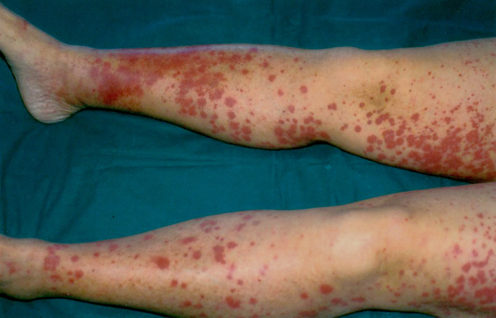
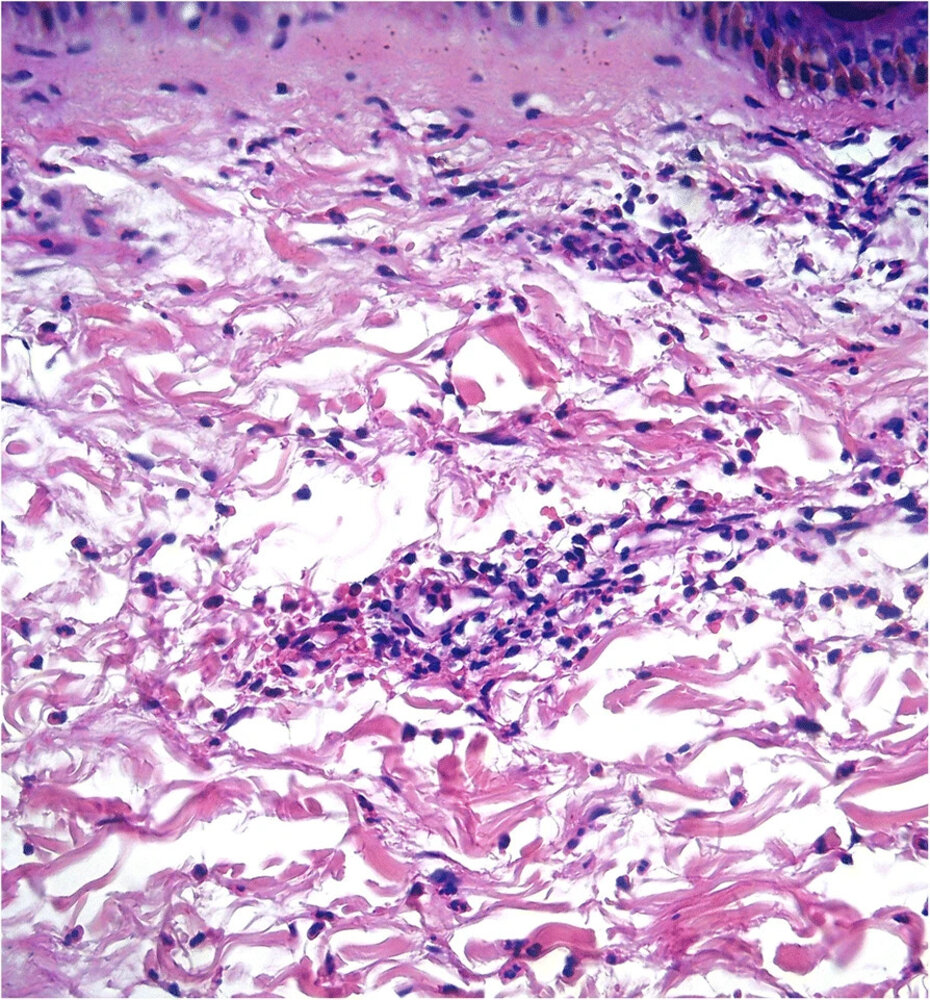
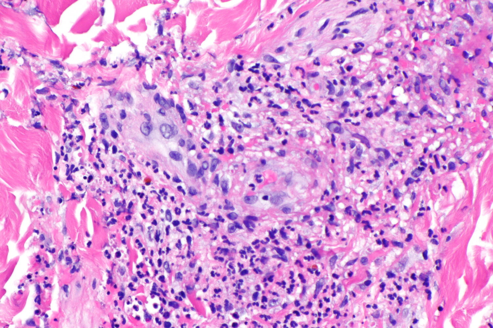

# Cryoglobulinemic vasculitis

*Categories: Clinical knowledge > Internal medicine > Rheumatology and immunology > Vasculitis > Cryoglobulinemic vasculitis*

[Original Article Link](https://coursology-qbank.com/amboss/article/yt0dT3)

---

## Summary

<u>Cryoglobulinemic</u> <u>vasculitis</u> is a type of <u>small-vessel vasculitis</u> characterized by the deposition of <u>cryoglobulins</u>. It is most commonly caused by type II and III <u>cryoglobulinemia</u>. Patients typically present with fatigue and other <u>constitutional symptoms</u>, along with palpable <u>purpura</u>, <u>arthralgia</u>, <u>myalgias</u>, and <u>glomerulonephritis</u>. Diagnosis is based on clinical features and laboratory findings, e.g., <u>cryoglobulinemia</u>; additional studies should be requested based on suspected organ involvement (e.g., <u>kidney biopsy</u>) and the underlying etiology (e.g., <u>hepatitis C diagnostics</u>). Management includes specific treatment of the underlying etiology (e.g., <u>direct-acting antivirals</u> for <u>HCV infection</u>), in addition to management of <u>cryoglobulinemic</u> <u>vasculitis</u>, which usually involves <u>immunosuppressive agents</u> (e.g., <u>glucocorticoids</u> plus <u>rituximab</u>) and is guided by disease severity. <u>Plasmapheresis</u> may also be considered in patients with life-threatening disease.

---

## Definitions

* Cryoglobulinemia

* A condition characterized by elevated serum <u>cryoglobulin</u> concentration

* Further classified as type I, II, or III based on <u>immunoglobulin</u> composition and clonality (i.e., <u>IgG</u>, <u>IgM</u>, or, rarely, <u>IgA</u>) [[2]](https://coursology-qbank.com/amboss/article/aZcQZa0)[[3]](https://coursology-qbank.com/amboss/article/YZcnZa0)

* <u>Cryoglobulinemic</u> <u>vasculitis</u>: a <u>vasculitis</u> caused by the deposition of temperature-dependent <u>IgG</u> and <u>IgM</u> <u>immunoglobulins</u>/<u>immune complexes</u> (i.e., <u>cryoglobulins</u>), with subsequent inflammation of surrounding tissue

---

## Etiology

<u>Cryoglobulinemia</u> can cause <u>cryoglobulinemic</u> <u>vasculitis</u>, however, many patients are asymptomatic. [[2]](https://coursology-qbank.com/amboss/article/aZcQZa0)[[3]](https://coursology-qbank.com/amboss/article/YZcnZa0)

* Type II and III <u>cryoglobulinemia</u> (i.e., mixed cryoglobulinemia): 90% of cases

* Viral infection: most common etiology (<u>HCV infection</u> in 70–90% of cases) [[4]](https://coursology-qbank.com/amboss/article/ggXFux)
* Formation of <u>hepatitis C</u> <u>IgG</u> and <u>IgM</u> <u>rheumatoid factor</u> → <u>immune complex</u> formation with <u>hepatitis C</u> <u>antigen</u> → <u>complement</u> activation and inflammation of <u>blood vessels</u>

* Other

* Autoimmune diseases (e.g., <u>Sjogren syndrome</u>, <u>SLE</u>, <u>rheumatoid arthritis</u>)

* <u>Lymphoproliferative disorders</u>

* <u>Idiopathic</u> (i.e., essential <u>mixed cryoglobulinemia</u>)

* <u>Type I cryoglobulinemia</u>: 10% of cases (e.g., in <u>multiple myeloma</u>, <u>CLL</u>)

> [!TIP]
> <u>Cryoglobulinemic</u> <u>vasculitis</u> is more commonly associated with type II and III <u>cryoglobulinemia</u> than with <u>type I cryoglobulinemia</u>. <u>Type I cryoglobulinemia</u> typically manifests as a <u>hyperviscosity syndrome</u>. [[2]](https://coursology-qbank.com/amboss/article/aZcQZa0)[[3]](https://coursology-qbank.com/amboss/article/YZcnZa0)

> [!NOTE]
> Cryoglobulinemia is caused by Cold-precipitable <u>immunoglobulins</u> and is commonly associated with the <u>hepatitis</u> C <u>virus</u>.

> [!TIP]
> Most patients with <u>cryoglobulinemia</u> are asymptomatic; the <u>prevalence</u> of symptomatic cases varies widely (2–50%) across different populations. [[2]](https://coursology-qbank.com/amboss/article/aZcQZa0)

---

## Clinical features

* Nonspecific systemic symptoms: fatigue; , <u>malaise</u>, <u>myalgia</u>, <u>arthralgia</u>  [[3]](https://coursology-qbank.com/amboss/article/YZcnZa0)

* Cutaneous lesions (nearly 100% of cases): palpable <u>purpura</u>, <u>ulceration</u>, <u>necrosis</u>

* <u>Vasomotor symptoms</u>: <u>Raynaud phenomenon</u>, <u>acrocyanosis</u>

* <u>Polyneuropathy</u>

* <u>Hepatosplenomegaly</u>

* <u>Glomerulonephritis</u> (severe cases or late complication)

> [!NOTE]
> The triad of <u>arthralgia</u>, palpable <u>purpura</u>, and fatigue is seen in ∼ 80% of patients with <u>cryoglobulinemic</u> <u>vasculitis</u>. [[3]](https://coursology-qbank.com/amboss/article/YZcnZa0)

Cryoglobulinemic vasculitis

---

## Diagnosis

### General principles [[2]](https://coursology-qbank.com/amboss/article/aZcQZa0)[[3]](https://coursology-qbank.com/amboss/article/YZcnZa0)

* Diagnosis is based on the presence of typical clinical features and laboratory findings.

* Additional diagnostics (e.g., <u>ANAs</u>, <u>CT scan</u>) should be requested based on the suspected underlying cause.

* A <u>biopsy</u> may be required to confirm organ involvement.

### <u>Laboratory studies</u>

* <u>Serology</u>

* <u>Cryoglobulinemia</u> (type II and/or III; rarely type I)  [[2]](https://coursology-qbank.com/amboss/article/aZcQZa0)[[3]](https://coursology-qbank.com/amboss/article/YZcnZa0)

* <u>Rheumatoid factor</u>: elevated in almost 100% of cases  [[3]](https://coursology-qbank.com/amboss/article/YZcnZa0)

* ↓ C4 (90% of cases)

* <u>Hepatitis C diagnostics</u>

* <u>Urinalysis</u>: : <u>microhematuria</u>, <u>proteinuria</u>, <u>erythrocyte casts</u>

### Cutaneous or <u>renal biopsy</u>

* Indications

* <u>Renal biopsy</u>: required in patients with suspected renal involvement

* <u>Skin biopsy</u>: may be helpful in patients with atypical presentations (but not necessary to make the diagnosis)

* Findings

* Inflammatory vascular changes (e.g., <u>leukocytoclastic vasculitis</u> )

* <u>Membranoproliferative glomerulonephritis type I</u> (70% of patients)

* <u>Cryoglobulin</u> deposits (; i.e., C3, <u>IgG</u> and <u>IgM</u> complexes) and <u>monocyte</u> infiltration may be detected in <u>glomeruli</u>.

> [!TIP]
> A <u>biopsy</u> should be performed in patients with suspected renal involvement.

Urticarial vasculitis

Leukocytoclastic vasculitis

---

## Treatment

### General principles [[2]](https://coursology-qbank.com/amboss/article/aZcQZa0)[[3]](https://coursology-qbank.com/amboss/article/YZcnZa0)[[5]](https://coursology-qbank.com/amboss/article/SgXyux)

* Consult rheumatology for all patients.

* Start specific therapy for the underlying etiology (e.g., direct-acting <u>antivirals for hepatitis C infection</u>).

* Management is guided by disease severity.

* Mild disease: symptomatic treatment; consider <u>immunosuppressants</u>

* Moderate to severe disease: <u>immunosuppressants</u>

* Life-threatening disease: <u>immunosuppressants</u> PLUS <u>plasmapheresis</u>

> [!WARNING]
> Patients with <u>rapidly progressive glomerulonephritis</u>, <u>CNS</u> involvement, GI <u>ischemia</u>, or alveolar hemorrhage should receive prompt treatment with a combination of <u>glucocorticoid</u> pulses, <u>rituximab</u>, and <u>plasmapheresis</u>. [[3]](https://coursology-qbank.com/amboss/article/YZcnZa0)[[5]](https://coursology-qbank.com/amboss/article/SgXyux)

### Pharmacotherapy

|  Recommended pharmacotherapy for <u>cryoglobulinemia</u> based on disease severity [[2]](https://coursology-qbank.com/amboss/article/aZcQZa0)[[3]](https://coursology-qbank.com/amboss/article/YZcnZa0)[[5]](https://coursology-qbank.com/amboss/article/SgXyux)  |  |  |
| --- | --- | --- |
| Disease severity | Definition | Management |
| Mild disease |   * Nonulcerating cutaneous lesions  * Articular disease  * Mild neuropathy  * <u>Glomerulonephritis</u> without <u>AKI</u>    |   * <u>Pain management</u> (e.g., with <u>NSAIDs</u>; see “<u>Treatment of pain</u>” for dosages)  * Consider low-dose oral <u>glucocorticoids</u> (e.g., <u>prednisone</u>) for patients with:  * Nonulcerating cutaneous lesions  * Refractory <u>arthritis</u>    |
| Moderate to severe disease |   * Cutaneous <u>ischemia</u> or <u>ulceration</u>  * Severe neuropathy  * <u>Glomerulonephritis</u> with <u>renal failure</u> and/or <u>nephrotic syndrome</u>  * GI disease    |   * High-dose <u>glucocorticoids</u> (e.g., <u>methylprednisolone</u> pulses followed by <u>prednisone</u>)  * PLUS <u>rituximab</u>    |
| Life-threatening disease |   * Multiple or extensive cutaneous <u>ulceration</u>  * <u>RPGN</u>  * <u>CNS</u> involvement  * GI <u>ischemia</u>  * Alveolar hemorrhage    |   * High-dose <u>glucocorticoids</u> (e.g., <u>methylprednisolone</u> pulses followed by <u>prednisone</u>)  * PLUS <u>rituximab</u> OR <u>cyclophosphamide</u>    |

### <u>Plasmapheresis</u> [[3]](https://coursology-qbank.com/amboss/article/YZcnZa0)[[5]](https://coursology-qbank.com/amboss/article/SgXyux)

* Requires urgent initiation for patients with severe or life-threatening disease

* Should always be given in combination with <u>immunosuppressants</u> (e.g., high-dose <u>glucocorticoids</u> plus either <u>cyclophosphamide</u> or <u>rituximab</u>)

* Rate: three exchanges per week for 2–3 weeks

> [!TIP]
> Patients receiving <u>plasmapheresis</u> to remove circulating <u>cryoglobulins</u> still always require treatment with immunosuppresants to prevent formation of new <u>cryoglobulins</u>.

### Management of the underlying cause  [[5]](https://coursology-qbank.com/amboss/article/SgXyux)

* <u>Hepatitis C infection</u>

* <u>Immunosuppressive therapy</u> (e.g., <u>glucocorticoids</u> plus <u>rituximab</u> or <u>cyclophosphamide</u>) is required before <u>antiviral therapy</u> in patients with severe disease.

* The presence of <u>cryoglobulinemia</u> does not affect the choice of <u>antiviral therapy</u>.

* <u>Hepatitis B</u> and <u>HIV infection</u>: concomitant <u>antiviral therapy</u> and <u>immunosuppressive therapy</u>

* <u>Lymphoproliferative disorders</u>: <u>chemotherapy</u>

### <u>Supportive care</u>

* <u>Prevent complications of glucocorticoid therapy</u>.

* Monitor for <u>adverse effects of immunosuppressants</u>.

* Consider <u>pneumocystis pneumonia prophylaxis</u>.

---