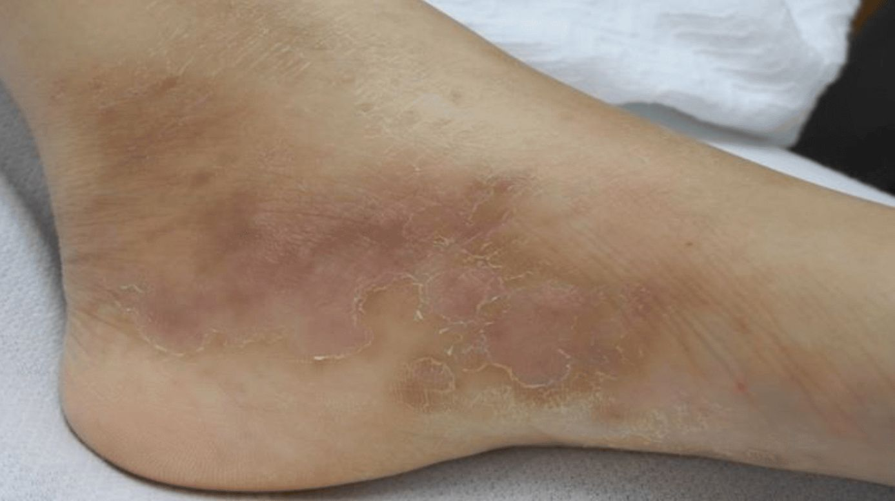

# Polyarteritis nodosa

*Categories: Clinical knowledge > Internal medicine > Rheumatology and immunology > Vasculitis > Polyarteritis nodosa*

[Original Article Link](https://coursology-qbank.com/amboss/article/ut0p23)

---

## Summary

Polyarteritis nodosa (PAN) is a systemic <u>vasculitis of medium-sized vessels</u> that most commonly affects the <u>skin</u>, <u>peripheral nerves</u>, muscles, <u>joints</u>, <u>gastrointestinal tract</u>, and <u>kidneys</u>, but usually spares the <u>lungs</u>. Most cases are <u>idiopathic</u>, but PAN is associated with certain viral infections, most commonly <u>hepatitis B virus (HBV) infection</u>. Patients typically present with <u>constitutional symptoms</u> (e.g., <u>fever</u>, weight loss, muscle and <u>joint</u> <u>pain</u>); additional symptoms vary based on the organ of involvement (e.g., <u>acute kidney injury</u>, <u>myocardial infarction</u>, <u>rash</u>). <u>ANCAs</u> and <u>cryoglobulins</u> are typically negative on <u>laboratory studies</u>. The diagnosis is confirmed via <u>biopsy</u> or <u>visceral</u> <u>angiography</u> of the affected organs. Management typically involves <u>immunosuppressive agents</u> (e.g., <u>glucocorticoids</u>). For patients with <u>HBV</u>-associated PAN, <u>antiviral therapy</u> and, in selected cases, <u>plasmapheresis</u>, are also indicated.

---

## Definitions

* Systemic <u>vasculitis of medium-sized vessels</u> and small <u>muscular arteries</u>, leading to tissue <u>ischemia</u>  [[2]](https://coursology-qbank.com/amboss/article/6tXje-)[[3]](https://coursology-qbank.com/amboss/article/b7XH4z)

* Most commonly involves the <u>skin</u>, <u>peripheral nerves</u>, muscles, <u>joints</u>, gastrointestinal tract, and <u>kidneys</u>

---

## Epidemiology

* Peak <u>incidence</u>: 45–65 years of age

* Sex: <u>♂</u> > <u>♀</u>

Epidemiological data refers to the US, unless otherwise specified.

---

## Etiology

* Most cases are <u>idiopathic</u>. [[3]](https://coursology-qbank.com/amboss/article/b7XH4z)

* Viral infections [[4]](https://coursology-qbank.com/amboss/article/gWbFks)

* <u>Hepatitis B</u> (<u>incidence</u> has ↓ from 30% to 7% due to <u>vaccination</u>)

* Less frequently: other <u>viruses</u> ; (e.g., <u>hepatitis C</u>, <u>HIV</u>, <u>CMV</u>)

---

## Clinical features

* Nonspecific symptoms

* <u>Fever</u>, weight loss, <u>malaise</u>

* Muscle and <u>joint</u> <u>pain</u>

* Organ involvement

* Renal involvement (∼ 60%): <u>hypertension</u>, renal impairment [[2]](https://coursology-qbank.com/amboss/article/6tXje-)[[3]](https://coursology-qbank.com/amboss/article/b7XH4z)

* <u>Coronary artery</u> involvement (∼ 35%); ↑ risk of <u>myocardial infarction</u>

* <u>Skin</u> involvement (∼ 40%): <u>livedo reticularis</u>, <u>purpuric</u> <u>rash</u>, <u>ulcerations</u>, <u>nodules</u>

* Neurological involvement: <u>polyneuropathy</u> (<u>mononeuritis multiplex</u>), <u>stroke</u>

* GI involvement: abdominal <u>pain</u>, <u>melena</u>, <u>nausea</u>, <u>vomiting</u>

* Usually spares the <u>lungs</u>

> [!NOTE]
> In PAN, the Pulmonary Artery is Not involved, PANmural inflammation of the arterial wall is present, and PAN may be associated with hePAtitis B.

> [!TIP]
> PAN should be considered in adults < 65 years of age presenting with <u>stroke</u> or <u>myocardial infarction</u>.

Cutaneous polyarteritis nodosa

---

## Diagnosis

### General principles [[3]](https://coursology-qbank.com/amboss/article/b7XH4z)[[5]](https://coursology-qbank.com/amboss/article/ktXmd-)[[6]](https://coursology-qbank.com/amboss/article/u8Xpo-)

* PAN may involve various organs; no symptom is <u>pathognomonic</u> for PAN.

* The absence of <u>lung</u> involvement and <u>glomerulonephritis</u> helps differentiate PAN from other systemic necrotizing <u>vasculitides</u> (e.g., <u>ANCA-associated vasculitis</u>).

* <u>Laboratory studies</u> further support the diagnosis and help determine the underlying etiology.

* A <u>biopsy</u> or <u>visceral</u> <u>angiography</u> is required to confirm the diagnosis.

### <u>Laboratory studies</u> [[3]](https://coursology-qbank.com/amboss/article/b7XH4z)[[6]](https://coursology-qbank.com/amboss/article/u8Xpo-)

* <u>Inflammatory markers</u>

* ↑ <u>ESR</u>, ↑ <u>CRP</u>

* <u>CBC</u>: <u>anemia of chronic disease</u>, <u>leukocytosis</u>, <u>thrombocytosis</u>

* Additional studies

* <u>BMP</u>: ↑ <u>creatinine</u> if there is renal involvement

* <u>Serology</u>

* <u>Hepatitis B</u>, <u>hepatitis C</u>  [[3]](https://coursology-qbank.com/amboss/article/b7XH4z)

* Negative <u>ANCA</u> and <u>cryoglobulins</u>  [[3]](https://coursology-qbank.com/amboss/article/b7XH4z)

* <u>Urinalysis</u>: mild-moderate <u>proteinuria</u> and/or <u>hematuria</u> if there is renal involvement

### Imaging studies [[7]](https://coursology-qbank.com/amboss/article/ZFXZg-)[[8]](https://coursology-qbank.com/amboss/article/201T220)

* <u>Visceral</u> <u>angiography</u> of affected organs 

* Indications: Consider if <u>biopsy</u> is not possible.

* Findings: most commonly seen in the renal, <u>mesenteric</u>, and hepatic <u>artery</u> branches (<u>pulmonary arteries</u> are usually not affected) 

* Numerous microaneurysms (1–5 mm in diameter)

* Stenosis of small <u>muscular arteries</u> and medium-sized vessels

* <u>CTA</u> or <u>MRA</u> 

* Indications: assessment of disease extension, progression, and response to treatment

* Findings

* <u>Visceral</u> hemorrhage or <u>necrosis</u>

* Large <u>aneurysms</u>, stenosis, and/or occlusion of the main <u>renal artery</u> and its branches

Renal artery microaneurysms

### <u>Biopsy</u> of affected tissue [[3]](https://coursology-qbank.com/amboss/article/b7XH4z)

* Indications: patients with accessible affected tissue (e.g., muscle; , <u>skin</u>, <u>sural nerve</u>)  [[3]](https://coursology-qbank.com/amboss/article/b7XH4z)

* Findings

* <u>Transmural</u> inflammation with leukocytic infiltration and <u>fibrinoid necrosis</u>

* Inflammatory lesions in various stages of development and <u>regeneration</u>

Muscle involvement in polyarteritis nodosa

Polyarteritis nodosa

---

## Treatment

Most guideline recommendations are based on low-level evidence or expert opinion. Use <u>shared decision-making</u>. [[3]](https://coursology-qbank.com/amboss/article/b7XH4z)[[6]](https://coursology-qbank.com/amboss/article/u8Xpo-)[[8]](https://coursology-qbank.com/amboss/article/201T220)

### General principles

* Consult rheumatology and/or other specialties as required.

* <u>Immunosuppressants</u> (e.g., <u>glucocorticoids</u>;  PLUS <u>cyclophosphamide</u>) are indicated for all patients to achieve remission.

* <u>Antiviral therapy</u>;  is indicated for <u>HBV</u>-associated PAN.

* Patients with nerve and/or muscle involvement often benefit from <u>physical therapy</u>.

> [!TIP]
> <u>Plasmapheresis</u> may be considered for patients with life-threatening PAN refractory to pharmacotherapy and those with <u>HBV</u>-associated PAN. [[8]](https://coursology-qbank.com/amboss/article/201T220)

### Pharmacotherapy [[8]](https://coursology-qbank.com/amboss/article/201T220)

* Initial therapy: Start <u>remission induction therapy</u> for patients with active disease. 

* Severe disease : e.g., IV <u>methylprednisolone</u> pulses  PLUS <u>cyclophosphamide</u> (first line) [[8]](https://coursology-qbank.com/amboss/article/201T220)

* Nonsevere disease: e.g., high-dose oral <u>prednisone</u>  PLUS either <u>azathioprine</u> OR <u>methotrexate</u>

* <u>Maintenance of remission</u>: <u>glucocorticoids</u> PLUS a <u>glucocorticoid-sparing agent</u> (e.g., <u>methotrexate</u> or <u>azathioprine</u>)  [[9]](https://coursology-qbank.com/amboss/article/x01ER20)

* Sustained remission: Therapy may be discontinued.

> [!TIP]
> Some patients achieve remission with <u>glucocorticoid</u> monotherapy, however, the addition of <u>glucocorticoid-sparing agents</u> reduces the dose of <u>glucocorticoids</u> required, reducing the potential adverse effects. [[8]](https://coursology-qbank.com/amboss/article/201T220)

### <u>HBV</u>-associated PAN [[3]](https://coursology-qbank.com/amboss/article/b7XH4z)[[6]](https://coursology-qbank.com/amboss/article/u8Xpo-)[[8]](https://coursology-qbank.com/amboss/article/201T220)

* Consult a hepatologist for all patients; see “Treatment” in “<u>Hepatitis B</u>.”

* All patients require a 2-week course of high-dose <u>glucocorticoids</u> before <u>antiviral therapy</u>.

* <u>Plasmapheresis</u> may be considered.

> [!TIP]
> The addition of <u>plasmapheresis</u> increases the rate of remission induction in patients with <u>HBV</u>-associated PAN. [[6]](https://coursology-qbank.com/amboss/article/u8Xpo-)[[8]](https://coursology-qbank.com/amboss/article/201T220)

### <u>Supportive care</u>

* <u>Prevent complications of glucocorticoid therapy</u>.

* Monitor for <u>adverse effects of immunosuppressants</u>.

* Consider <u>pneumocystis pneumonia prophylaxis</u>.

---