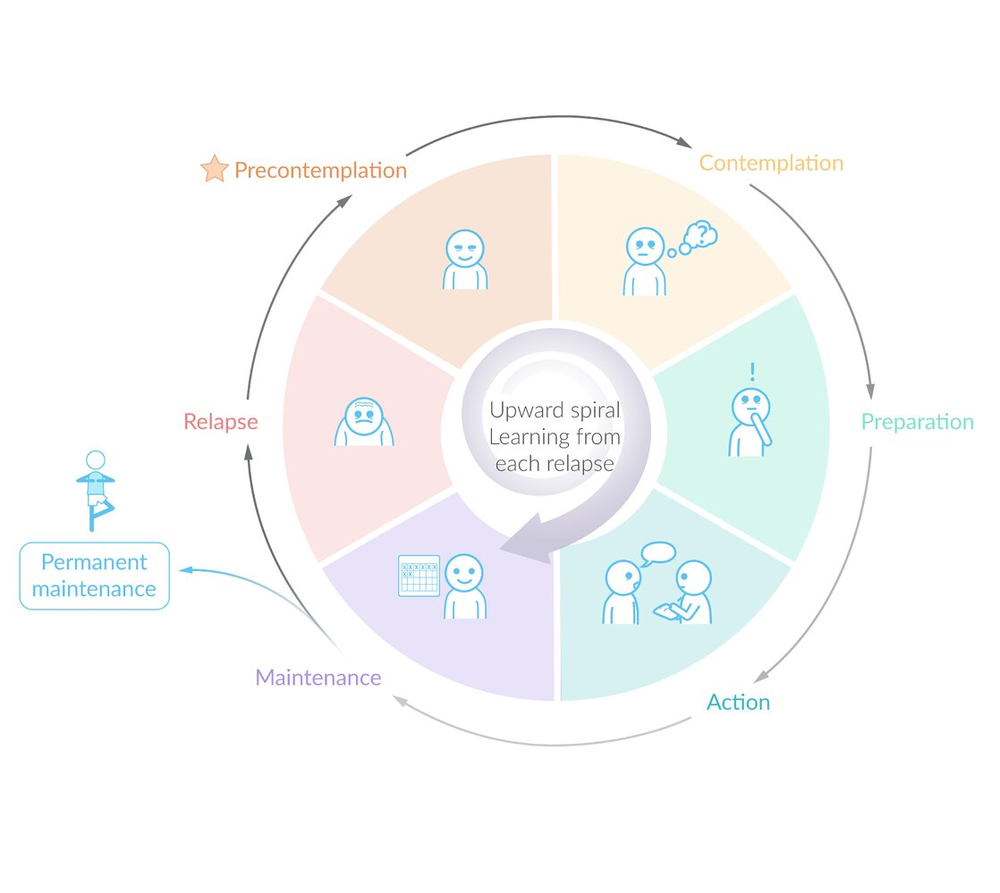

# Patient communication and counseling

*Categories: Clinical knowledge > Legal medicine and professionalism > Patient communication and counseling*

[Original Article Link](https://coursology-qbank.com/amboss/article/3K0STS)

---

## Summary

<u>Patient counseling</u> is the process of providing information, advice, and assistance to patients to improve their health, <u>treatment adherence</u>, and quality of life. A <u>patient-centered approach</u> facilitates and improves <u>the patient-clinician relationship</u> and communication. This approach is based on open communication and <u>shared decision-making</u>. Health care decisions should be discussed using understandable terms and straightforward language. If there is a language barrier, medical interpretation services should be provided to the patient. For counseling and communication in specific circumstances, see the individual sections below.

---

## General concepts of patient counseling

### Key principles of communication and counseling [[1]](https://coursology-qbank.com/amboss/article/qIXCdz)[[2]](https://coursology-qbank.com/amboss/article/s7XtMz)

* Patient counseling: the process of providing information, advice, and assistance to patients to improve their health, <u>treatment adherence</u>, and quality of life (see also “<u>Treatment adherence</u>” in “<u>Managing chronic conditions</u>”).

* Establishing the patient-clinician relationship [[1]](https://coursology-qbank.com/amboss/article/qIXCdz)

* Patients may feel vulnerable and have a fear of rejection/<u>apathy</u> from caregivers.

* A patient's first visit is critical to the patient-clinician relationship (e.g., establishing trust).

* Empathy, interest, and continuity of care are valued by patients.

#### Patient-centered approach

* Objectives

* Open communication between the patient and the provider, <u>shared decision-making</u>, and a shared goal of alleviating discomfort for the patient (see also “<u>Decision-making capacity</u> and <u>legal competence</u>” in “<u>Principles of medical law and ethics</u>”)

* Takes into account the patient's individual preferences, concerns, and emotions

* Outcomes are measured and monitored (e.g. <u>pain</u> level, functional status)

* Used to optimize care of chronic conditions that include multiple management strategies (e.g., <u>pain management</u>, cancer therapy). The patient can select those treatments which are best aligned with the patient's priorities.

* Interviewing communication techniques

* Introduction and building rapport

* Begin by introducing yourself to the patient and any accompanying person

* Address patients by their preferred name and pronoun if provided in the intake form. Respect patient preferences communicated during the interview.

* Seat yourself at <u>eye</u> level with the patient.

* Introduce any further health care workers present at the visit.

* Family, friends, and caregivers commonly accompany patients to health care visits. This can have benefits (e.g., emotional support for the patient, providing additional information about the patient's health, facilitating communication between the patient and clinician), but may also present challenges (e.g., the accompanying person interfering with the course of the interview).

* In patients with <u>decision-making capacity</u> who are accompanied by another person, verbally confirm that the patient understands that you will be discussing personal health matters and that they agree to this confidential information being shared with the accompanying person.

* Request that any accompanying persons leave the room if the patient indicates they would prefer them to.

* Avoid interrupting the patient during the interview and <u>listen actively</u>. Be polite if you have to interrupt the patient, e.g., due to time constraints.

* Identify the purpose(s) of the visit early in the interview and structure the interview in collaboration with the patient.

* Use <u>open-ended questions</u> to determine the purpose of the visit (see table below) .

* Give the patient space to freely express their concerns.

* Ask <u>close-ended questions</u> to collect specific information about the <u>chief concern</u> (e.g., “Where does it hurt”, “Is it a sharp <u>pain</u>?”).

* Ask the patient if they have any additional concerns until you feel all concerns have been addressed (e.g., “Is there anything else you would like to discuss?”).

* Prioritize the patient's concerns based on preference and/or medical urgency.

* Negotiate the agenda for the visit with the patient if there are many concerns to address within the scheduled timeframe. Offer to discuss remaining concerns at a follow-up visit (e.g., “Since our time is limited, let us quickly discuss which of these concerns to prioritize,” “You have expressed concern about your <u>cholesterol</u> levels and <u>high blood pressure</u>; if it's okay with you, I would prefer we looked at the <u>rash</u> on your leg first and perhaps schedule a follow-up appointment to discuss your other concerns?”).

* Make an effort to elicit, understand, and relate to the patient's concerns and expectations (e.g., “Do you have any thoughts on what might be the cause for your <u>high cholesterol</u> levels?,” “Does your condition cause you any particular difficulties?,” “What is currently your main health concern?”).

* Show interest, compassion, and empathy for the patient's concerns to affirm the legitimacy of the patient's point of view (e.g., “I can see how this might make you feel anxious,” “I'm here to help you any way I can”).

* Understanding a patient's culture and the unique needs that may come with it are a vital part of providing quality health care.

* Consider whether a patient's culture, religion, or spirituality may affect examination and/or treatment.

* Consider barriers to health care experienced by minority and migrant populations.

* Be open to cultural differences and do not hesitate to involve the patient in closing your gaps of knowledge if this is relevant to the examination and/or treatment.

* <u>Open-ended questions</u> provide a good means of bridging cultural gaps (see table below).

* See also “<u>Migrant and refugee health</u>.”

* Summarize information provided by the patient to ensure it has been understood correctly.

* Show that you respect and value the patient's questions and that you consider them valid throughout the interview.

* Provide information on the (working) diagnosis and treatment options.

* Assess the patient's knowledge and understanding of the illness.

* Assess the patient's preference for information (e.g., “How much information would you like to receive at this time?”, “Do you prefer to receive the information in stages or all at once?”)

* Provide reassurance to reduce and address fear or <u>anxiety</u> regarding a diagnosis or treatment.

* Assess the patient's hopes, fears, and expectations regarding a proposed treatment to ensure that there are no misunderstandings and to help provide the appropriate emotional support.

| Examples of open-ended interview questions |  |
| --- | --- |
| Context | Question |
|  * The patient's perspective on the concern   |  * “How would you describe the concern in your own words?”   |
|  * The patient's perception of factors leading to the concern   |  * “Why do you think you are experiencing these symptoms?”   |
|  * The patient’s background and how it affects their concern   |  * “What improves or worsens your symptoms?”   |
|  * Treatment plan and follow-up   |   * “Do you have any concerns about the current plan of treatment?”  * “Do you have any suggestions regarding your current plan of treatment?”  * In patients reluctant to follow standard treatment: “Would you be open to combining alternative treatment plans with the standard medical treatment?”    |
|  * Possible <u>barriers to care</u>   |  * “Is there anything that would prevent you from seeking care in a standard medical institution?”   |

#### PEARLS model

* Definition: a psychosocial model that aims to help caregivers express empathy and support emotions in order to build a trusting relationship with patients

* Components

* Partnership: Reassure the patient of your commitment to the collaborative goals, offer resources.

* Empathy: Acknowledge and validate the patient's emotions.

* Apology: Take responsibility if appropriate (e.g., for a long waiting time).

* Respect: Commend constructive patient behavior (e.g., attending a doctor's appointment, remaining optimistic).

* Legitimization: Validate and acknowledge the patient's emotions (e.g., frustration, anger).

* Support: Offer and ensure support.

#### Language

* General considerations

* Avoid judgemental or defensive language or behavior.

* Discuss health care decisions with patients in relatable terms (e.g., avoid medical jargon, tailor language to the patient).

* Language barriers

* Ask the patient questions to assess language proficiency before starting an interview.

* If there is a language barrier between the patient and caregiver, establish the patient's preferred language and use a professionally trained medical interpreter.

* Spoken interpretation services are available in person, via video call, or telephone.

* <u>Deaf</u> patients or patients with <u>hearing</u> impairment should be offered a medical interpreter trained in <u>American Sign Language</u>. Other communication options include computer-assisted real-time <u>transcription</u> and <u>assistive listening devices</u>.

* Having a family member interpret should be avoided unless it is the patient's wish (in which case, this should be recorded in the patient's chart).

* A professionally trained medical interpreter should be present even if the appointment is limited to a <u>physical examination</u>.

* Interpretation by nonqualified individuals (e.g., family members, medical staff) may be necessary in certain (e.g., emergency) situations in which delaying care in order to access interpreter services might result in patient harm.

* Interviewing techniques when an interpreter is present

* Introduce the interpreter to the patient.

* Position of the interpreter 

* Spoken language: slightly behind or next to the patient

* Sign language: behind the clinician

* Address the patient, not the interpreter, and maintain <u>eye</u> contact.

* Avoid third-person statements; , keep phrases short, and ask one question at a time.

* Use <u>teach back method</u>

* Allow extra time for the interview.

### Psychosocial counseling

* Definition: care related to the emotional and psychological well-being of the patient and their family members.

* Principles

* Aims to reduce both psychological <u>distress</u> and physical symptoms by increasing quality of life and enhancing coping (e.g., identify and treat <u>anxiety</u> and <u>depression</u>)

* Based on good communication, assessment, and interactional skills (e.g., compassion, empathy) to build a rapport with the patient and their family.

* Encourages patients to express their feelings about the disease (e.g., consequences, relationships, self-esteem issues)

* Provides psychological and emotional well-being tools for patients and their caregivers

### Enabling behavioral change

* Patients should be encouraged to participate in treatment and therapy decisions.

* <u>Shared decision-making</u> enables patients to make informed choices.

* <u>Motivational interviewing</u> can be a helpful tool to strengthen a patient's motivation to change behavior (e.g., <u>substance use disorders</u>, lifestyle changes).

* Aims to explore and resolve ambivalence about changing behaviors by eliciting the patient's reasons for change

* Helps to assess the barriers that make behavioral change difficult for the patient

#### Transtheoretical model of behavioral change

* Definition: a <u>biopsychosocial model</u> that focuses on an individual's intentional change of behavior

* Objectives

* To assess an individual's readiness to modify a certain behavior

* To provide strategies to guide the individual, e.g., in overcoming <u>substance use disorder</u>, managing weight, adhering to medication

| Stages of behavioral change |  |  |
| --- | --- | --- |
|  | Patient behavior | Interviewing techniques |
| Precontemplation stage |  * Denies or is unaware of the problem and its consequences   |   * Encourage introspection by asking open, probing, and nonjudgmental questions that explore the patient's perception of the situation.  * Emphasize your availability and the importance of follow-up visits.  * Demonstrate the discrepancy between the patient's personal goals and values and current behavior.    |
| Contemplation stage |  * Aware of the problem but unwilling to change it   |   * Discuss the benefits and disadvantages of the patient's current behavior.  * Use a readiness-to-change scale to determine the patient's motivation to change (e.g., “On a scale of 1 to 5, how ready are you to lose weight?”) [[3]](https://coursology-qbank.com/amboss/article/kqcmAW0)  * After the patient states a number, ask the patient why they picked this number rather than a lower one.  * This approach applies the <u>framing effect</u> to an individual's <u>decision matrix</u>.  * It encourages the patient to reflect and focus on the disadvantages of the current state and the benefits of change (instead of the benefits of the current state and disadvantages of change), thereby enabling further discussion on the reasons to embrace change.  * Suggest possible ways to support behavior changes.    |
| Preparation stage |  * Preparing to make a change   |   * Help to set achievable goals and provide resources.  * Encourage changes and adjust expectations as necessary.  * Use <u>motivational interviewing</u>.    |
| Action stage |  * Demonstrates a change in behavior   |   * Help to maintain change by collaboratively developing <u>coping strategies</u> (e.g., identifying/avoiding triggers) and self-help strategies.  * Emphasize positive changes that have been made.  * Acknowledge difficulties.    |
| Maintenance stage |  * Maintains behavioral changes and integrates them into lifestyle   |   * Support and praise ongoing positive changes.  * Assess the risk for relapse.  * Provide support, encouragement, and reinforcement.    |
| Relapse stage |  * Behavioral changes are reversed.   |   * Reassure the patient of ongoing support, availability, and the possibility of change.  * Encourage a return to prior behavioral changes.  * Help the patient to learn from the relapse.    |

Transtheoretical model of behavioral change

#### 5 As model of behavior change

* Definition: an evidence-based behavioral intervention strategy originally developed for <u>smoking cessation</u> that can be adapted for multiple behaviors and health conditions to help individuals with intentional behavior change [[4]](https://coursology-qbank.com/amboss/article/-IXD2z)[[5]](https://coursology-qbank.com/amboss/article/ZrXZfz)

* Components

* Assess the patient's behavior, beliefs, knowledge, and level of motivation.

* Advise the patient on personal health risks and the benefits of change.

* Agree on appropriate treatment goals and methods (<u>shared decision-making</u>).

* Assist the patient to identify personal barriers, create self-help strategies, access social or environmental support for behavioral change, and supplement with adjunctive medical treatments if appropriate.

* Arrange specific plans for follow-up support to provide ongoing support and adjust the treatment if necessary.

#### Directive counseling (prescriptive counseling) [[6]](https://coursology-qbank.com/amboss/article/m7cVmd0)[[7]](https://coursology-qbank.com/amboss/article/6Icjdd0)[[8]](https://coursology-qbank.com/amboss/article/pIcLdd0)

* Definition: an approach to counseling in which the clinician assumes an active role in guiding the therapeutic process along lines that they consider relevant and in the best health interests of the patient

* Principles

* While providing <u>directive counseling</u>, the clinician should:

* Provide information objectively and ensure that there is no element of duress, <u>coercion</u>, or manipulation in guiding the therapy.

* Keep in mind that patient <u>autonomy</u> always takes precedence and that patients with <u>decision-making capacity</u> can refuse to follow the clinician's recommendations.

* Examples of situations in which <u>directive counseling</u> is applicable include:

* The patient is making a decision (e.g., due to knowledge deficit or wrong beliefs) that is detrimental to their own well-being (e.g., opting for a home <u>birth</u> when it is contraindicated, opting for home remedies to treat early-stage cancer, continuing to drive despite being unfit to do so)

* The patient requests a test or treatment that is inappropriate or ineffective.

---

## Counseling on substance use disorders

See also “<u>Substance-related and addictive disorders</u>” for more information.

### SBIRT approach [[9]](https://coursology-qbank.com/amboss/article/6HXjrz)

Screening, brief intervention, referral to treatment

* Aims to enable early intervention for patients with, or at risk of developing, <u>substance use disorders</u>

* Used in primary care centers, emergency rooms, or <u>trauma centers</u>

* Brief intervention is used to increase insight and awareness regarding substance use and to motivate behavioral change.

* Referral to specialty care ensures more extensive treatment.

### Techniques for <u>counseling on substance use disorder</u>

* <u>Motivational interviewing</u>

* <u>Transtheoretical model of behavioral change</u>

* <u>5 As model of behavior change</u>

### General principles of addiction counseling

* Can be individual or group counseling (e.g., <u>Alcoholics Anonymous</u>)

* Includes patient education

* Aims to help patients avoid people or situations that might trigger substance use

* May also incorporate cognitive, behavioral, and/or supportive <u>psychotherapies</u> (see “<u>Psychotherapy and defense mechanisms</u>”)

---

## Counseling on smoking cessation

See also “<u>Tobacco product use and smoking cessation</u>.”

### 5 As model of behavior change for smoking cessation

* Ask: Inquire about and document the use of tobacco.

* Advise: Urge quitting with clear and personalized language.

* Assess: Assess the patient's willingness to quit.

* Assist: Provide resources to help the patient quit.

* Arrange: Schedule regular follow-ups.

> [!TIP]
> Smoking is the single greatest preventable <u>cause of death</u> in the US, regardless of age at the time of quitting or the number of previous <u>pack years</u>. [[10]](https://coursology-qbank.com/amboss/article/lHXvqz)

---

## Counseling on alcohol use disorder

* Provide feedback to the patient regarding their level of <u>alcohol</u> consumption and engage the patient in a conversation using reflective or <u>motivational interviewing</u>

* Inform the patient about psychosocial support groups (e.g., <u>Alcoholics Anonymous</u>).

* Inform the patient about pharmacological treatment options (e.g., <u>naltrexone</u>, <u>disulfiram</u>).

* Assess the patient's readiness to change by using the <u>transtheoretical model</u>, and schedule regular follow-ups.

---

## Counseling on illicit drugs

* Engage the patient in a conversation using reflective or <u>motivational interviewing</u>

* Provide feedback to the patient regarding their level of drug consumption.

* Assess the patient's readiness to change by using the <u>transtheoretical model</u> and schedule regular follow-ups.

---

## Counseling on the use of prescription opioids

* Inform patients about the possibility of <u>opioid intoxication</u>, addiction, adverse effects, and <u>opioid withdrawal</u> (see “<u>Opioid intoxication</u> and withdrawal”).

* Educate patients on buying <u>opioids</u> only from licensed pharmacists and stores.

* <u>Stress</u> that patients should take <u>opioids</u> exactly as prescribed and that they should not use <u>opioids</u> prescribed for someone else.

* Patients should avoid mixing <u>opioids</u> with any other drugs, especially <u>alcohol</u> or sedatives (e.g., <u>benzodiazepines</u>).

* Establish specific <u>SMART goals</u> for <u>opioid therapy</u>.

* <u>Opioids</u> should be stored in their original containers, out of sight/reach of children.

* Clinicians should address suspected <u>opioid</u> misuse in a nonjudgmental, collaborative discussion with the patient that aims to understand the reasons for misuse.

---

## Counseling on lifestyle modifications

* Lifestyle modifications involve altering long-term habits, and adopting and maintaining healthier behaviors.

* Lifestyle modifications can be used to treat a wide range of conditions (e.g., cardiovascular diseases, <u>obesity</u>).

* Cardiovascular diseases are the leading <u>cause of death</u> in the US for both men and women.

* In one hour, approx. 83 people in the US die from <u>heart</u> disease and <u>stroke</u>.

* More than 25% of these deaths could have been prevented or delayed by <u>lifestyle modifications for ASCVD prevention</u> that help control <u>modifiable risk factors for ASCVD</u> and promote healthier behaviors (e.g., <u>smoking cessation</u>, regular exercise).

* See “<u>Primary prevention of ASCVD</u>” and “<u>Management of ASCVD</u>” for more information.

* Many people in the US are affected by <u>sleep disorders</u> (e.g., <u>insomnia</u>) or insufficient <u>sleep</u>. [[11]](https://coursology-qbank.com/amboss/article/MHXMIz)

* Insufficient <u>sleep</u> has been linked to the development of chronic diseases (e.g., <u>type 2 diabetes</u>, cardiovascular disease, <u>obesity</u>, <u>depression</u>).

* <u>Sleep hygiene</u> interventions target behavioral habits that negatively impact <u>sleep</u>.

* See “<u>Sleep and sleep disorders</u>” for more information.

* The <u>prevalence</u> of <u>obesity</u> in the US is approx. 42% and has been increasing substantially in the past decades, and behavior modification is a cornerstone of therapy. [[12]](https://coursology-qbank.com/amboss/article/mHXVIz)

Reference:[[10]](https://coursology-qbank.com/amboss/article/lHXvqz)

---

## Counseling on nutrition and regular exercise

See also “<u>Lifestyle modifications for ASCVD prevention</u>” and “<u>Management of overweight and obesity</u>” as needed.

### Counseling on nutrition [[13]](https://coursology-qbank.com/amboss/article/acWQa40)[[14]](https://coursology-qbank.com/amboss/article/mv1V0Q0)[[15]](https://coursology-qbank.com/amboss/article/BIdzUr0)[[16]](https://coursology-qbank.com/amboss/article/I8XYL-)

* Recommend a well-balanced diet; no specific diet is preferred over another.

* In general, diets containing legumes, whole fruits, a variety of vegetables, whole grains, nuts, seeds, and lean animal protein (e.g., fish) are associated with the most health benefits.

* Limit consumption of processed foods, refined grains, red meat, added sugars (e.g., in sweetened beverages), and <u>alcohol</u>.

* Advise against skipping meals.

* Discuss healthy portion sizes (e.g., the plate method).

* Encourage recommended daily <u>micronutrient</u> intake.

### Counseling on regular exercise [[15]](https://coursology-qbank.com/amboss/article/BIdzUr0)[[16]](https://coursology-qbank.com/amboss/article/I8XYL-)[[17]](https://coursology-qbank.com/amboss/article/ewdx3H0)

* General principles

* Recommend minimizing sedentary behavior and screen time.

* Tailor the physical activity or sport to individual preferences to increase the likelihood of adherence.

* If unable to meet the minimal recommendations, encourage at least as much moderate or vigorous physical exercise as tolerated.

* Adults

* Either of the following or a mix of both, ideally spread across several days:

* 150–300 minutes/week of <u>moderate-intensity aerobic exercise</u>

* 75–150 minutes/week of <u>vigorous-intensity aerobic exercise</u>

* <u>Muscle-strengthening exercise</u> that includes all major muscle groups ≥ 2 days/week

* Older adults: Incorporate balance training and flexibility exercises to improve or maintain functional mobility.

* Children and <u>adolescents</u> [[18]](https://coursology-qbank.com/amboss/article/5zdits0)

* 3–5 years: structured activities and/or active play of any intensity throughout the day

* 6–17 years

* ≥ 60 minutes/day of <u>moderate-intensity aerobic exercise</u> or <u>vigorous-intensity aerobic exercise</u>

* <u>Muscle-strengthening exercise</u> ≥ 3 days per week

* <u>Bone-strengthening exercise</u> ≥ 3 days per week

> [!TIP]
> Some activities fall into multiple categories (e.g., running is both aerobic and bone-strengthening, and weight-lifting is both muscle-strengthening and bone-strengthening). [[17]](https://coursology-qbank.com/amboss/article/ewdx3H0)

> [!TIP]
> <u>Regular physical activity</u> is associated with a decreased risk of several cancers (e.g., <u>colon cancer</u>, <u>breast cancer</u>, <u>endometrial cancer</u>) and cardiovascular conditions. [[15]](https://coursology-qbank.com/amboss/article/BIdzUr0)[[16]](https://coursology-qbank.com/amboss/article/I8XYL-)

### Counseling on weight management [[15]](https://coursology-qbank.com/amboss/article/BIdzUr0)[[16]](https://coursology-qbank.com/amboss/article/I8XYL-)

* Provide <u>counseling on nutrition</u>.

* Encourage patients to increase physical activity.

* Suggest including family members or friends in diet and exercise plans to enhance social support.

* Encourage regular weighing.

* Encourage patients to monitor what they eat and develop stimulus control (e.g., buying fewer calorie-rich foods).

* Set realistic goals in collaboration with the patient.

> [!TIP]
> Self-monitoring of daily weight, food intake, and exercise is associated with increased success rates and greater long-term maintenance of weight loss.

---

## Counseling on sleep hygiene and lifestyle modifications to improve mood

### Counseling on sleep hygiene

* Recommended amount of <u>sleep</u> per night [[19]](https://coursology-qbank.com/amboss/article/NrX-hz)[[20]](https://coursology-qbank.com/amboss/article/mrXV3z)

* Older adults (> 65 years): 7–8 hours

* Adults (19–65 years): 7–9 hours

* Teenagers (13–18 years): 8–10 hours

* <u>School-aged children</u> (6–12 years): 9–12 hours

* Preschool children (3–5 years): 10–13 hours

* <u>Toddlers</u> (1–2 years): 11–14 hours

* <u>Infants</u> (< 1 year): 12–15 hours

* <u>Newborns</u> (< 4 weeks): 14–17 hours

* Encourage patients to:

* Maintain a regular <u>sleep</u> schedule

* Exercise regularly

* Advise patients to avoid the following:

* Stimulants (e.g., <u>caffeine</u>, <u>nicotine</u>) in the evening

* Exposure to electronic screens before bedtime

* Naps

### Counseling on lifestyle modifications to improve mood

* Educate patients on relaxation techniques.

* Encourage regular exercise.

* Educate patients on <u>mindfulness</u> and <u>meditation</u>.

---

## Counseling on sexual health and contraception

See “<u>Counseling on sexual health</u>” in “<u>Sexual health</u>.”

---

## Counseling on support options for domestic violence

### <u>Screening for intimate partner violence</u> (<u>IPV</u>)

* At initial visits or routinely

* If a patient mentions a new intimate relationship

* At prenatal and immediate <u>postpartum visits</u>

* If a patient presents with concerning trauma or symptoms consistent with <u>IPV</u>

* Screening should be conducted using standardized questioning tools (e.g., abuse assessment screen).

### Counseling on <u>IPV</u>

* Encourage disclosure by asking direct, <u>open-ended questions</u> and ensuring <u>confidentiality</u>.

* Summarize the patient's answers back to them to make sure you have understood them correctly.

* Express empathy, validation, acknowledgment, and nonjudgmental support following disclosure of <u>IPV</u>.

* Thoroughly document the details of abuse.

* Assess the patient's willingness to take action and evaluate whether the patient is currently safe.

* The patient should be referred to a social worker or <u>domestic violence</u> advocate/hotline for advice on preparing a safety plan.

* Do not encourage patients to leave the relationship.

* Counsel and evaluate for psychological comorbidities.

* For more information on <u>IPV</u>, see “<u>Intimate partner violence</u>” and “<u>Challenging clinical and ethical scenarios</u>.”

> [!TIP]
> Clinicians should not encourage patients to leave an abusive relationship but should support them if they come to that decision on their own.

---

## Counseling for patients with memory loss and/or cognitive impairment

* Evaluate emotional stability (e.g., <u>suicidality</u>), safety risks, adequacy of supervision, and whether there is evidence of neglect.

* Clinicians should have contact information for the patient's caregiver or <u>next of kin</u>, who should be advised to determine whether the patient is adequately handling finances, medications, and other responsibilities.

### Interviewing techniques

* Use concrete, direct, and specific language.

* Provide a quiet, nondistracting space for the interview.

* Adjust questions to the patient's level of comprehension.

* Do not make assumptions about a patient's abilities (e.g., literacy).

* See “<u>Communicating with patients with disabilities</u>” below.

---

## Counseling for patients with chronic diseases and/or terminal illness

Patients with chronic/terminal diseases can feel isolated, frustrated, and/or hopeless. These patients should be counseled on <u>learning</u> how to handle difficult emotions and develop an understanding of their disease. See “<u>Grief and end-of-life counseling</u>” for more information on <u>counseling patients</u> with terminal illness.

### Counseling for chronically ill patients

* Emphasize that the patient is not alone and offer referral to support groups.

* Listen to the patient's frustrations and challenges and empathize with them; do not dismiss their concerns.

* Avoid platitudes such as “Everything will be OK” or “I'm sure you'll feel better soon.”

* Discuss why <u>treatment adherence</u> is important for slowing or reversing disease progression.

* Counsel the patient on lifestyle modifications to improve mood.

* Educate patients on <u>mindfulness</u> and <u>meditation</u>.

* <u>Spiritual counseling</u>: See “<u>End-of-life counseling</u> for patients.”

* See also “<u>Managing chronic conditions</u>” for more information.

* See also “Psychosocial models” in “<u>Overview of palliative medicine</u>” and “<u>Psychosocial counseling</u>.”

* See also “<u>Goals of care</u>.”

---

## Counseling on caregiver burnout

A type of <u>burnout syndrome</u> in long-term informal caregivers (e.g., family members or friends) that is caused by <u>stress</u> from the demands of caretaking

* Approx. 1 in 5 adults in the US are informal caregivers for at least one person with a medical condition or disability.  [[21]](https://coursology-qbank.com/amboss/article/CUWq2k0)

* For <u>burnout</u> in work-related settings, see “<u>Burnout syndrome</u>” or “<u>Clinician burnout</u>.”

### Signs of <u>caregiver burnout</u> [[22]](https://coursology-qbank.com/amboss/article/xUWE2k0)

* Emotional and/or physical exhaustion

* Anger, resentment, or frustration towards the patient

* Emotional detachment from the patient (e.g., viewing them as an object or task)

* Difficulty concentrating

* Difficulty falling and/or staying asleep

* Social withdrawal

### Assessment [[22]](https://coursology-qbank.com/amboss/article/xUWE2k0)

* Practical needs (e.g., financial resources, medical equipment and/or supplies, social support)

* Caregiver well-being

* Caregiver skills and abilities

* Relationship between caregiver and patient

* Signs of neglect and/or abuse (e.g., <u>older adult abuse</u>).

### Support

* Provide information about supportive services (e.g., educational materials, support groups, psychoeducational interventions, regional social support services).

* Encourage caregivers to look after their own health as well as the patient's.

---

## Counseling for patients following disfiguring injuries or surgeries

* Following disfiguring injuries or surgeries (e.g., <u>amputations</u>, facial injuries), patients frequently experience psychiatric <u>distress</u> and are at an increased risk for psychiatric disorders (e.g., <u>major depressive disorder</u>, <u>posttraumatic stress disorder</u>, <u>social phobia</u>).

* If a patient feels unattractive:

* Explore the patient's reaction to their condition with an open question.

* Do not give false reassurance.

* Use a <u>patient-centered approach</u> to <u>listen actively</u> to the unique concerns expressed by the patient.

* Discuss further treatment options if necessary.

Reference:[[23]](https://coursology-qbank.com/amboss/article/rHXf7z)[[24]](https://coursology-qbank.com/amboss/article/7HX47z)

---

## Counseling on sudden infant death syndrome (SIDS)

To prevent <u>SIDS</u>, clinicians should educate parents on the following measures:

* Babies should be placed to <u>sleep</u> on their backs and on a firm surface.

* If swaddling is used, recommend <u>safe sleep swaddling</u>.

* Encourage mothers to breastfeed for as long as possible.

* Avoid exposing the baby to <u>cigarette smoke</u>.

* There should be no pillows, loose bedding, or blankets in the crib where the baby sleeps.

* Avoid overheating the baby.

* The baby should <u>sleep</u> in the same room as the parents but not in the same bed.

* The use of a pacifier can also reduce the risk of <u>SIDS</u>.

For more information, see “<u>Sudden infant death syndrome</u>”.

---

## Counseling on pregnancy loss

* <u>Normal grief</u>, which may involve <u>depressed mood</u>, loss of appetite, and <u>insomnia</u>, is a normal reaction to <u>pregnancy loss</u>.

* <u>Pathological grief</u> reactions include <u>bereavement</u>-related <u>major depressive disorder</u> and <u>prolonged grief disorder</u>

* Patients who undergo <u>termination of pregnancy</u> for medical reasons also commonly experience <u>grief</u> reactions.

* For more information, see “<u>Bereavement and grief</u>.”

### Approach [[25]](https://coursology-qbank.com/amboss/article/Dr11jR0)[[26]](https://coursology-qbank.com/amboss/article/wr1hjR0)

* <u>Patient-centered care</u>: focus on the uniqueness of each family rather than a standardized approach.

* Be sensitive to the diversity and individuality of <u>grief</u>.

* Show respect for the deceased child.

* Be sensitive to sociocultural diversity and supportive of the patient processing their loss according to their beliefs and customs.

* Create an empathetic and caring environment, especially with regard to verbal and nonverbal expression (e.g., <u>active listening</u>, using supportive silence and <u>eye</u> contact when appropriate, compassionate communication).

* Express empathy and acknowledge patient <u>grief</u>.

* Provide privacy and emotional support.

* Offer contact between parents and the <u>stillborn</u> baby after delivery.  [[27]](https://coursology-qbank.com/amboss/article/6XWj_P0)[[28]](https://coursology-qbank.com/amboss/article/oXW0_P0)

* Educate individuals about <u>psychotherapy</u> options and support groups.

* Offer reproductive life-plan counseling.

* Educate individuals affected by <u>pregnancy loss</u> about potential causes and the options for future <u>family planning</u> available to them.

* Empower affected individuals to make informed decisions (e.g., concerning the mode of <u>birth</u>, whether or not to have an <u>autopsy</u> or further genetic analyses).

* For further information on questions of pathophysiology and etiology, see “<u>Pregnancy loss</u>.”

---

## Communicating with transgender and gender-diverse patients

See “<u>Affirmative care</u>” in “<u>Sexuality and sexual medicine</u>”.

---

## Communicating with patients with disabilities

### General principles [[29]](https://coursology-qbank.com/amboss/article/5sXivz)

* Use a normal tone of voice and talk directly to the patient.

* Caregivers accompanying the patient may provide additional information if necessary.

* Ask the patient if they need assistance; do not assume help is needed.

* When communicating with family members or caregivers, apply person-first language, e.g., “a person with a disability” instead of “the disabled (person).”

* Make <u>eye</u> contact.

* If a <u>physical examination</u> is necessary, do not miss any relevant components.

* Only address the patient's disability if it is relevant to the visit.

### Communicating with patients who have <u>hearing loss</u> [[29]](https://coursology-qbank.com/amboss/article/5sXivz)

* Ask the patient about their preferred means of communication (e.g., sign language, <u>lip reading</u>).

* Allow extra time for the interview.

* Make use of visual/tactile signals to maintain the patient's attention.

* Offer a medical interpreter trained in <u>American Sign Language</u>. Other communication options include computer-assisted real-time <u>transcription</u> and <u>assistive listening devices</u>.

* Ensure that your <u>lips</u> are visible to the patient; if <u>droplet precaution</u> measures are necessary, a transparent <u>surgical mask</u> should be worn. [[30]](https://coursology-qbank.com/amboss/article/kAcmPU0)

* See “Interviewing techniques when an interpreter is present” in “<u>General concepts of patient counseling</u>” above.

### Communicating with patients who have speech difficulties [[29]](https://coursology-qbank.com/amboss/article/5sXivz)

* If you have difficulties understanding a patient, ask them to write down the information.

* Repeat information provided by the patient to ensure correct interpretation and/or understanding.

* Eliminate background noise and distractions.

---

## Trauma-informed communication

### Behavioral health screenings for patients with a history of trauma

* Substance use

* Social support

* <u>Suicide</u> risk

* Trauma-related symptoms interfering with social/occupational function

### Interviewing techniques [[31]](https://coursology-qbank.com/amboss/article/msXVvz)

* Avoid asking the patient to repeat their trauma history (review the patient's chart instead)

* Emphasize <u>confidentiality</u>.

* Inform the patient about what to expect during the <u>history taking</u> and, if relevant, during a <u>physical examination</u>.

* If the patient requires a <u>physical examination</u>, inform them beforehand that they determine the pace and/or continuation of the examination and can signal at any time if there is emotional or physical discomfort.

* Ask the patient for permission before conducting each part of the <u>physical examination</u>.

* Let the patient know that they can have one or more friend or family member present in the room for support.

* Follow-up counseling should be offered and advised if necessary.

### The 4 R's of trauma-informed care

* Realize the widespread impact of trauma and understand the potential paths to recovery.

* Recognize the signs and symptoms of trauma in patients, families, staff, and others involved with the system.

* Respond by fully integrating knowledge about trauma into policies, procedures, and practices.

* Avoid Retraumatization.

---

## Culture in the health care setting

### Culture as an aspect of health and medicine

* Culture is the set of ideas, social behaviors, and customs shared by a group of people as a defining factor of their social cohesion. Manifestations such as religion, ethnicity, language, and nationality can be regarded as elements of culture as well as cultures in their own right.

* Culture shapes people's perceptions of and views on health, disease, and medicine.

* Accordingly, culture also shapes the way people experience and manifest symptoms as well as how they express the experience of symptoms.

#### Cultural concepts of distress

* The interaction between health and medicine in a specific cultural context can give rise to <u>cultural concepts of distress</u>, which refers to cultural idioms, explanations, or conditions that individuals from the corresponding culture use to describe and contextualize symptoms (see below for details).

* Such descriptions may have no correspondence to concepts of evidence-based medicine, making diagnosis and treatment difficult.

* To avoid misdiagnosis and provide the best possible care, clinicians should be aware of the patient's cultural background. This is best done with the help of a <u>cultural formulation interview</u>.

#### Types of <u>cultural concepts of distress</u>

* Cultural explanations/perceived causes of <u>distress</u>: culture-specific etiological models for symptoms, illness, or <u>distress</u>. Such models may be founded on traditional medicine as well as cultural manifestations such as folklore, religion, and diet.

* Cultural idioms of <u>distress</u>: culture-specific expressions for symptoms or states of <u>distress</u>

* Cultural syndromes: <u>clusters</u> of psychiatric and/or somatic symptoms that occur exclusively in a specific culture or context and are generally recognized as medical conditions in the respective communities

##### Examples of <u>cultural syndromes</u>

* Ataque de nervios (“<u>attack of nerves</u>”)

* An acute syndrome among individuals of Iberian origin or descended cultures (e.g., Hispanic, Caribbean) characterized by intense emotional <u>distress</u> (typically <u>anxiety</u>, anger, or <u>grief</u>) and a sense of losing control

* Symptoms include uncontrollable screaming and crying, trembling, verbally and/or physically aggressive behavior, <u>palpitations</u>, chest tightness, <u>breathlessness</u>, a sensation of heat rising up to the head, sweating, fainting, dissociative experiences (e.g., <u>amnesia</u>, <u>depersonalization</u>), and <u>seizure</u>-like episodes.

* Typically precipitated by stressful events in the family (e.g., <u>death</u>, divorce, accidents, conflict) or, less commonly, the accumulated experience of suffering

* Manifestations may resemble <u>panic attacks</u>, specific or unspecific <u>dissociative disorders</u>, and <u>conversion disorder</u>.

* Khyal cap (“<u>wind attack</u>”)

* An acute syndrome among Cambodian individuals and those of Cambodian descent characterized by symptoms of <u>panic attacks</u> (e.g., <u>palpitations</u>, <u>tachycardia</u>, <u>anxiety</u>) and autonomic arousal (e.g., neck soreness, <u>tinnitus</u>)

* Attributed to disruptions of the flow of khyal (a form of inner “wind” comparable to air and pneuma in classical <u>humoral</u> theory) in the body.

* Often meets the criteria of <u>panic attacks</u> and may be associated with <u>PTSD</u>  [[32]](https://coursology-qbank.com/amboss/article/KPcUfc0)

* Taijin kyofusho (“disorder of fear of interpersonal relations”)

* A syndrome among Japanese individuals and those of Japanese descent characterized by social <u>anxiety</u> about and the avoidance of interpersonal relations due to a sense of inadequacy or feeling that one's actions or appearance may be offensive to others

* Social situations or their anticipation may trigger <u>panic attacks</u>.

* Manifestations may meet the criteria of <u>social anxiety disorder</u>, <u>body dysmorphic disorder</u>, and <u>delusional disorder</u>.

* Dhat syndrome (“semen loss”)

* A broad range of symptoms seen in South Asian male individuals and those of South Asian descent characterized by fear attributed to the loss of “dhatu,” one of the seven essential bodily humors in Ayurvedic medicine (generally equated with semen).

* Common manifestations include fatigue, <u>anxiety</u>, <u>erectile dysfunction</u>, weight loss, and depressive mood in absence of any physiological dysfunction.

### Cultural considerations in clinical care

* A patient's cultural background may influence their views on health and health care and affect their preferences and decisions regarding treatment.

* Such preferences and decisions may conflict with standard clinical practice and/or clinician values.  [[33]](https://coursology-qbank.com/amboss/article/jFX_3-)[[34]](https://coursology-qbank.com/amboss/article/ptXLe-)

* Clinicians should make an effort to understand and accommodate cultural differences with their patients' best health interests in mind.

* Clinicians should not provide treatments that they believe are unethical or harmful, regardless of any cultural concerns.

* Clinicians should respect the cultural values and precepts of their patients and tailor the clinical approach accordingly. [[35]](https://coursology-qbank.com/amboss/article/QFXu3-)

* A direct conversation with the patient about their cultural background can help to improve mutual understanding. [[33]](https://coursology-qbank.com/amboss/article/jFX_3-)[[35]](https://coursology-qbank.com/amboss/article/QFXu3-)

* An interpreter should be involved if there is a language barrier between a clinician and a patient (see “<u>General concepts of patient counseling</u>” in “Patient communication and counseling” for more information about the use of interpreters).

* If needed, social workers, <u>chaplains</u>, or team members with the same cultural background may be involved in the conversation.

* Clinicians may not override a capable patient's wish to refuse treatment, even if the wish is motivated by cultural precepts that conflict with standard clinical practice. However, clinicians may offer education to convince patients to reconsider refusing treatment, recommend against treatments they believe are ineffective, and refuse treatments that they believe are harmful or unethical.

* Cultural formulation interview

* A set of questions asked during a mental health examination in order to assess a patient's perception and experience of psychiatric symptoms within their cultural context, including <u>cultural factors</u> that influence the way the patient perceives the manifestation and cause of the <u>distress</u> as well as the actions they take to resolve <u>distress</u>

* Promotes clinician-patient communication, helps avoid linguistic and/or cultural misunderstandings, enhances the patient's cooperation during the mental health examination, increases the <u>accuracy</u> of diagnosis and therapeutic planning, and helps bridge any cultural differences between the clinician and the patient that may hinder treatment

---

## Genetic counseling

* In the US, <u>genetic counseling</u> is provided by specially trained professionals called “genetic counselors.”  [[36]](https://coursology-qbank.com/amboss/article/9IcNUd0)

* All the principles of <u>medical ethics</u> apply also in <u>genetic counseling</u>.

### Purposes

* Providing families information about the nature of a genetic disease and/or predisposition to a <u>multifactorial disease</u> with a strong genetic influence (e.g., <u>type 2 diabetes mellitus</u>, certain types of cancer)

* Discussing possible risks and benefits of <u>genetic testing</u>

* Performing and interpreting genetic tests

* Supporting individuals to make informed choices about their reproductive options (for more information, see “<u>Preconception counseling</u>”)

* Counseling on treatment of genetic diseases

* Helping individuals and their families cope with the psychological burden of a genetic disorder

### Responsibilities of genetic counselors [[37]](https://coursology-qbank.com/amboss/article/xIcEUd0)

* Discussing the risks and benefits of <u>genetic testing</u> with patients

* Screening for genetic conditions in certain populations (e.g., for <u>Tay-Sachs disease</u> in <u>Ashkenazi</u> Jewish individuals)

* Genetic risk assessment (e.g., for certain types of cancer)

* Diagnostic testing in individuals suspected of having a genetic disorder

* Preimplantation testing (possibly in the setting of assisted reproduction)

* Interpretation of test results

* Educating individuals and families with a genetic disease and/or a predisposition to a <u>multifactorial disease</u> with a strong genetic influence (e.g., <u>type 2 diabetes mellitus</u>, certain types of cancer) about the nature of the disease

* Counseling on the management of a genetic disease

* Helping individuals and families cope with the psychological burden of a genetic disorder

### Types

* Pre-test counseling: focuses on evaluating the need for a test and informing the patient about the purpose of testing, details of the test (e.g., its strengths and limitations), possible consequences of testing, and obtaining <u>informed consent</u>

* Post-test counseling: focuses on delivering the test results, providing education about the disease, discussing management options, providing psychological support

### Elements of a <u>genetic counseling</u> session

* Taking a history of the disorder and <u>family history</u>

* <u>Pedigree analysis</u> (if applicable)

* Discussing the appropriate genetic test (see “<u>Genetic testing</u>” for indications for individual genetic tests)

* Obtaining <u>informed consent</u> for <u>genetic testing</u>: A patient should be informed about the benefits and risks of <u>genetic testing</u>, possible findings <u>genetic testing</u> can reveal, and the ways the obtained information may influence disease or risk management.

* Result disclosure and discussion

* Psychological support

References:[[38]](https://coursology-qbank.com/amboss/article/CIcqUd0)[[39]](https://coursology-qbank.com/amboss/article/BIczUd0)

---

## Counseling on complementary and alternative medicine

* Explore the patient's reasons for requesting complementary and alternative treatment.

* Discuss the risks and benefits of these treatments.

* Be open to integrating modalities with proven safety and <u>efficacy</u>.

* Consider referral to an appropriate complementary or alternative medicine provider.

---

## Counseling on clinical uncertainty

### Patient is uncertain about a certain treatment/diagnostic step

* Acknowledge the degree of uncertainty.

* Convey the potential seriousness of the situation.

* Include an individualized discussion of differential diagnosis based on known facts of the case.

* Explain the need for further evaluation.

* Include a clear plan for follow-up.

* Allow the patient an opportunity to ask questions.

### Patient declines a recommended treatment/diagnostic step

* Provide accurate and complete information on the procedure.

* Provide a balanced assessment of the recommended intervention, including benefits, risks, and limitations.

* A thorough explanation of further medical steps and plans can reinforce patient <u>autonomy</u> and improve decision-making.

---